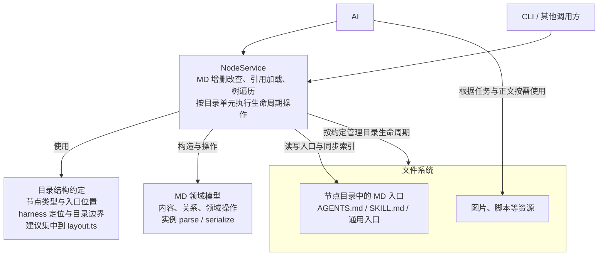
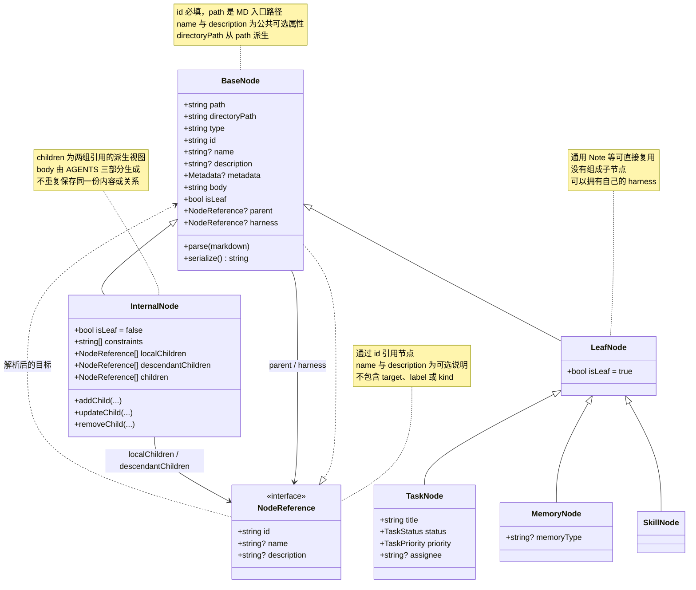
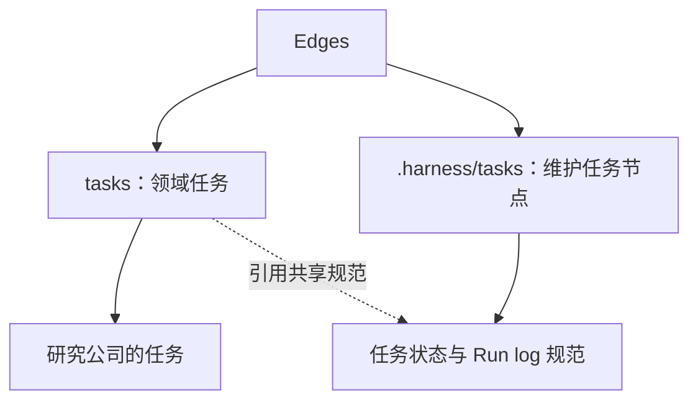
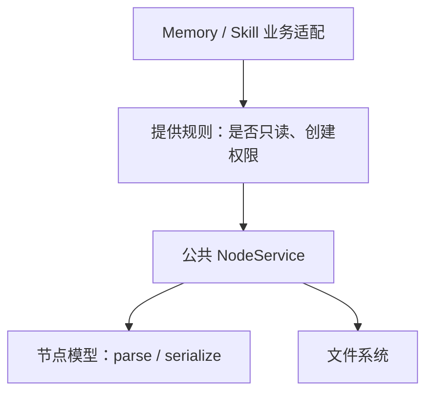
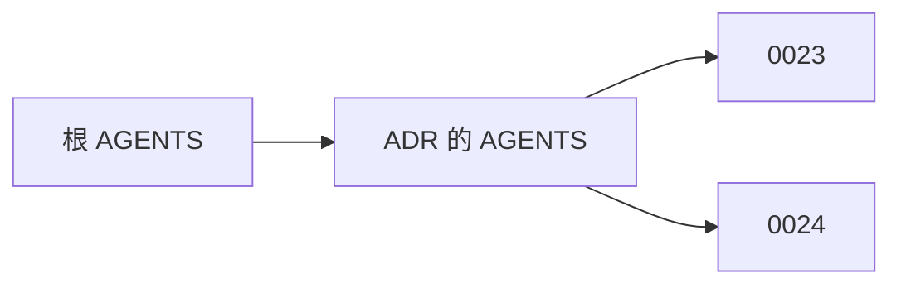

# 递归节点重构：八项执行选择讨论稿

日期：2026-10-05。实现基线：PR #161，`726b268`。

本文保存本轮对话中的说明、具体例子和架构图，供后续逐项讨论。文中的文件名为示意，当前行为对应上述实现基线；替代方案尚未采用。

**状态：八项讨论均已收口，以各项后续用户确认与纠正为准。前面的旧实现和被替代提案保留为讨论过程，不代表仍有效。新模型、Service、CLI 和目录迁移工具已实现并通过分阶段审查；真实公开内容迁移及总体验收进行中，进度以实施计划为准。**

“执行中的裁定”指总体方向已定、细节尚无唯一答案时，实施者补上的具体选择。“改变成本”分别考虑代码、调用方、已有文件与引用，不表示这些选择不可撤销。

## 讨论进度

- [x] 1. 先实现模型，再恢复记忆归属
- [x] 2. 普通目录入口、创建默认值与旧内容转换（设计讨论收敛，未完成新实现或数据迁移）
- [x] 3. 原 Tasks 的 8 条共享记忆归属（逐条审阅完成；部分迁移与整理已执行）
- [x] 4. NodeService 的业务适配规则（节点多态与方法集已确认，参数类型待 spec 细化）
- [x] 5. 改归属、移动、资源导入与完整 Markdown 输入（核心规则已确认，实现与恢复细节待 spec）
- [x] 6. 入口与资源的文件权限（交给操作系统，不设计额外权限策略）
- [x] 7. 旧版未完成迁移日志的处理（停止旧方案续跑并报告，不开发自动转换）
- [x] 8. ADR 集合作为导航还是节点（其他体系先不改造，无入口不自动建节点）

## 1. 先实现模型，再恢复记忆归属

### 具体例子

一条原本属于 extensions 的记忆，被此前迁移错误地提升到根层：

```text
当前位置：
edges/.harness/memory/projects/扩展开发约定.md

应该恢复到：
edges/extensions/.harness/memory/projects/扩展开发约定.md
```

恢复不只是移动文件，还要更新根索引、子节点索引与相对链接。

### 当前选择与原因


先稳定工具，再搬迁数据。否则“记忆找不到”既可能是文件搬错，也可能是解析器读错，排查范围更大。

### 替代方案与改变成本

可以把模型重构与数据移动一起实施，但需要同时验证更多变化。此项只是已经完成的执行顺序，没有留下长期产品限制；当时判断错误的成本主要是重复适配和验证。

### 后续讨论记录

2026-10-05：用户确认第 1 项执行顺序没有问题，并询问归属是否处理完成。

公开归属修正已在 PR #161 分支完成：43 条记忆按当前内容恢复到原所有者，25 个类型索引说明及相关入口、引用已同步并验证。分布为 extensions 16 条、extensions/skills/project-memory-init 17 条、shared-extensions 1 条、knowledge/notes 1 条，以及原 Tasks 8 条归 .harness/tasks。第 3 项具体归属选择仍待讨论，此处确认执行顺序不等于预先确认第 3 项。

完成范围不包括真实私有内容：私有迁移工具已实现并通过合成样例测试，但没有在其他克隆自动执行。修正已推至 PR 分支，尚未合并到 main。

## 2. 普通目录入口、创建默认值与旧内容转换

### 具体例子

创建一篇 Agent Memory 调研笔记。当前默认单文件，也支持显式选择目录：

```text
单文件：
notes/
└── agent-memory.md

目录：
notes/
└── agent-memory/
    ├── index.md
    ├── architecture.png
    └── comparison.csv

标准 Skill：
skills/example/
├── SKILL.md
└── scripts/
```

| 操作 | 单文件形式 | 目录形式 |
| --- | --- | --- |
| 加载 | 加载 Markdown 文件 | 加载目录中的 index.md |
| 移动 | 移动 Markdown 文件 | 移动明确拥有的整个资源单元 |
| 删除 | 删除 Markdown 文件 | 删除明确拥有的资源目录 |
| 附件归属 | 不自动认领邻近文件 | 按目录资源单元管理 |

例如以下图片不能仅凭相邻位置确定归属：

```text
notes/
├── agent-memory.md
├── architecture.png
└── another-note.md
```

### 当前选择与原因

三项选择需要分开看：

1. 普通目录入口叫 `index.md`，Skill 使用标准 `SKILL.md`。
2. 不指定格式时，默认仍创建单文件。
3. 不批量转换已有文件，也不猜测旧附件归属。

目录资源能力承接此前讨论；**`index.md` 命名、保留单文件默认值和不批量转换旧内容，是实施时补上的选择，不能说成均已获用户明确确认。**

### 替代方案与改变成本

| 调整 | 具体影响 |
| --- | --- |
| 新建默认使用目录 | 修改创建默认值、测试和文档；旧单文件可以继续读取 |
| 更换目录入口名称 | 修改识别规则，并迁移已创建入口及其引用 |
| 所有旧内容统一转目录 | 移动文件、更新引用、确认附件归属，并处理冲突 |

```text
agent-memory.md → agent-memory/index.md

旧引用：[调研](agent-memory.md)
新引用：[调研](agent-memory/index.md)
```

“以后默认用目录”与“把历史内容全转成目录”是不同范围的工作。后者还必须处理共享附件与不能确定归属的资源。

### 后续讨论记录

**最新决定：用户明确“统一用目录”，并要求据此重新讨论基础领域模型与数据结构。统一目录形式已确认，不再仅讨论默认值。节点身份、入口文件关系、遍历与迁移细节仍待设计，因此第 2 项整体尚未关闭。下方记录按对话先后保留。**

**领域模型范围收敛：**用户明确模型只维护 Markdown 节点，不管理图片、脚本等资源，以避免复杂化。 用户进一步明确：资源到使用时由 AI 根据任务与节点内容决定如何使用，模型不预先做资源枚举、分类或使用编排。目录统一是存放约定，不据此引入 Resource 领域对象、附件索引或资源子节点。MD 节点的组成与维护关系继续讨论；此前独立 harness 引用是助手建议，尚未获确认。移动、删除时非 Markdown 文件如何由文件系统服务处理属于后续生命周期问题，不因本次模型范围决定就获得忽略或删除这些文件的授权。

**进一步明确的检索约束：**用户指出本质是系统一／系统二的区分：检索某个对象的系统二时，不自动继续检索系统二的系统二。同一系统二内部可以跨多个分类索引完整加载，不能按物理目录深度或遇到第二个 AGENTS 就停止。维护关系如何映射到模型与引用字段尚待设计，local/descendant 不应未经讨论直接等同于维护层级。

**README 已同步：**系统一／系统二及检索边界归入“递归树结构”；目录单元与入口引用归入“文件系统”。用户允许用二级列表表达上述层次，README 已据此整理，并明确设计要求已确定、模型与遍历实现仍待调整。

**组成关系讨论补充：**用户明确指出系统二的组成示例漏了 Skills 节点。系统二不只包含记忆、任务，也可以包含 Skills 及具体 Skill 节点；这些示例不是封闭类型清单。检索当前系统二可以沿已登记组成索引到达具体 Skill 的内容，但不因此自动进入该 Skill 自身的维护上下文。Skill 的脚本、图片等附属资源不因存在于目录中就自动成为逻辑子节点。此前将“少了节点”解释为用户要求补充子项目层级，是助手的误读，不作为用户新增决定。

**扩展节点补充：**用户指出还存在其他扩展节点，例如 Notes 可以使用通用 Index.md 入口。节点集合不能封闭为 Memory、Task、Skill；具有相同 Markdown 内容行为的扩展节点可以复用通用模型，只有出现专门字段规则或领域操作时再考虑专用模型。通用入口文件名不单独决定业务类型；系统一／二仍由相对维护关系决定，不能把 Note 等类型固定归为系统二。用户示例使用 Index.md，当前实现使用 index.md，最终大小写尚未另行确认，代码未改。


2026-10-05：用户提出“以后全部按目录处理”，并要求先不考虑历史负担，讨论这种统一是否更合理。

当前讨论方向：Task、Memory、Note 等内容节点统一采用目录资源单元，Skill 保持标准 SKILL.md 目录；不再把单文件和目录作为长期并存的两种内容形式。目录资源归属与 AGENTS 逻辑父子关系仍需分开：图片、脚本等附件不会仅因位于目录中就自动成为逻辑子节点；组织节点的整个目录也不能直接套用叶子内容节点的整目录删除规则。索引仍指向入口文件，目录入口命名与具体模型接口继续讨论。

此处记录用户倾向和讨论建议；现有代码仍支持两种形式、默认单文件，尚未修改。不据此认定历史数据已转换或目录迁移已获执行授权。

2026-10-05 继续讨论：用户指出 AGENTS.md 与普通内容入口不同，尤其在树遍历时必须区分。节点角色与 local/descendant 关系是两个维度：AGENTS 组织索引，内容节点承载正文，资源目录不自动成为逻辑子节点。同目录 SKILL.md 与 AGENTS.md 的加载不能依赖隐式目录扫描。当前 traverse 对任意 BaseNode.children 递归，严格的组织节点展开策略尚未落地；保留 BaseNode 可选关系的既有决定，具体边界继续讨论。


### 最新模型决定：节点继承与 harness 关系

用户提出 BaseNode 下区分 InternalNode 与 LeafNode，TaskNode、MemoryNode、SkillNode 继承 LeafNode；随后明确每个 Node 都可以拥有自己的 harness，指向另一个 BaseNode。

- harness 是 BaseNode 的可选维护关系，InternalNode 和 LeafNode 及其派生类均可拥有。
- harness 目标类型为 BaseNode，不限定为 InternalNode，也不要求目标是一种独立的 HarnessNode 类型。
- 沿用此前通过文档引用按需加载的约定：关系的领域目标是 BaseNode，存储表达继续采用 NodeReference；本次表述不自动改成嵌套对象或触发自动创建。
- harness 与组成树 children 分开，普通组成遍历不自动沿 harness 继续。Leaf 表示组成树的叶子，不表示它没有自己的维护系统。
- 检索节点的系统二时加载其 harness 并按组成关系检索，不自动进入其中节点各自的 harness。
- BaseNode.children 统一只读接口／Leaf 固定空集合仍是助手建议，具体 API 与 harness 持久化方式待定。

**属性讨论补充：**用户提出需要标志属性表明是否为叶子。建议 BaseNode 提供只读 isLeaf：InternalNode 固定 false，LeafNode 及其子类固定 true，不另存可变布尔状态、不写入 YAML，也不以 children 是否为空推断。空组织节点仍是 InternalNode；LeafNode 有 harness 也仍是组成树的叶子。parent 放在 BaseNode、由 Service 协调组成关系是助手推荐方案，具体 API 继续细化。

**NodeReference 讨论更新：**用户同意继续以引用按需加载 BaseNode、复用一种 NodeReference、不将 parent/harness 的关系含义重复写入 kind。用户提出 local/descendant 或许应在 Node 层体现组织形态差异；这项尚待细化。不能直接把 local 等同 Leaf、descendant 等同 Internal，因为本层分类索引也可能是 InternalNode。讨论候选是区分只组织本层内容的索引与开启下层作用域的组织节点，字段、类型及持久化方式尚未决定。

**术语纠正：**用户质疑“分类索引节点／作用域节点”从何而来。这两个名称由助手临时提出，不是用户要求或已有领域定义；助手撤回据此增加节点分类的提议。上文相应候选解释仅保留为讨论过程，不得进入新模型的既定约束。后续回到已确认的 BaseNode、InternalNode、LeafNode、harness 与引用约定，重新澄清 local/descendant 是否还有独立语义，不预先创造新节点类别。

**本层／下层澄清与字段命名：**用户明确“本层和下层而已”，并指定字段名 localChildren、descendantChildren。不新增节点类别。InternalNode 用这两组 NodeReference 表达本层与下层（对应 AGENTS 原有两部分索引）；children 为合并后的派生视图，NodeReference 只保留 target、label、description，不再保存 kind。两组字段名称已确认，可变性及写入 API 仍待细化；harness 保持独立维护关系。

### 通用数据结构复核（设计审查建议，待采纳）

结论：BaseNode → InternalNode / LeafNode、组成关系与独立 harness 引用、MD 入口身份相互兼容。仅看组成边可以形成树／森林；加入 harness 和普通交叉引用后整体是有不同关系的图，不必把全部关系强制成一棵树。此次仅审查新设计，未验证或修改新模型实现。

建议补齐以下不变量与尚未确定的规则：

1. 若保留单数 parent，则一个节点最多有一个组成父节点；跨处使用可走普通引用，不重复登记所有权。parent 是组成索引的反向关系，不由 harness 或物理 dirname 推导。父索引作为真源，parent 不独立持久化为第二份归属。
2. localChildren 与 descendantChildren 是直属引用的两组；descendant 表示“下层”，不是所有后代的扁平列表。两组按解析后的节点身份互斥且各自去重，children 只读派生，父子变更由服务协调。
3. LeafNode 不可添加组成子节点；InternalNode 可以暂时没有 children。当前 isLeaf 表达“叶子类型／不能包含组成子节点”，与纯数学树按当前出度为零判断叶子的定义略有不同，应在 API 说明中写明；harness 不影响这个标志。
4. 同目录 SKILL.md 与 AGENTS.md 是不同入口身份，前者的 harness 可引用后者，不合并成一个节点。引用的相对路径基准、路径规范化及 fragment 不产生另一个文件节点等规则要统一，不能直接比较原始 target 字符串。
5. 组成关系拒绝自包含和祖先回环；harness 与普通引用不应无条件加入同一套组成树环校验。是否允许共享 harness、自维护或维护回环仍待明确；图遍历需按已选边处理重复与环，避免无限加载。
6. 分开表达遍历两个维度：是否展开 descendantChildren，以及是否跨 harness。当前系统二检索沿请求对象的 harness 进入一次，之后只走选定组成边，不自动进入途中节点的 harness；同层索引深度不限于一层。
7. parent 为加载上下文中的反向关系；未提供／未解析 parent 不必然说明该节点是全局根。harness 缺省也不能含糊混用“没有”和“尚未发现”；加载契约应说明何时关系信息完整，不要求为了知道 parent 而扫描全仓。
8. harness 必须有明确的发现／持久化来源，进程重启后能恢复关系；仅声明内存属性不算完整设计。通用 index.md 加载为 Task、Memory、Note 的类型选择依据也要确定，不能靠正文猜测。NodeReference 是否需要类型提示应按具体加载需求决定，不先扩充字段。
9. 资源不参与节点模型或逻辑树。删除、保存一个 MD 节点不因此默认删除整个目录，尤其同目录可能存在另一入口节点；目录操作需要独立的明确语义，不要求创建 Resource 类。

以上是复核建议，不自动视为用户批准的新规则；命名仍沿用用户确认的 localChildren 与 descendantChildren，不新增节点类别。

### 用户对通用数据结构复核的逐项确认与纠正

2026-10-05：用户确认复核第 1—5 项：继承结构、单一 parent（理由是遵循文件系统）、两组直属 children、isLeaf 的类型语义，以及遍历／环处理主要依据文件目录。.harness 不属于传统 children，便于独立控制树遍历。

用户再次确认同目录示例：SkillNode 的 harness 指向 InternalNode（例中的 AGENTS.md），这是此前已经讨论清楚的关系，不应重新视为歧义；BaseNode 的通用 harness 目标仍允许 BaseNode，不因此将所有类型限制为 InternalNode。

第 7 项：用户明确通用入口类型依据目录结构约定确定，不猜正文，并提出目录约定可以集中在一个 TS 或 schema 文件中。助手所说“恢复 harness”只是指从磁盘加载节点时如何定位维护入口；既有目录约定应承担此职责，不要求另存一份任意维护映射。集中 layout.ts 是后续建议，具体规则格式与文件位置尚未确定。

第 8 项：用户纠正助手此前关于删除的建议：删除 Skill.md 对应的 LeafNode 时，应同步删除其 AGENTS.md 对应的 harness 节点，符合目录与节点的生命周期。harness 不进入 children 遍历，不意味着生命周期独立；不能据此前审查建议将其默认遗留。由目录边界确定具体删除范围、不沿跨目录普通引用扩大删除，是助手据此提出的实现建议，尚未执行任何删除或修改代码。

此前审查条目保留为过程记录，以本节用户确认与纠正为准；目录级删除与资源使用分离，不需要新增 Resource 领域模型。

### 最新属性决定：ID 与公共名称、描述

用户要求 NodeReference 使用 id / name / description；BaseNode 必须有 id，并可有 name、description。NodeReference.id 与 BaseNode.id 对应，引用不再使用 target、label、kind。BaseNode.path 仍表示 MD 入口位置；ID 格式、唯一性范围、如何按目录约定定位，以及名称描述的序列化映射继续讨论，不能擅自选 UUID 或将 id 当作路径。子类复用公共 name/description，必要的校验与映射由领域规则确定。当前架构图已同步；此前 target/label/可选 id 的片段只作为旧讨论记录，代码未修改。

**类型关系补充：**用户在提出 BaseNode 继承 NodeReference 后补充“或者说 implement it”；按 TypeScript 接口语义，NodeReference 保持 interface，BaseNode implements NodeReference，显式满足 id/name/description 契约。InternalNode 与 LeafNode 仍 extends BaseNode，共享实现来自 BaseNode。implements 本身不提供字段或运行时行为，引用仍可用普通对象表达；保存引用应只投影引用字段，不递归展开完整节点。当前类图已同步，未改实现代码。

### 路径 ID 与目录规则的继续讨论

用户提出 ID 可由路径与文件名生成，因为文件系统内路径唯一；要求接着讨论目录规则。记录为用户提出的简化方向，绝对／相对路径、移动后的身份语义等细节仍在讨论，不视为已批准完整实现。

助手建议：运行时使用规范化的入口文件绝对路径作为 ID，可直接由 path 派生，无需另造 UUID 或哈希；Markdown 中继续使用相对链接，加载时相对来源文件解析为目标 ID。身份唯一性限定于当前文件系统上下文，移动／改名会改变 ID，受服务管理的移动须同步已知引用。以上细节待用户确认。目录规则继续沿用已确认的同目录 SKILL.md 与 AGENTS.md 分别建模、前者 harness 指向后者的约定；不能为了统一命名而推翻该示例。

### AGENTS 章节与布局规则

用户指出 AGENTS.md 的部分章节划分涉及文件系统组织关系，应考虑纳入 layout。助手赞同将 AGENTS 三部分的结构约定及其领域映射集中定义：本层硬约束对应 constraints，本层记忆对应 localChildren，下层记忆索引对应 descendantChildren。沿用原有章节与受管区块标记，不为本次集中定义重命名章节。

建议 layout.ts 提供入口文件名、章节标识、索引分组与节点关系的映射，以及引用相对来源入口文件解析的约定；解析与序列化算法仍由 InternalNode 的相关实现承担，文件读写由 Service 承担。本层／下层按 AGENTS 中明确登记的分组表达，不能仅按物理路径深度推断，也不能据此限制跨文件系统层级的直接引用。精确配置接口尚待正式 spec 收敛，此次只记录设计讨论，未修改代码。

用户随后确认上述划分：layout 集中定义目录与入口文件名、AGENTS 原有章节／区块标记及其到 constraints/localChildren/descendantChildren 的映射、链接相对于来源入口文件解析的约定；InternalNode 承担解析序列化，Service 承担文件操作。本层／下层依据显式索引分组，保留跨物理层级引用。该确认不代表新模型代码已实现，也不补充批准其他尚未收敛的目录规则。

### InternalNode 自身 harness 的递归目录定位

在同目录 SKILL.md → AGENTS.md 的已确认关系基础上，助手提出递归定位规则：普通内容入口 index.md / SKILL.md 的默认 harness 位于同目录 AGENTS.md；AGENTS.md 自身的默认 harness 位于其目录下 .harness/AGENTS.md，再下一层依次为 .harness/.harness/AGENTS.md。入口不存在则不建立 harness、不自动创建。此为待确认提议，不将 BaseNode.harness 的通用目标类型限制为 InternalNode。

例如 my-skill/AGENTS.md 的 localChildren 仍可指向 my-skill/.harness/memory 等当前维护内容；新建 my-skill/.harness/AGENTS.md 是显式建立前者自身的维护入口，其本层维护材料按同一约定放在 my-skill/.harness/.harness/ 中。不能因为普通 children 落在 .harness 内，就自动将 .harness/AGENTS.md 加入 children 或在检索时跨入；关系遵循显式索引与独立 harness 边。仅按需建立递归层，不要求所有节点都有元维护空间。该方案尚待用户讨论，未更新正式 spec 或代码。

用户随后明确：自身维护也必然递归，递归是系统核心设计原则，不应再将“是否递归”作为待选项。上述递归默认布局据此收敛：内容入口的 harness 为同目录 AGENTS.md，AGENTS.md 的 harness 继续按 .harness/AGENTS.md 向内递归；每一级复用相同目录与章节约定，按需存在，不自动创建无限层级。前段“待确认”保留为提案时状态，以本段确认更新为准。结构支持递归不改变检索边界：进入所请求 harness 后沿组成关系检索，不自动进入其自身或组成节点的 harness。当前仍为设计记录，未修改代码。

### 通用入口的类型识别（实现细节提案，留待 spec）

已确认通用入口类型依据目录约定确定，不重新讨论是否按目录识别。待细化的是规则如何表达及未知类型如何处理。助手建议 layout 中的通用规则识别 AGENTS.md 为 InternalNode、SKILL.md 为 SkillNode；index.md 根据已登记模块的内容入口布局选择 TaskNode、MemoryNode 或通用 LeafNode。模块规则限定到实际条目位置，不能按路径任意包含 tasks/memory 字符串判断，也不能把某个 Task 自身 .harness 内的 Memory 继续识别成 Task。递归时以对应局部布局识别，同一目标入口不因从哪份 AGENTS 引用而改变类型。

未知模块中的合法 index.md 建议加载为通用 LeafNode；有专门行为时再登记类型与模型。已命中 Task/Memory 等规则但字段不合法时仍报告该类型的校验错误，不静默降级。该通用回退行为尚待用户确认；不增加强制 YAML type 或 NodeReference 类型字段。此为设计提议，未修改代码。

### 当前架构总图（讨论设计，尚未实现）

第一张图表达职责边界；第二张图展开领域对象。目录约定集中到 layout.ts 是建议形式，具体文件位置与接口尚待确定。





图中属性为数据结构说明，不表示允许任意直接修改。最新用户决定：BaseNode.id 必填，公共 name、description 可选；NodeReference 改为 id、name、description。ID 的生成、唯一性范围及如何依据目录约定定位 MD 入口尚待确定，不能将字段改名视为已解决定位。公共属性与各类业务字段的具体 Markdown 映射继续细化。InternalNode 子节点编辑方法的具体签名继续细化。

- 组成关系：localChildren / descendantChildren → children；parent 表达唯一组成归属的反向关系。
- 维护关系：任意 BaseNode 可经 harness 指向另一 BaseNode；不加入 children，也不自动建立 parent。
- 检索边界：进入请求对象的 harness 后，只按所选本层／下层策略展开组成内容，不自动进入途中节点自己的 harness。
- 生命周期：删除 Skill 节点时同步处理其所属的 AGENTS harness，按目录约定确定范围；不因普通跨目录引用扩大删除范围。
- 同目录示例：SKILL.md 是 SkillNode（Leaf），AGENTS.md 是其 harness 的 InternalNode；共享目录不合并两个 MD 身份。
- 模型不包含资源对象；AI 按任务使用资源，文件服务的目录操作不要求建立 Resource 类。

### 前一版基础模型草案（已被上述讨论部分修订，保留过程）

已确认约束：统一目录存放；领域模型只维护 Markdown 节点；资源由 AI 按任务使用；当前系统二检索不自动进入其自身系统二；内容类型可扩展。

以下是助手提出的模型方案，尚未作为新 spec 或实现：

- 节点身份仍由明确的 MD 入口路径定位。目录是存放空间；同目录的 SKILL.md 与 AGENTS.md 是不同职责的 MD 节点，不强制融合成一个对象。此前“一个目录节点包含两份文档”的方案不作为既定设计。
- BaseNode 承载 path（MD 绝对路径）、从路径派生的 directoryPath、可扩展 type、可选 id、metadata/body、实例 parse/serialize 与受控内存更新。不含 resources、附件索引、目录格式切换或文件 IO。
- 保留可选 parent/children 组成引用，复用 NodeReference；children 仍使用 local/descendant。建议额外采用可选 harness 引用表达当前节点的维护入口，避免将维护关系混入 children。独立 harness 字段仍待确认。
- InternalNode（AGENTS）保留三部分及其索引解析；children 从本层记忆／下层索引派生，不另存重复数组。它是组织文档类型，并非永久的“系统二类型”。
- TaskNode、MemoryNode、SkillNode 继承 BaseNode，承载确有必要的业务字段与操作；Notes 等可复用 BaseNode，通过 type 区分，有独立行为再扩展类。
- Service 负责 MD 读写、类型选择、引用加载、归属同步和遍历。目录中非 MD 文件不加入模型或组成树，资源怎么使用交给 AI；物理目录操作不由模型 parse/serialize 承担。
- 检索系统二：先定位请求对象的维护入口，再沿已登记 children 按 local/descendant 范围展开，不自动跟随途中节点的 harness；以某个节点为新的维护对象时可再次执行。底层组成树遍历不依据文件名或物理目录深度自动跨维护关系。
- parent/children/harness 是领域关系，不默认写成 YAML 字段；harness 的发现与持久化来源、根对象没有普通内容入口时的表示，仍需单独确定，不能以同目录自动扫描替代明确契约。

## 3. 原 Tasks 的 8 条共享记忆归属

### 具体例子

```text
任务 A：研究一家公司的商业模式
记忆 B：任务如何从进行中转为完成、如何记录 Run log
```

A 是使用系统完成工作；B 是任务系统的使用与维护规范。

### 当前选择与原因



原 Tasks 的 8 条记忆主要涉及看板、CLI、写作和预览流程，因此选择让 `.harness/tasks` 节点持有一份，领域任务引用。这里判断的是这 8 条共享规范，不是把所有任务记忆都归维护系统。

### 替代方案与改变成本

另一种可能是由单独的通用 Tasks 能力节点持有规范：

```text
当前：
维护任务节点 → 持有规范
领域任务节点 → 引用规范

另一种方案：
通用 Tasks 能力节点 → 持有规范
维护任务节点 → 引用规范
领域任务节点 → 引用规范
```

若调整，需要迁移相关记忆并更新索引、引用，通常不需要重写节点模型。需要讨论的核心是“谁负责维护这些规范”，而非只改目录名称。

### 后续讨论记录

2026-10-05 重新核对现有 8 条索引后，助手认为不应把它们整体视为同类共享规范：其中包含任务写作与执行流程、看板 CLI 使用规范、根维护板的具体 Task Project 分组，以及 Obsidian 预览环境和一次 init 的提交约定。

建议按实际维护对象分别判断：维护板专属分组留在 .harness/tasks 的局部记忆；跨看板任务规范由对应通用 Tasks 能力／Skill 的职责节点维护，两块板引用同一真源；预览环境和 init 约定另行核对范围与时效，不能因原来放在 Tasks 就全部认定为通用任务规则。当前路径只是已执行恢复时的归属选择，不等于此次已批准最终位置。先讨论此归属原则，再决定具体条目路径；未执行搬迁。


### 第 1 条确认：任务执行阶段的适用范围

用户明确 project_assign_grill_with_docs_first 是所有层级 .harness/tasks 的通用约定，不仅适用于根维护看板，也不自动覆盖领域 tasks。原记忆已通过 CLI 修正适用范围。助手建议作为系统共享约定由根节点维护、各层引用；用户本次确认的是适用范围，最终路径随归属审阅收敛，尚未执行搬迁。

### 第 2 条确认：看板变更优先走 CLI 的适用范围

用户确认 project_tasks_board_mutations_via_cli 适用于所有层级的维护 .harness/tasks 和领域 tasks：任务变更优先走 edges tasks 与已有工作流 Skill，能力缺口明确反馈，不长期直接改文件绕过工具。原记忆已通过 CLI 更新适用范围；尚未执行搬迁，当前确认不决定最终共享存放位置。

### 第 3 条确认：STAR 任务写作的适用范围与方法归属

用户确认 project_star_for_agent_task_formulation 覆盖所有层级的维护 .harness/tasks 和领域 tasks；具体写作方法由 conversation-to-tasks Skill 维护，各看板引用。背景→目标→动作→完成标准用于制定任务与下发 brief，尤其面向 Agent，不套用到复盘笔记。核对现有 Skill 后确认 STAR 已被完整覆盖，无需重复合并；用户同意 Skill 保持现状，记忆仅保留采用原因和适用范围，引用 Skill 并去掉重复方法与固定版本号。该精简已通过 CLI 完成；历史决策记忆当前保留原路径，最终存放路径仍随整体归属整理确定。

### 第 4 条确认：Task 内容表达的适用范围与方法归属

用户确认 project_task_separate_facts_from_idea 适用于所有层级的维护 .harness/tasks 和领域 tasks，规则与第 3 条一起由 conversation-to-tasks Skill 维护，各看板引用。第 3 条规定正文结构，本条规定事实与想法分开，并用一两句话说明问题与预期结果。原文包含新旧模板兼容说明，后续随同一写作规范整理。原记忆已通过 CLI 更新确认，尚未执行搬迁或 Skill 合并。

### 第 5 条确认：七个 Task Project 分组保留在根维护看板

用户确认 project_evaluation_observation_placeholder_projects 属于根维护看板自己的分组决策，保留在 .harness/tasks/.harness/memory/projects/，不要求其他层级使用同样分组。原记忆通过 CLI 将空壳、暂不迁移及当时阶段性操作要求标为历史记录；当前分组与任务分布以看板索引为准。

### 第 6 条确认：云端 Obsidian 配置属于仓库部署逻辑

用户纠正助手将 project_box_obsidian_vault_for_preview 归预览 Skill 局部经验的建议：这条属于 Edges 仓库部署逻辑。按其作用范围归根节点部署记忆，目标为根 .harness/memory/projects/；不归 Tasks 看板或预览 Skill。原记忆已通过 CLI 修正归属说明，旧环境与版本仍作为历史验证记录保留，未验证当前部署状态，也未执行迁移。第 8 条预览 Skill 的归属仍需单独确认。

### 第 7 条确认：删除当次初始化的本地审阅要求

用户明确要求删除 feedback_memory_init_keep_local_until_asked，不再将该次操作要求保留为活跃记忆。已通过现有 Memory NodeService 删除文件，并调用 Memory refreshIndex 重建 feedback 类型索引；已验证文件不存在、索引不再包含该条。CLI 暂无 memory delete 子命令，本次复用其现有服务能力，没有手改受管索引。此删除不产生“其他所有操作无需确认”等额外规则。

### 第 8 条确认：预览 Skill 归根层沉淀技能

用户确认 preview-tasks-with-box-obsidian 归 Edges 根层沉淀 Skill，目标 .harness/skills/managed/preview-tasks-with-box-obsidian/SKILL.md。第 6 条负责仓库部署约定与缘由，本 Skill 负责可执行步骤，不再归某一 Tasks 看板。目前仅确认目标归属，尚未移动 Skill。

至此 8 条内容审阅完成。第 7 条删除与索引清理已执行；其他条目的范围说明已按上述记录修正，实际迁移、写作规则合并及引用同步仍待落实。第 1、2 条已经确认适用范围，具体共享存放路径在后续整理中收敛；第 3、4 条已确认方法归 conversation-to-tasks，不等于其历史决策记忆的最终路径也已逐一确定。

### 补充原则：仓内共享与对外分发分开

用户要求 README 明确：根 AGENTS.md 与 .harness 承载本仓约定及维护内容；对外安装分发的能力须沉淀到 extensions 或 shared-extensions。目标是任意仓库安装后复用能力，并在自己的作用域中维护节点与 .harness。上述第 1—8 条确认的跨层适用范围，不自动意味着对应原始记忆会随扩展分发；第 8 条移至根沉淀 Skill 也不等于已经对外分发。需要对外复用的方法后续应提炼到扩展目录，仓库特定上下文保留原归属。统一安装全套能力仍为目标，本次只更新 README 与设计记录。

### 新提议：对外分发预定义 Project Memory（待讨论）

用户提出在 extensions 下增加 memory 目录，提供可分发的预定义 Project Memory。当前 project-memory-init 的 references/templates 与 CLI 携带的是入口、类型索引及条目骨架；预定义可复用内容属于另一职责。助手建议 extensions/memory 承载经提炼的规则、约定与背景内容，继续使用标准目录入口和 MemoryNode，不新增节点类型；初始化模板继续负责结构生成。

这为跨层维护任务执行约定等内容提供对外分发候选位置，不自动移动原始历史记忆或复制本仓上下文。写作操作方法仍由对应 Skill 维护，不因新增 memory 目录重复维护方法正文。安装后建议由目标 AGENTS 引用已安装的预定义内容，本地 .harness 留存本仓新增记忆；引用采用或复制为本地内容、更新规则和选择方式尚未确认。此为用户提出的设计方向与助手建议，未新建目录、实现安装功能或改变此前已确认归属。

### 当前落地位置纠正：先存根 Project Memory，对外分发留待办

用户明确 extensions/memory 是后续待办，当前前两条通用任务约定先放 Project Memory。已将 project_assign_grill_with_docs_first.md 与 project_tasks_board_mutations_via_cli.md 从根维护板局部记忆移到根 .harness/memory/projects/，通过 Memory 服务同步两端索引并验证旧路径移除、新索引包含条目。前述“尚未搬迁”对这两条已由本次操作更新；对外分发未实施，不能将 extensions/memory 当作现有位置。第 3、4 条写作方法合并与其他已确认迁移仍未执行。

### 第 3 条执行更新：现有 Skill 已覆盖 STAR，记忆精简为原因与范围

现有 conversation-to-tasks 已定义 STAR 顺序、制定任务而非复盘，以及背景／目标必填、动作／完成标准可选，无需再合并 STAR 正文。用户确认保留 Skill 现状，精简 project_star_for_agent_task_formulation：只保留采用原因、覆盖各层两类任务的范围及 Skill 链接，移除重复方法与固定 1.2.0 引用。已通过 CLI 写入并刷新索引；第 4 条内容表达规范的后续整理不在本次修改内。

## 4. NodeService 的业务适配规则

### 具体例子

Agent 同时发现两份文档：自己维护的经验记忆，以及引用安装的外部 Skill。前者可以更新；后者不能因为出现在索引中，就允许修改安装源。

### 当前选择与原因



```text
更新经验记忆：
业务层允许写入 → 服务校验文件状态 → 模型序列化 → 保存

更新引用的外部 Skill：
业务层判定只读 → 服务拒绝写入
```

`readOnlyReference` 与 `createMode` 让业务层提供规则，公共服务执行规则，避免把 Memory 类型、私有身份和来源判断写死在公共服务中。

该裁定还包含一个较小的解析选择：支持合法文件名的编码引用，同时拒绝原始链接中的非法控制字符。它与业务分层并不是同一个架构问题。

### 替代方案与改变成本

几个回调可以改为一个策略对象，主要修改服务接口、适配层和测试，通常无需迁移 Markdown。

若改成依据目录名字猜测业务身份，则会改变实际行为，需要重新验证跨目录引用、只读来源和私有类型。接口形式可以调整；“业务层决定规则、公共服务执行规则”的边界需要明确。

### 后续讨论记录

2026-10-05 开始本项讨论。核对实现发现，NodeService 虽已接受业务回调，仍直接解析 project-memory-type，并识别 memory/skills/referenced 等业务约定；当前边界尚未完全解耦。

结合新模型，助手建议如下分工（待用户确认）：
- layout 定义目录、入口、章节及模型选择的结构约定，不执行 Git 或权限检查。
- 节点模型负责解析、序列化和自身有效性，例如任务状态合法、Leaf 不允许组成子节点。
- Memory/Tasks/Skills 的业务 service 根据操作、目标作用域与来源决定业务条件，例如 user memory 的忽略要求、安装来源是否只读、任务变更如何协调运行记录。
- 公共 NodeService 负责统一 CRUD、引用与索引协调、树遍历、保存前文件状态检查，并在写入入口执行业务层提供的校验；不得仅在沿索引加载时检查，也不应写死某个 Memory Type。

用两个例子说明：修改本地项目记忆由 Memory 业务层给出条件，NodeService 统一执行；同为 SkillNode，维护扩展源码与消费安装副本的可写性不同，不能由节点类型本身固定决定。静态布局选择与动态操作许可分别处理。

建议先保持现有业务层向通用服务传入必要规则的组合方式，不急于新增策略类；各回调如何收敛在分工确认后确定。创建文件权限的具体值留第 6 项讨论，资源不引入新的领域模型。此次只记录设计提议，未修改代码。


### 用户决定：节点层定义接口，各具体节点实现规则

用户明确应在 Node 层定义接口，由各具体 Node 实现细节。修正本节此前由业务 service 向 NodeService 注入业务校验回调的推荐方向：BaseNode 提供统一操作校验契约，MemoryNode、SkillNode、TaskNode、InternalNode 等按各自职责实现；NodeService 通过统一契约调用节点，不按业务类型分支判断。

沿用已确认的职责：创建、查询、更新、删除和文件 IO 仍由 Service 执行，节点负责操作相关的领域规则。助手建议将来源、作用域、Git 忽略状态等必要事实由 Service 读取后作为操作上下文传给节点，节点据此校验，不在节点内直接执行 Git 或文件 IO。同一 SkillNode 可以因源码维护或安装引用等来源不同而有不同许可，不把只读性固定为 Skill 类型属性。上下文结构、方法名称及调用顺序尚待细化；validateOperation 仅为可能名称，未修改正式 spec 或代码。

### 操作规则接口的具体提案（待确认）

助手建议保留已有实例 parse/serialize 及 protected parseBody/serializeBody；本项考虑三个节点接口：validate() 校验节点当前状态，validateOperation(context) 校验特定写操作是否符合节点规则，getCreateOptions(context) 返回新建入口文件所需选项（例如 mode），不执行 IO。

validateOperation 的操作涵盖 create/update/move/destroy；来源、作用域、移动目标及 Git 忽略等外部事实由 Service 提供，上下文最终类型待收敛。get 仍由 Service 读取并解析，不因只读来源而禁止读取，也不在没有需求时增加独立读取权限钩子。创建选项只作用于新文件，不在普通 update 时重置权限；具体权限值留第 6 项。validate 复用字段和组成约束，不取代 Service 对磁盘冲突、目标存在与跨节点关系的检查。

三个接口的必要性与签名仍为提案，未获用户确认，不修改代码。Node 不引入 Resource 模型，NodeReference 维持 id/name/description。

### 用户补充：多态应覆盖操作行为，不仅是校验

用户指出创建等操作的具体逻辑也应由各节点实现。此前只列 validate/validateOperation/getCreateOptions 的提案不完整，不能将节点多态缩减为操作许可检查。

后续接口设计须覆盖各类型在创建、更新、删除中的业务行为。例如 Task 创建时设置自身默认字段，Internal 创建时组织既有三部分，Memory 与 Skill 按自身文档契约构造内容；删除时各节点可表达自身的业务约束与关联处理要求。物理 CRUD、磁盘检查和多文件／多节点协调仍由 Service 执行，沿用此前 service 层负责增删改查的决定。

助手建议用操作前的业务准备方法承载这些差异，再由 Service 执行 IO；具体采用 create/update/destroy 领域方法或 prepare/before 生命周期钩子、参数和返回值尚待讨论，不能将此补充视为已批准某套签名或把文件 IO 移入模型。此次仅记录设计。

### 用户进一步明确：parse 与 serialize 同属节点多态契约

用户强调统一节点接口还包括序列化与 parse。沿用此前已确认的实例方法设计：BaseNode 定义契约并提供通用 Markdown/frontmatter 行为，各具体 Node 实现或扩展自身解析、序列化，以及创建／更新／删除相关业务行为与校验。InternalNode 解析 AGENTS 三部分产生 constraints/localChildren/descendantChildren，序列化按同一 layout 约定输出；其他节点按各自内容契约处理，不要求为无差异行为重复覆写。

Service 读取文件后调用实例 parse，保存前调用 serialize，负责文件 CRUD、索引与多节点协调。parse/serialize 不改成 static，也不引入独立自定义 YAML 行为，继续使用既定 gray-matter 默认解析序列化。操作生命周期方法的确切命名和签名仍需细化，但不能再将统一契约缩减为权限或校验钩子。

### 已确认接口：节点业务行为与 Service 文件操作

用户确认下列方法集。此节取代前面的业务回调以及单独 validateOperation/getCreateOptions 提案；具体输入类型、上下文、事务与错误契约在正式 spec 中细化。代码尚未按此修改。

```ts
declare class BaseNode<
  CreateInput = NodeCreateInput,
  UpdateInput = NodeUpdateInput,
> {
  parse(markdown: string): this;
  serialize(): string;
  create(input: CreateInput, context: NodeContext): this;
  update(input: UpdateInput, context: NodeContext): this;
  destroy(context: NodeContext): void;
  validate(): void;
  protected parseBody(markdown: string): void;
  protected serializeBody(): string;
}

type ChildGroup = "local" | "descendant";

declare class InternalNode extends BaseNode<
  InternalCreateInput,
  InternalUpdateInput
> {
  setConstraints(constraints: readonly string[]): this;
  addChild(group: ChildGroup, reference: NodeReference): this;
  updateChild(
    id: string,
    patch: Partial<Pick<NodeReference, "name" | "description">>,
  ): this;
  removeChild(id: string): this;
  moveChild(id: string, group: ChildGroup): this;
}

declare class NodeService {
  create<T extends BaseNode>(
    node: T,
    input: Parameters<T["create"]>[0],
  ): Promise<T>;
  get(path: string): Promise<BaseNode | undefined>;
  update<T extends BaseNode>(
    node: T,
    input: Parameters<T["update"]>[0],
  ): Promise<T>;
  destroy(node: BaseNode): Promise<void>;
  move<T extends BaseNode>(
    node: T,
    destinationPath: string,
  ): Promise<T>;
}
```

以上省略成员属性和类型定义。LeafNode 无索引操作，Task/Memory/Skill 按差异覆盖通用行为；BaseNode 保留 NodeReference 的既定公共契约。Node 方法只处理内存业务行为；Service 同名方法执行完整操作，包含文件 IO、索引同步与关联节点协调。查询由 Service.get 读文件并调用实例 parse。validateOperation 不单独暴露，操作检查归入 create/update/destroy。InternalNode.moveChild 只调整 local/descendant 分组，不表示物理移动或重新指定组成父节点；Service.move 才是物理路径移动。具体文件权限仍留第 6 项，不把 getCreateOptions 当作已定 API。

## 5. 改归属、移动、资源导入与完整 Markdown 输入

**最新决定：用户否定对外独立 reparent。归属须遵循物理目录；仅修改 parent／归属索引而不移动目录会破坏协议和一致性。下方“只改索引”的例子与旧实现选择保留为历史，不作为新设计。**

### 具体例子

```text
notes/agent-memory/
├── index.md
└── architecture.png
```

**场景 A：从项目甲改归项目乙。** 文件不必移动，只改变索引：

```text
之前：项目甲 AGENTS → notes/agent-memory/index.md
之后：项目乙 AGENTS → notes/agent-memory/index.md
```

这是 `reparent`。

**场景 B：真的搬到项目乙的目录。**

```text
notes/agent-memory/
    ↓
projects/project-b/notes/agent-memory/
```

这是 `move`，入口与明确拥有的资源一起移动，协调已知父索引；不意味着自动找全并重写仓库内所有普通交叉引用。

```ts
const moved = await service.move(oldNode, destination);
// oldNode.path 仍表示旧位置。
// moved.path 表示新位置；后续操作使用新实例。
```

**场景 C：从下载目录导入。**

```text
Downloads/
├── draft.md
├── unrelated.pdf
└── selected-assets/
    └── architecture.png
```

显式选择 `selected-assets/` 作为资源来源，不把下载目录里的邻近文件一起导入。

### 当前选择与原因

- 逻辑归属与物理位置分开，支持跨目录引用。
- 移动返回新实例，避免其他调用方持有的旧对象路径悄悄变化。
- 资源只在创建新目录节点时显式导入，不猜相邻文件归属，不自动合并到已有目录。
- Note 的 `--markdown` 表示输入已是完整 Markdown，不额外套写作模板；仍经过正常解析和序列化，不保证 YAML 原始样式。
- 物理移动只支持同文件系统、同入口格式，当前拒绝 AGENTS 入口移动。

### 替代方案与改变成本

| 调整 | 需要处理 |
| --- | --- |
| 移动时原地修改节点路径 | 持有旧对象的调用方、快照与保存逻辑 |
| 自动发现并导入附件 | 基于链接还是目录发现、共享附件、移动和删除范围 |
| 移动时同时转换单文件与目录 | 新入口、附件归属和引用迁移 |
| 支持 AGENTS 物理移动 | 入口内部相对引用的语义保持与失败恢复 |
| 调整完整 Markdown 输入方式 | CLI 与 Note 输入流程 |

多文件操作提供错误恢复，不承诺进程崩溃时的原子性。

### 后续讨论记录

用户明确：不应存在不遵循物理目录的独立 reparent 操作。它可以是完整操作的内部步骤，但不能作为对外可单独完成的原子操作，因为会破坏协议与一致性。

设计据此调整：
- 对外以 NodeService.move 执行完整移动，不暴露独立 reparent。
- 节点目录及所属 harness／资源按已确认的目录单元规则移动；同步新 path/id、parent 与受影响的父子索引。
- 内部可有索引摘除、登记及反向关系更新步骤，但不得把只完成其中一步作为成功结果返回；具体多文件失败恢复在 spec 中定义，不将逻辑上的完整操作等同操作系统跨文件原子事务。
- 跨目录普通引用只表达使用关系，不改变唯一 parent 或物理归属；跨多层 AGENTS 引用能力继续保留，不能据此发明脱离目录的归属。
- InternalNode.moveChild 的已确认含义仍是本层／下层索引分组调整，不是 reparent；索引编辑接口须受整体归属一致性约束，不能绕过 Service 形成相互矛盾的持久化父子关系。

这项决定修正此前将“逻辑 reparent 与物理 move 分开”视为通用能力的旧设计。资源导入、完整 Markdown 输入、移动后对象与引用处理等其余问题继续讨论，尚未修改实现。


### 用户确认：move 保持管理范围内引用一致

用户确认 move 应同步：新旧父节点的归属索引与 parent；被移动目录及所属 harness 内跨出目录的相对引用；明确管理范围内其他节点指向旧位置的引用。通过重新计算路径保持目标不变，节点路径派生 ID 随移动更新。明确管理范围例如当前仓库根；范围外的其他仓库或机器上的引用不自动修改，不承诺全局发现。图片等资源随目录移动，不建立资源领域模型。

此决定取代前文“只协调已知父索引，不更新其他节点引用”的旧实现限制。管理范围内哪些文档属于已登记节点、如何发现完整影响集和执行恢复须写入后续 spec；不能把本确认擅自扩大为扫描并改写所有无关 Markdown。尚未修改代码。

### 用户决定：当前原地更新，immutable 留普通优化待办

用户要求将 immutable 单独记录为普通优化项，随后明确当前暂时采用原地更新策略。已创建 edges-cli-platform 项目的 medium/backlog 任务“节点模型与操作结果的 immutable 优化”，并记录现行策略，不作为本次重构前置条件。

move 成功后更新原 Node 实例的 path/id 及相应关系，返回同一个实例，不返回替代实例或将原对象标为失效。对调用方只读的属性可由受控内部操作修改，不等于整对象 immutable；普通内容更新不能用修改 path 绕过完整 move。服务仍须保证先前确认的目录与索引一致性。前文“移动返回新实例”的旧实现与助手推荐被本决定替代，代码尚未调整；失败恢复的具体实现留 spec 收敛。

### 用户决定：导入入口文件所在的整个目录

用户要求简化导入：给定入口文件，自动将其所在的整个目录作为导入单元，不另选 resources 目录，也不要求先由 AI/Skill 额外整理或逐项选择附件。

模型仍只处理 Markdown 节点；其他文件作为目录内容一起导入，不建立资源领域对象。此决定取代前文“只显式导入 selected-assets、不自动认领邻近文件”的旧导入选择与助手后续准备目录建议。未在本次对话实际导入文件；目标冲突、链接及失败处理由后续统一文件操作契约明确，不能据此假定允许静默覆盖已有内容。

### 用户纠正：AI 新建任务提供 create 参数，不先生成完整文件

用户指出“AI 已写好完整任务 Markdown 再录入看板”的例子不适合作为常规创建流程：AI 应提供 create 方法需要的参数，由 CLI 组织生成文档。沿用此前节点多态分工，CLI 收集结构化输入，Service 调用 TaskNode.create 初始化内容与业务字段，再由 serialize 生成 Markdown/frontmatter，Service 写入并协调索引。正文可以是参数之一，但 AI 无需先拼完整文件头与文档封装。

已有磁盘文档的导入是另一个场景：按已确认约定导入入口所在整个目录，并正常解析校验。助手据此建议不再为常规新建任务另设“完整 Markdown 输入”的特殊流程；是否保留旧 Note --markdown 的兼容入口属于实现收敛，不能从本条直接推导已获删除全部旧入口的授权。此次只记录设计，未修改代码。

### 用户提出：已有文档校验失败时返回错误，由模型修正

用户提出其他已有文档场景应校验格式，返回 error，让模型修改。助手据此收敛导入流程：读取入口文档并调用具体 Node.parse，再执行 validate；语法或节点契约不满足时返回可定位的错误，不在导入层自定义容错或猜测修正文档。模型根据错误修改输入后重试，校验通过再执行目标目录导入与登记。

错误应说明源文件、出错字段或章节及原因；行列位置仅在解析器可提供时返回。具体错误结构待 spec 收敛。校验针对节点文档，不把资源文件全部纳入节点模型；目录整体导入的已确认规则保持不变。此决定延续此前“Markdown 不符合标准就修改文档”的要求，未实现新代码。

### 用户补充：保留 Markdown 非受控区域

用户强调 Markdown 往往包含非受控区域，必须保留。parse/validate/serialize 的职责限定为各节点契约实际管理的字段与正文区块；未纳入该契约的正文、说明、章节、注释及布局不能因解析后重建文档而丢失或被自动改写。尤其 AGENTS 的受管区块可以按 layout 更新，区块外的人写内容须保留；更新索引不能把整个文档按固定三部分重新生成。

校验失败仅针对语法错误或违反节点受管契约的内容，不能把存在额外章节本身当作格式错误要求模型删除。节点应保存原文与受管区块边界，或采用等价的局部替换机制，具体实现待 spec 收敛。普通 Markdown 正文非受控片段应在无相关编辑时原样保留；这一要求不推翻此前 YAML 使用 gray-matter 默认解析序列化、不追求 YAML 注释或样式保真的决定。未执行实现修改。

## 6. 入口与资源的文件权限

**最新决定：用户明确“简单搞就行，系统权限不是我们该管的”。不再为节点与资源定义额外的操作系统权限策略。以下 createMode/resourceMode 及私有类型权限转换属于旧实现记录，不作为新设计。**

### 具体例子

一个私有目录节点包含 Markdown、数据和原本可执行的脚本：

```text
private-analysis/
├── index.md
├── data.csv
└── analyze.sh
```

| 文件 | 本人可读写 | 本人可执行 | 其他用户可访问 |
| --- | --- | --- | --- |
| index.md | 是 | 否 | 否 |
| data.csv | 是 | 否 | 否 |
| 原本可执行的 analyze.sh | 是 | 是 | 否 |

### 当前选择与原因

入口由 `createMode` 决定权限，导入资源由 `resourceMode` 单独处理。公开资源默认保留来源权限；私有资源清除其他用户权限，同时保留必要的本人执行权限。

如果全部套用 Markdown 的 0600，脚本会丢失执行权限；如果私有附件全部照搬源权限，又可能允许其他用户读取。

### 替代方案与改变成本

合并权限接口主要影响代码。改变实际权限政策，还要判断已导入文件是否需要重新设置权限。这影响的是导入后的访问与执行行为，不是节点类型或 YAML 格式。

### 后续讨论记录

本项讨论操作系统文件的读写／执行权限，不是 Git 是否跟踪，也不是引用来源的只读规则。旧实现为入口与资源提供独立权限选项，并按私有 Memory 类型收紧资源权限。用户此前“user memory 通过 gitignore 实现”的约定不自动等同于本机多用户权限政策。

助手提出简化候选（待确认）：新建文件遵循操作系统默认创建权限与 umask；导入／移动保留已有权限，不因 Memory 类型额外自动 chmod。此候选可去掉按类型转换资源权限的特殊分支；是否仍需要为私有记忆提供本机用户隔离，等待用户决定。此前不可修改安装来源的业务规则不因此取消。未改实现或既有文件权限。


### 用户确认：系统权限不属于 Edges 职责

文件权限交给操作系统与常规文件操作处理，不按 Memory 类型执行额外 chmod，不对外提供 createMode/resourceMode 或专门的新建权限选项接口。此前 getCreateOptions 的权限相关提案也不再继续。user memory 的 Git 忽略约定保持独立；本决定不等于取消节点业务校验、管理范围或文件冲突检测。现有代码尚未移除这些权限分支，后续实现计划应按此简化，不批量改写已有文件权限。

## 7. 旧版未完成迁移日志的处理

### 具体例子

假设旧迁移被打断时处于以下状态：

```text
旧计划：把 extensions 局部记忆提升到根层

① 复制到根层       已完成
② 更新根索引       已完成
③ 删除旧位置       尚未执行
```

用户此时已经纠正：局部记忆应该保留原归属。原样续跑第三步，会继续执行被否定的方案。

现场还可能存在后续编辑：

```text
根层副本：后来被 Agent 修改过
原位置：也被另一项工作修改过
```

不能仅凭时间或文件名猜哪份应该覆盖哪份。

### 当前选择与原因

```text
检测旧版未完成的错误归属日志
    ↓
保留源、目标与日志
    ↓
报告需要审阅
    ↓
确认内容与归属后再处理
```

修正后规则生成的正常日志仍支持恢复，不是所有中断都需要人工处理。私有恢复仅在相应克隆中显式执行，不猜测缺失来源。

### 替代方案与改变成本

若希望旧现场也自动恢复，需要实现旧日志到新操作的转换，覆盖已复制、已删除、已更新索引、发生后续编辑等状态，并验证冲突处理。

当前选择的实际代价是：有这种旧中断状态的克隆可能需要人工介入。它是迁移兼容能力的边界，不影响正常的日常节点操作。

### 后续讨论记录

用户要求简单直接处理。前面的“旧迁移执行到一半”是兼容场景举例，本次未确认当前工作树存在该现场，不把它当作核心架构问题或继续拓展自动转换机制。遇到已作废方案的旧日志时停止续跑、报告实际文件与日志状态，按新规则处理；不盲目执行剩余旧步骤，也不默认删除现场。新方案自身的正常恢复机制保持原职责。此项讨论收口，未运行任何现场修复。


## 8. ADR 集合作为导航还是节点

### 具体例子

```text
docs/adr/
├── 0023-task-layout.md
└── 0024-scope-ownership.md
```

目录没有自己的入口文件。

### 当前选择与原因

```text
根 AGENTS
    └── 普通导航链接 → docs/adr/
```

人和 Agent 仍可找到 ADR，但 NodeService 不把目录本身当成文档节点加载。不为让遍历通过而临时创建新入口，也不改变生成 ADR 的 Skill 所约定的目录。

### 替代方案与改变成本

若希望 ADR 集合也成为节点：

```text
docs/adr/
├── AGENTS.md
├── 0023-task-layout.md
└── 0024-scope-ownership.md
```



需要明确集合自己的约束、哪些文档归它所有，以及与上层的登记关系。现有 ADR 正文通常无需搬迁，但新增入口同时意味着新增明确的组织关系。

### 后续讨论记录

用户确认简单处理，其他体系的内容先不管。沿用其所属 Skill／工具的目录和文档约定，不为了接入 Edges 节点树强行迁移或改造 ADR 等内容。没有约定入口的目录保留普通导航引用，不自动补建 AGENTS.md 或将其作为节点；有合法入口时按通用节点规则识别，不为 ADR 增加特殊分支。确实需要接入时另行明确处理，不把本次统一目录原则扩张到全部其他体系文档。此项讨论收口，未改动 ADR 目录或正文。


## 依据

- [节点模型 spec](../superpowers/specs/2026-10-04-node-domain-model-design.md)
- [归属修正实施计划](../superpowers/plans/2026-10-05-recursive-node-ownership-correction.md)
- [节点逻辑归属与资源单元分离](../../.harness/memory/projects/project_node_resource_unit_decision.md)
- [递归节点与自身维护空间](../../.harness/memory/projects/project_scope_first_content_ownership.md)
- [PR #161](https://github.com/VirusPC/edges/pull/161)


## 实施衔接

2026-10-05 用户授权执行。正式约定收敛至 [目录节点模型](../superpowers/specs/2026-10-05-directory-node-model.md)，执行进度见 [实施计划](../superpowers/plans/2026-10-05-directory-node-refactor.md)。本文前文的“尚未实现”描述各轮讨论时点，不能替代实施计划的最新证据。

第 3 项剩余归属已落实：云端 Obsidian 部署记忆与预览 Skill 经 Service 移到根层，事实/想法写法并入 conversation-to-tasks，历史记忆改为原因范围与引用。两个优化待办不在本次实现中。

## 目录节点实现中的补充裁定

以下是在已确认原则内落实的细节，不替代前面的用户决策。后续若调整，主要成本如下。

| 具体选择 | 理由 | 改变成本 |
| --- | --- | --- |
| 未注册业务类型的合法 `index.md` 使用通用 LeafNode。 | 保留扩展能力，不从正文猜类型。 | 新增目录分类与模型注册；通常不用迁移正文。 |
| parent 取最近的物理组织入口；跨层发现引用不覆盖它。 | 保持文件系统归属与单 parent。 | 修改关系加载规则；无需重写普通交叉引用。 |
| 单独删除共址 AGENTS 只删除该入口及其 `.harness`；单独移动它报错。 | 整目录操作会误伤同目录的 Skill/index 内容节点。 | 如需独立迁移这种 harness，要另定迁移与索引合同。 |
| 本次迁移只处理 tracked/public 内容。 | 私有记录不随 Git 分发，也不应由本次公开迁移读取。 | 私有副本需另行授权、审阅与迁移。 |
| 复用已有隔离工作树，各实现任务串行，使用独立分支。 | 遵守仓库隔离要求，避免同目录并行写冲突。 | 改为并行需要更多独立工作树及合并协调；不影响数据格式。 |
| 同名附件目录没有入口时，可复用它存放迁移后的 `index.md`。 | 仓库已有这种布局，不必猜测并搬动附件。 | 如果目录归属不合预期，可通过 Git 撤销该路径转换；已有入口或 symlink 仍是冲突。 |
| 扩展节点构造器只接收路径；正文 parse/serialize 必须可无损往返。 | 同类草稿用于验证，避免反复解析改变正文。 | 不遵守往返合同的自定义子类需要调整。 |
| create 的新登记默认 local；move 保留原分组，没有原登记时默认 descendant。 | 提供可预测的操作默认值，不把节点类别与索引分组绑定。 | 可显式调整索引组；无需移动文件。 |
| `--import-entry` 表示整目录导入；Note 的 Markdown 文件输入仅输入文档。 | 避免把任意输入文件所在的临时目录一并复制。 | 若合并 CLI 入口，需要修改参数、帮助和测试；已有目录数据不用变化。 |
| 发现旧迁移 journal 就拒绝，不读取快照或自动续跑。 | 旧日志可能包含私有内容，也可能属于已作废规则。 | 即使旧迁移已完成，也需核实日志或在没有本机日志的独立工作树处理公开内容。 |
| Notes 的业务目录规则递归应用于主题子目录。 | 主题名不等于私有区域或第三方目录合同；已有内容单元的附件仍排除。 | 依赖旧文件名的外部消费者可能需要调整链接或配置。 |
| Doctor 对重复／跨组重叠的组成索引报错并保留原文；继续处理独立有效节点。 | 不猜测作者要保留哪条引用，也不让一处错误阻断无关安全修复。 | 以前依赖自动去重的输入，需要先由人或模型修正文档后重跑。 |

可重复批量操作均使用脚本；正式目录转换工具为 `scripts/migrate-directory-nodes.mts`，先 dry-run，再显式 apply。代码验证和审查结果记录在实施计划中，历史验证结果不冒充本轮验收。
