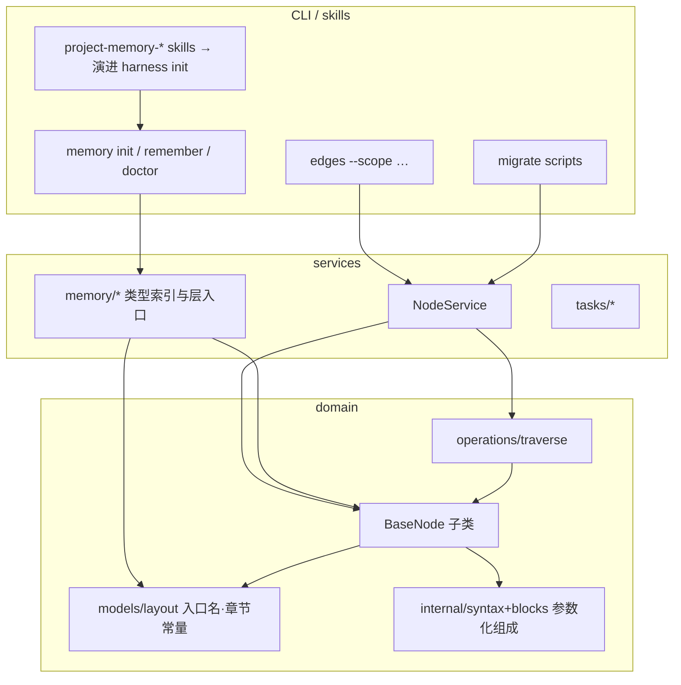
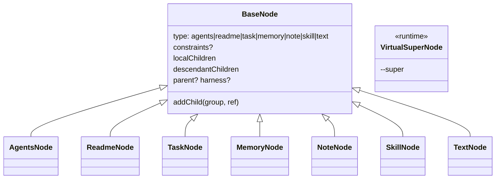
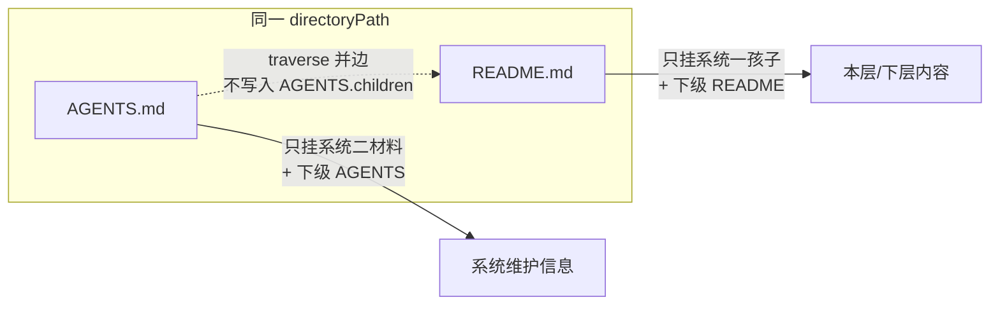

# 递归系统二入口与组成登记 Implementation Plan

> **For agentic workers:** REQUIRED SUB-SKILL: Use superpowers:subagent-driven-development (recommended) or superpowers:executing-plans to implement this plan task-by-task. Steps use checkbox (`- [ ]`) syntax for tracking.

**Goal:** 落地系统一 / 系统二入口分工：`AGENTS.md` 只挂系统维护信息；`README.md` 用 `project-entries-*` 挂内容；类型入口改 README；`type` 扩展为 `agents|readme|…|text`；存量迁 `INDEX.md`。

**Architecture:** Wave A 先改标记/标题、README 组成 codec、memory 类型索引路径与 migrate、根 README entries、traverse 双文件规则——立刻分清系统一/二。Wave B 再扁平类层次（取消 Internal/Leaf）、`type` 改名、显式 `--super`、project harness init 演进。组成解析复用并参数化现有 `InternalSyntax` / blocks，不要另起一套 Markdown 引擎。

**Tech Stack:** TypeScript、Node ≥22、`node:test`、tsx、现有 `edges-cli`。不新增依赖。

**Spec:** `docs/superpowers/specs/2026-10-06-recursive-system-two-entries-design.md`（ADR 0029）  
完整目标模型图见 spec「[架构图（目标模型）](../specs/2026-10-06-recursive-system-two-entries-design.md#架构图目标模型)」；下图是实施向系统架构（模块边界 + 运行时树 + Wave 落点）。

## 系统架构图

### 1. 模块分层（谁改哪里）



| 层 | 职责 | Wave |
| --- | --- | --- |
| layout / syntax / blocks | 标记、标题、入口文件名 | A1–A2 |
| ReadmeNode + Agents 组成 | 两套 entries 表 | A2 |
| traverse / NodeService | 双文件边、不扫盘 | A3 |
| memory paths + 模板 + 迁移 | 类型入口 README | A4–A5 |
| 根 README | Q9b 本层内容 | A6 |
| INDEX 迁移 | 叶子文件名 | A7 |
| type / 类层次 | agents·text·直继 BaseNode | B8–B9 |
| `--super` | 虚拟超节点（scope 上一级） | B10 |
| harness init skill | 任意目录系统入口 | B11 |

### 2. 运行时树：系统二 vs 系统一


实线 = 组成边（traverse 默认/显式组）；点划线 = 同目录双文件规则或显式 `--super` 虚拟超节点。`harness` 边默认不跟随（既有约定）。

### 3. 目标类图（Wave B 终点）



Wave A 允许暂留 `InternalNode` 类名、`type` 仍写 `internal` 读兼容；不得再把系统一孩子写进 AGENTS 组成。

### 4. 同目录双文件（traverse 核心）



## Global Constraints

- AGENTS 标记仍 `project-harness-*`；标题 **本层硬约束 / 本层系统维护信息 / 下层系统维护信息**。旧标题 `本层组成`/`下层节点`/更早别名只读兼容。
- README 标记 **`project-entries-local` / `project-entries-descendants`**；标题 **本层内容 / 下层内容**。
- 下层同合同：AGENTS descendants → AGENTS；README descendants → README。
- `type` 目标：`agents|readme|task|memory|note|skill|text`。旧 `internal`/`leaf` 读兼容；写不发 `internal`。
- 类型入口 → `README.md` + `project-entries-*`；`project-memory-type` 身份头保留在 README 顶部；列表不用 `project-memory-entries`（读兼容至迁完）。
- 叶子入口文件名目标 **`INDEX.md`**；读兼容 `index.md` 至迁完。
- 虚拟超节点须显式 **`--super`**；默认取当前 scope 的 `AGENTS.md`；缺 AGENTS 不自动合成超节点。
- 类层次：Wave B 各节点直继 BaseNode；本计划默认 **删除** `LeafNode`/`isLeaf` 持久语义，`InternalNode` 先改 `type=agents` 再改名为 `AgentsNode`（可短暂 `export { AgentsNode as InternalNode }`）。
- 不改：`.harness/` 目录名、`edges memory` 命令名、skill 目录名 `project-memory-*`、posts 正文（仅 INDEX 改名）。
- 批量迁移：可预览、冲突检查、幂等；禁止逐文件手改。
- 测试：`pnpm --filter edges-cli test`（或单文件 `node --test --import tsx …`）。Commit：`type: subject` + `Co-authored-by: Cursor Agent <cursoragent@cursor.com>`。

### 文件地图（锁定拆分）

| 区域 | 主文件 |
| --- | --- |
| 入口名 / 章节常量 | `extensions/cli/src/domain/models/layout.ts` |
| AGENTS/README blocks | `…/internal/blocks.ts`, `parse.ts`, `serialize.ts`, `syntax.ts` |
| 组成节点 | `…/internal/internal-node.ts` → 演进为 Agents/Readme |
| 遍历 | `…/operations/traverse.ts` + NodeService 加载 |
| 类型索引路径 | `…/services/memory/paths.ts`, `types.ts`, `entries.ts`, `init.ts`, `add-type.ts` |
| 模板 | `extensions/skills/project-memory-init/references/templates/*` |
| 协议 | `…/PROTOCOL.md`, `LAYOUT.md` |
| 迁移脚本 | `scripts/migrate-*.mts` 或 `extensions/cli/scripts/`（与现有 migrate 同风格） |
| 根 README | `/README.md` |

---

## Wave A — 分清系统一 / 系统二

### Task 1: layout 常量与 AGENTS 新标题

**Files:**
- Modify: `extensions/cli/src/domain/models/layout.ts`
- Modify: `extensions/cli/test/models/internal.test.ts`
- Modify: `extensions/skills/project-memory-init/references/LAYOUT.md`
- Modify: `extensions/skills/project-memory-init/references/PROTOCOL.md`（只改称呼，不写 HTML 标记名）
- Modify: `extensions/skills/project-memory-init/references/templates/AGENTS.tmpl.md`

**Interfaces:**
- Produces: `INTERNAL_SECTIONS.localChildren.heading === "本层系统维护信息"`；`descendantChildren.heading === "下层系统维护信息"`；parse 仍认旧标题

- [ ] **Step 1: 写失败测试（标题常量）**

在 `test/models/internal.test.ts` 增加：

```ts
import { INTERNAL_SECTIONS } from "../../src/domain/models/layout.js";

test("AGENTS section headings are system-maintenance titles", () => {
  assert.equal(INTERNAL_SECTIONS.localChildren.heading, "本层系统维护信息");
  assert.equal(INTERNAL_SECTIONS.descendantChildren.heading, "下层系统维护信息");
});
```

- [ ] **Step 2: 跑测试确认失败**

Run: `pnpm --filter edges-cli exec node --test --import tsx test/models/internal.test.ts`

Expected: FAIL on heading equality（仍是本层组成/下层节点）。

- [ ] **Step 3: 改 `layout.ts` 标题**

```ts
export const INTERNAL_SECTIONS = {
  constraints: { heading: "本层硬约束", marker: "project-harness-constraints" },
  localChildren: { heading: "本层系统维护信息", marker: "project-harness-local" },
  descendantChildren: {
    heading: "下层系统维护信息",
    marker: "project-harness-descendants",
  },
} as const;
```

在 parse/serialize/rewrite 路径中把旧标题 `本层组成`/`下层节点` 列入读别名（与既有 `本层记忆` 等并列）；**写**只发新标题。更新 `internal.test.ts` 里 `modern` fixture 的标题替换目标。

- [ ] **Step 4: 改 PROTOCOL / LAYOUT 称呼与 `AGENTS.tmpl.md` 两处 H2**

模板本层/下层标题改为「本层系统维护信息」「下层系统维护信息」。层 local 里链到类型索引的路径本 Task 仍可写 `AGENTS.md`（Task 4 再改 README）。

- [ ] **Step 5: 跑测试通过并 commit**

```bash
pnpm --filter edges-cli exec node --test --import tsx test/models/internal.test.ts
git add extensions/cli/src/domain/models/layout.ts \
  extensions/cli/test/models/internal.test.ts \
  extensions/skills/project-memory-init/references/
git commit -m "$(cat <<'EOF'
feat: AGENTS 章节标题改为系统维护信息

Co-authored-by: Cursor Agent <cursoragent@cursor.com>
EOF
)"
```

---

### Task 2: README `project-entries-*` 组成 codec

**Files:**
- Modify: `extensions/cli/src/domain/models/layout.ts` — 增加 `ENTRY_NAMES.readme`、`ENTRIES_SECTIONS`、`identifyNodeType` 认 `README.md` → 暂映射可解析组成的节点
- Modify: `extensions/cli/src/domain/models/internal/syntax.ts` / `blocks.ts` / `parse.ts` — 支持第二套 marker（或参数化 section table）
- Create: `extensions/cli/src/domain/models/readme/readme-node.ts`（或先用参数化 InternalNode；Prefer 独立 `ReadmeNode`，`type` 先写 `"readme"` 字符串，Wave B 收口）
- Test: `extensions/cli/test/models/readme-entries.test.ts`

**Interfaces:**
- Consumes: Task 1 的 section 模式
- Produces: `ReadmeNode`（或等价）parse/serialize `project-entries-local|descendants`；无 constraints 区块（除非未来需要）

- [ ] **Step 1: 写失败测试**

```ts
import assert from "node:assert/strict";
import test from "node:test";
import { ReadmeNode } from "../../src/domain/models/index.js";

const md = `# Root

Intro.

<!-- project-entries-local:start -->
## 本层内容

- [Tasks](tasks/README.md) — domain board
<!-- project-entries-local:end -->

<!-- project-entries-descendants:start -->
## 下层内容

- [Nested](nested/README.md) — nested org
<!-- project-entries-descendants:end -->
`;

test("readme entries parse local and descendant content", () => {
  const node = new ReadmeNode("/repo/README.md").parse(md);
  assert.equal(node.type, "readme");
  assert.deepEqual(node.localChildren.map((c) => c.id), [
    "/repo/tasks/README.md",
  ]);
  assert.deepEqual(node.descendantChildren.map((c) => c.id), [
    "/repo/nested/README.md",
  ]);
  assert.match(node.serialize(), /project-entries-local:start/);
  assert.match(node.serialize(), /## 本层内容/);
});
```

- [ ] **Step 2: 跑测试确认失败**

Run: `pnpm --filter edges-cli exec node --test --import tsx test/models/readme-entries.test.ts`

Expected: FAIL（ReadmeNode 未导出）。

- [ ] **Step 3: 最小实现**

- `layout.ts`:

```ts
export const ENTRY_NAMES = {
  agents: "AGENTS.md", // keep internal alias key during Wave A if needed
  internal: "AGENTS.md",
  readme: "README.md",
  skill: "SKILL.md",
  leaf: "index.md",
  index: "INDEX.md",
} as const;

export const ENTRIES_SECTIONS = {
  localChildren: { heading: "本层内容", marker: "project-entries-local" },
  descendantChildren: {
    heading: "下层内容",
    marker: "project-entries-descendants",
  },
} as const;
```

- 将 `InternalSyntax` 改为接受 section 配置（agents vs entries）；`ReadmeNode` 用 entries 配置，无 constraints。
- `identifyNodeType`: `README.md` → `"readme"`。
- NodeService `models` 映射登记 ReadmeNode。

- [ ] **Step 4: 跑测试通过**

Run: 同上；再跑 `test/models/internal.test.ts` 防回归。

- [ ] **Step 5: Commit**

```bash
git commit -m "$(cat <<'EOF'
feat: README project-entries 组成 codec

Co-authored-by: Cursor Agent <cursoragent@cursor.com>
EOF
)"
```

---

### Task 3: traverse 双文件规则

**Files:**
- Modify: `extensions/cli/src/domain/operations/traverse.ts`
- Modify: NodeService 加载回调（若同目录需同时展开 README）
- Test: `extensions/cli/test/operations/traverse-dual-entry.test.ts`（路径按现有 operations 测试目录调整）

**Interfaces:**
- Consumes: AgentsNode + ReadmeNode
- Produces: 从 scope AGENTS 出发时，系统一孩子来自同目录 README entries，不来自 AGENTS localChildren 里的系统一路径；AGENTS local 仍展开系统二材料

- [ ] **Step 1: 写失败测试（夹具目录）**

用 `os.tmpdir()` 建：

```text
scope/AGENTS.md   — local → .harness/memory/projects/README.md（或过渡 AGENTS）
scope/README.md   — local → tasks/README.md
scope/tasks/README.md
scope/.harness/memory/projects/README.md
```

断言 traverse(scopeAgents, { includeDescendants:false }) 的路径集合包含 harness 材料与（经双文件规则）tasks README，且 **AGENTS 的 children 列表本身不含 tasks**。

- [ ] **Step 2: 跑测试确认失败**

- [ ] **Step 3: 实现**

在 traverse 或 NodeService.query 中：当节点为 AGENTS 且同目录存在可读 README 组成节点时，把 README 的 `localChildren`（及可选 descendants）并入遍历边，**不**要求这些边出现在 AGENTS 的 `localChildren` 字段里。不要目录扫描补孩子。

- [ ] **Step 4: 测试通过并 commit**

```bash
git commit -m "$(cat <<'EOF'
feat: traverse 同目录 AGENTS/README 组成分工

Co-authored-by: Cursor Agent <cursoragent@cursor.com>
EOF
)"
```

---

### Task 4: 类型入口改为 README + 模板 / memory 写路径

**Files:**
- Modify: `extensions/cli/src/services/memory/paths.ts` — `typeIndexRelpath` → `…/README.md`
- Modify: `types.ts`, `entries.ts`, `init.ts`, `add-type.ts`, `agents.ts`（链到类型索引的 href）
- Modify: 全部 `extensions/skills/project-memory-init/references/templates/{USER,FEEDBACK,PROJECT,REFERENCE,MANAGED,REFERENCED,TYPE}.tmpl.md` — entries 区块改 `project-entries-*` + 标题本层内容；保留 `project-memory-type` 头
- Modify: `AGENTS.tmpl.md` local 链接 `…/README.md`
- Modify: LAYOUT.md 类型入口段
- Test: 现有 `test/memory/*.test.ts` 中断言 `AGENTS.md` 类型索引的用例

**Interfaces:**
- Produces: `typeIndexRelpath("project") === ".harness/memory/projects/README.md"`
- 读：若 README 不存在但旧 `AGENTS.md` 存在，discover/load 仍可用（兼容）

- [ ] **Step 1: 写失败测试**

```ts
import { typeIndexRelpath } from "../../src/services/memory/paths.js";
test("type index path is README.md", () => {
  assert.equal(
    typeIndexRelpath("project"),
    ".harness/memory/projects/README.md",
  );
});
```

- [ ] **Step 2: 跑测试失败 → 改 paths + 模板 + init/remember 刷新逻辑**

remember/doctor 写类型索引时：serialize ReadmeNode / entries 标记。层 AGENTS upsert 本地类型行时链接改 README。

- [ ] **Step 3: 跑 memory 相关测试并修复断言**

Run: `pnpm --filter edges-cli exec node --test --import tsx './test/memory/**/*.test.ts'`

- [ ] **Step 4: Commit**

```bash
git commit -m "$(cat <<'EOF'
feat: 类型入口改为 README + project-entries

Co-authored-by: Cursor Agent <cursoragent@cursor.com>
EOF
)"
```

---

### Task 5: 迁移脚本 — 类型索引 AGENTS→README + 仓内应用

**Files:**
- Create: `scripts/migrate-type-index-to-readme.mts`（或 CLI 包内 scripts，与 `migrate:project-harness-markers` 同注册方式）
- Modify: 根与各层 `.harness/memory/*/AGENTS.md`、`.harness/skills/*/AGENTS.md` → README；更新所有指向它们的链接
- Modify: `package.json` script 入口（若有 migrate 命名空间则跟上）

**Interfaces:**
- CLI: `pnpm migrate:type-index-readme -- --root <abs> [--apply]`
- dry-run 默认；`--apply` 写入；冲突（目标 README 已存在且不等价）报错退出

- [ ] **Step 1: 脚本骨架（preview）**

遍历 `--root` 下 `.harness/memory/*/` 与 `.harness/skills/*/`：若存在 `AGENTS.md` 且含 `project-memory-type` 或 `project-memory-entries`，计划：

1. 将 entries 标记改写为 `project-entries-*`，标题改「本层内容」（类型索引通常无下层；有则改「下层内容」）
2. 保留 `project-memory-type` 块
3. 写入同目录 `README.md`，删除旧 `AGENTS.md`（apply 时）
4. 更新层 AGENTS 与其它文件中指向旧路径的链接

复用 edges traverse / 已有 migrate 工具函数，不要手枚举业务目录以外的随意 md。

- [ ] **Step 2: 对本仓 `--root /workspace` dry-run，检查计划无冲突**

- [ ] **Step 3: `--apply` 后 `edges memory doctor`（或现有检查）通过**

- [ ] **Step 4: Commit 脚本 + 本仓迁移结果**

```bash
git commit -m "$(cat <<'EOF'
feat: 迁移类型索引 AGENTS 为 README

Co-authored-by: Cursor Agent <cursoragent@cursor.com>
EOF
)"
```

---

### Task 6: 根 README 本层内容（Q9b）

**Files:**
- Modify: `/README.md` — 追加 `project-entries-local`（及如需要的 descendants），链到 `tasks/`、`notes/` 等本层入口（入口文件以当时 layout 为准：`tasks/AGENTS.md` 或未来 `tasks/README.md`；领域板若仍是 AGENTS 系统入口则链系统入口，若是组织清单则链 README）
- Test: 可选小测试读根 README 的 localChildren 含 tasks

- [ ] **Step 1: 确定链目标**（读现有 `tasks/AGENTS.md`、`notes/` 布局，按「本层内容挂本层入口」登记，不扁平挂每个 Task）

- [ ] **Step 2: 只改标记区块，保留 README 既有人文**

- [ ] **Step 3: Commit**

```bash
git commit -m "$(cat <<'EOF'
docs: 根 README 增加 project-entries 本层内容

Co-authored-by: Cursor Agent <cursoragent@cursor.com>
EOF
)"
```

---

### Task 7: `index.md` → `INDEX.md` 迁移脚本（含 posts）

**Files:**
- Create: `scripts/migrate-index-to-INDEX.mts`
- Modify: `layout.ts` — `identifyNodeType` 认 `INDEX.md` 与 `index.md`；新建默认写 `INDEX.md`
- Modify: note/task/memory 创建路径
- 关联卡：`.harness/tasks/project-memory/backlog/2026-10-06--脚本indexmd-迁-INDEXmd含-posts/`

**Interfaces:**
- `pnpm migrate:index-case -- --root <abs> [--apply]`
- 用 operations/traverse 收集节点与引用；改名文件；重写登记与正文相对链接；**posts/** 只改名

- [ ] **Step 1: 失败测试 — layout 认 INDEX.md 为 leaf/text/task…**

- [ ] **Step 2: layout + 创建路径改默认 INDEX.md，读双兼容**

- [ ] **Step 3: 迁移脚本 dry-run / apply；本仓执行**

- [ ] **Step 4: 全量 CLI 测试 + commit**

```bash
git commit -m "$(cat <<'EOF'
feat: 默认 INDEX.md 并迁移存量 index.md

Co-authored-by: Cursor Agent <cursoragent@cursor.com>
EOF
)"
```

---

## Wave B — 模型收口与虚拟超节点（`--super`）

### Task 8: `type` 收口 — `agents` / `text`，去掉 `internal`/`leaf` 写入

**Files:**
- Modify: `layout.ts` `NodeType`、`identifyNodeType`（AGENTS→`agents`；未知 INDEX→`text`）
- Modify: `internal-node.ts` `readonly type = "agents"`
- Modify: 所有 `type === "internal"` / `"leaf"` 分支与测试
- Modify: `core/leaf-node.ts` — 业务子类改直继 BaseNode（可分步：先改 type 字符串，再删 LeafNode）

- [ ] **Step 1: 测试 identifyNodeType("…/AGENTS.md") === "agents"**；未知 `…/INDEX.md` === "text"`

- [ ] **Step 2: 全仓替换判定；读兼容：加载旧数据时 `internal` 视为 `agents`，`leaf` 视为 `text`

- [ ] **Step 3: `pnpm --filter edges-cli test` + commit

```bash
git commit -m "$(cat <<'EOF'
feat: node type 使用 agents/readme/text

Co-authored-by: Cursor Agent <cursoragent@cursor.com>
EOF
)"
```

---

### Task 9: 删除 Internal/Leaf 类层次（组成上收 BaseNode）

**Files:**
- Modify: `core/base-node.ts` — 可选组成字段与 `addChild`
- Rename: `InternalNode` → `AgentsNode`；新增已有 `ReadmeNode`
- Delete or thin-wrap: `LeafNode`
- Modify: `traverse.ts` — 用「有 localChildren」而非 `instanceof InternalNode`
- Update: `models/README.md` 类图与现行实现一致

- [ ] **Step 1: 测试 traverse 不依赖 instanceof InternalNode**

- [ ] **Step 2: 重构类层次；导出 `InternalNode` 别名一个版本（标注 deprecated）或直接全量改 import

- [ ] **Step 3: 全量测试 + commit

```bash
git commit -m "$(cat <<'EOF'
refactor: BaseNode 直继；取消 Internal/Leaf 层次

Co-authored-by: Cursor Agent <cursoragent@cursor.com>
EOF
)"
```

---

### Task 10: 显式 `--super`（虚拟超节点）

**Files:**
- Modify: CLI scope 解析（`extensions/cli/src/commands/` 或 context）
- Modify: NodeService / query 入口
- Test: 无 AGENTS + 无 flag → 错误；有 `--super` → 运行时根挂仓根 README entries

- [ ] **Step 1: 失败测试覆盖两种行为**

- [ ] **Step 2: 实现 VirtualSuperNode（不落盘虚拟超节点）+ `--super` 接线**

- [ ] **Step 3: commit**

```bash
git commit -m "$(cat <<'EOF'
feat: 显式 --super 虚拟超节点

Co-authored-by: Cursor Agent <cursoragent@cursor.com>
EOF
)"
```

---

### Task 11: project harness init skill 演进（跟卡）

**Files:**
- 卡：`.harness/tasks/project-memory/backlog/2026-10-06--project-harness-init-skill/`
- Modify: skill 文案与 init 行为对齐「任意目录系统入口」；命令名可仍 `edges memory init`（Global Constraints：不强制改 bin 名）
- 输出系统入口模板用新标题；可选同目录不自动造 README（组织清单由用户/迁移另建）

- [ ] **Step 1: 按卡完成标准更新 skill + init 帮助文案**

- [ ] **Step 2: 手工/测试：对临时目录 init 只产生 AGENTS 系统入口形状**

- [ ] **Step 3: 更新卡状态 + commit**

---

### Task 12: 收尾文档与 ADR 状态

**Files:**
- Modify: spec 状态 → 实施中/已落地；ADR 0029 `proposed` → `accepted`
- Modify: `CONTEXT.md` / models README 若仍有过期「本层组成」
- Modify: ADR 0012 加 superseded 指针（若尚未）

- [ ] **Step 1: 对照 spec「验收」清单逐条勾掉**

- [ ] **Step 2: commit**

```bash
git commit -m "$(cat <<'EOF'
docs: 递归系统二 entries 实施收尾

Co-authored-by: Cursor Agent <cursoragent@cursor.com>
EOF
)"
```

---

## Spec coverage（自检）

| Spec 要求 | Task |
| --- | --- |
| AGENTS 标题系统维护信息 | 1 |
| README project-entries + 标题 | 2 |
| 下层同合同递归 | 2（登记目标）+ 3（traverse） |
| 双文件遍历分工 | 3 |
| 类型入口 README | 4–5 |
| 根 README entries | 6 |
| INDEX.md 迁移含 posts | 7 |
| type agents/readme/text | 8 |
| 无 Internal/Leaf | 9 |
| 虚拟超节点 `--super` | 10 |
| project harness init | 11 |
| 文档/ADR | 12 |

开放题锁定：类删除（非长期别名，仅允许短暂 re-export）；`project-memory-type` 留 README 顶；flag 名 `--super`（虚拟超节点）。
