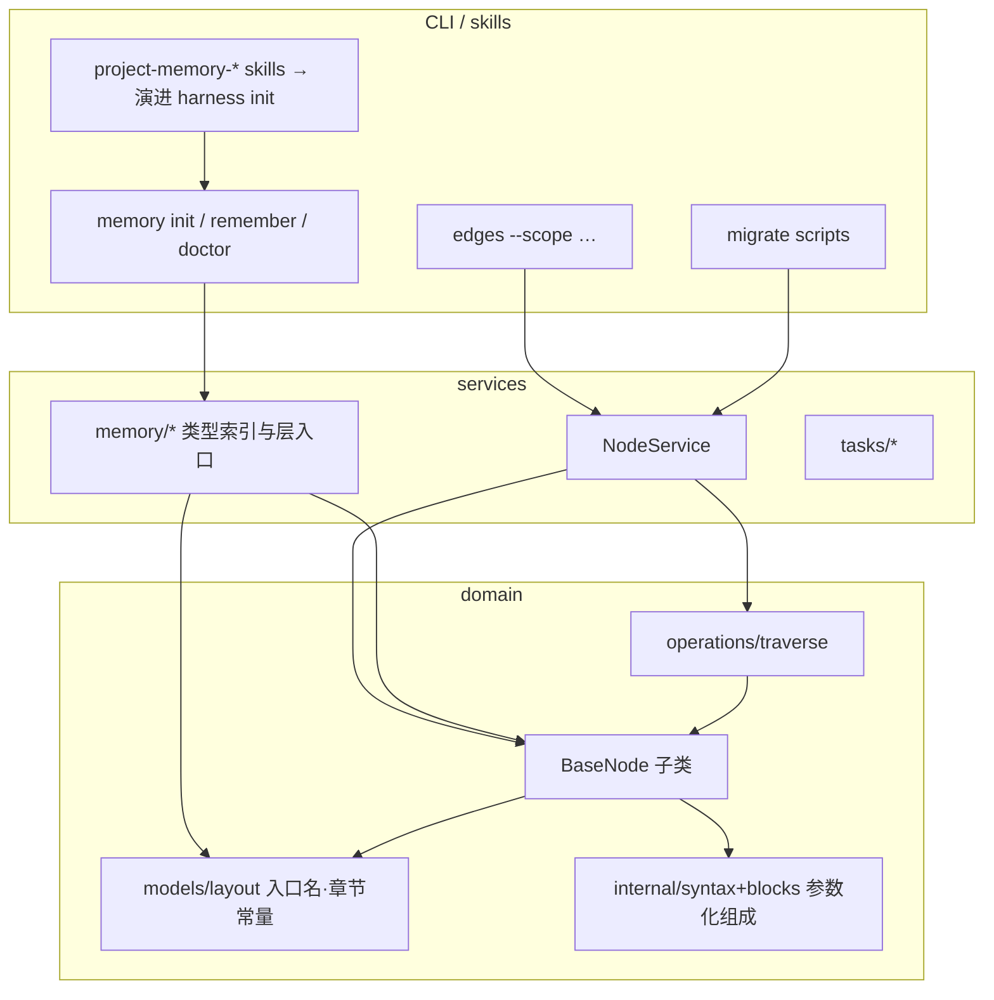
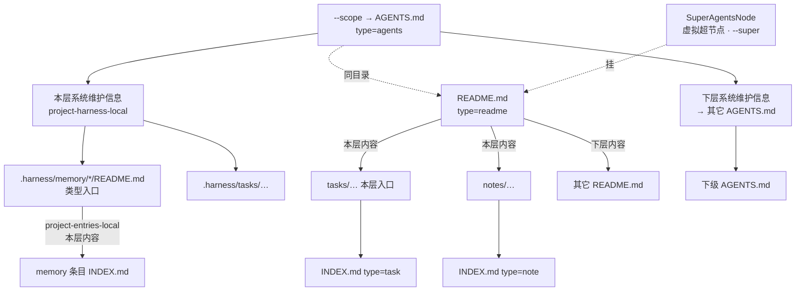
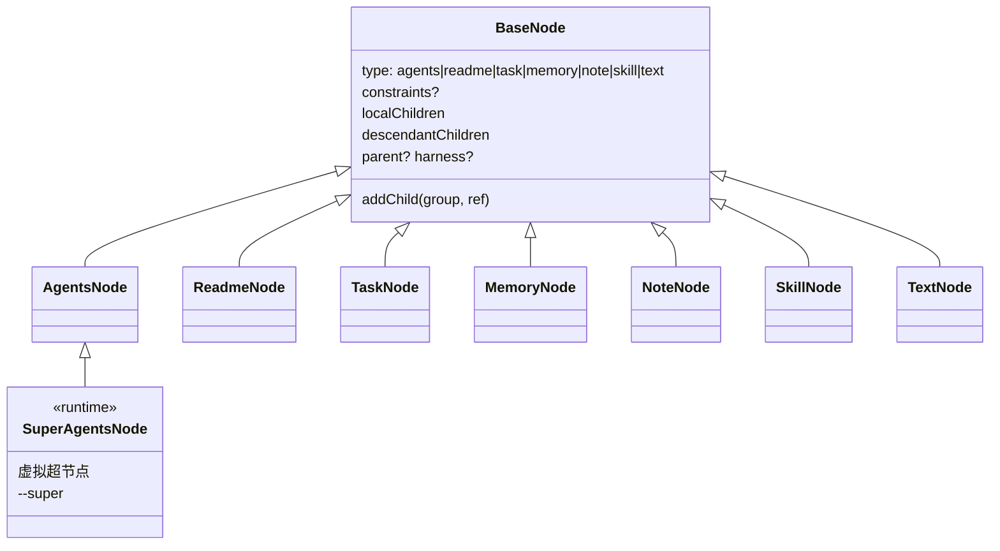
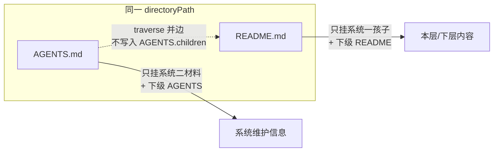

# 递归系统二入口与组成登记 Implementation Plan

> **For agentic workers:** REQUIRED SUB-SKILL: Use superpowers:subagent-driven-development (recommended) or superpowers:executing-plans to implement this plan task-by-task. Steps use checkbox (`- [ ]`) syntax for tracking.

**Goal:** 落地系统一 / 系统二入口分工：`AGENTS.md` 只挂系统维护信息；`README.md` 用 `project-entries-*` 挂内容；类型入口改 README；`type` 扩展为 `agents|readme|…|text`；存量迁 `INDEX.md`。

**Architecture:** Wave A 先改标记/标题、README 组成 codec、traverse（**默认全部 children** + 双文件并边）、memory 类型索引与 Task Project 等「伪系统入口」迁 README、根 README entries、INDEX 改名——立刻分清系统一/二。Wave B 再扁平类层次、`type` 收口、`SuperAgentsNode` + `--super`、harness init。组成解析参数化现有 `InternalSyntax` / blocks，不另起 Markdown 引擎。
**Tech Stack:** TypeScript、Node ≥22、`node:test`、tsx、现有 `edges-cli`。不新增依赖。

**Spec:** `docs/superpowers/specs/2026-10-06-recursive-system-two-entries-design.md`（ADR 0029）  
完整目标模型图见 spec「[架构图（目标模型）](../specs/2026-10-06-recursive-system-two-entries-design.md#架构图目标模型)」；下图是实施向系统架构（模块边界 + 运行时树 + Wave 落点）。

## 系统架构图

### 1. 模块分层（谁改哪里）



| 层 | 职责 | Wave |
| --- | --- | --- |
| layout / syntax / blocks | 标记、标题、入口文件名 | A1–A2 |
| ReadmeNode + Agents 组成 | 两套 entries 表 | A2 |
| traverse / NodeService | 默认全部 children、双文件边、不扫盘 | A3 |
| memory paths + 模板 + 迁移 | 类型入口 README | A4–A5 |
| 根 README | Q9b 本层内容 | A6 |
| INDEX 迁移 | 叶子文件名 | A7 |
| type / 类层次 | agents·text·直继 BaseNode | B8–B9 |
| `--super` | 虚拟超节点（scope 上一级） | B10 |
| harness init skill | 任意目录系统入口 | B11 |

### 2. 运行时树：系统二 vs 系统一



实线 = 组成边（traverse **默认**走全部 children；`localOnly` 才收窄）；点划线 = 同目录双文件并边或显式 `--super`。`harness` 默认不跟随。
### 3. 目标类图（Wave B 终点）



Wave A 允许暂留 `InternalNode` 类名、`type` 仍写 `internal` 读兼容；不得再把系统一孩子写进 AGENTS 组成。Wave B：`SuperAgentsNode extends AgentsNode`。

### 4. 同目录双文件（traverse 核心）



## Global Constraints

- AGENTS 标记仍 `project-harness-*`；标题 **本层硬约束 / 本层系统维护信息 / 下层系统维护信息**。旧标题 `本层组成`/`下层节点`/更早别名只读兼容。
- README 标记 **`project-entries-local` / `project-entries-descendants`**；标题 **本层内容 / 下层内容**。
- 下层同合同：AGENTS descendants → AGENTS；README descendants → README。
- `type` 目标：`agents|readme|task|memory|note|skill|text`。旧 `internal`/`leaf` 读兼容；写不发 `internal`。
- 类型入口 → `README.md` + `project-entries-*`；`project-memory-type` 身份头保留在 README 顶部；列表不用 `project-memory-entries`（读兼容至迁完）。
- 叶子入口文件名目标 **`INDEX.md`**；读兼容 `index.md` 至迁完。
- 虚拟超节点须显式 **`--super`**；默认取当前 scope 的 `AGENTS.md`；缺 AGENTS 不自动合成超节点。
- traverse **默认**走全部 `children`（local∪descendants）；本层-only 用显式 `localOnly: true`；`includeHarness` 仍默认 false（Q20）。
- 类层次：Wave B 各节点直继 BaseNode；本计划默认 **删除** `LeafNode`/`isLeaf` 持久语义，`InternalNode` 先改 `type=agents` 再改名为 `AgentsNode`（可短暂 `export { AgentsNode as InternalNode }`）。
- 不改：`.harness/` 目录名、`edges memory` 命令名、skill 目录名 `project-memory-*`、posts 正文（仅 INDEX 改名）。
- 批量迁移：可预览、冲突检查、幂等；禁止逐文件手改。
- 测试：`pnpm --filter edges-cli test`（或单文件 `node --test --import tsx …`）。Commit：`type: subject` + `Co-authored-by: Cursor Agent <cursoragent@cursor.com>`。

### 文件地图（锁定拆分）

| 区域 | 主文件 |
| --- | --- |
| 入口名 / 章节常量 | `extensions/cli/src/domain/models/layout.ts` |
| AGENTS/README blocks | `…/internal/blocks.ts`, `parse.ts`, `serialize.ts`, `syntax.ts` |
| 组成节点 | `…/internal/internal-node.ts` → 演进为 Agents/Readme |
| 遍历 | `…/operations/traverse.ts` + NodeService 加载 |
| 类型索引路径 | `…/services/memory/paths.ts`, `types.ts`, `entries.ts`, `init.ts`, `add-type.ts` |
| 模板 | `extensions/skills/project-memory-init/references/templates/*` |
| 协议 | `…/PROTOCOL.md`, `LAYOUT.md` |
| 迁移脚本 | `scripts/migrate-*.mts` 或 `extensions/cli/scripts/`（与现有 migrate 同风格） |
| 根 README | `/README.md` |

---

## Wave A — 分清系统一 / 系统二

### Task 1: layout 常量与 AGENTS 新标题

**Files:**
- Modify: `extensions/cli/src/domain/models/layout.ts`
- Modify: `extensions/cli/test/models/internal.test.ts`
- Modify: `extensions/skills/project-memory-init/references/LAYOUT.md`
- Modify: `extensions/skills/project-memory-init/references/PROTOCOL.md`（只改称呼，不写 HTML 标记名）
- Modify: `extensions/skills/project-memory-init/references/templates/AGENTS.tmpl.md`

**Interfaces:**
- Produces: `INTERNAL_SECTIONS.localChildren.heading === "本层系统维护信息"`；`descendantChildren.heading === "下层系统维护信息"`；parse 仍认旧标题

- [ ] **Step 1: 写失败测试（标题常量）**

在 `test/models/internal.test.ts` 增加：

```ts
import { INTERNAL_SECTIONS } from "../../src/domain/models/layout.js";

test("AGENTS section headings are system-maintenance titles", () => {
  assert.equal(INTERNAL_SECTIONS.localChildren.heading, "本层系统维护信息");
  assert.equal(INTERNAL_SECTIONS.descendantChildren.heading, "下层系统维护信息");
});
```

- [ ] **Step 2: 跑测试确认失败**

Run: `pnpm --filter edges-cli exec node --test --import tsx test/models/internal.test.ts`

Expected: FAIL on heading equality（仍是本层组成/下层节点）。

- [ ] **Step 3: 改 `layout.ts` 标题**

```ts
export const INTERNAL_SECTIONS = {
  constraints: { heading: "本层硬约束", marker: "project-harness-constraints" },
  localChildren: { heading: "本层系统维护信息", marker: "project-harness-local" },
  descendantChildren: {
    heading: "下层系统维护信息",
    marker: "project-harness-descendants",
  },
} as const;
```

在 parse/serialize/rewrite 路径中把旧标题列入读别名（与 spec 一致）：`本层组成`、`本层记忆`、`下层节点`、`下层记忆索引`、`下层作用域`、`本层重要约束`；**写**只发新标题。更新 `internal.test.ts` 里 `modern` fixture 的标题替换目标。`rewriteLayerSurface`（或等价）刷新存量层入口标题，禁止手改。

- [ ] **Step 4: 改 PROTOCOL / LAYOUT 称呼与 `AGENTS.tmpl.md` 两处 H2**

模板本层/下层标题改为「本层系统维护信息」「下层系统维护信息」。层 local 里链到类型索引的路径本 Task 仍可写 `AGENTS.md`（Task 4 再改 README）。

- [ ] **Step 5: 对本仓已跟踪的层入口跑标题刷新（dry-run → apply），再跑测试通过并 commit**

```bash
pnpm --filter edges-cli exec node --test --import tsx test/models/internal.test.ts
# apply 后一并 stage 被 rewrite 的各层 AGENTS.md（勿手改标题）
git add extensions/cli/src/domain/models/layout.ts \
  extensions/cli/test/models/internal.test.ts \
  extensions/skills/project-memory-init/references/ \
  $(git diff --name-only -- '**/AGENTS.md')
git commit -m "$(cat <<'EOF'
feat: AGENTS 章节标题改为系统维护信息

Co-authored-by: Cursor Agent <cursoragent@cursor.com>
EOF
)"
```

---

### Task 2: README `project-entries-*` 组成 codec

**Files:**
- Modify: `extensions/cli/src/domain/models/layout.ts` — 增加 `ENTRY_NAMES.readme`、`ENTRIES_SECTIONS`、`identifyNodeType` 认 `README.md` → 暂映射可解析组成的节点
- Modify: `extensions/cli/src/domain/models/internal/syntax.ts` / `blocks.ts` / `parse.ts` — 支持第二套 marker（或参数化 section table）
- Create: `extensions/cli/src/domain/models/readme/readme-node.ts`（或先用参数化 InternalNode；Prefer 独立 `ReadmeNode`，`type` 先写 `"readme"` 字符串，Wave B 收口）
- Test: `extensions/cli/test/models/readme-entries.test.ts`

**Interfaces:**
- Consumes: Task 1 的 section 模式
- Produces: `ReadmeNode`（或等价）parse/serialize `project-entries-local|descendants`；无 constraints 区块（除非未来需要）

- [ ] **Step 1: 写失败测试**

```ts
import assert from "node:assert/strict";
import test from "node:test";
import { ReadmeNode } from "../../src/domain/models/index.js";

const md = `# Root

Intro.

<!-- project-entries-local:start -->
## 本层内容

- [Tasks](tasks/README.md) — domain board
<!-- project-entries-local:end -->

<!-- project-entries-descendants:start -->
## 下层内容

- [Nested](nested/README.md) — nested org
<!-- project-entries-descendants:end -->
`;

test("readme entries parse local and descendant content", () => {
  const node = new ReadmeNode("/repo/README.md").parse(md);
  assert.equal(node.type, "readme");
  assert.deepEqual(node.localChildren.map((c) => c.id), [
    "/repo/tasks/README.md",
  ]);
  assert.deepEqual(node.descendantChildren.map((c) => c.id), [
    "/repo/nested/README.md",
  ]);
  assert.match(node.serialize(), /project-entries-local:start/);
  assert.match(node.serialize(), /## 本层内容/);
});
```

- [ ] **Step 2: 跑测试确认失败**

Run: `pnpm --filter edges-cli exec node --test --import tsx test/models/readme-entries.test.ts`

Expected: FAIL（ReadmeNode 未导出）。

- [ ] **Step 3: 最小实现**

- `layout.ts`:

```ts
export const ENTRY_NAMES = {
  agents: "AGENTS.md", // keep internal alias key during Wave A if needed
  internal: "AGENTS.md",
  readme: "README.md",
  skill: "SKILL.md",
  leaf: "index.md",
  index: "INDEX.md",
} as const;

export const ENTRIES_SECTIONS = {
  localChildren: { heading: "本层内容", marker: "project-entries-local" },
  descendantChildren: {
    heading: "下层内容",
    marker: "project-entries-descendants",
  },
} as const;
```

- 将 `InternalSyntax` 改为接受 section 配置（agents vs entries）；`ReadmeNode` 用 entries 配置，无 constraints。
- `identifyNodeType`: `README.md` → `"readme"`。
- NodeService `models` 映射登记 ReadmeNode。

- [ ] **Step 4: 跑测试通过**

Run: 同上；再跑 `test/models/internal.test.ts` 防回归。

- [ ] **Step 5: Commit**

```bash
git commit -m "$(cat <<'EOF'
feat: README project-entries 组成 codec

Co-authored-by: Cursor Agent <cursoragent@cursor.com>
EOF
)"
```

---

### Task 3: traverse 默认全部 children + 双文件规则

**Files:**
- Modify: `extensions/cli/src/domain/operations/traverse.ts`
- Modify: `extensions/cli/src/domain/operations/README.md`
- Modify: NodeService 加载回调（同目录 README 并边）；审计所有依赖「默认只 local」的调用方，改为显式 `localOnly: true` 如需要
- Test: `extensions/cli/test/operations/traverse-dual-entry.test.ts`（及既有 traverse 默认行为测试）

**Interfaces:**
- Consumes: AgentsNode + ReadmeNode
- Produces:
  - 默认：`children` = local ∪ descendants
  - `localOnly: true`：仅 localChildren（取代旧默认；若暂留 `includeDescendants`，则默认 `true`，`false` 等价 localOnly）
  - `includeHarness` 仍默认 false
  - 双文件：从 scope AGENTS 出发时并入同目录 README 的组成边；AGENTS 字段本身不含系统一孩子

- [ ] **Step 1: 写失败测试**

```ts
// 默认展开 descendants
test("traverse defaults to all children", async () => {
  // AGENTS local → mem/README；descendants → nested/AGENTS.md
  const paths = [];
  for await (const n of traverse(rootAgents, {}, resolve, load)) paths.push(n.path);
  assert.ok(paths.some((p) => p.endsWith("nested/AGENTS.md")));
});

test("localOnly skips descendant group", async () => {
  const paths = [];
  for await (const n of traverse(rootAgents, { localOnly: true }, resolve, load))
    paths.push(n.path);
  assert.ok(!paths.some((p) => p.endsWith("nested/AGENTS.md")));
});

// 双文件夹具（硬断言）
// scope/AGENTS.md local → .harness/memory/projects/README.md
// scope/README.md local → tasks/README.md
// 默认 traverse(scopeAgents) 应经并边到达 tasks/README.md
// assert: scopeAgents.localChildren / descendantChildren 都不含 tasks
// assert: README descendants 目标 basename 均为 README.md（下层同合同）
```

- [ ] **Step 2: 跑测试确认失败**（现行默认不进 descendants）

- [ ] **Step 3: 实现**

```ts
export interface ScopeTraversalOptions {
  /** When true, only localChildren. Default false = all children. */
  localOnly?: boolean;
  includeHarness?: boolean;
  /** @deprecated Prefer localOnly; if kept, default true. */
  includeDescendants?: boolean;
}
// visit: use localOnly ? localChildren : children
// (map includeDescendants === false → localOnly for one release if needed)
```

同目录 AGENTS+README：并入 README 组成边，不扫盘。全仓 `rg includeDescendants` / 依赖旧默认的测试与 memory/tasks 调用方：要本层-only 的改为 `localOnly: true`。

**中态注意：** Task 5 完成前，存量可能仍把系统一孩子挂在 AGENTS local；本 Task **不得**把系统一孩子再写入 AGENTS，也不得为「能 traverse 到」去扫盘补边。Task 5B 负责剥伪系统入口；在那之前单测用夹具表达目标形状，不要依赖脏仓。

- [ ] **Step 4: 测试通过并 commit**

```bash
git commit -m "$(cat <<'EOF'
feat: traverse 默认全部 children；双文件并边

Co-authored-by: Cursor Agent <cursoragent@cursor.com>
EOF
)"
```

---

### Task 4: 类型入口改为 README + 模板 / memory 写路径

**Files:**
- Modify: `extensions/cli/src/services/memory/paths.ts` — `typeIndexRelpath` → `…/README.md`
- Modify: `types.ts`, `entries.ts`, `init.ts`, `add-type.ts`, `agents.ts`（链到类型索引的 href）
- Modify: 全部 `extensions/skills/project-memory-init/references/templates/{USER,FEEDBACK,PROJECT,REFERENCE,MANAGED,REFERENCED,TYPE}.tmpl.md` — entries 区块改 `project-entries-*` + 标题本层内容；保留 `project-memory-type` 头
- Modify: `AGENTS.tmpl.md` local 链接 `…/README.md`
- Modify: LAYOUT.md 类型入口段
- Test: 现有 `test/memory/*.test.ts` 中断言 `AGENTS.md` 类型索引的用例

**Interfaces:**
- Produces: `typeIndexRelpath("project") === ".harness/memory/projects/README.md"`
- 读：若 README 不存在但旧 `AGENTS.md` 存在，discover/load 仍可用（兼容）

- [ ] **Step 1: 写失败测试**

```ts
import { typeIndexRelpath } from "../../src/services/memory/paths.js";
test("type index path is README.md", () => {
  assert.equal(
    typeIndexRelpath("project"),
    ".harness/memory/projects/README.md",
  );
});
```

- [ ] **Step 2: 跑测试失败 → 改 paths + 模板 + init/remember 刷新逻辑**

remember/doctor 写类型索引时：serialize ReadmeNode / entries 标记。层 AGENTS upsert 本地类型行时链接改 README。

- [ ] **Step 3: 跑 memory 相关测试并修复断言**

Run: `pnpm --filter edges-cli exec node --test --import tsx './test/memory/**/*.test.ts'`

- [ ] **Step 4: Commit**

```bash
git commit -m "$(cat <<'EOF'
feat: 类型入口改为 README + project-entries

Co-authored-by: Cursor Agent <cursoragent@cursor.com>
EOF
)"
```

---

### Task 5: 迁移脚本 — 类型索引 +「列表型」AGENTS→README

**Files:**
- Create: `scripts/migrate-type-index-to-readme.mts`（或 CLI 包内 scripts，与 `migrate:project-harness-markers` 同注册方式）
- Modify: 根与各层 `.harness/memory/*/AGENTS.md`、`.harness/skills/*/AGENTS.md` → README
- Modify: **Task Project 等仅列系统一孩子、无真实系统二材料的目录**（如 `.harness/tasks/<project>/AGENTS.md`、`tasks/<project>/AGENTS.md` 若只是任务列表）：组成迁到同目录 `README.md` + `project-entries-*`；若该目录未用户 init 为系统入口，删除或不再维持伪 AGENTS（与 Q10/Q18 一致——有列表 ≠ 系统入口）
- 更新所有指向旧路径的链接；`package.json` script 入口

**Interfaces:**
- CLI: `pnpm migrate:type-index-readme -- --root <abs> [--apply]`（可拆第二个脚本 `migrate:org-lists-to-readme`，但须同一验收：系统一列表不在 `project-harness-local`）
- dry-run 默认；冲突报错退出

- [ ] **Step 1: 脚本骨架（preview）**

**A. 类型索引：** `.harness/memory/*/`、`.harness/skills/*/` 下含 `project-memory-type` / `project-memory-entries` 的 `AGENTS.md` →

1. entries → `project-entries-*`，标题「本层内容」（有下层则「下层内容」）
2. 保留 `project-memory-type` 头
3. 写入 `README.md`，apply 时删旧 AGENTS
4. 更新层 AGENTS 链接

**B. 组织清单误用 AGENTS：** dry-run 列出「`project-harness-local` 主要是 Task/内容叶子、几乎无 `.harness` 系统二材料」的目录，预览迁 README；**不**自动剥掉用户已 init、含硬约束/维护模块的真系统入口。

复用 traverse；不要手扫无关 md。

- [ ] **Step 2: 对本仓 dry-run，人工确认 B 类名单无误伤**

- [ ] **Step 3: `--apply` 后 doctor / 抽查：原 edges-cli-platform 等 Task Project 列表在 README，不在 AGENTS local**

- [ ] **Step 4: Commit**

```bash
git commit -m "$(cat <<'EOF'
feat: 类型索引与列表型入口迁 README

Co-authored-by: Cursor Agent <cursoragent@cursor.com>
EOF
)"
```

---

### Task 6: 根 README 本层内容（Q9b）

**Files:**
- Modify: `/README.md` — 追加 `project-entries-local`（及如需要的 descendants）
- Test: 可选小测试读根 README 的 localChildren 含 tasks

**链目标锁定（本仓现行）：**
- `tasks/AGENTS.md` — 领域板仍是系统入口则链 AGENTS；若 Task 5 已把某层改成纯组织清单则链其 README
- `notes/` — 链组织清单或约定入口（有 README 用 README，否则按 layout 识别的入口）
- 不扁平挂每个 Task / Note 叶子
- 下层内容若需要，只链其它 `README.md`

- [ ] **Step 1: 按上表核对磁盘入口后写区块**

- [ ] **Step 2: 只改标记区块，保留 README 既有人文**

- [ ] **Step 3: Commit**

```bash
git commit -m "$(cat <<'EOF'
docs: 根 README 增加 project-entries 本层内容

Co-authored-by: Cursor Agent <cursoragent@cursor.com>
EOF
)"
```

---

### Task 7: `index.md` → `INDEX.md` 迁移脚本（含 posts）

**Files:**
- Create: `scripts/migrate-index-to-INDEX.mts`
- Modify: `layout.ts` — `identifyNodeType` 认 `INDEX.md` 与 `index.md`；新建默认写 `INDEX.md`
- Modify: note/task/memory 创建路径
- 关联卡：`.harness/tasks/project-memory/backlog/2026-10-06--脚本indexmd-迁-INDEXmd含-posts/`

**Interfaces:**
- `pnpm migrate:index-case -- --root <abs> [--apply]`
- 用 operations/traverse 收集节点与引用；改名文件；重写登记与正文相对链接；**posts/** 只改名

- [ ] **Step 1: 失败测试 — layout 认 INDEX.md 为 leaf/text/task…**

- [ ] **Step 2: layout + 创建路径改默认 INDEX.md，读双兼容**

- [ ] **Step 3: 迁移脚本 dry-run / apply；本仓执行**

- [ ] **Step 4: 全量 CLI 测试 + commit**

```bash
git commit -m "$(cat <<'EOF'
feat: 默认 INDEX.md 并迁移存量 index.md

Co-authored-by: Cursor Agent <cursoragent@cursor.com>
EOF
)"
```

---

## Wave B — 模型收口与虚拟超节点（`--super`）

### Task 8: `type` 收口 — `agents` / `text`，去掉 `internal`/`leaf` 写入

**Files:**
- Modify: `layout.ts` `NodeType`、`identifyNodeType`（AGENTS→`agents`；未知 INDEX→`text`）
- Modify: `internal-node.ts` `readonly type = "agents"`
- Modify: 所有 `type === "internal"` / `"leaf"` 分支与测试
- Modify: `core/leaf-node.ts` — 业务子类改直继 BaseNode（可分步：先改 type 字符串，再删 LeafNode）

- [ ] **Step 1: 测试 identifyNodeType("…/AGENTS.md") === "agents"**；未知 `…/INDEX.md` === "text"`

- [ ] **Step 2: 全仓替换判定；读兼容：加载旧数据时 `internal` 视为 `agents`，`leaf` 视为 `text`

- [ ] **Step 3: `pnpm --filter edges-cli test` + commit

```bash
git commit -m "$(cat <<'EOF'
feat: node type 使用 agents/readme/text

Co-authored-by: Cursor Agent <cursoragent@cursor.com>
EOF
)"
```

---

### Task 9: 删除 Internal/Leaf 类层次（组成上收 BaseNode）

**Files:**
- Modify: `core/base-node.ts` — 可选组成字段与 `addChild`
- Rename: `InternalNode` → `AgentsNode`；新增已有 `ReadmeNode`
- Delete or thin-wrap: `LeafNode`
- Modify: `traverse.ts` — 用「有 localChildren」而非 `instanceof InternalNode`
- Update: `models/README.md` 类图与现行实现一致

- [ ] **Step 1: 测试 traverse 不依赖 instanceof InternalNode**

- [ ] **Step 2: 重构类层次；导出 `InternalNode` 别名一个版本（标注 deprecated）或直接全量改 import

- [ ] **Step 3: 全量测试 + commit

```bash
git commit -m "$(cat <<'EOF'
refactor: BaseNode 直继；取消 Internal/Leaf 层次

Co-authored-by: Cursor Agent <cursoragent@cursor.com>
EOF
)"
```

---

### Task 10: 显式 `--super`（`SuperAgentsNode`）

**Files:**
- Create: `extensions/cli/src/domain/models/agents/super-agents-node.ts`（或与 AgentsNode 同目录）
- Modify: CLI 全局/`--scope` 旁增加 `--super`；query/list 入口传入
- Modify: NodeService：无 AGENTS 且无 `--super` → 明确错误；有 `--super` → 构造不落盘 `SuperAgentsNode`（语义：相对当前 scope **再上一级**），其组成挂 **Edges 根 `README.md`**（Q9b），再按默认 traverse 下钻
- Test: `test/…/super-agents-node.test.ts`

**语义锁定：** 不是「缺 AGENTS 时的自动根」；有真实 AGENTS 时默认仍用真实入口。`--super` 才造运行时超节点；Edges 仓内挂载经根 README entries，不在超节点上扁平挂全部 Task 叶子。

- [ ] **Step 1: 失败测试**

```ts
test("scope without AGENTS fails without --super", async () => { /* expect throw */ });
test("with --super roots at SuperAgentsNode over root README", async () => {
  // SuperAgentsNode instanceof AgentsNode
  // traverse reaches tasks via root README entries
  // does not write any AGENTS.md
});
```

- [ ] **Step 2: 实现类 + flag 接线（不落盘、不写文件）**

- [ ] **Step 3: commit**

```bash
git commit -m "$(cat <<'EOF'
feat: --super 启用 SuperAgentsNode

Co-authored-by: Cursor Agent <cursoragent@cursor.com>
EOF
)"
```

---

### Task 11: project harness init skill 演进（跟卡）

**Files:**
- 卡：`.harness/tasks/project-memory/backlog/2026-10-06--project-harness-init-skill/`
- Modify: skill 文案与 init 行为对齐「任意目录系统入口」；命令名可仍 `edges memory init`（Global Constraints：不强制改 bin 名）
- 输出系统入口模板用新标题；可选同目录不自动造 README（组织清单由用户/迁移另建）

- [ ] **Step 1: 按卡完成标准更新 skill + init 帮助文案**

- [ ] **Step 2: 手工/测试：对临时目录 init 只产生 AGENTS 系统入口形状**

- [ ] **Step 3: 更新卡状态 + commit**

---

### Task 12: 收尾文档与 ADR 状态

**Files:**
- Modify: spec 状态 → 已落地（ADR 0029 已是 `accepted`，勿再改 proposed）
- Modify: `CONTEXT.md` / models README / operations README 扫掉过期「默认只 local」「本层组成」现行语气
- Modify: ADR 0012 加 superseded/修订指针（类型入口改 README）

- [ ] **Step 1: 对照下方验收 + spec「验收」逐条勾掉**

- [ ] **Step 2: commit**

```bash
git commit -m "$(cat <<'EOF'
docs: 递归系统二 entries 实施收尾

Co-authored-by: Cursor Agent <cursoragent@cursor.com>
EOF
)"
```

---

## Spec coverage（自检）

| Spec 要求 | Task |
| --- | --- |
| AGENTS 标题系统维护信息 + 存量刷新 | 1 |
| README project-entries + 标题 | 2 |
| 下层同合同递归 | 2 + 3 |
| 双文件遍历分工 | 3 |
| traverse 默认全部 children / `localOnly`（Q20） | 3 |
| 类型入口 README（Q18） | 4–5 |
| 列表型伪系统入口迁 README（缘起问题） | 5B |
| 根 README entries（Q9b） | 6 |
| INDEX.md 迁移含 posts（Q14） | 7 |
| type agents/readme/text（Q17） | 8 |
| 无 Internal/Leaf | 9 |
| `SuperAgentsNode` + `--super` | 10 |
| project harness init（Q10） | 11 |
| 文档/ADR | 12 |

## 验收（实施后，对齐 spec）

- 新写 AGENTS 只有系统维护信息标题与 `project-harness-*`；README 只有 `project-entries-*` / 本层·下层内容
- 旧 AGENTS 标题仍能 parse；写回只发新标题
- 默认 traverse 进入 descendants；`localOnly` 不进入
- 同目录双文件：系统一孩子不在 AGENTS 组成字段里，却能经并边 traverse 到；不扫盘
- README 下层组目标均为其它 `README.md`；AGENTS 下层组目标均为其它 `AGENTS.md`
- 类型索引与 Task Project 任务列表在 README，不在 `project-harness-local`
- `index.md`→`INDEX.md` 幂等；posts 仅改名
- 无 `--super` 且无 AGENTS → 失败；有 `--super` → `SuperAgentsNode` 经根 README 下钻且不落盘

## 残留风险（不阻塞开工，实施时盯）

- Wave A 中态：Task 5B 前仓内可能仍有「伪 AGENTS 挂系统一列表」；以夹具测目标形状，迁移脚本须可预览且勿误伤真系统入口。
- 双写校验：spec 禁止同一批系统一孩子写进 AGENTS+README；本计划不单开 validate Task——serialize/迁移路径自觉只写边界，必要时在 Task 3/5 加断言。
- INDEX/SKILL 带组成：Wave B 上收 BaseNode 后自然支持；Wave A 不单独做 INDEX entries codec。

开放题锁定：类删除（可短暂 `InternalNode` re-export）；`project-memory-type` 留 README 顶 HTML 头；`--super` → `SuperAgentsNode extends AgentsNode`。
