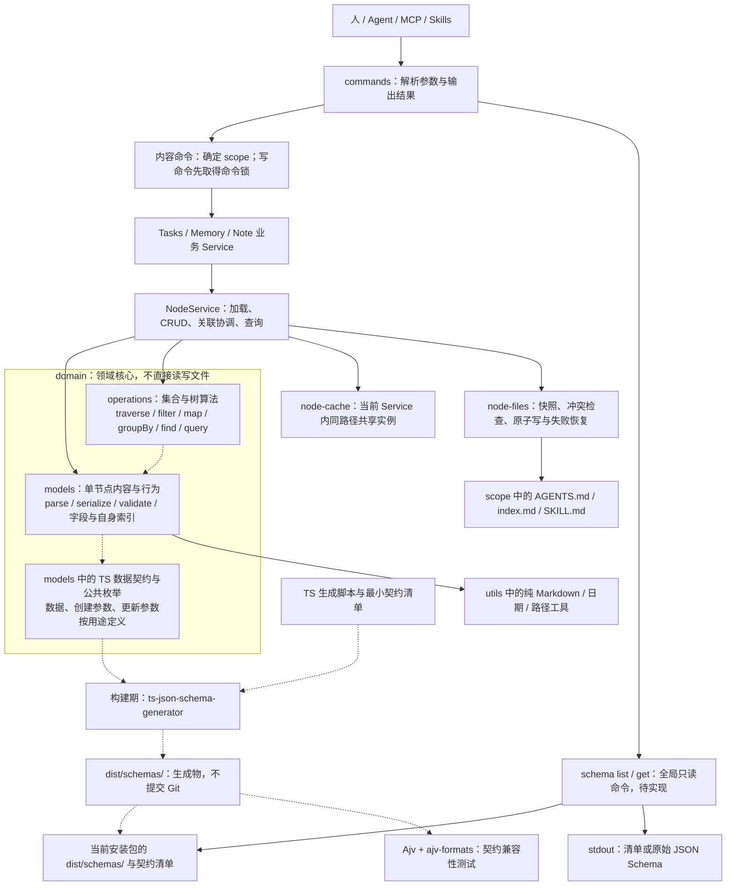
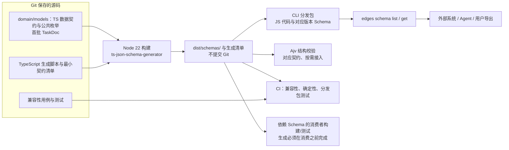

# Shared Node Capabilities Implementation Plan

> **For agentic workers:** REQUIRED SUB-SKILL: Use superpowers:subagent-driven-development (recommended) or superpowers:executing-plans to implement this plan task-by-task. Steps use checkbox (`- [ ]`) syntax for tracking.

**Goal:** 完成节点保存、AGENTS 索引维护、路径机制和登记树查询四项收敛，同时减少调用层与重复状态；接入 TS 契约生成、验证及 CLI 获取 Schema。

**Architecture:** CLI 调用业务 Service；业务 Service 复用 NodeService；NodeService 调用 domain/models、domain/operations 与现有文件保存实现。Model 保留纯内存领域行为，完整创建/更新/保存由 Service 协调。优先使用现有接口，不新增文档句柄或查询包装层。

**Tech Stack:** TypeScript、Node >=22（Node 22 基线）、node:test、tsx、现有 NodeService、InternalNode、operations、gray-matter、proper-lockfile、write-file-atomic、ts-json-schema-generator 2.9.0、Ajv 8 与 ajv-formats 3。

**Spec:** [通用能力收敛设计](../specs/2026-10-06-shared-node-capabilities.md)

状态：执行中；本轮已确认统一索引与独立旧格式迁移。关系位置由 LLM 判断、CLI 显式执行已确认；按本轮执行授权，完整 TaskDoc JSON 输入统一使用生成 Schema 校验，不能按旧补救流程实施。本版替代最初新增 node-documents、node-query、internal/documents、utils/markdown/index-rendering 文件的方案。此前[节点职责简化计划](2026-10-06-node-identity-simplification.md)已经完成，不重复执行。

## 架构审查结论与简化验收

2026-10-06 整体复核：方案的主要收益是减少重复实现与调用方需要理解的概念。Task 0 仅改善目录发现；Task 1–4 才删除重复机制；Task 5 消除数据定义重复并增加对外契约能力，但会增加构建、测试及分发代码。不能承诺总行数或总文件数一定减少，也不能把搬目录当作复用已经完成。

| 目标 | 实施后应该看到的变化 | 不以什么替代验收 |
| --- | --- | --- |
| 职责更清楚 | 单节点内容归 Model，集合算法归 operations，完整节点操作归 Service；依赖保持单向 | 只增加 domain 目录，留下原有旁路写入 |
| 复用更直接 | Tasks/Memory 共用 AGENTS 格式与 NodeService，路径判断共用原语；旧包装与重复算法删除 | 增加转发 helper、文档句柄或第二套保存接口 |
| 扩展成本更低 | 已有布局内新增叶子行为可用现有模型构造器/解析 hooks；新增集合操作只增加算法并组合到查询链；新增对外契约只登记 TS 类型与清单 | 要求每个节点先实现 Schema，或引入插件引擎、万能配置和全局 Service |
| 代码更简洁 | Task 1–4 报告删除的重复实现/公共概念和保留的业务差异；Task 5 单列必要新增成本 | 为减少文件数合并锁/缓存/恢复，或抽象掉业务政策 |

扩展边界仍是目录协议和已有 NodeServiceOptions；新增入口布局须显式修改 layout 及测试，不宣称能零改动支持任意格式。每个业务用例内，同一 managedRoot 和模型/写政策的 Service 应复用并向内部函数传递，不能每次 helper 调用都 new 一个来绕开共享实例；不同根或不同政策才是独立视图。不建立容器或跨命令全局缓存。

Task 5 在同一 plan 内作为独立可验收的后续步骤；其工具链接入失败不应迫使 Task 0–4 改变领域分工。实施报告分别说明“删除了什么重复机制”和“为新能力增加了什么”，保留实际行为与边界测试的证据。

## 关系位置与 Schema 执行决策

- **位置判断（已确认）：** LLM 根据当前对象的语义与上下文决定目录位置和本层/下层关系，CLI 接收明确的目标与 local/descendant 参数并执行。CLI 不根据 domain/maintenance、目录深度或节点类型代做作用域判断，不先自动登记后纠正；只检查路径、格式和关系一致性。更新未指定重新分类时保留已有位置；新增关系缺少必要位置输入时报参数错误，不猜测、不落盘后再补救。
- **Schema 为校验标准：** 按用户提出的方向及本轮执行授权，grouped/review-page 的完整 TaskDoc JSON 输入共用生成 Schema + Ajv 校验，删除两处手写字段校验。Ajv/formats 为运行时依赖，生成器为开发依赖。Markdown 输入、创建和更新参数用途不同，不套完整 TaskDoc Schema。

## Global Constraints

- TypeScript；Node >=22，以 Node 22 作为运行、构建和测试基线；不新增独立 package。Task 5 增加 ts-json-schema-generator 2.9.0 开发依赖及 Ajv 8、ajv-formats 3 运行时依赖；仅在适用的数据边界校验。
- 仅在独立 worktree 修改；不迁移仓库真实内容或用户私有数据。
- 创建、更新、删除、导入与持久化通过 Service 协调；Model 保留纯内存领域行为。
- 保留 NodeService 内同路径单实例、原地更新与实际受影响节点保存语义。
- 保留命令写锁、文件快照冲突检查、单文件原子保存与既有失败恢复。
- 保留 Markdown 非受控区域；不要求保留 YAML 注释或 YAML 样式。
- 保留既有 CLI 输出协议、默认 scope 与查询范围；涉及新关系登记的入口补充显式位置输入，不保留隐式猜测分组。新增全局只读 schema list/get，成功输出纯 JSON，失败仅写 stderr 并非零退出。
- domain/models 与 domain/operations 同级，算法按文件拆分；domain 不依赖 services（含类型依赖），不直接读写文件；不引入 NodeTree、全局 Service 或事务框架。

## 整体架构

以下是目标架构，尚待实施。Task 0–4 实施通用能力收敛；Task 5 接入 ADR 0025 确认的 Schema 生成、兼容性校验与 schema list/get。

### 运行时与生成器链路

实线表示运行时调用或数据读取；虚线表示类型依赖及构建期生成/分发。生成器链路与运行时在同图展示，生成器不随命令执行。



- Tasks、Memory、Note Service 并列，不互相调用；NodeService 不反向依赖业务 Service。业务政策留在各自模块，完整节点操作由 NodeService 协调。
- operations 不导入 Service；遍历所需 resolve/load 由 NodeService 注入。调用加载回调不表示 operations 拥有文件 IO。filter/map/groupBy 等保留泛型，图中的节点类型依赖主要适用于 traverse。
- InternalNode.addChild 仅维护自身索引；创建子目录、维护其他节点及保存归 Service。Model 单点职责不等于“不允许操作数组”。
- 内容命令的锁覆盖整个写命令，而不是每个 Model/Service 方法各取锁。读取 Schema 不走 scope、业务文档、节点缓存或写锁，不等待 stdin，也不在运行时生成 Schema。
- 按需使用的 Ajv 是结构校验工具，不增加服务层。它消费生成的契约，采用位置必须与该契约的输入/输出用途匹配；schema get 本身只负责读取产物，不运行校验或生成。

### Schema 的构建与分发

图中箭头表示生成与消费顺序；生成器只在构建期运行。此链路不从完整节点类推断 Schema，也不要求移动 Model 方法。



稳定边界是契约 key/$id 与 CLI 获取接口。现有审阅页的手写 JSON 路径及内联枚举读取方式需要迁移；消费者可以复用纯契约模块的公共常量，不能复制枚举或依赖完整节点实现。独立 dev/build/test/typecheck 必须准备其依赖的生成物，不能靠本机残留 dist。生成器留在 devDependencies；分发包在仓库外、无 TS 源码和开发依赖时仍可运行 schema list/get。

### 目录与职责对照

这是目标布局；Schema 命令文件及构建脚本由 Task 5 创建。

```text
extensions/cli/
├── src/
│   ├── commands/                 # 用户命令入口
│   │   └── schema.ts             # Task 5：schema list/get，只读编译产物
│   ├── services/
│   │   ├── tasks/ memory/ note/  # 各业务用例与政策
│   │   ├── node-service.ts      # 节点 CRUD、查询与关联协调
│   │   └── node-*.ts            # 锁、缓存、文件保存等内部实现
│   ├── domain/
│   │   ├── models/              # 节点类、局部行为、TS 数据契约
│   │   └── operations/          # 各集合/遍历/查询算法按文件拆分
│   └── utils/                  # 通用工具；domain 只使用无 IO 的部分
├── scripts/                    # Task 5：Schema 的 TS 生成脚本
├── test/                       # 模型、服务、集合操作及契约测试
└── dist/                       # 编译/分发产物，不提交 Git
    └── schemas/                # Task 5：生成的 JSON Schema 与清单
```

不增加 domain/schemas 手写层，不增加 SchemaService、DocumentService、NodeTree 或 reducer。旧源码侧 schemas/task-doc.v1.json 在兼容性验收和消费者切换后移除。领域职责与存储位置相互独立：Node 内存结构不替代 Markdown 文件，JSON Schema 也不是节点持久化格式。

## Model、operations 与 Schema 边界

Model 保留单个节点的内容、校验、parse/serialize、字段更新与自身子节点索引维护；operations 只承载集合处理、树遍历和查询组合，不接收从 Model 搬出的全部领域行为。Service 协调加载、跨节点关系及物理目录操作和保存。

InternalNode.addChild 虽接触子节点引用，修改的仍是自身索引，留在 Model；创建子目录并登记父索引由 Service 完成。traverse 从单个根出发也属于 operations，其文件加载回调由 Service 提供。集合算法保持泛型；关系维护不是对外脱离物理目录的 reparent 操作。

Schema 仅描述明确的 TS 对外数据契约，不要求节点类变成纯数据，也不为生成器搬迁方法或重写继承。Task 5 接入生成器及 Ajv 契约测试，不引入 reducer、dispatch 或 immutable；原地更新与共享实例继续保留。详见 spec 的“单个节点、集合操作与完整用例的边界”。

[ADR 0025](../../adr/0025-typescript-source-generated-json-schema.md)保存候选、取舍、生态依据、验证限制和重新评估条件。Task 5 负责实施，不能据此宣称已实现或为生成器扩大领域重构。

## 文件划分与实施顺序

| 现有位置 | 职责与本次改动 |
| --- | --- |
| `src/services/node-service.ts` | 节点 get/create/update/move/destroy/import/query；保留接口，补齐业务接入 |
| `src/services/node-files.ts`、`node-lock.ts`、`node-cache.ts` | 保存、锁、缓存的内部实现；职责不合并、不套新包装 |
| `src/domain/models/internal-node.ts`、`internal/{parse,serialize,blocks}.ts` | AGENTS 解析/序列化及受控区块；复用已有骨架生成，索引编码收在 serialize.ts |
| `src/utils/filesystem.ts` | 公共路径原语 |
| `src/services/memory/node-documents.ts` → `service.ts` | 保留 Memory 特有的 Service 配置与写前准备，删除文档句柄及 load/save 包装 |
| `src/services/tasks/`、`src/services/note/` | 现有业务流程直接调用通用 Service，保留业务规则 |
| `src/domain/operations/` | 保留现有惰性查询与遍历，不新增全仓查询包装 |
| `src/commands/schema.ts`、`scripts/generate-schemas.ts` | Task 5：获取安装包契约、构建生成；不增加 SchemaService |

表内 src 相对 `extensions/cli/`。执行顺序：domain 归组与依赖清理 → 路径 → AGENTS 格式 → 保存调用链 → 全仓查询 → Schema 生成与获取。Task 0 执行后，后续 Task 1–4 的源码路径均按新布局书写；test/models 和 test/operations 保持原位，只更新其源码引用。后两项复用的核心接口已存在，先跑基线再迁移；不要为了制造 RED 添加没有用户行为意义的实现断言。新增格式/路径行为则先补失败用例。

不把“删除所有小文件”作为目标；Task 0–4 不新增通用生产入口文件；Task 5 只新增 Schema 命令、生成脚本与必要的契约清单。Memory 的 service.ts 是原文件改名并删职责，不是增加一层服务。

依赖验收：业务 Service 并列、单向调用 NodeService；NodeService 不反向导入业务模块。scope/命令锁位于入口编排，node-files/cache 等属于内部实现。memoryNodes/projectNodes 是配置工厂，不是新的业务服务。模块内部不经自己的 index.ts 聚合入口导入内部工具。

## Task 0：将模型与操作归入 domain，清理请求类型反向依赖

**Files:**
- Move: `extensions/cli/src/models/` → `extensions/cli/src/domain/models/`
- Move: `extensions/cli/src/operations/` → `extensions/cli/src/domain/operations/`
- Exception move: 原 `extensions/cli/src/models/note/validation.ts` → `extensions/cli/src/services/note/validation.ts`，不进入 domain
- Update imports: `extensions/cli/src/**/*.ts`、`extensions/cli/test/**/*.ts`、`scripts/legacy-index.mts`、`scripts/migrate-directory-nodes.mts`，以及仓内静态搜索发现的其他源码消费者
- Update live docs: `extensions/cli/README.md`；本次 spec/plan 已使用目标布局；不批量改写已完成的历史设计记录
- Verify: `extensions/cli/tsconfig.json` 仍覆盖 `src/**/*.ts`，无须新增 package、path alias 或 domain 总入口
- Align runtime baseline: 根及 workspace `package.json` 的 Node engines、现有 Node 版本选择/CI 配置与当前开发文档；历史完成记录不批量改写

**Interfaces:**
- Exported names、类型与函数签名保持；仅导入路径改变。
- `domain/operations/traverse.ts` 继续依赖 `domain/models` 并由 Service 注入 resolve/load。
- `validateInput(input: unknown): IngestRequest` 与 `formatZodReason(error: z.ZodError): string` 原样移至 `services/note/validation.ts`，命令和测试改为从此处导入。
- domain 不导入 services/commands，包含 type-only import/export；models 不导入 operations；domain 使用的仓内 utils 必须不造成间接的 Service/文件 IO 依赖。

- [ ] 用 TypeScript 脚本盘点根及 workspace 的 Node engines 和已有版本选择/CI 配置，预览后将低于 22 的项目基线提升至 >=22；保留依赖自身更严格的要求。当前开发说明同步为 Node 22，基线与最终验收在 Node 22 下执行并记录 `node --version`。这是待实施步骤，本次文档更新不改变本机 Node 安装。
- [ ] 先盘点全部静态/动态模块引用及文本路径：`rg -n 'src/(models|operations)/|models/note/validation|from .*models/|from .*operations/' extensions scripts`。对 import/export 用 TypeScript compiler API 解析，不把示例文字当模块引用。
- [ ] 用临时 TypeScript 脚本建立文件映射，先列出待移动文件和待修改引用；`--check` 只输出清单，`--write` 才执行。执行前检查目标冲突，禁止覆盖已有文件；不保留两份模块。映射优先级如下：

```ts
function destination(relative: string): string {
  if (relative === 'extensions/cli/src/models/note/validation.ts')
    return 'extensions/cli/src/services/note/validation.ts';
  return relative
    .replace(/^extensions\/cli\/src\/models\//, 'extensions/cli/src/domain/models/')
    .replace(/^extensions\/cli\/src\/operations\//, 'extensions/cli/src/domain/operations/');
}
```

- [ ] 每条相对模块引用先解析成旧目标绝对路径，再将源文件与目标文件都套用映射，以新位置重新计算相对路径，并保持 .js 扩展名；只修改字符串 span，避免格式化整仓。处理 import、export-from、静态字符串 dynamic import 以及明确的路径 fixture。不能只做一次 `../models → ../domain/models` 字符串替换，移动文件到 utils/services 的相对层数也会变化。
- [ ] 原样移动 Note 请求校验到 services/note，修复对同目录 types.js 的类型导入；domain 中不保留转发。此步不调整 title/content/coAuthor 限制，也不改变 unknown 输入处理。
- [ ] 保留现有 `domain/models/index.ts` 与 `domain/operations/index.ts` 的导出，不新增 domain/index.ts 或 DomainService。models 内纯 Markdown 辅助实现随原目录一起移动，通用 `utils/markdown` 保持原位。
- [ ] 检查源码依赖图，明确排除 `domain → services/commands` 的运行时和类型边，以及 `domain/models → domain/operations`。本阶段 Memory 已知运行时循环留待 Task 1 修复，不能以此误判 domain 搬迁失败或提前声称全仓无循环。
- [ ] 基线回归（目录移动预期不改变行为）：`pnpm --filter edges-cli exec node --test --test-concurrency=1 --import tsx 'test/models/*.test.ts' 'test/operations/*.test.ts' test/note/utils/validation.test.ts test/note/ingest.test.ts test/services/node-service.test.ts`；运行 `pnpm --filter edges-cli exec tsc --noEmit --strict -p tsconfig.json`，并按现有方式检查迁移脚本与查询链类型测试的新引用。无需给纯搬目录制造失败断言。
- [ ] 同步 CLI README 的架构与源码链接；搜索源码/测试/脚本中旧入口引用应为零。旧的 test/models、test/operations 目录名是测试分类，不是遗漏迁移；历史设计引用也不伪装成新布局。
- [ ] 提交迁移：`git commit -m "refactor: group node models and operations under domain" -m "Co-authored-by: Codex <noreply@openai.com>"`。删除临时迁移脚本；后续 Task 1–4 均在新布局继续。

## Task 1：统一物理路径原语，保留业务边界

**Files:**
- Modify: `extensions/cli/src/utils/filesystem.ts`
- Modify: `extensions/cli/src/services/node-layout.ts`, `extensions/cli/src/services/node-files.ts`
- Modify: `extensions/cli/src/services/tasks/board.ts`, `extensions/cli/src/services/tasks/node-query.ts`
- Modify: `extensions/cli/src/services/memory/paths.ts`, `extensions/cli/src/services/note/git/ingest.ts`
- Modify: `extensions/cli/src/services/memory/types.ts` 及 typeIndexPath/typeContentDir/listTypeFiles 的直接消费者，仅切换这些函数的定义与导入位置
- Test: `extensions/cli/test/utils/filesystem.test.ts`, `extensions/cli/test/memory/core-boundaries.test.ts`, `extensions/cli/test/note/utils/git-ingest.test.ts`

**Interfaces:**
- Consumes existing `findAncestor(start: string, matches: (directory: string) => boolean, stopAt?: (directory: string) => boolean): string | undefined`.
- Produces in `utils/filesystem.ts`:

```ts
export function isWithinPath(file: string, root: string): boolean;
export function canonicalPath(file: string): string;
export function firstSymlink(file: string, stopAt?: string): string | undefined;
```

- Moves to existing `services/memory/types.ts` without changing signatures: `typeIndexPath(target: string, name: string): string`、`typeContentDir(target: string, name: string): string`、`listTypeFiles(target: string, name: string, pattern?: string): string[]`。

`isWithinPath` 使用 path.resolve/relative，允许 root 本身，不混淆目录名前缀。`canonicalPath` 解析已有祖先，允许末端不存在；链接循环报错。`firstSymlink` 从 file 向上查，包含 file、不包含 stopAt；无 stopAt 查到文件系统根；stopAt 非祖先时报错。返回链接路径，由调用方产生业务错误；缺失末端不阻止检查已有祖先。

- [ ] 在 filesystem 测试现有 imports 中加入三个函数及 `realpathSync`，新增以下用例：

```ts
test('path primitives distinguish containment and existing link ancestors', t => {
  const root = realpathSync(mkdtempSync(path.join(tmpdir(), 'path-primitives-')));
  t.after(() => rmSync(root, { recursive: true, force: true }));
  mkdirSync(path.join(root, 'real'));
  symlinkSync(path.join(root, 'real'), path.join(root, 'alias'));
  assert.equal(isWithinPath(path.join(root, '..draft/index.md'), root), true);
  assert.equal(isWithinPath(`${root}-other/index.md`, root), false);
  assert.equal(isWithinPath(root, root), true);
  assert.equal(canonicalPath(path.join(root, 'alias/new/index.md')),
    path.join(root, 'real/new/index.md'));
  assert.equal(firstSymlink(path.join(root, 'alias/new/index.md'), root),
    path.join(root, 'alias'));
  assert.equal(firstSymlink(path.join(root, 'real/new/index.md'), root), undefined);
  assert.throws(() => firstSymlink(root, path.join(root, 'real')));
  symlinkSync('loop', path.join(root, 'loop'));
  assert.throws(() => canonicalPath(path.join(root, 'loop')));
});
```

- [ ] RED：运行 `pnpm --filter edges-cli exec node --test --import tsx test/utils/filesystem.test.ts`；预期新导出不存在或新断言失败。
- [ ] 实现包含判断，迁移 Memory 的 realPath 算法为 canonicalPath，补上链接循环集合；实现 firstSymlink 的 lstat 祖先循环。沿用已有 ENOENT/ENOTDIR 处理，不吞掉 EACCES/ELOOP。

```ts
export function isWithinPath(file: string, root: string): boolean {
  const relative = path.relative(path.resolve(root), path.resolve(file));
  return relative === '' || (relative !== '..'
    && !relative.startsWith(`..${path.sep}`) && !path.isAbsolute(relative));
}
```

- [ ] 逐个替换重复机制：node-layout.within / Memory.within 调用公共包含判断；Memory.realPath 调用 canonicalPath；assertScopePath 与 assertBoardPath 调用 firstSymlink；Note 的 `relative.startsWith('..')` 改为精确包含判断。重复纯别名内部调用迁完后删除，业务 assert 包装保留。node-files 的 allowLinkedRead 分支必须保留。

```ts
// Memory 边界仍是 Memory 的政策：先验证逻辑/真实归属，再检查局部链接。
assertOwned(file, target);
const linked = firstSymlink(file, target);
if (linked) throw new Error(`Managed path contains a symbolic link: ${linked}`);
```

- [ ] 复用 findAncestor 替换有相同停止条件的祖先循环；保留 Memory resolveRoot 的显式根/Git 边界、scope 发现和 `~` 选项语义。不要把 stat-follow-links 与 lstat-no-links 的 isDirectory 合并成行为不同的一个函数。
- [ ] 断开已确认的 Memory 运行时循环 `paths → types → blocks → templates → paths`：将 typeIndexPath/typeContentDir/listTypeFiles 原样移至现有 types.ts，paths.ts 删除 discoverLayerTypes 导入。types.ts 直接使用本文件的 discoverLayerTypes，并从 paths.ts 引入所需基础函数。用 TypeScript 脚本批量切换消费者 import，paths.ts 不保留反向 re-export；Memory 对外 index.ts 已导出 types.ts，仍保持这些函数的对外可用性。

```ts
// 移到 types.ts，discoverLayerTypes 为该文件已有函数。
export const typeIndexPath = (target: string, name: string): string =>
  join(target, discoverLayerTypes(target)[name] ?? typeIndexRelpath(name));
export const typeContentDir = (target: string, name: string): string =>
  isExternalType(name) ? join(target, '.agents/skills') : dirname(typeIndexPath(target, name));
// listTypeFiles 的扫描、校验、去重与错误信息原样迁入本文件。
```
- [ ] GREEN：运行 `pnpm --filter edges-cli exec node --test --test-concurrency=1 --import tsx test/utils/filesystem.test.ts test/utils/scope.test.ts test/services/node-service.test.ts test/memory/core-boundaries.test.ts test/note/utils/git-ingest.test.ts test/tasks/utils/board.test.ts`。全部通过；检查 Note 位于合法 `..draft` 路径时不被拒绝，链接越界仍拒绝。
- [ ] 提交本任务文件：`git commit -m "refactor: share filesystem path primitives" -m "Co-authored-by: Codex <noreply@openai.com>"`。

## Task 2：统一 AGENTS 索引，旧 task-projects 由独立脚本迁移

**Files:**
- Modify: extensions/cli/src/domain/models/internal/{blocks,serialize}.ts、internal-node.ts 的既有索引接口（只在已有接口确实缺能力时修改）
- Remove after migration: extensions/cli/src/domain/models/memory/index-rendering.ts
- Modify: extensions/cli/src/services/tasks/project-meta.ts、services/memory/{blocks,entries,agents}.ts
- Create: scripts/migrate-agents-indexes.mts（只处理显式选定范围的旧 task-projects 索引）
- Extend tests: extensions/cli/test/models/internal.test.ts、test/tasks/utils/project-meta.test.ts、test/tasks/owner-board.test.ts、test/memory/core.test.ts
- Create: extensions/cli/test/tasks/agents-index-migration.test.ts

**Interfaces and policy:**
- 所有 Tasks 项目引用使用 InternalNode 的 localChildren/descendantChildren 和既有 serializer；正常命令不生成、更新或搬迁 task-projects 专属区块，不保留第二套业务索引渲染器。
- Tasks 只决定项目标题、描述、排序及哪些项目应登记；NodeService 协调关系更新和保存，Model 负责通用索引表达。Memory 也复用既有索引和序列化机制，其类型发现/模板/私有政策保留，不能将其他模块的索引全部覆盖。
- 新 AGENTS 骨架使用 createNodeModel/serializeNode；通用受控区块工具仍服务必要的模板填充，保留非受控正文与换行。不增加新的 Document/IndexService 或 moveBlock 框架。
- 旧格式只由显式运行的迁移脚本转换；正常写命令若发现会与通用索引冲突的旧标记，返回 migration-required 并给出脚本命令，不能暗中迁移、继续维护旧区块或重复登记。

- [ ] 基线盘点所有 task-projects 标记及其生产者/消费者；代码与测试用例分别处理，不迁移仓库真实内容。Task 3 的 refreshProjectIndex 后续只负责用通用关系接口对齐当前项目引用，不生成专属 Markdown 块。
- [ ] 先为普通 local 索引加行为用例：创建/更新项目后只有一条通用引用，标题/描述正确；不出现 task-projects 标记；其他关系、约束和非受控正文保留；重复更新幂等。用现有 InternalNode 读取结果断言，而非依赖 Tasks 专属标记。
- [ ] Tasks 新项目骨架复用 serializeNode(createNodeModel())，保留标题/描述及原 tail。删除 renderTaskProjectsSection、Tasks 专属区块 upsert/迁位分支；相关逻辑仅允许存在于迁移脚本，不让运行时代码 import 脚本。
- [ ] 更新项目索引时从当前 InternalNode 取得引用，按实际项目入口 id 修改属于本操作的条目，其余原样保留；通过 NodeService.update 保存。新登记项目的分组使用明确的调用参数；不把整个 localChildren 替换为项目列表，也不把 NodeService 自动登记和项目描述更新做成两套索引。
- [ ] 将 escapeIndexText/encodeIndexPath 原实现迁入 internal/serialize.ts，批量引用修改使用 TS 脚本，删除旧路径。Memory 模板仍校验必需区块，纯区块更新保留外部正文/CRLF；畸形区块返回错误，不自动修复。
- [ ] 实现独立脚本接口：默认 --check 只输出显式 --root 范围内候选和差异；--write 才应用。跳过 Git/依赖目录、符号链接和受保护的 posts；不扫描范围外路径，不自动运行全仓迁移。批量写入前全量检查冲突并保留可恢复原文；写操作使用既有锁/快照/原子保存机制，不自写另一套。

目标用法（待实施）：

~~~sh
pnpm --filter edges-cli exec tsx ../../scripts/migrate-agents-indexes.mts --root /absolute/scope --check
pnpm --filter edges-cli exec tsx ../../scripts/migrate-agents-indexes.mts --root /absolute/scope --write
~~~

- [ ] 迁移时解析唯一完整的旧区块，将链接转为普通 local 引用，按解析后的入口 id 去重；仅去掉旧标记与可识别的机器提示，保留自定义正文、链接标题/描述及其他章节。与已有引用分组或描述冲突、链接无法识别、重复/半缺失/逆序标记时明确报告该文件，不猜测或静默覆盖。全部成功迁移的文件再次 --check 不产生差异。
- [ ] 迁移测试覆盖旧区块在 local 内/外、已有相同引用、冲突引用、自定义正文、CRLF、畸形标记；检查预览不写、重复执行幂等、源文件在预览后变化时报错。正常 Tasks 测试覆盖旧格式得到迁移提示，迁移后同一操作成功。旧“自动搬区块”测试改为脚本测试，不继续约束正常命令。
- [ ] 回归运行：pnpm --filter edges-cli exec node --test --test-concurrency=1 --import tsx test/models/internal.test.ts test/tasks/utils/project-meta.test.ts test/tasks/owner-board.test.ts test/tasks/agents-index-migration.test.ts test/memory/core.test.ts test/memory/distribution.test.ts。
- [ ] 提交统一格式及脚本，附 Co-authored-by；不在本次实现时自动迁移真实仓库内容。

## Task 3：业务写操作统一经过 NodeService

**Files:**
- Rename/reduce: `extensions/cli/src/services/memory/node-documents.ts` → `extensions/cli/src/services/memory/service.ts`
- Modify: `extensions/cli/src/services/memory/{init,add-type,agents,entries,doctor,remember,types,paths}.ts`
- Modify: `extensions/cli/src/services/tasks/project-meta.ts`, `extensions/cli/src/services/tasks/board.ts`
- Modify only duplicated persistence/path calls: `extensions/cli/src/services/note/git/ingest.ts`
- Extend tests: `extensions/cli/test/tasks/{project,owner-board}.test.ts`, `extensions/cli/test/memory/core-boundaries.test.ts`, `extensions/cli/test/note/utils/git-ingest.test.ts`
- Reuse tests: `extensions/cli/test/services/{node-service,shared-node-state,node-files-atomic}.test.ts`

**Interfaces:**
- Consumes existing NodeService methods (不新增 save/upsert 接口)：

```ts
get<T extends BaseNode>(file: string, Model: Model<T>): Promise<T | undefined>;
create<T extends BaseNode>(node: T, input: Parameters<T['create']>[0]): Promise<T>;
update<T extends BaseNode>(node: T, input: Parameters<T['update']>[0]): Promise<T>;
```

- Existing `readEntry(file: string, allowLinkedRead?: boolean): EntryFile | undefined` and `saveEntries(changes: readonly FileChange[]): Map<string, EntryFile | undefined>` handle普通文本。
- Memory.service.ts retains `memoryNodes(target: string): NodeService` and provides **业务准备函数** `prepareMemoryWrite(target: string, file: string): string`：校验 scope、canonical 化目标、按类型准备 gitignore，返回 canonical entry path。它不读/解析节点、不持有 existed、不保存。
- Tasks.project-meta.ts 的私有 `projectNodes(target: BoardTarget): NodeService` 构造带限定写政策的 scope Service。

Service 内可以实例化具体 Model 作为 create 的目标参数；这不等于绕过 Service 创建文件。CLI/Skills 提交业务参数；不让它们自行 new/parse/update 模型或拼接“先修改，再保存”的流程。本轮不为隐藏一个构造器另改所有 NodeService 方法签名。

- [ ] 先运行本任务列出的现有 service / tasks / memory / note 测试，记录基线。已有服务冲突、身份和恢复合同不应因本轮代码整理而变化。
- [ ] Memory 原文件改名 service.ts，保留 memoryNodes 的 readOnlyReference/assertWrite；把加载前检查抽成 prepareMemoryWrite。删除 MemoryDocument/loadMemoryDocument/saveMemoryDocument，全部消费者改为直接获取节点并调用 NodeService.create/update。重复批量 import/命名变更使用临时 TypeScript 脚本。
- [ ] 修改内存节点之前，通过 Service 加载现有对象和快照。现有文档更新走 input，不先 node.parse(source) 或 node.body = source：

```ts
// Memory 业务 Service 内；NodeService 本身调用 InternalNode.parse/validate。
const file = prepareMemoryWrite(target, entryPath);
const node = await service.get(file, InternalNode);
if (node) {
  const source = upsertBlock(node.body, start, end, block);
  await service.update(node, { body: source });
} else {
  await service.create(new InternalNode(file), { body: template });
}
```

这里 entryPath/start/end/block/template 来自对应操作已有参数、标记和模板。完整模板含 frontmatter 时，用现有 parseDocument 得到 metadata/body 作为 create input；不把整篇含头 Markdown 当 body。已有节点只修改正文时不覆盖未知 metadata。
- [ ] Memory.remember 保留 fields/provenance 生成与未知 metadata 合并规则，用模型对应的结构化 input 调用 update/create；完整 Markdown 导入继续 NodeService.import。init/add-type/refreshIndex 同一目标视图可传递同一个 service；跨 owner 的 syncIndexEntry 为明确的独立视图，不建立全局 Service。
- [ ] Tasks 项目/看板/owner 入口先通过 projectNodes 加载，再生成输入并更新。projectNodes managedRoot 为 canonical scope；assertWrite 只允许当前 board 内节点及精确匹配、已存在的 scope/AGENTS.md；board 仍执行 assertBoardPath。缺失 owner 不创建。ownerBoardChange 的独立 raw FileChange 写入移除，关系更新经 Service.update 的 InternalUpdateInput 提交。

```ts
// owner 已通过同一 service 加载；保留已有其他关系，不直接 owner.addChild。
const localChildren = owner.localChildren.filter(ref => ref.id !== boardEntry);
const descendantChildren = owner.descendantChildren.filter(ref => ref.id !== boardEntry);
const existingReference = owner.children.find(ref => ref.id === boardEntry);
await service.update(owner, {
  localChildren: [...localChildren, existingReference ?? { id: boardEntry }],
  descendantChildren,
});
```

该示例仅展示调用方明确选择 local 后的执行路径；同样支持显式 descendant。位置由 LLM 决定，CLI 不按 purpose 推导或自动改组。不要借示例重新排序无变化的引用。新建项目自动维护 board 索引后，后续刷新从同一 Service 对象取当前 body，不能沿用创建前字符串。

- [ ] 将 LLM/调用方明确选择的位置从 CLI 输入传递至业务 Service 和通用登记操作；已有 localChildren/descendantChildren 是最终关系表达，复用现有 ChildGroup，不引入新位置模型。删除 Tasks 根据 purpose 自动选组/改组的分支。需要新建 owner 引用但未提供位置时在任何写入前返回参数错误；已有引用更新未显式要求移动时保留原分组。根节点或独立 harness 关系不虚构父级 children 登记。
- [ ] 回归：对同一合法目录入口，显式 local 与 descendant 均按输入登记，purpose 不改变选择；缺少必要位置时无文件写入；重复更新保持原位置及标签/链接拼写；非法路径、组成环等仍报错。同一用例内复用 Service，缺失 owner 不自动创建。
- [ ] TaskNode CRUD 已经走 NodeService，保持其现有接口；run log/附件仍是资源。project-meta 的 AGENTS 保存不得再调用 BoardWriter.writeFile；BoardWriter 继续用于业务盘点和资源，不增加第二套节点持久化。
- [ ] Note 保留 Git 操作顺序与现有 NodeService.create/update/import；去掉重复保存机制即可，不强迫经过新的公共 helper。校验草稿在业务 Service 内仍可使用 Model，但只由 NodeService 更新受管节点和文件。不得提前到 checkout/pull 之前加载。
- [ ] `.gitignore` 的原子写改用既有文件 IO，删除 Memory.writeAtomic 及无用导入。保持模式和私有类型准备顺序：

```ts
const before = readEntry(ignorePath);
const previous = before?.source ?? '';
const missing = patterns.filter(pattern => !previous.split(/\r?\n/).includes(pattern));
if (missing.length) {
  const source = `${previous.trimEnd()}\n\n# Private harness type ${name}\n${missing.join('\n')}\n`;
  saveEntries([{ path: ignorePath, before, source, createMode: 0o600 }]);
}
```

- [ ] 为实际业务调用补充至少一个回归：createProject → updateProject 后，项目正文 tail、board 的外部索引与 owner 自定义约束保持，缺失 owner 仍缺失。用已有 project/owner-board fixture，保留返回值和路径断言；继续运行已有文件漂移/创建竞争/保存失败恢复用例。
- [ ] GREEN：`pnpm --filter edges-cli exec node --test --test-concurrency=1 --import tsx test/services/node-service.test.ts test/services/shared-node-state.test.ts test/services/node-files-atomic.test.ts test/tasks/project.test.ts test/tasks/owner-board.test.ts test/memory/core-boundaries.test.ts test/memory/adoption.test.ts test/note/utils/git-ingest.test.ts`。
- [ ] 提交：`git commit -m "refactor: route node writes through services" -m "Co-authored-by: Codex <noreply@openai.com>"`。

## Task 4：直接复用 NodeService.query

**Files:**
- Modify: `extensions/cli/src/services/tasks/node-query.ts`, `extensions/cli/src/services/tasks/grouped.ts`
- Extend test: `extensions/cli/test/services/node-service.test.ts`
- Reuse tests: `extensions/cli/test/tasks/{all-scopes,node-query}.test.ts`, `extensions/cli/test/operations/{async-query,traverse}.test.ts`

**Interfaces:**
- Consumes existing `NodeService.query(scopePath: string, options?: NodeQueryOptions): AsyncQuery<BaseNode>`。
- Produces no new公共接口；删除 repositoryNodeQuery，保留 Tasks 专用 listRepositoryTaskNodes 与布局归属函数。

- [ ] 给现有 NodeService 测试增加混合类型及惰性断言。下列测试自行创建 fixture，不依赖其他测试状态；imports 使用现有同名 fs/path/test/assert/tmpdir 或补齐。

```ts
test('generic query supports all types and explicit task-only deferred execution', async t => {
  const root = fs.realpathSync(fs.mkdtempSync(path.join(tmpdir(), 'generic-query-')));
  t.after(() => fs.rmSync(root, { recursive: true, force: true }));
  const note = path.join(root, 'notes/example/index.md');
  const service = new NodeService({ managedRoot: root });
  await service.create(new InternalNode(path.join(root, 'AGENTS.md')), {});
  await service.create(new NoteNode(note), { body: '# Note\n' });
  let seen = 0;
  const all = service.query(root, { includeDescendants: true, includeHarness: true })
    .map(node => { seen += 1; return node; }).groupBy(node => node.type)
    .mapValues(nodes => nodes.length);
  assert.equal(seen, 0);
  assert.equal((await all.value()).note, 1);
  assert.ok(seen > 0);
  fs.writeFileSync(note, '---\nbroken: [\n---\n');
  // 新 Service 视图观察当前磁盘，不用缓存掩盖类型筛选的正文跳过。
  const fresh = new NodeService({ managedRoot: root });
  assert.deepEqual(await fresh.query(root, {
    types: ['task'], includeDescendants: true, includeHarness: true,
  }).value(), []);
  await assert.rejects(new NodeService({ managedRoot: root }).query(root, {
    includeDescendants: true, includeHarness: true,
  }).value());
});
```

- [ ] 基线：`pnpm --filter edges-cli exec node --test --import tsx test/services/node-service.test.ts`。这些能力已存在，预期通过；迁移不要求改写查询算法。
- [ ] Tasks 的 listRepositoryTaskNodes 直接使用以下调用；NodeService 构造保留在业务 Service 内：

```ts
const canonicalRoot = fs.realpathSync(root);
const service = new NodeService({ managedRoot: canonicalRoot });
return service.query(canonicalRoot, {
  types: ['task'], includeDescendants: true, includeHarness: true,
}).filter((node): node is TaskNode => node instanceof TaskNode).value();
```

- [ ] grouped.ts 的全仓项目发现使用同一 query API，显式 `types: ['internal']`；删除 repositoryNodeQuery 的定义和导入。boardLocationOf/taskLocationOf/projectLocationOf、CLI Git-root 发现保持 Tasks 业务职责。不新增 services/node-query.ts，不改变默认 query 的 local 范围。
- [ ] GREEN：`pnpm --filter edges-cli exec node --test --test-concurrency=1 --import tsx test/services/node-service.test.ts test/tasks/all-scopes.test.ts test/tasks/node-query.test.ts test/operations/async-query.test.ts test/operations/traverse.test.ts`。覆盖局部板、全仓双方用途、重复引用、叶子 harness、未登记目录与惰性链。
- [ ] 提交：`git commit -m "refactor: reuse node service queries directly" -m "Co-authored-by: Codex <noreply@openai.com>"`。

## Task 5：从 TS 契约生成 TaskDoc Schema，提供 CLI 获取命令

**Files:**
- Modify: `extensions/cli/src/domain/models/tasks/task-doc.ts`、`tasks/types.ts`；Task 0 后的路径，数据契约及公共枚举留在对应模型模块
- Create: `extensions/cli/scripts/generate-schemas.ts`、`extensions/cli/scripts/schema-contracts.ts`；生成脚本及唯一源清单，不建立运行时服务层
- Create: `extensions/cli/src/commands/schema.ts`、`extensions/cli/src/services/tasks/task-doc.ts`（两个 JSON 入口共用的契约校验边界）
- Modify: `extensions/cli/src/program.ts`、`context.ts`、`utils/process-input.ts`；注册命令、限定 Schema 错误输出及 stdin 行为
- Modify: `extensions/cli/package.json`、`pnpm-lock.yaml`、`extensions/apps/tasks-review-app/package.json`、`src/statuses.ts`、`src/types.ts`；依赖、构建顺序及消费者去重
- Modify: `extensions/cli/src/services/tasks/grouped.ts`、`review-page.ts`；TaskDoc JSON 输入适配器接受契约允许的扩展 metadata
- Extend tests: `extensions/cli/test/tasks/utils/grouped.test.ts`、`review-page.test.ts`；合法 TaskDoc 经两个公开 JSON 入口保留数据
- Create: `extensions/cli/test/schema/contract.test.ts`、`command.test.ts`、`package.test.ts`
- Remove after compatibility checks: `extensions/cli/schemas/task-doc.v1.json`
- Update: `extensions/cli/README.md`、ADR 0025 与本 spec/plan 的实施状态

**Interfaces:**
- 保留 `TaskDoc` 及 `taskDocFromParsed` / `taskDocFromMarkdown` 的用途；只给对外数据形状生成 Schema，不导出完整 TaskNode 类。
- `pnpm --filter edges-cli run build:schemas` 运行 TS 脚本，生成 `dist/schemas/task-doc.v1.json` 与 `manifest.json`。清单字段为 key/id/title/description/file；list 只投影前四项。
- `schema-contracts.ts` 唯一登记 key、类型入口、类型名、文件名及 `$id`；title/description 从契约声明生成。运行时消费生成清单，不加载脚本或生成器。
- `addSchemaCommand(program: Command, ctx: CliContext): void` 注册 list/get，沿用 `ctx.result: CliResult`。get 接受清单 key，使用安装位置相对 URL 读取固定产物路径。

### 5.1 契约和兼容性

- [ ] 先建立正反例表，旧文件删除前同时验证旧、新 Schema；两种方言用独立 Ajv 实例，避免相同 `$id` 冲突。旧 Schema 通过 `git show` 读取迁移前提交的版本做迁移对比，不在仓库增加另一份长期手写 Schema。提交后保留行为用例作为回归基准。
- [ ] 安装锁定的 ts-json-schema-generator 2.9.0，开发依赖，以及 Ajv 8、ajv-formats 3 运行时依赖。在 Node 22 下执行，不用此前 Node 25 探针代替正式验收。
- [ ] 保留四个必填字段，允许空字符串，顶层不允许额外字段；metadata 已知字段有约束，未知字段接受 JSON 值而非仅字符串。复用七态与优先级常量；项目 id 保留正则、64 字符上限及排除状态名，允许 default，拒绝 _default。日期格式、task 类型常量、指派字段约束不遗漏。
- [ ] 在 TS 契约上使用生成器支持的声明/JSDoc 表达约束，显式检查生成结果。无法表达的旧约束先报告具体缺口，不能用 formatter、字符串修补、删约束或仅替换 `$schema` 达成通过。若接受语义不兼容，不覆盖 v1，先记录需要版本化的差异。
- [ ] 为生成物加入测试。以下是核心断言形状；`generated` 为 build:schemas 的 JSON，补齐上述每个字段的边界样例：

```ts
const ajv = new Ajv({ coerceTypes: false, useDefaults: false, removeAdditional: false });
addFormats(ajv);
const validate = ajv.compile(generated);
const valid = { name: '', description: '', metadata: { custom: { nested: true } }, body: '# Task' };
assert.equal(validate(valid), true);
assert.equal(validate({ ...valid, extra: true }), false);
assert.equal(validate({ ...valid, metadata: { 'edges-task-project': '_default' } }), false);
assert.equal(validate({ ...valid, metadata: { 'edges-task-project': 'default' } }), true);
const invalid = { ...valid, metadata: { 'edges-tasks-status': 'unknown' } };
const before = structuredClone(invalid);
assert.equal(validate(invalid), false);
assert.deepEqual(invalid, before);
```

### 5.2 构建和消费者迁移

- [ ] 实现生成器脚本及最小清单；复用 generator API 的 `createGenerator({ path, tsconfig, type }).createSchema(type)`，采用支持的配置/JSDoc 提供约束和标识。输出完整 draft-07 Schema，不展开或手工改写 `$ref`。生成脚本允许测试指定临时输出目录，以便两次独立生成比较。
- [ ] 在干净状态运行 build:schemas，再执行兼容性测试；相同输入在两个临时目录生成的文件集合和字节应一致，不带时间戳或机器绝对路径。
- [ ] 审阅页优先直接复用纯 TS 公共常量和 TaskDoc 类型，去掉读取内联 `properties.metadata.properties` 的依赖；类型导入不牵入节点运行时或文件 IO。新契约不能顺带改变当前 Markdown parser 的标量处理行为。
- [ ] 在 services/tasks/task-doc.ts 放一个共享 TaskDoc 输入校验函数（明确的边界，不是新服务层），读取已生成的契约并惰性编译、复用 Ajv 验证器；grouped.ts 和 review-page.ts 调用它，删除重复手写结构/字段校验。Schema 缺失时报构建错误，不回退源码。非法输入报告字段路径，不转换、不填默认值、不删字段；合法数据包括扩展 metadata 原样保留。已知字段、未知顶层字段的接受语义以 Schema 为准，记录对旧宽松输入的影响。domain 不读文件或依赖此 Service；前端仍只导入纯类型/常量。
- [ ] 在现有合法 grouped/review-page fixture 的 item.doc 上依次放入 `metadata: { custom: { nested: true }, tags: ['a'], count: 1, enabled: false, extra: null }`；分别调用 parseGroupedList、parseReviewPageInput，断言 doc 深度相等、输入未变。保留已知字段类型错误用例，添加非法状态、日期、未知顶层字段等反例，两入口与 Schema 一致拒绝；这是用户选择 Schema 权威后的显式兼容性调整，文档说明。
- [ ] 调整 scripts：Schema 消费前运行 build:schemas；CLI build/prepack 包含生成，清理 dist 必须发生在生成之前。独立 app dev/build/test/typecheck 若仍读取产物，显式调用 build:schemas，不能调用整个 CLI build 形成构建环。只依赖 TS 公共常量/类型的步骤不需无意义生成。
- [ ] package 的发布文件包含编译代码、Schema 和 manifest，生成器仍在 devDependencies，Ajv/formats 在 dependencies；完成兼容性对照并切换消费者后删除旧 JSON。检索旧路径，生产/测试消费者应无残留；历史 ADR 可保留旧路径背景。

### 5.3 CLI 与安装包验收

- [ ] RED：先以现有 `run(argv, input)` 编写 list/get 用例，确认未注册时失败。最小示例：

```ts
const listed = await run(['schema', 'list'], { env: {}, stdinIsTTY: true });
assert.equal(listed.exitCode, 0);
assert.deepEqual(JSON.parse(listed.stdout).map((item: { key: string }) => item.key), ['task-doc/v1']);
const result = await run(['schema', 'get', 'task-doc/v1'], { env: {}, stdinIsTTY: true });
assert.equal(result.exitCode, 0);
assert.equal(result.stderr, '');
assert.equal(JSON.parse(result.stdout).$id, 'edges.task-doc/v1');
const missing = await run(['schema', 'get', '../other'], { env: {}, stdinIsTTY: true });
assert.notEqual(missing.exitCode, 0);
assert.equal(missing.stdout, '');
assert.ok(missing.stderr.length > 0);
```

- [ ] 实现只读命令。通过清单查找固定文件，不把 key 当路径；未知 key、缺少参数、未知选项和缺失产物均非零、stderr 报错。调整全局错误处理时只影响 schema 分支，其他命令保持原协议。缺失产物提示重新构建/安装，不现场生成。
- [ ] schema 命令不解析 scope、不获取写锁或读取节点。进程入口对 schema 分支跳过 stdin 消费，包括错误参数 `--from -`；用子进程保持 stdin 未关闭验证能及时退出，超时清理子进程。验证无效 scope/仓库外 cwd 不阻止正常 list/get，也没有创建工作区文件。
- [ ] GREEN：`pnpm --filter edges-cli run build:schemas` 后运行 `pnpm --filter edges-cli exec node --test --test-concurrency=1 --import tsx 'test/schema/*.test.ts'`；测试包含生成确定性、正反例、纯 JSON 输出、异常参数与无 stdin 等待。
- [ ] 消费者回归：`pnpm --filter edges-cli exec node --test --test-concurrency=1 --import tsx test/tasks/utils/grouped.test.ts test/tasks/utils/review-page.test.ts test/tasks/grouped-list.test.ts`；合法扩展 metadata 不在 CLI JSON 适配阶段被拒绝，前端类型检查与显示同样通过。
- [ ] 从干净构建打包，将安装包放到仓库外临时目录，仅安装 production 依赖，确保没有 TS 源码或生成器开发依赖，只有生产依赖；执行编译后的 list/get。暂移一份临时包内 Schema 验证明确报错及不生成兜底。此测试不能拿工作树源码执行代替分发包。
- [ ] 运行 CLI 与审阅页独立构建/测试/typecheck，记录实际 Node 22 结果；确认 `git ls-files extensions/cli/dist` 无输出。更新 README 的命令及构建说明、ADR 实施状态，提交 `feat: generate and expose TaskDoc JSON Schema`，带 Co-authored-by。

## 最终验收

- [ ] 审查职责边界：parse/serialize/validate、字段更新与自身索引维护仍归 Model；operations 保留集合/遍历/查询职责；完整文件与跨节点变更通过 Service。没有为 Schema 生成搬迁节点方法或替换继承体系。
- [ ] 对照“架构审查结论与简化验收”报告被删除的重复机制、公共概念和新增构建成本；验证 Tasks 使用通用索引、旧区块仅由独立脚本迁移及创建关系分组符合最终决策，同一用例内同政策 Service 复用。不能仅用移动目录、行数或文件数证明简化完成。
- [ ] Task 5 全部通过：TS 为字段唯一源，v1 兼容性与方言已验证；干净构建和仓库外分发包可获取 Schema，生成物不入 Git；Ajv 不修改输入，也未误用到可省略字段的原始 Markdown。ADR 中保留选型依据、候选取舍、探针限制与实际验收结果。
- [ ] `rg -n 'MemoryDocument|loadMemoryDocument|saveMemoryDocument|repositoryNodeQuery|writeAtomic|domain/models/memory/index-rendering' extensions/cli/src`：本轮移除的包装与旧路径无残留。不新增 NodeDocument/DocumentService/save 包装。
- [ ] 检查 project-meta.ts 的 AGENTS 保存已通过 NodeService；检查业务更新采用 Service input，未因删除包装变成直接修改对象后 raw writeFile。Model 内存方法与内部校验草稿仍可存在。
- [ ] 检查 domain 与纯 utils 无业务 Service 反向依赖（含 type-only import/export），domain/models 不依赖 domain/operations。Memory 的未登记文件盘点保持物理扫描，不能以 query 替代。
- [ ] 用 TypeScript compiler API 扫描 src 的 import/export，排除 type-only 边，将相对 .js 路径解析到 .ts 后检查强连通分量。涉及 services 的运行时循环必须为零；Tasks/Memory/Note 之间及 node-* → 业务 Service 的导入边保持为零。重点确认 paths.ts 不再导入或转发 types.ts；不能只用声明图掩盖实现循环。
- [ ] 运行 `pnpm test`、`pnpm build`、`pnpm --filter edges-cli exec tsc --noEmit --strict -p tsconfig.json`、`git diff --check`。上一轮 934 项是历史基线，本轮报告实际结果。CLI 测试文件继续串行，保留真实多进程锁用例。
- [ ] 使用 requesting-code-review 审查：owner/board 自动索引和手工刷新是否冲突；节点快照是否早于生成更新；未受控 Markdown 是否完整；模型仍可变而保存受 Service 管理；私有类型、模板分发、scope 与查询范围是否保持。
- [ ] 完成后更新本计划和 spec 状态、相关开发文档及项目记忆，提交并更新当前 PR；保持待合并。只按此计划修改 CLI 基础设施，不迁移真实内容。

## 自查映射

Task 0 先完成 domain 归组并消除类型反向依赖；四项收敛目标分别对应 Task 1 路径、Task 2 格式、Task 3 保存、Task 4 查询；Task 5 落实 Schema 选型、生成链路、消费者迁移、CLI 获取与分发验收。取消了四个拟新增的公共入口文件以及 NodeDocument 状态包装；Memory 原业务文件改名并减职责。保留各模块政策和此前已确认的 operations 拆分；models/operations 从原 src 顶层共同迁入 domain，二者保持同级。新方案不将 Service 的创建/保存职责转移给调用方或 Model，也不把所有代码合并进一个大文件。
