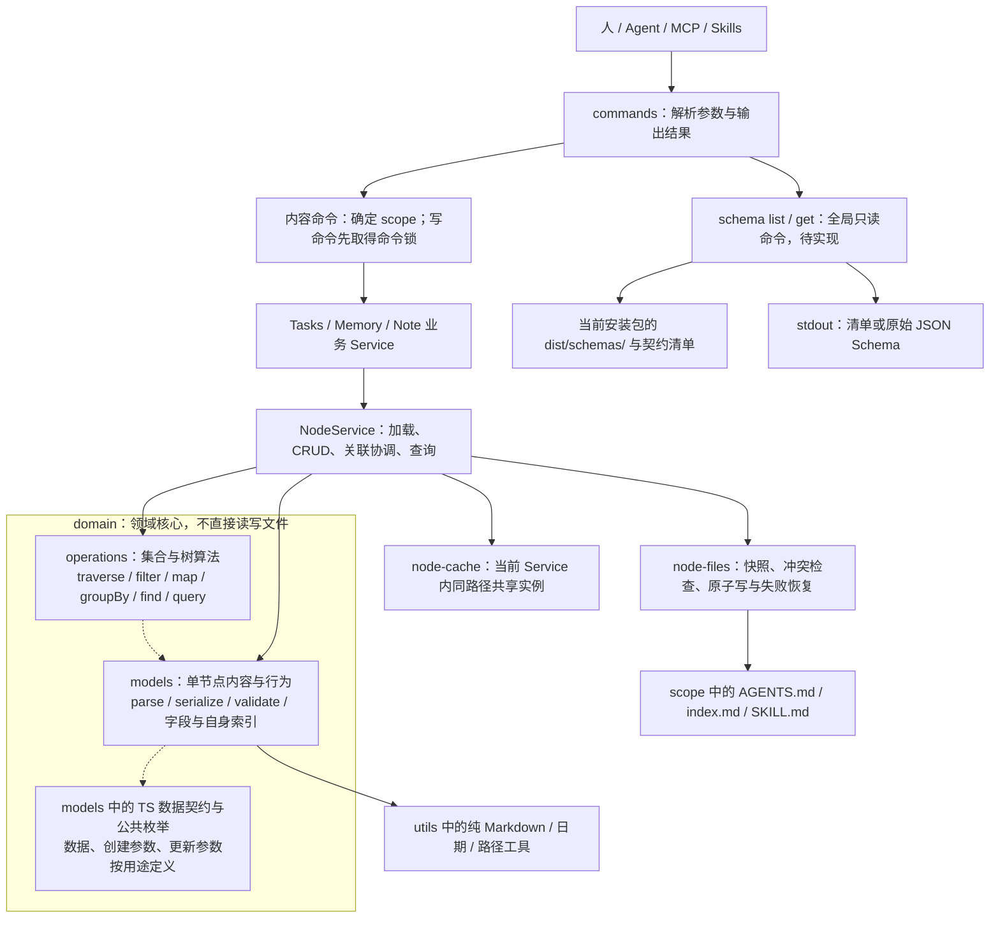
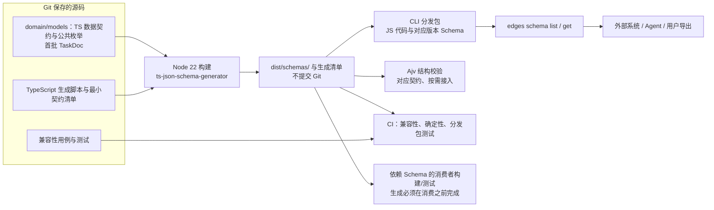

# Shared Node Capabilities Implementation Plan

> **For agentic workers:** REQUIRED SUB-SKILL: Use superpowers:subagent-driven-development (recommended) or superpowers:executing-plans to implement this plan task-by-task. Steps use checkbox (`- [ ]`) syntax for tracking.

**Goal:** 完成节点保存、AGENTS 索引维护、路径机制和登记树查询四项收敛，同时减少调用层与重复状态。

**Architecture:** CLI 调用业务 Service；业务 Service 复用 NodeService；NodeService 调用 domain/models、domain/operations 与现有文件保存实现。Model 保留纯内存领域行为，完整创建/更新/保存由 Service 协调。优先使用现有接口，不新增文档句柄或查询包装层。

**Tech Stack:** TypeScript、Node >=22（Node 22 基线）、node:test、tsx、现有 NodeService、InternalNode、operations、gray-matter、proper-lockfile 与 write-file-atomic。

**Spec:** [通用能力收敛设计](../specs/2026-10-06-shared-node-capabilities.md)

状态：待实施。本版替代最初新增 node-documents、node-query、internal/documents、utils/markdown/index-rendering 文件的方案。此前[节点职责简化计划](2026-10-06-node-identity-simplification.md)已经完成，不重复执行。

## Global Constraints

- TypeScript；Node >=22，以 Node 22 作为运行、构建和测试基线；本计划不新增运行时依赖或独立 package。
- 仅在独立 worktree 修改；不迁移仓库真实内容或用户私有数据。
- 创建、更新、删除、导入与持久化通过 Service 协调；Model 保留纯内存领域行为。
- 保留 NodeService 内同路径单实例、原地更新与实际受影响节点保存语义。
- 保留命令写锁、文件快照冲突检查、单文件原子保存与既有失败恢复。
- 保留 Markdown 非受控区域；不要求保留 YAML 注释或 YAML 样式。
- 保留 CLI 参数、输出协议、默认 scope 与查询范围；不新增 CLI 命令。
- domain/models 与 domain/operations 同级，算法按文件拆分；domain 不依赖 services（含类型依赖），不直接读写文件；不引入 NodeTree、全局 Service 或事务框架。

## 整体架构

以下是目标架构，不表示代码已迁移。Task 0–4 实施通用能力收敛；Schema 构建和 schema list/get 是 ADR 0025 已确认、另行接入的能力，也画入全图以说明边界。上面的“不新增运行时依赖/CLI 命令”限定 Task 0–4，不否定后续 Schema 接入。

### 运行时调用

实线表示调用或数据读取；虚线表示使用数据契约/节点类型。两条命令路径分别处理内容与读取安装包契约。



- Tasks、Memory、Note Service 并列，不互相调用；NodeService 不反向依赖业务 Service。业务政策留在各自模块，完整节点操作由 NodeService 协调。
- operations 不导入 Service；遍历所需 resolve/load 由 NodeService 注入。调用加载回调不表示 operations 拥有文件 IO。filter/map/groupBy 等保留泛型，图中的节点类型依赖主要适用于 traverse。
- InternalNode.addChild 仅维护自身索引；创建子目录、维护其他节点及保存归 Service。Model 单点职责不等于“不允许操作数组”。
- 内容命令的锁覆盖整个写命令，而不是每个 Model/Service 方法各取锁。读取 Schema 不走 scope、业务文档、节点缓存或写锁，不等待 stdin，也不在运行时生成 Schema。
- 按需使用的 Ajv 是结构校验工具，不增加服务层。它消费生成的契约，采用位置必须与该契约的输入/输出用途匹配；schema get 本身只负责读取产物，不运行校验或生成。

### Schema 的构建与分发

图中箭头表示生成与消费顺序；生成器只在构建期运行。此链路不从完整节点类推断 Schema，也不要求移动 Model 方法。



稳定边界是契约 key/$id 与 CLI 获取接口。现有审阅页的手写 JSON 路径及内联枚举读取方式需要迁移；消费者可以复用纯契约模块的公共常量，不能复制枚举或依赖完整节点实现。独立 dev/build/test/typecheck 必须准备其依赖的生成物，不能靠本机残留 dist。生成器留在 devDependencies；分发包在仓库外、无 TS 源码和开发依赖时仍可运行 schema list/get。

### 目录与职责对照

这是目标布局；Schema 命令文件及构建脚本为后续接入位置，尚未创建。

```text
extensions/cli/
├── src/
│   ├── commands/                 # 用户命令入口
│   │   └── schema.ts             # 后续：schema list/get，只读编译产物
│   ├── services/
│   │   ├── tasks/ memory/ note/  # 各业务用例与政策
│   │   ├── node-service.ts      # 节点 CRUD、查询与关联协调
│   │   └── node-*.ts            # 锁、缓存、文件保存等内部实现
│   ├── domain/
│   │   ├── models/              # 节点类、局部行为、TS 数据契约
│   │   └── operations/          # 各集合/遍历/查询算法按文件拆分
│   └── utils/                  # 通用工具；domain 只使用无 IO 的部分
├── scripts/                    # 后续：Schema 的 TS 生成脚本
├── test/                       # 模型、服务、集合操作及契约测试
└── dist/                       # 编译/分发产物，不提交 Git
    └── schemas/                # 后续：生成的 JSON Schema 与清单
```

不增加 domain/schemas 手写层，不增加 SchemaService、DocumentService、NodeTree 或 reducer。旧源码侧 schemas/task-doc.v1.json 在兼容性验收和消费者切换后移除。领域职责与存储位置相互独立：Node 内存结构不替代 Markdown 文件，JSON Schema 也不是节点持久化格式。

## Model、operations 与 Schema 边界

Model 保留单个节点的内容、校验、parse/serialize、字段更新与自身子节点索引维护；operations 只承载集合处理、树遍历和查询组合，不接收从 Model 搬出的全部领域行为。Service 协调加载、跨节点关系及物理目录操作和保存。

InternalNode.addChild 虽接触子节点引用，修改的仍是自身索引，留在 Model；创建子目录并登记父索引由 Service 完成。traverse 从单个根出发也属于 operations，其文件加载回调由 Service 提供。集合算法保持泛型；关系维护不是对外脱离物理目录的 reparent 操作。

Schema 仅描述明确的 TS 对外数据契约，不要求节点类变成纯数据，也不为生成器搬迁方法或重写继承。本计划不引入 Schema 生成器、Ajv、reducer、dispatch 或 immutable；原地更新与共享实例继续保留。详见 spec 的“单个节点、集合操作与完整用例的边界”。

另已接受 [ADR 0025 的 Schema 选型](../../adr/0025-typescript-source-generated-json-schema.md)；依赖接入和 TaskDoc 生成不在本计划 Task 0–4 内。此处链接决策，不能据此宣称已实现或为生成器扩大领域重构。

## 文件划分与实施顺序

| 现有位置 | 职责与本次改动 |
| --- | --- |
| `src/services/node-service.ts` | 节点 get/create/update/move/destroy/import/query；保留接口，补齐业务接入 |
| `src/services/node-files.ts`、`node-lock.ts`、`node-cache.ts` | 保存、锁、缓存的内部实现；职责不合并、不套新包装 |
| `src/domain/models/internal-node.ts`、`internal/{parse,serialize,blocks}.ts` | AGENTS 解析/序列化及受控区块；复用已有骨架生成，索引编码收在 serialize.ts |
| `src/utils/filesystem.ts` | 公共路径原语 |
| `src/services/memory/node-documents.ts` → `service.ts` | 保留 Memory 特有的 Service 配置与写前准备，删除文档句柄及 load/save 包装 |
| `src/services/tasks/`、`src/services/note/` | 现有业务流程直接调用通用 Service，保留业务规则 |
| `src/domain/operations/` | 保留现有惰性查询与遍历，不新增全仓查询包装 |

表内 src 相对 `extensions/cli/`。执行顺序：domain 归组与依赖清理 → 路径 → AGENTS 格式 → 保存调用链 → 全仓查询。Task 0 执行后，后续 Task 1–4 的源码路径均按新布局书写；test/models 和 test/operations 保持原位，只更新其源码引用。后两项复用的核心接口已存在，先跑基线再迁移；不要为了制造 RED 添加没有用户行为意义的实现断言。新增格式/路径行为则先补失败用例。

不把“删除所有小文件”作为目标；本轮不新增通用生产入口文件。Memory 的 service.ts 是原文件改名并删职责，不是增加一层服务。

依赖验收：业务 Service 并列、单向调用 NodeService；NodeService 不反向导入业务模块。scope/命令锁位于入口编排，node-files/cache 等属于内部实现。memoryNodes/projectNodes 是配置工厂，不是新的业务服务。模块内部不经自己的 index.ts 聚合入口导入内部工具。

## Task 0：将模型与操作归入 domain，清理请求类型反向依赖

**Files:**
- Move: `extensions/cli/src/models/` → `extensions/cli/src/domain/models/`
- Move: `extensions/cli/src/operations/` → `extensions/cli/src/domain/operations/`
- Exception move: 原 `extensions/cli/src/models/note/validation.ts` → `extensions/cli/src/services/note/validation.ts`，不进入 domain
- Update imports: `extensions/cli/src/**/*.ts`、`extensions/cli/test/**/*.ts`、`scripts/legacy-index.mts`、`scripts/migrate-directory-nodes.mts`，以及仓内静态搜索发现的其他源码消费者
- Update live docs: `extensions/cli/README.md`；本次 spec/plan 已使用目标布局；不批量改写已完成的历史设计记录
- Verify: `extensions/cli/tsconfig.json` 仍覆盖 `src/**/*.ts`，无须新增 package、path alias 或 domain 总入口
- Align runtime baseline: 根及 workspace `package.json` 的 Node engines、现有 Node 版本选择/CI 配置与当前开发文档；历史完成记录不批量改写

**Interfaces:**
- Exported names、类型与函数签名保持；仅导入路径改变。
- `domain/operations/traverse.ts` 继续依赖 `domain/models` 并由 Service 注入 resolve/load。
- `validateInput(input: unknown): IngestRequest` 与 `formatZodReason(error: z.ZodError): string` 原样移至 `services/note/validation.ts`，命令和测试改为从此处导入。
- domain 不导入 services/commands，包含 type-only import/export；models 不导入 operations；domain 使用的仓内 utils 必须不造成间接的 Service/文件 IO 依赖。

- [ ] 用 TypeScript 脚本盘点根及 workspace 的 Node engines 和已有版本选择/CI 配置，预览后将低于 22 的项目基线提升至 >=22；保留依赖自身更严格的要求。当前开发说明同步为 Node 22，基线与最终验收在 Node 22 下执行并记录 `node --version`。这是待实施步骤，本次文档更新不改变本机 Node 安装。
- [ ] 先盘点全部静态/动态模块引用及文本路径：`rg -n 'src/(models|operations)/|models/note/validation|from .*models/|from .*operations/' extensions scripts`。对 import/export 用 TypeScript compiler API 解析，不把示例文字当模块引用。
- [ ] 用临时 TypeScript 脚本建立文件映射，先列出待移动文件和待修改引用；`--check` 只输出清单，`--write` 才执行。执行前检查目标冲突，禁止覆盖已有文件；不保留两份模块。映射优先级如下：

```ts
function destination(relative: string): string {
  if (relative === 'extensions/cli/src/models/note/validation.ts')
    return 'extensions/cli/src/services/note/validation.ts';
  return relative
    .replace(/^extensions\/cli\/src\/models\//, 'extensions/cli/src/domain/models/')
    .replace(/^extensions\/cli\/src\/operations\//, 'extensions/cli/src/domain/operations/');
}
```

- [ ] 每条相对模块引用先解析成旧目标绝对路径，再将源文件与目标文件都套用映射，以新位置重新计算相对路径，并保持 .js 扩展名；只修改字符串 span，避免格式化整仓。处理 import、export-from、静态字符串 dynamic import 以及明确的路径 fixture。不能只做一次 `../models → ../domain/models` 字符串替换，移动文件到 utils/services 的相对层数也会变化。
- [ ] 原样移动 Note 请求校验到 services/note，修复对同目录 types.js 的类型导入；domain 中不保留转发。此步不调整 title/content/coAuthor 限制，也不改变 unknown 输入处理。
- [ ] 保留现有 `domain/models/index.ts` 与 `domain/operations/index.ts` 的导出，不新增 domain/index.ts 或 DomainService。models 内纯 Markdown 辅助实现随原目录一起移动，通用 `utils/markdown` 保持原位。
- [ ] 检查源码依赖图，明确排除 `domain → services/commands` 的运行时和类型边，以及 `domain/models → domain/operations`。本阶段 Memory 已知运行时循环留待 Task 1 修复，不能以此误判 domain 搬迁失败或提前声称全仓无循环。
- [ ] 基线回归（目录移动预期不改变行为）：`pnpm --filter edges-cli exec node --test --test-concurrency=1 --import tsx 'test/models/*.test.ts' 'test/operations/*.test.ts' test/note/utils/validation.test.ts test/note/ingest.test.ts test/services/node-service.test.ts`；运行 `pnpm --filter edges-cli exec tsc --noEmit --strict -p tsconfig.json`，并按现有方式检查迁移脚本与查询链类型测试的新引用。无需给纯搬目录制造失败断言。
- [ ] 同步 CLI README 的架构与源码链接；搜索源码/测试/脚本中旧入口引用应为零。旧的 test/models、test/operations 目录名是测试分类，不是遗漏迁移；历史设计引用也不伪装成新布局。
- [ ] 提交迁移：`git commit -m "refactor: group node models and operations under domain" -m "Co-authored-by: Codex <noreply@openai.com>"`。删除临时迁移脚本；后续 Task 1–4 均在新布局继续。

## Task 1：统一物理路径原语，保留业务边界

**Files:**
- Modify: `extensions/cli/src/utils/filesystem.ts`
- Modify: `extensions/cli/src/services/node-layout.ts`, `extensions/cli/src/services/node-files.ts`
- Modify: `extensions/cli/src/services/tasks/board.ts`, `extensions/cli/src/services/tasks/node-query.ts`
- Modify: `extensions/cli/src/services/memory/paths.ts`, `extensions/cli/src/services/note/git/ingest.ts`
- Modify: `extensions/cli/src/services/memory/types.ts` 及 typeIndexPath/typeContentDir/listTypeFiles 的直接消费者，仅切换这些函数的定义与导入位置
- Test: `extensions/cli/test/utils/filesystem.test.ts`, `extensions/cli/test/memory/core-boundaries.test.ts`, `extensions/cli/test/note/utils/git-ingest.test.ts`

**Interfaces:**
- Consumes existing `findAncestor(start: string, matches: (directory: string) => boolean, stopAt?: (directory: string) => boolean): string | undefined`.
- Produces in `utils/filesystem.ts`:

```ts
export function isWithinPath(file: string, root: string): boolean;
export function canonicalPath(file: string): string;
export function firstSymlink(file: string, stopAt?: string): string | undefined;
```

- Moves to existing `services/memory/types.ts` without changing signatures: `typeIndexPath(target: string, name: string): string`、`typeContentDir(target: string, name: string): string`、`listTypeFiles(target: string, name: string, pattern?: string): string[]`。

`isWithinPath` 使用 path.resolve/relative，允许 root 本身，不混淆目录名前缀。`canonicalPath` 解析已有祖先，允许末端不存在；链接循环报错。`firstSymlink` 从 file 向上查，包含 file、不包含 stopAt；无 stopAt 查到文件系统根；stopAt 非祖先时报错。返回链接路径，由调用方产生业务错误；缺失末端不阻止检查已有祖先。

- [ ] 在 filesystem 测试现有 imports 中加入三个函数及 `realpathSync`，新增以下用例：

```ts
test('path primitives distinguish containment and existing link ancestors', t => {
  const root = realpathSync(mkdtempSync(path.join(tmpdir(), 'path-primitives-')));
  t.after(() => rmSync(root, { recursive: true, force: true }));
  mkdirSync(path.join(root, 'real'));
  symlinkSync(path.join(root, 'real'), path.join(root, 'alias'));
  assert.equal(isWithinPath(path.join(root, '..draft/index.md'), root), true);
  assert.equal(isWithinPath(`${root}-other/index.md`, root), false);
  assert.equal(isWithinPath(root, root), true);
  assert.equal(canonicalPath(path.join(root, 'alias/new/index.md')),
    path.join(root, 'real/new/index.md'));
  assert.equal(firstSymlink(path.join(root, 'alias/new/index.md'), root),
    path.join(root, 'alias'));
  assert.equal(firstSymlink(path.join(root, 'real/new/index.md'), root), undefined);
  assert.throws(() => firstSymlink(root, path.join(root, 'real')));
  symlinkSync('loop', path.join(root, 'loop'));
  assert.throws(() => canonicalPath(path.join(root, 'loop')));
});
```

- [ ] RED：运行 `pnpm --filter edges-cli exec node --test --import tsx test/utils/filesystem.test.ts`；预期新导出不存在或新断言失败。
- [ ] 实现包含判断，迁移 Memory 的 realPath 算法为 canonicalPath，补上链接循环集合；实现 firstSymlink 的 lstat 祖先循环。沿用已有 ENOENT/ENOTDIR 处理，不吞掉 EACCES/ELOOP。

```ts
export function isWithinPath(file: string, root: string): boolean {
  const relative = path.relative(path.resolve(root), path.resolve(file));
  return relative === '' || (relative !== '..'
    && !relative.startsWith(`..${path.sep}`) && !path.isAbsolute(relative));
}
```

- [ ] 逐个替换重复机制：node-layout.within / Memory.within 调用公共包含判断；Memory.realPath 调用 canonicalPath；assertScopePath 与 assertBoardPath 调用 firstSymlink；Note 的 `relative.startsWith('..')` 改为精确包含判断。重复纯别名内部调用迁完后删除，业务 assert 包装保留。node-files 的 allowLinkedRead 分支必须保留。

```ts
// Memory 边界仍是 Memory 的政策：先验证逻辑/真实归属，再检查局部链接。
assertOwned(file, target);
const linked = firstSymlink(file, target);
if (linked) throw new Error(`Managed path contains a symbolic link: ${linked}`);
```

- [ ] 复用 findAncestor 替换有相同停止条件的祖先循环；保留 Memory resolveRoot 的显式根/Git 边界、scope 发现和 `~` 选项语义。不要把 stat-follow-links 与 lstat-no-links 的 isDirectory 合并成行为不同的一个函数。
- [ ] 断开已确认的 Memory 运行时循环 `paths → types → blocks → templates → paths`：将 typeIndexPath/typeContentDir/listTypeFiles 原样移至现有 types.ts，paths.ts 删除 discoverLayerTypes 导入。types.ts 直接使用本文件的 discoverLayerTypes，并从 paths.ts 引入所需基础函数。用 TypeScript 脚本批量切换消费者 import，paths.ts 不保留反向 re-export；Memory 对外 index.ts 已导出 types.ts，仍保持这些函数的对外可用性。

```ts
// 移到 types.ts，discoverLayerTypes 为该文件已有函数。
export const typeIndexPath = (target: string, name: string): string =>
  join(target, discoverLayerTypes(target)[name] ?? typeIndexRelpath(name));
export const typeContentDir = (target: string, name: string): string =>
  isExternalType(name) ? join(target, '.agents/skills') : dirname(typeIndexPath(target, name));
// listTypeFiles 的扫描、校验、去重与错误信息原样迁入本文件。
```
- [ ] GREEN：运行 `pnpm --filter edges-cli exec node --test --test-concurrency=1 --import tsx test/utils/filesystem.test.ts test/utils/scope.test.ts test/services/node-service.test.ts test/memory/core-boundaries.test.ts test/note/utils/git-ingest.test.ts test/tasks/utils/board.test.ts`。全部通过；检查 Note 位于合法 `..draft` 路径时不被拒绝，链接越界仍拒绝。
- [ ] 提交本任务文件：`git commit -m "refactor: share filesystem path primitives" -m "Co-authored-by: Codex <noreply@openai.com>"`。

## Task 2：在现有模型格式实现中统一 AGENTS

**Files:**
- Modify: `extensions/cli/src/domain/models/internal/blocks.ts`, `extensions/cli/src/domain/models/internal/serialize.ts`
- Remove after migration: `extensions/cli/src/domain/models/memory/index-rendering.ts`
- Modify: `extensions/cli/src/services/tasks/project-meta.ts`
- Modify: `extensions/cli/src/services/memory/blocks.ts`, `extensions/cli/src/services/memory/entries.ts`, `extensions/cli/src/services/memory/agents.ts`
- Extend test: `extensions/cli/test/models/internal.test.ts`, `extensions/cli/test/tasks/utils/project-meta.test.ts`, `extensions/cli/test/memory/core.test.ts`

**Interfaces:**
- Consumes existing `createNodeModel(): NodeModel`, `serializeNode(model: NodeModel, originalSource?: string): string`, `decodeBody` and layout.CODEC_SECTIONS.
- Produces in **existing** `domain/models/internal/serialize.ts`: `escapeIndexText(value: string): string`, `encodeIndexPath(value: string): string`，原样迁入现有实现，不改变转义规则。
- Extends existing `upsertBlock(document: string, start: string, end: string, block: string, section?: SectionKey): string`；SectionKey 使用已有 `'constraints' | 'memory' | 'children'`。

block 包含完整 start/end。已有区块原位替换；指定 section 而区块在别处则报错。无目标标记才插入指定 section；section 省略时沿用文档级插入规则。完整模板的“必须有三段”检查仍归 Memory 模板加载；不强迫已有局部 AGENTS 自动扩成完整模板。

- [ ] 在 internal.test.ts 增加以下用例及已有模块 imports，验证保留正文、幂等和错误标记：

```ts
import { createNodeModel } from '../../src/domain/models/internal/model.js';
import { serializeNode } from '../../src/domain/models/internal/serialize.js';
import { upsertBlock, LOCAL_START, LOCAL_END } from '../../src/domain/models/internal/blocks.js';

test('owned block updates preserve surrounding Markdown and reject ambiguity', () => {
  const start = '<!-- task-projects:start -->';
  const end = '<!-- task-projects:end -->';
  const block = `${start}\n- [A](a/AGENTS.md)\n${end}`;
  const source = '# Board\n\nIntro.  \n\n' + serializeNode(createNodeModel())
    .replace(LOCAL_END, `<!-- keep -->\nOther text.  \n${LOCAL_END}`) + '\nTail.  \n';
  const next = upsertBlock(source, start, end, block, 'memory');
  assert.ok(next.startsWith('# Board\n\nIntro.  \n\n'));
  assert.ok(next.includes('<!-- keep -->\nOther text.  \n'));
  assert.ok(next.endsWith('\nTail.  \n'));
  assert.ok(next.indexOf(start) > next.indexOf(LOCAL_START));
  assert.ok(next.indexOf(end) < next.indexOf(LOCAL_END));
  assert.equal(upsertBlock(next, start, end, block, 'memory'), next);
  assert.equal(upsertBlock(next, start, end, block.replace('[A]', '[B]'), 'memory'),
    next.replace('[A]', '[B]'));
  assert.throws(() => upsertBlock(source + start, start, end, block));
  assert.throws(() => upsertBlock(next + '\n' + block, start, end, block));
  assert.throws(() => upsertBlock(source + end + '\n' + start, start, end, block));
});
```

- [ ] RED：`pnpm --filter edges-cli exec node --test --import tsx test/models/internal.test.ts`。预期新增的 section 定位或畸形标记断言失败。
- [ ] 扩展已有 blocks.ts：统计目标标记、验证成对/唯一/顺序，用 decodeBody 定位插入点；按原换行风格生成新边界。insertInnerBlock 不再 trimEnd 原前缀；不得全局折叠空行。重复/半缺失/跨段不明确均报错，不自动迁移畸形正文。
- [ ] Tasks 新建项目的三段骨架直接复用 serializeNode，不再复制标记/标题字符串。已存在的 tail 分支保持逐字保留；不要为两个函数新增 documents.ts。

```ts
// renderProjectAgents 的新文档分支，在保留既有标题/描述/Pointers 后：
return `${out}\n${serializeNode(createNodeModel())}`;
```

- [ ] Tasks 的旧项目引用收编、排序与提示文字留在业务格式适配中；只把区块定位交给 upsertBlock。Memory 的 entries 更新也复用它。纯函数生成文本后交由后续 Service.update，不直接变更受管模型。

```ts
const source = upsertBlock(existing, TASK_PROJECTS_START, TASK_PROJECTS_END,
  renderTaskProjectsSection(projects), 'memory');
```

- [ ] Memory 继续读取原分发模板并验证必需标记顺序；替换区块共用 blocks.ts，不能删除模板说明。将 escapeIndexText/encodeIndexPath 迁入现有 internal/serialize.ts；用临时 TypeScript 脚本更新精确 import 路径后删除旧文件，无转发文件。Tasks 新生成链接复用编码；已有 authored href 保留。
- [ ] 补充 CRLF 与文档级 entries 用例：同一 source 转 CRLF 后插入，原文片段保持；entries 未指定 section 时保留文档级位置。旧 AGENTS 缺少 local 时只补该段，不重建其他段。
- [ ] GREEN：`pnpm --filter edges-cli exec node --test --test-concurrency=1 --import tsx test/models/internal.test.ts test/tasks/utils/project-meta.test.ts test/tasks/owner-board.test.ts test/memory/core.test.ts test/memory/distribution.test.ts`。
- [ ] 提交：`git commit -m "refactor: consolidate AGENTS formatting" -m "Co-authored-by: Codex <noreply@openai.com>"`。

## Task 3：业务写操作统一经过 NodeService

**Files:**
- Rename/reduce: `extensions/cli/src/services/memory/node-documents.ts` → `extensions/cli/src/services/memory/service.ts`
- Modify: `extensions/cli/src/services/memory/{init,add-type,agents,entries,doctor,remember,types,paths}.ts`
- Modify: `extensions/cli/src/services/tasks/project-meta.ts`, `extensions/cli/src/services/tasks/board.ts`
- Modify only duplicated persistence/path calls: `extensions/cli/src/services/note/git/ingest.ts`
- Extend tests: `extensions/cli/test/tasks/{project,owner-board}.test.ts`, `extensions/cli/test/memory/core-boundaries.test.ts`, `extensions/cli/test/note/utils/git-ingest.test.ts`
- Reuse tests: `extensions/cli/test/services/{node-service,shared-node-state,node-files-atomic}.test.ts`

**Interfaces:**
- Consumes existing NodeService methods (不新增 save/upsert 接口)：

```ts
get<T extends BaseNode>(file: string, Model: Model<T>): Promise<T | undefined>;
create<T extends BaseNode>(node: T, input: Parameters<T['create']>[0]): Promise<T>;
update<T extends BaseNode>(node: T, input: Parameters<T['update']>[0]): Promise<T>;
```

- Existing `readEntry(file: string, allowLinkedRead?: boolean): EntryFile | undefined` and `saveEntries(changes: readonly FileChange[]): Map<string, EntryFile | undefined>` handle普通文本。
- Memory.service.ts retains `memoryNodes(target: string): NodeService` and provides **业务准备函数** `prepareMemoryWrite(target: string, file: string): string`：校验 scope、canonical 化目标、按类型准备 gitignore，返回 canonical entry path。它不读/解析节点、不持有 existed、不保存。
- Tasks.project-meta.ts 的私有 `projectNodes(target: BoardTarget): NodeService` 构造带限定写政策的 scope Service。

Service 内可以实例化具体 Model 作为 create 的目标参数；这不等于绕过 Service 创建文件。CLI/Skills 提交业务参数；不让它们自行 new/parse/update 模型或拼接“先修改，再保存”的流程。本轮不为隐藏一个构造器另改所有 NodeService 方法签名。

- [ ] 先运行本任务列出的现有 service / tasks / memory / note 测试，记录基线。已有服务冲突、身份和恢复合同不应因本轮代码整理而变化。
- [ ] Memory 原文件改名 service.ts，保留 memoryNodes 的 readOnlyReference/assertWrite；把加载前检查抽成 prepareMemoryWrite。删除 MemoryDocument/loadMemoryDocument/saveMemoryDocument，全部消费者改为直接获取节点并调用 NodeService.create/update。重复批量 import/命名变更使用临时 TypeScript 脚本。
- [ ] 修改内存节点之前，通过 Service 加载现有对象和快照。现有文档更新走 input，不先 node.parse(source) 或 node.body = source：

```ts
// Memory 业务 Service 内；NodeService 本身调用 InternalNode.parse/validate。
const file = prepareMemoryWrite(target, entryPath);
const node = await service.get(file, InternalNode);
if (node) {
  const source = upsertBlock(node.body, start, end, block);
  await service.update(node, { body: source });
} else {
  await service.create(new InternalNode(file), { body: template });
}
```

这里 entryPath/start/end/block/template 来自对应操作已有参数、标记和模板。完整模板含 frontmatter 时，用现有 parseDocument 得到 metadata/body 作为 create input；不把整篇含头 Markdown 当 body。已有节点只修改正文时不覆盖未知 metadata。
- [ ] Memory.remember 保留 fields/provenance 生成与未知 metadata 合并规则，用模型对应的结构化 input 调用 update/create；完整 Markdown 导入继续 NodeService.import。init/add-type/refreshIndex 同一目标视图可传递同一个 service；跨 owner 的 syncIndexEntry 为明确的独立视图，不建立全局 Service。
- [ ] Tasks 项目/看板/owner 入口先通过 projectNodes 加载，再生成输入并更新。projectNodes managedRoot 为 canonical scope；assertWrite 只允许当前 board 内节点及精确匹配、已存在的 scope/AGENTS.md；board 仍执行 assertBoardPath。缺失 owner 不创建。ownerBoardChange 的独立 raw FileChange 写入移除，关系更新经 Service.update 的 InternalUpdateInput 提交。

```ts
// owner 已通过同一 service 加载；保留已有其他关系，不直接 owner.addChild。
const localChildren = owner.localChildren.filter(ref => ref.id !== boardEntry);
const descendantChildren = owner.descendantChildren.filter(ref => ref.id !== boardEntry);
const existingReference = owner.children.find(ref => ref.id === boardEntry);
await service.update(owner, {
  localChildren: [...localChildren, existingReference ?? { id: boardEntry }],
  descendantChildren,
});
```

该示例仅对应需要登记/纠正的 maintenance board。若已在 local 则不改；domain 新登记使用 descendant，已登记则保留原分组。不要借示例重新排序无变化的引用。新建项目自动维护 board 索引后，后续刷新从同一 Service 对象取当前 body，不能沿用创建前字符串。
- [ ] TaskNode CRUD 已经走 NodeService，保持其现有接口；run log/附件仍是资源。project-meta 的 AGENTS 保存不得再调用 BoardWriter.writeFile；BoardWriter 继续用于业务盘点和资源，不增加第二套节点持久化。
- [ ] Note 保留 Git 操作顺序与现有 NodeService.create/update/import；去掉重复保存机制即可，不强迫经过新的公共 helper。校验草稿在业务 Service 内仍可使用 Model，但只由 NodeService 更新受管节点和文件。不得提前到 checkout/pull 之前加载。
- [ ] `.gitignore` 的原子写改用既有文件 IO，删除 Memory.writeAtomic 及无用导入。保持模式和私有类型准备顺序：

```ts
const before = readEntry(ignorePath);
const previous = before?.source ?? '';
const missing = patterns.filter(pattern => !previous.split(/\r?\n/).includes(pattern));
if (missing.length) {
  const source = `${previous.trimEnd()}\n\n# Private harness type ${name}\n${missing.join('\n')}\n`;
  saveEntries([{ path: ignorePath, before, source, createMode: 0o600 }]);
}
```

- [ ] 为实际业务调用补充至少一个回归：createProject → updateProject 后，项目正文 tail、board 的外部索引与 owner 自定义约束保持，缺失 owner 仍缺失。用已有 project/owner-board fixture，保留返回值和路径断言；继续运行已有文件漂移/创建竞争/保存失败恢复用例。
- [ ] GREEN：`pnpm --filter edges-cli exec node --test --test-concurrency=1 --import tsx test/services/node-service.test.ts test/services/shared-node-state.test.ts test/services/node-files-atomic.test.ts test/tasks/project.test.ts test/tasks/owner-board.test.ts test/memory/core-boundaries.test.ts test/memory/adoption.test.ts test/note/utils/git-ingest.test.ts`。
- [ ] 提交：`git commit -m "refactor: route node writes through services" -m "Co-authored-by: Codex <noreply@openai.com>"`。

## Task 4：直接复用 NodeService.query

**Files:**
- Modify: `extensions/cli/src/services/tasks/node-query.ts`, `extensions/cli/src/services/tasks/grouped.ts`
- Extend test: `extensions/cli/test/services/node-service.test.ts`
- Reuse tests: `extensions/cli/test/tasks/{all-scopes,node-query}.test.ts`, `extensions/cli/test/operations/{async-query,traverse}.test.ts`

**Interfaces:**
- Consumes existing `NodeService.query(scopePath: string, options?: NodeQueryOptions): AsyncQuery<BaseNode>`。
- Produces no new公共接口；删除 repositoryNodeQuery，保留 Tasks 专用 listRepositoryTaskNodes 与布局归属函数。

- [ ] 给现有 NodeService 测试增加混合类型及惰性断言。下列测试自行创建 fixture，不依赖其他测试状态；imports 使用现有同名 fs/path/test/assert/tmpdir 或补齐。

```ts
test('generic query supports all types and explicit task-only deferred execution', async t => {
  const root = fs.realpathSync(fs.mkdtempSync(path.join(tmpdir(), 'generic-query-')));
  t.after(() => fs.rmSync(root, { recursive: true, force: true }));
  const note = path.join(root, 'notes/example/index.md');
  const service = new NodeService({ managedRoot: root });
  await service.create(new InternalNode(path.join(root, 'AGENTS.md')), {});
  await service.create(new NoteNode(note), { body: '# Note\n' });
  let seen = 0;
  const all = service.query(root, { includeDescendants: true, includeHarness: true })
    .map(node => { seen += 1; return node; }).groupBy(node => node.type)
    .mapValues(nodes => nodes.length);
  assert.equal(seen, 0);
  assert.equal((await all.value()).note, 1);
  assert.ok(seen > 0);
  fs.writeFileSync(note, '---\nbroken: [\n---\n');
  // 新 Service 视图观察当前磁盘，不用缓存掩盖类型筛选的正文跳过。
  const fresh = new NodeService({ managedRoot: root });
  assert.deepEqual(await fresh.query(root, {
    types: ['task'], includeDescendants: true, includeHarness: true,
  }).value(), []);
  await assert.rejects(new NodeService({ managedRoot: root }).query(root, {
    includeDescendants: true, includeHarness: true,
  }).value());
});
```

- [ ] 基线：`pnpm --filter edges-cli exec node --test --import tsx test/services/node-service.test.ts`。这些能力已存在，预期通过；迁移不要求改写查询算法。
- [ ] Tasks 的 listRepositoryTaskNodes 直接使用以下调用；NodeService 构造保留在业务 Service 内：

```ts
const canonicalRoot = fs.realpathSync(root);
const service = new NodeService({ managedRoot: canonicalRoot });
return service.query(canonicalRoot, {
  types: ['task'], includeDescendants: true, includeHarness: true,
}).filter((node): node is TaskNode => node instanceof TaskNode).value();
```

- [ ] grouped.ts 的全仓项目发现使用同一 query API，显式 `types: ['internal']`；删除 repositoryNodeQuery 的定义和导入。boardLocationOf/taskLocationOf/projectLocationOf、CLI Git-root 发现保持 Tasks 业务职责。不新增 services/node-query.ts，不改变默认 query 的 local 范围。
- [ ] GREEN：`pnpm --filter edges-cli exec node --test --test-concurrency=1 --import tsx test/services/node-service.test.ts test/tasks/all-scopes.test.ts test/tasks/node-query.test.ts test/operations/async-query.test.ts test/operations/traverse.test.ts`。覆盖局部板、全仓双方用途、重复引用、叶子 harness、未登记目录与惰性链。
- [ ] 提交：`git commit -m "refactor: reuse node service queries directly" -m "Co-authored-by: Codex <noreply@openai.com>"`。

## 最终验收

- [ ] 审查职责边界：parse/serialize/validate、字段更新与自身索引维护仍归 Model；operations 保留集合/遍历/查询职责；完整文件与跨节点变更通过 Service。没有为 Schema 生成搬迁节点方法或替换继承体系。
- [ ] `rg -n 'MemoryDocument|loadMemoryDocument|saveMemoryDocument|repositoryNodeQuery|writeAtomic|domain/models/memory/index-rendering' extensions/cli/src`：本轮移除的包装与旧路径无残留。不新增 NodeDocument/DocumentService/save 包装。
- [ ] 检查 project-meta.ts 的 AGENTS 保存已通过 NodeService；检查业务更新采用 Service input，未因删除包装变成直接修改对象后 raw writeFile。Model 内存方法与内部校验草稿仍可存在。
- [ ] 检查 domain 与纯 utils 无业务 Service 反向依赖（含 type-only import/export），domain/models 不依赖 domain/operations。Memory 的未登记文件盘点保持物理扫描，不能以 query 替代。
- [ ] 用 TypeScript compiler API 扫描 src 的 import/export，排除 type-only 边，将相对 .js 路径解析到 .ts 后检查强连通分量。涉及 services 的运行时循环必须为零；Tasks/Memory/Note 之间及 node-* → 业务 Service 的导入边保持为零。重点确认 paths.ts 不再导入或转发 types.ts；不能只用声明图掩盖实现循环。
- [ ] 运行 `pnpm test`、`pnpm build`、`pnpm --filter edges-cli exec tsc --noEmit --strict -p tsconfig.json`、`git diff --check`。上一轮 934 项是历史基线，本轮报告实际结果。CLI 测试文件继续串行，保留真实多进程锁用例。
- [ ] 使用 requesting-code-review 审查：owner/board 自动索引和手工刷新是否冲突；节点快照是否早于生成更新；未受控 Markdown 是否完整；模型仍可变而保存受 Service 管理；私有类型、模板分发、scope 与查询范围是否保持。
- [ ] 完成后更新本计划和 spec 状态、相关开发文档及项目记忆，提交并更新当前 PR；保持待合并。只按此计划修改 CLI 基础设施，不迁移真实内容。

## 自查映射

Task 0 先完成 domain 归组并消除类型反向依赖；四项目标分别对应 Task 1 路径、Task 2 格式、Task 3 保存、Task 4 查询。取消了四个拟新增的公共入口文件以及 NodeDocument 状态包装；Memory 原业务文件改名并减职责。保留各模块政策和此前已确认的 operations 拆分；models/operations 从原 src 顶层共同迁入 domain，二者保持同级。新方案不将 Service 的创建/保存职责转移给调用方或 Model，也不把所有代码合并进一个大文件。
