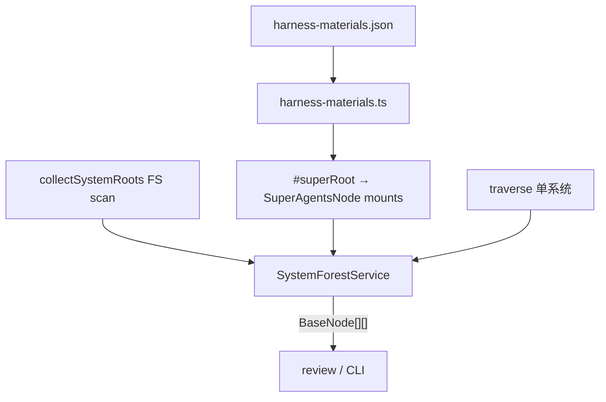

# 系统森林、Super 挂载与 harness-materials 配置 Implementation Plan

> **For agentic workers:** REQUIRED SUB-SKILL: Use superpowers:subagent-driven-development (recommended) or superpowers:executing-plans to implement this plan task-by-task. Steps use checkbox (`- [x]`) syntax for tracking.

**Goal:** 落地「traverse 只跑单系统；森林在外拼装；Super 按 domain JSON 挂 README 材料；Service 交出 `BaseNode[][]` 供 review」整条链路。

**Architecture:** `traverse` 保持只走单系统 `children`。森林根用扫盘认 `project-harness` 的 `AGENTS.md`；对每根并行/串行 `traverse`，`resolve` 遇其它根早停。`SuperAgentsNode` 按 `harness-materials.json` 挂材料 README（不挂其它系统 AGENTS）。创建/读取材料一律 `scope + 配置 path`。业务 Service 组装二维林并投影给 review。

**Tech Stack:** TypeScript、Node ≥22、`node:test`、tsx、现有 `edges-cli`。配置用 JSON（不加 YAML 依赖）。

**Spec / 约束真源:** `.harness/memory/feedbacks/feedback_traverse_single_system_and_forest_roots/INDEX.md`；`CONTEXT.md`（SuperAgentsNode）；`extensions/cli/src/domain/operations/README.md`（单系统 traverse）。

## Global Constraints

- `traverse` **不**跨系统、**不**拼森林；无 `includeContentFace` / companion 兼容。
- Super **不**挂其它系统的 `AGENTS.md`；只挂配置中的材料 path（README）。
- 整仓可视为个人系统二；材料相对 path **不带** `.harness/` 前缀；解析时 harness 根 = `join(repoRoot, ".harness")`（若存在）否则 `repoRoot`（见 Task 1）。
- review 默认交林形式：**全部独立**；树间无从属用 resolve 早停；嵌套形式（只留内层）用「从 B traverse 可达 A 根」判定，本计划 API 一并提供。
- 公开仓：无凭据；commit 用 `type: subject` + `Co-authored-by`。
- 禁止改 `posts/`。

## File Structure

| 文件 | 职责 |
| --- | --- |
| `extensions/cli/src/domain/config/harness-materials.json` | 材料 `{ id, path, optional }[]` |
| `extensions/cli/src/domain/config/harness-materials.ts` | 加载、校验、`resolveHarnessMaterial(scopeDir, id)` |
| `extensions/cli/src/domain/operations/system-forest.ts` | `collectSystemRoots`、`isSystemEntry`（扫盘 + 标志） |
| `extensions/cli/src/services/node/system-forest-service.ts` | 组装 `BaseNode[][]`；全部独立 / 嵌套只留内层；resolve 禁入其它根 |
| `extensions/cli/src/services/node/node-service.ts` | `#superRoot` 改为按配置挂载材料 |
| `extensions/cli/src/domain/models/internal/super-agents-node.ts` | 注释对齐：材料挂载，非「只挂一个 README」 |
| `extensions/cli/src/commands/tasks/…` 或新 `forest` 子命令 / review 接线 | 暴露森林给 CLI / review |
| `extensions/cli/test/domain/harness-materials.test.ts` | 配置与解析 |
| `extensions/cli/test/operations/system-forest.test.ts` | 收根 |
| `extensions/cli/test/services/system-forest-service.test.ts` | 二维林、早停、嵌套形式 |
| `extensions/cli/test/services/super-agents-node.test.ts`（扩展） | Super 挂载表 |
| docs：`operations/README.md`、`models/README.md`、`CONTEXT.md`、CLI README | 与记忆对齐 |



---

### Task 1: harness-materials.json + loader

**Files:**
- Create: `extensions/cli/src/domain/config/harness-materials.json`
- Create: `extensions/cli/src/domain/config/harness-materials.ts`
- Test: `extensions/cli/test/domain/harness-materials.test.ts`

**Interfaces:**
- Produces:
  - `type HarnessMaterial = { id: string; path: string; optional?: boolean }`
  - `type HarnessMaterialsConfig = { materials: HarnessMaterial[] }`
  - `loadHarnessMaterialsConfig(): HarnessMaterialsConfig`
  - `harnessRootForScope(scopeDir: string): string` — `join(scopeDir, ".harness")` if that dir exists, else `scopeDir`
  - `resolveHarnessMaterial(scopeDir: string, id: string): { absPath: string; material: HarnessMaterial } | undefined` — missing optional → `undefined`；required missing → throw
  - `listHarnessMaterialAbsPaths(scopeDir: string): { id: string; absPath: string }[]` — 仅存在的文件

- [x] **Step 1: Write failing tests**

```ts
import test from "node:test";
import assert from "node:assert/strict";
import * as fs from "node:fs";
import { mkdtempSync } from "node:fs";
import { tmpdir } from "node:os";
import path from "node:path";
import {
  loadHarnessMaterialsConfig,
  harnessRootForScope,
  resolveHarnessMaterial,
  listHarnessMaterialAbsPaths,
} from "../../src/domain/config/harness-materials.js";

test("config lists tasks README and not AGENTS", () => {
  const cfg = loadHarnessMaterialsConfig();
  assert.ok(cfg.materials.some((m) => m.id === "tasks" && m.path === "tasks/README.md"));
  assert.ok(!cfg.materials.some((m) => m.path.endsWith("AGENTS.md")));
});

test("resolve uses .harness under scope when present", () => {
  const root = mkdtempSync(path.join(tmpdir(), "hm-"));
  fs.mkdirSync(path.join(root, ".harness/tasks"), { recursive: true });
  fs.writeFileSync(path.join(root, ".harness/tasks/README.md"), "# t\n");
  assert.equal(harnessRootForScope(root), path.join(root, ".harness"));
  const hit = resolveHarnessMaterial(root, "tasks");
  assert.equal(hit?.absPath, path.join(root, ".harness/tasks/README.md"));
});
```

- [x] **Step 2: Run tests — expect FAIL (module missing)**

Run: `cd extensions/cli && pnpm exec node --import tsx --test test/domain/harness-materials.test.ts`  
Expected: FAIL cannot find module

- [x] **Step 3: Add JSON + loader**

`harness-materials.json`:

```json
{
  "materials": [
    { "id": "tasks", "path": "tasks/README.md", "optional": true },
    { "id": "memory.feedbacks", "path": "memory/feedbacks/README.md", "optional": true },
    { "id": "memory.projects", "path": "memory/projects/README.md", "optional": true },
    { "id": "memory.references", "path": "memory/references/README.md", "optional": true },
    { "id": "skills.managed", "path": "skills/managed/README.md", "optional": true },
    { "id": "skills.referenced", "path": "skills/referenced/README.md", "optional": true },
    { "id": "evaluation", "path": "evaluation/README.md", "optional": true },
    { "id": "observation", "path": "observation/README.md", "optional": true },
    { "id": "readme", "path": "README.md", "optional": true }
  ]
}
```

Loader: `readFileSync` + `import.meta.url` 定位 JSON；校验每项有非空 `id`/`path`；实现上面三个函数。

- [x] **Step 4: Run tests — expect PASS**

- [x] **Step 5: Commit**

```bash
git add extensions/cli/src/domain/config/harness-materials.json \
  extensions/cli/src/domain/config/harness-materials.ts \
  extensions/cli/test/domain/harness-materials.test.ts
git commit -m "feat: domain harness-materials.json 与 path 解析"
```

---

### Task 2: SuperAgentsNode 按配置挂载

**Files:**
- Modify: `extensions/cli/src/services/node/node-service.ts` (`#superRoot`)
- Modify: `extensions/cli/src/domain/models/internal/super-agents-node.ts`（注释）
- Test: `extensions/cli/test/services/super-agents-node.test.ts`（扩展或新建用例）

**Interfaces:**
- Consumes: `listHarnessMaterialAbsPaths(scopeDir)`
- Produces: `#superRoot(scopePath)` → `SuperAgentsNode`，`localChildren` = 存在的材料 abs path；**零个材料时不抛**（可空挂载），与旧「必须有 README」不同

- [x] **Step 1: Write failing test**

```ts
test("super mounts configured README materials under .harness, not root AGENTS", async (t) => {
  const root = fs.mkdtempSync(path.join(fs.realpathSync(tmpdir()), "super-m-"));
  t.after(() => fs.rmSync(root, { recursive: true, force: true }));
  fs.mkdirSync(path.join(root, ".harness/tasks"), { recursive: true });
  fs.writeFileSync(path.join(root, "AGENTS.md"), "# Scope\n");
  fs.writeFileSync(path.join(root, ".harness/tasks/README.md"), "# Tasks\n");
  const service = new NodeService({ managedRoot: root });
  const nodes = await service.list(root, { super: true });
  const rel = nodes.map((n) => path.relative(root, n.path));
  assert.ok(rel.some((p) => p === path.join(".harness/tasks/README.md") || p.endsWith("tasks/README.md")));
  assert.ok(!rel.includes("AGENTS.md"));
});
```

- [x] **Step 2: Run — expect FAIL（仍只挂仓根 README 或抛错）**

- [x] **Step 3: Implement `#superRoot`**

```ts
#superRoot(scopePath: string): SuperAgentsNode {
  const scopeDir = path.basename(scopePath) === "AGENTS.md"
    ? path.dirname(path.resolve(scopePath)) : path.resolve(scopePath);
  const mounts = listHarnessMaterialAbsPaths(scopeDir).map(({ absPath }) => ({ id: absPath }));
  return new SuperAgentsNode(scopeDir, mounts);
}
```

更新 `SuperAgentsNode` 类注释：组成来自 harness-materials 配置的材料入口。

- [x] **Step 4: Fix / update 既有 `--super` 测试**（`traverse-dual-entry`、`super-flag` 等）使期望与「材料挂载」一致；仓根仅 README、无 `.harness/tasks` 时 Super 可只有 `readme` 材料或空。

- [x] **Step 5: Tests PASS + Commit**

```bash
git commit -m "feat: SuperAgentsNode 按 harness-materials 挂载"
```

---

### Task 3: collectSystemRoots（扫盘）

**Files:**
- Create: `extensions/cli/src/domain/operations/system-forest.ts`
- Modify: `extensions/cli/src/domain/operations/index.ts`（导出）
- Test: `extensions/cli/test/operations/system-forest.test.ts`

**Interfaces:**
- Produces:
  - `isProjectHarnessAgentsFile(absPath: string, source: string): boolean` — 含 `project-harness-local` / `project-harness-constraints` / `project-harness-descendants` 任一 start 标记（或 `decodeBody` 显示 memory/constraints 区块）
  - `collectSystemRoots(scopeDir: string): string[]` — 递归扫 `AGENTS.md`（跳过 `node_modules`、`.git`、常见大目录），返回绝对路径列表，排序稳定

- [x] **Step 1: Failing test** — fixture 含带标记的 `AGENTS.md`、无标记的 `AGENTS.md`、嵌套一层；断言只收集带标记的。

- [x] **Step 2: Implement scan** — `fs.readdirSync` 递归；读文件头/全文做标志检测（可用 `decodeBody` 若已依赖 models；注意 operations→models 现有依赖方向，保持与 `traverse` 一致）。

- [x] **Step 3: PASS + Commit**

```bash
git commit -m "feat: collectSystemRoots 扫盘认 project-harness"
```

---

### Task 4: SystemForestService → `BaseNode[][]`

**Files:**
- Create: `extensions/cli/src/services/node/system-forest-service.ts`
- Test: `extensions/cli/test/services/system-forest-service.test.ts`

**Interfaces:**
- Produces:
  - `type ForestForm = "independent" | "innermost"`
  - `type SystemForestOptions = { form?: ForestForm }` — 默认 `"independent"`
  - `class SystemForestService` 或函数:
    - `buildSystemForest(scopeDir: string, options?: SystemForestOptions): Promise<BaseNode[][]>`
  - 行为：
    1. `roots = collectSystemRoots(scopeDir)`
    2. 若需包含 Super：构造 `SuperAgentsNode`（同 `#superRoot` 逻辑，可抽 `createSuperAgentsNode(scopeDir)` 到 domain/config 或 node 小模块供 Service 与 NodeService 共用），**把 Super.path 加入根集合**（或不在扫盘结果里则 prepend）
    3. `rootSet = new Set(roots)`
    4. 对每个 root **并行** `NodeService`/`traverse`：`resolve` 若 `rootSet.has(target) && target !== currentRoot` → `undefined`（早停）
    5. 得到 `BaseNode[][]`
    6. 若 `form === "innermost"`：若从 B 的树数组中出现 A 的根 path，则 A 属于 B，丢掉 B 那一行（只留内层）

- [x] **Step 1: Failing tests**
  - independent：两根均出现；从外根展开的数组**不含**内根 path
  - innermost：外根被丢弃，只留内根那一行
  - Super 根存在且不挂仓根 `AGENTS.md` 为 child

- [x] **Step 2: Implement service**（抽 `createSuperAgentsNode` 避免与 NodeService 循环依赖：放 `services/node/super-root.ts`）

- [x] **Step 3: PASS + Commit**

```bash
git commit -m "feat: SystemForestService 组装 BaseNode[][]"
```

---

### Task 5: CLI / review 接线

**Files:**
- Modify: `extensions/cli/src/commands/tasks/project/review-page.ts` 与/或新增 `edges systems forest` / `edges tasks forest`（择一，推荐 **`edges systems forest`** 若已有 systems 命名空间；否则挂 `tasks project forest` 易混淆——优先查 `program.ts` 现有命令树，无则加顶层 `forest` 或 `systems forest`）
- Modify: review 相关：增加可选模式——无 `--from` 时从当前 scope 建林并生成「主体列表」JSON 再渲染；**或**新命令只输出森林 JSON，review-page 仍只渲染（更贴「review-page 只渲染」现状）

**推荐产品切法（本任务采用）：**
- 新增 `edges forest list`（或 `edges systems forest`）：stdout JSON `{ form, trees: [ { root, nodes: [{ path, type, name, description }] } ] }`（Service 用完整节点，命令层投影）
- `review-page` 保持 `--from`；文档说明上游用 `forest list` 生成主体后再接分类 JSON

- [x] **Step 1: 查 `program.ts` 命令树，确定挂载点**

- [x] **Step 2: Failing CLI 测试** — temp repo 两根 AGENTS → `forest list` 二维结构

- [x] **Step 3: 实现命令 + 投影**

- [x] **Step 4: PASS + Commit**

```bash
git commit -m "feat: CLI forest list 输出二维系统林"
```

---

### Task 6: 文档与记忆对齐

**Files:**
- Modify: `extensions/cli/src/domain/operations/README.md`
- Modify: `extensions/cli/src/domain/models/README.md`
- Modify: `extensions/cli/README.md`
- Modify: `CONTEXT.md`（Super 挂载改为材料表）
- Update: `.harness/memory/feedbacks/feedback_traverse_single_system_and_forest_roots/INDEX.md`（补全 Q22 首版条目表 + 「本轮全部落地」）

- [x] **Step 1: 写入原则**：配置路径、扫盘收根、`BaseNode[][]`、resolve 早停、嵌套形式、Super 不挂 AGENTS

- [x] **Step 2: Commit**

```bash
git commit -m "docs: 系统森林与 harness-materials 配置原则"
```

---

### Task 7: 全量回归

- [x] **Step 1:** `cd extensions/cli && pnpm test`  
  Expected: 全绿

- [x] **Step 2:** 修复失败用例（尤其旧 `--super` 只挂仓根 README 的假设）

- [x] **Step 3:** Push + 更新 PR #167 描述

---

## Spec coverage（自检）

| 规则 | Task |
| --- | --- |
| traverse 单系统 | 不改 traverse 语义；Task 4 resolve 外置 |
| 扫盘收根 | Task 3 |
| 整仓=个人系统二 + Super | Task 2、4 |
| Super 挂 README 材料、不挂 AGENTS | Task 1–2 |
| domain JSON 配置 + scope+path | Task 1 |
| `TreeNode[][]` / 完整节点 | Task 4–5 |
| 全部独立 + resolve 早停 + 可拼接/并行 | Task 4 |
| 嵌套只留内层（可达） | Task 4 `innermost` |
| Super 也是一根 | Task 4 |
| review / CLI | Task 5 |
| 文档 | Task 6 |

## Placeholder scan

无 TBD；路径与类型均已写出。
