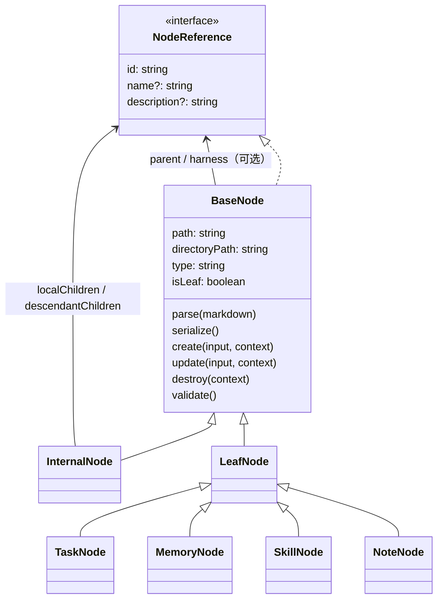

# 目录节点模型与递归 Harness

状态：用户已确认，2026-10-05 收敛；本文件取代 2026-10-04-node-domain-model-design.md 中与其冲突的模型、双格式、reparent、权限与导入设计。历史讨论见 ../../discussions/2026-10-05-implementation-rulings.md。

实现状态：模型、Service 与 CLI 已接入，本仓 tracked/public 内容已按[迁移指南](../../recursive-layout-migration.md#2026-10-05-目录入口采用)转换并验证幂等性。私有克隆材料未迁移；最终独立审阅与 PR 状态见[实施计划](../plans/2026-10-05-directory-node-refactor.md)。下文“旧 Tasks 记忆剩余归属”描述的所有权调整已完成，不需重复移动。

## 目标与边界

统一目录承载节点；只为 Markdown 入口建立领域对象。节点定义自身业务操作，Service 执行文件 IO 与一致性维护。组成树和 harness 关系分开，保持 AGENTS 原有三部分及非受控正文。

- TypeScript，Node >=20，NodeNext 相对导入使用 .js。YAML 仅使用 gray-matter 默认能力，不增加自定义引擎或容错语义。
- 不建 Resource 模型。图片、脚本等按整个目录随生命周期操作，不作为 children。
- 不强制改造 ADR、第三方技能约定目录、README、CONTEXT、knowledge/posts 或其他体系的普通文件；无有效入口的目录只是导航目标。
- 不实施 extensions/memory 分发与 immutable 优化；保留已建待办。
- 不迁移真实私有内容，不修改 .obsidian/workspace.json，不做 chmod 权限策略。

## 目录与 layout

`extensions/cli/src/models/layout.ts` 集中定义入口名、类型识别、章节/标记、harness 路径和目录生命周期规则；业务目录注册可扩展。沿用现有 project-memory 标记、type-index 合同与 task-projects 标记，不凭正文猜类型。

- AGENTS.md → InternalNode；SKILL.md → SkillNode；index.md → 按注册目录合同选择 TaskNode、MemoryNode、NoteNode 或通用 LeafNode。
- 通用未知 index.md 是 LeafNode；任意普通 .md 不是新模型节点，导入/迁移明确转换后才登记。外部普通文档链接保持正文，不进入组成关系。
- 每个节点 path 是规范化绝对入口路径，id 等于 path（含文件名），directoryPath 是 dirname(path)。Markdown 引用仍为相对路径，以来源文件为基准。
- Leaf harness 默认同目录 AGENTS.md；Internal harness 默认本目录 .harness/AGENTS.md；继续递归。只发现已有入口，不自动创建。
- 同目录 SKILL.md 与 AGENTS.md 是两个节点；AGENTS 是 Skill 的 harness。删除/移动 Skill 操作整个目录及其中的 harness。单独删除 AGENTS 不应删除同目录内容入口：其生命周期只覆盖 AGENTS 及属于它的 .harness 目录；单独移动这种共址 AGENTS 须拒绝并指示移动内容节点。独立 AGENTS 目录可以整体移动/删除。
- 普通 legacy 单 .md 的转换只经显式一次性迁移；生产创建、索引与读取以统一目录模型为准，不长期保留双格式选项。

## 数据结构




```ts
interface NodeReference {
  /** 规范化绝对入口路径，唯一标识运行时节点。 */
  id: string;
  /** 可选展示名称；Markdown 链接文字。 */
  name?: string;
  /** 可选说明；Markdown 索引条目说明。 */
  description?: string;
}
type ChildGroup = 'local' | 'descendant';
```

BaseNode implements NodeReference；拥有必填 id、path、directoryPath、type、isLeaf，选填 name、description、parent、harness，以及 metadata/body。ID 不读写 YAML id 字段；保留该字段作为普通用户 metadata。path 只能通过 Service 生命周期协调改变，普通 update 不改路径。

BaseNode → InternalNode / LeafNode；TaskNode、MemoryNode、SkillNode、现有 NoteNode 继承 LeafNode。NoteNode 保留现有真实标题行为；其他类型可以复用 LeafNode。

InternalNode 有 constraints、localChildren、descendantChildren，children 是两组直属引用的去重并集；两组不重叠。Leaf children 为空；isLeaf 为类别固定标志，空 Internal 仍 false。引用只保存 id/name/description，不含分组，不递归序列化完整对象。

唯一 parent 依据实际目录归属恢复：从所在目录向上寻找最近有效组织入口（同目录内容的 AGENTS 是 harness，不能反向作为其 parent；.harness/AGENTS 不把其宿主当 parent）。跨层索引可用于发现，并不覆盖物理父归属；跨目录普通引用不形成第二个 parent。harness 与 parent/children 独立。

## Node 方法

所有方法是实例方法，不含文件系统或 Git IO；构造器接受入口路径且不调用可覆写方法。扩展节点的 parseBody/serializeBody 必须能够无损往返，同一正文重复解析序列化不应不断改变内容；模型可用同类草稿进行校验。先验证再提交内存变更；失败不留下半成品。

```ts
interface NodeCreateInput { name?: string; description?: string; metadata?: Record<string, unknown>; body?: string }
interface NodeUpdateInput { name?: string; description?: string; metadata?: Record<string, unknown>; body?: string }
interface NodeContext { operation: 'create' | 'update' | 'destroy'; parent?: NodeReference }
// 子类可用结构化输入扩展本接口，例如 Task 标题/状态/优先级和 Memory 类型。
class BaseNode<CreateInput = NodeCreateInput, UpdateInput = NodeUpdateInput> {
  parse(markdown: string): this;
  serialize(): string;
  create(input: CreateInput, context: NodeContext): this;
  update(input: UpdateInput, context: NodeContext): this;
  destroy(context: NodeContext): void;
  validate(): void;
  protected parseBody(markdown: string): void;
  protected serializeBody(): string;
}
class InternalNode extends BaseNode<InternalCreateInput, InternalUpdateInput> {
  setConstraints(constraints: readonly string[]): this;
  addChild(group: ChildGroup, reference: NodeReference): this;
  updateChild(id: string, patch: Partial<Pick<NodeReference, 'name' | 'description'>>): this;
  removeChild(id: string): this;
  moveChild(id: string, group: ChildGroup): this;
}
```

InternalCreateInput/UpdateInput 为通用输入加可选 constraints/localChildren/descendantChildren；显式 body 与结构字段同次传入有冲突时直接报错。Task 输入增 title/status/priority/assignee；Memory 输入增 memoryType；Skill 使用标准 name/description，在 validate 中要求有效的标准技能名称与非空 description；公共基类字段可选不代表 Skill 入口可省略它们。子类实现实际验证/生成业务元数据，业务 Service 仍负责外部事实（作者、当前时间、目标路径、Git ignore、看板状态目录）准备，不在泛型 NodeService 中写业务类型分支。

create 生成受控内容；update 只更新指定字段，未传字段保留。metadata patch 合并已有字段，未知合法 YAML 字段保留。parse/serialize 使用 gray-matter 默认语法。validate 报出文件、字段/章节和原因，让 AI 修正文档；不自动修复非标准输入。Node body 的未受控章节、注释、正文必须保留；不要求保留 YAML 注释/样式。结构化 Internal 变更沿用源文本补丁式序列化。

Doctor 遇到组成引用重复或跨组重叠等无效 AGENTS，报告路径、区块与原因并保留原文；即使显式 `--fix`，也不猜测应该保留哪条或哪组。修正文档后可重跑；有效节点上的明确索引修复能力继续保留。

## Service 接口与读取

```ts
class NodeService {
  create<T extends BaseNode>(node: T, input: Parameters<T['create']>[0]): Promise<T>;
  get(path: string): Promise<BaseNode | undefined>;
  update<T extends BaseNode>(node: T, input: Parameters<T['update']>[0]): Promise<T>;
  destroy(node: BaseNode): Promise<void>;
  move<T extends BaseNode>(node: T, destinationPath: string): Promise<T>;
  import(sourceEntry: string, destinationEntry: string): Promise<BaseNode>;
  list(scopePath: string, options?: { includeDescendants?: boolean }): Promise<BaseNode[]>;
}
```

可保留显式 Model 的 typed get 重载供业务适配器使用；默认 get 必须通过 layout 识别类型。Service 配置明确 managedRoot，所有写操作限制在此范围；现有 assertWrite/read-only source 是业务安全合同，可保留；移除 createMode/resourceMode 等 OS 权限配置。类型识别由 layout/注册器负责，Service 不嵌入 Memory 业务合同。

get 恢复 parent 和 harness 的轻量引用，不递归加载 harness 正文。list 按 AGENTS 已登记的 composition 索引递归，默认只 localChildren；includeDescendants 时也走 descendantChildren。不跟随 harness，不扫描资源，不把任意 MD 导航链接当节点。显式进入某 harness 后完整展开它的组成内容，不自动进入它或其组成节点的 harness。防止实际组成环与重复遍历，不把多处发现等同多父归属。

## 生命周期与一致性

- 原地更新：成功 create/update/move 返回原实例；move 同步实例 path/id/关系。该 Service 已加载的同路径实例、受影响子节点也需刷新，不能静默保持过期引用。
- 已修改但未保存的副本，按旧快照、当前副本与将提交的文档合并完整状态：元数据按键递归合并，正文保留源文本并合并不重叠的行改动。Internal 先合并结构字段，再处理非受控正文。重叠分歧在 IO 前报错，不推进快照；同一行的不同字词也保守视为冲突。后续保存副本不能回退其他已提交字段或正文。
- 禁止公开 reparent；Internal.moveChild 仅改索引组。物理移动才改变归属。
- create 调用 node.create + validate + serialize，并在存在的物理父入口登记。新登记默认 local；这是创建时的默认选择，不把 Leaf/Internal 与索引组绑定，后续可用 Internal.moveChild 改组。AI 传结构化参数，不手拼完整任务 Markdown。
- move 自动搬整个所属目录，不留孤立 harness/资源。校验目标不存在、不能移动到自身子目录、不能把固定入口名改掉、不能越出 managedRoot/改变已知业务类型。不移动管理根本身。
- move 同时更新旧/新物理父索引、目录内的相对引用（包括对外引用）、managedRoot 内已登记节点对旧路径的引用。保存 fragment/query 与非受控正文。不扫描改写外部仓库或任意非节点文档。索引中原有组保留，新父缺少该引用时按原组登记，无原组默认 descendant。
- destroy 清除 managedRoot 内对被删除节点的受控索引，删除完整所属目录；共址 harness 按 layout 特殊生命周期处理。范围外引用不会自动修复。
- import 给定入口文件，自动复制整个所在目录，包括 harness 和资源；parse/validate 完整目录中的受管节点成功后才写目标/登记。格式错误与目标冲突先报错，源不改。无需调用方列资源。
- 多文件操作先形成完整写计划并检查冲突，尽量复用已有 snapshot/save/recovery；不承诺跨文件系统事务。失败要指示剩余文件和恢复位置，不默默损坏索引。只实现当前规则的恢复。目录转换工具遇到既有旧迁移 journal 即拒绝，提示先核实旧迁移状态；不读取可能含私有快照的内容，也不自动删除、归档或续跑。公开 tracked 内容可在没有该本机日志的独立干净工作树审阅迁移。

## 业务接入与迁移

Task / Memory / Note / Skill 生产路径接入新节点方法。Tasks CLI 接收结构化字段，节点生成 metadata；侧日志随任务目录移动。Memory / Note 通过显式 `--import-entry` 导入完整目录，入口须符合该命令的领域合同；冲突的正文参数直接报错。Note 的 `--content-file --markdown` 保留为验证后的单份文档输入，保留正文和合法元数据，不隐式复制其父目录；整目录复制由 `--import-entry` 表达。

导入领域检查与正常加载共用最近物理父入口解析，跨过没有 AGENTS 的中间目录，但不跳过最近入口去找更远的领域合同。检查器接受显式 sourceRoot；缺省取最近含 `.git` 的祖先目录（含 worktree），没有则到文件系统根。已知领域不允许借导入改型；真正未分类的外部入口仍可导入。

新增显式一次性迁移工具和迁移 Skill：dry-run 给出旧单文件到 `<stem>/index.md` 的计划、引用更新与冲突；apply 只操作明示作用域的 tracked/public 内容，幂等。对于无可靠资源归属的历史附件不猜测迁移；保留原链接目标并重新计算相对路径。若同名目录已有附件但没有入口，迁移计划明确列出复用该目录，只新增 index.md、不移动或覆盖附件；已有目标入口或符号链接则冲突报错。排除 knowledge/posts、私有记忆、第三方体系和历史 spec 中示例路径。迁移真实本工作树内的受管 public Memory/Tasks/Notes 时使用该工具；旧快照/journal 审计材料保持历史语义。

旧 Tasks 记忆剩余归属：云端 Obsidian 部署记忆移根 Project Memory；preview-tasks-with-box-obsidian 移根 managed Skill；事实/想法写法归 conversation-to-tasks（保留现有 STAR，不强加新的必填字段）；七个 Task Project 分类留 Tasks 本层。不建设 extensions/memory。

## 验收

模型继承与引用、解析序列化保真、两组 children、递归 harness 边界；真实临时目录 CRUD/import/move/delete，原实例更新、同目录 Skill+harness、递归 Internal 移动、外部引用、fragment/编码、冲突先报错；Tasks/Memory/Note 实际 CLI；迁移 dry-run/apply/幂等/冲突和排除项。工作区测试与 builds/typechecks 通过，独立 review 通过。README/spec/ADR/技能协议与实际行为一致，不把旧执行证据冒充新验证。
