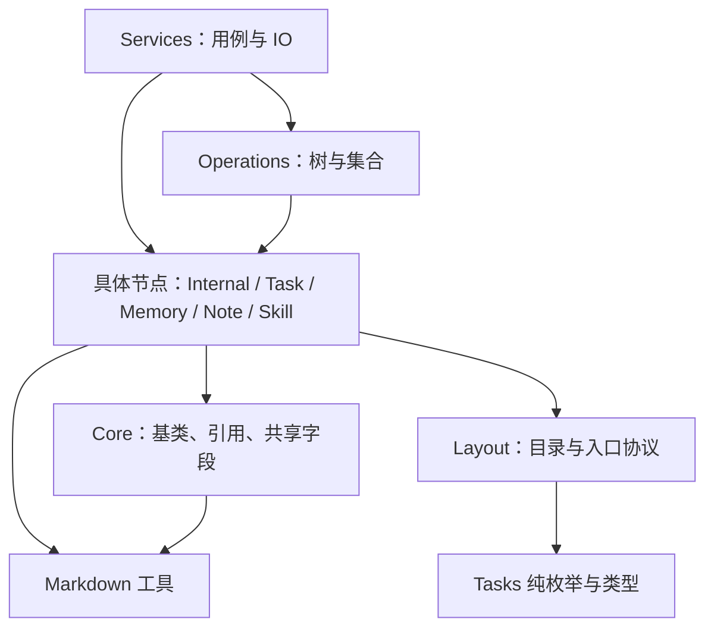

# Model 模块按节点职责归组

状态：目录归组方向已获用户认可；本文为待审阅的具体设计，尚未实施。

基线：PR #161 合并后的 `6e7a6b5`。本文细化 models 的内部组织，不替代 [通用节点能力设计](2026-10-06-shared-node-capabilities.md) 已确认的分层、持久化和 Schema 决策。

## 目标与边界

打开目录即可找到一个模型及其专属规则；共享能力有明确归属。模型继续承担单节点的内存行为，operations 承担集合与树操作，Service 承担完整用例及 IO。

本次只整理模型相关文件、类型归属及相应导入。commands 与 Service 的进一步解耦另行处理。不改变 Markdown 格式、CLI 参数、JSON 输出、Schema 内容、节点继承关系、可变实例或索引语义。

## 当前问题

- TaskNode、MemoryNode、InternalNode 位于根层，其辅助代码却放在同名子目录；理解一个节点需要来回跳转。
- 根 `types.ts` 混合基础引用、业务输入、Internal 内容和遍历选项，基础层类型反向引用 Tasks。
- `internal/typed.ts` 同时定义通用 Markdown、Memory 和 AGENTS codec；Tasks 为了通用格式处理而依赖 Internal。
- `internal/model.ts` 的 `NodeModel` 实际是 AGENTS 文档表示，容易与 `BaseNode` 领域模型混淆。
- Tasks 的单值规则与数组筛选排序混放，目录边界与已确认的单节点/集合分工不一致。

## 取舍

采用按节点类型归组。同一节点的类、输入类型和专属文档处理放在一起，共享基类放 `core/`。

不采用“所有类继续平铺，仅重命名辅助文件”：仍然无法集中阅读一个模型。不采用“每个节点统一铺满 types、codec、validator、factory 文件”：Note、Skill 当前不需要这些空层次。文件数量不是验收目标，职责连续、依赖清楚才是。

## 目标目录

以下为本次涉及的文件；既有集合操作文件继续保留。

```text
src/
├── domain/
│   ├── models/
│   │   ├── index.ts                  # 对外节点类及必要类型出口
│   │   ├── layout.ts                 # 全模型共享的目录、入口和区块协议
│   │   ├── core/
│   │   │   ├── base-node.ts
│   │   │   ├── leaf-node.ts
│   │   │   ├── types.ts              # NodeReference、基础输入、NodeContext
│   │   │   ├── relations.ts          # 关系校验及内部身份协调
│   │   │   └── fields.ts             # 多个节点共用的 metadata 字段操作
│   │   ├── internal/
│   │   │   ├── internal-node.ts
│   │   │   ├── syntax.ts             # 节点与 AGENTS 文档表示之间的转换
│   │   │   ├── document.ts           # AgentsDocument、条目/链接表示与文档 codec
│   │   │   ├── parse.ts
│   │   │   ├── serialize.ts
│   │   │   └── blocks.ts
│   │   ├── tasks/
│   │   │   ├── task-node.ts
│   │   │   ├── types.ts              # Task 枚举、领域数据、创建/更新输入
│   │   │   ├── task-doc-contract.ts  # 浏览器及 Schema 生成共享的纯数据契约
│   │   │   ├── task-doc.ts           # TaskDoc 文档适配
│   │   │   ├── frontmatter.ts
│   │   │   ├── priority.ts           # 单个优先级的解析、比较规则
│   │   │   ├── project.ts            # 单个项目标识及目录一致性规则
│   │   │   └── slug.ts
│   │   ├── memory/
│   │   │   ├── memory-node.ts        # 类及专属创建/更新输入
│   │   │   └── documents.ts          # Memory 文档兼容与字段保留规则
│   │   ├── notes/
│   │   │   └── note-node.ts
│   │   └── skills/
│   │       └── skill-node.ts
│   └── operations/
│       ├── traverse.ts              # 同时拥有遍历/节点查询选项类型
│       ├── query.ts
│       ├── filter.ts
│       ├── group-by.ts
│       └── tasks.ts                 # 从模型移出的 Tasks 集合筛选、排序
├── services/                        # 完整用例与 IO，现有布局保留
└── utils/markdown/
    ├── document.ts                  # 通用 parse/serialize 及类型绑定工厂
    └── types.ts
```

单文件的 Note、Skill 也按节点归组，以便后续专属行为自然放回所属模型；不额外创建空的 types、codec 或 index 文件。`models/index.ts` 保留稳定的节点类出口，内部模块采用直接导入，避免从聚合出口导入造成循环。

## 文件与类型迁移

| 现在 | 目标与处理 |
| --- | --- |
| 根层 `base-node.ts`、`leaf-node.ts`、`relations.ts`、`fields.ts` | 移入 `core/`，保留已有行为与内部可见性 |
| 根层各业务 `*-node.ts` | 移入对应节点目录 |
| 根层 `internal-syntax.ts` | `internal/syntax.ts` |
| 根 `types.ts` 的基础类型 | `core/types.ts`，不依赖具体业务节点 |
| Internal 输入与 InternalContent | 与 `internal/internal-node.ts` 同处；合并等义的私有内容类型，保留只读接口语义 |
| Task 输入 | `tasks/types.ts`，与已有枚举和领域数据一起维护 |
| Memory 输入 | `memory/memory-node.ts`，暂不为少量声明新建 types 文件 |
| ScopeTraversalOptions、NodeQueryOptions | `operations/traverse.ts`；由使用遍历能力的 Service 引用 |
| `internal/model.ts` | 改为 `internal/document.ts`；NodeModel → AgentsDocument、createNodeModel → createAgentsDocument，相应条目/链接类型明确为文档表示 |
| `internal/typed.ts` 的 createMarkdownCodec | 并入既有 `utils/markdown/document.ts`，Tasks 不再经 Internal 引入通用能力 |
| baseDocumentCodec | 与通用工厂同处；已有调用合同保留 |
| memoryDocumentCodec | `memory/documents.ts` |
| agentsDocumentCodec | `internal/document.ts`；parse/serialize 对文档结构用 type-only 导入，空文档构造不经 codec 产生运行时环 |
| `internal/index.ts` | 删除跨职责的转出口，仓内消费者直接引用所属模块；不保留旧路径转发壳 |
| priority/project 中处理数组的函数 | `operations/tasks.ts`；单值解析、比较及校验留在模型目录 |
| 未被引用的 TasksOutput | 删除；table/json 是 CLI 输出选择，不属于节点模型 |

`AgentsDocument` 是序列化的辅助表示，不新增领域节点类型。迁移时若 parser 需要构造空文档，由 parser 就地初始化；供外部模板使用的构造函数可留在 document 模块，避免 document → parse → document 的运行时循环。

`TaskIdentity`、`TaskListItem`、`TaskRecord` 等现有纯数据类型本轮保留在 Tasks；不把所有数据结构都提升为节点类，也不顺便重构 Service DTO。`task-doc-contract.ts` 继续独立，不并入节点类或解析模块：浏览器和生成器只需要数据声明，不能因此导入 Node 文件系统或 Markdown 运行时。Schema 的 TS → 生成器 → dist → Ajv/CLI 链路不变。

Tasks 集合函数迁出模型，是本次为落实既有职责边界提出的局部扩展；此前“只迁通用操作”的决策不等于已批准这一步。本文仅建议搬已有纯函数，不新增业务 Service，不把任务创建、项目维护等用例放进 operations，随本文一并审阅。

## layout 与依赖边界

`layout.ts` 留在 models 根层：它描述跨模型的文件系统协议，而不是某个节点的私有实现。保留集中入口和目录识别规则，不为归组新增注册框架。它目前引用 Tasks 状态常量，因此不把它藏进声称业务无关的 core，也不复制状态常量消除表面依赖。



图中是允许的依赖方向，不要求每个操作依赖所有具体模型。通用 query/filter/group 等维持泛型；Tasks 专用集合函数只依赖必要规则。core 不依赖具体节点；domain 不反向依赖 Service/commands；utils 不依赖 domain。现有路径/关系内部协调能力仍由 Service 使用，不经公共模型出口开放身份任意改写。

## 行为保护与验收

- 批量移动和导入改写使用 TypeScript 脚本，支持预览、冲突检查及幂等重跑；覆盖 CLI、测试、构建脚本、模板与前端消费者，不用字符串全仓盲替换。
- 节点类及现有方法合同保留。仓内深路径导入统一更新；核对 package exports 与已知外部消费者，有真实公开入口时保留其符号合同，不为内部旧路径无条件加转发文件。
- 保留 AGENTS 非受控内容、原始引用和索引分组；保留 Task/Memory metadata 的既有解析与保留规则，不借迁移引入新的 Markdown 纠错。
- 验证 Node 22 下的类型检查、已有模型/文档/关系/查询测试和构建；前端仍能单独消费纯类型，Schema 生成结果无语义变化。
- 检查运行时及类型依赖环、旧路径残留和分层越界；最终相关全量回归通过。单纯搬文件不新增镜像实现的测试；实际边界改变才补必要覆盖。

## 完成标准

读 Task 时进入 tasks 即能找到节点类与专属规则；读 Internal 时看到 AGENTS 解析与保留逻辑；找通用 Markdown 时不必进入 Internal。新节点只增加自己的目录并接入现有识别/创建机制，无需补齐一套空文件。最终汇报说明删掉的错位依赖及保留拆分的理由，不以减少文件数宣称简化完成。
