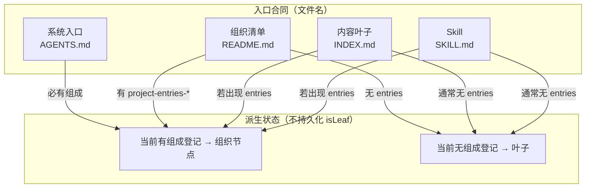
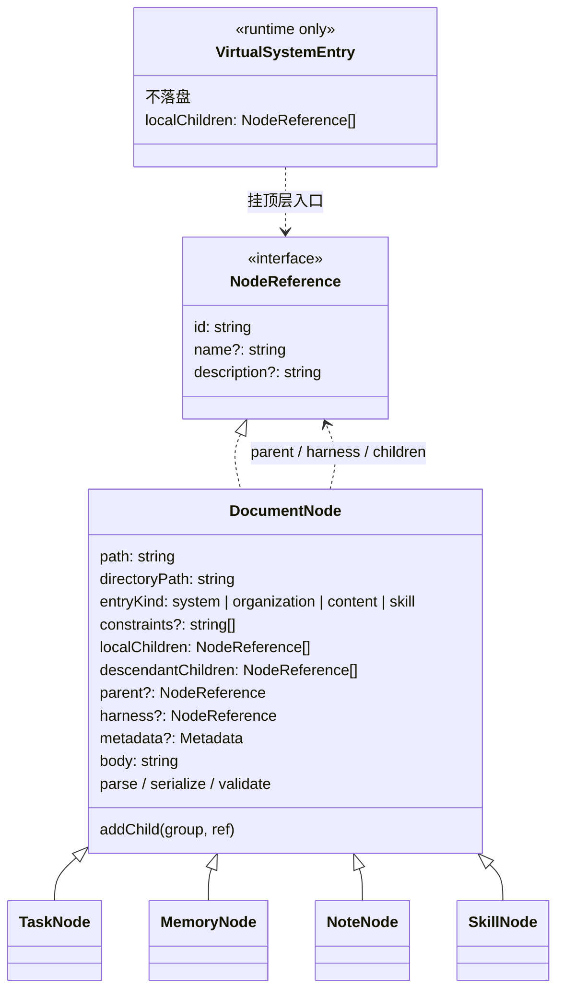
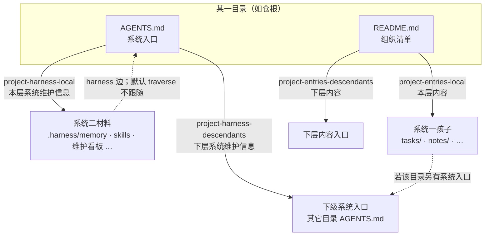
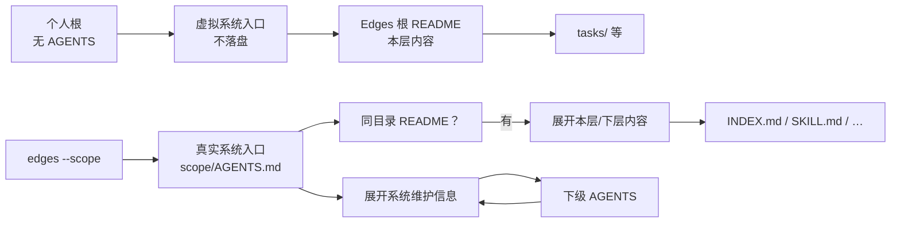
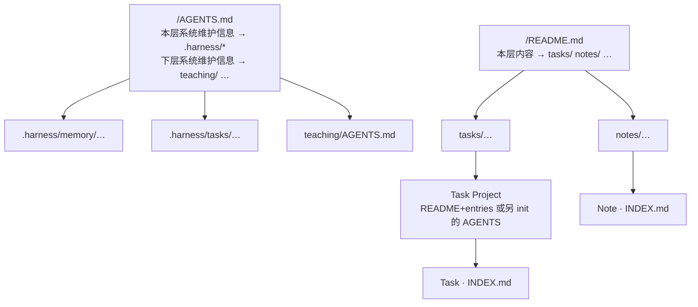

# 递归系统二入口与组成登记

状态：2026-10-06 grill 定稿，待人审后写实施计划。不替代 [目录节点模型](2026-10-05-directory-node-model.md) 的已落地部分；与之冲突处以本文件与 ADR 0029 为准。层入口标记改名见 [project-harness-layer-markers](2026-10-06-project-harness-layer-markers-design.md)（该文标题表已被本文件 Q15c 翻案，见下「标题」）。

基线：本分支既有 CONTEXT / 记忆沉淀；实现前须经人审本 spec。

## 目的

行业上 `AGENTS.md` 是给 Agent 的系统二入口。Edges 把它做成**可递归的系统入口树**：每个系统入口登记本层系统维护信息与下层系统入口；系统一的组织清单与内容叶子用另一套入口合同。此前把 Task 列表、类型条目等系统一孩子塞进 `AGENTS.md` 的 `project-harness-local`，或把「有列表」等同于系统入口，都会名实错位。

本轮只定模型、入口合同、标记/标题、遍历规则与迁移边界。**不写生产代码**（Q16=A）；批准后另开 writing-plans。

## 架构图（目标模型）

下列图描述**目标语义**；现行代码仍可能是 InternalNode / LeafNode / `index.md`，落地前以本节为准。

### 1. 入口合同与派生状态

### 2. 目标领域形状（无 Internal / Leaf 类层次）

说明：`DocumentNode` 是语义名，实施时可继续叫 `BaseNode`；关键是**任意节点都可持有组成**，不再用 `InternalNode` / `LeafNode` / 持久 `isLeaf` 分叉。`entryKind` 由入口文件合同决定，不是组织/叶子。

### 3. 同目录双文件 + 两种组成边

### 4. 从 scope / 虚拟根出发的遍历

默认：走本层组成；`includeDescendants` 才进下层组；`includeHarness` 才沿 harness。组成边 ≠ 维护边。

### 5. 仓库根实例（示意）

## 已确认模型（grill Q1–Q16）

| 题 | 决定 |
| --- | --- |
| Q1=B | 节点身份：从 scope 对应的系统入口（或虚拟系统入口）经组成登记可达 |
| Q2/Q5/Q6 | 入口概念是**系统入口**；文件名为 `AGENTS.md` |
| Q3=A | 不持久化 `isLeaf`；任意节点可 `addChildren`；有无组成登记只表示当前状态 |
| Q4 | CLI 传 `--scope`；正常以该 scope 下系统入口为根 |
| Q7=A | 系统入口**必须**带组成登记（推翻「AGENTS 不带 entries」） |
| Q8=A | Task / Note / Memory / Skill 由某系统入口（或组织清单）的组成登记挂入 |
| Q9 / Q11′=A | **虚拟系统入口**不落盘：主体（如「人」）无真实 AGENTS 时用；个人任务查询是用例；实现另卡 |
| Q9b | Edges 根 `README.md` 增组成登记，指向 `tasks/` 等；虚拟根经此再下钻 |
| Q10 | 任意目录可由用户 init 真实系统入口；配套 **project harness init** skill（演进现 `project-memory-init`） |
| Q12 | 组织清单 → `README.md`；内容叶子 → `INDEX.md`；Skill → `SKILL.md`；系统入口 → `AGENTS.md` |
| Q13=A | 同目录双文件：系统一孩子**只**在 README entries；AGENTS **只**挂系统二材料与下级系统入口（遍历核心规则） |
| Q14=B | 存量 `index.md`→`INDEX.md` 全部迁，**含 `posts/`**（本轮改名授权）；脚本套 CLI traverse，可预览、幂等 |
| Q15 | README 标记 `project-entries-local` / `project-entries-descendants`；标题见下 |
| Q15c | AGENTS 两章标题改为「系统维护信息」；硬约束标题不变 |
| Q16=A | 先本 spec + ADR，人审后再实施计划 |

## 入口合同

| 角色 | 文件 | 组成登记 |
| --- | --- | --- |
| 系统入口 | `AGENTS.md` | 必有：`project-harness-local` / `project-harness-descendants`（外加 constraints） |
| 组织清单 | `README.md` | 可选：`project-entries-local` / `project-entries-descendants` |
| 内容叶子 | `INDEX.md` | 通常无；出现登记则当前为组织状态 |
| Skill | `SKILL.md` | 同叶子规则；同目录可另有 `AGENTS.md` 作其系统入口（harness） |

不按文件名区分 Internal / Leaf 类；实现可保留过渡类名，模型语义以「有无组成登记」为准。

同一目录可以同时有 `AGENTS.md` 与 `README.md`（根目录即此形状）。**禁止**把同一批系统一孩子双写进两份文件。

## 标记与标题

### `AGENTS.md`（Project Harness）

| 区块 | HTML 标记 | Markdown 标题 |
| --- | --- | --- |
| 外层 | `project-harness` | （无独立 H2） |
| 硬约束 | `project-harness-constraints` | `本层硬约束` |
| 本层 | `project-harness-local` | `本层系统维护信息` |
| 下层 | `project-harness-descendants` | `下层系统维护信息` |

读兼容旧标题：`本层组成`、`本层记忆`、`下层节点`、`下层记忆索引`、`下层作用域`、`本层重要约束`。写只发上表。

本层系统维护信息：`.harness/memory`、skills、维护看板、evaluation、observation 等系统二材料，以及需要在本层发现的其它维护入口。下层系统维护信息：更窄作用域上的系统入口（其它目录的 `AGENTS.md`）。

### `README.md`（组织清单）

| 区块 | HTML 标记 | Markdown 标题 |
| --- | --- | --- |
| 本层 | `project-entries-local` | `本层内容` |
| 下层 | `project-entries-descendants` | `下层内容` |

给人看的说明可写在区块外；工具只改标记区块。根 README 的本层内容应能指向 `tasks/` 等系统一入口（Q9b）。

### 类型入口（本轮不动）

`project-memory-type` / `project-memory-entries` 仍给类型目录索引用。是否把类型索引改成 README+`project-entries-*`、或保留类型专用标记，属实施计划里的迁移子题；本 spec 不强制本轮改类型标记前缀。

## 遍历规则（核心）

1. 从 `--scope` 解析到的系统入口（真实 `AGENTS.md`）或虚拟系统入口出发。
2. 展开该入口的 **系统维护信息** 组成：得到系统二材料节点与下级系统入口引用。默认不跟随 `harness` 边进入「材料节点自己的系统入口」（既有约定）。
3. 若当前目录（或被登记的组织清单路径）存在带 `project-entries-*` 的 `README.md`，系统一孩子从 README 的本层/下层内容展开，**不**从同目录 AGENTS 的系统维护信息里找系统一孩子。
4. 内容叶子以 `INDEX.md`（或 `SKILL.md`）为入口；无组成登记则不再下钻。
5. `includeDescendants` / `includeHarness` 语义保持「显式才扩展」；不得用目录扫描冒充组成。

## 虚拟系统入口

- 不落盘；仅运行时对象。
- 用途：主体无 AGENTS（个人根）时查询个人相关任务等。
- 挂载形状：经 Edges 根 README 的组成登记进入仓内树（Q9b）；不在虚拟层扁平挂全部 Task 叶子。
- 实现另卡；本 spec 只锁定术语与挂钩点。

## 谁拥有系统入口

任意目录可由用户调用 init（现 `$project-memory-init`，演进为 **project harness init**）创建真实 `AGENTS.md`。不是路径白名单，也不要求每个 Task Project / 类型目录都是系统入口。未 init 的目录不要伪造系统入口标记。组织清单用 README+entries 即可列孩子。

## 迁移与非目标

**要做（实施阶段）：**

- codec / layout：README `project-entries-*`；AGENTS 新标题；读旧标题。
- 根 README 增加本层内容登记（Q9b）。
- 可预览脚本：`index.md`→`INDEX.md`，复用 `operations/traverse`，含 `posts/`（仅改名；不改博客正文）。
- project harness init skill 待办（已有卡则跟卡）。
- 弱化 InternalNode/LeafNode 固定类层次（或文档标明过时）；领域不持久化 isLeaf。
- CONTEXT / ADR 0029 / models README 与本 spec 对齐（文档可在审前先改术语）。

**非目标：**

- 本轮不改 `.harness/` 目录名、`edges memory` 命令名、skill 目录名 `project-memory-*`。
- 不自动给所有目录铺 AGENTS。
- 不把虚拟入口默认写成文件。
- 不借迁移改写 `posts/` 正文（改名除外）。
- 不在人审本 spec 前开实施或改生产 codec。

## 文档关系

- 术语：根 `CONTEXT.md`
- 修订 ADR 0024：`docs/adr/0029-recursive-system-two-entries.md`
- 原则摘要：`extensions/cli/src/domain/models/README.md`「设计原则」
- 记忆：`project_recursive_system_two_entry`、`project_document_entry_readme_index`、`project_grill_system_entry_q13_q14`、`project_grill_entries_markers_and_titles`、`project_harness_layer_markers`、`project_grill_q16_spec_and_adr_first`

## 验收（实施后）

- 新建/刷新的系统入口只含 `project-harness` 标记与「本层硬约束 / 本层系统维护信息 / 下层系统维护信息」。
- 组织清单只含 `project-entries-*` 与「本层内容 / 下层内容」。
- 同目录双文件 traverse 单测：系统一孩子不出现在 AGENTS 组成解析结果中。
- `index.md` 迁移 dry-run / apply 幂等；posts 仅文件名变更。
- 旧 AGENTS 标题仍能 parse；写回为新标题。

## 开放实施题（不阻塞本 spec 语义）

- 类型入口是否迁到 README+`project-entries-*`，或暂时保留 `project-memory-entries`。
- InternalNode 类是删除还是降为兼容别名。
- PROTOCOL 文件名合同（类型入口仍写 AGENTS 还是改 README）的改稿顺序。
