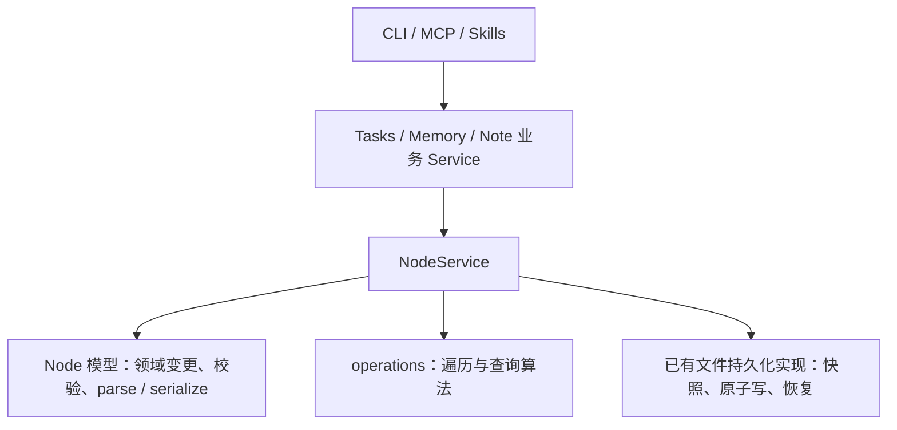

# Tasks、Memory、Note 通用能力收敛

状态：待实施；本次根据用户对文件过散的质疑及 Service 边界的纠正重新梳理。四项目标不变，替代上一版新增文档包装和查询包装的方案。

## 目标

统一节点保存、AGENTS 结构与索引维护、物理路径原语及登记树查询。减少重复基础设施与调用方需要理解的概念，保留 Tasks、Memory、Note 的业务行为。

## 架构与调用方向

采用 Service 协调操作、Model 承载领域数据与行为的分工。Service 是外部操作入口；Model 可以有方法，但修改并持久化一个节点的完整流程由 Service 负责。

- **业务 Service** 决定做什么：Tasks 状态与项目规则、Memory 类型与私有内容规则、Note 的 Git 发布顺序；准备输入并调用 NodeService。现有函数式 Service 可继续使用，不要求全部改成类。
- **NodeService** 协调怎么完成节点操作：加载受管对象、调用 Model、维护受影响索引、检查冲突并保存。沿用 get/create/update/move/destroy/import/query，不新增 NodeDocument、DocumentService 或 save 包装。
- **Model** 定义节点内容和有效状态；parse/serialize、校验、关系变更与纯内存初始化均无文件 IO。Model.create 与 Service.create 同名时，前者只是服务内部的内存初始化步骤，后者才是完整创建操作。
- **operations** 实现纯遍历/集合算法，由 NodeService 提供加载；保留此前确认的分文件组织。
- **内部文件工具** 保持现有 node-files、node-lock、node-cache 等职责；它们是 NodeService 的实现协作者，不再在其上增加一层面向业务的持久化接口。

业务正常写流程通过 `NodeService.update(node, input)` 提交变更，避免分散为调用方先改 node 再决定保存什么。模型仍采用已确认的可变、原地更新实现；不引入 immutable、只读代理或禁止 setter 的类型重构。模型单元测试可直接调用纯内存方法。

锁继续覆盖整个 CLI 写命令，必须早于业务读取。它不因本次分层说明被缩小为单次 NodeService 方法调用；NodeService 的直接调用不被描述为自动取得 CLI 命令锁。

## Service 依赖约束

依赖方向固定为 `CLI → 各业务 Service → NodeService → 模型 / operations / 文件实现`。Tasks、Memory、Note 是并列业务模块，当前用例不需要互相调用；共享机制下沉至 NodeService，不能由 Tasks 调 Memory.init 等业务操作获得。NodeService 不导入业务 Service；业务需要的写政策通过现有构造选项传入。

scope 解析和命令锁由入口编排，先确定目标并获取写锁，再执行写用例。node-files、node-cache、node-lock 等是通用内部实现，位于 services 目录不表示它们是需要业务逐层调用的 Service。memoryNodes/projectNodes 仅构造带政策的 NodeService，也不构成额外的 CRUD 服务层。业务模块内部直接导入实际定义文件，不通过自身 index.ts 聚合导出绕回入口。

当前运行时静态导入检查未发现 Tasks/Memory/Note 跨模块依赖，也未发现通用 node 模块反向导入业务 Service；但 Memory 的 paths.ts、types.ts、blocks.ts、templates.ts 构成循环。具体有 `paths → types → paths` 及 `paths → types → blocks → templates → paths`，不能把目标架构描述成已经完成。

在现有文件内断环：将依赖 discoverLayerTypes 的 typeIndexPath、typeContentDir，以及调用它们的 listTypeFiles 从 paths.ts 移至 types.ts。paths.ts 保留不读取类型登记的路径/命名原语；templates.ts 和 blocks.ts 可以依赖这些原语，types.ts 可以依赖模板和区块，但 paths.ts 不再依赖 types.ts。类型相关的盘点依旧是 Memory 的业务能力，不下放到公共 filesystem，也不改成登记树查询。

## 文件归属

保留现有 models / services / operations / utils 顶层布局，不增加 package，不为四个目标分别建立公共入口文件。

| 能力 | 落点 | 本次收敛 |
| --- | --- | --- |
| 节点 CRUD、查询与关联保存 | `services/node-service.ts` | 业务直接复用已有接口；不新增 `services/node-documents.ts` 或 `services/node-query.ts` |
| 文件冲突检查、原子保存、恢复 | `services/node-files.ts` | 保持现有实现；Memory 的 `.gitignore` 写也复用它 |
| AGENTS 结构与文本格式 | `models/internal-node.ts`、已有 `models/internal/` | 骨架使用现有 serializeNode；区块算法集中到 blocks.ts；不新增 internal/documents.ts |
| 索引转义与路径编码 | 现有 `models/internal/serialize.ts` | 迁入 Memory 的两个纯函数，所有索引生成者复用；不新建 utils/markdown/index-rendering.ts |
| 基础路径机制 | 现有 `utils/filesystem.ts` | 包含关系、真实路径、链接检查与祖先查找共用 |
| Memory 的节点访问政策 | `services/memory/node-documents.ts` 改名为 `service.ts` | 保留 Service 构造和写入准备政策，删除 MemoryDocument/load/save 包装 |
| Tasks / Note 业务流程 | 各自现有 Service | 删除重复基础机制，不迁走业务规则 |

内部的 parse.ts、serialize.ts、blocks.ts 可继续拆分，它们有明确的格式职责。纯格式函数可以被业务 Service 的文档适配代码使用；函数返回文本或值，不制造另一份受管节点，也不执行保存。

## 四项目标的具体处理

### 1. 保存由 Service 统一协调

Tasks 的项目、看板及 owner AGENTS.md 改走 NodeService。业务 Service 加载原节点后生成更新参数并调用 update；新建由 create 调用模型初始化并落盘。简单的“get 后判断创建还是更新”可保留在业务操作内，不再抽取带 existed 状态的文档句柄。

Tasks 索引操作采用 managedRoot 为 canonical scope 的 Service，assertWrite 仅覆盖当前 board 及已存在的 owner AGENTS。TaskNode CRUD 原来的 board 边界保持。缺失 owner 不自动创建；maintenance 归 local；domain 已有关系分组、标签和链接拼写保留。

Memory 保留写前的 scope / 类型 / ignore 准备和只读来源限制。Note 保留 checkout/pull 后才加载节点，以及父索引 Git 状态检查和附件导入流程。不同 managedRoot 或策略可以使用不同 Service；同一操作链、相同视图复用已加载对象。

完整 Markdown 输入只在 import 或既有文本适配路径中出现；在 Service 内先校验，再应用到受管节点并持久化。普通结构化创建不要求调用方先组装 Markdown。

`.gitignore` 是普通文本，不建立 Node：在现有 Memory Service 内调用 readEntry/saveEntries。先读快照再生成新文本，无变化不写。既有文件保留 mode，新文件沿用 0o600。run log 等资源继续走其业务文件接口。

### 2. AGENTS 共用一套格式实现

三段名称和顺序继续由 layout/serializer 定义。Tasks 新文档骨架调用现有 serializeNode(createNodeModel())；Memory 的分发模板保留其内容与占位符，区块填充共用已有 blocks.ts。Model 仍负责最终解析与校验，不增加第二个 Document 模型。

受控区块只改指定 start/end 内的内容；外部正文、空白、注释、其他模块索引及未修改链接拼写保留。半缺失、重复、逆序或位置不明确时报错。新 task-projects 放在 local；Memory entries 可在文档级。不得用某个业务的索引列表覆盖整个 localChildren。

### 3. 路径工具提供机制，Service 保留政策

公共工具判断目录包含、解析缺失叶子的真实路径、定位范围内符号链接及查找祖先；业务 Service 决定允许范围、是否允许链接及错误信息。保持各选项既有的 `~`、显式 root、Git 边界语义。`..draft` 与 `..` 区分，目录同名前缀不表示包含。

### 4. 全仓查询直接使用 NodeService.query

删除 Tasks 内的通用 repositoryNodeQuery 包装；Tasks 的全仓任务列表与项目分组直接调用 NodeService.query(root, options)。includeDescendants / includeHarness 显式控制范围，任务查询传 ['task']，项目查询传 ['internal']。其他业务可直接使用相同 API，不需要另一个 repository Service。

不改变默认局部范围；只有 value() 执行查询；filter 不自动剪枝；types 可跳过无关叶子正文，但不能遗漏其 harness。禁止加入物理扫描兜底。Memory 的 doctor / 索引重建需要盘点未登记文件，继续保留物理扫描。

## 全局约束

- TypeScript；Node >=20；不新增运行时依赖或独立 package。
- 仅在独立 worktree 修改；不迁移仓库真实内容或用户私有数据。
- 创建、更新、删除、导入与持久化通过 Service 协调；Model 保留纯内存领域行为。
- 保留 NodeService 内同路径单实例、原地更新与实际受影响节点保存语义。
- 保留命令写锁、文件快照冲突检查、单文件原子保存与既有失败恢复。
- 保留 Markdown 非受控区域；不要求保留 YAML 注释或 YAML 样式。
- 保留 CLI 参数、输出协议、默认 scope 与查询范围；不新增 CLI 命令。
- operations 与 models/services 同级，算法按文件拆分；不引入 NodeTree、全局 Service 或事务框架。

## 取舍与验收

接受业务操作中少量直接调用 create/update/query 的重复代码，换取更少的公开概念和调用层次；业务政策本身仍需集中。文件数不是唯一指标，不能把独立的锁、文件恢复或模型语法全部塞进 node-service.ts。

验收重点：四个目标都落实；项目/看板 AGENTS 不再直接 writeFile；无 NodeDocument/MemoryDocument 保存状态包装；无另一套 Memory 原子写；全仓查询复用已有 query；通用底层无业务 Service 反向依赖；涉及 Service 的运行时导入图无循环。保留现有单次生命周期操作的失败恢复，但不承诺整条业务命令的多个调用构成多文件 ACID。

参考的是 [Service Layer](https://martinfowler.com/eaaCatalog/serviceLayer.html) 协调操作与 [Domain Model](https://martinfowler.com/eaaCatalog/domainModel.html) 承载数据/行为的分工，不要求额外引入 Repository 框架。步骤见[实施计划](../plans/2026-10-06-shared-node-capabilities.md)。
