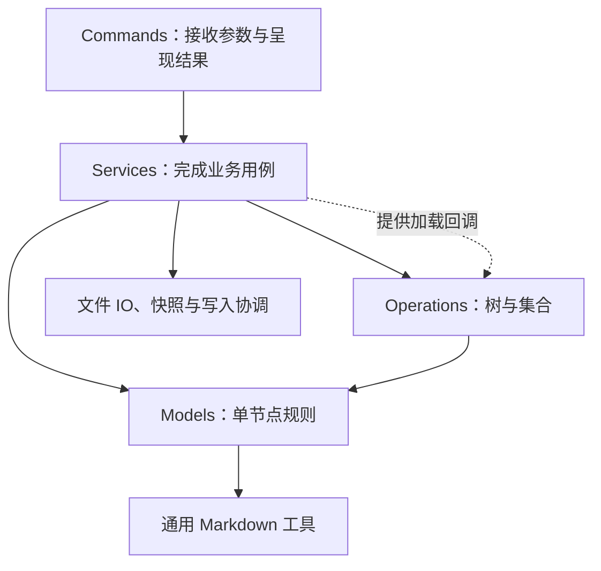
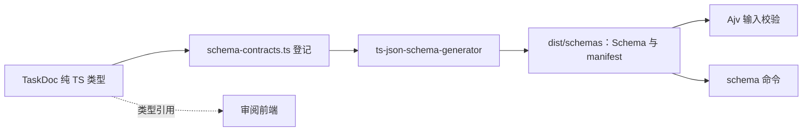

# Edges CLI

`edges` 是人和 Agent 共用的 Edges 命令行入口。它把任务、项目记忆、笔记和发布能力放到同一套作用域与节点协议上，让能力可以跨仓库复用，而内容始终归属于选定的目录。

核心分工是：**先确定作用域，由 Service 完成用例，Model 维护单节点规则，operations 处理集合与树。** 文件系统是内容载体，AGENTS.md 是递归索引入口；CLI 执行明确的操作，不替调用方判断内容应该属于本层还是下层。

## 快速开始

运行、构建与测试统一以 Node.js 22 为基线。以下命令在仓库根执行：

```bash
pnpm install --frozen-lockfile
pnpm --filter edges-cli exec tsx src/index.ts --help

# 构建本地可执行产物
pnpm --filter edges-cli build
node extensions/cli/dist/index.js --help
```

开发时可以通过 tsx 直接运行源码；需要 Schema 的命令先运行 `build:schemas`，需要审阅页的命令先构建审阅应用。`pnpm --filter edges-cli dev --help` 会先生成 Schema。

包名为 `edges-cli`，命令名只有 `edges`。当前包设为 private，尚未发布到 npm；package.json 的 bin 指向本地 `dist/index.js`。`prepack` 会执行完整构建，`pnpm --filter edges-cli pack` 可生成包含代码、Schema、审阅页资产和 Memory 模板的本地安装包。只有 build 或 prepack 成功后，编译后的命令才可用。

直接运行 `edges` 而不带子命令会返回用法错误；没有 `edges-note` 别名，也没有根命令默认写入笔记的行为。

## 整体架构

```text
src/
├── index.ts               # 进程入口
├── program.ts             # Commander 命令树与 run()
├── context.ts             # 单次命令的环境、stdin 和结果上下文
├── commands/              # 参数、输入输出与命令适配
├── services/              # 完整用例、跨节点协调和持久化
├── domain/
│   ├── models/            # 单节点身份、内容、关系和行为
│   └── operations/        # 树遍历、惰性查询和集合算法
└── utils/                 # Markdown、文件系统等基础工具
```



| 层 | 负责什么 | 例子 |
| --- | --- | --- |
| commands | 命令注册、参数与 stdin 适配、stdout/stderr 和退出码 | 把 `tasks create` 转成创建请求 |
| services | 加载、跨节点协调、文件操作与完整业务流程 | 创建 Task 后登记父 AGENTS、保存、移动整个任务目录 |
| models | 节点自身的字段、校验、解析序列化和索引编辑 | Task 优先级校验、InternalNode.addChild |
| operations | 对多个元素进行遍历、筛选、分组、查找 | traverse、filter、groupBy、Task 数组排序 |
| utils | 可复用的底层格式与文件机制 | gray-matter 适配、路径与文件原语 |

Model 的 create/update/destroy 是内存领域方法；创建目录、保存文档等完整动作通过 Service 完成。operations 通过回调取得加载能力，不反向依赖 Service。不要让业务调用方重新拼装模型修改与文件读写。

这张图表达职责边界，不代表所有历史代码都已整理完：Tasks 的结果适配仍引用 CliContext，审阅页命令还有流程编排，Artifacts 的部分部署逻辑仍在 commands 下。进一步解耦已登记为[后续任务](../../.harness/tasks/edges-cli-platform/backlog/2026-10-06--解耦-CLI-commands-与-Service/INDEX.md)，不能把当前 commands 全部描述成“只调用 Service”。

详细设计按职责分开阅读：

- [Domain](src/domain/README.md)：整体依赖、写入与查询路径、Schema 链路。
- [Models](src/domain/models/README.md)：类图、入口与目录、parent/children/harness、解析与扩展。
- [Operations](src/domain/operations/README.md)：函数与查询链、求值时机、短路和加载边界。

## 作用域与递归节点

### 先确定内容归属

```bash
edges --scope /absolute/project tasks list
edges --scope /absolute/project memory doctor
```

作用域按 `--scope` → `EDGES_SCOPE` → `EDGES_REPO` → 当前工作目录附近的所属 AGENTS 作用域或 Git 根解析。相对路径基于调用时的 cwd，CLI 的安装目录不是默认内容目录；指定作用域不会自动初始化 Project Memory。

笔记写入选定作用域的 `notes/`，Git 操作使用它实际所属的仓库根。Artifacts 服务安装操作使用 CLI 实现仓库，独立于内容作用域。new-note MCP 未显式配置目标时保存调用方 cwd；显式配置优先，Skill 和 CLI 实现路径仍指向实现仓库。

### 目录是内容单位，入口是节点身份

所有内容节点采用目录形式：普通内容以 `index.md` 为入口，Skill 以 `SKILL.md` 为入口，内部索引以 `AGENTS.md` 为入口。ID 是规范化的绝对入口路径；图片和附件属于内容目录，不另建资源节点。

AGENTS 的本层硬约束、本层记忆、下层索引分别对应 constraints、localChildren、descendantChildren。NodeReference 只有 id，以及可选的 name、description；作者写下的相对链接由解析和序列化层维护。

每个节点可以有独立的 harness。内容叶节点的 harness 是同目录 AGENTS.md；InternalNode 的下一层 harness 位于 `.harness/AGENTS.md`。harness 不混入 children，普通查询不会自动进入维护系统的下一层。

新增父级登记时，调用方明确选择 `--index-group local|descendant`，CLI 校验并执行，不按用途或目录深度推断。已有关系保留原分组，传入该参数不等于移动已有关系。缺少 owner 时不会自动初始化；生成的 Task 项目与 Memory 类型入口使用其固定本层系统维护信息关系。

### 查询遵循索引

NodeService.query 按已登记关系遍历，不靠扫描补齐遗漏。默认走全部组成 children（local∪descendants）；显式 `localOnly` 才只走 localChildren；includeHarness 才沿维护关系递归。**traverse 只跑单个系统**；森林在外由 `collectSystemRoots` + `SystemForestService` 拼装（CLI：`edges forest list`，默认 `independent`）。默认根是 scope 下真 `AGENTS.md`；显式 `--super` / `SuperAgentsNode` 按 `harness-materials.json` 挂材料 README（遍历当普通 AgentsNode），不是从真 AGENTS 并 README 边——详见 [models 设计原则](src/domain/models/README.md#设计原则树与入口)与 [operations 遍历原则](src/domain/operations/README.md#原则单系统-traverse--森林在外)。

```ts
const pending = service.query(scope, { types: ["task"] })
  .filter((node): node is TaskNode => node instanceof TaskNode)
  .filter(task => task.priority === "high")
  .groupBy(task => task.status)
  .mapValues(tasks => tasks.map(task => task.title));

const groups = await pending.value();
```

查询链只描述计算，value 才执行；重复求值会重新运行。普通 filter 不剪枝；类型选择由 Service 协助跳过无关叶节点正文。groupBy 虽然延迟执行，计算时仍需收集上游数据。

## 创建、保存与一致性

同一个 NodeService 内，同路径共享一个可变实例。update 保存节点的完整当前状态；create/import/move/destroy 会保存其实际影响到的索引的完整当前状态，包括这些索引已有的未保存修改，不顺便保存无关 dirty 节点。不同 Service 保持独立快照，不做三方合并。

query 最初只加载入口快照。对查询结果执行目录 move/destroy 前，用 get(node.path) 补充资源快照；它复用同一实例，不丢弃已有修改。list 返回的节点已捕获相应快照。目录移动与删除按完整生命周期单位处理，附件随目录操作。

节点写命令在业务读取前取得工作树级锁，结束后释放。父子作用域共享最近 Git worktree 根的 `.edges-write.lock/`，不同 worktree 独立；非 Git 写操作保守地共享系统临时目录中的同名锁。只读命令和 Artifacts 操作不取得这把节点锁；直接使用 NodeService 的调用方需要自行协调命令级锁。

锁由 proper-lockfile 管理，竞争时立即报 busy；`.edges-write.lock` 是保留运行时名称，扫描、复制会排除它，生命周期操作拒绝搬移或删除活动锁。其他仓库应自行配置对应忽略项，CLI 不代改其 .gitignore。

已有文件通过 write-file-atomic 替换，快照同时检查内容和文件身份。外部编辑器不遵守协作锁，因此仍存在检查到替换间的竞争窗口；单文件原子写入不等于多文件事务。失败时保留恢复路径和报告，不宣称崩溃下的全事务保证。

模型与文档处理保留未修改的业务扩展字段及 AGENTS 非受控正文。YAML 使用 gray-matter 的正常行为，不承诺编辑后保留 YAML 注释与样式。只读引用和管理根边界由 Service 执行，不把资源管理或新的业务权限体系塞进 Model。

## 命令

commands 的目录对应命令树：一个文件注册一个命令节点，同名子目录放它的子命令及参数、输出辅助代码。完整参数以各层 `--help` 为准。

### 任务：tasks

默认看板是 `<scope>/.harness/tasks/`，即 `--purpose maintenance`；显式使用 `--purpose domain` 选择 `<scope>/tasks/`。根作用域与子作用域、读与写使用相同默认值。

```bash
edges tasks list
edges tasks list --all-scopes --status todo --priority high --sort priority
edges tasks list --all-scopes --group-by project
edges tasks --purpose domain list
edges tasks --index-group local create --title "修复构建" --project default
edges tasks get <stem或路径>
edges tasks update <stem或路径> --priority high
edges tasks status <stem或路径> done
edges tasks project list
edges tasks project review-page --from /tmp/tasks.json --out /tmp/review.html
```

上例 create 的 local 是调用方选择，不是 CLI 对 maintenance 用途的自动推断。任务写操作只改文件，不执行 Git；取消使用 status cancelled，没有 delete 命令。任务以 `<stem>/index.md` 存储，并带 `.<stem>.log.md`；状态或项目变化移动整个目录。

list --all-scopes 从选定作用域所属 Git 根出发，无 Git 时从该作用域出发，递归查询登记树及各维护层；默认包括两种 purpose，只有显式传入 purpose 才筛选。全局根必须有有效 AGENTS，未登记的看板不会因物理存在而自动出现。其他写命令仍只操作选定看板。

普通任务命令 stdout 为 JSON；runs、run-messages 只读，默认表格，可用 `--output json`。未分组 list 返回 tasks 数组；分组输出是 `{ groupBy, groups: [{ key, items }] }`，先筛选再分组。全局数据携带 scope、purpose、project、stem 和入口 path。

review-page 只把 groups/items JSON 渲染成 HTML，不改任务、不打开浏览器、不自动发布。需要公开预览时再调用 artifacts publish。固定任务站点的生成、部署与路径配置见[部署说明](deploy/README.md)。

### 项目记忆：memory

Project Memory 的执行能力由 TS CLI 提供，Skill 负责工作流和调用规范。

```bash
edges --scope /absolute/project memory init --memory-types project feedback
edges --scope /absolute/project memory remember --type project --slug decision \
  --description "记录本项目的设计取舍" --content-file /tmp/decision.md
edges --scope /absolute/project memory doctor
edges --scope /absolute/project memory doctor --apply
edges --scope /absolute/legacy-project memory migrate --recursive --dry-run
edges memory backup --repo-dir /absolute/project
edges memory restore --repo-dir /absolute/project --archive /private/archive.tar.gz
```

新作用域的 init 未选择类型时只返回推荐项；remember 不初始化缺失作用域；doctor 默认只诊断。旧 `.memory` 通过显式 migrate 转换，普通命令不兼容迁移。新建 owner 登记需要的 index-group 放在 init 或 doctor 后。

用户记忆 restore 默认拒绝覆盖，明确使用 --force 才整份替换，失败时回滚。备份和恢复接受未压缩或 gzip tar，解包上限 256 MiB、10,000 文件，拒绝硬链接；中断后若报告 `.private-user-memory-*/previous`，应保留恢复副本。模板随包复制到 dist，运行不依赖相邻 Skill 源码或 Python。

内容类型、私有忽略规则与规范以 [Project Memory LAYOUT](../skills/project-memory-init/references/LAYOUT.md) 为准。

### 笔记：note

```bash
edges --scope /absolute/project note --title "设计结论" \
  --content-file /tmp/reviewed-note.md --markdown \
  --co-author "Codex <noreply@openai.com>" --dry-run
```

必填 title、content/content-file 和 co-author。`--markdown` 保留已写好的标题与正文，不套入笔记模板；`--import-entry` 校验并复制完整入口目录，不能与正文或 markdown 输入混用。仅 content-file 不复制同目录附件。路径输入只供本地 CLI，HTTP/MCP 不接受本地路径参数。

**note 的 dry-run 仍会写文件并创建本地 commit，只是不 push。** `EDGES_DRY_RUN=true` 行为相同。stdout 为 JSON，诊断在 stderr；退出码为成功 0、用法或校验 2、鉴权 4、运行错误 1。

若配置 EDGES_AUTH_TOKEN，通过 note 的 --token-file 或非 TTY 的 --token-stdin 提供凭据，不把 token 放进命令参数。Git/PR 行为与 Note Service 保持一致。

<a id="artifacts"></a>

### 预览发布：artifacts

```bash
edges artifacts init --base-url https://edges.viruspc.tech
edges artifacts publish /tmp/review.html --ttl 24h
edges artifacts rm <id或URL>
edges artifacts server install
edges artifacts server start
edges artifacts server status
```

init 管理客户端配置，publish/rm 调用预览服务并返回 JSON。server install 负责构建、服务配置和启用，不自动 start；start/stop/restart 只管理进程。服务部署路径与内容作用域独立。发布任务来源时使用 from-type、from-id、task-project，不把渲染审阅页与发布合成一个隐含动作。

客户端 token、服务端配置、nginx、升级与恢复流程见 [Artifacts 服务说明](../services/artifacts-preview/README.md)和[部署说明](deploy/README.md)。

<a id="json-schema-contracts"></a>

### 数据合同：schema

```bash
edges schema list
edges schema get task-doc/v1 > /tmp/task-doc.schema.json
pnpm --filter edges-cli run build:schemas
```

list 返回已打包合同的 key/id/title/description，get 返回完整 draft-07 JSON Schema。它们不依赖内容作用域、不读 stdin，不在运行时生成 Schema；缺少构建产物应重新 build 或安装。成功 stdout 只有 JSON，错误写 stderr 并返回非零状态。



当前只有 TaskDoc 接入，类型源为 [task-doc-contract.ts](src/domain/models/tasks/task-doc-contract.ts)，不是整个 TaskNode 类。生成物不提交仓库。构建时生成，运行时 Ajv 校验；前端直接引用纯类型和枚举，不依赖生成器。

TaskDoc 要求 name、description、metadata、body，拒绝未知顶层字段；metadata 允许 JSON 扩展值，已知字段校验状态、优先级、项目标识与日期格式。校验不做类型强转、默认补值或字段删除。grouped-list 与 review-page 的 JSON 入口复用此合同；原始 Markdown 解析保留自身策略，不偷偷套用这套 JSON 校验。选型依据见 [ADR 0025](../../docs/adr/0025-typescript-source-generated-json-schema.md)。

## 开发与验证

```bash
pnpm --filter edges-cli exec tsc --noEmit
pnpm --filter edges-cli test
pnpm --filter edges-cli build
pnpm --filter edges-cli run dev:tasks-review-app
```

test 会准备 Schema 和审阅页后执行 CLI 回归；build 清理 dist、生成 Schema、构建审阅应用、编译 TS 并复制 Memory 模板。包测试还会在仓库外仅安装生产依赖，验证编译产物可用。局部测试若直接运行，需自行准备对应资产。

新增行为按边界落位：单节点规则进 models，集合算法进 operations，完整用例进 services，命令协议进 commands。不要为一种新节点重复实现加载、索引、YAML 或文件写入，也不要为统一外观增加空层或无用包装。

旧 task-projects 区块需要独立迁移，普通任务写入不会自动转换。先预览选定范围，再明确执行：

```bash
pnpm --filter edges-cli exec tsx ../../scripts/migrate-agents-indexes.mts \
  --root /absolute/scope --check
pnpm --filter edges-cli exec tsx ../../scripts/migrate-agents-indexes.mts \
  --root /absolute/scope --write
```

脚本先检查所有候选再写入，保留原文备份，跳过符号链接、依赖目录、受保护的 posts 和嵌套 Git 边界；重复执行无变更。

Task Project 列表属于看板 `README.md`（`project-entries-local`）；看板 `AGENTS.md` 只登记 `<project>/AGENTS.md` 系统入口。把看板 AGENTS 里的 README 型 project 链接（含旧 task-projects 区块）一次性移过去：

```bash
pnpm migrate:task-project-lists -- --root /absolute/scope          # 预览
pnpm migrate:task-project-lists -- --root /absolute/scope --apply
```目录迁移与本机私有内容恢复见[迁移指南](../../docs/recursive-layout-migration.md)。
