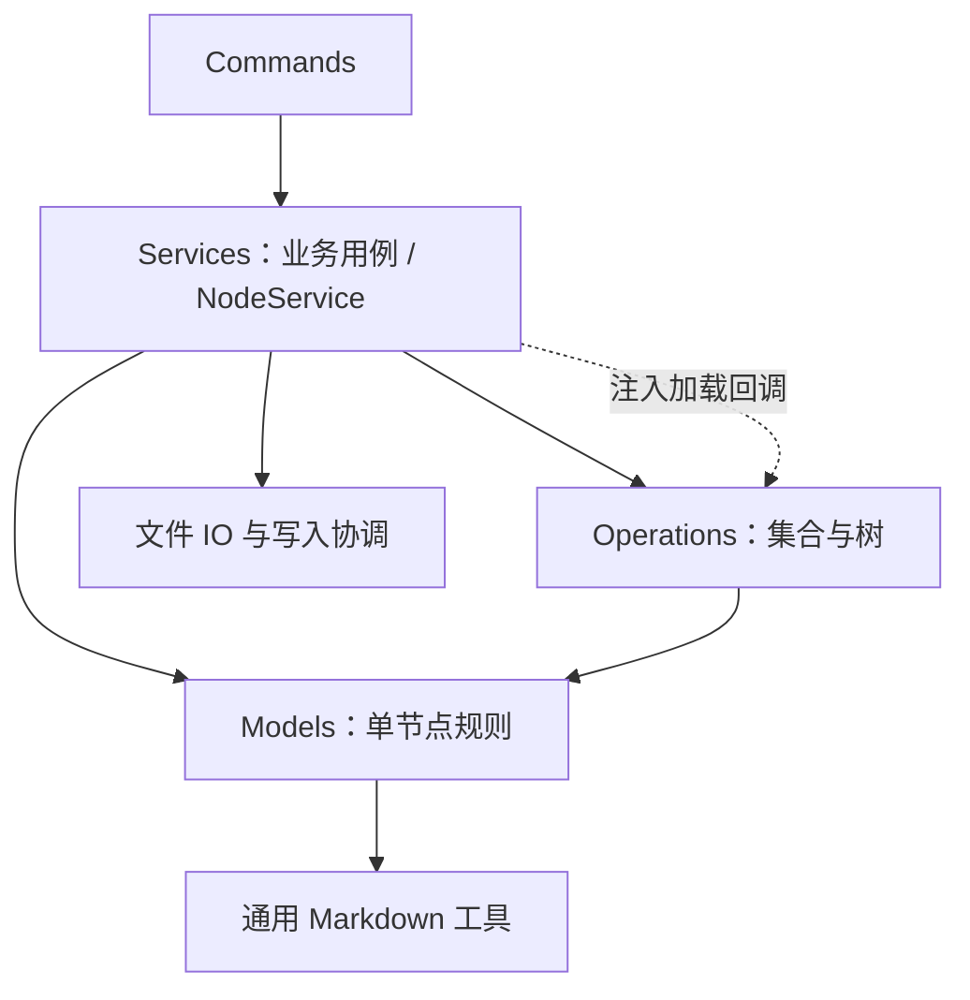
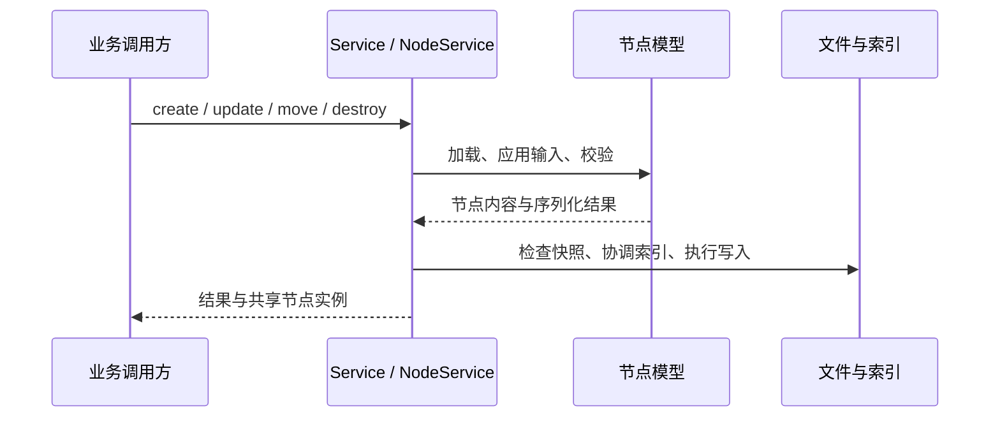
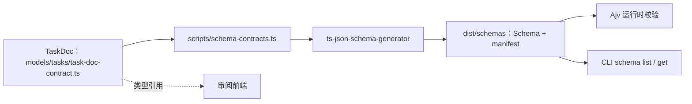

# Domain 架构

Domain 是 CLI 的领域核心，分为 [models](models/README.md) 与 [operations](operations/README.md)：前者表达单个节点及其规则，后者处理节点集合和递归遍历。文件读写、跨节点协调、命令参数与输出格式由外层负责。

## 分层与依赖

```text
src/
├── commands/             # CLI 参数、输入输出与命令适配
├── services/             # 完整用例、加载、跨节点协调、持久化
├── domain/
│   ├── models/           # 单节点身份、内容、关系与行为
│   └── operations/       # 树遍历、惰性查询与集合算法
└── utils/                # Markdown、文件系统等基础工具
```



箭头表示依赖方向。通用 filter/map/groupBy 不依赖具体节点；traverse 使用基础节点关系，Tasks 专用集合操作使用 Task 规则。加载回调由 Service 提供，所以遍历不反向导入 Service，也不自行扫描文件系统。

| 问题 | 归属 |
| --- | --- |
| 一个 Task 的优先级是否合法？怎样更新标题？ | models/tasks |
| 怎样解析 AGENTS，并修改它持有的索引？ | models/internal |
| 怎样按属性过滤、分组，递归访问已登记的节点？ | operations |
| 怎样创建目录、登记父索引、检查外部修改并保存？ | services |
| 怎样把命令参数变成请求、返回 JSON 或表格？ | commands |

Model 不做 IO，不依赖 Service 或 operations；operations 不依赖 Service。通用格式工具不依赖业务模型。这不表示整个 CLI 的历史分层问题都已消除：退出码表在 `commands/exit.ts`，不再经 utils 引用业务错误类型；部分命令仍有用例编排。

## 共同的数据基础

节点跟随文件系统，以目录组织、以入口 Markdown 标识。`BaseNode` 实现只有 `id/name/description` 的 `NodeReference`；ID 是规范化的绝对入口路径。`InternalNode` 对应 AGENTS，`LeafNode` 派生 Task、Memory、Note、Skill。

InternalNode 分开维护 `localChildren` 和 `descendantChildren`，分别表达本层与下层索引。`harness` 是独立的维护关系，不混入 children；遍历因此可以选择是否跨维护层。引用可以跨目录，parent 的恢复仍遵循物理目录与 Service 的管理边界。

节点只建模 Markdown 入口，附件不扩展成资源节点。目录识别、入口名称、AGENTS 章节与生命周期单位集中在 [models/layout.ts](models/layout.ts)；Service 在此基础上读取实际文件并决定操作范围。完整类图、目录职责、解析流程和扩展方式见 [models/README.md](models/README.md)。

## 两条主要执行路径

### 写入节点



Model 的 create/update/destroy 是内存领域 hooks。完整 CRUD 通过 Service 完成；不让业务调用方自行拼接模型更新与文件写入。同一 NodeService 内同路径共享可变实例，不引入副本自动合并。写入协调不等于数据库式跨进程事务。

### 查询登记树

Service 选定作用域和关系策略，把解析引用、加载节点的能力交给 traverse。查询链组合 filter/map/groupBy，直到 `value()` 才执行。默认访问本层引用，进入下层或递归 harness 都需要显式选项。

查询遵循已登记的索引，不用全盘扫描补齐缺失关系。按类型排除无关叶节点正文由 Service 的加载策略实现；普通 filter 只过滤输出，不意味着树剪枝。惰性、短路和物化边界见 [operations/README.md](operations/README.md)。

## 对外数据与 Schema

TaskNode 带有行为和文件身份；TaskDoc 是纯数据接口，供 JSON 校验和审阅前端使用。



Schema 从登记的 TS 数据契约生成，不扫描完整模型类，生成物不提交仓库。当前只登记 TaskDoc，不为统一外观给所有节点预建 Schema。技术选择见 [ADR 0025](../../../../docs/adr/0025-typescript-source-generated-json-schema.md)。

## 扩展与维护

- 新节点行为放到 models 对应目录，复用 BaseNode/LeafNode hooks；共用后再下沉到 core。
- 集合或遍历算法放 operations，通过参数或回调取得外部能力，不引入 Service 依赖。
- 涉及文件、多个节点、发布或权限策略的完整动作由 Service 编排。
- 新外部 JSON 合同用纯 TS 类型定义，按实际需求登记到 Schema 生成器。

不要为一种新节点复制 IO、查询或 YAML 解析实现。理解模型从 [models/index.ts](models/index.ts) 开始，理解查询从 [operations/query.ts](operations/query.ts) 开始，理解持久化从 [NodeService](../services/node/node-service.ts) 开始。构建、测试与 CLI 用法见 [CLI README](../../README.md)。
