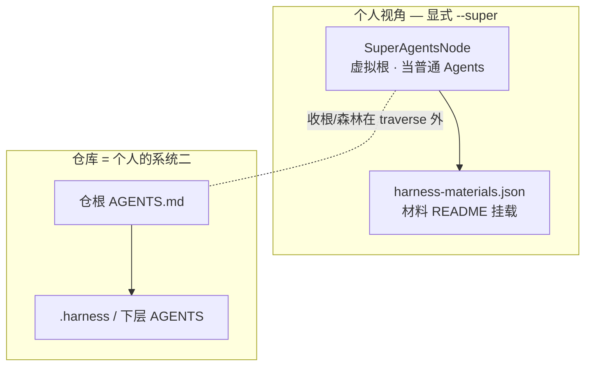
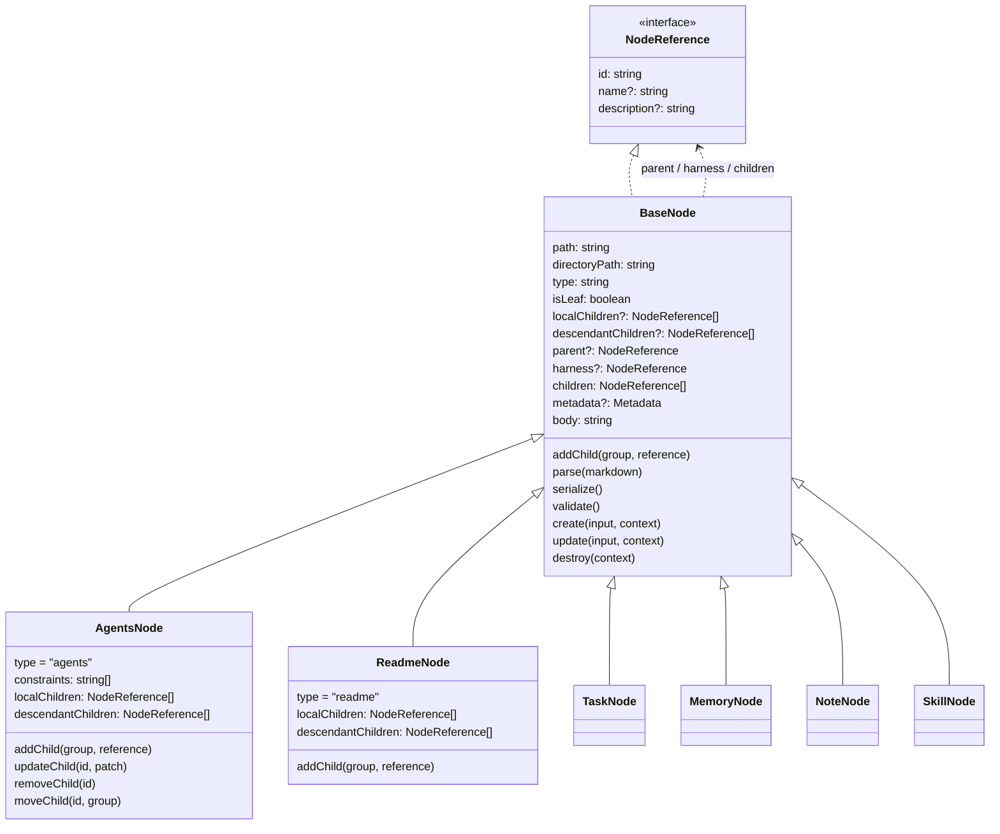
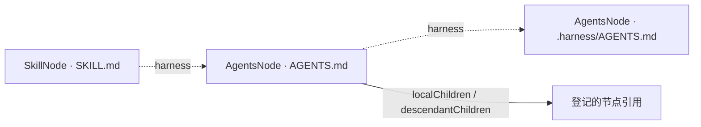
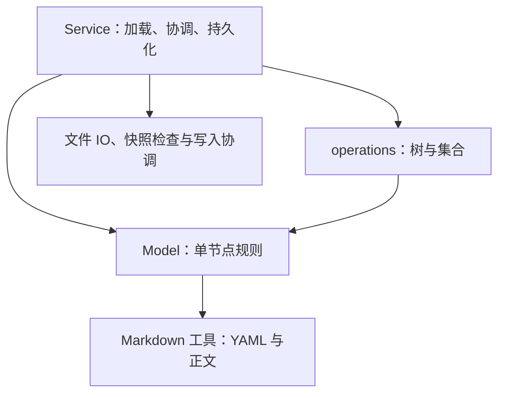
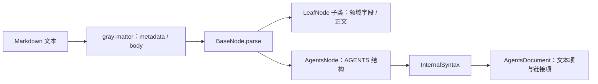
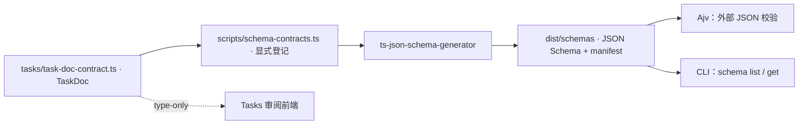

# 节点模型架构

Model 表达一个文件系统节点的身份、内容、关系与自身行为。节点以目录组织，以 Markdown 入口标识；Task、Memory、Note、Skill 和 AGENTS 共用这套基础模型。

**Model 处理单节点，operations 处理集合与树，Service 完成用例与持久化。** 整体依赖见 [Domain 架构](../README.md)，查询组合见 [operations](../operations/README.md)；仓库的系统设计与内容目录约定仍以[根 README](../../../../../README.md)为准。

## 设计原则（树与入口）

下列原则以 2026-10-06 grill、2026-10-07 澄清与根 `CONTEXT.md` 为准；类图已与现行实现一致：`AgentsNode` / `ReadmeNode` 与各业务节点直继 `BaseNode`，无 Internal/Leaf 层次。

1. **递归系统二：** 系统入口是 `AGENTS.md`，带组成登记。CLI **默认**从 scope 下真 `AGENTS.md` 出发，只做该系统的**系统二**操作。经登记可达才算节点。
2. **组成边 ≠ 维护边：** `harness` 不进 `children`。默认遍历不跟随 harness。
3. **同目录双文件：登记分工，不是 traverse 并边：** 若同时存在 `AGENTS.md` 与 `README.md`，系统一孩子只挂在 README 的 `project-entries-*`；AGENTS 的 `project-harness-*` 只挂系统二材料与下级 AGENTS。持久化上互不为对方的 child。从真 AGENTS 出发**到不了** README 上的 tasks/notes 是预期。
4. **`traverse` 单系统：** 只走一个入口的 `children`，不跨系统、不拼森林。森林在外：扫盘收 `project-harness` 的 `AGENTS.md`，`SystemForestService` 交出 `BaseNode[][]`；`independent` 下 resolve 遇其它根早停；`innermost` 只留内层。
5. **仓库可视为个人系统二 + `SuperAgentsNode`：** 整仓可当作上一级主体（如个人）的系统二；向上建虚拟 `SuperAgentsNode`。traverse Super 时**当作普通 `AgentsNode`**。挂载来自 `harness-materials.json` 的材料 README（不挂其它系统 AGENTS）；材料可缺。不要从真 AGENTS 临时并 README 边。
6. **入口合同：** 组织清单 → `README.md` + `project-entries-*`；内容叶子 → `INDEX.md`；Skill → `SKILL.md`；系统入口 → `AGENTS.md`。有无子节点看是否出现组成登记，不持久化 `isLeaf`。
7. **谁拥有系统入口：** 任意目录可由用户自行 init；不是路径白名单。有列表 ≠ 系统入口。
8. **存量迁 `INDEX.md`：** 可预览脚本；含 `posts/`（仅改名）。不要手改、不要另写扫盘冒充组成。



查询：真 AGENTS 不到 README；换根用 `--super`。写路径把同目录 README 另起根闭合引用图。traverse / 森林原则见 [operations README](../operations/README.md)。

设计真源：[recursive-system-two-entries-design](../../../../../docs/superpowers/specs/2026-10-06-recursive-system-two-entries-design.md)。相关记忆：`feedback_traverse_single_system_and_forest_roots`、`feedback_cli_is_system_two_ops`、`feedback_content_via_super_agents_node`。

## 类与节点关系

> 各节点直继 BaseNode；`type` 含 `agents`/`readme`/`text`；组成登记（`localChildren` 是否存在）派生组织/叶子。`InternalNode` 仅作为 `AgentsNode` 的 deprecated 别名保留一个版本；`LeafNode` 仅为 deprecated 的纯 text 节点，业务节点不再继承它。



图中列出可读取的关系；不表示这些属性允许随意赋值。具体签名与只读限定见 [BaseNode](core/base-node.ts)、[NodeReference](core/types.ts) 和 [AgentsNode](internal/agents-node.ts)。

- `id` 等于规范化的绝对入口路径，例如 `/repo/notes/example/index.md`；`directoryPath` 是入口所在目录。移动节点会改变路径与 ID，由 Service 协调。
- `name`、`description` 是可选内容字段。引用只携带 `id/name/description`，无需先加载完整节点。
- `type` 区分 `agents/readme/task/memory/note/skill/text`。Memory 的 `memoryType` 是另一个维度。
- `isLeaf` 不持久化，由组成登记派生（`localChildren` 缺省且无 children 即叶子）；`traverse` 用 `localChildren` 是否存在而非类判断。
- `parent` 由 Service 根据物理目录和管理边界恢复。跨目录引用可以组成图，但不另行改变被引用节点的 parent；没有脱离目录的公开 `reparent` 操作。

### 本层、下层与 harness

AgentsNode 对应 `AGENTS.md`，把三个受管部分映射为：

| AGENTS 内容 | 内存模型 | 含义 |
| --- | --- | --- |
| 本层硬约束 | `constraints` | 本节点的重要约束 |
| 本层系统维护信息 | `localChildren` | 本层系统二材料与维护入口引用（现行标题；旧称本层组成） |
| 下层系统维护信息 | `descendantChildren` | 下层系统入口引用（现行标题；旧称下层节点） |

`children` 是 `localChildren` 与 `descendantChildren` 的有序合并。这里的 descendant 是下层索引组，不是已经加载完的所有后代；两组存的都只是当前入口登记的引用。物理目录深度或节点类型不能替代本层/下层的判断，新增登记由调用方明确给出 `local` 或 `descendant`。`moveChild` 只修改当前 AGENTS 中引用的分组，不移动目录、不改变 parent。

已有 Memory 类型入口的 `project-memory-entries` 区块也按本层索引处理；不要求为了使用 AgentsNode 而改写成另一套标题。普通导航链接和非受控 Markdown 保持为正文。

每个节点还可以有独立的 `harness` 引用。它不加入 `children`，所以普通树遍历不会自动跨进维护系统。当前[布局协议](layout.ts)约定：

```text
example-skill/
├── SKILL.md                 ← SkillNode：内容入口
├── AGENTS.md                ← AgentsNode：该 Skill 的 harness
├── assets/                  ← 附件，Model 不为其建资源节点
└── .harness/
    └── AGENTS.md            ← 上一个 AgentsNode 的 harness
```



同目录的 SKILL.md 与 AGENTS.md 是两个节点，入口和角色不同。一般叶节点的 harness 入口是同目录 AGENTS.md；AgentsNode 的下一层 harness 是 `.harness/AGENTS.md`，可以继续递归。目录的移动、删除及附件随迁由 Service 根据布局确定完整操作单位。

遍历策略属于 [operations/traverse.ts](../operations/traverse.ts)：**目标默认**走全部组成 `children`（local∪descendants）；只要本层时显式 `localOnly`。`includeHarness` 仍默认 false——例如从 `/repo/.harness/AGENTS.md` 检索且 `includeHarness: false` 时，不沿维护边进入下一层 harness。

## 文件按什么规则组织

```text
models/
├── index.ts                 # 节点类、输入类型与布局的公共出口
├── layout.ts                # 跨模型的目录、入口、区块和生命周期单位协议
├── core/                    # BaseNode、LeafNode、引用、共享字段与关系协调
├── internal/                # AgentsNode 与 AGENTS 文档解析、索引维护
├── tasks/                   # TaskNode、任务字段规则、TaskDoc 契约和文档适配
├── memory/                  # MemoryNode 与记忆文档规则
├── notes/                   # NoteNode：当前主要是正文标题访问与更新
└── skills/                  # SkillNode：SKILL.md 入口、名称和描述校验
```

同一节点的类与专属规则放在一起。只在多个模型共用时才下沉到 core；不要求每个节点都有同样数量的 types、codec、factory 文件。

| 模块 | 值得保留的拆分 |
| --- | --- |
| [core](core/base-node.ts) | `base-node.ts` 管通用内容与生命周期 hooks；`types.ts` 管基础契约；`fields.ts` 管共享 metadata 字段；`relations.ts` 保存 Service 协调的路径、parent、harness，不从公共入口开放身份改写 |
| [internal](internal/internal-node.ts) | `internal-node.ts` 管领域引用；`syntax.ts` 转换领域内容与 Markdown 索引；`document.ts` 定义 AgentsDocument；`parse.ts`/`serialize.ts` 保留原文并处理格式；`blocks.ts` 处理受控区块 |
| [tasks](tasks/task-node.ts) | `types.ts` 放任务枚举、输入及数据类型；`priority.ts`/`project.ts` 放单值规则；`frontmatter.ts`/`task-doc.ts` 适配文档；`task-doc-contract.ts` 单独服务前端与 Schema 生成 |
| [memory](memory/memory-node.ts) | `memory-node.ts` 管 memoryType；`documents.ts` 管已有记忆字段的读取、兼容和保留 |
| [layout.ts](layout.ts) | 集中管理 AGENTS.md、SKILL.md、INDEX.md（兼容旧 index.md）的识别、章节标记及 harness 路径。它涉及 Tasks 状态目录，因此保留在 models 根层，不伪装成业务无关的 core |

## Model、operations 与 Service 的边界

| 动作 | 归属 | 原因 |
| --- | --- | --- |
| Task 标题、优先级更新与校验 | Model | 一个节点自己的规则 |
| AgentsNode.addChild/updateChild | Model | 只改当前节点持有的索引内容 |
| Markdown parse/serialize | Model 使用格式工具 | 从文本恢复自身内容或把自身内容输出为文本 |
| traverse、filter、groupBy、Task 数组排序 | operations | 处理多个节点或集合；遍历通过回调加载 |
| 创建任务并登记父入口、保存、移动目录、删除 | Service | 涉及文件 IO、多个节点和完整用例 |



Model 的 `create/update/destroy` 是内存领域方法，不会创建、写入或删除文件。业务调用方通过 [NodeService](../../services/node/node-service.ts) 或 Tasks/Memory/Note 业务 Service 完成持久化，而不是自行拼接模型更新和文件写入。`destroy` 当前提供删除前校验，实际目录删除由 Service 执行。

模型采用可变实例。同一个 NodeService 内，同路径节点共享实例；`create/update` 使用临时草稿校验后再更新当前实例，减少失败时的半修改状态。这不等于 immutable，也不构成跨进程事务。metadata 和关系 getter 返回受保护的视图/副本；修改 getter 返回值不会更新节点，内容应通过字段 setter 或模型方法更新。

core 不依赖具体节点，Model 不依赖 operations 或 Service。通用 Markdown 工具不依赖任何节点模型。跨模块的 type-only 引用不等于运行时依赖环；例如 BaseNode/relations 与 AGENTS 文档/解析器之间有类型引用，运行时仍无循环。

## Markdown 如何进入模型

通用 [Markdown 工具](../../utils/markdown/document.ts)使用 gray-matter 解析可选 YAML 头，正文保持为 Markdown 字符串。模型实例的 `parse/serialize` 复用这层处理，子类通过 `validateMetadata`、`parseBody`、`serializeBody` 和 `applyInput` 扩展自身规则。



AgentsNode 将索引链接变成具有绝对入口 ID 的 NodeReference；AgentsDocument 保存文档中的链接目标与文本项，InternalSyntax 和解析器负责保留原文及位置信息。**AgentsDocument 是文档表示，AgentsNode 是领域节点**，两者职责不同。原文位置等解析细节不进入公共节点模型。

序列化保留 AGENTS 的非受控正文、可保留的原链接及区块结构；YAML 使用库的正常输出，不承诺编辑后仍保留 YAML 注释和排版。`parse` 会执行解析与 metadata 校验，完整领域校验仍通过 `validate` 及 Service 的写前检查完成；不要把所有节点的 parse 等同于完整写入校验。

文档 codec 只是 `type + parse + serialize` 的格式适配接口。通用工厂与 base codec 位于 Markdown 工具；Memory、Task、AGENTS 的适配分别位于自己的模块。Tasks 不再为了使用通用 Markdown 而导入 Internal。

## Schema 与模型的关系

Schema 描述对外的数据合同，不直接扫描包含方法、路径与关系的完整节点类。当前接入的是 TaskDoc，而不是“所有节点都已有 Schema”。



TaskNode 负责节点行为；TaskDoc 是可交换的纯数据。契约与节点类分开，前端和生成器才不会连带加载文件系统或 Markdown 解析代码。生成物不提交仓库；输入校验与构建约定见 [CLI README](../../../README.md#json-schema-contracts)和 [Schema ADR](../../../../../docs/adr/0025-typescript-source-generated-json-schema.md)。

## 扩展一个节点

1. 在所属类型目录定义类。普通内容直继 BaseNode，维护索引结构的节点按需要扩展 AgentsNode；没有专属行为的 index.md 可使用（deprecated 的）LeafNode 或 BaseNode。
2. 保持只传绝对入口路径即可构造。通过现有 hooks 扩展字段、校验及解析序列化；正文的 serialize → parse 必须能恢复状态，因为生命周期草稿复用这条路径。
3. 定义该类型的输入与规则；共享后再下沉，不预先新增空抽象层。
4. 若需要自动识别，通过 layout 的目录分类机制和 NodeService 的 `models` 映射接入。分类只决定模型类型，不推断 local/descendant 归属。
5. 由 Service 协调 IO 与完整用例。需要集合算法时放 operations；确有外部数据合同需求时，再单独定义纯类型并登记 Schema。

公共节点类和必要类型从 [index.ts](index.ts) 导入。模型内部直接依赖实际模块，避免绕公共聚合出口形成环。验证已有行为可运行 CLI 的模型、文档、查询及全量测试；模块整理的设计与验收记录见[实施计划](../../../../../docs/superpowers/plans/2026-10-06-model-module-organization.md)。
