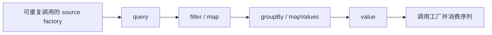

# 树与集合操作

operations 处理集合、遍历和查询组合；单节点内容规则留在 [models](../models/README.md)，文件加载和完整用例留在 Service。这里使用原生 AsyncIterable，没有引入 Lodash、RxJS 或流处理框架。

## 组成

| 文件 | 职责 |
| --- | --- |
| [traverse.ts](traverse.ts) | 惰性深度优先遍历及遍历选项 |
| [query.ts](query.ts) | 组合算法，提供显式 value 求值的链式接口 |
| [filter.ts](filter.ts)、[map.ts](map.ts) | 对异步序列逐项筛选、转换 |
| [find.ts](find.ts) | 找到首个匹配项后停止消费上游 |
| [group-by.ts](group-by.ts) | 消费序列，按键聚合成普通对象 |
| [map-values.ts](map-values.ts) | 对对象的值做转换，保留字符串键 |
| [to-array.ts](to-array.ts) | 消费序列并收集成数组 |
| [tasks.ts](tasks.ts) | Task 数组的项目/优先级筛选与稳定排序 |
| [index.ts](index.ts) | query、traverse 及查询接口类型的入口 |

通用算法各自一份文件，query 只组合它们。Task 的单个优先级解析、比较和项目标识规则仍在 models/tasks；任务创建、目录移动属于 Service。

## 两种调用方式

- **查询链**：`query(sourceFactory)` 的 filter、map、find、groupBy、toArray、mapValues、values、thru 只描述计算；只有 `value()` 开始执行。
- **独立函数**：filter/map/traverse 返回惰性的异步生成器，迭代时执行；find/groupBy/toArray/mapValues 是 async 函数，直接调用就开始计算并返回 Promise。

Tasks 数组函数是另一类已有领域操作：接收内存数组并立即执行，不加载节点，也不构造查询链。



方法没有固定先后依赖，可以按类型自由组合：map 改变元素类型，groupBy 把序列变成以数组为值的对象。

| 接口 | value 的结果 | 可继续的链 |
| --- | --- | --- |
| `AsyncQuery<T>` | `T[]` | filter、map、find、groupBy、toArray、thru |
| `ObjectQuery<V>` | `Record<PropertyKey, V>` | 上述集合方法，以及 mapValues、values；集合方法接收对象的值 |
| `Deferred<T>` | `T` | thru；find 返回这个接口 |

groupBy 后直接 filter，处理的是每组数组，结果转为序列，不保留原对象键。保留分组键用 mapValues，显式转成值序列用 values。find 后可用 thru 处理单项结果。

value 不缓存结果。重复调用会重新执行 source factory、重新遍历；source factory 应创建可再次消费的序列，不能反复返回同一个已经耗尽的生成器。

## 示例：筛选、分组与继续计算

业务调用方持有 NodeService 时，可以这样查询；这不要求 operations 实现反向导入 Service：

```ts
// TaskNode 从 domain/models/index.js 导入；service 是调用方的 NodeService。
const pending = service.query(scope, { types: ["task"] })
  .filter((node): node is TaskNode => node instanceof TaskNode)
  .filter(task => task.priority === "high")
  .groupBy(task => task.status)
  .mapValues(tasks => tasks.length);

// 前面只构造计算；这一行才遍历、加载并汇总。
const counts = await pending.value();
```

纯集合计算不需要 NodeService：

```ts
import { query } from "./query.js";

const input = query(async function* () {
  yield 1;
  yield 2;
  yield 3;
});

const first = input.filter(n => n > 1).find(n => n % 2 === 0);
const answer = await first.thru(n => n === undefined ? "missing" : String(n)).value();
// answer === "2"；找到 2 后，不继续消费 3。

const groups = await input.groupBy(n => n % 2).mapValues(values => values.length).value();
// 重新执行 input，得到 { "0": 1, "1": 2 }。
```

## 惰性、短路与物化

filter/map 按顺序逐项处理，find 可以提前关闭上游迭代器。groupBy、toArray 则必须收集上游数据；thru 取得的是前一段计算完成后的整体结果。

```text
filter → find → value
  找到匹配项即可停止。

filter → groupBy → find → value
  先收集所有通过 filter 的项完成分组，再从分组中 find。

toArray → find → value
  先消费完整上游，再 find；toArray 本身仍等待 value 才开始。
```

groupBy 调用时不触发计算，但 value 执行后需要物化分组。先 filter 能减少保存到分组中的项，却不保证减少判定所需的读取。

分组键遵循 JavaScript 属性键转换，返回普通对象而非 Map。mapValues 与 values 只枚举字符串可枚举自有属性；symbol 分组可直接从分组结果读取，但不经这两个方法继续枚举。键顺序遵循 JavaScript 对象规则，不承诺 Map 的插入顺序。

## 遍历与加载边界

### traverse 只走单个系统

1. **一次 traverse 走一个系统**：只走该入口的 `children`（系统二组成）。
2. **`SuperAgentsNode` 无特判**：traverse 时当作普通 `AgentsNode`（同一套 `children` 规则）。
3. **`excludeRoots` 早停**：调用方传入的绝对入口路径在 resolve 时停住，不再沿该入口向下。
4. **仓库可视为个人系统二 + Super**：整仓可当作上一级主体的系统二；`SuperAgentsNode` 按 `domain/config/harness-materials.json` 挂**存在的**材料 README（`scope` + path；材料 path 不带 `.harness/` 前缀；harness 根 = `<scope>/.harness` 若存在否则 `scope`）。零个材料时允许空挂载；**不**挂其它系统的 `AGENTS.md`。

多个系统由 Service 层收集系统根并拼成森林，见 [CLI README](../../../README.md#多个系统拼成森林)。

真源记忆：`feedback_traverse_single_system_and_forest_roots`。


```ts
traverse(
  roots,
  options,
  resolve, // (parent, reference) => target | undefined
  load,    // (parent, reference, target) => Promise<BaseNode>
);
```

roots 是一个已加载节点或一组节点。多根时每一棵只走自己的 `children`。resolve 返回 undefined 可跳过引用；load 提供实际加载能力。调用方可以把路径放进 `excludeRoots`，resolve 遇到这些路径即停。traverse 不自己打开文件，也不扫描目录发现未登记节点。

| 选项 | 行为 |
| --- | --- |
| 默认 | 展开全部组成 `children`（local ∪ descendants） |
| `localOnly: true` | 只展开 localChildren |
| `includeHarness: true` | 额外沿独立 harness 关系递归，不只进入一层 |
| `types` | 选择输出类型，不自动删掉通往目标的导航节点 |

不再接受 `includeDescendants`；要本层-only 一律传 `localOnly: true`。

### 遍历根：真系统二 vs 虚拟系统二

| 根 | 何时 | 走到什么 |
| --- | --- | --- |
| 真 `AGENTS.md` | CLI 默认（`--scope`） | 仅该系统的系统二（维护信息、下层 AGENTS） |
| `SuperAgentsNode` | 显式 `--super` | 按 `harness-materials.json` 挂载的材料 README；**遍历语义同普通 AgentsNode** |

同目录 `AGENTS.md` 与 `README.md` 在磁盘上是**并列登记**：系统一孩子只写在 README，不写进 AGENTS 组成字段。从真 AGENTS 的 **query/list 不到内容面**是预期。要逛内容面须换根到 `SuperAgentsNode`。没有查询并边，也没有 `includeContentFace` 兼容开关。

Task 板发现（`taskBoardQuery`）默认**并查两面**：内容面（org-list 项目与其 Task）+ 真 AGENTS（系统入口项目与遗留链）。单面排查时显式传 `super: true|false`。仓级扫描先找到各板 AGENTS，再对每板做 dual-face 查询。写路径 `#registered` 在系统二图之外，把每个 AGENTS 同目录 README **另起根**遍历（不是 AGENTS 的 child 边）。

遍历按需进行深度优先、先序访问，已访问路径去重；遇到仍在当前递归路径中的节点时报组成环错误。同一节点被多处引用时只输出一次。解析或加载失败向上传递，不自动修复或回退到扫描。

**普通 filter 不做树剪枝。** 它只筛选输出，不改变 children。只需要 Task 时，在 `NodeService.query(scope, { types: ["task"] })` 指明类型：Service 能据此跳过无关叶节点正文，同时保留必要导航。单独调用 traverse 并提供任意 load 回调，不会自动得到这种 IO 优化；优先级等属性仍要先加载 Task 才能判断。

这里没有公开 enter/shouldEnter 方法。作用域和读取策略由 Service、遍历选项与加载回调提供，集合过滤保持普通函数语义。

## 扩展与验证

新增通用算法时，先提供独立函数，再按需接入 query，明确它是逐项计算、短路还是全量消费。算法不绑定 metadata：调用方可读取节点属性、metadata、派生值或普通对象字段。新增树策略优先复用关系选项和回调，不把 IO 塞进 Model 或 operations。

验证见[查询测试](../../../test/operations/async-query.test.ts)、[类型用例](../../../test/operations/async-query.types.ts)及[遍历测试](../../../test/operations/traverse.test.ts)。整体架构见 [domain/README.md](../README.md)。
