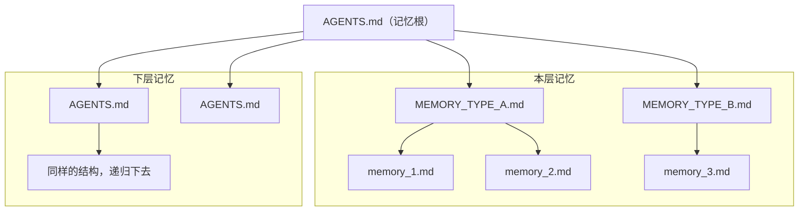

# 项目记忆协议

**记忆是一棵随项目目录结构生长的文件树**：每份记忆挂在某个目录上，管这个目录连同它的子树。

**协议就是这张图。** 这份文件是冻结的，改它意味着所有 skill 跟着改；改实现不用碰它，见 [`LAYOUT.md`](LAYOUT.md)。

## `AGENTS.md` — 本层记忆入口

- `AGENTS.md` 是**本层记忆入口**。里面有三类东西：本层硬约束、本层记忆索引、下层记忆索引。
- **本层硬约束**直接写在入口里：不检索就会做错事的规则，不进记忆文件，也不链到记忆文件。加载这份入口时已经在上下文里，读到就遵守。
- 本层记忆和下层记忆仍是索引：仅含地址和描述，不含具体记忆内容。不平铺整棵树——顺着下层边一层层跳，就能走遍。
- 两层入口都一样：**按描述挑下一跳**，不要把一层整个拉进来。硬约束不是索引，没有下一跳。
- 树是稀疏的，只有需要独立记忆的目录才有 `AGENTS.md`，挂在最近的带记忆祖先下层。**「下层」指的是记忆的分层，而非项目目录结构的分层**：图上一条下层边可能跨好几层项目目录。
- 一份 `AGENTS.md` 管它所在的目录连同整棵子树，越深越窄。下层是对上层的**补充**而不是覆盖：写按作用范围选一层，读把相关的各层叠加。
- 它是共享文件：工具只拥有自己用标记划出的区域，区块之外的正文一律保留，重复执行只刷新区块内。硬约束区块的正文由人写，工具只保证区块存在，不覆盖已有规则。

## `MEMORY_TYPE_*.md` — 本层不同类型记忆入口

- `MEMORY_TYPE_*.md` 是**本层不同类型的记忆入口**，仅含索引文件地址和描述，不含具体记忆内容。
- 每个 `type` 一份，只列该类型的记忆文件——一条记忆归在哪份入口下，就是它的 `type`。所以 `AGENTS.md` 到本层任一条记忆**固定两跳**。

## `memory_*.md` — 详细记忆内容

- `memory_*.md` 是**详细记忆内容**，一条记忆一个文件，形态是「YAML frontmatter + markdown 正文」——只有这一种文件有 frontmatter。
- 必需字段只有 `description`：就是入口里那句说明，同一个东西的两个位置。
- 另有三个可选、含义固定的保留键。不写不影响合规，写了必须是这个意思：
  - `name`：文件名去掉后缀，缺了就从文件名推。
  - `type`：这条记忆的分类，也就是它归在哪份入口下。
  - `updatedAt`：最后一次更新的时间。

## 边界

图上和小节标题里的名字、数量都是示意。标记名、有哪些 `type`、入口与记忆文件怎么命名、上面没列的字段，都属于实现，会随版本变——**按实际读到的内容走**，看不到这个形状就当项目还没建记忆。

破协议就是破坏图上的形状：

- 记忆平铺在某一层，或 `AGENTS.md` 不列直接下层、断掉递归。
- 目录的入口不再是 `AGENTS.md`。
- 抽掉记忆入口这一层，记忆文件直接挂在 `AGENTS.md` 下。
- 把可检索的记忆内容塞进 `AGENTS.md` 的索引区块或记忆入口。
- 把本层硬约束只写进记忆文件，让它必须靠检索才能看见。
- 下层记忆覆盖上层，而不是补充。
