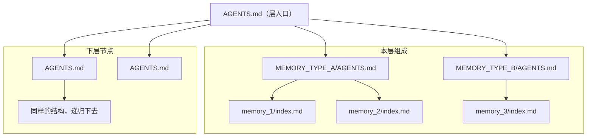

# 项目记忆协议

**记忆是一棵随项目目录结构生长的文件树**：每份记忆挂在某个目录上，管这个目录连同它的子树。

```mermaid
flowchart TD
    Root["AGENTS.md（层入口）"]

    subgraph localMem [本层组成]
        EntryA["MEMORY_TYPE_A/AGENTS.md"]
        EntryB["MEMORY_TYPE_B/AGENTS.md"]
        MemA1["memory_1/index.md"]
        MemA2["memory_2/index.md"]
        MemB1["memory_3/index.md"]
        EntryA --> MemA1
        EntryA --> MemA2
        EntryB --> MemB1
    end

    subgraph children [下层节点]
        Sub1["AGENTS.md"]
        Sub2["AGENTS.md"]
        Dots["同样的结构，递归下去"]
        Sub1 --> Dots
    end

    Root --> EntryA
    Root --> EntryB
    Root --> Sub1
    Root --> Sub2
```

**协议就是这张图。** 这份文件是冻结的，改它意味着所有 skill 跟着改；改实现不用碰它，见 [`LAYOUT.md`](LAYOUT.md)。

## `AGENTS.md` — 本层入口

- `AGENTS.md` 是**本层入口**。里面有三类东西：本层硬约束、本层组成、下层节点。
- **本层硬约束**直接写在入口里：不检索就会做错事的规则，不进记忆文件，也不链到记忆文件。加载这份入口时已经在上下文里，读到就遵守。
- 本层组成和下层节点仍是索引：仅含地址和描述，不含具体记忆内容。不平铺整棵树——顺着下层边一层层跳，就能走遍。
- 两层入口都一样：**按描述挑下一跳**，不要把一层整个拉进来。硬约束不是索引，没有下一跳。
- 树是稀疏的：真实目录中可读的 `AGENTS.md` 都是同一种节点，不以标记或独立目标、决策、验证责任作为资格门槛。类型入口、业务入口与普通入口使用相同的三类内容模型，可只呈现实际需要的部分；不要求空标题或初始化所有模块。本层边和下层边由入口登记，物理容器可跨层直达，引用不改变物理 parent；parent 是最近祖先 AGENTS，harness 是独立维护关系。
- 一份 `AGENTS.md` 管它所在的目录连同整棵子树，越深越窄。下层是对上层的**补充**而不是覆盖：写按作用范围选一层，读把相关的各层叠加。
- 它是共享文件：工具只拥有自己用标记划出的区域，区块之外的正文一律保留，重复执行只刷新区块内。硬约束区块的正文由人写，工具只保证区块存在，不覆盖已有规则。

## `MEMORY_TYPE_*/AGENTS.md` — 本层不同类型记忆入口

- `MEMORY_TYPE_*/AGENTS.md` 是**本层不同类型的记忆入口**：位于该类型的内容目录下，文件名是 `AGENTS.md`，仅含该类型的索引地址和描述，不含具体记忆内容。
- 它是同一种节点的类型索引用途：条目属于本层索引，可用稀疏形式呈现；类型身份与写权限仍由已采用的内容契约决定，不因有 `AGENTS.md` 就自动采用 Memory。
- 每个 `type` 一份，只列该类型的记忆文件——一条记忆归在哪份入口下，就是它的 `type`。所以层入口 `AGENTS.md` 到本层任一条记忆**固定两跳**。

## `memory_*/index.md` — 详细记忆内容

- `memory_*/index.md` 是**详细记忆内容**，一条记忆一个目录，入口是 index.md，附件与递归 harness 随目录生命周期移动，形态是「YAML frontmatter + markdown 正文」；其他入口也可按自身合同使用 frontmatter。
- 必需字段只有 `description`：就是入口里那句说明，同一个东西的两个位置。
- 另有三个可选、含义固定的保留键。不写不影响合规，写了必须是这个意思：
  - `name`：内容目录名，缺了就从目录名推。
  - `type`：这条记忆的分类，也就是它归在哪份入口下。
  - `updatedAt`：最后一次更新的时间。

## 边界

图上和小节标题里的名字、数量都是示意。标记名、有哪些 `type`、类型内容目录叫什么、上面没列的字段，都属于实现，会随版本变——**按实际读到的内容走**，看不到这个形状就当项目还没建记忆。类型入口的文件名是 `AGENTS.md`、存在类型内容目录下，这是形状，不是某个具体 type 的名字。

破协议就是破坏图上的形状：

- 记忆平铺在某一层，或 `AGENTS.md` 不列直接下层、断掉递归。
- 层目录或类型内容目录的入口不再是 `AGENTS.md`。
- 抽掉记忆入口这一层，记忆文件直接挂在层入口 `AGENTS.md` 下。
- 混淆本层内容与下层节点的登记归属，或把引用误当成 Memory 写权限。
- 把可检索的记忆内容塞进 `AGENTS.md` 的索引区块或记忆入口。
- 把本层硬约束只写进记忆文件，让它必须靠检索才能看见。
- 下层记忆覆盖上层，而不是补充。

物理容器可跨层直达，不要求逐目录建立中转入口。引用改变发现路径，不改变正文归属、写权限或适用的祖先硬约束；引用来源的全部规则不因此扩散给调用方。
