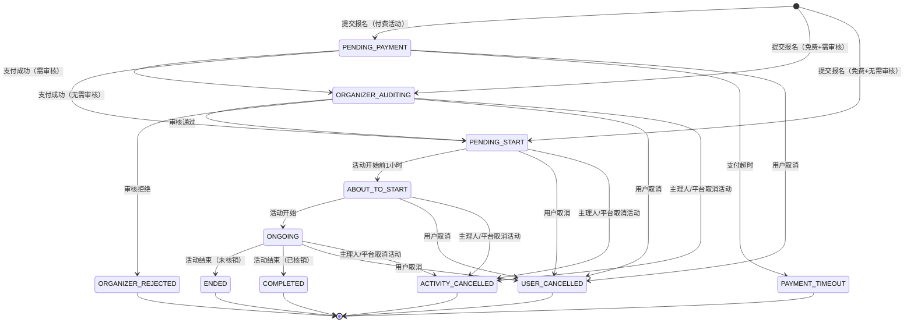
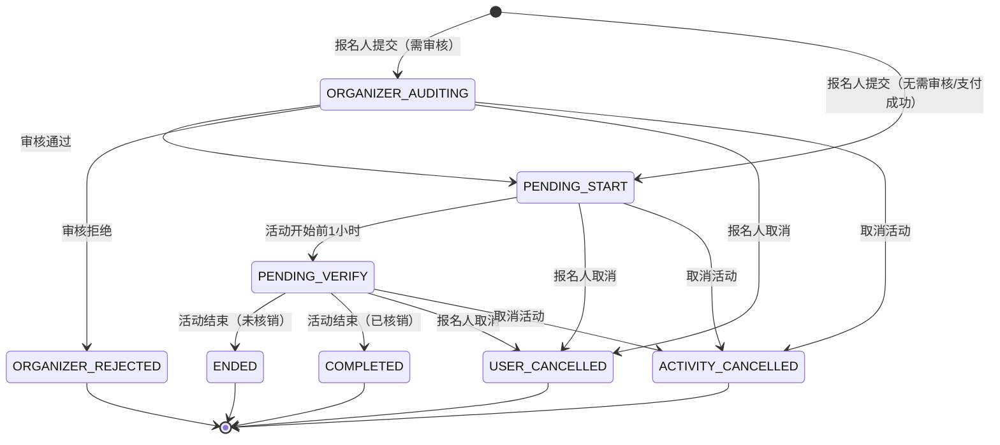
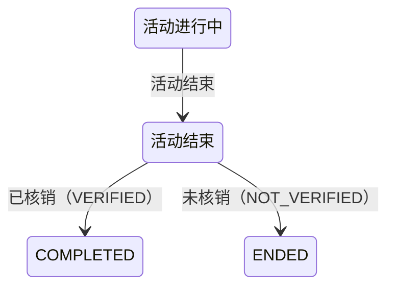

# 报名展示状态机（RegistrationDisplayStatus）

## 1. 概述

报名展示状态（`RegistrationDisplayStatus`）是面向用户的**派生状态**，由底层三个维度实时计算得出：

- `RegistrationStatus`（报名状态，11 种）
- `VerifyStatus`（核销状态，2 种）
- `isOrganizer`（是否主理人视角）

展示状态本身没有独立的流转规则，流转完全由底层 `RegistrationStatus` 的状态机驱动。

代码位置：`bifrostim-interaction/.../registration/enums/RegistrationDisplayStatus.java`

## 2. 展示状态枚举

| 展示状态               | 主理人 desc | 主理人 subDesc | 报名人 desc | 报名人 subDesc |
| ------------------ | -------- | ----------- | -------- | ----------- |
| PENDING_PAYMENT    | （不展示）    |             | 待付款      | 请在规定时间内完成付款 |
| ORGANIZER_AUDITING | 报名待审核    |             | 报名审核中    |             |
| ORGANIZER_REJECTED | 报名已拒绝    |             | 报名未通过    |             |
| PENDING_START      | 待开始      |             | 待开始      |             |
| ABOUT_TO_START     | （不使用）    |             | 即将开始     |             |
| ONGOING            | （不使用）    |             | 进行中      |             |
| PENDING_VERIFY     | 待验票      | 请在活动现场验票    | （不使用）    |             |
| ENDED              | 已结束      |             | 已结束      |             |
| COMPLETED          | 已完成      |             | 已完成      |             |
| PAYMENT_TIMEOUT    | 报名已取消    | 支付超时,订单关闭   | 报名已取消    | 支付超时,订单关闭   |
| USER_CANCELLED     | 报名已取消    |             | 报名已取消    |             |
| ACTIVITY_CANCELLED | 活动已取消    |             | 活动已取消    |             |

## 3. 映射规则

| RegistrationStatus | VerifyStatus | 报名人展示状态 | 主理人展示状态 |
|---|---|---|---|
| PENDING_PAYMENT | - | PENDING_PAYMENT | （不展示） |
| PAYMENT_TIMEOUT | - | PAYMENT_TIMEOUT | （不展示） |
| ORGANIZER_AUDITING | - | ORGANIZER_AUDITING | ORGANIZER_AUDITING |
| ORGANIZER_REJECTED | - | ORGANIZER_REJECTED | ORGANIZER_REJECTED |
| PENDING_START | - | PENDING_START | PENDING_START |
| ABOUT_TO_START | - | ABOUT_TO_START | **PENDING_VERIFY** |
| ONGOING | - | ONGOING | **PENDING_VERIFY** |
| ENDED | NOT_VERIFIED | ENDED | ENDED |
| ENDED | VERIFIED | **COMPLETED** | **COMPLETED** |
| USER_CANCELLED | - | USER_CANCELLED | USER_CANCELLED |
| ORGANIZER_CANCELLED | - | ACTIVITY_CANCELLED | ACTIVITY_CANCELLED |
| PLATFORM_CANCELLED | - | ACTIVITY_CANCELLED | ACTIVITY_CANCELLED |

关键差异：
- 主理人视角下 ABOUT_TO_START 和 ONGOING 合并为 **PENDING_VERIFY**（待验票）
- 活动结束后根据核销状态区分 **ENDED**（未核销）和 **COMPLETED**（已核销）
- ORGANIZER_CANCELLED 和 PLATFORM_CANCELLED 合并为 **ACTIVITY_CANCELLED**

## 4. 展示状态流转图

### 4.1 报名人视角

### 4.2 主理人视角

> 主理人看不到 PENDING_PAYMENT 和 PAYMENT_TIMEOUT 状态的报名。

## 5. 核销对展示状态的影响

核销（Verify）是独立于报名状态的正交维度，仅影响活动结束后的展示状态分叉：

- 核销时机：ABOUT_TO_START 或 ONGOING 期间可核销
- 核销不改变 RegistrationStatus，只改变 VerifyStatus
- 活动结束时，RegistrationStatus 统一变为 ENDED，展示状态根据 VerifyStatus 分叉

## 6. 终态汇总

| 终态 | 含义 | 两个视角都可见？ |
|------|------|---------------|
| PAYMENT_TIMEOUT | 支付超时 | 仅报名人 |
| ORGANIZER_REJECTED | 审核拒绝 | 是 |
| ENDED | 活动结束（未核销） | 是 |
| COMPLETED | 活动结束（已核销） | 是 |
| USER_CANCELLED | 用户取消 | 是 |
| ACTIVITY_CANCELLED | 活动取消（主理人或平台） | 是 |
