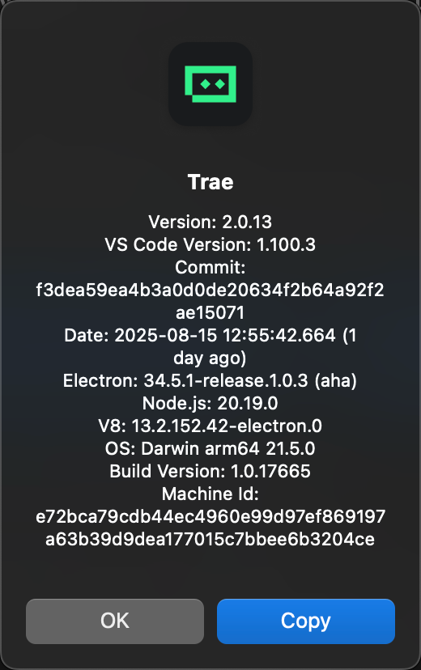

# VS Code 插件开发

- [新建项目](#%E6%96%B0%E5%BB%BA%E9%A1%B9%E7%9B%AE)
- [开发项目](#%E5%BC%80%E5%8F%91%E9%A1%B9%E7%9B%AE)
  * [基本概念](#%E5%9F%BA%E6%9C%AC%E6%A6%82%E5%BF%B5)
  * [纯命令行插件](#%E7%BA%AF%E5%91%BD%E4%BB%A4%E8%A1%8C%E6%8F%92%E4%BB%B6)
  * [带UI的插件](#%E5%B8%A6ui%E7%9A%84%E6%8F%92%E4%BB%B6)

---

<https://code.visualstudio.com/api/get-started/your-first-extension>

<https://github.com/VirusPC/agent-vsix>

## 新建项目

```bash
npx --package yo --package generator-code -- yo code
```

注意：

1. vs code版本兼容性，如果插件与目标版本不兼容，需要修改package.json中的engines字段。Trae的兼容性情况如下：
   1. 
2. 通过在`src/extension.ts`文件运行debug，来判断项目是否新建成功。若成功会打开一个Extension Development Host窗口，并且command pallette可以多出 Hello Word 命令。

## 开发项目

### 基本概念

Understanding these three concepts is crucial to writing extensions in VS Code:

* [<font style="color:rgb(77, 170, 252);background-color:rgb(13, 17, 23);">Activation Events</font>](https://code.visualstudio.com/api/references/activation-events): events upon which your extension becomes active.
* [<font style="color:rgb(77, 170, 252);background-color:rgb(13, 17, 23);">Contribution Points</font>](https://code.visualstudio.com/api/references/contribution-points): static declarations that you make in the <code><font style="color:rgb(204, 204, 204);background-color:rgba(255, 255, 255, 0.15);">package.json</font></code> [<font style="color:rgb(77, 170, 252);background-color:rgb(13, 17, 23);">Extension Manifest</font>](https://code.visualstudio.com/api/get-started/extension-anatomy#extension-manifest) to extend VS Code. Contribute points allow extension developers to add custom functionality to VS Code, such as commands, settings, menus, themes, snippets, etc.
* [<font style="color:rgb(77, 170, 252);background-color:rgb(13, 17, 23);">VS Code API</font>](https://code.visualstudio.com/api/references/vscode-api): a set of JavaScript APIs that you can invoke in your extension code.

事件 + 扩展能力 + 调用API

### 纯命令行插件

1. The <code><font style="color:rgb(204, 204, 204);background-color:rgba(255, 255, 255, 0.15);">Hello World</font></code> extension does 3 things:
2. **事件**：Registers the [<font style="color:rgb(77, 170, 252);background-color:rgb(13, 17, 23);">onCommand</font>](https://code.visualstudio.com/api/references/activation-events#onCommand) [<font style="color:rgb(77, 170, 252);background-color:rgb(13, 17, 23);">Activation Event</font>](https://code.visualstudio.com/api/references/activation-events): <code><font style="color:rgb(204, 204, 204);background-color:rgba(255, 255, 255, 0.15);">onCommand:helloworld.helloWorld</font></code>, so the extension becomes activated when user runs the <code><font style="color:rgb(204, 204, 204);background-color:rgba(255, 255, 255, 0.15);">Hello World</font></code> command.
   1. Note: Starting with [<font style="color:rgb(77, 170, 252);background-color:rgb(13, 17, 23);">VS Code 1.74.0</font>](https://code.visualstudio.com/updates/v1_74#_implicit-activation-events-for-declared-extension-contributions), commands declared in the <code><font style="color:rgb(204, 204, 204);background-color:rgba(255, 255, 255, 0.15);">commands</font></code> section of <code><font style="color:rgb(204, 204, 204);background-color:rgba(255, 255, 255, 0.15);">package.json</font></code> automatically activate the extension when invoked, without requiring an explicit <code><font style="color:rgb(204, 204, 204);background-color:rgba(255, 255, 255, 0.15);">onCommand</font></code> entry in <code><font style="color:rgb(204, 204, 204);background-color:rgba(255, 255, 255, 0.15);">activationEvents</font></code>.
3. **扩展能力**：Uses the [<font style="color:rgb(77, 170, 252);background-color:rgb(13, 17, 23);">contributes.commands</font>](https://code.visualstudio.com/api/references/contribution-points#contributes.commands) [<font style="color:rgb(77, 170, 252);background-color:rgb(13, 17, 23);">Contribution Point</font>](https://code.visualstudio.com/api/references/contribution-points) to make the command <code><font style="color:rgb(204, 204, 204);background-color:rgba(255, 255, 255, 0.15);">Hello World</font></code> available in the Command Palette, and bind it to a command ID <code><font style="color:rgb(204, 204, 204);background-color:rgba(255, 255, 255, 0.15);">helloworld.helloWorld</font></code>.
4. **调用API**：Uses the [<font style="color:rgb(77, 170, 252);background-color:rgb(13, 17, 23);">commands.registerCommand</font>](https://code.visualstudio.com/api/references/vscode-api#commands.registerCommand) [<font style="color:rgb(77, 170, 252);background-color:rgb(13, 17, 23);">VS Code API</font>](https://code.visualstudio.com/api/references/vscode-api) to bind a function to the registered command ID <code><font style="color:rgb(204, 204, 204);background-color:rgba(255, 255, 255, 0.15);">helloworld.helloWorld</font></code>.

### 带UI的插件

<https://code.visualstudio.com/api/ux-guidelines/overview>

特别注意下 sidebar的开发：<https://code.visualstudio.com/api/ux-guidelines/sidebars>


> 更新: 2025-08-16 07:54:59  
> 原文: <https://www.yuque.com/viruspc/el3mi0/semi3b6xvlqoeb9c>