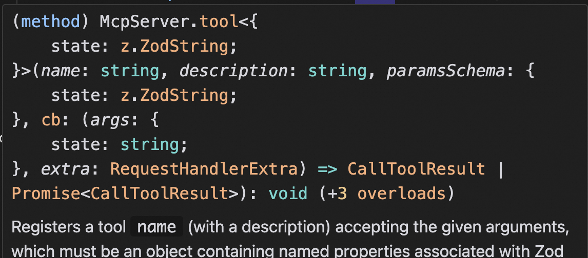
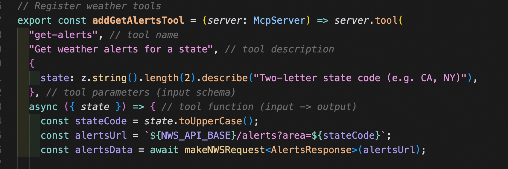
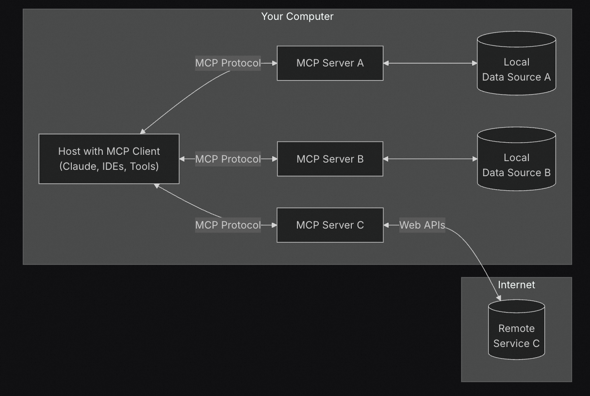

# Function Calling / CodeAct / MCP/A2A

- [Function Calling](#function-calling)
  * [场景：查询当前天气](#%E5%9C%BA%E6%99%AF%E6%9F%A5%E8%AF%A2%E5%BD%93%E5%89%8D%E5%A4%A9%E6%B0%94)
- [CodeAct](#codeact)
- [MCP](#mcp)
- [MCP VS Function Calling](#mcp-vs-function-calling)
- [A2A](#a2a)
  * [**核心概念与设计原则**](#%E6%A0%B8%E5%BF%83%E6%A6%82%E5%BF%B5%E4%B8%8E%E8%AE%BE%E8%AE%A1%E5%8E%9F%E5%88%99)
  * [**工作原理**](#%E5%B7%A5%E4%BD%9C%E5%8E%9F%E7%90%86)
  * [**应用场景**](#%E5%BA%94%E7%94%A8%E5%9C%BA%E6%99%AF)
  * [**与MCP协议的关系**](#%E4%B8%8Emcp%E5%8D%8F%E8%AE%AE%E7%9A%84%E5%85%B3%E7%B3%BB)
  * [**生态支持**](#%E7%94%9F%E6%80%81%E6%94%AF%E6%8C%81)
- [技巧](#%E6%8A%80%E5%B7%A7)
  * [Best practices for defining tools[#](https://blog.logto.io/what-is-mcp#best-practices-for-defining-tools)](#best-practices-for-defining-tools%23httpsbloglogtoiowhat-is-mcp%23best-practices-for-defining-tools)
- [参考资料](#%E5%8F%82%E8%80%83%E8%B5%84%E6%96%99)

---

## Function Calling

问题：

传统的LLM只能生成文本，无法直接执行复杂的计算、查询数据库、调用API或与外部系统交互。这种限制使得模型在处理需要外部信息或操作的任务时显得无力。

解决方案：

引入 Function Calling，模型可以识别任务，并主动调用外部的函数或API完成特定的操作。Function Calling 的 核心是将 LLM 的生成/工具选择能力与外部工具的执行能力结合起来，从而实现更复杂和动态的任务处理。

使用，分两步：

1. 第一步，LLM根据用户意图选择tool并生成结构化参数。将prompt和tools传给llm，llm理解用户意图、选择tool并生成调用该tool所需的arguments。
2. 第二步，工具调用。用选择的tool和arguments，调用一些本地工具或系统功能。

原理：虽然并非所有function calling实现都直接依赖chat template，但在许多实际应用场景中，chat template被用来引导模型生成符合函数调用要求的结构化输出，或规范对话流程。

特点总结：

3. **解耦模型与工具**：
   * LLM 只负责选择工具和生成参数，不直接执行任务。
   * 工具调用和执行由外部系统完成。
4. **结构化交互**：
   * LLM 生成的工具调用请求通常是结构化的（如 JSON），便于解析和执行。
5. **灵活性**：
   * 工具可以是本地函数、API、数据库查询等，功能扩展性强。
6. **动态性**：
   * LLM 可以根据用户需求动态选择工具并生成合适的参数。

### 场景：查询当前天气

1. **第一步：与 LLM 的交互**
   * 输入：

```plain
用户：请告诉我北京的天气。
```

```
    * 提供给 LLM 的工具列表：
```

```json
[
  {
    "name": "get_weather",
    "description": "查询指定城市的天气信息",
    "parameters": {
      "city": "string"
    }
  }
]
```

```
- LLM 输出：
```

```json
{
  "tool": "get_weather",
  "arguments": {
    "city": "北京"
  }
}
```

2. **第二步：工具调用**
   * 根据返回的工具名称 `get_weather` 和参数 `{"city": "北京"}`，调用本地的天气查询 API。
   * 工具返回结果：

```json
{
  "city": "北京",
  "temperature": "18°C",
  "condition": "晴天"
}
```

3. **最终响应**：
   * 将工具返回的结果传回给用户：

```plain
北京的天气是晴天，温度为18°C。
```

***

## CodeAct

CodeAct是由UIUC和苹果的华人研究员提出的一种通用智能体框架，旨在通过可执行的Python代码统一LLM（大型语言模型）智能体的行动空间，从而提升其解决复杂任务的能力。

其核心思想是让LLM生成并执行Python代码作为与环境交互的行动方式，而非传统的JSON或文本指令。

## MCP

function calling 只关注第一步将prompt转为可执行指令的部分。mcp同时关注两步，更关注第二步执行的部分。

下图中，MCP SDK 将Function Calling中的两步整合为一个“tool”的概念：name + description +paramsSchema + callback







## MCP VS Function Calling

<font style="color:rgb(0, 0, 0);">While both function-calling and MCP are integral to bridging LLMs to enterprise systems, they address different challenges:</font>

<font style="color:rgb(0, 0, 0);">•</font><font style="color:rgb(0, 0, 0);"> </font>**<font style="color:rgb(0, 0, 0);">Function-calling</font>**<font style="color:rgb(0, 0, 0);"> </font><font style="color:rgb(0, 0, 0);">focuses on translating prompts into actionable instructions. It is LLM-driven and varies across vendors, with no universal standard yet.</font>

<font style="color:rgb(0, 0, 0);">•</font><font style="color:rgb(0, 0, 0);"> </font>**<font style="color:rgb(0, 0, 0);">MCP</font>**<font style="color:rgb(0, 0, 0);"> </font><font style="color:rgb(0, 0, 0);">standardizes the execution of those instructions, enabling scalability and interoperability across thousands of tools.</font>

<font style="color:rgb(0, 0, 0);"></font>

<font style="color:rgb(0, 0, 0);">The two phases together ensure that LLMs can not only interpret natural language prompts but also deliver meaningful results by leveraging enterprise tools.</font>

## A2A

### **核心概念与设计原则**

1. **设计原则**：
   * **拥抱Agent能力**：支持Agent以自然、非结构化的方式协作，而非将其限制为单一工具。
   * **基于现有标准**：采用HTTP、JSON-RPC、SSE（Server-Sent Events）等成熟技术，便于与企业现有IT系统集成。
   * **默认安全**：支持企业级身份验证（如OAuth、API密钥），确保通信安全。
   * **支持长时间任务**：可处理从即时任务到需数日协作的复杂流程，并实时反馈状态。
   * **多模态兼容**：支持文本、音频、视频、表单、iframe等交互形式。
2. **关键技术组件**：
   * **Agent Card**：\
     每个Agent需公开的元数据文件（JSON格式），描述其身份、能力、接口、认证要求及支持的交互模式。例如：
     * `name`: Agent名称（如“行程规划Agent”）。
     * `skills`: 具体功能（如“预订机票”“生成报告”）。
     * `capabilities`: 支持流式传输、推送通知等。
   * **任务（Task）管理**：\
     Agent间协作的核心单元，包含唯一ID、状态（创建/进行中/完成）、输入数据及输出工件（Artifact）。任务可同步或异步执行，支持长期状态跟踪。
   * **通信协议**：\
     通过HTTP或WebSocket实现：
     * **同步请求**：客户端发送任务，服务器返回结果（如`POST /tasks/send`）。
     * **流式传输**：对长期任务，使用SSE推送状态更新（如`POST /tasks/sendSubscribe`）。
   * **用户体验协商**：\
     消息包含“部分”（Parts），明确内容类型（如文本、图像），允许Agent动态协商格式（如网页表单或视频流）。

***

### **工作原理**

1. **能力发现**：\
   客户端通过HTTP请求获取远程Agent的Agent Card（如`GET /.well-known/agent.json`），识别其能力。
2. **任务分发与执行**：
   * 客户端Agent将任务发送给远程Agent，定义输入数据及期望输出。
   * 远程Agent执行任务并生成工件（如报告、图像），通过消息传递结果。
3. **协作与反馈**：
   * Agent间可交换上下文、指令或工件，支持多轮交互。
   * 对长期任务，服务器通过SSE或Webhook推送进度更新。

***

### **应用场景**

* **企业级自动化**：\
  例如，财务Agent与供应链Agent协作完成采购审批，无需人工干预。
* **多Agent协同**：\
  用户请求“策划旅行”时，行程规划Agent、酒店预订Agent和天气Agent可自动协作。
* **跨平台集成**：\
  企业内部Salesforce、MongoDB等系统Agent通过A2A共享数据，优化工作流。

***

### **与MCP协议的关系**

* **互补性**：
  * **MCP（Model Context Protocol）**：由Anthropic提出，解决Agent与外部工具/资源的标准化交互问题（如调用API）。
  * **A2A**：聚焦Agent间协作，允许跨供应商/框架的智能体直接对话。
* **协同使用**：\
  复杂系统中，Agent可能同时使用MCP调用工具，同时通过A2A协调其他Agent。

***

### **生态支持**

A2A已获Salesforce、SAP、ServiceNow等50+企业支持，目标成为AI生态的“WTO”，推动开放协作。其开源实现（GitHub）提供代码示例及工具链，加速开发者落地。

## 技巧

简单来说：

1. 清晰的tool description，可以帮助 LLM 选择合适的 tool
2. 参数校验，有助于整个系统的稳健
3. 有意义的错误处理，提升用户体验 且 有助于整个系统的稳健
4. 数据访问控制：注意权限管理 和 安全隐私

### Best practices for defining tools[#](https://blog.logto.io/what-is-mcp#best-practices-for-defining-tools)

When building such tools, you can follow these best practices:

* **Clear descriptions**: Provide detailed, accurate descriptions for each tool, clearly stating its functionality, applicable scenarios, and limitations. This not only helps the LLM choose the right tool but also makes it easier for developers to understand and maintain the code.
* **Parameter validation**: Use Zod or similar libraries to strictly validate input parameters, ensuring correct types, reasonable value ranges, and rejecting non-compliant inputs. This prevents errors from propagating to backend systems and improves overall stability.
* **Error handling**: Implement comprehensive error handling strategies, catch possible exceptions, and return user-friendly error messages. This improves user experience and allows the LLM to provide meaningful responses based on error conditions, rather than simply failing.
* **Data access control**: Ensure backend resource APIs have robust authentication and authorization mechanisms, and carefully design permission scopes to limit the MCP Server to only accessing and returning data the user is authorized for. This prevents sensitive information leaks and ensures data security.

## 参考资料

<https://blog.logto.io/what-is-mcp>

<https://www.explainthis.io/zh-hant/ai/function-calling>

<https://www.gentoro.com/blog/function-calling-vs-model-context-protocol-mcp>


> 更新: 2025-04-17 12:33:49  
> 原文: <https://www.yuque.com/viruspc/el3mi0/qf69uhbxrq4318rt>