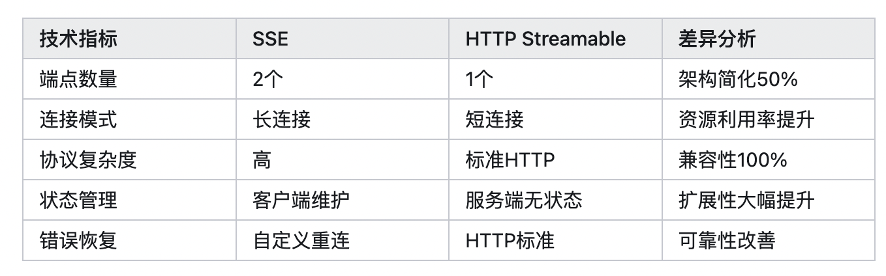
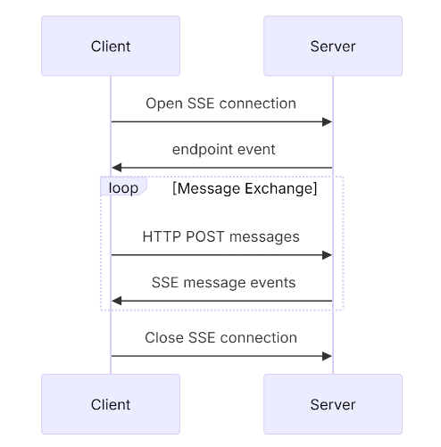
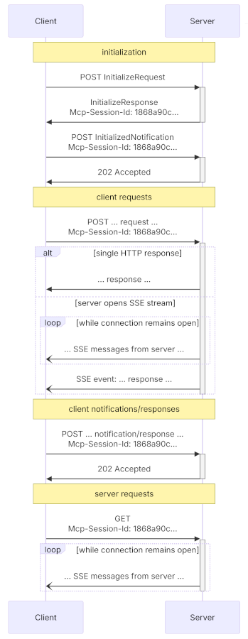

# Streamable HTTP VS SSE in MCP

- [Background](#background)
- [Why](#why)
- [Benefits](#benefits)
- [SSE (Server-Sent Events)](#sse-server-sent-events)
- [Streamable HTTP](#streamable-http)
- [Summary](#summary)
- [References](#references)

---

SSE存在的问题：

* **服务器必须维护长连接（Stateful）**。在高并发情况下会导致显著的资源消耗。（在整个 connection 的生命周期中，MCP Server 需要一直保持着这个 SSE 连接，Stateful）
* **服务器消息只能通过 SSE 传递**。造成了不必要的复杂性和开销。
* **基础架构兼容性**。架构实现复杂。许多现有的网络基础架构可能无法正确处理长期的 SSE 连接。企业防火墙可能会强制终止超时连接，导致服务不可靠

Streamable如何结局：

* Streamable HTTP 相比 HTTP + SSE 具有更好的稳定性，在高并发场景下表现更优。
* Streamable HTTP 在**性能**方面相比 HTTP + SSE 具有明显优势，响应时间更短且更稳定。
* Streamable HTTP 客户端实现相比 HTTP + SSE 更简单，代码量更少，**维护成本**更低。

### Background

Those specialized transport layers are necessary because traditional HTTP’s request-response model is inefficient for real-time AI communication. That is because plain **HTTP introduces high overhead and latency** due to frequent connection setups. In contrast, MCP requires continuous, low-latency data streams—something HTTP+SSE and Streamable HTTP are designed to handle.

### Why

MCP initially used HTTP+SSE to enable server-to-client streaming in remote scenarios. However, these [three major limitations](https://github.com/modelcontextprotocol/modelcontextprotocol/pull/206) justified the change:

* No support for resumable streams.
* Requires the server to maintain a long-lived, highly available connection.
* Only allows server messages to be delivered via SSE.

Streamable HTTP addresses those issues. It enables stateless communication and even supports on-demand upgrades to SSE. That improves compatibility with modern infrastructure and guarantees more stable and efficient communication.

### Benefits

* **Stateless servers are now possible**—eliminating the requirement for high availability long-lived connections
* **Plain HTTP implementation**—MCP can be implemented in a plain HTTP server without requiring SSE
* **Infrastructure compatibility**—it's "just HTTP," ensuring compatibility with middleware and infrastructure
* **Backwards compatibility**—this is an incremental evolution of our current transport
* **Flexible upgrade path**—servers can choose to use SSE for streaming responses when needed

### SSE (Server-Sent Events)

**SSE (Server-Sent Events) **is a mechanism that allows web clients to receive automatic updates from a server. Those updates are known as “events,” and are sent over a single, long-lived HTTP connection.

Unlike WebSockets, SSE is unidirectional, meaning that data flows only from the server to the client. SSE works by the server sending a stream of events over this open connection, typically formatted as text/event-streamMIME type.

The server must provide two endpoints:

* An SSE GET endpoint for clients to establish a connection and receive messages from the server.
* A regular HTTP POST endpoint for clients to send JSON-RPC messages to the server.

有点像https，https也是分两次。https从上往下：应用层http，加密层tls/ssl，传输层TCP。先通过TLS/SSL协议握手来建立安全连接，传入对称加密密钥；再。

PS：https是http的一种实现方式（http补充了tls/ssl层，但请求方法和数据格式没变），sse是基于http的一种独立的协议（定义了自己的通信规则和行为）。

When a client connects, the server must send an endpoint event containing a URI that the client will use to send messages.\*\* All client JSON-RPC messages are then sent as HTTP POST requests to this URI. \*\*服务端需要返回一个URI。

These are the main pros and cons of using SSE in MCP:\ 👍 **Streaming large results**: Allows sending partial results immediately, avoiding delays while MCP tools process large data or wait for external API responses.\ 👍 **Event-driven triggers**: Supports unsolicited server events to notify clients about changes, with alerts or status updates.\ 👍 **Simplicity**: Uses standard HTTP, requiring no special protocols or complex setup.

👎 **Unidirectional only**: Data can only flow from servers to clients in the SSE channel. Clients must use separate HTTP POST requests for sending messages.\ 👎 **Long-lived connection resource use**: Maintaining open connections can consume a lot of server resources, especially at scale.

OpenAI 之所以选择 SSE，而非 WebSocket，是因为 SSE 的技术特点刚好可以契合流式应答的需求：客户端与大模型的交互是一次性的，每产生一个 token，服务端就可以给客户端推送一次，当生成内容结束时，断掉连接，**无需考虑客户端的存活情况**。

如果采用 WebSocket 的话，服务端就需要维护的连接比较复杂，像 OpenAI 这样的服务体量，维护连接就会造成很大的服务器压力，而且，在生成内容场景下，也没有向服务端进一步发送内容，WebSocket 的双向通信在这里也是多余的。

### Streamable HTTP

ℹ️ **Extra**: Why streamable HTTP + optional SSE instead of WebSockets?

1. Using WebSockets for simple, stateless RPC calls adds unnecessary network and operational overhead.
2. Browsers cannot attach headers like <code>Authorization</code> to WebSockets, and unlike SSE, WebSockets cannot be reimplemented with standard HTTP tools.
3. [WebSocket upgrades](https://developer.mozilla.org/en-US/docs/Web/HTTP/Guides/Protocol_upgrade_mechanism) only work with GET requests, making POST-based flows complex and slower due to required upgrade steps.

无状态问题、Authorization问题、POST请求问题

 It uses standard HTTP POST and GET requests for communication.

These are the key advantages of using Streamable HTTP in MCP:\ 👍 **Stateless servers supported**: Removes the need for always-on, long-lived connections.\ 👍 **Plain HTTP**: Can be implemented using any standard HTTP server without requiring SSE.\ 👍 **Infrastructure-friendly**: Compatible with common HTTP middleware, [proxies](https://brightdata.com/blog/proxy-101/what-is-proxy-server), and hosting platforms.\ 👍 **Backward compatible**: Builds incrementally on the previous HTTP+SSE transport.\ 👍 **Optional streaming**: Servers can upgrade to SSE for streaming responses when needed.

### Summary

| **Aspect** | **HTTP+SSE** | **Streamable HTTP** |
| --- | --- | --- |
| **Communication type** | Unidirectional (Server → Client) | **Bidirectional\*\*\*\* **(Client ↔ Server via GET/POST) |
| **HTTP protocol usage** | GET for streaming, separate POST for client messages | Uses **standard HTTP** **POST and GET** from a single endpoint |
| **Statefulness** | Stateful | **Stateful, but supports stateless servers** |
| **Requires long-lived HTTP connection** | Yes | **No** |
| **High availability required** | Yes, for connection persistence | No, works with stateless or ephemeral servers |
| **Scalability** | Limited | High |
| **Streaming support** | Yes (via <code>text/event-stream</code> ) | Yes (via SSE as optional enhancement) |
| **Authentication support** | Yes | Yes |
| **Support for resumability and redelivery** | No | No |
| **Number of clients** | Multiple | Multiple |
| **Usage in MCP** | Deprecated since protocol version <code>2025-03-26</code> | Introduced in protocol version <code>2025-03-26</code> |
| **Backward Compatibility** | — | Fully backward compatible with SSE-based c |

### References

* <https://brightdata.com/blog/ai/sse-vs-streamable-http>
* <https://github.com/modelcontextprotocol/modelcontextprotocol/pull/206>
* https://zhuanlan.zhihu.com/p/1900195324611499288
* ⚡ MCP协议进化论：HTTP Streamable凭什么让Anthropic果断抛弃SSE？ - 许宏斌的文章 - 知乎

<https://zhuanlan.zhihu.com/p/1911471559861841962>

> 更新: 2025-08-09 13:32:13  
> 原文: <https://www.yuque.com/viruspc/el3mi0/rowhkuldpmrpuvea>