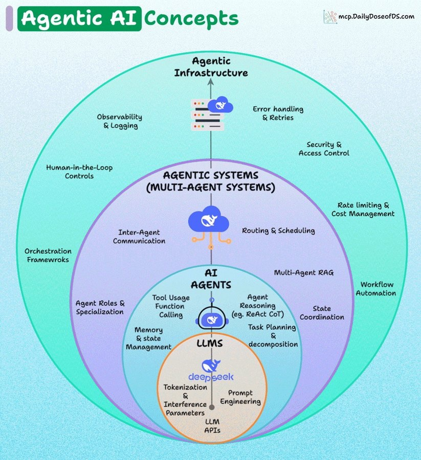

# key Agentic AI concepts

[https://x.com/akshay_pachaar/status/1975540193584370048?s=46](https://x.com/akshay_pachaar/status/1975540193584370048?s=46)

A layered overview of key Agentic AI concepts.

Let's understand it step-by-step:

1️⃣ LLMs (the foundation layer)

At the core, you have LLMs like GPT, DeepSeek, etc.

Core ideas:

+ Tokenization & inference: how text is processed by the model
+ Prompt engineering: designing inputs for better outputs
+ LLM APIs: programmatic interfaces to interact with models

This is the engine that powers everything else.

2️⃣ AI Agents (built on LLMs)

Agents wrap around LLMs to enable autonomous action.

Key responsibilities:

+ Tool usage & function calling: connecting LLMs to external APIs/tools
+ Agent reasoning: methods like ReAct or Chain-of-Thought
+ Task planning: breaking big tasks into smaller ones
+ Memory management: tracking history, context, and long-term info

Agents make LLMs useful in real-world workflows.

3️⃣ Agentic systems (multi-agent)

Multiple agents working together create agentic systems.

Features:

+ Inter-agent communication: agents coordinating via protocols like ACP, A2A
+ Routing & scheduling: deciding which agent handles what and when
+ State coordination: ensuring consistency across collaborating agents
+ Multi-agent RAG: retrieval-augmented generation across agents
+ Agent specialization: unique roles and purposes per agent
+ Orchestration frameworks: tools like CrewAI to build workflows

This layer enables collaboration and coordination.

4️⃣ Agentic Infrastructure

The top layer ensures robustness, scalability, and safety.

This includes:

+ Observability & logging: tracking performance using frameworks like @Cometml's Opik
+ Error handling & retries: resilience against failures
+ Security & access control: preventing agents from overstepping
+ Rate limiting & cost management: controlling resource usage
+ Workflow automation: integrating agents into broader pipelines
+ Human-in-the-loop: allowing human oversight and intervention

This layer ensures trust and scalability for production environments.

Agentic AI is a stacked architecture where each layer adds reliability, coordination, and governance over the ones below.

What else would you add here?

---

If you found it insightful, reshare with your network.

Find me → @akshay_pachaar ✔️  
For more insights and tutorials on LLMs, AI Agents, and Machine Learning!

> 更新: 2025-10-07 15:50:44  
> 原文: <https://www.yuque.com/viruspc/el3mi0/toy0hb2i44l4lsuz>