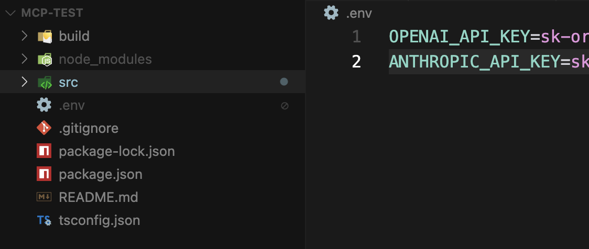

# OpenAI API

- [基本使用](#%E5%9F%BA%E6%9C%AC%E4%BD%BF%E7%94%A8)
  * [命令行](#%E5%91%BD%E4%BB%A4%E8%A1%8C)
  * [typescript](#typescript)
  * [api key 的存放](#api-key-%E7%9A%84%E5%AD%98%E6%94%BE)
- [参数](#%E5%8F%82%E6%95%B0)

---

## 基本使用

### 命令行

```bash
curl https://api.openai.com/v1/chat/completions
-H "Content-Type: application/json"
-H "Authorization: Bearer $OPENAI_API_KEY"
-d '{
        "model": "gpt-4o",
        "messages": [
            {"role": "user", "content": "写一首关于AI的诗"}
        ]
    }'
```

### typescript

结合了下mcp <https://github.com/VirusPC/mcp-test>

```typescript
const messages: ChatCompletionMessageParam[] = [
  {role: 'system', 'content': 'You are a weather assistant.'},
  {
    role: "user",
    content: query,
  },
];
// 将MCP工具转换为OpenAI工具
const openaiTools: ChatCompletionTool[] = this.tools.map(t => ({
  type: 'function',
  function: {
    name: t.name,
    description: t.description,
    parameters: t.input_schema,
  } as FunctionDefinition
}));
const response = await this.openai.chat.completions.create({
  model: MODEL, //"openai/gpt-4o-mini",
  store: true,
  max_tokens: 1000,
  tools: openaiTools,
  messages,
  n: 1,
});
```

### api key 的存放

一般放到环境变量。前端项目放到项目根目录下的`/.env`文件中（注意吧env文件放到`.gitignore`中）。



## 参数

1. 基本对话参数：model、messages、max\_tokens、<font style="color:rgb(51, 51, 51);">temperature、stream</font>
2. <font style="color:rgb(51, 51, 51);">工程参数：</font>
   1. <font style="color:rgb(51, 51, 51);">user，终端用户标识，它是我们作为开发者提供给 OpenAI 的，主要就是用作监控和检测 API 的滥用，监控粒度就到了个体上。</font>
   2. <font style="color:rgb(51, 51, 51);">n，为每条输入消息生成多少个回复。虽然看上去可以生成更多内容，但生成内容要计费，所以，如果没有特别需求，就不要额外设置这个参数。</font>
   3. <font style="color:rgb(51, 51, 51);">response\_format，应答格式。缺省情况下，这个接口只生成文本内容。但对开发来说，我们经常会用到 JSON 格式。我们当然可以用提示词要求大模型返回，也可以通过设置 response\_format 让 API 直接返回 JSON 格式，具体做法可以参考 OpenAI 的</font>[结构化输出](https://platform.openai.com/docs/guides/structured-outputs/introduction)<font style="color:rgb(51, 51, 51);">。</font>
      1. <font style="color:#DF2A3F;">Function Calling 格式化提问的入参：模型负责生成符合函数接口的参数，确保函数能够正确执行。</font>
      2. <font style="color:#DF2A3F;">Text-Format 格式化回答的返回值：模型负责将函数返回的结果转化为用户指定的格式（如 JSON、Markdown、自然语言等）。</font>

```typescript
import OpenAI from "openai";
import { zodTextFormat } from "openai/helpers/zod";
import { z } from "zod";

const openai = new OpenAI();

const CalendarEvent = z.object({
  name: z.string(),
  date: z.string(),
  participants: z.array(z.string()),
});

const response = await openai.responses.parse({
  model: "gpt-4o-2024-08-06",
  input: [
    { role: "system", content: "Extract the event information." },
    {
      role: "user",
      content: "Alice and Bob are going to a science fair on Friday.",
    },
  ],
  text: {
    format: zodTextFormat(CalendarEvent, "event"),
  },
});

const event = response.output_parsed;
```

3. 工具参数：
   1. 前提：一次只能调用一个工具。
   2. <font style="color:rgb(51, 51, 51);">tools：定义模型可以调用的工具列表。</font>
   3. <font style="color:rgb(51, 51, 51);">tool\_choice：指定模型如何选择工具。</font>
      1. <font style="color:rgb(51, 51, 51);">参数值：</font>
         1. <font style="color:rgb(51, 51, 51);">none: 不调用任何工具。</font>
         2. <font style="color:rgb(51, 51, 51);">auto: 让模型自行决定是否调用工具。、</font>
         3. <font style="color:rgb(51, 51, 51);">required: 强制模型调用工具。</font>
         4. <font style="color:rgb(51, 51, 51);">function: 指定必须调用的工具（如 get\_weather）。指定后，其他工具不会被调用。</font>

```json
{
  "model": "gpt-4",
  "messages": [
    {
      "role": "system",
      "content": "You are an assistant that can call functions to retrieve data or perform actions when necessary."
    },
    {
      "role": "user",
      "content": "What's the weather in New York?"
    }
  ],
  "tools": [
    {
      "type": "function",
      "function": {
        "name": "get_weather",
        "description": "Fetches the current weather for a given location.",
        "parameters": {
          "type": "object",
          "properties": {
            "location": {
              "type": "string",
              "description": "The name of the city."
            }
          },
          "required": ["location"]
        }
      }
    },
    {
      "type": "function",
      "function": {
        "name": "get_time",
        "description": "Fetches the current time for a given location.",
        "parameters": {
          "type": "object",
          "properties": {
            "timezone": {
              "type": "string",
              "description": "The timezone of the location."
            }
          },
          "required": ["timezone"]
        }
      }
    }
  ],
  "tool_choice": {
    "type": "function",
    "function": {
      "name": "get_weather"
    }
  }
}

```

4. 模型参数（应用层基本不碰）
   1. <font style="color:rgb(51, 51, 51);">seed，种子值。</font><font style="color:#DF2A3F;">种子值的存在是为了解决可重复输出的问题，也就是说，如果采用相同的种子值以及相同的参数，生成的输出结果应该是一样的</font><font style="color:rgb(51, 51, 51);">。采用开发的视角来看，我们可以把这种行为理解为缓存。</font>
   2. <font style="color:rgb(51, 51, 51);">stop，停止序列。它用来告诉大模型，在生成文本的过程中，如果遇到停止序列，就停止生成。</font>
   3. <font style="color:rgb(51, 51, 51);">frequency\_penalty（频率惩罚）和 presence\_penalty（存在惩罚）。这两个参数主要是为了减少内容重复的几率，所以，名字里都带有“惩罚”。二者的差别就是，frequency\_penalty 表示根据一个 token 在已生成文本中出现的频率计算，presence\_penalty 则表示根据一个 token 是否已经出现进行来计算。</font>
   4. **<font style="color:rgb(51, 51, 51);">logit\_bias</font>**<font style="color:rgb(51, 51, 51);">，logit 偏差。logit 是统计学中的一个函数。这个参数就是在 logit 函数计算中调整计算结果，主要的目的就是修改某些 token 出现的可能性，比如，我不希望某些词出现在最终的结果里。</font>
      1. [**<font style="color:#DF2A3F;">Manus </font>**](https://manus.im/zh-cn/blog/Context-Engineering-for-AI-Agents-Lessons-from-Building-Manus)**<font style="color:#DF2A3F;">文章中，推荐用他来遮蔽tools，解决工具数量爆炸带来的 错误行为选择 或 低效路径选择 问题。</font>**
   5. <font style="color:rgb(51, 51, 51);">logprobs：是否返回对数概率。前面我们说过，大模型生成每个 token 都是有概率的，如果设置了这个参数，就可以把概率返回，对大模型开发人员来说，方便进行调试。这里的概率采用对数的方式进行表示。</font>
   6. <font style="color:rgb(51, 51, 51);">top\_logprobs：返回每个位置最可能返回的 token 数量。如果要调试大模型，除了希望知道概率，有时候，我们还想知道排名靠前的 token 都有哪些。通过设置这个参数，我们就可以让大模型返回这些排名靠前的 token。</font>
   7. <font style="color:rgb(51, 51, 51);">top\_p：另一种采样方式，与 temperature 相对。我们前面讲了温度决定了大模型如何选取下一个 token，top\_p 是另外一种采用方式，也就是在概率前多少的 token 中进行选择。在实际的使用中，选择 top\_p 和 temperature 其中之一就好了</font>


> 更新: 2025-08-03 06:32:59  
> 原文: <https://www.yuque.com/viruspc/el3mi0/fg3nv2l92fnm6atr>