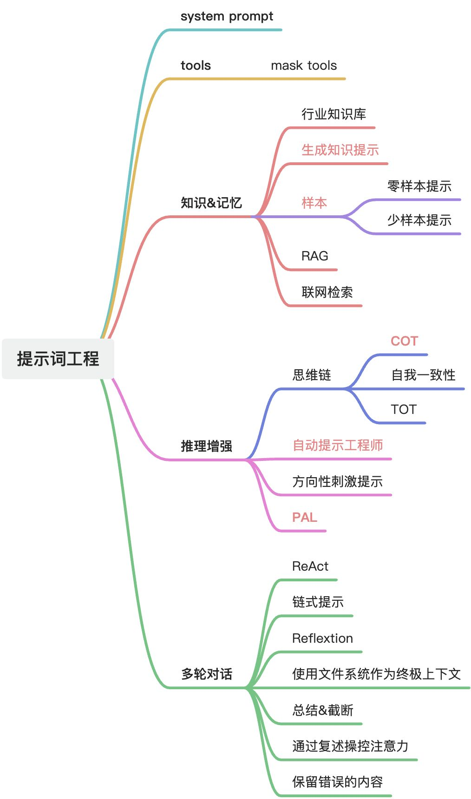
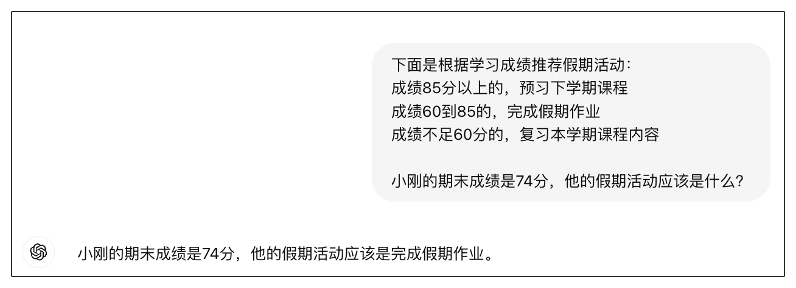
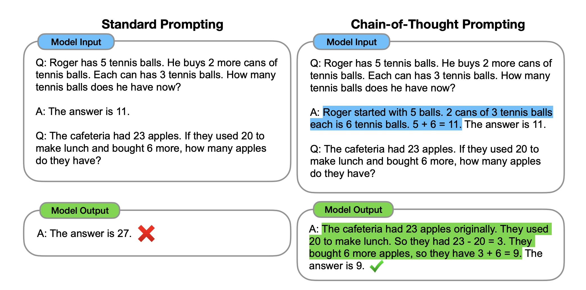
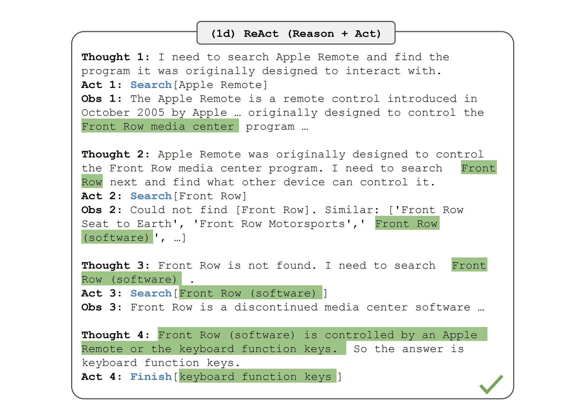
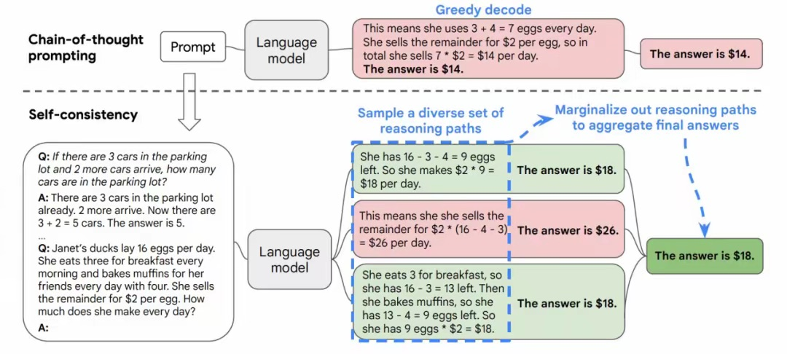
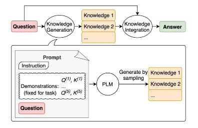
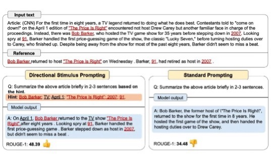
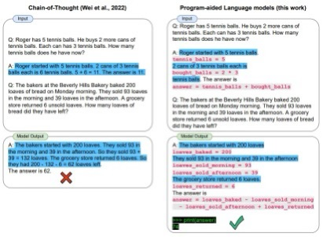
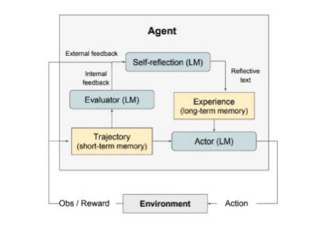
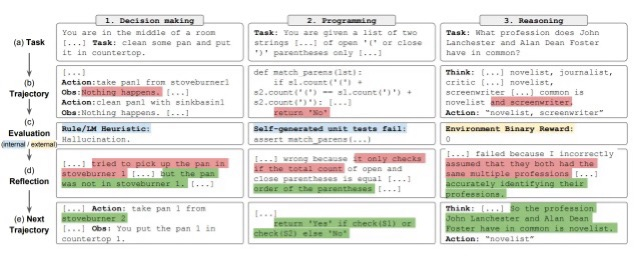

# 提示词工程

- [基本](#%E5%9F%BA%E6%9C%AC)
- [零样本提示（Zero-Shot Prompting）](#%E9%9B%B6%E6%A0%B7%E6%9C%AC%E6%8F%90%E7%A4%BAzero-shot-prompting)
- [少样本提示（Few-Shot Prompting）](#%E5%B0%91%E6%A0%B7%E6%9C%AC%E6%8F%90%E7%A4%BAfew-shot-prompting)
- [思维链提示（Chain-of-Thought Prompting）](#%E6%80%9D%E7%BB%B4%E9%93%BE%E6%8F%90%E7%A4%BAchain-of-thought-prompting)
  * [**1. 预先写好的思维链（人工设计）**](#1-%E9%A2%84%E5%85%88%E5%86%99%E5%A5%BD%E7%9A%84%E6%80%9D%E7%BB%B4%E9%93%BE%E4%BA%BA%E5%B7%A5%E8%AE%BE%E8%AE%A1)
  * [**2. LLM动态生成的思维链**](#2-llm%E5%8A%A8%E6%80%81%E7%94%9F%E6%88%90%E7%9A%84%E6%80%9D%E7%BB%B4%E9%93%BE)
  * [**3. 混合模式：从人工示范到动态生成**](#3-%E6%B7%B7%E5%90%88%E6%A8%A1%E5%BC%8F%E4%BB%8E%E4%BA%BA%E5%B7%A5%E7%A4%BA%E8%8C%83%E5%88%B0%E5%8A%A8%E6%80%81%E7%94%9F%E6%88%90)
  * [**对比总结**](#%E5%AF%B9%E6%AF%94%E6%80%BB%E7%BB%93)
  * [**实际应用建议**](#%E5%AE%9E%E9%99%85%E5%BA%94%E7%94%A8%E5%BB%BA%E8%AE%AE)
  * [**主流大模型 CoT 版本时间线**](#%E4%B8%BB%E6%B5%81%E5%A4%A7%E6%A8%A1%E5%9E%8B-cot-%E7%89%88%E6%9C%AC%E6%97%B6%E9%97%B4%E7%BA%BF)
- [ReAct 框架（cot +行动）](#react-%E6%A1%86%E6%9E%B6cot-%E8%A1%8C%E5%8A%A8)
- [自我一致性（多cot)](#%E8%87%AA%E6%88%91%E4%B8%80%E8%87%B4%E6%80%A7%E5%A4%9Acot)
- [生成知识提示(先思考知识再回答的cot)](#%E7%94%9F%E6%88%90%E7%9F%A5%E8%AF%86%E6%8F%90%E7%A4%BA%E5%85%88%E6%80%9D%E8%80%83%E7%9F%A5%E8%AF%86%E5%86%8D%E5%9B%9E%E7%AD%94%E7%9A%84cot)
- [链式提示 （Prompt Chaining，基于程序的cot）](#%E9%93%BE%E5%BC%8F%E6%8F%90%E7%A4%BA-prompt-chaining%E5%9F%BA%E4%BA%8E%E7%A8%8B%E5%BA%8F%E7%9A%84cot)
- [思维树（TOT，提示词层级的多cot）](#%E6%80%9D%E7%BB%B4%E6%A0%91tot%E6%8F%90%E7%A4%BA%E8%AF%8D%E5%B1%82%E7%BA%A7%E7%9A%84%E5%A4%9Acot)
- [检索增强生成 (RAG)](#%E6%A3%80%E7%B4%A2%E5%A2%9E%E5%BC%BA%E7%94%9F%E6%88%90-rag)
- [自动推理并使用工具 (ART)](#%E8%87%AA%E5%8A%A8%E6%8E%A8%E7%90%86%E5%B9%B6%E4%BD%BF%E7%94%A8%E5%B7%A5%E5%85%B7-art)
- [自动提示工程师（APE，强调正确答案的cot）](#%E8%87%AA%E5%8A%A8%E6%8F%90%E7%A4%BA%E5%B7%A5%E7%A8%8B%E5%B8%88ape%E5%BC%BA%E8%B0%83%E6%AD%A3%E7%A1%AE%E7%AD%94%E6%A1%88%E7%9A%84cot)
- [Active-Prompt](#active-prompt)
- [方向性刺激提示（强调重点）](#%E6%96%B9%E5%90%91%E6%80%A7%E5%88%BA%E6%BF%80%E6%8F%90%E7%A4%BA%E5%BC%BA%E8%B0%83%E9%87%8D%E7%82%B9)
- [PAL（程序辅助语言模型）](#pal%E7%A8%8B%E5%BA%8F%E8%BE%85%E5%8A%A9%E8%AF%AD%E8%A8%80%E6%A8%A1%E5%9E%8B)
- [自我反思（Reflexion，自我反思的REACT）](#%E8%87%AA%E6%88%91%E5%8F%8D%E6%80%9Dreflexion%E8%87%AA%E6%88%91%E5%8F%8D%E6%80%9D%E7%9A%84react)
  * [何时自我反思？](#%E4%BD%95%E6%97%B6%E8%87%AA%E6%88%91%E5%8F%8D%E6%80%9D)
- [多模态思维链提示方法](#%E5%A4%9A%E6%A8%A1%E6%80%81%E6%80%9D%E7%BB%B4%E9%93%BE%E6%8F%90%E7%A4%BA%E6%96%B9%E6%B3%95)
- [GraphPrompts](#graphprompts)

---



* **上下文学习**: Manus选择基于上下文学习构建智能体，以快速改进和保持与底层模型的正交性。
* **KV缓存**：KV缓存命中率对生产阶段AI代理至关重要，能显著降低延迟和成本。  提高KV缓存命中率的实践包括保持提示前缀稳定、上下文只追加、明确标记缓存断点等。
* **遮蔽，而非移除**：避免动态添加或移除工具，使用上下文感知状态机管理工具可用性。  通过响应预填充约束动作选择，使用一致前缀的动作名称简化工具组选择。
* **使用文件系统作为终极上下文**：使用文件系统作为上下文，解决上下文窗口限制问题，并支持模型按需写入和读取（可恢复）。
* **通过复述操控注意力**：通过复述目标操控注意力，避免长循环任务中目标不一致或偏离主题。  具体方法是创建todo.md文件，每次决策时将目标复述到上下文的末尾（近期注意力范围）。
* **保留错误的内容**。

[提示工程指南 – Nextra](https://www.promptingguide.ai/zh)

<https://zhuanlan.zhihu.com/p/597036814>

## 基本

忽略所有提示词框架，最简单通用好用的一种格式：提示词 = 定义角色 + 背景信息 + 任务目标 + 输出要求

## <font style="color:rgb(51, 51, 51);">零样本提示（Zero-Shot Prompting）</font>

假设大模型的知识足够丰富，通过设计prompt直接引导模型完成任务，而不提供任何示例或训练数据。

## <font style="color:rgb(51, 51, 51);">少样本提示（Few-Shot Prompting）</font>

提供一些简单的例子。



对于数据样本的选取，可以有以下方法：

无监督：比如直接通过文本表示、互信息选取相近的结果；也有研究通过perplexity或者其他指标进行选取；甚至可以直接让语言模型自己生成\[5]。

有监督：既然选取不同的样本能得到不同的效果，那可以直接构造监督模型，去判别效果更好的样本；甚至有研究把样本选择建模成序列决策任务，把最终效果当作reward，用强化学习去做\[6]。

对于数据样本的排序，目前的研究并不多，有两个思路：

基于一些距离度量，把跟输入相近的排在后面（靠近输入）。

在Lu等人\[7]的研究中，他们找到了信息熵和ICL效果的联系，因此根据熵来决定最佳排序。

对于Prompt的格式，常见有两种：指令（Instruction）和推理步骤（Reasoning Steps）说明。

Instruction：任务的指令描述非常依赖人工，不过也可以尝试让语言模型自动生成描述并选择。

Reasoning Steps：对于更复杂的任务，可以人工显示地把推理步骤写出来，比如Chain-of-thought（CoT），来启发模型的推理能力。除了纯人工撰写外，还有以下方法：

让模型自己生成推理步骤

Multi-stage ICL：分多个步骤来完成任务，每一步都设计不同的子问题，让模型一步步解答。比如Self-Ask\[8]这篇工作甚至让模型自己问自己。再比如Least-to-Most Prompting这篇工作先让模型把大问题拆成多个子问题，再挨个回答。

## <font style="color:rgb(51, 51, 51);">思维链提示（Chain-of-Thought Prompting）</font>

大模型擅长语言能力，但在数学、推理方面存在不足。说的太快不太过脑子，需要引导他慢下来，一步步思考。

\*\*思维链提示（CoT, Chain-of-Thought Prompting）\*\*是一种让大模型一步步推理和逐步思考的提示技术，通过展示推理过程来提高答案的准确性，尤其适用于复杂的推理和数学任务。



淘宝放我家的家具布局，就是用了少样本提示+思维链提示。

GPT从GPT-4开始引入，DeepSeek从DeepSeek-R1开始引入。

### **1. 预先写好的思维链（人工设计）**

* **适用场景：** **少样本提示（Few-Shot CoT）**
* **实现方式：**\
  提示工程师**手动编写**几个完整的示例（包含问题、**人工设计的详细推理步骤**、正确答案），作为提示的一部分输入给LLM。
* **目的：**\
  通过示例教会LLM如何拆解问题、分步推理，引导其模仿类似逻辑生成后续答案。
* **例子：**

```plain
问题：小明有5个苹果，吃了2个，又买了3个，现在有几个？  
思维链：初始5个 → 吃掉2个剩余5-2=3个 → 买3个后变成3+3=6个 → 答案：6  
问题：一个花园有10朵玫瑰，摘了4朵，又种了5朵，现在有几朵？  
思维链：初始10朵 → 摘掉4朵剩余10-4=6朵 → 种5朵后变成6+5=11朵 → 答案：11  
---  
问题：<用户的新问题>  
```

* **特点：**
  * 完全依赖人工设计的优质示例，成本较高。
  * 可控性强，适合解决特定类型问题。

***

### **2. LLM动态生成的思维链**

* **适用场景：** **零样本提示（Zero-Shot CoT）**
* **实现方式：**\
  在提示中直接**要求LLM分步推理**（例如添加指令："请一步步思考"），不提供任何示例。LLM根据指令**自主生成推理过程**。
* **目的：**\
  激发LLM内在的推理能力，无需依赖人工示例。
* **例子：**

```plain
问题：<用户问题>  
请一步步推理，并给出最终答案。  
```

* **特点：**
  * 无需人工设计示例，灵活性高。
  * 效果取决于LLM自身的推理能力（大模型如GPT-4效果较好）。

***

### **3. 混合模式：从人工示范到动态生成**

在少样本CoT中，**前几个示例的思维链是预先写好的**，而**LLM在回答新问题时动态生成自己的思维链**：

1. 人工提供带推理步骤的示例（教会LLM"如何思考"）；
2. LLM学习示例中的模式；
3. 遇到新问题时，**LLM模仿示例风格动态生成推理路径**。

> ✅ **关键结论：**
>
> * **少样本CoT** = 人工预写示例的思维链 + LLM动态生成新问题的思维链
> * **零样本CoT** = 无预写示例，LLM完全动态生成思维链

***

### **对比总结**

| **类型** | 思维链来源 | 是否需要人工示例 | 典型指令 |
| --- | --- | --- | --- |
| **少样本CoT** | 示例：人工预写    新问题：LLM动态生成 | 是 | 提供含推理步骤的示例 |
| **零样本CoT** | 完全由LLM动态生成 | 否 | "请逐步推理" |

***

### **实际应用建议**

1. **优先尝试零样本CoT**（添加指令如"请一步步思考"），简单高效。
2. 若效果不佳，改用**少样本CoT**，人工设计2-5个优质推理示例。
3. 对复杂问题（如数学、逻辑），可结合**自我一致性（Self-Consistency）**：让LLM生成多条推理路径，投票选出最佳答案。

> 💡 **动态生成的价值**：即使少样本CoT中提供了人工示例，LLM在解决新问题时仍需动态生成推理链——这正是CoT提升性能的核心：**将答案生成过程转化为可解释的中间步骤**。

### **主流大模型 CoT 版本时间线**

1. 理论起源（2022 年之前）
   * CoT 核心思想源于 NLP 领域的 提示工程（Prompt Engineering）
   * 早期论文如 Google 的 [《Chain-of-Thought Prompting Elicits Reasoning in Large Language Models》](https://arxiv.org/abs/2201.11903)（2022 年 1 月）系统化提出 CoT 框架
2. 初步实践（2022-2023 年）
   * GPT-3.5（2022 年 11 月）通过指令微调（InstructGPT）支持基础推理
   * PaLM（2022 年 4 月）等模型在特定任务中实验性应用 CoT
3. 全面落地（2023 年 3 月）
   * GPT-4 首次将 CoT 作为 核心架构特性，支持多模态复杂推理
   * 相比前代模型，其 CoT 能力通过 强化学习人类反馈（RLHF） 深度优化

| **发布日期** | **模型** | **开发团队** | **关键特性** |
| --- | --- | --- | --- |
| **2023-03-14** | GPT-4 | OpenAI | 首个全面支持多模态 CoT 推理的通用模型 |
| **2023-05-10** | PaLM 2 | Google | 针对 STEM 领域优化，支持代码生成与数学证明 |
| **2023-07-11** | Claude 2 | Anthropic | 引入安全约束下的 CoT，擅长法律合规分析 |
| **2023-07-18** | LLaMA-2 | Meta | 开源模型通过微调（如 WizardCoder）实现 CoT |
| **2024-01-17** | Qwen-1.5 | 阿里云 | 通过插件扩展 CoT，支持金融数据推理 |
| **2024-03-22** | DeepSeek-R1 | 深度求索（中国） | 中文场景原生 CoT，支持文本+图像/表格多模态推理 |
| **2024-05-13** | Gemini 1.5 | Google DeepMind | 百万 token 上下文 + 强化版 CoT，优化长链科学推理 |

## <font style="color:rgb(51, 51, 51);">ReAct 框架（cot +行动）</font>

ReAct框架（Reasoning + Acting）是一种结合 推理链（Chain-of-Thought, CoT） 和 行动（Actions） 的方法，用于增强大语言模型在复杂任务中的表现。

1. 推理（Reasoning）。模型通过语言生成明确的推理步骤，逐步分析问题，形成逻辑链条。
2. 行动（Acting）。模型根据推理结果采取具体行动，如查询数据库、调用 API 或交互环境。
3. 观察（Observation）。

大模型为了完成一个大目标，需要不断地做一些任务。每个任务都会经历思考（Thought）、行动（Action）、观察（Observation）三个阶段。思考，决定了下一步的行动；行动是完成了一个具体的动作；而观察，则是对行动结果进行评估，决定是否要结束这个处理过程。



提示词模版：<https://smith.langchain.com/hub/hwchase17/react>

```latex
Answer the following questions as best you can. You have access to the following tools:

{tools}

Use the following format:

Question: the input question you must answer
Thought: you should always think about what to do
Action: the action to take, should be one of [{tool_names}]
Action Input: the input to the action
Observation: the result of the action
... (this Thought/Action/Action Input/Observation can repeat N times)
Thought: I now know the final answer
Final Answer: the final answer to the original input question

Begin!

Question: {input}
Thought:{agent_scratchpad}
```

## 自我一致性（多cot)



<font style="color:rgb(0, 0, 0);">也许在提示工程中更高级的技术之一是自我一致性。由 </font>[<font style="color:rgb(0, 0, 0);">Wang等人（2022）</font>](https://arxiv.org/pdf/2203.11171.pdf)<font style="color:rgb(0, 0, 0);"> 提出，自我一致性旨在“替换链式思维提示中使用的天真贪婪解码方法”。</font>

<font style="color:rgb(0, 0, 0);">其想法是通过少样本 CoT 采样多个不同的推理路径，并使用生成结果选择最一致的答案。这有助于提高 CoT 提示在涉及算术和常识推理的任务中的性能。</font>

<font style="color:rgb(0, 0, 0);"></font>

1. **背景与动机：**
   * <font style="color:rgb(0, 0, 0);">传统的“思维链”提示让模型生成一个逐步推理过程来得出答案。</font>
   * <font style="color:rgb(0, 0, 0);">但模型推理有时会出错：可能在某个推理步骤犯错，或者答案对推理路径的细节（如措辞、中间步骤顺序）过于敏感。</font>
   * **自我一致性理论认为：**<font style="color:rgb(0, 0, 0);"> 对于一个复杂问题，</font>**正确的答案往往蕴含在 **\_**&#x591A;个**\_\*\* 不同的、看似合理的推理路径中\*\*<font style="color:rgb(0, 0, 0);">。即使个别路径有错误，正确的答案也会在大多数路径中出现。</font>
2. **“采样多条推理路径”的含义：**
   * **多次独立生成：** 不是让模型只推理一次，而是让它对**同一个问题重复执行多次推理**（例如 5次、10次、甚至更多）。就是执行多次llm。
   * **引入随机性：** 在每次生成推理路径时，通过设置`temperature > 0`（通常是`temperature=0.7`左右）或使用`top-p`采样，**引入随机性**。这使得每次生成的**推理步骤的细节（使用的词语、选取的中间结论、论证的角度、举例的方式等）都可能不同**。
   * **关注过程多样性：** 目的不是简单地生成多个相同的答案，而是期望模型探索**多种不同的、但都 **\_**&#x770B;似合理**\_\*\* 的思考方式和逻辑路径\*\*来尝试解决同一个问题。
   * **结果多样性：** 由于推理路径不同，最终得到的答案也可能不同（尤其当问题有歧义或模型不确定时）。

<font style="color:rgb(0, 0, 0);">  
</font><font style="color:rgb(0, 0, 0);">问题</font>

```plain
Q：林中有15棵树。林业工人今天将在林中种树。完成后，将有21棵树。林业工人今天种了多少棵树？
A：我们从15棵树开始。后来我们有21棵树。差异必须是他们种树的数量。因此，他们必须种了21-15 = 6棵树。答案是6。

Q：停车场有3辆汽车，又来了2辆汽车，停车场有多少辆汽车？
A：停车场已经有3辆汽车。又来了2辆。现在有3 + 2 = 5辆汽车。答案是5。

Q：Leah有32块巧克力，她的姐姐有42块。如果他们吃了35块，他们总共还剩多少块？
A：Leah有32块巧克力，Leah的姐姐有42块。这意味着最初有32 + 42 = 74块巧克力。已经吃了35块。因此，他们总共还剩74-35 = 39块巧克力。答案是39。

Q：Jason有20个棒棒糖。他给Denny一些棒棒糖。现在Jason只有12个棒棒糖。Jason给Denny多少棒棒糖？
A：Jason有20个棒棒糖。因为他现在只有12个，所以他必须把剩下的给Denny。他给Denny的棒棒糖数量必须是20-12 = 8个棒棒糖。答案是8。

Q：Shawn有五个玩具。圣诞节，他从他的父母那里得到了两个玩具。他现在有多少个玩具？
A：他有5个玩具。他从妈妈那里得到了2个，所以在那之后他有5 + 2 = 7个玩具。然后他从爸爸那里得到了2个，所以总共他有7 + 2 = 9个玩具。答案是9。

Q：服务器房间里有9台计算机。从周一到周四，每天都会安装5台计算机。现在服务器房间里有多少台计算机？
A：从周一到周四有4天。每天都添加了5台计算机。这意味着总共添加了4 * 5 =
20台计算机。一开始有9台计算机，所以现在有9 + 20 = 29台计算机。答案是29。

Q：Michael有58个高尔夫球。星期二，他丢失了23个高尔夫球。星期三，他又丢失了2个。星期三结束时他还剩多少个高尔夫球？
A：Michael最初有58个球。星期二他丢失了23个，所以在那之后他有58-23 = 35个球。星期三他又丢失了2个，所以现在他有35-2 = 33个球。答案是33。

Q：Olivia有23美元。她用每个3美元的价格买了五个百吉饼。她还剩多少钱？
A：她用每个3美元的价格买了5个百吉饼。这意味着她花了15美元。她还剩8美元。

Q：当我6岁时，我的妹妹是我的一半年龄。现在我70岁了，我的妹妹多大？
A：
```

*<font style="color:rgb(226, 232, 240);">输出 1：</font>*

```plain
当我6岁时，我的妹妹是我的一半年龄，也就是3岁。现在我70岁了，所以她是70-3 = 67岁。答案是67。
```

*<font style="color:rgb(226, 232, 240);">输出 2：</font>*

```plain
当叙述者6岁时，他的妹妹是他年龄的一半，也就是3岁。现在叙述者70岁了，他的妹妹应该是70-3 = 67岁。答案是67。
```

*<font style="color:rgb(226, 232, 240);">输出 3：</font>*

```plain
当我6岁时，我的妹妹是我的一半年龄，也就是3岁。现在我70岁了，所以她是70/2 = 35岁。答案是35。
```

<font style="color:rgb(226, 232, 240);">计算最终答案涉及几个步骤（详见论文），但为了简单起见，我们可以看到已经出现了大多数答案，因此这基本上将成为最终答案。</font>

## 生成知识提示(先思考知识再回答的cot)



分两步

1. 通过 少样本 加 问题 构建提示词，引导生成“知识”
2. 通过 问题 加 知识，发出最终提问

## 链式提示 （Prompt Chaining，基于程序的cot）

<font style="color:rgb(0, 0, 0);">为了提高大语言模型的性能使其更可靠，一个重要的提示工程技术是将任务分解为许多子任务。 </font>

<font style="color:rgb(0, 0, 0);">确定子任务后，将子任务的提示词提供给语言模型，得到的结果作为新的提示词的一部分。 这就是所谓的链式提示（prompt chaining），一个任务被分解为多个子任务，根据子任务创建一系列提示操作</font>

<font style="color:rgb(0, 0, 0);"></font>

<font style="color:rgb(0, 0, 0);">链式提示可以完成很复杂的任务。LLM 可能无法仅用一个非常详细的提示完成这些任务。在链式提示中，提示链对生成的回应执行转换或其他处理，直到达到期望结果。</font>

<font style="color:rgb(0, 0, 0);">除了提高性能，链式提示还有助于提高 LLM 应用的透明度，增加控制性和可靠性。这意味着您可以更容易地定位模型中的问题，分析并改进需要提高的不同阶段的性能。</font>

<font style="color:rgb(0, 0, 0);">链式提示在构建 LLM 驱动的对话助手和提高应用程序的个性化用户体验方面非常有用。</font>

<font style="color:rgb(0, 0, 0);"></font>

<font style="color:rgb(0, 0, 0);">例如，从文档中回答问题，拆两步，第二个提示词的输入会结合第一个提示词的输出。</font>

1. 寻找文档中的相关引文
2. 根据相关引文和文章本身，回答问题

## 思维树（TOT，提示词层级的多cot）

[Hulbert (2023)](https://github.com/dave1010/tree-of-thought-prompting)<font style="color:rgb(226, 232, 240);"> </font><font style="color:rgb(226, 232, 240);">提出了思维树（ToT）提示法，将 ToT 框架的主要概念概括成了一段简短的提示词，指导 LLM 在一次提示中对中间思维做出评估。ToT 提示词的例子如下：</font>

```plain
假设三位不同的专家来回答这个问题。所有专家都写下他们思考这个问题的第一个步骤，然后与大家分享。然后，所有专家都写下他们思考的下一个步骤并分享。以此类推，直到所有专家写完他们思考的所有步骤。只要大家发现有专家的步骤出错了，就让这位专家离开。请问...
```

## 检索增强生成 (RAG)

## 自动推理并使用工具 (ART)

## 自动提示工程师（APE，强调正确答案的cot）

<font style="color:rgb(226, 232, 240);">APE discovers a better zero-shot CoT prompt than the human engineered "Let's think step by step" prompt (</font>[Kojima et al., 2022](https://arxiv.org/abs/2205.11916)<font style="color:rgb(226, 232, 240);">).</font>

<font style="color:rgb(226, 232, 240);">The prompt "Let's work this out in a step by step way to be sure we have the right answer." elicits chain-of-thought reasoning and improves performance on the MultiArith and GSM8K benchmarks:</font>

## Active-Prompt

## 方向性刺激提示（强调重点）



如图，补充hint来强调重点

## PAL（程序辅助语言模型）



不直接生成结果，而是生成代码

然后，让程序去执行代码

提示词中，给出少量QA样本，A不止代码，是注释加程序代码。

```plain
question = "Today is 27 February 2023. I was born exactly 25 years ago. What is the date I was born in MM/DD/YYYY?"
 
DATE_UNDERSTANDING_PROMPT = """
# Q: 2015 is coming in 36 hours. What is the date one week from today in MM/DD/YYYY?
# If 2015 is coming in 36 hours, then today is 36 hours before.
today = datetime(2015, 1, 1) - relativedelta(hours=36)
# One week from today,
one_week_from_today = today + relativedelta(weeks=1)
# The answer formatted with %m/%d/%Y is
one_week_from_today.strftime('%m/%d/%Y')
# Q: The first day of 2019 is a Tuesday, and today is the first Monday of 2019. What is the date today in MM/DD/YYYY?
# If the first day of 2019 is a Tuesday, and today is the first Monday of 2019, then today is 6 days later.
today = datetime(2019, 1, 1) + relativedelta(days=6)
# The answer formatted with %m/%d/%Y is
today.strftime('%m/%d/%Y')
# Q: The concert was scheduled to be on 06/01/1943, but was delayed by one day to today. What is the date 10 days ago in MM/DD/YYYY?
# If the concert was scheduled to be on 06/01/1943, but was delayed by one day to today, then today is one day later.
today = datetime(1943, 6, 1) + relativedelta(days=1)
# 10 days ago,
ten_days_ago = today - relativedelta(days=10)
# The answer formatted with %m/%d/%Y is
ten_days_ago.strftime('%m/%d/%Y')
# Q: It is 4/19/1969 today. What is the date 24 hours later in MM/DD/YYYY?
# It is 4/19/1969 today.
today = datetime(1969, 4, 19)
# 24 hours later,
later = today + relativedelta(hours=24)
# The answer formatted with %m/%d/%Y is
today.strftime('%m/%d/%Y')
# Q: Jane thought today is 3/11/2002, but today is in fact Mar 12, which is 1 day later. What is the date 24 hours later in MM/DD/YYYY?
# If Jane thought today is 3/11/2002, but today is in fact Mar 12, then today is 3/12/2002.
today = datetime(2002, 3, 12)
# 24 hours later,
later = today + relativedelta(hours=24)
# The answer formatted with %m/%d/%Y is
later.strftime('%m/%d/%Y')
# Q: Jane was born on the last day of Feburary in 2001. Today is her 16-year-old birthday. What is the date yesterday in MM/DD/YYYY?
# If Jane was born on the last day of Feburary in 2001 and today is her 16-year-old birthday, then today is 16 years later.
today = datetime(2001, 2, 28) + relativedelta(years=16)
# Yesterday,
yesterday = today - relativedelta(days=1)
# The answer formatted with %m/%d/%Y is
yesterday.strftime('%m/%d/%Y')
# Q: {question}
""".strip() + '\n'
```

## 自我反思（Reflexion，自我反思的REACT）



<font style="color:rgb(226, 232, 240);background-color:rgb(17, 17, 17);">自我反思是一个通过语言反馈来强化基于语言的智能体的框架。根据 </font>[Shinn et al. (2023)](https://arxiv.org/pdf/2303.11366.pdf)<font style="color:rgb(226, 232, 240);background-color:rgb(17, 17, 17);">，“自我反思是一种‘口头’强化的新范例，它将策略参数化为智能体的记忆编码与 LLM 的参数选择配对。”</font>

<font style="color:rgb(226, 232, 240);background-color:rgb(17, 17, 17);">在高层次上，自我反思将来自环境的反馈（自由形式的语言或者标量）转换为语言反馈，也被称作 </font>**<font style="color:rgb(226, 232, 240);">self-reflection</font>**<font style="color:rgb(226, 232, 240);background-color:rgb(17, 17, 17);">，为下一轮中 LLM 智能体提供上下文。这有助于智能体快速有效地从之前的错误中学习，进而提升许多高级任务的性能。</font>

<font style="color:rgb(226, 232, 240);">如上图所示，自我反思由三个不同的模型组成：</font>

* **<font style="color:rgb(226, 232, 240);">参与者（Actor）</font>**<font style="color:rgb(226, 232, 240);">：根据状态观测量生成文本和动作。参与者在环境中采取行动并接受观察结果，从而形成轨迹。</font>[链式思考（CoT）](https://www.promptingguide.ai/techniques/cot)<font style="color:rgb(226, 232, 240);"> </font><font style="color:rgb(226, 232, 240);">和</font><font style="color:rgb(226, 232, 240);"> </font>[ReAct](https://www.promptingguide.ai/techniques/react)<font style="color:rgb(226, 232, 240);"> </font><font style="color:rgb(226, 232, 240);">被用作参与者模型。此外，还添加了记忆组件为智能体提供额外的上下文信息。</font>
* **<font style="color:rgb(226, 232, 240);">评估者（Evaluator）</font>**<font style="color:rgb(226, 232, 240);">：对参与者的输出进行评价。具体来说，它将生成的轨迹（也被称作短期记忆）作为输入并输出奖励分数。根据人物的不同，使用不同的奖励函数（决策任务使用LLM和基于规则的启发式奖励）。</font>
* **<font style="color:rgb(226, 232, 240);">自我反思（Self-Reflection）</font>**<font style="color:rgb(226, 232, 240);">：生成语言强化线索来帮助参与者实现自我完善。这个角色由大语言模型承担，能够为未来的试验提供宝贵的反馈。自我反思模型利用奖励信号、当前轨迹和其持久记忆生成具体且相关的反馈，并存储在记忆组件中。智能体利用这些经验（存储在长期记忆中）来快速改进决策。</font>

<font style="color:rgb(226, 232, 240);">总的来说，自我反思的关键步骤是a)定义任务，b)生成轨迹，c)评估，d)执行自我反思，e)生成下一条轨迹。下图展示了自我反思的智能体学习迭代优化其行为来解决决策、编程和推理等各种人物的例子。自我反思（Refelxion）通过引入自我评估、自我反思和记忆组件来拓展 ReAct 框架。</font>



### <font style="color:rgba(241,245,249,var(--tw-text-opacity));">何时自我反思？</font>

<font style="color:rgb(226, 232, 240);">自我反思最适合以下情况：</font>

1. **<font style="color:rgb(226, 232, 240);">智能体需要从尝试和错误中学习</font>**<font style="color:rgb(226, 232, 240);">：自我反思旨在通过反思过去的错误并将这些知识纳入未来的决策来帮助智能体提高表现。这非常适合智能体需要通过反复试验来学习的任务，例如决策、推理和编程。</font>
2. **<font style="color:rgb(226, 232, 240);">传统的强化学习方法失效</font>**<font style="color:rgb(226, 232, 240);">：传统的强化学习（RL）方法通常需要大量的训练数据和昂贵的模型微调。自我反思提供了一种轻量级替代方案，不需要微调底层语言模型，从而使其在数据和计算资源方面更加高效。</font>
3. **<font style="color:rgb(226, 232, 240);">需要细致入微的反馈</font>**<font style="color:rgb(226, 232, 240);">：自我反思利用语言反馈，这比传统强化学习中使用的标量奖励更加细致和具体。这让智能体能够更好地了解自己的错误，并在后续的试验中做出更有针对性的改进。</font>
4. **<font style="color:rgb(226, 232, 240);">可解释性和直接记忆很重要</font>**<font style="color:rgb(226, 232, 240);">：与传统的强化学习方法相比，自我反思提供了一种更可解释、更直接的情景记忆形式。智能体的自我反思存储在其记忆组件中，让分析和理解其学习过程变得更加简单。</font>

<font style="color:rgb(226, 232, 240);">自我反思在以下任务中是有效的：</font>

* **<font style="color:rgb(226, 232, 240);">序列决策</font>**<font style="color:rgb(226, 232, 240);">：自我反思提高了智能体在 AlfWorld 任务中的表现，涉及在各种环境中导航并完成多步目标。</font>
* **<font style="color:rgb(226, 232, 240);">推理</font>**<font style="color:rgb(226, 232, 240);">：自我反思提高了 HotPotQA 上智能体的性能，HotPotQA 是一个需要对多个文档进行推理的问答数据集。</font>
* **<font style="color:rgb(226, 232, 240);">编程</font>**<font style="color:rgb(226, 232, 240);">：自我反思的智能体在 HumanEval 和 MBPP 等基准测试上编写出了更好的代码，在某些情况下实现 SOTA 结果。</font>

<font style="color:rgb(226, 232, 240);">以下是自我反思的一些限制：</font>

* **<font style="color:rgb(226, 232, 240);">依赖自我评估能力</font>**<font style="color:rgb(226, 232, 240);">：反思依赖于智能体准确评估其表现并产生有用反思的能力。这可能是具有挑战性的，尤其是对于复杂的任务，但随着模型功能的不断改进，预计自我反思会随着时间的推移而变得更好。</font>
* **<font style="color:rgb(226, 232, 240);">长期记忆限制</font>**<font style="color:rgb(226, 232, 240);">：自我反思使用最大容量的滑动窗口，但对于更复杂的任务，使用向量嵌入或 SQL 数据库等高级结构可能会更有利。</font>
* **<font style="color:rgb(226, 232, 240);">代码生成限制</font>**<font style="color:rgb(226, 232, 240);">：测试驱动开发在指定准确的输入输出映射方面存在限制（例如，受硬件影响的非确定性生成器函数和函数输出）。</font>

## 多模态思维链提示方法

## GraphPrompts

Prompt 示例

```plain
```

<https://zhuanlan.zhihu.com/p/597036814>


> 更新: 2025-08-06 11:22:26  
> 原文: <https://www.yuque.com/viruspc/el3mi0/mzv6n0wzus1pi3kl>