# Attention

Attention就是权重

Attention层有点类似CNN里的卷积层。卷积层处理空间数据，Attention处理序列数据。

RNN改进了传统的神经网络，建立了网络隐层间的时序关联。

两个RNN结构组合，形成Encoder-Decoder模型。先对一句话编码，再对一句话解码。

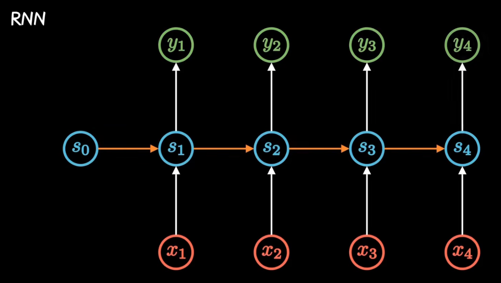

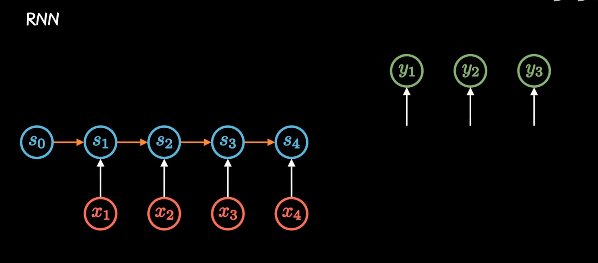

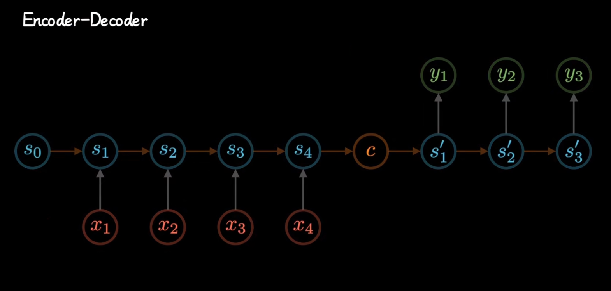

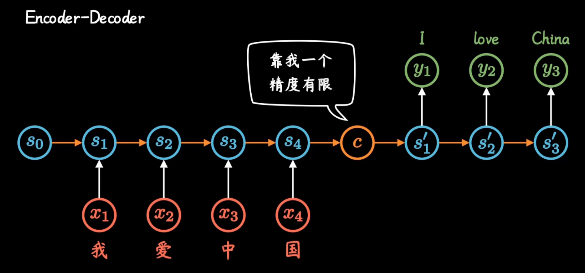

但是这种不管输入多长，都统一压缩成相同长度编码c的做法，会导致翻译精度下降。

Attention机制，通过每个时间输入不同的c，来解决上述问题。其中系数 \alpha_t，从c_t的视角看过去，就是不同输入的注意力，因此也被称为attention分布。

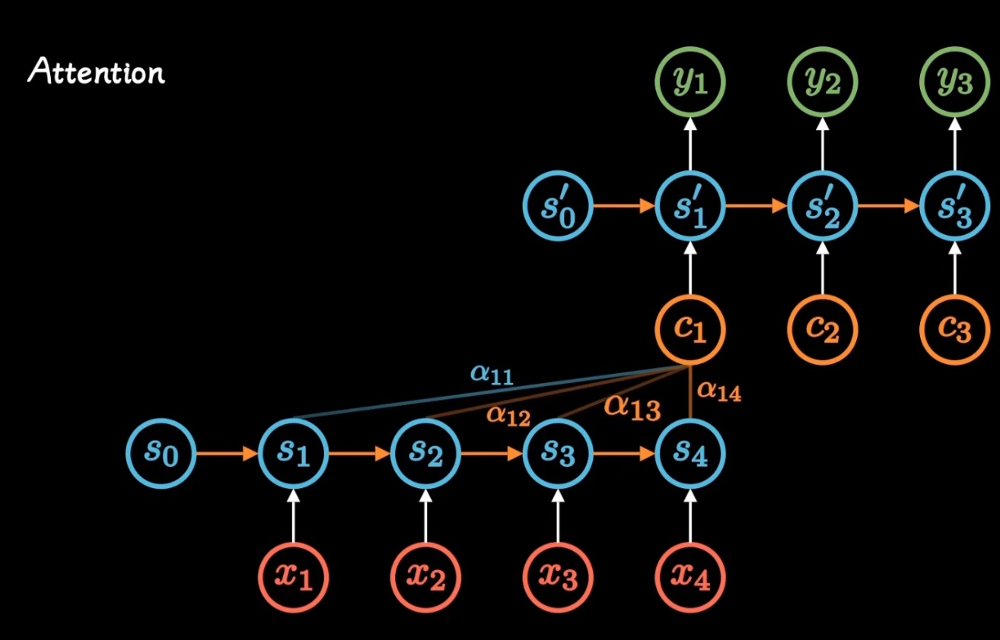

网络结构确定了，可以通过训练得到最好的attention权重矩阵。

attention机制的引入，打破了只能利用encoder形成单一向量的限制，让每一时刻模型都能动态地看到全局信息，将注意力集中到对当前单词翻译最重要的信息上，大大改善了机器学习翻译的效率。

随着并行计算的发展，人们发现RNN的顺序结构很不方便。既然attention模型本身已经对全部输入进行了打分，RNN中的顺序好像没什么用，于是得到了self-attention机制。

 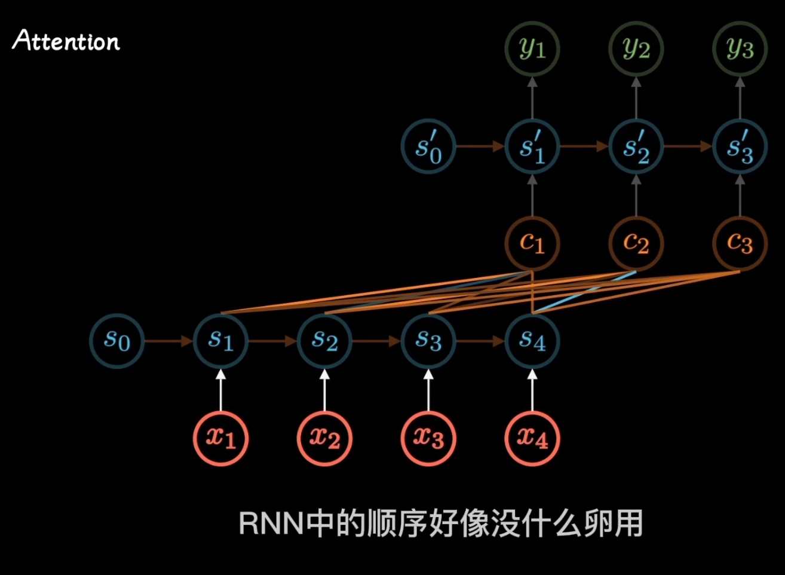

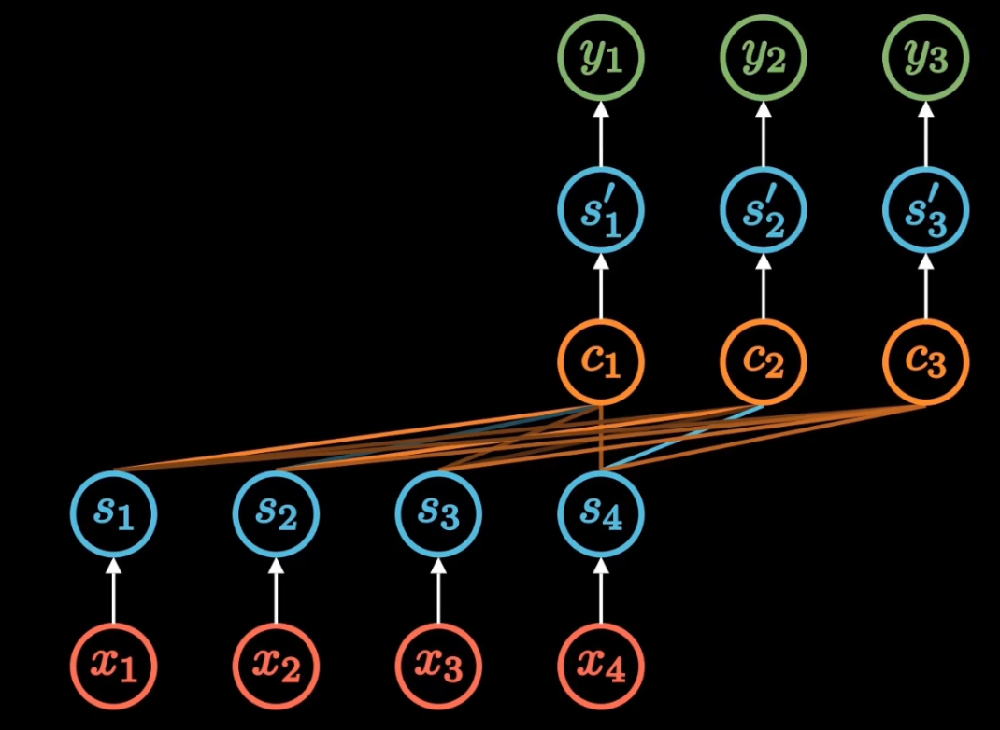

去掉了输入的箭头，Encoder编码阶段，利用attention机制计算每个单词与其他所有单词之间的关联。比如，当翻译games时，beijing、winter、2022都获得比较高的attention score。

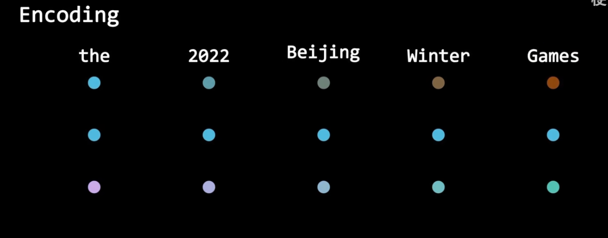

利用这些权重加权表示，再放到一个所谓的前馈神经网络中，得到新的表示，就很好地嵌入了上下文信息。这样的步骤重复几次会更好。

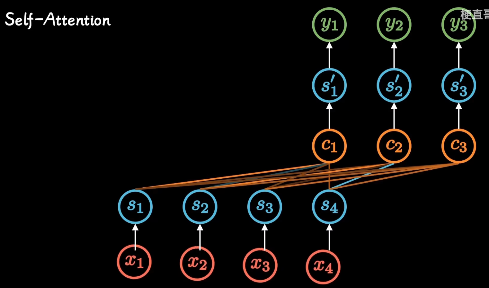

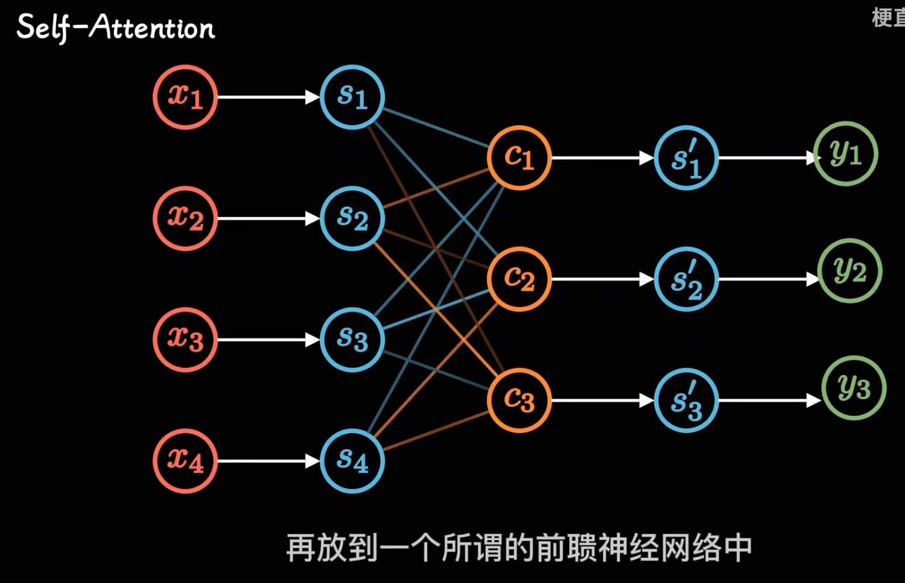

Decoder的时候，也是类似。不仅要看之前产生的输出，而且还得看encoder得到的输出。

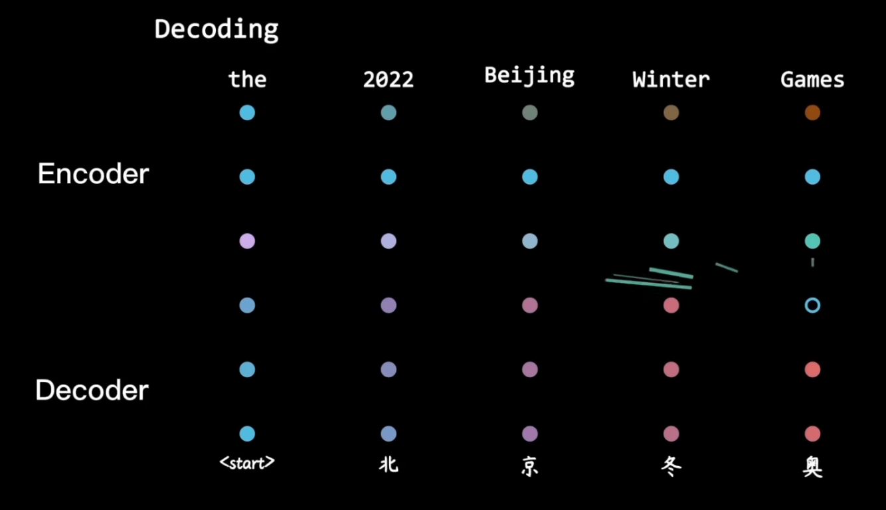 

2017年transformer横空出世，将attention机制发扬光大

2018年BERT和GPT算法效果出奇的好，进而让attention机制愈发走红。 

Attention的3大优点：

1. 参数更少
2. 速度更快
3. 效果更好

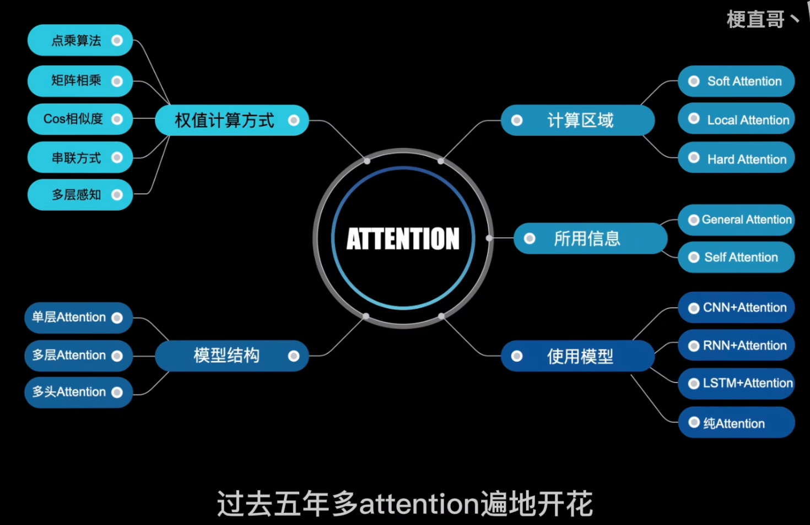

核心思想始终是，通过加权求和，解决context的理解问题。在不同的上下文下，专注不同的信息。

[【Attention 注意力机制】激情告白transformer、Bert、GNN的精髓_哔哩哔哩_bilibili](https://www.bilibili.com/video/BV1xS4y1k7tn?spm_id_from=333.788.videopod.sections&vd_source=a637826c55b409b420b4b6584a6e8379)

> 更新: 2025-07-27 08:35:02  
> 原文: <https://www.yuque.com/viruspc/el3mi0/or82lblnvvg7blny>