# Attention 与 Transformer架构

  * [什么是注意力机制](#%E4%BB%80%E4%B9%88%E6%98%AF%E6%B3%A8%E6%84%8F%E5%8A%9B%E6%9C%BA%E5%88%B6)
  * [深入理解注意力机制](#%E6%B7%B1%E5%85%A5%E7%90%86%E8%A7%A3%E6%B3%A8%E6%84%8F%E5%8A%9B%E6%9C%BA%E5%88%B6)
  * [注意力机制的实现](#%E6%B3%A8%E6%84%8F%E5%8A%9B%E6%9C%BA%E5%88%B6%E7%9A%84%E5%AE%9E%E7%8E%B0)
  * [自注意力](#%E8%87%AA%E6%B3%A8%E6%84%8F%E5%8A%9B)
  * [掩码自注意力](#%E6%8E%A9%E7%A0%81%E8%87%AA%E6%B3%A8%E6%84%8F%E5%8A%9B)
  * [多头注意力](#%E5%A4%9A%E5%A4%B4%E6%B3%A8%E6%84%8F%E5%8A%9B)
- [Encoder-Decoder](#encoder-decoder)
  * [Seq2Seq模型](#seq2seq%E6%A8%A1%E5%9E%8B)
  * [前馈神经网络](#%E5%89%8D%E9%A6%88%E7%A5%9E%E7%BB%8F%E7%BD%91%E7%BB%9C)
  * [层归一化](#%E5%B1%82%E5%BD%92%E4%B8%80%E5%8C%96)
  * [残差连接](#%E6%AE%8B%E5%B7%AE%E8%BF%9E%E6%8E%A5)
  * [Encoder](#encoder)
  * [Decoder](#decoder)
- [搭建一个 Transformer](#%E6%90%AD%E5%BB%BA%E4%B8%80%E4%B8%AA-transformer)
  * [模型的其他未提到部分](#%E6%A8%A1%E5%9E%8B%E7%9A%84%E5%85%B6%E4%BB%96%E6%9C%AA%E6%8F%90%E5%88%B0%E9%83%A8%E5%88%86)
    + [embedding层](#embedding%E5%B1%82)
    + [位置编码](#%E4%BD%8D%E7%BD%AE%E7%BC%96%E7%A0%81)
  * [策略](#%E7%AD%96%E7%95%A5)
  * [算法](#%E7%AE%97%E6%B3%95)
  * [一个完整的 Transformer](#%E4%B8%80%E4%B8%AA%E5%AE%8C%E6%95%B4%E7%9A%84-transformer)
- [参考资料](#%E5%8F%82%E8%80%83%E8%B5%84%E6%96%99)

---

注意力机制

### 什么是注意力机制

随着 NLP 从统计机器学习向深度学习迈进，作为 NLP 核心问题的**文本表示方法**也逐渐从统计学习向深度学习迈进。

从 计算机视觉（Computer Vision，CV）为起源发展起来的神经网络，其核心架构有三种：

* 全连接神经网络（Feedforward Neural Network，FNN），即每一层的神经元都和上下两层的每一个神经元完全连接:
  * 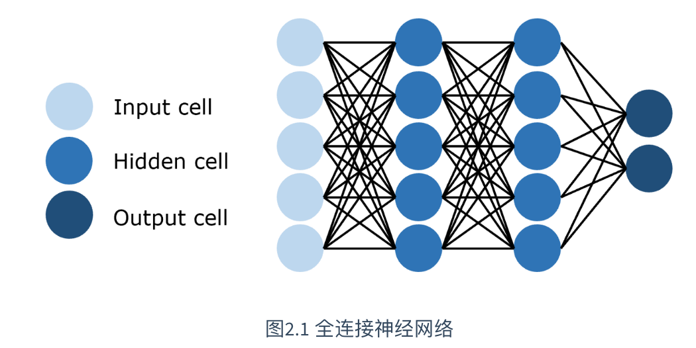
* [卷积神经网络](https://www.yuque.com/pengcheng-fuigs/el3mi0/qv7nsox2u54fttrd)（Convolutional Neural Network，CNN），即训练参数量远小于全连接神经网络的卷积层来进行特征提取和学习，如图所示:

  * 。
* [循环神经网络](https://www.yuque.com/pengcheng-fuigs/el3mi0/pfui16euoot1cqxb)（Recurrent Neural Network，RNN），RNN出现的目的是来处理**序列数据**的。能够使用历史信息作为输入、包含环和自重复的网络。可以用来做动态embeding。如图所示:

  * 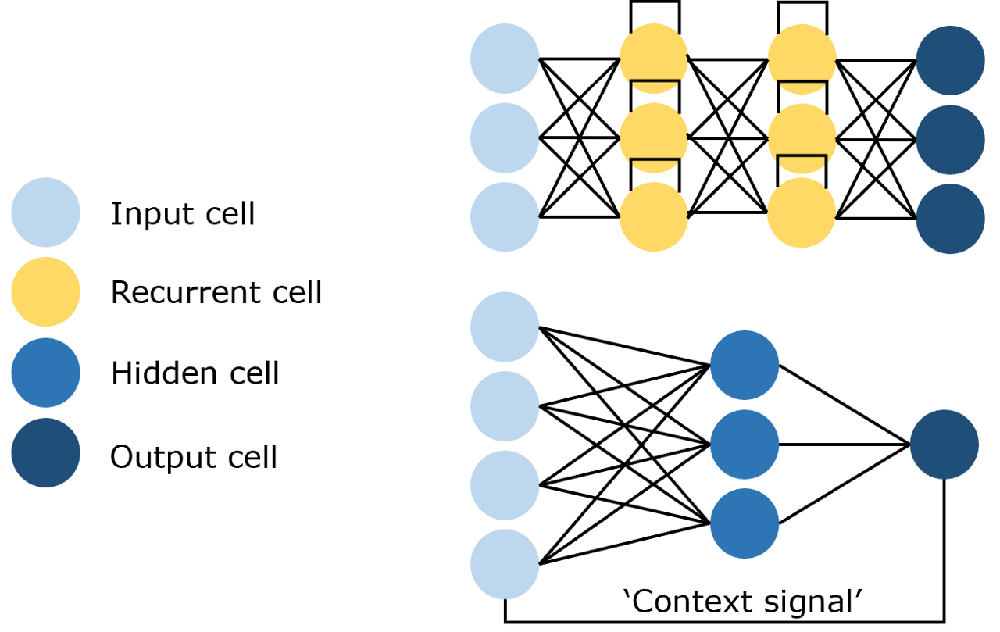

| **维度** | **全连接神经网络（FNN）** | **卷积神经网络（CNN）** | **循环神经网络（RNN）** |
| --- | --- | --- | --- |
| **结构特点** | 每个神经元与上一层的所有神经元相连。 | 局部连接，使用卷积核提取特征。 | 具有时间序列依赖性，信息在时间步中传递。 |
| **适用数据类型** | 静态数据（如表格数据）。 | 图像、视频等空间结构化数据。 | 时间序列、文本等序列化数据。 |
| **上下文依赖** | 无上下文依赖。 | 空间上下文依赖（局部特征）。 | 时间上下文依赖（长短期记忆）。 |
| **参数数量** | 参数较多，易过拟合。 | 参数较少，计算高效。 | 参数较多，易出现梯度消失或爆炸。 |
| **计算效率** | 较低，计算量大。 | 高效，适合并行计算。 | 较低，需序列化计算。 |
| **主要应用场景** | 分类、回归任务。 | 图像分类、目标检测、语义分割。 | 文本生成、机器翻译、时间序列预测。 |
| **优势** | 简单易实现，适合小规模数据。 | 局部特征提取能力强，计算效率高。 | 能处理序列数据，捕捉时间依赖性。 |
| **局限性** | 不适合结构化数据或序列数据。 | 不适合处理时间序列数据。 | 难以处理长时间依赖，计算效率低。 |

但 RNN 及 LSTM 虽然具有捕捉时序信息、适合序列生成的优点，却有两个难以弥补的缺陷：

1. **RNN计算时间成本高**。序列依序计算的模式能够很好地模拟时序信息，但限制了计算机并行计算的能力。序列需要依次输入、依序计算。
2. **RNN 难以捕捉长序列的相关关系**。在 RNN 架构中，距离越远的输入之间的关系就越难被捕捉，同时 RNN 需要将整个序列读入内存依次计算，也限制了序列的长度。虽然 LSTM 中通过门机制对此进行了一定优化，但对于较远距离相关关系的捕捉依旧不如人意。

针对上述问题，提出了 Attention 机制。注意力机制最先源于计算机视觉领域，其**核心思想为当我们关注一张图片，我们往往无需看清楚全部内容而仅将注意力集中在重点部分即可**。而在自然语言处理领域，我们往往也可以通过将重点注意力集中在一个或几个 token，从而取得更高效高质的计算效果。

注意力机制有三个核心变量：**Query**（查询值）、**Key**（键值）和 **Value**（真值）。我们可以通过一个案例来理解每一个变量所代表的含义。例如，当我们有一篇新闻报道，我们想要找到这个报道的时间，那么，我们的 Query 可以是类似于“时间”、“日期”一类的向量（为了便于理解，此处使用文本来表示，但其实际是稠密的向量），Key 和 Value 会是整个文本。通过对 Query 和 Key 进行运算我们可以得到一个权重，这个权重其实反映了从 Query 出发，对文本每一个 token 应该分布的注意力相对大小。通过把权重和 Value 进行运算，得到的最后结果就是从 Query 出发计算整个文本注意力得到的结果。

具体而言，注意力机制的特点是通过计算 Query 与Key的相关性为真值加权求和，从而拟合序列中每个词同其他词的相关关系。

### 深入理解注意力机制

注意力机制有三个核心变量：查询值 Query，键值 Key 和 真值 Value。**注意力机制的本质是，计算key与query的相似度（点乘+softmax），根据相似度来分配权重。**

1. **点乘计算相关性**：\
   $ \text{Score}\_{ij} = Q\_i \cdot K\_j $
2. **缩放分数**：\
   $ \text{Scaled Score}*{ij} = \frac{\text{Score}*{ij}}{\sqrt{d\_k}} $
3. **Softmax归一化**：\
   $ \text{Attention Weight}*{ij} = \text{Softmax}(\text{Scaled Score}*{ij}) $
4. **加权求和**：\
   $ \text{Output}*i = \sum*{j} \text{Attention Weight}\_{ij} \cdot V\_j $

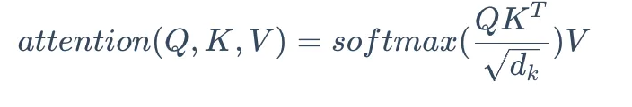

接下来我们以字典为例，逐步分析注意力机制的计算公式是如何得到的。

首先，我们有这样一个字典{ \[key]: value }：

```latex
{
    "apple":10,
    "banana":5,
    "chair":2
}

```

分别给三个 Key 赋予如下的权重：

```latex
{
    "apple":0.6,
    "banana":0.4,
    "chair":0
}
```

例如，我们想要查找“fruit”，此时，我们应该将 apple 和 banana 都匹配到，但不能匹配到 chair。因此，我们往往会选择将 Key 对应的 Value 进行组合得到最终的 Value。

<font style="color:rgb(52, 73, 94);">那么，我们最终查询到的值应该是：</font>

$ value=0.6∗10+0.4∗5+0∗2=8 $

给不同 Key 所赋予的不同权重，就是我们所说的注意力分数，注意力分数与当前Query相关。如何针对每一个 Query，计算出对应的注意力分数呢？从直观上讲，我们可以认为 Key 与 Query 相关性越高，则其所应该赋予的注意力权重就越大。真实情况是怎么做的呢？

可以用点积来计算词之间的相似度。假设我们的 Query 为“fruit”，对应的词向量为$\
q $；我们的 Key 对应的词向量为$ k=\[v
*{apple}
​
v*{banana}
​
v\_{chair}
​
] $，<font style="color:rgb(52, 73, 94);">则我们可以计算 Query 和每一个键的相似程度：</font>

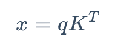

再通过一个 Softmax 层将其转化为和为 1 的权重：

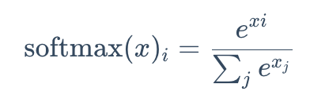

这样，得到的向量就能够反映 Query 和每一个 Key 的相似程度，同时又相加权重为 1，也就是我们的注意力分数了。根据上述过程，我们就可以得到注意力机制计算的基本公式：\
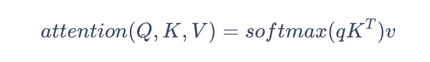

不过，此时的值还是一个标量，同时，我们此次只查询了一个 Query。我们可以将值转化为维度为$ d\_ v
​
$的向量，同时一次性查询多个 Query，同样将多个 Query 对应的词向量堆叠在一起形成矩阵 Q，得到公式：

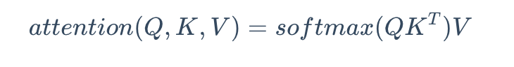（输出每个query词对应的value所构成的一维数组）

目前，我们离标准的注意力机制公式还差最后一步。在上一个公式中，如果 Q 和 K 对应的维度$ d\_k $比较大，softmax 放缩时就非常容易受影响（高维数据稀疏性导致概率分布偏斜。点积随着维度增大而增大，导致softmax输出分布尖锐接近0或1），使不同值之间的差异较大，从而影响梯度的稳定性。因此，我们要将 Q 和 K 乘积的结果做一个放缩：

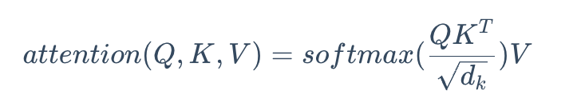

### 注意力机制的实现

核心是通过点乘计算相似度。

```python
'''注意力计算函数'''
def attention(query, key, value, dropout=None):
    '''
    args:
    query: 查询值矩阵
    key: 键值矩阵
    value: 真值矩阵
    '''
    # 获取键向量的维度，键向量的维度和值向量的维度相同
    d_k = query.size(-1) 
    # 计算Q与K的内积并除以根号dk
    # transpose——相当于转置
    scores = torch.matmul(query, key.transpose(-2, -1)) / math.sqrt(d_k)
    # Softmax
    p_attn = scores.softmax(dim=-1)
    if dropout is not None:
        p_attn = dropout(p_attn)
        # 采样
     # 根据计算结果对value进行加权求和
    return torch.matmul(p_attn, value), p_attn

```

总结：为什么不直接把 Value 当作 Key？

1. 职责分工：Key 用于匹配，Value 用于生成，分离设计提高了模型的功能性。
2. 灵活性：Key 和 Value 可以有不同的表示，增强模型的表达能力。
3. 计算效率：分离 Key 和 Value 减少了计算负担，尤其是在长序列的情况下。
4. 表达能力：Key 专注于结构信息，Value 专注于语义信息，两者分离使模型能更好地捕捉源语言特征。
5. 优化需求：分离设计允许对 Key 和 Value 进行不同的优化，适应不同的任务需求。

### 自注意力

**<font style="color:#DF2A3F;">为当前token，编码全局上下文信息。</font>**

动图轻松理解Self-Attention(自注意力机制) - 000\_error的文章 - 知乎

<https://zhuanlan.zhihu.com/p/619154409>

注意力机制的本质是对两段序列的元素依次进行**相似度计算**，寻找出一个序列的每个元素对另一个序列的每个元素的相关度，然后基于相关度进行加权，即**分配注意力**。

但是，在我们的实际应用中，我们往往只需要计算 Query 和 Key 之间的注意力结果，很少存在额外的真值 Value。也就是说，我们其实只需要拟合两个文本序列。在经典的 注意力机制中，Q 往往来自于一个序列，K 与 V 来自于另一个序列，都通过参数矩阵计算得到，从而可以拟合这两个序列之间的关系。例如在 Transformer 的 Decoder 结构中，Q 来自于 Decoder 的输入，K 与 V 来自于 Encoder 的输出，从而拟合了编码信息与历史信息之间的关系，便于综合这两种信息实现未来的预测。

但在 Transformer 的 Encoder 结构中，使用的是 注意力机制的变种 —— 自注意力（self-attention，自注意力）机制。所谓自注意力，即是计算本身序列中每个元素对其他元素的注意力分布，即在计算过程中，**Q、K、V 同源，都由同一个输入通过不同的参数矩阵计算得到**。在 Encoder 中，Q、K、V 分别是输入对参数矩阵 Wq、Wk、WvWq、Wk、Wv 做积得到，从而拟合输入语句中每一个 token 对其他所有 token 的关系。

和Attention类似，他们都是一种注意力机制。不同的是Attention是source对target，输入的source和输出的target内容不同。例如英译中，输入英文，输出中文。而Self-Attention是source对source，是source内部元素之间或者target内部元素之间发生的Attention机制，也可以理解为Target=Source这种特殊情况下的注意力机制。

通过自注意力机制，我们可以找到一段文本中每一个 token 与其他所有 token 的相关关系大小，从而建模文本之间的依赖关系。在代码中的实现，self-attention 机制其实是通过给 Q、K、V 的输入传入同一个参数实现的：

```latex
# attention 为上文定义的注意力计算函数
attention(x, x, x)
```

***

**Self-Attention** 是一种特殊的 **Attention**，它关注的是序列内部各元素之间的关系，而不是外部的其他序列。

**任务目标区别**：

* **Attention**：**用于计算两个序列（如源序列和目标序列）之间的关系。** 例如，机器翻译中， Q 为decoder的隐藏状态s，K、V为encoder的输出。
* **Self-Attention**：专注于单个序列内部元素之间的关系，生成上下文敏感的表示。例如，transformer中用self attention来捕获序列中任意两个位置之间的关系，而不仅仅是相邻位置；在 Transformer 的 Encoder 中，Self-Attention 用于对输入序列进行编码，生成表示每个词与整个序列关系的上下文向量；在 Transformer 的 Decoder 中，Self-Attention 用于生成目标序列时，帮助模型理解已经生成的部分序列的关系。Q、K、V都来自于隐藏状态s本身。

**算法实现区别**：

* **Attention**：输入的 ( Q )（查询）、( K )（键）、( V )（值）来自不同序列。
* **Self-Attention**：输入的 ( Q )、( K )、( V ) 都来自同一序列，通过点积计算注意力权重。

[音视频附件: baa5d568-d1ff-11ed-b610-4ec36ac17394-v1\_f4\_t2\_Enh02Rgd.mp4](./attachments/-d91Hb81IBOhpjXi/baa5d568-d1ff-11ed-b610-4ec36ac17394-v1_f4_t2_Enh02Rgd.mp4)

[音视频附件: self-attention.mp4](./attachments/-d91Hb81IBOhpjXi/self-attention.mp4)

### 掩码自注意力

**确保当前 token 只能关注序列中它自己及之前的 token，而不能看到后续的 token。**

***

（直接删除后续 token 会破坏序列完整性和模型的训练效率，而掩码机制通过屏蔽注意力权重，既满足因果性约束，又保留序列结构和语义关联的学习能力。）

掩码自注意力，即 Mask Self-Attention，是指使用注意力掩码的自注意力机制。掩码的作用是遮蔽一些特定位置的 token，模型在学习的过程中，会忽略掉被遮蔽的 token。

**Transformer 的 Encoder 是双向注意力。Transformer 的 Decoder 是单向注意力**（通过 Masking 实现）。

**Transformer 的 Encoder 是并行处理token，Transformer 的 Decoder 是在训练阶段通过掩码自注意力实现并行，推理时串行。**

使用注意力掩码的核心动机是让模型只能使用历史信息进行预测而不能看到未来信息。使用注意力机制的 Transformer 模型也是通过类似于 n-gram 的语言模型任务来学习的，也就是对一个文本序列，不断根据之前的 token 来预测下一个 token，直到将整个文本序列补全。

例如，如果待学习的文本序列是 【BOS】I like you【EOS】，那么，模型会按如下顺序进行预测和学习：

```latex
Step 1：输入 【BOS】，输出 I
Step 2：输入 【BOS】I，输出 like
Step 3：输入 【BOS】I like，输出 you
Step 4：输入 【BOS】I like you，输出 【EOS】

```

理论上来说，只要学习的语料足够多，通过上述的过程，模型可以学会任意一种文本序列的建模方式，也就是可以对任意的文本进行补全。

但是，我们可以发现，上述过程是一个串行的过程，也就是需要先完成 Step 1，才能做 Step 2，接下来逐步完成整个序列的补全。我们在一开始就说过，Transformer 相对于 RNN 的核心优势之一即在于其可以并行计算，具有更高的计算效率。如果对于每一个训练语料，模型都需要串行完成上述过程才能完成学习，那么很明显没有做到并行计算，计算效率很低。

针对这个问题，Transformer 就提出了掩码自注意力的方法。掩码自注意力会生成一串掩码，来遮蔽未来信息。例如，我们待学习的文本序列仍然是 【BOS】I like you【EOS】，我们使用的注意力掩码是【MASK】，那么模型的输入为：

```latex
<BOS> 【MASK】【MASK】【MASK】【MASK】
<BOS>    I   【MASK】 【MASK】【MASK】
<BOS>    I     like  【MASK】【MASK】
<BOS>    I     like    you  【MASK】
<BOS>    I     like    you   </EOS>

```

在每一行输入中，模型仍然是只看到前面的 token，预测下一个 token。但是注意，上述输入不再是串行的过程，而可以一起**并行**地输入到模型中，模型只需要每一个样本根据未被遮蔽的 token 来预测下一个 token 即可，从而实现了并行的语言模型。

观察上述的掩码，我们可以发现其实则是一个和文本序列等长的上三角矩阵。我们可以简单地通过创建一个和输入同等长度的上三角矩阵作为注意力掩码，再使用掩码来遮蔽掉输入即可。也就是说，当输入维度为 （batch\_size, seq\_len, hidden\_size）时，我们的 Mask 矩阵维度一般为 (1, seq\_len, seq\_len)（通过广播实现同一个 batch 中不同样本的计算）。

在具体实现中，我们通过以下代码生成 Mask 矩阵：

```python
# 创建一个上三角矩阵，用于遮蔽未来信息。
# 先通过 full 函数创建一个 1 * seq_len * seq_len 的矩阵
mask = torch.full((1, args.max_seq_len, args.max_seq_len), float("-inf"))
# triu 函数的功能是创建一个上三角矩阵
mask = torch.triu(mask, diagonal=1)

```

生成的 Mask 矩阵会是一个上三角矩阵，上三角位置的元素均为 -inf，其他位置的元素置为0。

在注意力计算时，我们会将计算得到的注意力分数与这个掩码做和，再进行 Softmax 操作：

```python
# 此处的 scores 为计算得到的注意力分数，mask 为上文生成的掩码矩阵
scores = scores + mask[:, :seqlen, :seqlen]
scores = F.softmax(scores.float(), dim=-1).type_as(xq)

```

通过做求和，上三角区域（也就是应该被遮蔽的 token 对应的位置）的注意力分数结果都变成了 -inf，而下三角区域的分数不变。再做 Softmax 操作，-inf 的值在经过 Softmax 之后会被置为 0，从而忽略了上三角区域计算的注意力分数，从而实现了注意力遮蔽。

### 多头注意力

注意力机制可以实现并行化与长期依赖关系拟合，但一次注意力计算只能拟合一种相关关系，单一的注意力机制很难全面拟合语句序列里的相关关系。因此 Transformer 使用了多头注意力机制（Multi-Head Attention），即同时对一个语料进行多次注意力计算，每次注意力计算都能拟合不同的关系，将最后的多次结果拼接起来作为最后的输出，即可更全面深入地拟合语言信息。

1. 如何实现“不同头关注不同方面”？
   1. 变换矩阵和初始化参数不同。在多头注意力中，每个头都有自己独立的线性变换矩阵（通常是 W\_Q、W\_K 和 W\_V，分别用于生成 Query、Key 和 Value）。这些矩阵是随机初始化的，经过训练后，每个头学到的参数会不同，因此它们关注的模式自然就不同。
2. 如何对多头结果做结果合并？
   1. 直接拼接起来，做一个线性变换（维度发生变化）
   2. 从数学上看，拼接和线性变换的组合可以看作是一个加权的信息整合过程：

在原论文中，作者也通过实验证实，多头注意力计算中，每个不同的注意力头能够拟合语句中的不同信息，如图2.4所示：

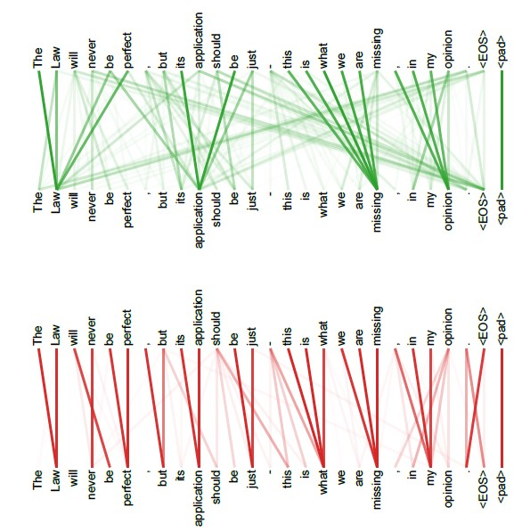

上层与下层分别是两个注意力头对同一段语句序列进行自注意力计算的结果，可以看到，对于不同的注意力头，能够拟合不同层次的相关信息。通过多个注意力头同时计算，能够更全面地拟合语句关系。

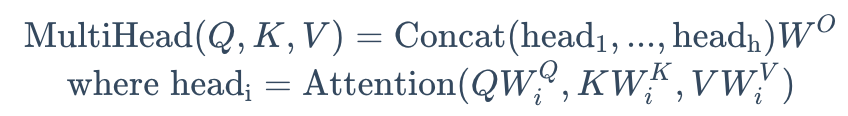

其最直观的代码实现并不复杂，即 n 个头就有 n 组3个参数矩阵，每一组进行同样的注意力计算，但由于是不同的参数矩阵从而通过反向传播实现了不同的注意力结果，然后将 n 个结果拼接起来输出即可。

但上述实现时空复杂度均较高，我们可以通过矩阵运算巧妙地实现并行的多头计算，其核心逻辑在于使用三个组合矩阵来代替了n个参数矩阵的组合，也就是矩阵内积再拼接其实等同于拼接矩阵再内积。具体实现可以参考下列代码：

```python
import torch.nn as nn
import torch

'''多头自注意力计算模块'''
class MultiHeadAttention(nn.Module):

    def __init__(self, args: ModelArgs, is_causal=False):
        # 构造函数
        # args: 配置对象
        super().__init__()
        # 隐藏层维度必须是头数的整数倍，因为后面我们会将输入拆成头数个矩阵
        assert args.dim % args.n_heads == 0
        # 模型并行处理大小，默认为1。
        model_parallel_size = 1
        # 本地计算头数，等于总头数除以模型并行处理大小。
        self.n_local_heads = args.n_heads // model_parallel_size
        # 每个头的维度，等于模型维度除以头的总数。
        self.head_dim = args.dim // args.n_heads

        # Wq, Wk, Wv 参数矩阵，每个参数矩阵为 n_embd x n_embd
        # 这里通过三个组合矩阵来代替了n个参数矩阵的组合，其逻辑在于矩阵内积再拼接其实等同于拼接矩阵再内积，
        # 不理解的读者可以自行模拟一下，每一个线性层其实相当于n个参数矩阵的拼接
        self.wq = nn.Linear(args.dim, args.n_local_heads * self.head_dim, bias=False)
        self.wk = nn.Linear(args.dim, args.n_local_heads * self.head_dim, bias=False)
        self.wv = nn.Linear(args.dim, args.n_local_heads * self.head_dim, bias=False)
        # 输出权重矩阵，维度为 dim x n_embd（head_dim = n_embeds / n_heads）
        self.wo = nn.Linear(args.n_local_heads * self.head_dim, args.dim, bias=False)
        # 注意力的 dropout
        self.attn_dropout = nn.Dropout(args.dropout)
        # 残差连接的 dropout
        self.resid_dropout = nn.Dropout(args.dropout)
         
        # 创建一个上三角矩阵，用于遮蔽未来信息
        # 注意，因为是多头注意力，Mask 矩阵比之前我们定义的多一个维度
        if is_causal:
           mask = torch.full((1, 1, args.max_seq_len, args.max_seq_len), float("-inf"))
           mask = torch.triu(mask, diagonal=1)
           # 注册为模型的缓冲区
           self.register_buffer("mask", mask)

    def forward(self, q: torch.Tensor, k: torch.Tensor, v: torch.Tensor):

        # 获取批次大小和序列长度，[batch_size, seq_len, dim]
        bsz, seqlen, _ = q.shape

        # 计算查询（Q）、键（K）、值（V）,输入通过参数矩阵层，维度为 (B, T, n_embed) x (n_embed, n_embed) -> (B, T, n_embed)
        xq, xk, xv = self.wq(q), self.wk(k), self.wv(v)

        # 将 Q、K、V 拆分成多头，维度为 (B, T, n_head, C // n_head)，然后交换维度，变成 (B, n_head, T, C // n_head)
        # 因为在注意力计算中我们是取了后两个维度参与计算
        # 为什么要先按B*T*n_head*C//n_head展开再互换1、2维度而不是直接按注意力输入展开，是因为view的展开方式是直接把输入全部排开，
        # 然后按要求构造，可以发现只有上述操作能够实现我们将每个头对应部分取出来的目标
        xq = xq.view(bsz, seqlen, self.n_local_heads, self.head_dim)
        xk = xk.view(bsz, seqlen, self.n_local_heads, self.head_dim)
        xv = xv.view(bsz, seqlen, self.n_local_heads, self.head_dim)
        xq = xq.transpose(1, 2)
        xk = xk.transpose(1, 2)
        xv = xv.transpose(1, 2)


        # 注意力计算
        # 计算 QK^T / sqrt(d_k)，维度为 (B, nh, T, hs) x (B, nh, hs, T) -> (B, nh, T, T)
        scores = torch.matmul(xq, xk.transpose(2, 3)) / math.sqrt(self.head_dim)
        # 掩码自注意力必须有注意力掩码
        if self.is_causal:
            assert hasattr(self, 'mask')
            # 这里截取到序列长度，因为有些序列可能比 max_seq_len 短
            scores = scores + self.mask[:, :, :seqlen, :seqlen]
        # 计算 softmax，维度为 (B, nh, T, T)
        scores = F.softmax(scores.float(), dim=-1).type_as(xq)
        # 做 Dropout
        scores = self.attn_dropout(scores)
        # V * Score，维度为(B, nh, T, T) x (B, nh, T, hs) -> (B, nh, T, hs)
        output = torch.matmul(scores, xv)

        # 恢复时间维度并合并头。
        # 将多头的结果拼接起来, 先交换维度为 (B, T, n_head, C // n_head)，再拼接成 (B, T, n_head * C // n_head)
        # contiguous 函数用于重新开辟一块新内存存储，因为Pytorch设置先transpose再view会报错，
        # 因为view直接基于底层存储得到，然而transpose并不会改变底层存储，因此需要额外存储
        output = output.transpose(1, 2).contiguous().view(bsz, seqlen, -1)

        # 最终投影回残差流。
        output = self.wo(output)
        output = self.resid_dropout(output)
        return output

```

## Encoder-Decoder

在上一节，我们详细介绍了 Transformer 的核心——注意力机制。在《Attention is All You Need》一文中，作者通过仅使用注意力机制而抛弃传统的 RNN、CNN 架构搭建出 Transformer 模型，从而带来了 NLP 领域的大变革。在 Transformer 中，使用注意力机制的是其两个核心组件——Encoder（编码器）和 Decoder（解码器）。事实上，**<font style="color:#DF2A3F;">后续基于 Transformer 架构而来的预训练语言模型基本都是对 Encoder-Decoder 部分进行改进来构建新的模型架构</font>**，例如只使用 Encoder 的 BERT、只使用 Decoder 的 GPT 等。

在本节中，我们将以上一节所介绍的 注意力机制为基础，从 Transformer 所针对的 Seq2Seq 任务出发，解析 Transformer 的 Encoder-Decoder 结构。

### Seq2Seq模型

**Seq2Seq，即序列到序列，是一种经典 NLP 任务**。具体而言，是指模型输入的是一个自然语言序列 $ input=(x
1
​
,x
2
​
,x
3
​
...x
n
​
)  $，输出的是一个可能不等长的自然语言序列 。事实上，Seq2Seq 是 NLP 最经典的任务，**<font style="color:#DF2A3F;">几乎所有的 NLP 任务都可以视为 Seq2Seq 任务</font>**。例如文本分类任务，可以视为输出长度为 1 的目标序列（如在上式中 m=1）；词性标注任务，可以视为输出与输入序列等长的目标序列（如在上式中 m=n）。

对于 Seq2Seq 任务，**一般的思路是对自然语言序列进行编码再解码。所谓编码**，就是将输入的自然语言序列通过隐藏层编码成能够表征语义的向量（或矩阵），可以简单理解为更复杂的词向量表示。而解码，就是对输入的自然语言序列编码得到的向量或矩阵通过隐藏层输出，再解码成对应的自然语言目标序列。通过编码再解码，就可以实现 Seq2Seq 任务。

Transformer 中的 Encoder，就是用于上述的编码过程；Decoder 则用于上述的解码过程。Transformer 结构，如图2.5所示：

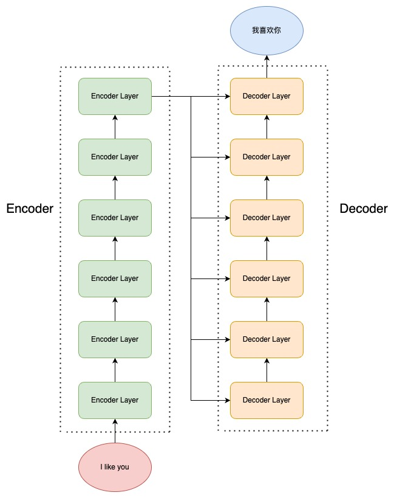

Transformer 由 Encoder 和 Decoder 组成，每一个 Encoder（Decoder）又由 6个 Encoder（Decoder）Layer 组成。输入源序列会进入 Encoder 进行编码，到 Encoder Layer 的最顶层再将编码结果输出给 Decoder Layer 的每一层，通过 Decoder 解码后就可以得到输出目标序列了。

接下来，我们将首先介绍 Encoder 和 Decoder 内部传统神经网络的经典结构——前馈神经网络（FNN）、层归一化（Layer Norm）和残差连接（Residual Connection），然后进一步分析 Encoder 和 Decoder 的内部结构。

### 前馈神经网络

前馈神经网络（Feedforward Neural Network, FNN）的核心在于通过层级结构进行数据的逐层传递和非线性映射，从而实现复杂函数的拟合和特征学习。感知机是前馈神经网络最简形式。

前馈神经网络（Feed Forward Neural Network，下简称 FFN），也就是我们在上一节提过的每一层的神经元都和上下两层的每一个神经元完全连接的网络结构。每一个 Encoder Layer 都包含一个上文讲的注意力机制和一个前馈神经网络。前馈神经网络的实现是较为简单的：

```python
class MLP(nn.Module):
    '''前馈神经网络'''
    def __init__(self, dim: int, hidden_dim: int, dropout: float):
        super().__init__()
        # 定义第一层线性变换，从输入维度到隐藏维度
        self.w1 = nn.Linear(dim, hidden_dim, bias=False)
        # 定义第二层线性变换，从隐藏维度到输入维度
        self.w2 = nn.Linear(hidden_dim, dim, bias=False)
        # 定义dropout层，用于防止过拟合
        self.dropout = nn.Dropout(dropout)

    def forward(self, x):
        # 前向传播函数
        # 首先，输入x通过第一层线性变换和RELU激活函数
        # 最后，通过第二层线性变换和dropout层
        return self.dropout(self.w2(F.relu(self.w1(x))))
    

```

注意，Transformer 的前馈神经网络是由两个线性层中间加一个 RELU 激活函数组成的，以及前馈神经网络还加入了一个 Dropout 层来防止过拟合。

### 层归一化

层归一化，也就是 Layer Norm，是深度学习中经典的归一化操作。**神经网络主流的归一化一般有两种，批归一化（Batch Norm）和层归一化（Layer Norm）。**

**解决问题**：

* **解决深度神经网络训练过程中梯度消失或梯度爆炸的问题，同时加速训练并提高模型的稳定性和泛化能力**。
* 归一化核心是为了让不同层输入的取值范围或者分布能够比较一致。随着神经网络参数的更新，各层的输出分布是不相同的，且差异会随着网络深度的增大而增大。但是，需要预测的条件分布始终是相同的，从而也就造成了预测的误差。

**核心思想：**

* 归一化的核心思想是通过调整数据分布（如均值和标准差），使特征的尺度一致，减少不同特征之间的分布差异，从而加速模型训练、提高优化稳定性并改善泛化能力。

**方法**：

* batch norm，是看某一个维度，对所有样本这个维度的值做归一化；
* layer norm，是看某一个样本，对这个样本的所有维度的值做归一化。

**Batch Norm（批归一化）**：因此，在深度神经网络中，往往需要归一化操作，将每一层的输入都归一化成标准正态分布。批归一化是指在一个 mini-batch 上进行归一化，相当于对一个 batch 对样本拆分出来一部分。核心逻辑是计算均值和方差，将分布转为标准正态分布。

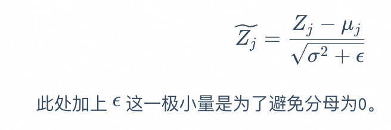

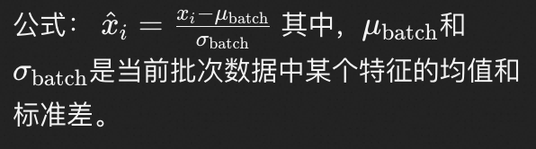

但是，Batch Norm存在一些缺陷，例如：

1. 当显存有限，mini-batch 较小时，Batch Norm 取的样本的均值和方差不能反映全局的统计分布信息，从而导致效果变差；
2. 对于在时间维度展开的 RNN，不同句子的同一分布大概率不同，所以 Batch Norm 的归一化会失去意义；
3. 在训练时，Batch Norm 需要保存每个 step 的统计信息（均值和方差）。在测试时，由于变长句子的特性，测试集可能出现比训练集更长的句子，所以对于后面位置的 step，是没有训练的统计量使用的；
4. 应用 Batch Norm，每个 step 都需要去保存和计算 batch 统计量，耗时又耗力

**Layer Norm（层归一化）**：因此，出现了在深度神经网络中更常用、效果更好的层归一化（Layer Norm）。相较于 Batch Norm 在每一层统计所有样本的均值和方差，Layer Norm 在每个样本上计算其所有层的均值和方差，从而使每个样本的分布达到稳定。Layer Norm 的归一化方式其实和 Batch Norm 是完全一样的，只是统计统计量的维度不同

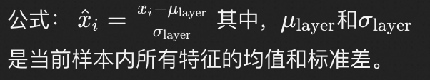

```python
class LayerNorm(nn.Module):
    ''' Layer Norm 层'''
    def __init__(self, features, eps=1e-6):
    super().__init__()
    # 线性矩阵做映射
    self.a_2 = nn.Parameter(torch.ones(features))
    self.b_2 = nn.Parameter(torch.zeros(features))
    self.eps = eps
    
    def forward(self, x):
    # 在统计每个样本所有维度的值，求均值和方差
    mean = x.mean(-1, keepdim=True) # mean: [bsz, max_len, 1]
    std = x.std(-1, keepdim=True) # std: [bsz, max_len, 1]
    # 注意这里也在最后一个维度发生了广播
    return self.a_2 * (x - mean) / (std + self.eps) + self.b_2

```

### 残差连接

**解决问题**：由于 Transformer 模型结构较复杂、层数较深，为了避免模型退化，Transformer 采用了残差连接的思想来连接每一个子层。残差连接解决了深度神经网络中因梯度消失或梯度爆炸导致的训练困难，以及随着网络加深可能出现的性能退化问题。

**核心思想**：**残差连接在网络中引入了恒等映射（直接将输入跳跃传递到输出）。下一层的输入不仅是上一层的输出，\*\*\*\*<font style="color:#DF2A3F;">还包括上一层的输入</font>**。残差连接允许最底层信息直接传到最高层，让高层专注于残差的学习。

**方法**：例如，在 Encoder 中，在第一个子层，输入进入多头自注意力层的同时会直接传递到该层的输出，然后该层的输出会与原输入相加，再进行标准化。在第二个子层也是一样。即：

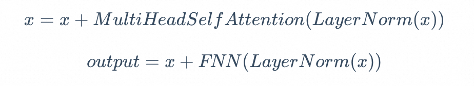

我们在代码实现中，通过在层的 forward 计算中加上原值来实现残差连接：

```python
# 注意力计算
h = x + self.attention.forward(self.attention_norm(x))
# 经过前馈神经网络
out = h + self.feed_forward.forward(self.fnn_norm(h))
```

在上文代码中，self.attention\_norm 和 self.fnn\_norm 都是 LayerNorm 层，self.attn 是注意力层，而 self.feed\_forward 是前馈神经网络。

残差连接使得模型更容易训练的原因是：**残差连接让梯度可以直接沿着“捷径”回传到前面的层，减少了梯度消失或梯度爆炸的问题，同时保留了原始输入信息，避免深层网络在学习复杂映射时出现困难。**

具体来说：

1. **梯度回传更顺畅**：残差连接提供了一条直接的路径，使梯度可以绕过中间层快速传播到前面的层，避免梯度在深层网络中逐渐衰减或放大。
2. **学习简单映射**：残差连接让网络只需学习“残差”（即输入和输出的差异），而不是直接拟合复杂的映射，这降低了优化的难度。

总结：残差连接简化了深层网络的训练过程，同时让深度网络更稳定、更高效。

### Encoder

Encoder 由 N 个 Encoder Layer 组成，每一个 Encoder Layer 包括一个注意力层和一个前馈神经网络。因此，我们可以首先实现一个 Encoder Layer：

```python
class EncoderLayer(nn.Module):
  '''Encoder层'''
    def __init__(self, args):
        super().__init__()
        # 一个 Layer 中有两个 LayerNorm，分别在 Attention 之前和 MLP 之前
        self.attention_norm = LayerNorm(args.n_embd)
        # Encoder 不需要掩码，传入 is_causal=False
        self.attention = MultiHeadAttention(args, is_causal=False)
        self.fnn_norm = LayerNorm(args.n_embd)
        self.feed_forward = MLP(args)

    def forward(self, x):
        # Layer Norm
        norm_x = self.attention_norm(x)
        # 自注意力
        h = x + self.attention.forward(norm_x, norm_x, norm_x)
        # 经过前馈神经网络
        out = h + self.feed_forward.forward(self.fnn_norm(h))
        return out

```

然后我们搭建一个 Encoder，由 N 个 Encoder Layer 组成，在最后会加入一个 Layer Norm 实现规范化：

```python
class Encoder(nn.Module):
    '''Encoder 块'''
    def __init__(self, args):
        super(Encoder, self).__init__() 
        # 一个 Encoder 由 N 个 Encoder Layer 组成
        self.layers = nn.ModuleList([EncoderLayer(args) for _ in range(args.n_layer)])
        self.norm = LayerNorm(args.n_embd)

    def forward(self, x):
        "分别通过 N 层 Encoder Layer"
        for layer in self.layers:
            x = layer(x)
        return self.norm(x)

```

通过 Encoder 的输出，就是输入编码之后的结果。

### Decoder

类似的，我们也可以先搭建 Decoder Layer，再将 N 个 Decoder Layer 组装为 Decoder。但是和 Encoder 不同的是，Decoder 由两个注意力层和一个前馈神经网络组成。

* 第一个注意力层是一个**掩码自注意力层**，即使用 Mask 的注意力计算，保证每一个 token 只能使用该 token 之前的注意力分数；
  * 作用：保证生成过程的顺序性（因果性）。这个层负责让每个位置的 token 只能关注它之前的 token，而不能看到后面的 token。这是通过“掩码”（Mask）机制实现的。
* 第二个注意力层是一个**多头注意力层**，该层将使用第一个注意力层的输出作为 query，使用 Encoder 的输出作为 key 和 value，来计算注意力分数。最后，再经过前馈神经网络：
  * 作用：将编码器的上下文信息引入到解码器中。这个层负责让解码器的输出（query）与编码器的输出（key 和 value）进行注意力计算，从而结合输入序列的上下文信息。
* 最后的**前馈神经网络层**：作用是对每个位置的 token 进行独立的非线性变换，从而增强特征表达能力。

```python
class DecoderLayer(nn.Module):
  '''解码层'''
    def __init__(self, args):
        super().__init__()
        # 一个 Layer 中有三个 LayerNorm，分别在 Mask Attention 之前、Self Attention 之前和 MLP 之前
        self.attention_norm_1 = LayerNorm(args.n_embd)
        # Decoder 的第一个部分是 Mask Attention，传入 is_causal=True
        self.mask_attention = MultiHeadAttention(args, is_causal=True)
        self.attention_norm_2 = LayerNorm(args.n_embd)
        # Decoder 的第二个部分是 类似于 Encoder 的 Attention，传入 is_causal=False
        self.attention = MultiHeadAttention(args, is_causal=False)
        self.ffn_norm = LayerNorm(args.n_embd)
        # 第三个部分是 MLP
        self.feed_forward = MLP(args)

    def forward(self, x, enc_out):
        # Layer Norm
        norm_x = self.attention_norm_1(x)
        # 掩码自注意力
        x = x + self.mask_attention.forward(norm_x, norm_x, norm_x)
        # 多头注意力
        norm_x = self.attention_norm_2(x)
        h = x + self.attention.forward(norm_x, enc_out, enc_out)
        # 经过前馈神经网络
        out = h + self.feed_forward.forward(self.ffn_norm(h))
        return out

```

Transformer 的 Encoder 是双向注意力。

Transformer 的 Decoder 是单向注意力（通过 Masking 实现）。

完成上述 Encoder、Decoder 的搭建，就完成了 Transformer 的核心部分，接下来将 Encoder、Decoder 拼接起来再加入 Embedding 层就可以搭建出完整的 Transformer 模型啦。

## 搭建一个 Transformer

在前两章，我们分别深入剖析了 Attention 机制和 Transformer 的核心——Encoder、Decoder 结构，接下来，我们就可以基于上一章实现的组件，搭建起一个完整的 Transformer 模型。

transformer几个关键点：

1. embeding层
   1. 位置编码。弥补注意力机制无法捕捉顺序的不足。
2. encoder/decoder
   1. 自注意力机制。捕捉全局上下文，提高模型表示能力。
   2. 多头注意力机制。捕捉多种关系或特征，提高模型表示能力。
   3. 残差连接与层归一化。稳定训练过程，防止梯度消失或爆炸，增强模型的鲁棒性

使得transfomer具备以下优势

1. **高效捕捉全局关系**：通过自注意力机制直接建模序列中任意位置的关系，解决长距离依赖问题。
2. **并行计算**：摒弃 RNN/LSTM 的逐步处理 循环结构，用矩阵运算实现全序列并行，训练速度快，尤其适合长序列任务。
3. 多任务适应性：模块化设计（编码器-解码器结构）灵活，可应用于机器翻译、文本生成、问答等多种任务。
4. 预训练结合迁移学习：支持大规模预训练（如 BERT、GPT），能捕获通用表示并通过微调适应具体任务。
5. 跨领域扩展性：不仅适用于 NLP，还能应用于图像、语音等领域，成为统一的通用架构。

### 模型的其他未提到部分

#### embedding层

解决问题：将自然语言的输入转化为机器可以处理的向量

embedding层前，要先做tokenizer。

* Tokenizer 是文本处理的第一步，它将原始文本转化为离散的 token ID 序列。Embedding 是紧随其后的步骤，它将 token ID 序列转化为连续的向量表示。
* 它们的关系可以类比为：
  * Tokenizer 是将语言转化为“字母表”。
  * Embedding 是将“字母表”赋予语义，让模型能够理解它们的意义。
* 两者结合，完成了从原始文本到模型可计算表示的转换，是自然语言处理任务的基础。

Embedding 层其实是一个存储固定大小的词典的嵌入向量查找表。也就是说，在输入神经网络之前，我们往往会先让自然语言输入通过分词器 tokenizer，分词器的作用是把自然语言输入切分成 token 并转化成一个固定的 index。例如，如果我们将词表大小设为 4，输入“我喜欢你”，那么，分词器可以将输入转化成：

```latex
input: 我
output: 0

input: 喜欢
output: 1

input：你
output: 2
```

当然，在实际情况下，tokenizer 的工作会比这更复杂。例如，分词有多种不同的方式，可以切分成词、切分成子词、切分成字符等，而词表大小则往往高达数万数十万。此处我们不赘述 tokenizer 的详细情况，在后文会详细介绍大模型的 tokenizer 是如何运行和训练的。

因此，Embedding 层的输入往往是一个形状为 （batch\_size，seq\_len，1）的矩阵，第一个维度是一次批处理的数量，第二个维度是自然语言序列的长度，第三个维度则是 token 经过 tokenizer 转化成的 index 值。例如，对上述输入，Embedding 层的输入会是：

```latex
[[[0],[1],[2]]]
```

其 batch\_size 为1，seq\_len 为3，转化出来的 index 如上。

而 Embedding 内部其实是一个可训练的（Vocab\_size，embedding\_dim）的权重矩阵，词表里的每一个值，都对应一行维度为 embedding\_dim 的向量。对于输入的值，会对应到这个词向量，然后拼接成（batch\_size，seq\_len，embedding\_dim）的矩阵输出。

上述实现并不复杂，我们可以直接使用 torch 中的 Embedding 层（不含tokenizer）：

```python
self.tok_embeddings = nn.Embedding(args.vocab_size, args.dim)
```

#### 位置编码

注意力机制可以实现良好的并行计算，但同时，其注意力计算的方式也导致序列中相对位置的丢失。

**解决问题**：自注意力机制（Self-Attention）无法捕捉序列中元素的位置信息。

在注意力机制的计算过程中，对于序列中的每一个 token，其他各个位置对其来说都是平等的，即“我喜欢你”和“你喜欢我”在注意力机制看来是完全相同的，但无疑这是注意力机制存在的一个巨大问题。因此，为使用序列顺序信息，保留序列中的相对位置信息，Transformer 采用了位置编码机制，该机制也在之后被多种模型沿用。

**方法**：位置编码（Positional Encoding） ，输入和输出是嵌入向量。它的主要作用是将位置信息注入到嵌入向量中，使模型能够捕捉序列中元素的顺序。即根据序列中 token 的相对位置对其进行编码，再将位置编码加入词向量编码中。

位置编码的方式有很多，Transformer 使用了正余弦函数来进行位置编码（绝对位置编码Sinusoidal），其编码方式为：

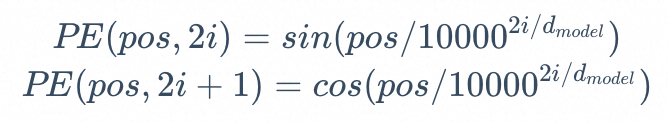

上式中，pos 为 token 在句子中的位置，2i 和 2i+1 则是指示了 token 是奇数位置还是偶数位置，从上式中我们可以看出对于奇数位置的 token 和偶数位置的 token，Transformer 采用了不同的函数进行编码。

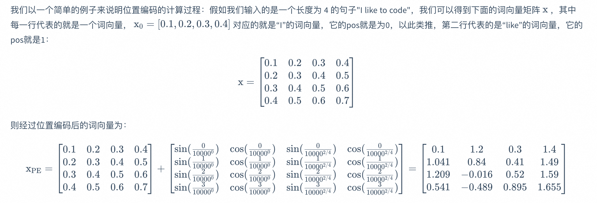

我们可以使用如下的代码来获取上述例子的位置编码：

```python
import numpy as np
import matplotlib.pyplot as plt
def PositionEncoding(seq_len, d_model, n=10000):
    P = np.zeros((seq_len, d_model))
    for k in range(seq_len):
        for i in np.arange(int(d_model/2)):
            denominator = np.power(n, 2*i/d_model)
            P[k, 2*i] = np.sin(k/denominator)
            P[k, 2*i+1] = np.cos(k/denominator)
    return P

P = PositionEncoding(seq_len=4, d_model=4, n=100)
print(P)

```

```python
[[ 0.          1.          0.          1.        ]
 [ 0.84147098  0.54030231  0.09983342  0.99500417]
 [ 0.90929743 -0.41614684  0.19866933  0.98006658]
 [ 0.14112001 -0.9899925   0.29552021  0.95533649]]

```

<font style="color:rgb(52, 73, 94);">这样的位置编码主要有两个好处：</font>

1. <font style="color:rgb(52, 73, 94);">使 PE 能够适应比训练集里面所有句子更长的句子，假设训练集里面最长的句子是有 20 个单词，突然来了一个长度为 21 的句子，则使用公式计算的方法可以计算出第 21 位的 Embedding。</font>
2. <font style="color:rgb(52, 73, 94);">可以让模型容易地计算出相对位置，对于固定长度的间距 k，PE(pos+k) 可以用 PE(pos) 计算得到。因为 Sin(A+B) = Sin(A)Cos(B) + Cos(A)Sin(B), Cos(A+B) = Cos(A)Cos(B) - Sin(A)Sin(B)。</font>

<font style="color:rgb(52, 73, 94);">基于上述原理，我们实现一个位置编码层：</font>

<font style="color:rgb(52, 73, 94);">基于上述原理，我们实现一个位置编码层：</font>

```python

class PositionalEncoding(nn.Module):
    '''位置编码模块'''

    def __init__(self, args):
        super(PositionalEncoding, self).__init__()
        # Dropout 层
        # self.dropout = nn.Dropout(p=args.dropout)

        # block size 是序列的最大长度
        pe = torch.zeros(args.block_size, args.n_embd)
        position = torch.arange(0, args.block_size).unsqueeze(1)
        # 计算 theta
        div_term = torch.exp(
            torch.arange(0, args.n_embd, 2) * -(math.log(10000.0) / args.n_embd)
        )
        # 分别计算 sin、cos 结果
        pe[:, 0::2] = torch.sin(position * div_term)
        pe[:, 1::2] = torch.cos(position * div_term)
        pe = pe.unsqueeze(0)
        self.register_buffer("pe", pe)

    def forward(self, x):
        # 将位置编码加到 Embedding 结果上
        x = x + self.pe[:, : x.size(1)].requires_grad_(False)
        return x

```

### 策略

Transformer 的损失函数通常是 **交叉熵损失**，具体形式根据任务而定：

1. **机器翻译/生成任务**：针对每个词的交叉熵损失。
2. **文本分类**：针对整体类别的交叉熵损失。
3. **问答任务**：起始和结束位置的交叉熵损失。
4. **自监督学习**：如 BERT 的 MLM（遮盖语言模型）和 NSP（下一句预测），使用交叉熵损失。

**核心原因**：交叉熵损失能够优化模型输出的概率分布，使其更接近真实分布，适合处理序列预测和分类任务。

### 算法

**Transformer 一般使用 AdamW 优化器**

1. **自适应学习率**：
   * AdamW 能根据每个参数的梯度动态调整学习率，适应 Transformer 的复杂架构，确保不同参数的更新幅度合理。
2. **权重衰减（Weight Decay）**：
   * AdamW 引入权重衰减正则化，可以有效防止过拟合，特别适合处理大规模模型和数据。
3. **稳定性**：
   * AdamW 对梯度波动具有较强的鲁棒性，避免梯度爆炸或梯度消失问题，保证训练过程稳定。
4. **更快收敛**：
   * AdamW 比标准 Adam 优化器收敛更快，能够更高效地训练 Transformer 模型。
5. **配合学习率调度器**：
   * Transformer 通常结合 **Warmup + Decay** 的学习率策略，与 AdamW 优化器搭配使用，进一步提升训练效果。
   *

Transformer 模型一般使用 **AdamW 优化器**，因为它具有自适应学习率、权重衰减正则化、更快收敛和训练稳定性的优势，是优化 Transformer 的标准选择。

### 一个完整的 Transformer

上述所有组件，再按照下图的 Tranfromer 结构拼接起来就是一个完整的 Transformer 模型了，如图2.7所示：


但需要注意的是，上图是原论文《Attention is all you need》配图，LayerNorm 层放在了 Attention 层后面，也就是“Post-Norm”结构，但在其发布的源代码中，LayerNorm 层是放在 Attention 层前面的，也就是“Pre Norm”结构。考虑到目前 LLM 一般采用“Pre-Norm”结构（可以使 loss 更稳定），本文在实现时采用“Pre-Norm”结构。

如图，经过 tokenizer 映射后的输出先经过 Embedding 层和 Positional Embedding 层编码，然后进入上一节讲过的 N 个 Encoder 和 N 个 Decoder（在 Transformer 原模型中，N 取为6），最后经过一个线性层和一个 Softmax 层就得到了最终输出。

* **<font style="color:#DF2A3F;">input embedding层：</font>**
  * **<font style="color:#DF2A3F;">embedding层</font>**
  * **<font style="color:#DF2A3F;">位置编码层</font>**
* **<font style="color:#DF2A3F;">encoder：</font>**
  * **<font style="color:#DF2A3F;">（多头注意力层<+pre layer norm层>+前馈神经网络层<+pre layer norm层>）* 6</font>*\*
* **<font style="color:#DF2A3F;">decoder：</font>**
  * **<font style="color:#DF2A3F;">output embedding层：</font>**
  * **<font style="color:#DF2A3F;">（\<pre layer norm层+>掩码多头自注意力层+\<pre layer norm层+>多头注意力层+前馈神经网络层<+pre layer norm层>）* 6</font>*\*
* **<font style="color:#DF2A3F;">线性层 \* 1</font>**
* **<font style="color:#DF2A3F;">Softmax 层 \* 1</font>**

```python
class Transformer(nn.Module):
   '''整体模型'''
    def __init__(self, args):
        super().__init__()
        # 必须输入词表大小和 block size
        assert args.vocab_size is not None
        assert args.block_size is not None
        self.args = args
        self.transformer = nn.ModuleDict(dict(
            wte = nn.Embedding(args.vocab_size, args.n_embd),
            wpe = PositionalEncoding(args),
            drop = nn.Dropout(args.dropout),
            encoder = Encoder(args),
            decoder = Decoder(args),
        ))
        # 最后的线性层，输入是 n_embd，输出是词表大小
        self.lm_head = nn.Linear(args.n_embd, args.vocab_size, bias=False)

        # 初始化所有的权重
        self.apply(self._init_weights)

        # 查看所有参数的数量
        print("number of parameters: %.2fM" % (self.get_num_params()/1e6,))

    '''统计所有参数的数量'''
    def get_num_params(self, non_embedding=False):
        # non_embedding: 是否统计 embedding 的参数
        n_params = sum(p.numel() for p in self.parameters())
        # 如果不统计 embedding 的参数，就减去
        if non_embedding:
            n_params -= self.transformer.wte.weight.numel()
        return n_params

    '''初始化权重'''
    def _init_weights(self, module):
        # 线性层和 Embedding 层初始化为正则分布
        if isinstance(module, nn.Linear):
            torch.nn.init.normal_(module.weight, mean=0.0, std=0.02)
            if module.bias is not None:
                torch.nn.init.zeros_(module.bias)
        elif isinstance(module, nn.Embedding):
            torch.nn.init.normal_(module.weight, mean=0.0, std=0.02)
    
    '''前向计算函数'''
    def forward(self, idx, targets=None):
        # 输入为 idx，维度为 (batch size, sequence length, 1)；targets 为目标序列，用于计算 loss
        device = idx.device
        b, t = idx.size()
        assert t <= self.args.block_size, f"不能计算该序列，该序列长度为 {t}, 最大序列长度只有 {self.args.block_size}"

        # 通过 self.transformer
        # 首先将输入 idx 通过 Embedding 层，得到维度为 (batch size, sequence length, n_embd)
        print("idx",idx.size())
        # 通过 Embedding 层
        tok_emb = self.transformer.wte(idx)
        print("tok_emb",tok_emb.size())
        # 然后通过位置编码
        pos_emb = self.transformer.wpe(tok_emb) 
        # 再进行 Dropout
        x = self.transformer.drop(pos_emb)
        # 然后通过 Encoder
        print("x after wpe:",x.size())
        enc_out = self.transformer.encoder(x)
        print("enc_out:",enc_out.size())
        # 再通过 Decoder
        x = self.transformer.decoder(x, enc_out)
        print("x after decoder:",x.size())

        if targets is not None:
            # 训练阶段，如果我们给了 targets，就计算 loss
            # 先通过最后的 Linear 层，得到维度为 (batch size, sequence length, vocab size)
            logits = self.lm_head(x)
            # 再跟 targets 计算交叉熵
            loss = F.cross_entropy(logits.view(-1, logits.size(-1)), targets.view(-1), ignore_index=-1)
        else:
            # 推理阶段，我们只需要 logits，loss 为 None
            # 取 -1 是只取序列中的最后一个作为输出
            logits = self.lm_head(x[:, [-1], :]) # note: using list [-1] to preserve the time dim
            loss = None

        return logits, loss

```

注意，上述代码除去搭建了整个 Transformer 结构外，我们还额外实现了三个函数：

get\_num\_params：用于统计模型的参数量

\_init\_weights：用于对模型所有参数进行随机初始化

forward：前向计算函数

另外，在前向计算函数中，我们对模型使用 pytorch 的交叉熵函数来计算损失，对于不同的损失函数，读者可以查阅 Pytorch 的官方文档，此处就不再赘述了。

经过上述步骤，我们就可以从零“手搓”一个完整的、可计算的 Transformer 模型。限于本书主要聚焦在 LLM，在本章，我们就不再详细讲述如何训练 Transformer 模型了；在后文中，我们将类似地从零“手搓”一个 LLaMA 模型，并手把手带大家训练一个属于自己的 Tiny LLaMA。

## 参考资料

* <https://datawhalechina.github.io/happy-llm/#/./chapter2/%E7%AC%AC%E4%BA%8C%E7%AB%A0%20Transformer%E6%9E%B6%E6%9E%84>
* 如何理解卷积神经网络中的权值共享？ - superbrother的回答 - 知乎<https://www.zhihu.com/question/47158818/answer/670431317>
* [【循环神经网络】5分钟搞懂RNN，3D动画深入浅出\_哔哩哔哩\_bilibili](https://www.bilibili.com/video/BV1z5411f7Bm/?spm_id_from=333.337.search-card.all.click\&vd_source=a637826c55b409b420b4b6584a6e8379)
* [CNN](https://www.yuque.com/pengcheng-fuigs/el3mi0/qv7nsox2u54fttrd)
* [RNN & LSTM](https://www.yuque.com/pengcheng-fuigs/el3mi0/pfui16euoot1cqxb)
* 动图轻松理解Self-Attention(自注意力机制) - 000\_error的文章 - 知乎

<https://zhuanlan.zhihu.com/p/619154409>


> 更新: 2025-08-04 12:18:25  
> 原文: <https://www.yuque.com/viruspc/el3mi0/rmmnbzdtrhexiukm>