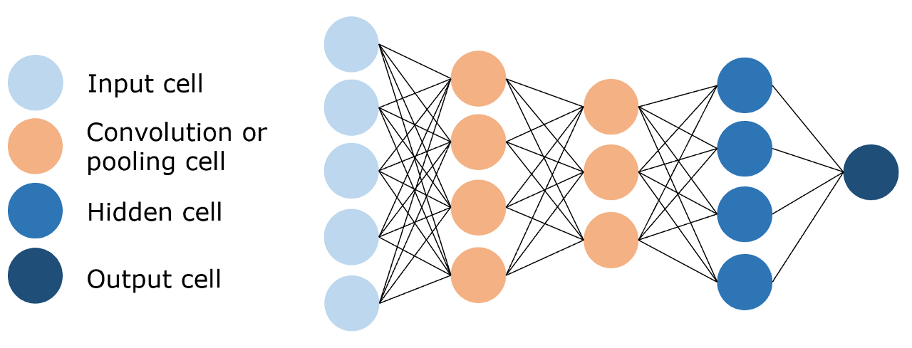
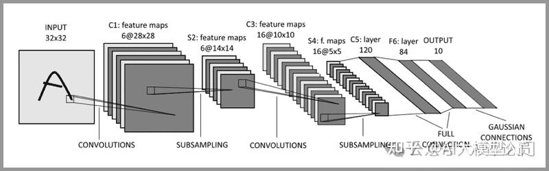

# CNN

+ 卷积神经网络（Convolutional Neural Network，CNN），即训练参数量远小于全连接神经网络的卷积层来进行特征提取和学习，如图所示:
    - 为什么 CNN 的参数量小？[https://www.zhihu.com/question/47158818/answer/670431317](https://www.zhihu.com/question/47158818/answer/670431317)
        * 局部连接（卷积层）：只关注图像的局部区域，减少了连接数。
        * 参数共享（卷积层）：卷积核在空间上共享权重，进一步减少了参数量。卷积核的参数在卷积层中的意义相当于全连接层中的权重参数。通过 反向传播算法 和 梯度下降 不断调整。
        * 池化操作（池化层）：池化层通过降维进一步减少计算量。池化层的主要作用就是对特征图进行下采样
    - 核心组成部分：
        * 输入层：接收原始数据。
        * **卷积层**：提取特征。
        * **池化层**：下采样特征图，降低计算复杂度。
        * **全连接层**：将池化层输出的特征展平为一维向量，并通过线性组合生成最终表示。
        * 输出层：根据任务类型，输出结果

    - 。
    - 

> 更新: 2025-07-26 10:08:44  
> 原文: <https://www.yuque.com/viruspc/el3mi0/qv7nsox2u54fttrd>