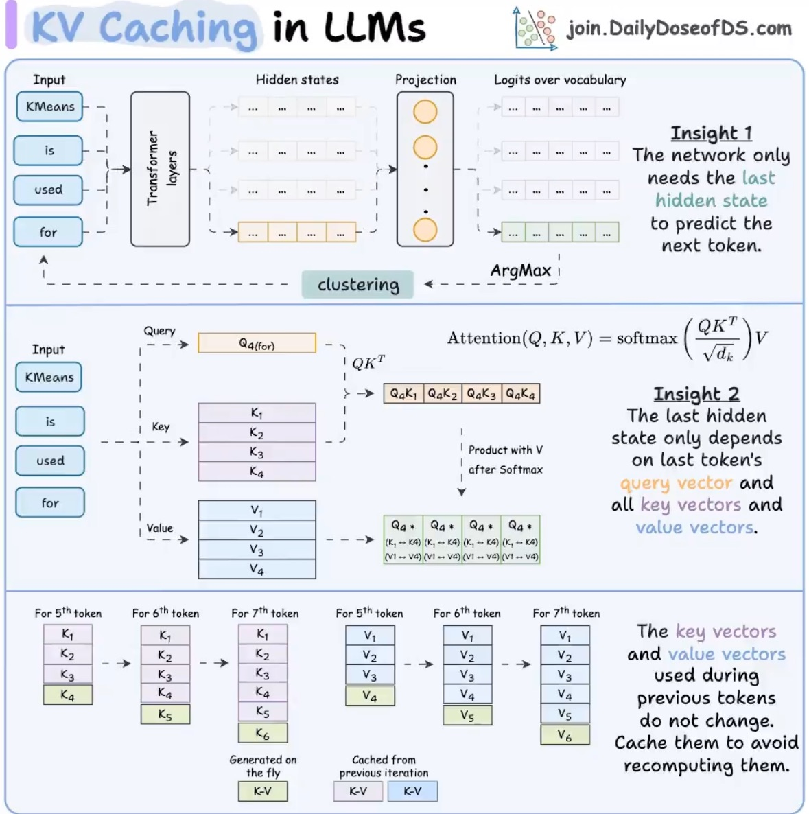

# KV Cache

- [**1. Attention机制中的 Q, K, V**](#1-attention%E6%9C%BA%E5%88%B6%E4%B8%AD%E7%9A%84-q-k-v)
- [**2. KV Cache 的作用**](#2-kv-cache-%E7%9A%84%E4%BD%9C%E7%94%A8)
- [**3. KV Cache 的优势**](#3-kv-cache-%E7%9A%84%E4%BC%98%E5%8A%BF)
- [**4. KV Cache 在实际应用中的场景**](#4-kv-cache-%E5%9C%A8%E5%AE%9E%E9%99%85%E5%BA%94%E7%94%A8%E4%B8%AD%E7%9A%84%E5%9C%BA%E6%99%AF)
- [**总结**](#%E6%80%BB%E7%BB%93)

---

[https://medium.com/@joaolages/kv-caching-explained-276520203249](https://medium.com/@joaolages/kv-caching-explained-276520203249)

[https://x.com/_avichawla/status/1975448891022844202?s=46](https://x.com/_avichawla/status/1975448891022844202?s=46)

是的，KV Cache 通常指的是 Transformer 模型中 **Attention机制** 中的 **Key (K)** 和 **Value (V)** 的缓存。它是为了优化模型在处理长序列或多次推理时的性能和计算成本而设计的。

以下是 KV Cache 的工作原理及其与 Attention 的关系：

---

### **1. Attention机制中的 Q, K, V**
在 Transformer 模型中，Attention机制的核心是通过三个矩阵进行计算：

+ **Query (Q)**: 表示当前需要关注的信息。
+ **Key (K)**: 表示序列中每个位置的特征，用于匹配 Query。
+ **Value (V)**: 表示序列中每个位置的具体信息，用于生成输出。

Attention 的计算公式为：  
[  
\text{Attention}(Q, K, V) = \text{softmax}\left(\frac{QK^T}{\sqrt{d_k}}\right)V  
]  
其中：

+ (QK^T)：计算 Query 和 Key 的相似度。
+ (V)：根据相似度加权生成最终的输出。

---

### **2. KV Cache 的作用**
在推理阶段（尤其是生成任务中，如文本生成），模型通常是逐步生成输出的。每次生成一个新 token，都需要重新计算 Attention，这可能会重复计算之前的序列的 Key 和 Value，导致计算成本很高。

为了优化这一过程，KV Cache 的作用是：

+ **缓存之前计算的 Key (K) 和 Value (V)**。
+ 在生成新 token 时，直接使用缓存的 K 和 V，而不是重新计算整个序列。
+ 只需要计算当前的 Query (Q)，然后与缓存的 K 和 V 进行 Attention。

---

### **3. KV Cache 的优势**
+ **性能优化**：避免重复计算历史序列的 Key 和 Value，显著减少计算量。
+ **内存优化**：通过缓存 K 和 V，减少重复的矩阵操作。
+ **适用于长序列**：对于长序列生成任务，KV Cache 能够有效降低计算复杂度。

---

### **4. KV Cache 在实际应用中的场景**
KV Cache 在以下场景中非常重要：

+ **文本生成**：如 GPT 模型生成长文本时，使用 KV Cache 可以加速推理。
+ **对话系统**：在多轮对话中，KV Cache 保存了上下文信息，避免重复计算。
+ **实时推理**：如机器翻译、自动补全等任务，KV Cache 可以提高响应速度。

---

### **总结**
KV Cache 是 Attention 机制中的 Key 和 Value 的缓存，它的核心思想是避免在推理阶段重复计算历史序列的 Key 和 Value，从而优化性能和成本。它是 LLM 中提升推理效率的关键技术之一。

> 更新: 2025-10-07 16:17:16  
> 原文: <https://www.yuque.com/viruspc/el3mi0/zcglca4b0g4ekrb9>