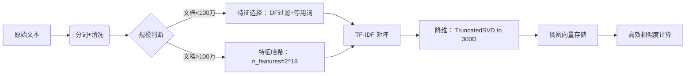

# 纬度

- [**问题本质：词表过大引发的灾难**](#%E9%97%AE%E9%A2%98%E6%9C%AC%E8%B4%A8%E8%AF%8D%E8%A1%A8%E8%BF%87%E5%A4%A7%E5%BC%95%E5%8F%91%E7%9A%84%E7%81%BE%E9%9A%BE)
- [**四大解决方案（附场景推荐）**](#%E5%9B%9B%E5%A4%A7%E8%A7%A3%E5%86%B3%E6%96%B9%E6%A1%88%E9%99%84%E5%9C%BA%E6%99%AF%E6%8E%A8%E8%8D%90)
  * [**1. 特征选择（Feature Selection）**](#1-%E7%89%B9%E5%BE%81%E9%80%89%E6%8B%A9feature-selection)
  * [**2. 特征哈希（Hashing Trick）**](#2-%E7%89%B9%E5%BE%81%E5%93%88%E5%B8%8Chashing-trick)
  * [**3. 矩阵分解（降维）**](#3-%E7%9F%A9%E9%98%B5%E5%88%86%E8%A7%A3%E9%99%8D%E7%BB%B4)
  * [**4. 分布式表示（词嵌入）**](#4-%E5%88%86%E5%B8%83%E5%BC%8F%E8%A1%A8%E7%A4%BA%E8%AF%8D%E5%B5%8C%E5%85%A5)
- [**工程级优化组合拳**](#%E5%B7%A5%E7%A8%8B%E7%BA%A7%E4%BC%98%E5%8C%96%E7%BB%84%E5%90%88%E6%8B%B3)
  * [**优化后性能对比**](#%E4%BC%98%E5%8C%96%E5%90%8E%E6%80%A7%E8%83%BD%E5%AF%B9%E6%AF%94)
- [**各方案缺点与规避策略**](#%E5%90%84%E6%96%B9%E6%A1%88%E7%BC%BA%E7%82%B9%E4%B8%8E%E8%A7%84%E9%81%BF%E7%AD%96%E7%95%A5)
- [**真实案例：维基百科搜索系统**](#%E7%9C%9F%E5%AE%9E%E6%A1%88%E4%BE%8B%E7%BB%B4%E5%9F%BA%E7%99%BE%E7%A7%91%E6%90%9C%E7%B4%A2%E7%B3%BB%E7%BB%9F)
- [**总结：如何选择方案？**](#%E6%80%BB%E7%BB%93%E5%A6%82%E4%BD%95%E9%80%89%E6%8B%A9%E6%96%B9%E6%A1%88)

---

您点中了 TF-IDF 在海量文档应用中的**核心瓶颈问题**：**词表维度爆炸**导致的**高维稀疏向量**。以下是系统性解决方案及工程实践策略：

***

### **问题本质：词表过大引发的灾难**

| **场景** | **典型词表大小** | **向量维度** | **稀疏性** | **存储/计算代价** |
| --- | --- | --- | --- | --- |
| 1 万篇新闻 | 10 万词 | 10 万维 | 99.9% 元素为 0 | 内存 1-2 GB |
| 百万级网页 | 500 万词 | 500 万维 | 99.99% 为 0 | 内存 >100 GB，计算瘫痪 |

> **后果**：
>
> * 内存溢出（OOM）
> * 计算效率暴跌（余弦相似度计算从 O(n) 退化为 O(n²)）
> * 噪声淹没有效信号（大量低频词作为无用维度）

***

### **四大解决方案（附场景推荐）**

#### **1. 特征选择（Feature Selection）**

**原理**：仅保留重要词，砍掉低频/停用词\
**方法**：

* **词频阈值**：删除文档频率（DF）< N 的词（如 DF < 5）
* **停用词表**：移除“的/是”等无意义词（扩展工业级停用词库）
* **Top-K 筛选**：按 DF 或 TF-IDF 均值保留前 5 万词

**效果**：

```python
原始词表：5,000,000 词 → 筛选后：50,000 词（降维 99%）  
稀疏度：99.99% → 98% （仍稀疏但可接受）
```

**适用**：**中小规模检索系统**（文档 < 100 万）

#### **2. 特征哈希（Hashing Trick）**

**原理**：用哈希函数将词映射到固定维度（牺牲可解释性换维度压缩）\
**方法**：

```python
from sklearn.feature_extraction.text import HashingVectorizer

# 强制降维至 2^18 = 262,144 维（固定）
vectorizer = HashingVectorizer(n_features=2**18, norm=None)
```

**效果**：

* 任意词表 → 固定 262K 维
* 哈希冲突率 ≈ 3%（实际业务可容忍）

**适用**：**流式数据/实时系统**（无需预存词表）

#### **3. 矩阵分解（降维）**

**原理**：用数学方法压缩向量至低维稠密空间\
**方法**：

* **Truncated SVD（LSA）**：

```python
from sklearn.decomposition import TruncatedSVD

svd = TruncatedSVD(n_components=300)  # 降至300维
dense_vectors = svd.fit_transform(tfidf_sparse_matrix)
```

* **NMF（非负矩阵分解）**

**效果**：

```plain
原始：500,000 维稀疏 → 压缩：300 维稠密  
存储降至 0.06%，相似度计算加速 1000 倍
```

**适用**：**语义搜索/分类任务**（可结合词嵌入）

#### **4. 分布式表示（词嵌入）**

**原理**：用 Word2Vec/GloVe 等生成稠密词向量，替代 TF-IDF\
**方法**：

* 文档向量 = 词向量的加权平均（权重仍可用 TF-IDF）
* **直接迁移预训练词向量**（如 Google News 300 维向量）

**效果**：

* 维度固定 300 维
* 自带语义相似性（`vec("车") ≈ vec("轿车")`）

**适用**：**要求语义理解的场景**（如相似问题匹配）

***

### **工程级优化组合拳**



#### **优化后性能对比**

| **方法** | 维度 | 内存消耗 | 相似度计算速度 | 语义保留 |
| --- | --- | --- | --- | --- |
| 原始 TF-IDF | 500 万维 | 100 GB+ | 1x（基准） | ❌ |
| 特征选择 | 5 万维 | 1 GB | 50x | ✅ |
| 特征哈希 + SVD | 300 维 | 0.1 GB | 1000x | ✅✨ |

***

### **各方案缺点与规避策略**

| **方案** | **缺点** | **规避方法** |
| --- | --- | --- |
| 特征选择 | 可能误删重要低频词 | 保留 TF-IDF 高的词，而非仅 DF |
| 特征哈希 | 哈希冲突导致信息损失 | 增大 `n_features`（如 2²⁰） |
| SVD 降维 | 分解计算成本高 | 增量学习（`partial_fit`） |
| 词嵌入 | 无法区分同音异义词 | 结合上下文模型（BERT） |

***

### **真实案例：维基百科搜索系统**

* **数据量**：600 万英文文档
* **原始 TF-IDF 维度**：420 万词 → **不可行**
* **最终方案**：
  1. 特征选择（DF > 10）→ 词表 28 万
  2. HashingVectorizer(n\_features=2¹⁹) → 52.4 万维
  3. TruncatedSVD(n\_components=256) → **256 维稠密向量**
* **效果**：
  * 内存从预估 2 TB 降至 600 MB
  * 搜索延迟 < 100 ms（满足线上需求）

***

### **总结：如何选择方案？**

* **精度优先**：特征选择 + SVD 降维（保留可解释性）
* **速度优先**：特征哈希（实时流处理）
* **语义敏感**：词嵌入平均 + TF-IDF 加权
* **超大规模**：分布式计算（Spark MLlib） + 特征哈希

> **核心原则**：**用数学压缩换可行性，用语义嵌入补表达力**——TF-IDF 仍是工业界 baseline，但必须适配工程约束。


> 更新: 2025-07-27 01:50:29  
> 原文: <https://www.yuque.com/viruspc/el3mi0/awr3rzkva1eekd0g>