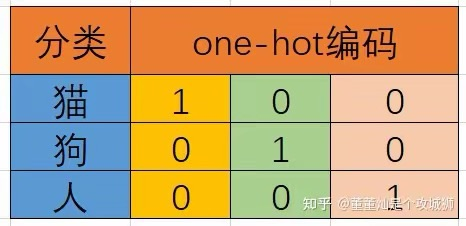

# One hot

- [**何时使用 One-Hot 编码？**](#%E4%BD%95%E6%97%B6%E4%BD%BF%E7%94%A8-one-hot-%E7%BC%96%E7%A0%81)

---

**解决问题：label encoding，用0/1/2/...简单表示，token之间的距离混乱，无法进行损失计算。**

**解决方案：one-hot，所有token之间距离相等，可以进行损失计算。**

**仍存问题：**

1. **高纬 => 灾难、稀疏性**
2. **距离相等 => 无法计算相似度。**

one-hot，也叫独热编码。

one-hot 编码用于将离散的分类标签转换为二进制向量。

在神经网络中，需要一种数学的表示方法，来表示猫、狗、人的分类。

最容易想到的，便是以 0 代表猫，以 1 代表狗，以 2 代表人这种简单粗暴的方式。

那这样行不行呢？肯定不行。

相似性其实就是两个标签之间的距离。如果按照 0 代表猫， 1 代表狗， 2 代表人这种表示方法，那么猫和狗之间距离为 1， 狗和人之间距离为 1， 而猫和人之间距离为 2。

这在参与损失计算的时候是完全不能接受的：互相独立的标签之间，竟然出现了不对等的情况。

因此，需要有一种表示方法，将互相独立的标签表示为互相独立的数字，并且数字之间的距离也相等。

我们学过几何，在三维坐标系下，[1, 0, 0]、[0, 1, 0]和[0, 0, 1]这三个向量是互相垂直的，也就是互相正交独立。

他们之间距离相等，这就解决了上面说的独立的标签之间，表示方法不对等的情况。

当然one-hot编码有它的局限性，纬度灾难和稀疏性。以及，无法计算相似度。

替代方案：

1. **标签编码（Label Encoding）**  
    - 直接将类别映射为整数（如“红=0，蓝=1，绿=2”）。  
    - **适用场景**：类别有内在顺序（如学历“小学<中学<大学”）。
2. **目标编码（Target Encoding）**  
    - 用目标变量的统计值（如均值）替代类别标签。  
    - **适用场景**：高基数类别（如城市名称）。
3. **嵌入（Embedding）**  
    - 通过神经网络学习低维稠密向量表示（常用于深度学习）。

### **何时使用 One-Hot 编码？**
+ 类别数量较少（通常 < 15）。  
+ 类别之间无顺序关系（如性别、颜色）。  
+ 模型对输入敏感（如线性模型、SVM、神经网络）。
+ 不需要计算相似度 和 损失计算？

**避免使用**：  

+ 类别数量极大（如用户ID、商品SKU）。  
+ 数据稀疏性要求严格（如实时推荐系统）。

[https://zhuanlan.zhihu.com/p/634296763?utm_psn=1886947396015087678](https://zhuanlan.zhihu.com/p/634296763?utm_psn=1886947396015087678)

> 更新: 2025-08-03 01:54:55  
> 原文: <https://www.yuque.com/viruspc/el3mi0/nlgile5qtnzxpxmv>