# RNN & LSTM

- [RNN](#rnn)
- [LSTM](#lstm)
- [参考](#%E5%8F%82%E8%80%83)

---

## RNN
循环神经网络（Recurrent Neural Network，RNN），RNN出现的目的是来处理**序列数据**的。能够使用历史信息作为输入、包含环和自重复的网络。可以用来做动态embeding。如图所示:

+ 核心组成部分
    - 输入层
    - 循环层（核心层）。捕获序列数据中的时间依赖关系。每个时间步都会根据当前输入和上一个时间步的隐藏状态进行计算
    - 全连接层。对循环层的输出进行进一步处理，用于生成最终的结果。
    - 输出层

+ 
+ 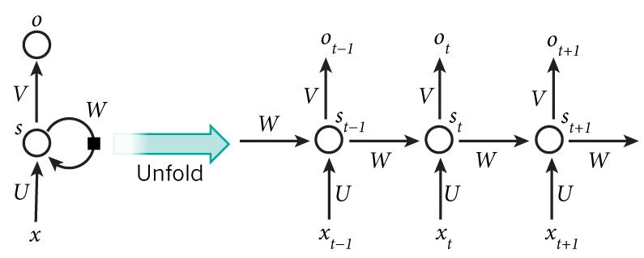
+ 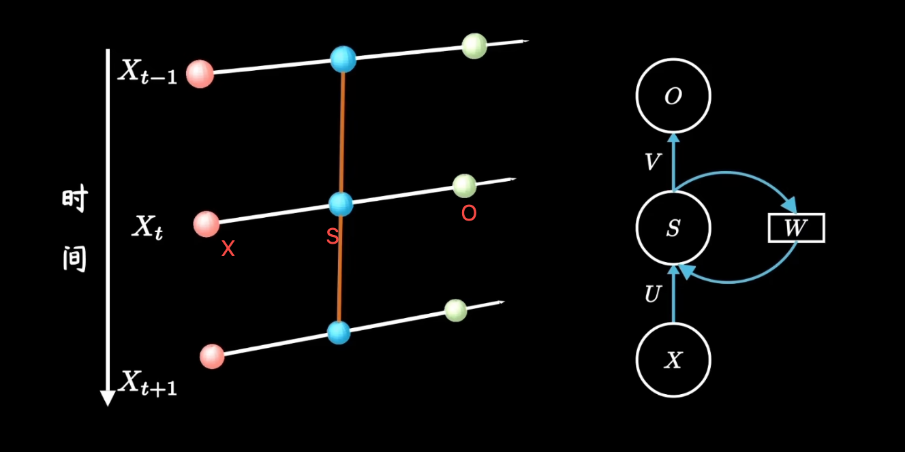
+ 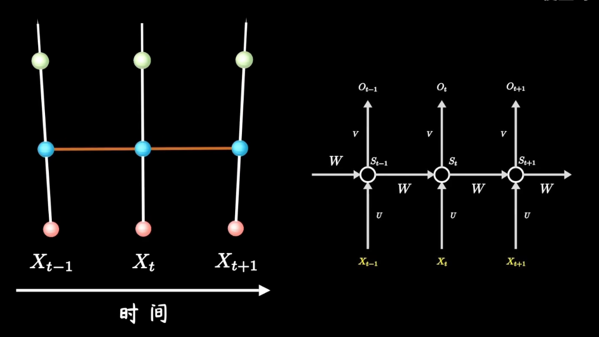
+ 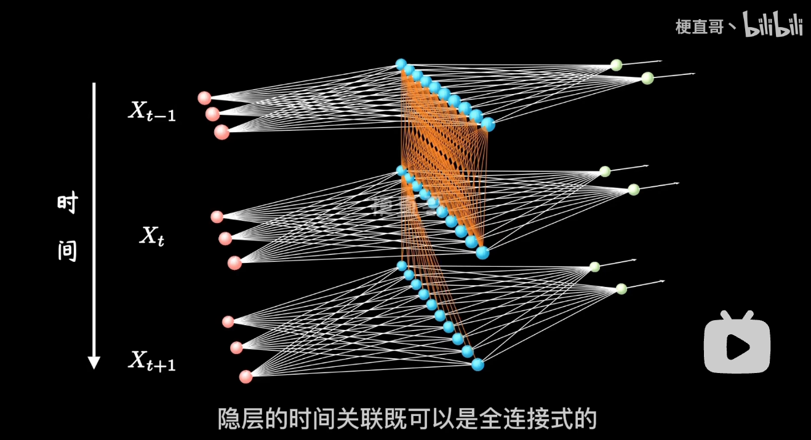
+ 多个时间层级间，权重共享一个W_s
+ 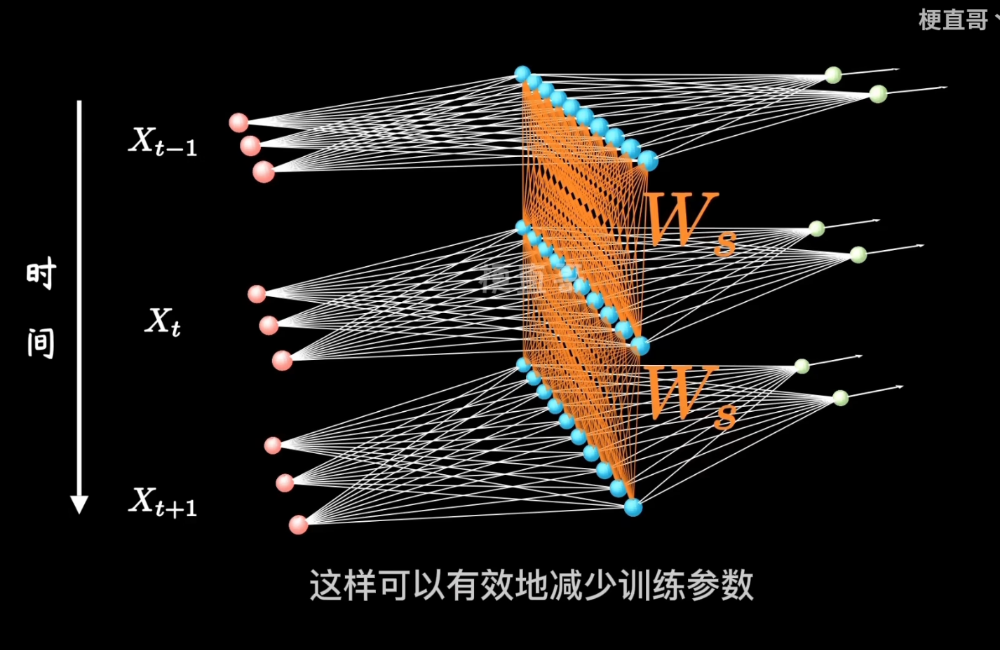
+ 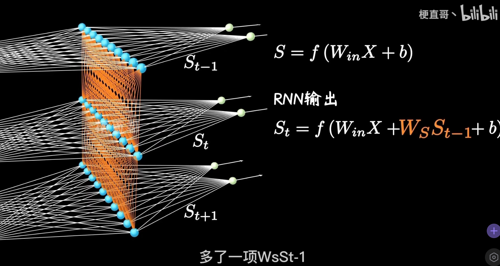

应用：

1 to n：

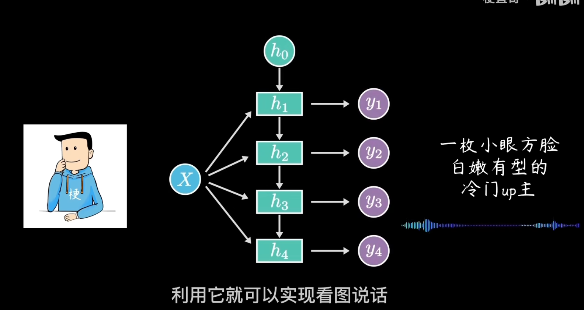

n to 1:

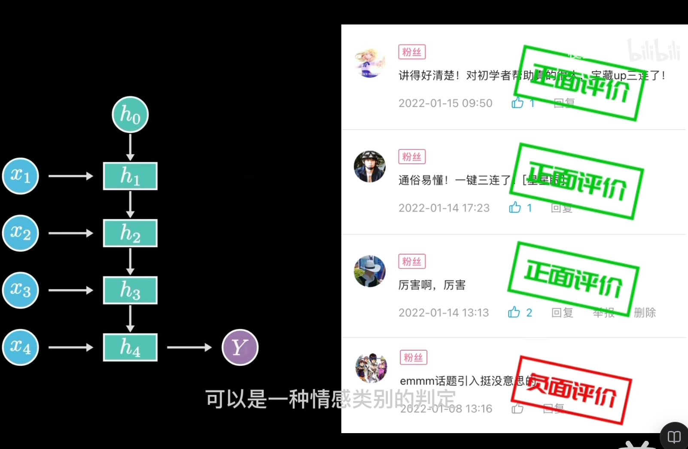

n to n，输入输出等长

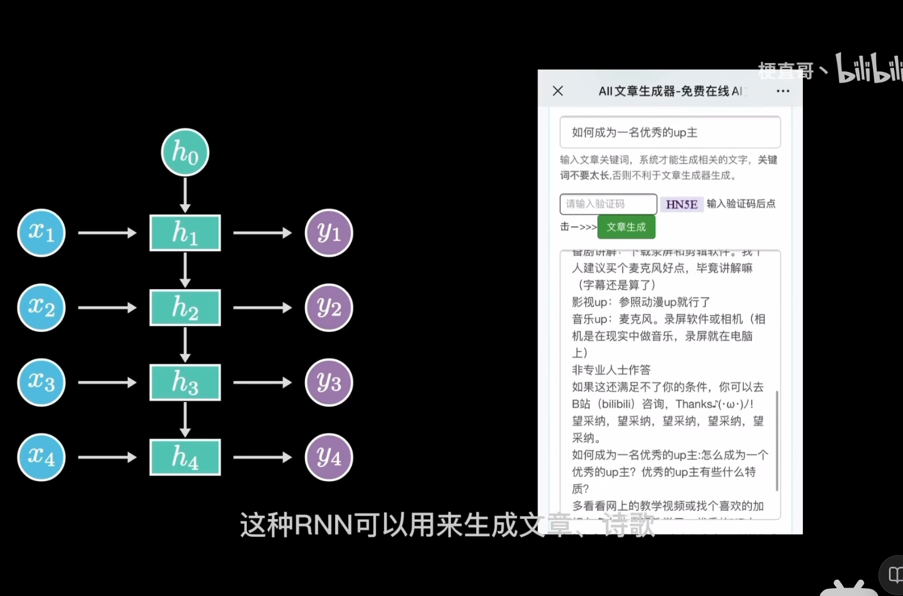

n to m，输入输出不等长

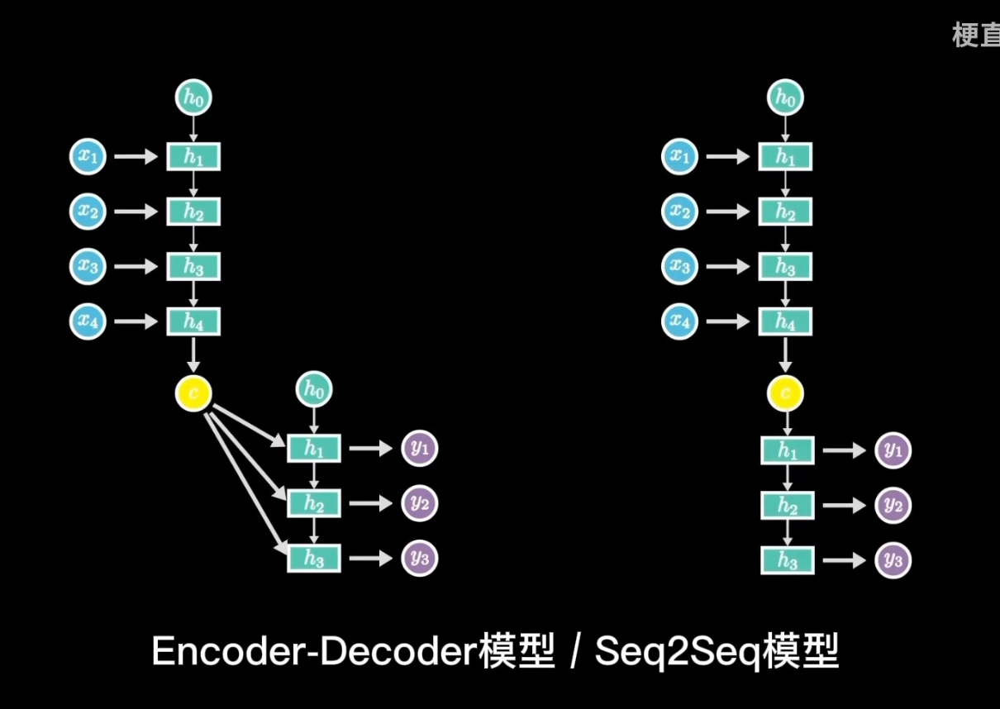

RNN在小数据集，低算力的情况下非常有效

## LSTM
RNN只看上一步，是一种short term memory。通常情况下，RNN超过10步就会忘记。

于是，人们在RNN基础上，提出了LSTM，长短期记忆网络。LSTM增加了一条新的时间链，记录long term memory。

和RNN相比，LSTM在计算隐藏层状态S_t时，除了输入和前一时刻，还要包含当前时刻的日记C_t。同时保留短期记忆链S_t和长期记忆链C_t，并且互相更新，就是LSTM的核心。C_t上有两个重要操作，forgeot gate和input gate，用于实现忽略无关信息、关注重要片段。

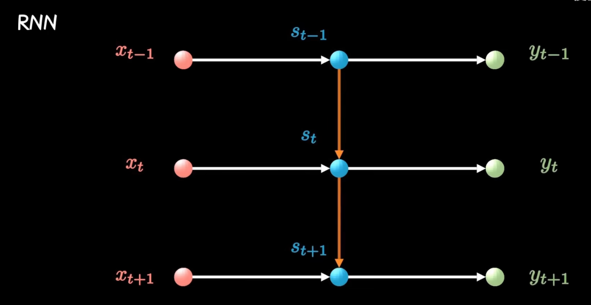

L

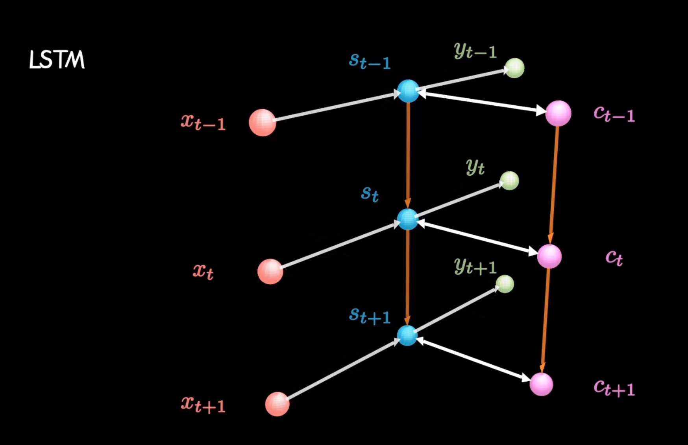

日记（细胞状态，Cell State）的遗忘和写入：

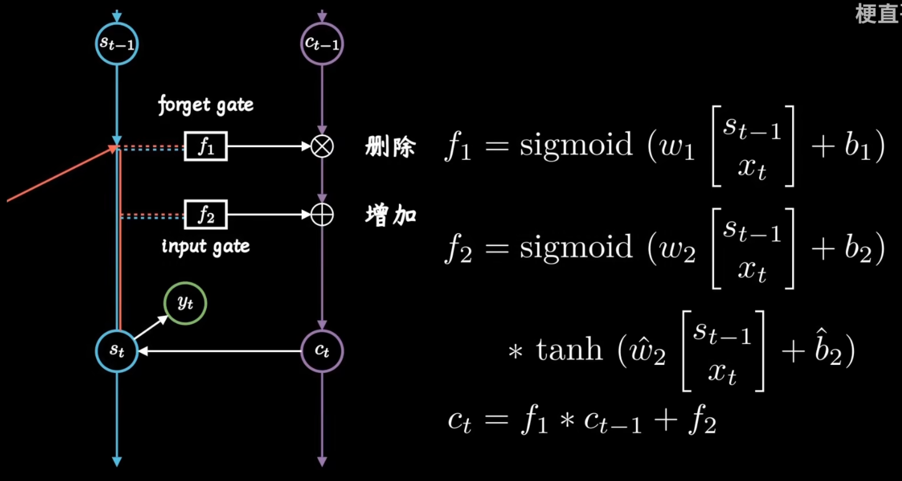

**LSTM：**一种改进的循环神经网络，通过输入门、遗忘门和输出门控制信息流动，并利用细胞状态保存长期记忆。这种门控机制有效解决了传统RNN的梯度消失问题，使其能够学习长序列中的依赖关系，在机器翻译、语音识别等时序任务中表现优异，显著优于标准RNN。

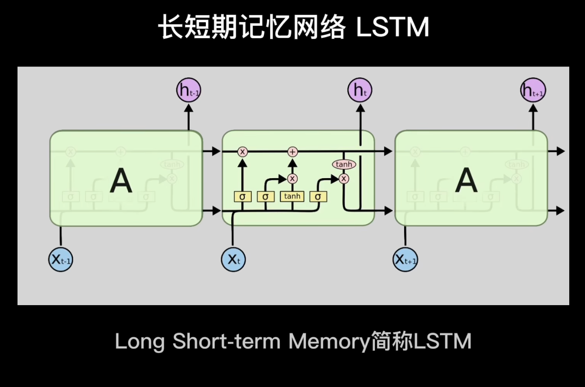

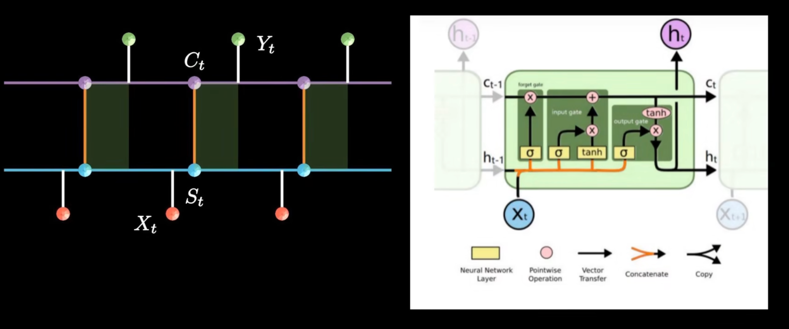

与RNN相比，LSTM引入了更多参数矩阵，训练起来更麻烦些。但总归还是梯度下降+反向传播。

## 参考
+ [【循环神经网络】5分钟搞懂RNN，3D动画深入浅出_哔哩哔哩_bilibili](https://www.bilibili.com/video/BV1z5411f7Bm/?spm_id_from=333.337.search-card.all.click&vd_source=a637826c55b409b420b4b6584a6e8379)
+ [【LSTM长短期记忆网络】3D模型一目了然，带你领略算法背后的逻辑_哔哩哔哩_bilibili](https://www.bilibili.com/video/BV1Z34y1k7mc?spm_id_from=333.788.videopod.sections&vd_source=a637826c55b409b420b4b6584a6e8379)

> 更新: 2025-07-26 10:07:46  
> 原文: <https://www.yuque.com/viruspc/el3mi0/pfui16euoot1cqxb>