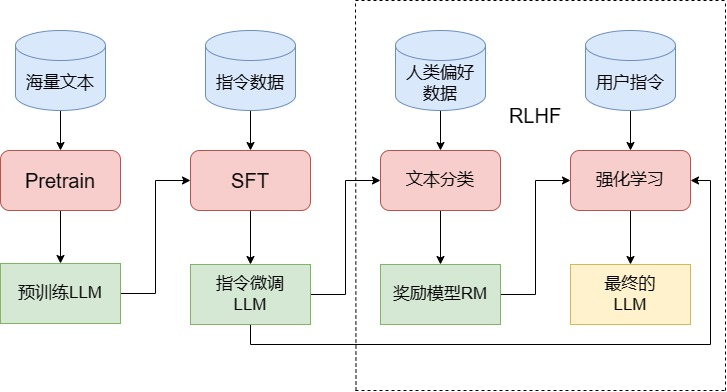

# 大语言模型

- [什么是LLM](#%E4%BB%80%E4%B9%88%E6%98%AFllm)
  * [LLM的定义](#llm%E7%9A%84%E5%AE%9A%E4%B9%89)
  * [LLM的能力](#llm%E7%9A%84%E8%83%BD%E5%8A%9B)
    + [涌现能力（Emergent Abilities）](#%E6%B6%8C%E7%8E%B0%E8%83%BD%E5%8A%9Bemergent-abilities)
    + [上下文学习（In-context Learning）](#%E4%B8%8A%E4%B8%8B%E6%96%87%E5%AD%A6%E4%B9%A0in-context-learning)
    + [指令遵循（Instruction Following）](#%E6%8C%87%E4%BB%A4%E9%81%B5%E5%BE%AAinstruction-following)
    + [逐步推理（Step by Step Reasoning）](#%E9%80%90%E6%AD%A5%E6%8E%A8%E7%90%86step-by-step-reasoning)
  * [LLM的其他特点](#llm%E7%9A%84%E5%85%B6%E4%BB%96%E7%89%B9%E7%82%B9)
    + [多语言支持](#%E5%A4%9A%E8%AF%AD%E8%A8%80%E6%94%AF%E6%8C%81)
    + [长文本处理](#%E9%95%BF%E6%96%87%E6%9C%AC%E5%A4%84%E7%90%86)
    + [拓展多模态](#%E6%8B%93%E5%B1%95%E5%A4%9A%E6%A8%A1%E6%80%81)
    + [挥之不去的幻觉](#%E6%8C%A5%E4%B9%8B%E4%B8%8D%E5%8E%BB%E7%9A%84%E5%B9%BB%E8%A7%89)
- [如何训练一个 LLM](#%E5%A6%82%E4%BD%95%E8%AE%AD%E7%BB%83%E4%B8%80%E4%B8%AA-llm)
  * [Pretrain](#pretrain)
  * [SFT](#sft)
  * [RLHF](#rlhf)
- [如何训练一个LLM](#%E5%A6%82%E4%BD%95%E8%AE%AD%E7%BB%83%E4%B8%80%E4%B8%AAllm)
- [参考](#%E5%8F%82%E8%80%83)

---

## 什么是LLM

在前三章，我们从 NLP 的定义与主要任务出发，介绍了引发 NLP 领域重大变革的核心思想——注意力机制与 Transformer 架构。随着 Transformer 架构的横空出世，NLP 领域逐步进入预训练-微调范式，以 Transformer 为基础的、通过预训练获得强大文本表示能力的预训练语言模型层出不穷，将 NLP 的各种经典任务都推进到了一个新的高度。

随着2022年底 ChatGPT 再一次刷新 NLP 的能力上限，大语言模型（Large Language Model，LLM）开始接替传统的预训练语言模型（Pre-trained Language Model，PLM） 成为 NLP 的主流方向，基于 LLM 的全新研究范式也正在刷新被 BERT 发扬光大的预训练-微调范式，NLP 由此迎来又一次翻天覆地的变化。从2022年底至今，LLM 能力上限不断刷新，通用基座大模型数量指数级上升，基于 LLM 的概念、应用也是日新月异，预示着大模型时代的到来。

**究竟什么是 LLM，LLM 和传统的 PLM 的核心差异在哪里？**

在本章中，我们将结合上文的模型架构讲解，深入分析 LLM 的定义、特点及其能力，为读者揭示 LLM 与传统深度学习模型的核心差异，并在此基础上，展示 LLM 的实际三阶段训练过程，帮助读者从概念上梳理清楚 LLM 是如何获得这样的独特能力的，从而为进一步实践 LLM 完整训练提供理论基础。

### LLM的定义

相较传统语言模型参数量更多、在更大规模语料上进行预训练的语言模型。

语言模型：通过预测下一个 token 任务（CLM、MLM、NSP）来训练的 NLP 模型。

LLM：LLM 使用与传统预训练语言模型相似的架构与预训练任务（如 Decoder-Only 架构与 CLM 预训练任务），但拥有更庞大的参数、在更海量的语料上进行预训练，也从而展现出与传统预训练语言模型截然不同的能力。

<font style="color:rgb(52, 73, 94);">一般来说，LLM 指包含</font>**<font style="color:rgb(44, 62, 80);">数百亿（或更多）参数的语言模型</font>**<font style="color:rgb(52, 73, 94);">，它们往往在</font>**<font style="color:rgb(44, 62, 80);">数 T token 语料上</font>**<font style="color:rgb(52, 73, 94);">通过多卡分布式集群进行预训练，具备远超出传统预训练模型的文本理解与生成能力。不过，随着 LLM 研究的不断深入，多种参数尺寸的 LLM 逐渐丰富，广义的 LLM 一般覆盖了从</font>**<font style="color:rgb(44, 62, 80);">十亿参数</font>**<font style="color:rgb(52, 73, 94);">（如 Qwen-1.5B）到</font>**<font style="color:rgb(44, 62, 80);">千亿参数</font>**<font style="color:rgb(52, 73, 94);">（如 Grok-314B）的所有大型语言模型。只要模型展现出</font>**<font style="color:rgb(44, 62, 80);">涌现能力</font>**<font style="color:rgb(52, 73, 94);">，即在一系列复杂任务上表现出远超传统预训练模型（如 BERT、T5）的能力与潜力，都可以称之为 LLM。</font>

一般认为，GPT-3（1750亿参数）是 LLM 的开端，基于 GPT-3 通过 预训练（Pretraining）、监督微调（Supervised Fine-Tuning，SFT）、强化学习与人类反馈（Reinforcement Learning with Human Feedback，RLHF）三阶段训练得到的 ChatGPT 更是主导了 LLM 时代的到来。

### LLM的能力

#### 涌现能力（Emergent Abilities）

区分 LLM 与传统 PLM 最显著的特征即是 LLM 具备 涌现能力 。

涌现能力是指同样的模型架构与预训练任务下，某些能力在小型模型中不明显，但在大型模型中特别突出。可以类比到物理学中的相变现象，涌现能力的显现就像是\*\*<font style="color:#DF2A3F;">模型性能随着规模增大而迅速提升</font>\*\*，超过了随机水平，也就是我们常说的量变引起了质变。

#### 上下文学习（In-context Learning）

上下文学习（也被称为few-shot）是指允许语言模型\*\*<font style="color:#DF2A3F;">在提供自然语言指令或多个任务示例</font>\*\*的情况下，通过理解上下文并生成相应输出的方式来执行任务，而无需额外的训练或参数更新。

Prompt Engineering 的关键。

而通过使用具备上下文学习能力的 LLM，一般范式开始向 \*\*<font style="color:#DF2A3F;">Prompt Engineering </font>\*\*也就是调整 Prompt 来激发 LLM 的能力转变。例如，目前绝大部分 NLP 任务，通过调整 Prompt 或提供 1~5 个自然语言示例，就可以令 GPT-4 达到超过传统 PLM 微调的效果。

#### 指令遵循（Instruction Following）

**<font style="color:#DF2A3F;">通过使用自然语言描述的多任务数据进行微调，也就是所谓的 指令微调 </font>**，LLM 被证明在同样使用指令形式化描述的未见过的任务上表现良好。也就是说，经过指令微调的 LLM 能够理解并遵循未见过的指令，并根据任务指令执行任务，而无需事先见过具体示例，这展示了其强大的泛化能力。

指令微调涉及参数更新，chatgpt对话不涉及。

指令遵循能力意味我们不再需要每一件事都先教模型，然后它才能去做。我们只需要在指令微调阶段混合多种指令来训练其泛化能力，LLM 就可以处理人类绝大部分指令，即可以灵活地解决用户遇到的问题

#### 逐步推理（Step by Step Reasoning）

传统的 NLP 模型通常难以解决涉及多个推理步骤的复杂任务，例如数学问题。然而，LLM 通过采用\*\*<font style="color:#DF2A3F;">思维链（Chain-of-Thought，CoT）</font>\*\*推理策略，可以利用包含中间推理步骤的提示机制来解决这些任务，从而得出最终答案。

### LLM的其他特点

#### 多语言支持

多语言、跨语言模型曾经是 NLP 的一个重要研究方向，但 LLM 由于需要使用到海量的语料进行预训练，训练语料往往本身就是多语言的，因此 LLM 天生即具有多语言、跨语言能力，只不过随着训练语料和指令微调的差异，在不同语言上的能力有所差异。

#### 长文本处理

能够处理多长的上下文文本，在一定程度上决定了模型的部分能力上限，LLM 往往比传统 PLM 更看重长文本处理能力。

相对于以 512 token 为惯例的传统 PLM（如 BERT、T5等模型的最大上下文长度均为 512），LLM 在拓宽最大上下文长度方面可谓妙计频出。

* 在海量分布式训练集群上进行训练，LLM 往往在训练时就支持 4k、8k 甚至 32k 的上下文长度。
* LLM 大部分采用了旋转位置编码（Rotary Positional Encoding，RoPE）（或者同样具有外推能力的 AliBi）作为位置编码，具有一定的长度外推能力，也就是在推理时能够处理显著长于训练长度的文本。例如，InternLM 在 32k 长度上下文上进行了预训练，但通过 RoPE 能够实现 200k 长度的上下文处理。

#### 拓展多模态

通过为 LLM 增加额外的参数来进行图像表示，从而利用 LLM 的强大能力打造支持文字、图像双模态的模型，已经是一个成功的方法。

通过引入 Adapter 层和图像编码器，并针对性地在图文数据上进行有监督微调，模型能够具备不错的图文问答甚至生成能力

在未来，如何对齐文本与图像的表示，从而打造更强大的多模态大模型，将 LLM 的能力辐射到更多模态，是一个重要的研究方向。

#### 挥之不去的幻觉

幻觉，是指 LLM 根据 Prompt 杜撰生成虚假、错误信息的表现。

目前也有很多研究提供了削弱幻觉的一些方法，如 Prompt 里进行限制、通过 RAG（检索增强生成）来指导生成等，但都还只能一定程度减弱幻觉而无法彻底根除。

除上述几点之外，LLM 还存在诸多可供研究的特点，例如我们将在下一节详细论述的 LLM 三阶段训练流程、LLM 的自我反思性等，此处就不一一列举赘述了。

## 如何训练一个 LLM

通过什么样的步骤，我们才可以训练出一个具有涌现能力的 LLM 呢？训练一个 LLM，与训练传统的预训练模型，又有什么区别？



* Pretrain 是构建 LLM 的必要阶段，但在应用中不直接使用。
* SFT 是 LLM 应用中最常用的训练方式，因为它直接面向具体任务，适用范围最广。
* RLHF 更适合优化对话质量或生成质量，但使用频率低于 SFT。

### Pretrain

### SFT

<font style="color:rgb(52, 73, 94);">因此，我们还需要第二步来教这个博览群书的学生如何去使用它的知识，也就是 SFT（Supervised Fine-Tuning，有监督微调）。所谓有监督微调，其实就是我们在第三章中讲过的预训练-微调中的微调，稍有区别的是，对于能力有限的传统预训练模型，我们需要针对每一个下游任务单独对其进行微调以训练模型在该任务上的表现。例如要解决文本分类问题，需要对 BERT 进行文本分类的微调；要解决实体识别的问题，就需要进行实体识别任务的微调。</font>

<font style="color:rgb(52, 73, 94);">而面对能力强大的 LLM，我们往往不再是在指定下游任务上构造有监督数据进行微调，而是选择训练模型的“通用指令遵循能力”，也就是一般通过</font><code><font style="color:rgb(233, 105, 0);background-color:rgb(248, 248, 248);">指令微调</font></code><font style="color:rgb(52, 73, 94);">的方式来进行 SFT。</font>

<font style="color:rgb(52, 73, 94);">所谓指令微调，即我们训练的输入是各种类型的用户指令，而需要模型拟合的输出则是我们希望模型在收到该指令后做出的回复。例如，我们的一条训练样本可以是：</font>

```plain
input:告诉我今天的天气预报？
output:根据天气预报，今天天气是晴转多云，最高温度26摄氏度，最低温度9摄氏度，昼夜温差大，请注意保暖哦
```

<font style="color:rgb(52, 73, 94);">也就是说，SFT 的主要目标是让模型从多种类型、多种风格的指令中获得泛化的指令遵循能力，也就是能够理解并回复用户的指令。因此，类似于 Pretrain，SFT 的数据质量和数据配比也是决定模型指令遵循能力的重要因素。</font>

<font style="color:rgb(52, 73, 94);">目前，绝大部分 LLM 均使用了多轮对话的形式来进行 SFT。</font>

### RLHF

## 如何训练一个LLM

## 参考

* [Happy-LLM](https://datawhalechina.github.io/happy-llm/#/./chapter4/%E7%AC%AC%E5%9B%9B%E7%AB%A0%20%E5%A4%A7%E8%AF%AD%E8%A8%80%E6%A8%A1%E5%9E%8B)


> 更新: 2025-07-27 17:22:22  
> 原文: <https://www.yuque.com/viruspc/el3mi0/ycn7mbat4ttwlec9>