# 预训练语言模型

- [Encoder-only PLM](#encoder-only-plm)
  * [BERT](#bert)
    + [核心思想](#%E6%A0%B8%E5%BF%83%E6%80%9D%E6%83%B3)
    + [模型架构——Encoder Only](#%E6%A8%A1%E5%9E%8B%E6%9E%B6%E6%9E%84encoder-only)
    + [预训练任务——MLM + NSP](#%E9%A2%84%E8%AE%AD%E7%BB%83%E4%BB%BB%E5%8A%A1mlm--nsp)
    + [下游任务微调](#%E4%B8%8B%E6%B8%B8%E4%BB%BB%E5%8A%A1%E5%BE%AE%E8%B0%83)
  * [RoBERTa](#roberta)
    + [优化一：去掉 NSP 预训练任务 + 动态遮蔽策略](#%E4%BC%98%E5%8C%96%E4%B8%80%E5%8E%BB%E6%8E%89-nsp-%E9%A2%84%E8%AE%AD%E7%BB%83%E4%BB%BB%E5%8A%A1--%E5%8A%A8%E6%80%81%E9%81%AE%E8%94%BD%E7%AD%96%E7%95%A5)
    + [优化二：更大规模的预训练数据和预训练步长](#%E4%BC%98%E5%8C%96%E4%BA%8C%E6%9B%B4%E5%A4%A7%E8%A7%84%E6%A8%A1%E7%9A%84%E9%A2%84%E8%AE%AD%E7%BB%83%E6%95%B0%E6%8D%AE%E5%92%8C%E9%A2%84%E8%AE%AD%E7%BB%83%E6%AD%A5%E9%95%BF)
    + [优化三：更大的 bpe 词表(可用于中文分词)](#%E4%BC%98%E5%8C%96%E4%B8%89%E6%9B%B4%E5%A4%A7%E7%9A%84-bpe-%E8%AF%8D%E8%A1%A8%E5%8F%AF%E7%94%A8%E4%BA%8E%E4%B8%AD%E6%96%87%E5%88%86%E8%AF%8D)
  * [ALBERT](#albert)
    + [优化一：将 Embedding 参数进行分解](#%E4%BC%98%E5%8C%96%E4%B8%80%E5%B0%86-embedding-%E5%8F%82%E6%95%B0%E8%BF%9B%E8%A1%8C%E5%88%86%E8%A7%A3)
    + [优化二：跨层进行参数共享](#%E4%BC%98%E5%8C%96%E4%BA%8C%E8%B7%A8%E5%B1%82%E8%BF%9B%E8%A1%8C%E5%8F%82%E6%95%B0%E5%85%B1%E4%BA%AB)
    + [优化三：提出 SOP 预训练任务](#%E4%BC%98%E5%8C%96%E4%B8%89%E6%8F%90%E5%87%BA-sop-%E9%A2%84%E8%AE%AD%E7%BB%83%E4%BB%BB%E5%8A%A1)
- [Encoder-Decoder PLM](#encoder-decoder-plm)
  * [T5](#t5)
    + [模型结构：Encoder-Decoder](#%E6%A8%A1%E5%9E%8B%E7%BB%93%E6%9E%84encoder-decoder)
    + [预训练任务](#%E9%A2%84%E8%AE%AD%E7%BB%83%E4%BB%BB%E5%8A%A1)
    + [大一统思想](#%E5%A4%A7%E4%B8%80%E7%BB%9F%E6%80%9D%E6%83%B3)
- [Decoder-Only PLM](#decoder-only-plm)
  * [GPT](#gpt)
    + [模型架构-Decoder Only](#%E6%A8%A1%E5%9E%8B%E6%9E%B6%E6%9E%84-decoder-only)
    + [预训练任务——CLM](#%E9%A2%84%E8%AE%AD%E7%BB%83%E4%BB%BB%E5%8A%A1clm)
    + [GPT 系列模型的发展](#gpt-%E7%B3%BB%E5%88%97%E6%A8%A1%E5%9E%8B%E7%9A%84%E5%8F%91%E5%B1%95)
  * [LLaMA](#llama)
    + [模型架构——Decoder Only](#%E6%A8%A1%E5%9E%8B%E6%9E%B6%E6%9E%84decoder-only)
  * [GLM](#glm)
    + [模型架构-相对于 GPT 的略微修正](#%E6%A8%A1%E5%9E%8B%E6%9E%B6%E6%9E%84-%E7%9B%B8%E5%AF%B9%E4%BA%8E-gpt-%E7%9A%84%E7%95%A5%E5%BE%AE%E4%BF%AE%E6%AD%A3)
    + [预训练任务-GLM](#%E9%A2%84%E8%AE%AD%E7%BB%83%E4%BB%BB%E5%8A%A1-glm)
    + [GLM 家族的发展](#glm-%E5%AE%B6%E6%97%8F%E7%9A%84%E5%8F%91%E5%B1%95)
    + [对比](#%E5%AF%B9%E6%AF%94)
- [对比](#%E5%AF%B9%E6%AF%94-1)
  * [**选择模型的依据**](#%E9%80%89%E6%8B%A9%E6%A8%A1%E5%9E%8B%E7%9A%84%E4%BE%9D%E6%8D%AE)
  * [**总结图示**](#%E6%80%BB%E7%BB%93%E5%9B%BE%E7%A4%BA)
    + [**Encoder-Only**](#encoder-only)
    + [**Encoder-Decoder**](#encoder-decoder)
    + [**Decoder-Only**](#decoder-only)

---

<font style="color:rgb(52, 73, 94);">NLP 模型的里程碑式转变从attention开始。Transformer 结构主要由 Encoder、Decoder 两个部分组成，两个部分分别具有不一样的结构和输入输出。</font>

<font style="color:rgb(52, 73, 94);"></font>

<font style="color:rgb(52, 73, 94);">针对 Encoder、Decoder 的特点，引入 ELMo 的预训练思路，开始出现不同的、对 Transformer 进行优化的思路。</font>

* Google 仅选择了 Encoder 层，通过将 Encoder 层进行堆叠，再提出不同的预训练任务-掩码语言模型（Masked Language Model，MLM），打造了一统自然语言理解（Natural Language Understanding，NLU）任务的代表模型——BERT。
* 而 OpenAI 则选择了 Decoder 层，使用原有的语言模型（Language Model，LM）任务，通过不断增加模型参数和预训练语料，打造了在 NLG（Natural Language Generation，自然语言生成）任务上优势明显的 GPT 系列模型，也是现今大火的 LLM 的基座模型。
* 当然，还有一种思路是同时保留 Encoder 与 Decoder，打造预训练的 Transformer 模型，例如由 Google 发布的 T5模型。

在本章中，我们将以 Encoder-Only、Encoder-Decoder、Decoder-Only 的顺序来依次介绍 Transformer 时代的各个主流预训练模型，分别介绍三种核心的模型架构、每种主流模型选择的预训练任务及其独特优势，这也是目前所有主流 LLM 的模型基础。

## Encoder-only PLM

### BERT

BERT，全名为 Bidirectional Encoder Representations from Transformers，是由 Google 团队在 2018年发布的预训练语言模型。该模型发布于论文《BERT: Pre-training of Deep Bidirectional Transformers for Language Understanding》，实现了包括 GLUE、MultiNLI 等七个自然语言处理评测任务的最优性能（State Of The Art，SOTA），堪称里程碑式的成果。

自 BERT 推出以来，\*\*<font style="color:#DF2A3F;">预训练+微调</font>\*\***的模式开始成为自然语言处理任务的主流**，不仅 BERT 自身在不断更新迭代提升模型性能，也出现了如 MacBERT、BART 等基于 BERT 进行优化提升的模型。可以说，BERT 是自然语言处理的一个阶段性成果，标志着各种自然语言处理任务的重大进展以及预训练模型的统治地位建立，一直到 LLM 的诞生，NLP 领域的主导地位才从 BERT 系模型进行迁移。即使在 LLM 时代，要深入理解 LLM 与 NLP，BERT 也是无法绕过的一环。

创新点

* encoder only
* MLM+NSP预训练任务
* 预训练+微调范式

#### 核心思想

专注于理解。

<font style="color:#DF2A3F;">Transformer 架构（Encoder） 与  预训练+微调范式</font>

* Transformer 架构。BERT 在 Transformer 的模型基座上进行优化，通过将 Encoder 结构进行堆叠，扩大模型参数，打造了在 NLU 任务上独居天分的模型架构；
* 预训练+微调范式。同样在 2018年，ELMo 的诞生标志着预训练+微调范式的诞生。ELMo 模型基于双向 LSTM 架构，在训练数据上基于语言模型进行预训练，再针对下游任务进行微调，表现出了更加优越的性能，将 NLP 领域导向预训练+微调的研究思路。而 BERT 也采用了该范式，并通过将模型架构调整为 Transformer，引入更适合文本理解、能捕捉深层双向语义关系的预训练任务 MLM，将预训练-微调范式推向了高潮。

接下来，我们将从模型架构、预训练任务以及下游任务微调三个方面深入剖析 BERT，分析 BERT 的核心思路及优势，帮助大家理解 BERT 为何能够具备远超之前模型的性能，也从而更加深刻地理解 LLM 如何能够战胜 BERT 揭开新时代的大幕。

如何实现？

1. 任务：通用的预训练任务（MLM和NSP）为下游任务提供了可迁移的语言表示。
   1. 设计两个通用的与下游任务无关的预训练任务MLM和NSP，使得模型能够学习广泛的语言表示。
2. 架构：双向编码器架构捕获了丰富的上下文语义；设计了更通用的输入和输出层来适配多任务下的迁移学习；参数共享与迁移降低了下游任务的训练成本。
   1. 同时利用句子中所有单词的左右上下文信息，适合语言理解任务，为下游任务提供更丰富的语义信息。
   2. BERT的架构设计使得用户可以通过简单地添加任务特定的层（如分类层、序列标注层等）来适配不同的下游任务：\
      ⅰ. 对于文本分类任务，只需在顶部添加一个分类层。\
      ⅱ. 对于问答任务，可以输出起始和结束位置的概率分布。\
      ⅲ. 对于序列标注任务，可以输出每个词的标签。
   3. 这些参数可以直接用于下游任务的微调。
3. 数据：大规模数据预训练提升了模型的泛化能力。\
   a. 学习丰富的语言知识。即使下游任务的标注数据较少，也能获得良好效果。

#### 模型架构——Encoder Only

BERT 的模型架构是取了 Transformer 的 Encoder 部分堆叠而成，其主要结构如图3.1所示：

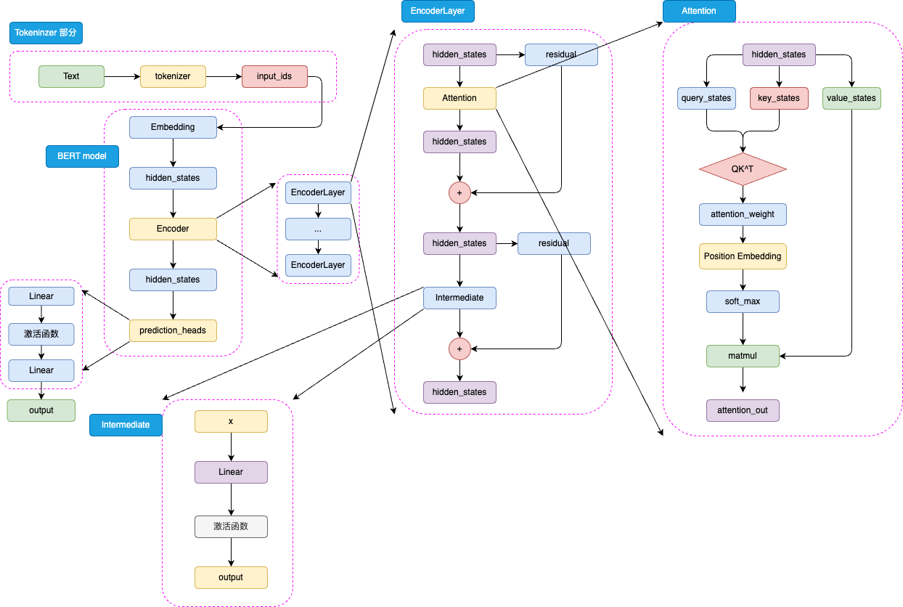

**<font style="color:#DF2A3F;">BERT 使用 prediction headers（如 MLM 和 NSP 头）代替传统的 Decoder</font>**<font style="color:rgb(52, 73, 94);">，因为它的任务是理解而非生成。BERT 是针对于 NLU 任务打造的预训练模型，其输入一般是文本序列，而输出一般是 Label，例如情感分类的积极、消极 Label。但是，正如 Transformer 是一个 Seq2Seq 模型，使用 Encoder 堆叠而成的 BERT 本质上也是一个 Seq2Seq 模型，只是没有加入对特定任务的 Decoder，因此，为适配各种 NLU 任务，在模型的最顶层加入了一个分类头 </font>**<font style="color:rgb(52, 73, 94);">prediction\_heads</font>**<font style="color:rgb(52, 73, 94);">，用于将多维度的隐藏状态通过线性层转换到分类维度（例如，如果一共有两个类别，prediction\_heads 输出的就是两维向量）</font>

<font style="color:rgb(52, 73, 94);"></font>

模型整体既是由 Embedding、Encoder 加上 prediction\_heads 组成：

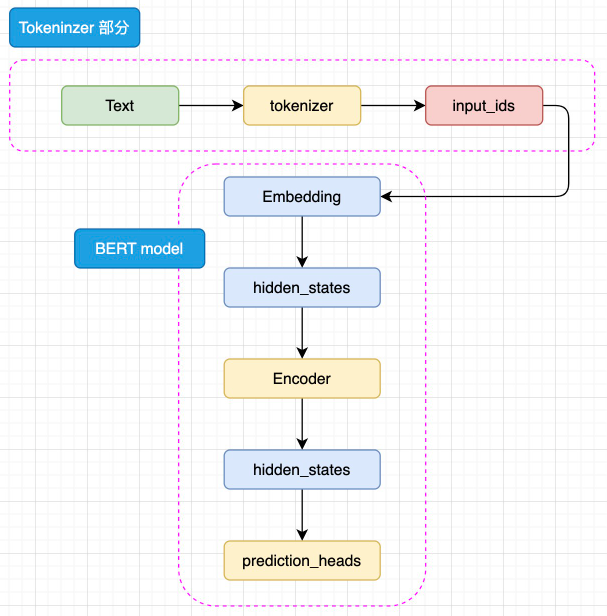

输入的文本序列会首先通过 tokenizer（分词器，BERT 的 Tokenizer 通常使用 WordPiece 分词算法） 转化成 input\_ids（基本每一个模型在 tokenizer 的操作都类似，可以参考 Transformer 的 tokenizer 机制，后文不再赘述），然后进入 Embedding 层转化为特定维度的 hidden\_states，再经过 Encoder 块。Encoder 块中是对叠起来的 N 层 Encoder Layer，BERT 有两种规模的模型，分别是 base 版本（12层 Encoder Layer，768 的隐藏层维度，总参数量 110M），large 版本（24层 Encoder Layer，1024 的隐藏层维度，总参数量 340M）。通过Encoder 编码之后的最顶层 hidden\_states 最后经过 prediction\_heads 就得到了最后的类别概率，经过 Softmax 计算就可以计算出模型预测的类别。

> BERT 采用 WordPiece 作为分词方法。WordPiece 是一种基于统计的子词切分算法，其核心在于将单词拆解为子词（例如，"playing" -> \["play", "##ing"]）。其合并操作的依据是最大化语言模型的似然度。对于中文等非空格分隔的语言，通常将单个汉字作为原子分词单位（token）处理。

prediction\_heads 其实就是线性层加上激活函数，一般而言，最后一个线性层的输出维度和任务的类别数相等，如图3.3所示：

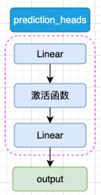

而每一层 Encoder Layer 都是和 Transformer 中的 Encoder Layer 结构类似的层，如图3.4所示：

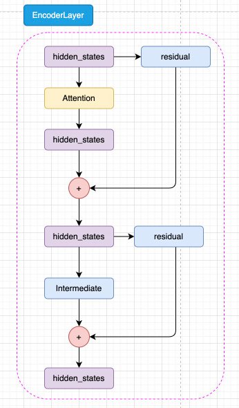

如图3.5所示，已经通过 Embedding 层映射的 hidden\_states 进入核心的 attention 机制，然后通过残差连接的机制和原输入相加，再经过一层 Intermediate 层得到最终输出。Intermediate 层是 BERT 的特殊称呼，其实就是一个线性层加上激活函数：

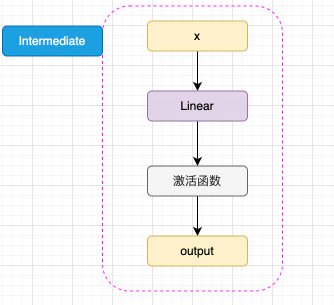

注意，BERT 所使用的激活函数是 GELU 函数，全名为高斯误差线性单元激活函数，这也是自 BERT 才开始被普遍关注的激活函数。GELU 的计算方式为：

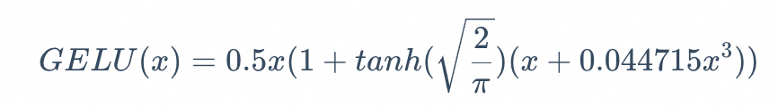

GELU 的核心思路为将随机正则的思想引入激活函数，通过输入自身的概率分布，来决定抛弃还是保留自身的神经元。关于 GELU 的原理与核心思路，此处不再赘述，有兴趣的读者可以自行学习。

BERT 的 注意力机制和 Transformer 中 Encoder 的 自注意力机制几乎完全一致，但是 **BERT 将相对位置编码融合在了注意力机制**中，将相对位置编码同样视为可训练的权重参数，如图3.6所示：

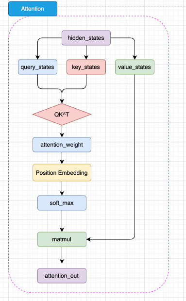

如图，BERT 的注意力计算过程和 Transformer 的唯一差异在于，在完成注意力分数的计算之后，先通过 Position Embedding 层来融入相对位置信息。这里的 Position Embedding 层，其实就是一层线性矩阵。通过可训练的参数来拟合相对位置，相对而言比 Transformer 使用的绝对位置编码 Sinusoidal 能够拟合更丰富的相对位置信息，但是，这样也增加了不少模型参数，同时完全无法处理超过模型训练长度的输入（例如，对 BERT 而言能处理的最大上下文长度是 512 个 token）。

可以看出，BERT 的模型架构既是建立在 Transformer 的 Encoder 之上的，这也是为什么说 BERT 沿承了 Transformer 的思想。

对比transformer的改动：

1. **架构**：
   * 仅使用 **Transformer 的 Encoder** 部分，去掉 Decoder。
2. **双向注意力**：
   * 从单向注意力改为 **双向注意力**，同时关注上下文的所有单词。
3. **预训练任务**：
   * 添加 **Masked Language Model (MLM)** 和 **Next Sentence Prediction (NSP)** 任务。
4. **输入格式**：
   * 增加特殊标记 `[CLS]`、`[SEP]`、`[MASK]`。
   * 输入嵌入由 **Token Embeddings**、**Segment Embeddings** 和 **Position Embeddings** 组成。
5. **输出层**：
   * 根据预训练任务调整输出层：预测被遮盖的词（MLM）和判断句子关系（NSP）。
6. **预训练流程**：
   * 使用大规模无监督语料进行预训练，后续通过微调适配下游任务。
7. **超参数设置**：
   * 固定的模型配置（如 `bert-base` 和 `bert-large`）。
8. **去掉 Decoder-specific Components**：
   * 移除 Decoder 的 Masked Self-Attention 和 Encoder-Decoder Attention。

#### 预训练任务——MLM + NSP

相较于基本沿承 Transformer 的模型架构，BERT <font style="color:#DF2A3F;">更大的创新点在于其提出的两个</font>**<font style="color:#DF2A3F;">新的预训练任务</font>**<font style="color:#DF2A3F;">上</font>——<font style="color:#DF2A3F;">MLM（</font>Masked Language Model，通过随机遮盖输入序列中的部分词，迫使模型根据上下文预测被遮盖的词，从而学习词语之间的深层语义关系） 和 <font style="color:#DF2A3F;">NSP</font>（Next Sentence Prediction，下一句预测）。

**<font style="color:#DF2A3F;">预训练-微调范式的核心优势在于，通过将预训练和微调分离，完成一次预训练的模型可以仅通过微调应用在几乎所有下游任务上</font>**，只要微调的成本较低，即使预训练成本是之前的数倍甚至数十倍，模型仍然有更大的应用价值。因此，可以进一步扩大模型参数和预训练数据量，使用海量的预训练语料来让模型拟合潜在语义与底层知识，从而让模型通过长时间、大规模的预训练获得强大的语言理解和生成能力。

海量数据，无监督：因此，预训练数据的核心要求即是需要极大的数据规模（数亿 token）。毫无疑问，通过人工标注产出的全监督数据很难达到这个规模。因此，预训练数据一定是从无监督的语料中获取。

双向语义关系：但是，传统 LM 预训练任务的一大缺陷在于，其直接拟合从左到右的语义关系，但忽略了双向的语义关系（从左到右 的方式预测下一个词，或者 从右到左 的方式预测前一个词。虽然 Transformer 的 Encoder 是双向的，但传统的 LM 预训练任务并没有充分利用这种双向能力。）。虽然 Transformer 中通过位置编码表征了文本序列中的位置信息，但这和直接拟合双向语义关系还是有本质区别。因此，有没有一种预训练任务，能够既利用海量无监督语料，又能够训练模型拟合双向语义关系的能力？

基于这一思想，Jacob 等学者提出了 MLM，也就是掩码语言模型作为新的预训练任务。相较于模拟人类写作的 LM，MLM 模拟的是“完形填空”。MLM 的思路也很简单，在一个文本序列中随机遮蔽部分 token，然后将所有未被遮蔽的 token 输入模型，要求模型根据输入预测被遮蔽的 token。例如，输入和输出可以是

```latex
输入：I <MASK> you because you are <MASK>
输出：<MASK> - love; <MASK> - wonderful

```

由于模型可以利用被遮蔽的 token 的上文和下文一起理解语义来预测被遮蔽的 token，因此通过这样的任务，模型可以拟合双向语义，也就能够更好地实现文本的理解。同样，MLM 任务无需对文本进行任何人为的标注，只需要对文本进行随机遮蔽即可，因此也可以利用互联网所有文本语料实现预训练。例如，BERT 的预训练就使用了足足 3300M 单词的语料。

MLM问题：训练任务和下游任务不一致，影响微调性能（甚至最终效果）。不过，MLM 也存在其固有缺陷。LM 任务模拟了人自然创作的过程，其训练和下游任务是完全一致的，也就是说，训练时是根据上文预测下文，下游任务微调和推理时也同样如此。但是 MLM 不同，在下游任务微调和推理时，其实是不存在我们人工加入的 <MASK> 的，我们会直接通过原文本得到对应的隐藏状态再根据下游任务进入分类器或其他组件。预训练和微调的不一致，会极大程度影响模型在下游任务微调的性能。针对这一问题，作者对 MLM 的策略进行了改进。

在具体进行 MLM 训练时，会随机选择训练语料中 15% 的 token 用于遮蔽。但是这 15% 的 token 并非全部被遮蔽为 <MASK>，而是有 80% 的概率被遮蔽，10% 的概率被替换为任意一个 token，还有 10% 的概率保持不变。其中 10% 保持不变就是为了消除预训练和微调的不一致，而 10% 的随机替换核心意义在于迫使模型保持对上下文信息的学习。因为如果全部遮蔽的话，模型仅需要处理被遮蔽的位置，从而仅学习要预测的 token 而丢失了对上下文的学习。通过引入部分随机 token，模型无法确定需要预测的 token，从而被迫保持每一个 token 的上下文表征分布，从而具备了对句子的特征表示能力。且由于随机 token 的概率很低，其并不会影响模型实质的语言理解能力。

除去 MLM，BERT 还提出了另外一个预训练任务——NSP，即下一个句子预测。<font style="color:#DF2A3F;">NSP 的核心思想是针对句级的 NLU 任务，例如问答匹配、自然语言推理等</font>。**问答匹配是指，输入一个问题和若干个回答，要求模型找出问题的真正回答；自然语言推理是指，输入一个前提和一个推理，判断推理是否是符合前提的**。这样的任务都需要模型在句级去拟合关系，判断两个句子之间的关系，而不仅是 MLM 在 token 级拟合的语义关系。因此，BERT 提出了 NSP 任务来训练模型在句级的语义关系拟合。

NSP 任务的核心思路是要求模型判断一个句对的两个句子是否是连续的上下文。例如，输入和输入可以是：

```latex
输入：
    Sentence A：I love you.
    Sentence B: Because you are wonderful.
输出：
    1（是连续上下文）

输入：
    Sentence A：I love you.
    Sentence B: Because today's dinner is so nice.
输出：
    0（不是连续上下文）

```

通过要求模型判断句对关系，从而迫使模型拟合句子之间的关系，来适配句级的 NLU 任务。同样，由于 NSP 的正样本可以从无监督语料中随机抽取任意连续的句子，而负样本可以对句子打乱后随机抽取（只需要保证不要抽取到原本就连续的句子就行），因此也可以具有几乎无限量的训练数据。

在具体预训练时，BERT 使用了 800M 的 BooksCorpus 语料和 2500M 的英文维基百科语料，90% 的数据使用 128 的上下文长度训练，剩余 10% 的数据使用 512 作为上下文长度进行预训练，总共约训练了 3.3B token。其训练的超参数也是值得关注的，BERT 的训练语料共有 13GB 大小，其在 256 的 batch size 上训练了 1M 步（40 个 Epoch）。而相较而言，LLM 一般都只会训练一个 Epoch，且使用远大于 256 的 batch size。

可以看到，相比于传统的非预训练模型，其训练的数据量有指数级增长。当然，更海量的训练数据需要更大成本的算力，BERT 的 Base 版本和 Large 版本分别使用了 16块 TPU 和 64块 TPU 训练了 4天才完成。

#### 下游任务微调

作为 NLP 领域里程碑式的成果，BERT 的一个重大意义就是\*\*<font style="color:#DF2A3F;">正式确立了预训练-微调的两阶段思想</font>\*\*，即在海量无监督语料上进行预训练来获得通用的文本理解与生成能力，再在对应的下游任务上进行微调。该种思想的一个重点在于，预训练得到的强大能力能否通过低成本的微调快速迁移到对应的下游任务上。

在完成预训练后，针对每一个下游任务，只需要使用一定量的全监督人工标注数据，对预训练的 BERT 在该任务上进行微调即可。所谓微调，其实和训练时更新模型参数的策略一致，只不过在特定的任务、更少的训练数据、更小的 batch\_size 上进行训练，更新参数的幅度更小。对于绝大部分下游任务，都可以直接使用 BERT 的输出。例如，对于文本分类任务，可以直接修改模型结构中的 prediction\_heads 最后的分类头即可。对于序列标注等任务，可以集成 BERT 多层的隐含层向量再输出最后的标注结果。对于文本生成任务，也同样可以取 Encoder 的输出直接解码得到最终生成结果。因此，BERT 可以非常高效地应用于多种 NLP 任务。

### RoBERTa

由 Facebook 发布的 RoBERTa，基于BERT，是一个能力更强大、在下游任务上表现更亮眼的预训练模型。

BERT 使用了 13GB（3.3B token）的数据进行预训练，这相较于传统 NLP 来说是一个极其巨大的数据规模了。但是，13GB 的预训练数据是否让 BERT 达到了充分的拟合呢？如果我们使用更多预训练语料，是否可以进一步增强模型性能？更多的，BERT 所选用的预训练任务、训练超参数是否是最优的？RoBERTa 应运而生。

与BERT的不同：

1. **移除 NSP**：专注于 MLM 任务，简化训练流程。
2. **更多数据**：使用 10 倍于 BERT 的预训练数据。
3. **更长训练时间**：增加训练步骤和时间。
4. **动态 Masking**：增加数据多样性。
5. **优化超参数**：调整 batch size、学习率等。
6. **更大的模型规模**：在部分实验中使用更大的模型。

#### 优化一：去掉 NSP 预训练任务 + 动态遮蔽策略

去掉NSP：在预训练任务上，有学者质疑 NSP 任务并不能提高模型性能，因为其太过简单，加入到预训练中并不能使下游任务微调时明显受益，甚至会带来负面效果。实验结果也证明了如此。因此，RoBERTa 在预训练中去掉了 NSP，只使用 MLM 任务。

动态遮蔽策略：同时，RoBERTa 对 MLM 任务本身也做出了改进。 RoBERTa 将 Mask 操作放到了训练阶段，也就是动态遮蔽策略，从而让每一个 Epoch 的训练数据 Mask 的位置都不一致。在实验中，动态遮蔽仅有很微弱的优势优于静态遮蔽，但由于动态遮蔽更高效、易于实现，后续 MLM 任务基本都使用了动态遮蔽。

#### 优化二：更大规模的预训练数据和预训练步长

当然，更大的预训练数据、更长的序列长度和更多的训练 Epoch，需要预训练阶段更多的算力资源。训练一个 RoBERTa，Meta 使用了 1024 块 V100（32GB 显存）训练了一天。

#### 优化三：更大的 bpe 词表(可用于中文分词)

与 BERT 使用的 WordPiece 算法不同，RoBERTa 使用了 BPE 作为 Tokenizer 的编码策略。BPE，即 Byte Pair Encoding，字节对编码，是指以子词对作为分词的单位。

例如，对“Hello World”这句话，可能会切分为“Hel，lo，Wor，ld”四个子词对。而对于以字为基本单位的中文，一般会按照字节编码进行切分。例如，在 UTF-8 编码中，“我”会被编码为“E68891”，那么在 BPE 中可能就会切分成“E68”，“891”两个字词对。

一般来说，BPE 编码的词典越大，编码效果越好。当然，由于 Embedding 层就是把 token 从词典空间映射到隐藏空间（也就是说 Embedding 的形状为 (vocab\_size, hidden\_size)，越大的词表也会带来模型参数的增加。

BERT 原始的 BPE 词表大小为 30K，RoBERTa 选择了 50K 大小的词表来优化模型的编码能力。

通过上述三个部分的优化，RoBERTa 成功地在 BERT 架构的基础上刷新了多个下游任务的 SOTA，也一度成为 BERT 系模型最热门的预训练模型。同时，RoBERTa 的成功也证明了更大的预训练数据、更大的预训练步长的重要意义，这也是 LLM 诞生的基础之一。

### ALBERT

在 BERT 的基础上，RoBERTa 进一步探究了更大规模预训练的作用。同样是基于 BERT 架构进行优化的 ALBERT 模型，则从是否能够\*\*<font style="color:#DF2A3F;">减小模型参数保持模型能力</font>\*\*的角度展开了探究。

虽然 ALBERT 所提出的一些改进思想并没有在后续研究中被广泛采用，但其降低模型参数的方法及提出的新预训练任务 SOP 仍然对 NLP 领域提供了重要的参考意义。

#### 优化一：将 Embedding 参数进行分解

问题：

* 隐藏层维度的增加会带来 Embedding 层参数的巨大上升，增加了模型的计算开销
* 而从另一个角度看，Embedding 层输出的向量是我们对文本 token 的稠密向量表示，从 Word2Vec 的成功经验来看，这种词向量并不需要很大的维度，Word2Vec 仅使用了 100维大小就取得了很好的效果。因此，Embedding 层的输出也许不需要和隐藏层大小一致。

方法：

* 降低embeding层维度，且保持隐藏层维度不变。
* 仅仅降低 embedding 层的维度确实只是线性减少参数数量，可能对模型的整体优化帮助有限。但是，ALBERT 的设计不仅仅是降低 embedding 层维度，它结合了其他创新（如参数共享和矩阵分解），使得降低 embedding 层维度的作用更显著。

因此，ALBERT 对 Embedding 层的参数矩阵进行了分解，让 Embedding 层的输出维度和隐藏层维度解绑，也就是在 Embedding 层的后面加入一个线性矩阵进行维度变换。

ALBERT 设置了 Embedding 层的输出为 128，因此在 Embedding 层后面加入了一个 128 ∗1024 的线性矩阵来将 Embedding 层的输出再升维到隐藏层大小。

#### 优化二：跨层进行参数共享

方法：通过对 BERT 的参数进行分析，ALBERT 发现各个 Encoder 层的参数出现高度一致的情况。由于 24个 Encoder 层带来了巨大的模型参数，因此，ALBERT 提出，可以**让各个 Encoder 层共享模型参数**，来减少模型的参数量。

在具体实现上，其实就是 ALBERT 仅初始化了一个 Encoder 层。在计算过程中，仍然会进行 24次计算，但是每一次计算都是经过这一个 Encoder 层。因此，虽然是 24个 Encoder 计算的模型，但只有一层 Encoder 参数，从而大大降低了模型参数量。在这样的情况下，就可以极大程度地扩大隐藏层维度，实现一个更宽但参数量更小的模型。

问题：上述优化虽然极大程度减小了模型参数量并且还提高了模型效果，却也存在着明显的不足。虽然 ALBERT 的参数量远小于 BERT，但训练效率却只略微优于 BERT，因为在模型的设置中，虽然各层共享权重，但计算时仍然要通过 24次 Encoder Layer 的计算，也就是说训练和推理时的速度相较 BERT 还会更慢。这也是 ALBERT 最终没能取代 BERT 的一个重要原因。

#### 优化三：提出 SOP 预训练任务

类似于 RoBERTa，ALBERT 也同样认为 NSP 任务过于简单，在预训练中无法对模型效果的提升带来显著影响。但是不同于 RoBERTa 选择直接去掉 NSP，ALBERT 选择改进 NSP，增加其难度，来优化模型的预训练。

在传统的 NSP 任务中，正例是由两个连续句子组成的句对，而负例则是从任意两篇文档中抽取出的句对，模型可以较容易地判断正负例，并不能很好地学习深度语义。而 SOP 任务提出的改进是，正例同样由两个连续句子组成，但负例是将这两个的顺序反过来。也就是说，模型不仅要拟合两个句子之间的关系，更要学习其顺序关系，这样就大大提升了预训练的难度。例如，相较于我们在上文中提出的 NSP 任务的示例，SOP 任务的示例形如：

```latex
输入：
    Sentence A：I love you.
    Sentence B: Because you are wonderful.
输出：
    1（正样本）

输入：
    Sentence A：Because you are wonderful.
    Sentence B: I love you.
输出：
    0（负样本）

```

ALBERT 通过实验证明，SOP 预训练任务对模型效果有显著提升。使用 MLM + SOP 预训练的模型效果优于仅使用 MLM 预训练的模型更优于使用 MLM + NSP 预训练的模型。

通过上述三点优化，ALBERT 成功地以更小的参数实现了更强的性能，虽然由于其架构带来的训练、推理效率降低限制了模型的进一步发展，但打造更宽的模型这一思路仍然为众多更强大的模型提供了参考价值。

## Encoder-Decoder PLM

与原始 Transformer 更相似、以 T5 为代表的 Encoder-Decoder 架构。

### T5

T5（Text-To-Text Transfer Transformer）是由 Google 提出的一种预训练语言模型，通过将所有 NLP 任务统一表示为文本到文本的转换问题，大大简化了模型设计和任务处理。

T5 基于 Transformer 架构，包含编码器和解码器两个部分，使用自注意力机制和多头注意力捕捉全局依赖关系，利用相对位置编码处理长序列中的位置信息，并在每层中包含前馈神经网络进一步处理特征。

**<font style="color:#DF2A3F;">T5 的大一统思想将不同的 NLP 任务如文本分类、问答、翻译等统一表示为输入文本到输出文本的转换</font>**，这种方法简化了模型设计、参数共享和训练过程，提高了模型的泛化能力和效率。通过这种统一处理方式，T5不仅减少了任务特定的模型调试工作，还能够使用相同的数据处理和训练框架，极大地提升了多任务学习的性能和应用的便捷性。接下来我们将会从模型结构、预训练任务和大一统思想三个方面来介绍 T5 模型。

#### 模型结构：Encoder-Decoder

BERT 采用了 Encoder-Only 结构，只包含编码器部分；而 GPT 采用了 Decoder-Only 结构，只包含解码器部分。T5 则采用了 Encoder-Decoder 结构，其中编码器和解码器都是基于 Transformer 架构设计。编码器用于处理输入文本，解码器用于生成输出文本。编码器和解码器之间通过注意力机制进行信息交互，从而实现输入文本到输出文本的转换。

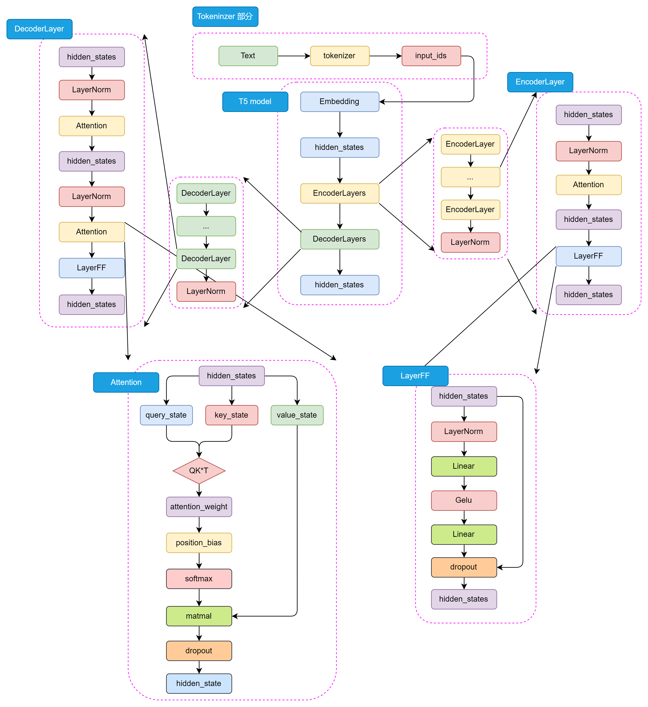

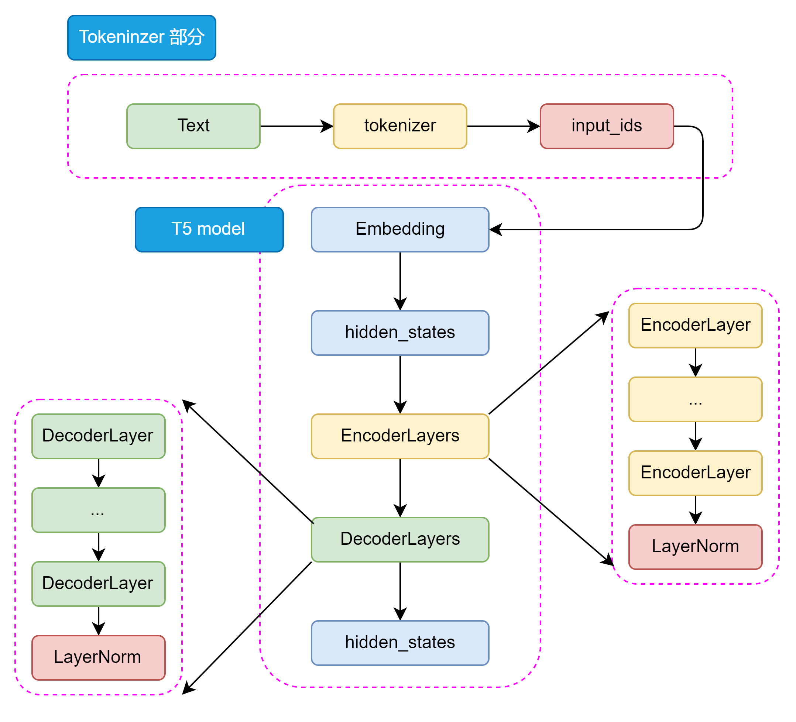

和 Transformer Encoder 不一样的是，在 Decoder 中还包含了 \*\*Encoder-Decoder Attention \*\*结构，用于捕捉输入和输出序列之间的依赖关系。这两种 Attention 结构几乎完全一致，只有在位置编码和 Mask 机制上有所不同。如图3.9所示，Encoder 和 Decoder 的结构如下：

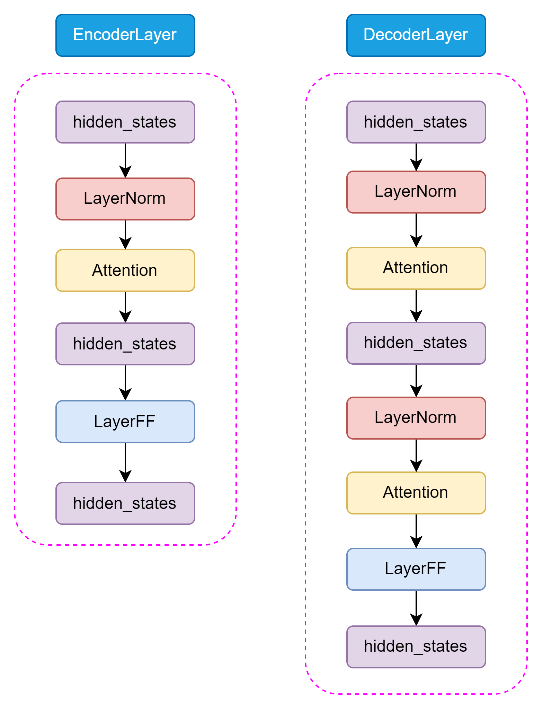

T5 的 Self-Attention 机制和 BERT 的 Attention 机制是一样的，都是基于 Self-Attention 机制设计的。Encoder-Decoder Attention 仅仅在位置编码和 Mask 机制上有所不同，主要是为了区分输入和输出序列。

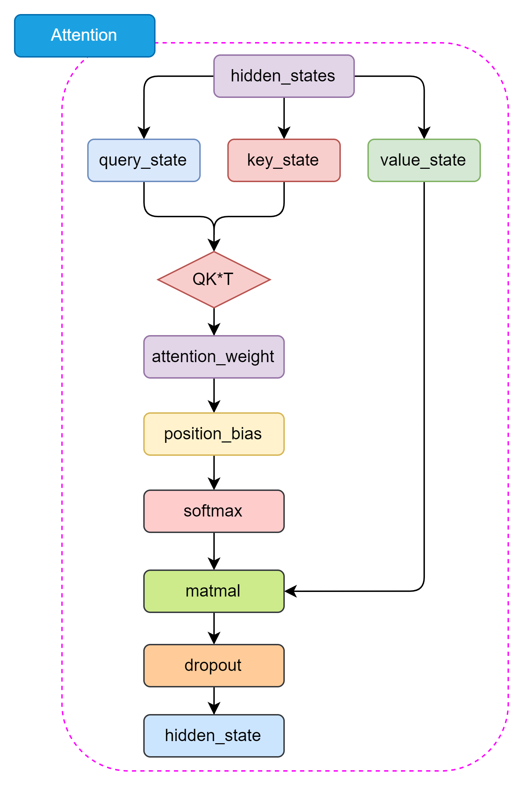

与原始 Transformer 模型不同，T5 模型的LayerNorm 采用了 RMSNorm，通过计算每个神经元的均方根（Root Mean Square）来归一化每个隐藏层的激活值。RMSNorm 的参数设置与Layer Normalization 相比更简单，只有一个可学参数，可以更好地适应不同的任务和数据集。RMSNorm函数可以用以下数学公式表示：

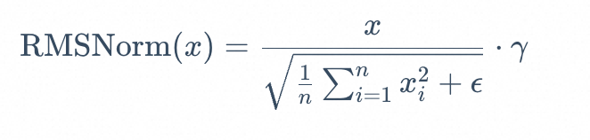'

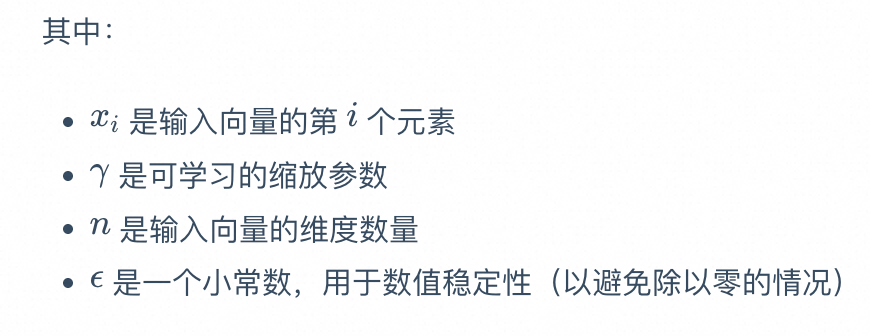

这种归一化有助于通过确保权重的规模不会变得过大或过小来稳定学习过程，这在具有许多层的深度学习模型中特别有用。

#### 预训练任务

T5 的预训练任务，主要包括以下几个部分：

* 预训练任务: T5模型的预训练任务是 MLM，也称为BERT-style目标。具体来说，就是在输入文本中随机遮蔽15%的token，然后让模型预测这些被遮蔽的token。这个过程不需要标签，可以在大量未标注的文本上进行。
* 输入格式: 预训练时，T5将输入文本转换为"文本到文本"的格式。对于一个给定的文本序列，随机选择一些token进行遮蔽，并用特殊的占位符(token)替换。然后将被遮蔽的token序列作为模型的输出目标。
* 预训练数据集: T5 使用了自己创建的大规模数据集"Colossal Clean Crawled Corpus"(C4)，该数据集从Common Crawl中提取了大量干净的英语文本。C4数据集经过了一定的清洗，去除了无意义的文本、重复文本等。
* 多任务预训练: T5 还尝试了将多个任务混合在一起进行预训练，而不仅仅是单独的MLM任务。这有助于模型学习更通用的语言表示。
* 预训练到微调的转换: 预训练完成后，T5模型会在下游任务上进行微调。微调时，模型在任务特定的数据集上进行训练，并根据任务调整解码策略。

通过大规模预训练，T5模型能够学习到丰富的语言知识，并获得强大的语言表示能力，在多个NLP任务上取得了优异的性能，预训练是T5成功的关键因素之一。

#### 大一统思想

T5模型的一个核心理念是“大一统思想”，即<font style="color:#000000;">所有的 NLP 任务都可以统一为文本到文本的任务</font>，这一思想在自然语言处理领域具有深远的影响。T5将预训练和微调阶段的任务统一为文本到文本的形式，使其在各种任务上的适应性更强。

例如：

* 对于文本分类任务，输入可以是“classify: 这是一个很好的产品”，输出是“正面”；
* 对于翻译任务，输入可以是“translate English to French: How are you?”, 输出是“Comment ça va?”。

对于不同的NLP任务，每次输入前都会加上一个任务描述前缀，明确指定当前任务的类型。这不仅帮助模型在预训练阶段学习到不同任务之间的通用特征，也便于在微调阶段迅速适应具体任务。例如，任务前缀可以是“summarize: ”用于摘要任务，或“translate English to German: ”用于翻译任务。

T5的大一统思想通过将所有NLP任务统一为文本到文本的形式，简化了任务处理流程，增强了模型的通用性和适应性。这一思想不仅推动了自然语言处理技术的发展，也为实际应用提供了更为便捷和高效的解决方案。

## Decoder-Only PLM

事实上，Decoder-Only 就是目前大火的 LLM 的基础架构，目前所有的 LLM 基本都是 Decoder-Only 模型（RWKV、Mamba 等非 Transformer 架构除外）。而引发 LLM 热潮的 ChatGPT，正是 Decoder-Only 系列的代表模型 GPT 系列模型的大成之作。而目前作为开源 LLM 基本架构的 LLaMA 模型，也正是在 GPT 的模型架构基础上优化发展而来。因此，在本节中，我们不但会详细分析 Decoder-Only 代表模型 GPT 的原理、架构和特点，还会深入到目前的主流开源 LLM，分析它们的结构、特点，结合之前对 Transformer 系列其他模型的分析，帮助大家深入理解当下被寄予厚望、被认为是 AGI 必经之路的 LLM 是如何一步步从传统 PLM 中发展而来的。

### GPT

GPT，即 Generative Pre-Training Language Model，是由 OpenAI 团队于 2018年发布的预训练语言模型。虽然学界普遍认可 BERT 作为预训练语言模型时代的代表，但首先明确提出预训练-微调思想的模型其实是 GPT。GPT 提出了通用预训练的概念，也就是在海量无监督语料上预训练，进而在每个特定任务上进行微调，从而实现这些任务的巨大收益。

然在发布之初，由于性能略输于不久后发布的 BERT，没能取得轰动性成果，也没能让 GPT 所使用的 Decoder-Only 架构成为学界研究的主流，但 OpenAI 团队坚定地选择了不断扩大预训练数据、增加模型参数，在 GPT 架构上不断优化，最终在 2020年发布的 GPT-3 成就了 LLM 时代的基础，并以 GPT-3 为基座模型的 ChatGPT 成功打开新时代的大门，成为 LLM 时代的最强竞争者也是目前的最大赢家

#### 模型架构-Decoder Only

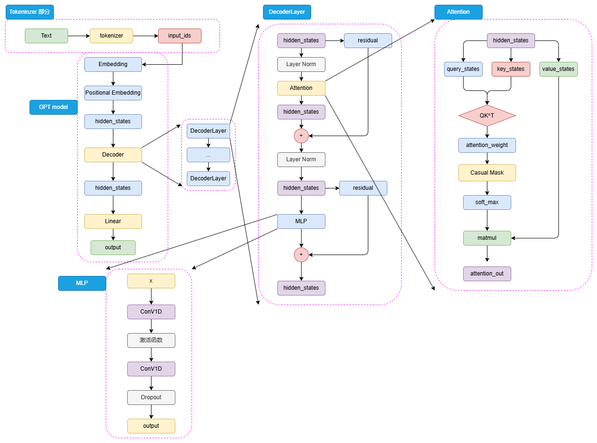

GPT 的整体结构和 BERT 是有一些类似的，只是相较于 BERT 的 Encoder，选择使用了 Decoder 来进行模型结构的堆叠。由于 Decoder-Only 结构也天生适用于文本生成任务，所以相较于更贴合 NLU 任务设计的 BERT，GPT 和 T5 的模型设计更契合于 NLG 任务和 Seq2Seq 任务。

流程：

1. tokenizer：tokenizer 进行分词并转化为对应词典序号的 input\_ids。
2. embeding：input\_ids 首先通过 Embedding 层，再经过 Positional Embedding 进行位置编码，编码成 hidden\_states。
3. decoder：bert-base采用了12层编码器，gpt 选择了 12层解码器层，但是在解码器层的内部，相较于 Transformer 原始 Decoder 层的双注意力层设计，GPT 的 Decoder 层反而更像 Encoder 层一点。
   1. 由于不再有 Encoder 的编码输入，Decoder 层仅保留了一个带掩码的注意力层，并且将 LayerNorm 层从 Transformer 的注意力层之后提到了注意力层之前。hidden\_states 输入 Decoder 层之后，会先进行 LayerNorm，再进行掩码注意力计算，然后经过残差连接和再一次 LayerNorm 进入到 MLP 中并得到最后输出。
   2. 由于不存在 Encoder 的编码结果，Decoder 层中的掩码注意力也是自注意力计算。也就是对一个输入的 hidden\_states，会通过三个参数矩阵来生成 query、key 和 value，而不再是像 Transformer 中的 Decoder 那样由 Encoder 输出作为 key 和 value。后续的注意力计算过程则和 BERT 类似，只是在计算得到注意力权重之后，通过掩码矩阵来遮蔽了未来 token 的注意力权重，从而限制每一个 token 只能关注到它之前 token 的注意力，来实现掩码自注意力的计算。

另外一个结构上的区别在于，GPT 的 MLP 层没有选择线性矩阵来进行特征提取，而是选择了两个一维卷积核来提取，不过，从效果上说这两者是没有太大区别的。通过 N 个 Decoder 层后的 hidden\_states 最后经过线性矩阵映射到词表维度，就可以转化成自然语言的 token，从而生成我们的目标序列。

#### 预训练任务——CLM

Decoder-Only 的模型结构往往更适合于文本生成任务，因此，**<font style="color:#DF2A3F;">Decoder-Only 模型往往选择了最传统也最直接的预训练任务——因果语言模型</font>**，Casual Language Model，下简称 CLM。（不用MLM、NSP和SOP）

| **任务** | **适用场景** | **GPT 的需求** | **是否适合 GPT** |
| --- | --- | --- | --- |
| **CLM** | 生成任务，预测下一个词 | 强调生成能力 | ✅ 完全适合 |
| **MLM** | 理解任务，预测遮盖的词 | 强调语言理解 | ❌ 不适合 |
| **NSP** | 理解任务，判断句子间关系 | 强调句子关系理解 | ❌ 不适合 |

CLM 可以看作 N-gram 语言模型的一个直接扩展。N-gram 语言模型是基于前 N 个 token 来预测下一个 token，CLM 则是基于一个自然语言序列的前面所有 token 来预测下一个 token，通过不断重复该过程来实现目标文本序列的生成。也就是说，CLM 是一个经典的补全形式。例如，CLM 的输入和输出可以是：

```latex
input: 今天天气
output: 今天天气很

input: 今天天气很
output：今天天气很好
```

因此，对于一个输入目标序列长度为 256，期待输出序列长度为 256 的任务，模型会不断根据前 256 个 token、257个 token（输入+预测出来的第一个 token）...... 进行 256 次计算，最后生成一个序列长度为 512 的输出文本，这个输出文本前 256 个 token 为输入，后 256 个 token 就是我们期待的模型输出。

在前面我们说过，BERT 之所以可以采用预训练+微调的范式取得重大突破，正是因为其选择的 MLM、NSP 可以在海量无监督语料上直接训练——而很明显，CLM 是更直接的预训练任务，**其天生和人类书写自然语言文本的习惯相契合，也和下游任务直接匹配**，相对于 MLM 任务更加直接，可以在任何自然语言文本上直接应用。因此，CLM 也可以使用海量的自然语言语料进行大规模的预训练。

#### GPT 系列模型的发展

自 GPT-1 推出开始，OpenAI 一直坚信 Decoder-Only 的模型结构和“体量即正义”的优化思路，不断扩大预训练数据集、模型体量并对模型做出一些小的优化和修正，来不断探索更强大的预训练模型。从被 BERT 压制的 GPT-1，到没有引起足够关注的 GPT-2，再到激发了涌现能力、带来大模型时代的 GPT-3，最后带来了跨时代的 ChatGPT，OpenAI 通过数十年的努力证明了其思路的正确性。

| **<font style="color:rgb(52, 73, 94);">模型</font>** | **<font style="color:rgb(52, 73, 94);">Decoder Layer</font>** | **<font style="color:rgb(52, 73, 94);">Hidden\_size</font>** | **<font style="color:rgb(52, 73, 94);">注意力头数</font>** | **<font style="color:rgb(52, 73, 94);">注意力维度</font>** | **<font style="color:rgb(52, 73, 94);">总参数量</font>** | **<font style="color:rgb(52, 73, 94);">预训练语料</font>** |
| --- | --- | --- | --- | --- | --- | --- |
| <font style="color:rgb(52, 73, 94);">GPT-1</font> | <font style="color:rgb(52, 73, 94);">12</font> | <font style="color:rgb(52, 73, 94);">3072</font> | <font style="color:rgb(52, 73, 94);">12</font> | <font style="color:rgb(52, 73, 94);">768</font> | <font style="color:rgb(52, 73, 94);">0.12B</font> | <font style="color:rgb(52, 73, 94);">5GB</font> |
| <font style="color:rgb(52, 73, 94);">GPT-2</font> | <font style="color:rgb(52, 73, 94);">48</font> | <font style="color:rgb(52, 73, 94);">6400</font> | <font style="color:rgb(52, 73, 94);">25</font> | <font style="color:rgb(52, 73, 94);">1600</font> | <font style="color:rgb(52, 73, 94);">1.5B</font> | <font style="color:rgb(52, 73, 94);">40GB</font> |
| <font style="color:rgb(52, 73, 94);">GPT-3</font> | <font style="color:rgb(52, 73, 94);">96</font> | <font style="color:rgb(52, 73, 94);">49152</font> | <font style="color:rgb(52, 73, 94);">96</font> | <font style="color:rgb(52, 73, 94);">12288</font> | <font style="color:rgb(52, 73, 94);">175B</font> | <font style="color:rgb(52, 73, 94);">570GB</font> |

GPT-1 是 GPT 系列的开山之作，也是第一个使用 Decoder-Only 的预训练模型。但是，GPT-1 的模型体量和预训练数据都较少。GPT-1 的参数规模与预训练规模和 BERT-base 是大致相当的，但其表现相较于 BERT-base 却有所不如，这也是 GPT 系列模型没能成为预训练语言模型时代的代表的原因。

GPT-2 则是 OpenAI 在 GPT-1 的基础上进一步探究预训练语言模型多任务学习能力的产物。

* GPT-2 的模型结构和 GPT-1 大致相当，只是扩大了模型参数规模、将 Post-Norm 改为了 Pre-Norm（也就是先进行 LayerNorm 计算，再进入注意力层计算）。这些改动的核心原因在于，由于模型层数增加、体量增大，梯度消失和爆炸的风险也不断增加，为了使模型梯度更稳定对上述结构进行了优化。
* GPT-2 的核心改进是大幅增加了预训练数据集和模型体量。不管是模型结构还是预训练大小都超过了 1代一个数量级。
* GPT-2 的另一个重大突破是以 zero-shot（零样本学习）为主要目标，也就是不对模型进行微调，直接要求模型解决任务.在 GPT-2 的时代，模型能力还不足够支撑较好的 zero-shot 效果，在大模型时代，zero-shot 及其延伸出的 few-shot（少样本学习）才开始逐渐成为主流。

GPT-3 则是更进一步展示了 OpenAI“力大砖飞”的核心思路，也是 LLM 的开创之作。在 GPT-2 的基础上，OpenAI 进一步增大了模型体量和预训练数据量，整体参数量达 175B，是当之无愧的“大型语言模型”。在模型结构上，基本没有大的改进，只是由于巨大的模型体量使用了稀疏注意力机制来取代传统的注意力机制。在预训练数据上，则是分别从 CC、WebText、维基百科等大型语料集中采样，共采样了 45T、清洗后 570GB 的数据。根据推算，GPT-3 需要在 1024张 A100（80GB 显存）的分布式训练集群上训练 1个月。

之所以说 GPT-3 是 LLM 的开创之作，除去其巨大的体量带来了涌现能力的凸显外，**<font style="color:#DF2A3F;">还在于其提出了 few-shot 的重要思想</font>**。few-shot 是在 zero-shot 上的改进，研究者发现即使是 175B 大小的 GPT-3，想要在 zero-shot 上取得较好的表现仍然是一件较为困难的事情。而 few-shot 是对 zero-shot 的一个折中，旨在提供给模型少样的示例来教会它完成任务。few-shot 一般会\*\*<font style="color:#DF2A3F;">在 prompt（也就是模型的输入）中增加 3~5个示例，来帮助模型理</font>\*\*解。例如，对于情感分类任务：

```latex
zero-shot：请你判断‘这真是一个绝佳的机会’的情感是正向还是负向，如果是正向，输出1；否则输出0

few-shot：请你判断‘这真是一个绝佳的机会’的情感是正向还是负向，如果是正向，输出1；否则输出0。你可以参考以下示例来判断：‘你的表现非常好’——1；‘太糟糕了’——0；‘真是一个好主意’——1。

```

通过给模型提供少量示例，模型可以取得远好于 zero-shot 的良好表现。few-shot 也被称为上下文学习（**<font style="color:#DF2A3F;">In-context Learning</font>**），即让模型从提供的上下文中的示例里学习问题的解决方法。GPT-3 在 few-shot 上展现的强大能力，为 NLP 的突破带来了重要进展。如果对于绝大部分任务都可以通过人为构造 3~5个示例就能让模型解决，其效率将远高于传统的预训练-微调范式，意味着 NLP 的进一步落地应用成为可能——而这，也正是 LLM 的核心优势。

在 GPT 系列模型的基础上，通过引入预训练-指令微调-人类反馈强化学习的三阶段训练，OpenAI 发布了跨时代的 ChatGPT，引发了大模型的热潮。也正是在 GPT-3 及 ChatGPT 的基础上，LLaMA、ChatGLM 等模型的发布进一步揭示了 LLM 的无尽潜力。在下一节，我们将深入剖析目前 LLM 的普适架构——LLaMA。

1. **预训练**：
   * 构建基础语言模型，学习广泛的语言知识。
   * 数据规模大，模型通用性强，但不一定适合具体任务。
2. **指令微调**：（模型训练阶段的prompt）
   * 使用任务特定的指令数据集，让模型学会理解指令并生成符合指令的输出。
   * 模型开始适配用户需求。
3. **人类反馈强化学习**：
   * 利用人类反馈优化模型行为，使生成内容更符合人类偏好。
   * 通过奖励模型和强化学习进一步提升输出质量。

### LLaMA

LLaMA模型是由Meta（前Facebook）开发的一系列大型预训练语言模型。从LLaMA-1到LLaMA-3，LLaMA系列模型展示了大规模预训练语言模型的演进及其在实际应用中的显著潜力。

#### 模型架构——Decoder Only

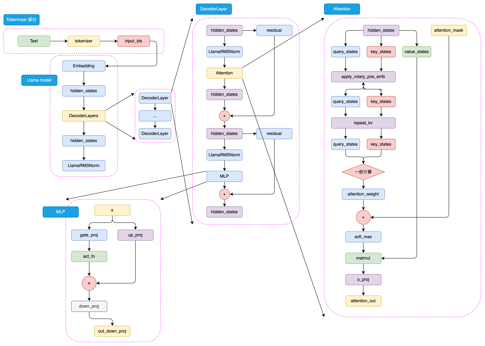

步骤：

1. tokenizer => input\_ids
2. embedding + positional embedding => hidden\_states
3. decoder block
   1. masked self-attention + softmax => value
   2. MLP，两个全连接层
4. 线性输出层
   1. 输出维度与词表维度相同

LLaMA模型以其技术创新、多参数版本、大规模预训练和高效架构设计而著称。模型支持从7亿到数百亿不等的参数量，适应不同规模的应用需求。LLaMA-1以其开源性和优异性能迅速受到社区欢迎，而LLaMA-2和LLaMA-3进一步通过引入分组查询注意力机制和支持更长文本输入，显著提升了模型性能和应用范围。特别是LLaMA-3，通过采用128K词表大小的高效tokenizer和15T token的庞大训练数据，实现了在多语言和多任务处理上的重大进步。Meta对模型安全性和社区支持的持续关注，预示着LLaMA将继续作为AI技术发展的重要推动力，促进全球范围内的技术应用和创新。

### GLM

ChatGLM-6B 是 GLM 系列的开山之作，也是 2023年国内最早的开源中文 LLM，也是最早提出不同于 GPT、LLaMA 的独特模型架构的 LLM。在整个中文 LLM 的发展历程中，GLM 具有独特且重大的技术意义。本节将简要叙述 GLM 系列的发展，并介绍其不同于 GPT、LLaMA 系列模型的独特技术思路。

#### 模型架构-相对于 GPT 的略微修正

核心思路是在传统 CLM 预训练任务基础上，加入 MLM 思想，从而构建一个在 NLG 和 NLU 任务上都具有良好表现的统一模型。

在整体模型结构上，GLM 和 GPT 大致类似，均是 Decoder-Only 的结构，仅有三点细微差异：

1. 使用 Post Norm 而非 Pre Norm。Post Norm 是指在进行残差连接计算时，先完成残差计算，再进行 LayerNorm 计算；而类似于 GPT、LLaMA 等模型都使用了 Pre Norm，也就是先进行 LayerNorm 计算，再进行残差的计算。相对而言，Post Norm 由于在残差之后做归一化，对参数正则化的效果更强，进而模型的鲁棒性也会更好；Pre Norm相对于因为有一部分参数直接加在了后面，不需要对这部分参数进行正则化，正好可以防止模型的梯度爆炸或者梯度消失。因此，对于更大体量的模型来说，一般认为 Pre Norm 效果会更好。但 GLM 论文提出，使用 Post Norm 可以避免 LLM 的数值错误（虽然主流 LLM 仍然使用了 Pre Norm）；
2. 使用单个线性层实现最终 token 的预测，而不是使用 MLP；这样的结构更加简单也更加鲁棒，即减少了最终输出的参数量，将更大的参数量放在了模型本身；
3. 激活函数从 ReLU 换成了 GeLUs。ReLU 是传统的激活函数，其核心计算逻辑为去除小于 0的传播，保留大于 0的传播；GeLUs 核心是对接近于 0的正向传播，做了一个非线性映射，保证了激活函数后的非线性输出，具有一定的连续性。

#### 预训练任务-GLM

GLM 的核心创新点主要在于其提出的 GLM（General Language Model，通用语言模型）任务，这也是 GLM 的名字由来。GLM 是一种结合了自编码思想和自回归思想的预训练方法。所谓自编码思想，其实也就是 MLM 的任务学习思路，在输入文本中随机删除连续的 tokens，要求模型学习被删除的 tokens；所谓自回归思想，其实就是传统的 CLM 任务学习思路，也就是要求模型按顺序重建连续 tokens。

GLM 通过优化一个自回归空白填充任务来实现 MLM 与 CLM 思想的结合。其核心思想是，对于一个输入序列，会类似于 MLM 一样进行随机的掩码，但遮蔽的不是和 MLM 一样的单个 token，而是每次遮蔽一连串 token；模型在学习时，既需要使用遮蔽部分的上下文预测遮蔽部分，在遮蔽部分内部又需要以 CLM 的方式完成被遮蔽的 tokens 的预测。例如，输入和输出可能是：

```latex
输入：I <MASK> because you <MASK>
输出：<MASK> - love you; <MASK> - are a wonderful person
```

通过将 MLM 与 CLM 思想相结合，既适配逐个 token 生成的生成类任务，也迫使模型从前后两个方向学习输入文本的隐含关系从而适配了理解类任务。使用 GLM 预训练任务产出的 GLM 模型，在一定程度上展现了其超出同体量 BERT 系模型的优越性能：

不过，GLM 预训练任务更多的优势还是展现在预训练模型时代，迈入 LLM 时代后，针对于超大规模、体量的预训练，CLM 展现出远超 MLM 的优势。通过将模型体量加大、预训练规模扩大，CLM 预训练得到的生成模型在文本理解上也能具有超出 MLM 训练的理解模型的能力，因此，ChatGLM 系列模型也仅在第一代模型使用了 GLM 的预训练思想，从 ChatGLM2 开始，还是回归了传统的 CLM 建模。虽然从 LLM 的整体发展路径来看，GLM 预训练任务似乎是一个失败的尝试，但通过精巧的设计将 CLM 与 MLM 融合，并第一时间产出了中文开源的原生 LLM，其思路仍然存在较大的借鉴意义。

#### GLM 家族的发展

在 GLM 模型（即使用原生 GLM 架构及预训练任务的早期预训练模型）的基础上，参考 ChatGPT 的技术思路进行 SFT 和 RLHF，智谱于 23年 3月发布了第一个中文开源 LLM ChatGLM-6B，成为了众多中文 LLM 研究者的起点。ChatGLM-6B 在 1T 语料上进行预训练，支持 2K 的上下文长度。

在 23年 6月，智谱就开源了 ChatGLM2-6B。相对于一代，ChatGLM2 将上下文长度扩展到了 32K，通过更大的预训练规模实现了模型性能的大幅度突破。不过，在 ChatGLM2 中，模型架构就基本回归了 LLaMA 架构，引入 MQA 的注意力机制，预训练任务也回归经典的 CLM，放弃了 GLM 的失败尝试。

ChatGLM3-6B 发布于 23年 10月，相对于二代在语义、数学、推理、代码和知识方面都达到了当时的 SOTA 性能，但是官方给出的技术报告说明 ChatGLM3 在模型架构上相对二代没有变化，最主要的优化来源是更多样化的训练数据集、更充足的训练步骤和更优化的训练策略。ChatGLM3 的另一个重要改进在于其开始支持函数调用与代码解释器，开发者可以直接使用开源的 ChatGLM3 来实现 Agent 开发，具有更广泛的应用价值。

2024年 1月，智谱发布了支持 128K 上下文，包括多种类型的 GLM-4 系列模型，评估其在英文基准上达到了 GPT-4 的水平。不过，智谱并未直接开源 GLM-4，而是开源了其轻量级版本 GLM-4-9B 模型，其在 1T token 的多语言语料库上进行预训练，上下文长度为 8K，并使用与 GLM-4 相同的管道和数据进行后训练。在训练计算量较少的情况下，其超越了 Llama-3-8B，并支持 GLM-4 中所有工具的功能。

#### 对比

| **模型名称** | **发布机构** | **架构类型** | **主要任务** | **预训练目标** | **参数规模** | **特点** |
| --- | --- | --- | --- | --- | --- | --- |
| **GPT** | OpenAI | Decoder-Only | 自然语言生成 (NLG) | CLM | GPT-3: 175B | - 专注于生成任务   - 使用标准 Transformer Decoder   - 参数规模大，生成能力强 |
| **LLaMA** | Meta AI | Decoder-Only | 自然语言生成 (NLG) | CLM | LLaMA 2: 7B, 13B, 70B | - 轻量化设计，适合研究者使用   - 参数规模较小，性能优越   - 训练效率高 |
| **GLM** | 清华大学 | Decoder-Only | 自然语言理解 (NLU) 和生成 (NLG) | MLM + CLM | GLM-130B | - 同时支持 NLU 和 NLG   - 混合预训练任务设计   - 中文任务表现优异 |

## 对比

### **选择模型的依据**

根据任务需求选择合适的模型架构：

1. **如果任务是自然语言理解（NLU）**：
   * 选择 **Encoder-Only 模型**（如 BERT）。
   * 例如：文本分类、命名实体识别、抽取式问答。
2. **如果任务是自然语言生成（NLG）**：
   * 选择 **Decoder-Only 模型**（如 GPT）。
   * 例如：文本续写、对话生成、开放域问答。
3. **如果任务同时涉及理解与生成**：
   * 选择 **Encoder-Decoder 模型**（如 T5、BART）。
   * 例如：机器翻译、文本摘要、生成式问答。

***

### **总结图示**

以下是三种模型架构的简化图示：

#### **Encoder-Only**

```plain
输入序列 → 编码器 → 上下文表示 → 输出
```

#### **Encoder-Decoder**

```plain
输入序列 → 编码器 → 上下文表示 → 解码器 → 输出序列
```

#### **Decoder-Only**

```plain
输入序列 → 解码器 → 输出序列（自回归生成）
```

通过这种分类和对比，可以根据具体任务需求选择合适的预训练语言模型！


> 更新: 2025-07-27 08:07:40  
> 原文: <https://www.yuque.com/viruspc/el3mi0/tymgbyo2q6xc2ln6>