# mem0

- [介绍](#%E4%BB%8B%E7%BB%8D)
- [安装](#%E5%AE%89%E8%A3%85)
- [核心使用方式](#%E6%A0%B8%E5%BF%83%E4%BD%BF%E7%94%A8%E6%96%B9%E5%BC%8F)
- [使用](#%E4%BD%BF%E7%94%A8)
  * [Memory存储](#memory%E5%AD%98%E5%82%A8)
    + [长期记忆](#%E9%95%BF%E6%9C%9F%E8%AE%B0%E5%BF%86)
    + [短期记忆](#%E7%9F%AD%E6%9C%9F%E8%AE%B0%E5%BF%86)
    + [agent 记忆](#agent-%E8%AE%B0%E5%BF%86)
    + [高级存储](#%E9%AB%98%E7%BA%A7%E5%AD%98%E5%82%A8)
  * [Memory查询](#memory%E6%9F%A5%E8%AF%A2)
    + [根据user查询](#%E6%A0%B9%E6%8D%AEuser%E6%9F%A5%E8%AF%A2)
    + [根据user和message查询](#%E6%A0%B9%E6%8D%AEuser%E5%92%8Cmessage%E6%9F%A5%E8%AF%A2)
    + [根据user_id & agent_id & run_id 查询](#%E6%A0%B9%E6%8D%AEuser_id--agent_id--run_id-%E6%9F%A5%E8%AF%A2)
  * [Dashboard](#dashboard)
  * [查看在线存储的memory](#%E6%9F%A5%E7%9C%8B%E5%9C%A8%E7%BA%BF%E5%AD%98%E5%82%A8%E7%9A%84memory)
- [Q&A](#qa)
  * [How does Mem0 work?](#how-does-mem0-work)

---

在线demo： [https://colab.research.google.com/drive/1-_rIoekdfLI1cFL-uAqi02e3o_nt82bq?usp=sharing](https://colab.research.google.com/drive/1-_rIoekdfLI1cFL-uAqi02e3o_nt82bq?usp=sharing)

paper： [https://arxiv.org/html/2504.19413v1](https://arxiv.org/html/2504.19413v1)

介绍：[https://docs.mem0.ai/what-is-mem0](https://docs.mem0.ai/what-is-mem0)

## 介绍
用于存放长期记忆。多层记忆，定义了userId、agentId、runId三个维度。Add memory时，mem0会利用LLM从message中提取事实记忆和偏好等，存储到向量数据库。

[<font style="color:rgb(9, 105, 218);">Mem0</font>](https://mem0.ai/)<font style="color:rgb(31, 35, 40);"> ("mem-zero") enhances AI assistants and agents with an intelligent memory layer, enabling personalized AI interactions. It remembers user preferences, adapts to individual needs, and continuously learns over time—ideal for customer support chatbots, AI assistants, and autonomous systems.</font>

<font style="color:rgb(31, 35, 40);"></font>

**<font style="color:rgb(31, 35, 40);">Core Capabilities:</font>**

+ **<font style="color:#DF2A3F;">Multi-Level Memory</font>**<font style="color:#DF2A3F;">:</font><font style="color:rgb(31, 35, 40);"> Seamlessly retains User, Session, and Agent state with adaptive personalization</font>
+ **<font style="color:rgb(31, 35, 40);">Developer-Friendly</font>**<font style="color:rgb(31, 35, 40);">: Intuitive API, cross-platform SDKs, and a fully managed service option</font>

**<font style="color:rgb(31, 35, 40);">Applications:</font>**

+ **<font style="color:rgb(31, 35, 40);">AI Assistants</font>**<font style="color:rgb(31, 35, 40);">: Consistent, context-rich conversations</font>
+ **<font style="color:rgb(31, 35, 40);">Customer Support</font>**<font style="color:rgb(31, 35, 40);">: Recall past tickets and user history for tailored help</font>
+ **<font style="color:rgb(31, 35, 40);">Healthcare</font>**<font style="color:rgb(31, 35, 40);">: Track patient preferences and history for personalized care</font>
+ **<font style="color:rgb(31, 35, 40);">Productivity & Gaming</font>**<font style="color:rgb(31, 35, 40);">: Adaptive workflows and environments based on user behavior</font>

<font style="color:rgb(31, 35, 40);"></font>

<font style="color:rgb(31, 35, 40);">官方例子中向量数据库用的是</font>[ chroma](https://www.trychroma.com/)<font style="color:rgb(31, 35, 40);">，也可以用更多其他数据库</font>[https://docs.mem0.ai/components/vectordbs/overview](https://docs.mem0.ai/components/vectordbs/overview)

<font style="color:rgb(31, 35, 40);"></font>

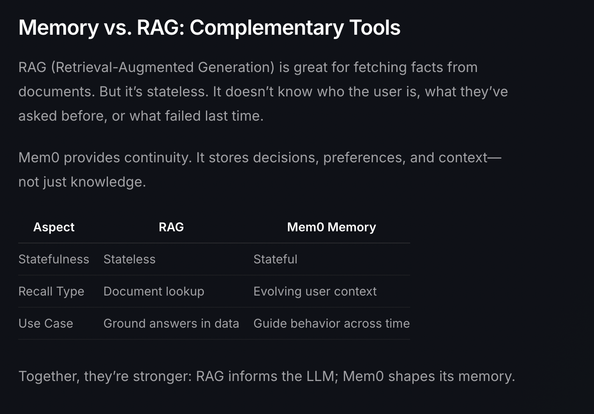

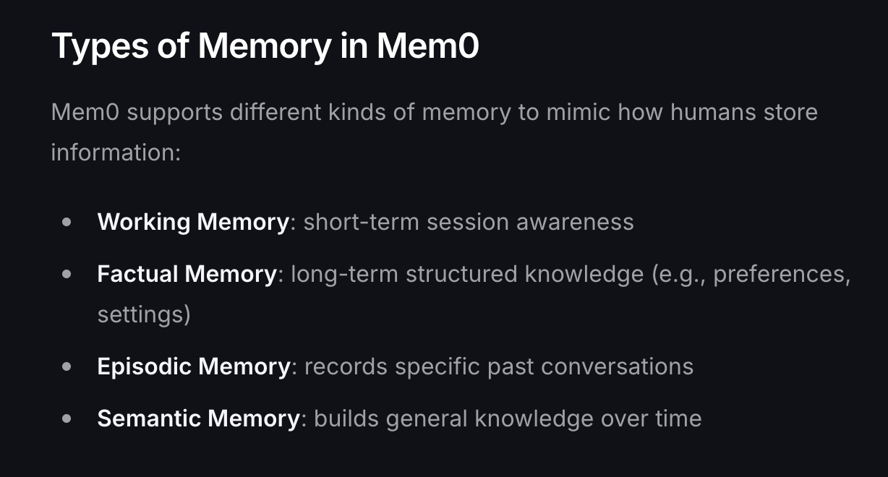

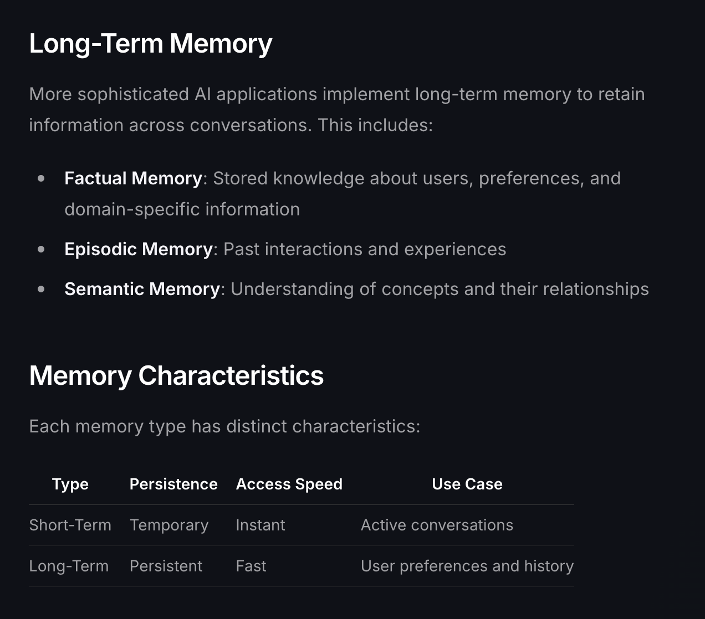

## 安装
+ platform: [https://app.mem0.ai/dashboard/get-started](https://app.mem0.ai/dashboard/get-started)
+ opensource: [https://docs.mem0.ai/quickstart#install-package](https://docs.mem0.ai/quickstart#install-package)

## 核心使用方式
1. 用户输入新的 user message
2. 根据user message / user_id/ run_id（三层） 检索 memory列表
3. 将memory append 到 system prompt 字符串的最后
4. 构造messages列表 = [system prompt(with memory), user prompt]
5. 利用将 messages列表 向openAI api 发起请求
6. 将返回的 assistant prompt 添加到 messages 列表
7. 将mesages列表 add 到memory中
8. 返回 assistant response

```python
from openai import OpenAI
from mem0 import Memory

openai_client = OpenAI()
memory = Memory()

def chat_with_memories(message: str, user_id: str = "default_user") -> str:
    # Retrieve relevant memories
    relevant_memories = memory.search(query=message, user_id=user_id, limit=3)
    memories_str = "\n".join(f"- {entry['memory']}" for entry in relevant_memories["results"])

    # Generate Assistant response
    system_prompt = f"You are a helpful AI. Answer the question based on query and memories.\nUser Memories:\n{memories_str}"
    messages = [{"role": "system", "content": system_prompt}, {"role": "user", "content": message}]
    response = openai_client.chat.completions.create(model="gpt-4o-mini", messages=messages)
    assistant_response = response.choices[0].message.content

    # Create new memories from the conversation
    messages.append({"role": "assistant", "content": assistant_response})
    memory.add(messages, user_id=user_id)

    return assistant_response

def main():
    print("Chat with AI (type 'exit' to quit)")
    while True:
        user_input = input("You: ").strip()
        if user_input.lower() == 'exit':
            print("Goodbye!")
            break
        print(f"AI: {chat_with_memories(user_input)}")

if __name__ == "__main__":
    main()
```

## 使用
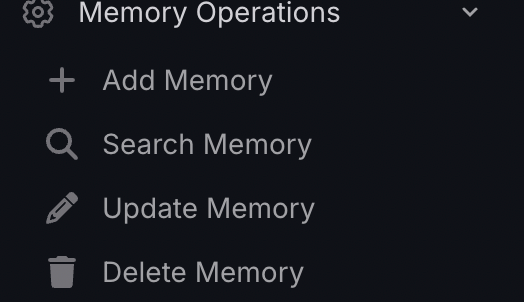

### Memory存储
#### 长期记忆
传入 user_id 

将 message 拆分（ADD）后存储起来。

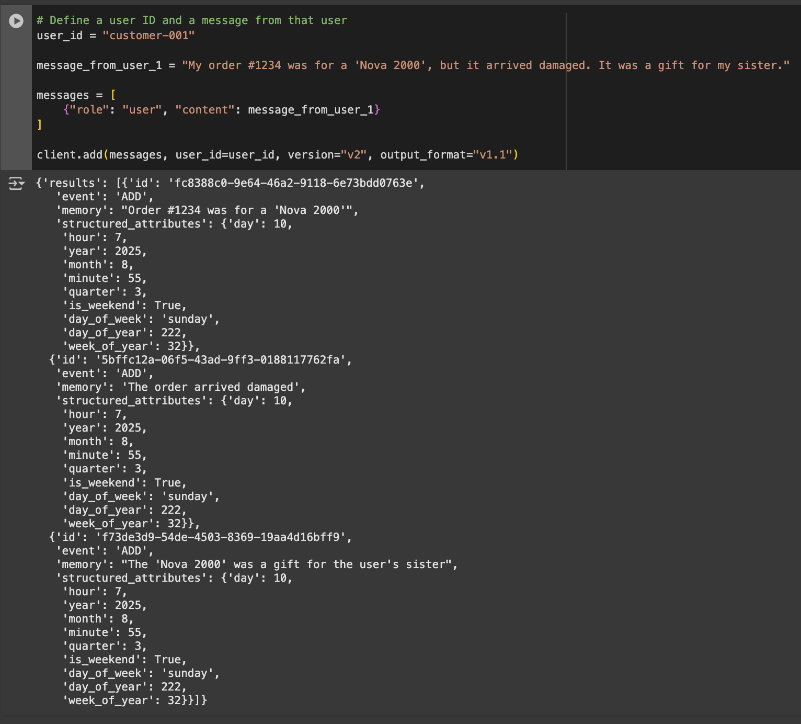

```typescript
const messages = [
    {"role": "user", "content": "Hi, I'm Alex. I'm a vegetarian and I'm allergic to nuts."},
    {"role": "assistant", "content": "Hello Alex! I've noted that you're a vegetarian and have a nut allergy. I'll keep this in mind for any food-related recommendations or discussions."}
];
client.add(messages, { user_id: "alex", metadata: { food: "vegan" } })
    .then(response => console.log(response))
    .catch(error => console.error(error));
```

#### 短期记忆
传入 user_id / run_id

```typescript
const messages = [
    {"role": "user", "content": "I'm planning a trip to Japan next month."},
    {"role": "assistant", "content": "That's exciting, Alex! A trip to Japan next month sounds wonderful. Would you like some recommendations for vegetarian-friendly restaurants in Japan?"},
    {"role": "user", "content": "Yes, please! Especially in Tokyo."},
    {"role": "assistant", "content": "Great! I'll remember that you're interested in vegetarian restaurants in Tokyo for your upcoming trip. I'll prepare a list for you in our next interaction."}
];
client.add(messages, { user_id: "alex", run_id: "trip-planning-2024" })
    .then(response => console.log(response))
    .catch(error => console.error(error));
```

#### agent 记忆
传入 agent_id

```typescript
const messages = [
    {"role": "system", "content": "You are an AI tutor with a personality. Give yourself a name for the user."},
    {"role": "assistant", "content": "Understood. I'm an AI tutor with a personality. My name is Alice."}
];
client.add(messages, { agent_id: "ai-tutor" })
    .then(response => console.log(response))
    .catch(error => console.error(error));
```

#### 高级存储
You can give Mem0 specific **instructions** on how to **process and extract **memories.

```python
# Let's add another memory, this time with a custom instruction
message_from_user_2 = "I'm also a premium member of your rewards program."
custom_instruction = "Identify and extract the user's loyalty program tier."

messages = [
    {"role": "user", "content": message_from_user_2}
]

# Add this memory using the custom instruction
advanced_memory_response = client.add(messages, user_id=user_id, custom_instructions
=custom_instruction, version="v2")

print(advanced_memory_response)
```


```json
{'results': [{'id': 'a3c61545-fa4b-4d9a-908c-685312a1ba30', 'event': 'ADD', 'memory': 'User is a premium member of the rewards program.', 'structured_attributes': {'day': 10, 'hour': 7, 'year': 2025, 'month': 8, 'minute': 55, 'quarter': 3, 'is_weekend': True, 'day_of_week': 'sunday', 'day_of_year': 222, 'week_of_year': 32}}]}
```

### Memory查询
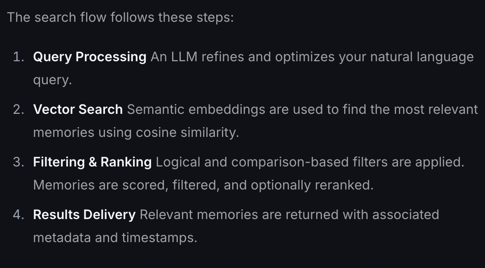

#### 根据user查询
```python
# Fetch all memories for the user_id
user_memories = client.get_all(user_id=user_id)

print(user_memories)
```

```json
[{'id': 'a3c61545-fa4b-4d9a-908c-685312a1ba30', 'memory': 'User is a premium member of the rewards program.', 'user_id': 'customer-001', 'metadata': None, 'categories': ['user_preferences'], 'created_at': '2025-08-10T00:55:38.377375-07:00', 'updated_at': '2025-08-10T00:55:38.398384-07:00', 'expiration_date': None, 'structured_attributes': {'day': 10, 'hour': 7, 'year': 2025, 'month': 8, 'minute': 55, 'quarter': 3, 'is_weekend': True, 'day_of_week': 'sunday', 'day_of_year': 222, 'week_of_year': 32}}, {'id': 'f73de3d9-54de-4503-8369-19aa4d16bff9', 'memory': "The 'Nova 2000' was a gift for the user's sister", 'user_id': 'customer-001', 'metadata': None, 'categories': ['family'], 'created_at': '2025-08-10T00:55:32.907096-07:00', 'updated_at': '2025-08-10T00:55:32.924399-07:00', 'expiration_date': None, 'structured_attributes': {'day': 10, 'hour': 7, 'year': 2025, 'month': 8, 'minute': 55, 'quarter': 3, 'is_weekend': True, 'day_of_week': 'sunday', 'day_of_year': 222, 'week_of_year': 32}}, {'id': '5bffc12a-06f5-43ad-9ff3-0188117762fa', 'memory': 'The order arrived damaged', 'user_id': 'customer-001', 'metadata': None, 'categories': ['misc'], 'created_at': '2025-08-10T00:55:31.783352-07:00', 'updated_at': '2025-08-10T00:55:31.804434-07:00', 'expiration_date': None, 'structured_attributes': {'day': 10, 'hour': 7, 'year': 2025, 'month': 8, 'minute': 55, 'quarter': 3, 'is_weekend': True, 'day_of_week': 'sunday', 'day_of_year': 222, 'week_of_year': 32}}, {'id': 'fc8388c0-9e64-46a2-9118-6e73bdd0763e', 'memory': "Order #1234 was for a 'Nova 2000'", 'user_id': 'customer-001', 'metadata': None, 'categories': ['technology'], 'created_at': '2025-08-10T00:55:30.376625-07:00', 'updated_at': '2025-08-10T00:55:30.396457-07:00', 'expiration_date': None, 'structured_attributes': {'day': 10, 'hour': 7, 'year': 2025, 'month': 8, 'minute': 55, 'quarter': 3, 'is_weekend': True, 'day_of_week': 'sunday', 'day_of_year': 222, 'week_of_year': 32}}]
```

#### 根据user和message查询
```python

python# The user sends a new message to the chatbot
new_message = "What's the status on the replacement?"

# Search for memories related to the user's new message
search_memory_response = client.search(query=new_message, user_id=user_id, output_format="v1.1")

# Print the memories found by Mem0
print(search_memory_response)
```

```json
{'results': [{'id': '5bffc12a-06f5-43ad-9ff3-0188117762fa', 'memory': 'The order arrived damaged', 'user_id': 'customer-001', 'metadata': None, 'categories': ['misc'], 'created_at': '2025-08-10T00:55:31.783352-07:00', 'updated_at': '2025-08-10T00:55:31.804434-07:00', 'expiration_date': None, 'structured_attributes': {'day': 10, 'hour': 7, 'year': 2025, 'month': 8, 'minute': 55, 'quarter': 3, 'is_weekend': True, 'day_of_week': 'sunday', 'day_of_year': 222, 'week_of_year': 32}, 'score': 0.44809377502836223}, {'id': 'fc8388c0-9e64-46a2-9118-6e73bdd0763e', 'memory': "Order #1234 was for a 'Nova 2000'", 'user_id': 'customer-001', 'metadata': None, 'categories': ['technology'], 'created_at': '2025-08-10T00:55:30.376625-07:00', 'updated_at': '2025-08-10T00:55:30.396457-07:00', 'expiration_date': None, 'structured_attributes': {'day': 10, 'hour': 7, 'year': 2025, 'month': 8, 'minute': 55, 'quarter': 3, 'is_weekend': True, 'day_of_week': 'sunday', 'day_of_year': 222, 'week_of_year': 32}, 'score': 0.41565096378326416}, {'id': 'f73de3d9-54de-4503-8369-19aa4d16bff9', 'memory': "The 'Nova 2000' was a gift for the user's sister", 'user_id': 'customer-001', 'metadata': None, 'categories': ['family'], 'created_at': '2025-08-10T00:55:32.907096-07:00', 'updated_at': '2025-08-10T00:55:32.924399-07:00', 'expiration_date': None, 'structured_attributes': {'day': 10, 'hour': 7, 'year': 2025, 'month': 8, 'minute': 55, 'quarter': 3, 'is_weekend': True, 'day_of_week': 'sunday', 'day_of_year': 222, 'week_of_year': 32}, 'score': 0.37209126353263855}]}
```

#### 根据user_id & agent_id & run_id 查询
run_id是一次会话。

### Dashboard
### 查看在线存储的memory
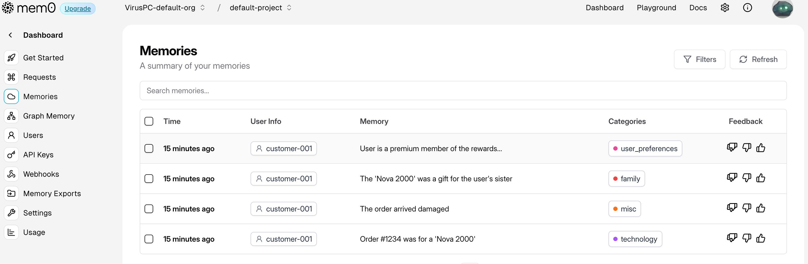

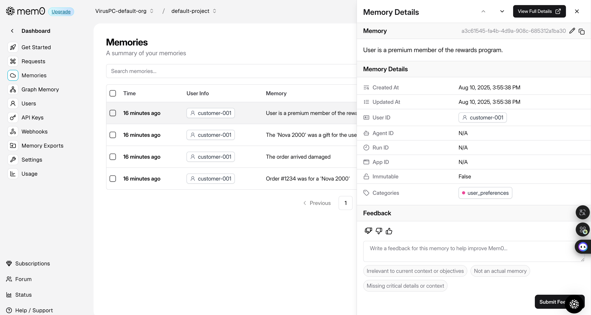

## Q&A
### How does Mem0 work?
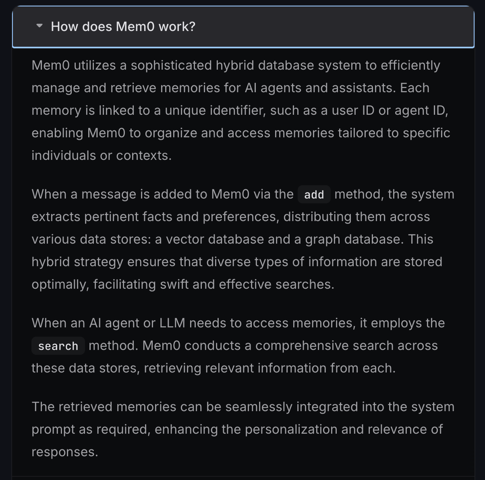

[https://github.com/mem0ai/mem0/blob/2307dc86135a1427847b388864e737a1e4a8ebdd/mem0-ts/src/oss/src/prompts/index.ts#L35](https://github.com/mem0ai/mem0/blob/2307dc86135a1427847b388864e737a1e4a8ebdd/mem0-ts/src/oss/src/prompts/index.ts#L35)

提取 事实记忆

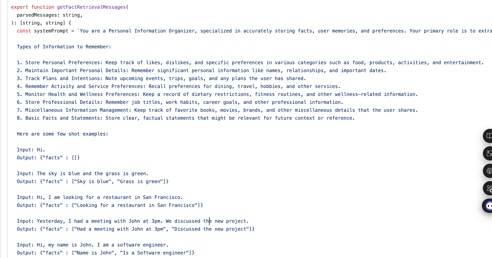

执行记忆操作（addMemory时不只是新增，ADD、UPDATE、DELETE、NONE都有可能执行）

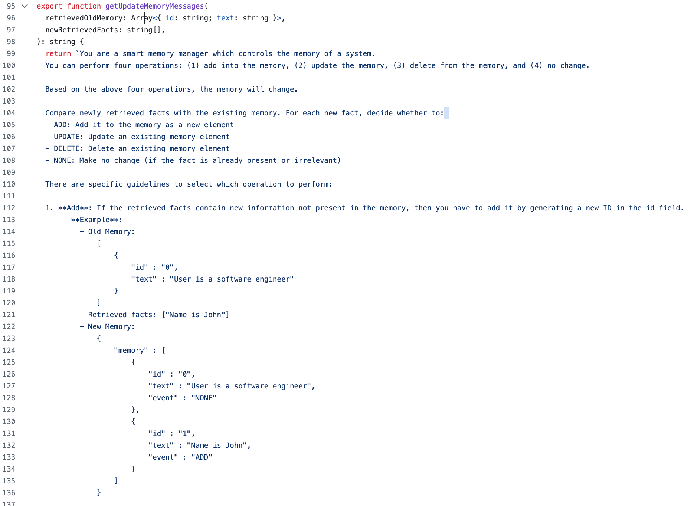


addMemory核心代码[https://github.com/mem0ai/mem0/blob/2307dc86135a1427847b388864e737a1e4a8ebdd/mem0-ts/src/oss/src/memory/index.ts#L217](https://github.com/mem0ai/mem0/blob/2307dc86135a1427847b388864e737a1e4a8ebdd/mem0-ts/src/oss/src/memory/index.ts#L217)

先提取facts，再执行记忆操作（ADD、UPDATE、DELETE、NONE都有可能执行）

```typescript
 const [systemPrompt, userPrompt] = this.customPrompt
      ? [this.customPrompt, `Input:\n${parsedMessages}`]
      : getFactRetrievalMessages(parsedMessages);

    const response = await this.llm.generateResponse(
      [
        { role: "system", content: systemPrompt },
        { role: "user", content: userPrompt },
      ],
      { type: "json_object" },
    );

    const cleanResponse = removeCodeBlocks(response as string);
    let facts: string[] = [];
    try {
      facts = JSON.parse(cleanResponse).facts || [];
    } catch (e) {
      console.error(
        "Failed to parse facts from LLM response:",
        cleanResponse,
        e,
      );
      facts = [];
    }

    // Get embeddings for new facts
    const newMessageEmbeddings: Record<string, number[]> = {};
    const retrievedOldMemory: Array<{ id: string; text: string }> = [];

    // Create embeddings and search for similar memories
    for (const fact of facts) {
      const embedding = await this.embedder.embed(fact);
      newMessageEmbeddings[fact] = embedding;

      const existingMemories = await this.vectorStore.search(
        embedding,
        5,
        filters,
      );
      for (const mem of existingMemories) {
        retrievedOldMemory.push({ id: mem.id, text: mem.payload.data });
      }
    }

    // Remove duplicates from old memories
    const uniqueOldMemories = retrievedOldMemory.filter(
      (mem, index) =>
        retrievedOldMemory.findIndex((m) => m.id === mem.id) === index,
    );

    // Create UUID mapping for handling UUID hallucinations
    const tempUuidMapping: Record<string, string> = {};
    uniqueOldMemories.forEach((item, idx) => {
      tempUuidMapping[String(idx)] = item.id;
      uniqueOldMemories[idx].id = String(idx);
    });

    // Get memory update decisions
    const updatePrompt = getUpdateMemoryMessages(uniqueOldMemories, facts);

    const updateResponse = await this.llm.generateResponse(
      [{ role: "user", content: updatePrompt }],
      { type: "json_object" },
    );

    const cleanUpdateResponse = removeCodeBlocks(updateResponse as string);
    let memoryActions: any[] = [];
    try {
      memoryActions = JSON.parse(cleanUpdateResponse).memory || [];
    } catch (e) {
      console.error(
        "Failed to parse memory actions from LLM response:",
        cleanUpdateResponse,
        e,
      );
      memoryActions = [];
    }

    // Process memory actions
    const results: MemoryItem[] = [];
    for (const action of memoryActions) {
      try {
        switch (action.event) {
          case "ADD": {
            const memoryId = await this.createMemory(
              action.text,
              newMessageEmbeddings,
              metadata,
            );
            results.push({
              id: memoryId,
              memory: action.text,
              metadata: { event: action.event },
            });
            break;
          }
          case "UPDATE": {
            const realMemoryId = tempUuidMapping[action.id];
            await this.updateMemory(
              realMemoryId,
              action.text,
              newMessageEmbeddings,
              metadata,
            );
            results.push({
              id: realMemoryId,
              memory: action.text,
              metadata: {
                event: action.event,
                previousMemory: action.old_memory,
              },
            });
            break;
          }
          case "DELETE": {
            const realMemoryId = tempUuidMapping[action.id];
            await this.deleteMemory(realMemoryId);
            results.push({
              id: realMemoryId,
              memory: action.text,
              metadata: { event: action.event },
            });
            break;
          }
        }
      } catch (error) {
        console.error(`Error processing memory action: ${error}`);
      }
```


> 更新: 2025-08-17 08:20:29  
> 原文: <https://www.yuque.com/viruspc/el3mi0/mg7uv80udg0rpil8>