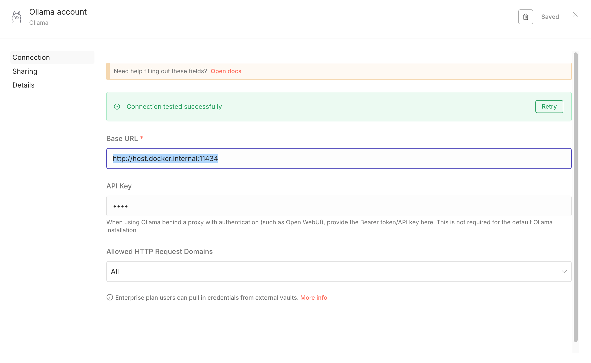
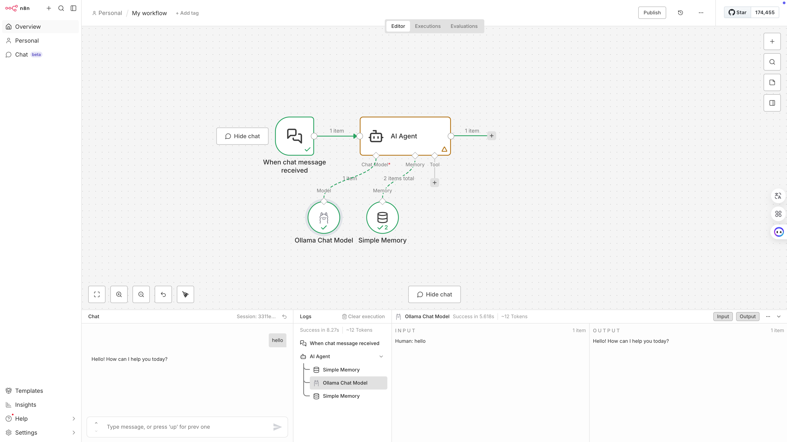

# 工作流 - n8n

1. 通过 docker 下载和启动时，注意：
   1. 只能下载desktop版
   2. 无法通过命令行完成所有步骤：需要打开GUI来签署协议
   3. 官网默认命令是挂载volume到docker的具名卷，mac mini 不可直接访问。最好挂载到本地
      1. Linux: 通常在 /var/lib/docker/volumes/n8n\_data/\_data。你可以直接访问。
      2. macOS / Windows (Docker Desktop): 数据在 Docker 虚拟机的虚拟磁盘里，你在宿主机的文件系统里是找不到它的。
         1. 技术细节：Docker Desktop 在 Mac/Win 上跑了一个轻量级 Linux VM，数据在这个 VM 的 /var/lib/docker/... 里。
      3. 挂载到本地：

```typescript
# n8n do not use default volume, use local volume instead: v n8n_data:/home/node/.n8n
alias docker-run-n8n="docker run -it --rm \
--name n8n \
-p 5678:5678 \
-v ~/docker_data/n8n \
-e N8N_SECURE_COOKIE=false \
docker.n8n.io/n8nio/n8n"
```

2. 启动后
   1. 有个activation code发到邮箱，14天有效期，一定要注意激活
   2. 如果通过 http 无法正常访问，尝试设置N8N\_SECURE\_COOKIE=false，或者自己配置 caddy\&nginx 做https和反向代理
3. 连接本地ollama
   1. **n8n 连接失败问题**：由于 n8n 运行在 Docker 容器内，`localhost` 指向的是容器自身而非主机。
      1. 解决1：修复 n8n 连接：将 n8n 配置中的 Base URL 改为 http://host.docker.internal:11434。
      2. 解决2: 优化 Ollama 访问：在主机终端执行 export OLLAMA\_HOST=0.0.0.0 后重启 Ollama，允许容器跨网络访问。
   2. 
4. 搭建工作流
   1. 


> 更新: 2026-02-14 07:00:27  
> 原文: <https://www.yuque.com/viruspc/el3mi0/mb31niuinfeheyyy>