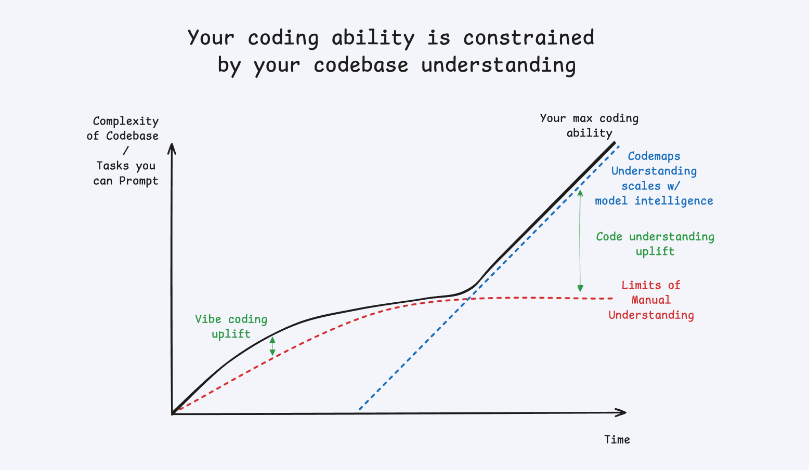
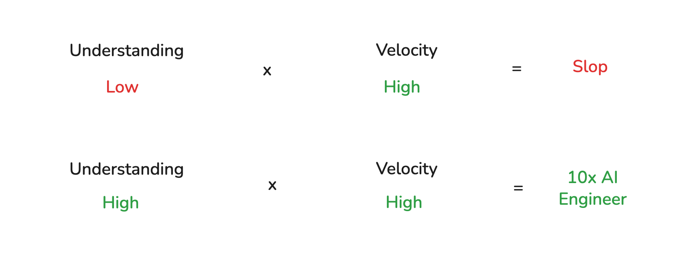

# 2025.11 - Cognition - Windsurf Codemaps: Understand Code, Before You Vibe It

[https://cognition.ai/blog/codemaps#whats-next](https://cognition.ai/blog/codemaps#whats-next)

**正如 Paul Graham 所言：“你的代码就是你对所探索问题的理解。因此，只有当你的代码真正进入你的脑海时，你才算真正理解了问题。” 软件开发只有在理解的基础上才能升华为工程。**

****

**Vibe coding（氛围编码） 已严重偏离其初衷，演变为对 AI 生成的劣质代码的盲目推崇。观察高效与低效的 AI 辅助编码者，可以发现一个关键区别：高效者能够基于对代码的深刻理解，“驾驭”由此产生的直觉（surf the vibes）；而当开发者所生成和维护的代码超出其理解能力时，问题便随之而来。**

****

**“理解”即意味着“负责”。随着 AI 承担越来越多基础性编码任务，开发者面临的挑战也日益复杂：调试系统、重构遗留代码、制定架构决策——这些工作都要求真正的深度理解。在这一背景下，开发者的角色正从“代码编写者”向“责任承担者”转变。你或许不再亲手编写每一行代码，但仍必须对你交付的成果负责。**

当前文章介绍了 Cognition 团队新推出的 Windsurf Codemaps 工具，它通过 AI 生成结构化的代码地图，帮助工程师快速理解和导航代码，大幅提升代码可读性和协作效率。Codemaps 基于 SWE-1.5 和 Claude Sonnet 4.5 模型，可对任何代码系统或片段自动生成可视化、可交互的映射，为人类和 AI 提供共享的代码理解。

主要内容包括：

+ 代码理解是解决复杂工程任务的基础，但现代代码库庞大、切换成本高，工程师在入门新代码时效率低下。
+ Codemaps 能够 Just-in-Time 地针对方案或任务生成结构化的代码地图，工程师可通过 Windsurf IDE 快捷方式快速查看、跳转和追踪代码功能，并生成视觉化可点击的节点导航。
+ 工具支持将 Codemap 片段直接作为上下文，优化 AI agent 的代码理解和执行能力，使 AI 协助更加高效、透明。
+ 强调“理解才有责任”，Codemaps 让工程师和 AI 能在同一代码视角协作，有利于高价值深度工程问题的解决，避免“代码灌水”。
+ 未来该工具还将开放协议，支持更多代码 agent 和团队分享使用，实现自动化的上下文工程和精细化协作。

总结：Windsurf Codemaps 是面向工程师和 AI 的代码理解与协作神器，极大提升大型代码库的可导航、可管理性，对高质量、可维护代码开发至关重要。

> “Your code is your understanding of the problem you’re exploring. So it’s **only when you have your code in your head** that you really understand the problem.” — Paul Graham
>

Software development only becomes engineering with **understanding**. Your ability to reason through your most challenging coding tasks is constrained by your mental model of how things work — in other words, how quickly and how well you **onboard** to any codebase for solving any problem. However most AI vibe coding tools are aimed at relieving you of that burden by reading → thinking → writing the code for you, **increasing the separation from you and your code**. This is fine for low value, commodity tasks, but absolutely unacceptable for the hard, sensitive, and high value work that defines real engineering.

Our solution: Just-in-Time mapping for any problem

We feel that the popular usage of “vibe coding” has strayed far from the original intent, into a blanket endorsement of plowing through any and all AI generated code slop

**people get into trouble when the code they generate and maintain starts to outstrip their ability to understand it**.

  

**To understand is to be accountable. **

****

**In this new era, the engineer’s role shifts from authoring to accountability — you might not write every line, but you’re still responsible for what ships.**

****

**Augment engineers for high value work, relieve them of low value work. **

> 更新: 2025-11-18 14:08:15  
> 原文: <https://www.yuque.com/viruspc/el3mi0/oq9l3rmwoxs8k8kr>