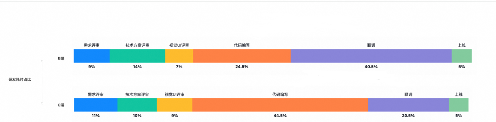
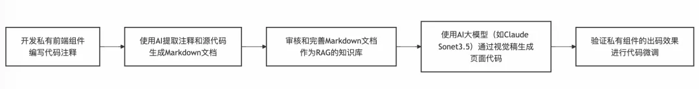
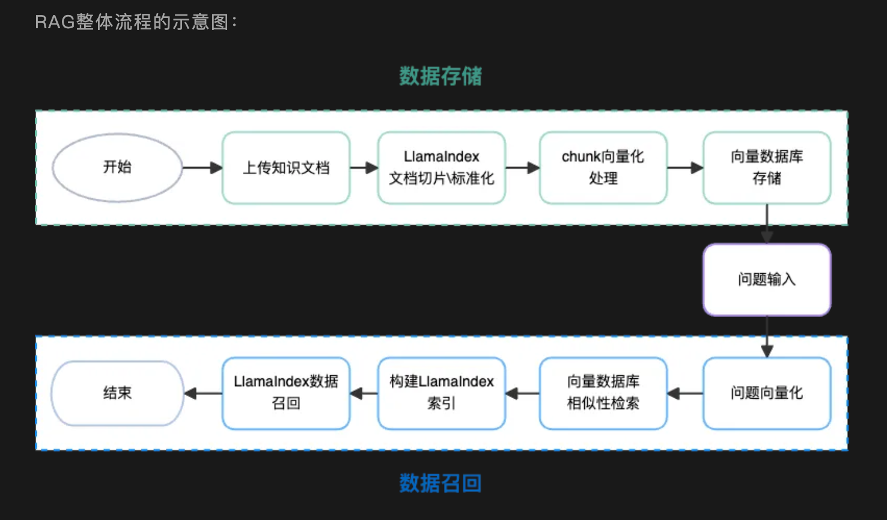
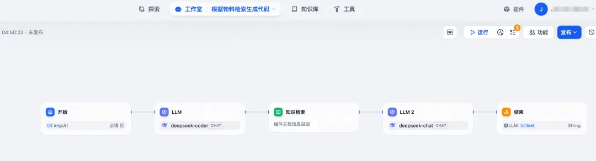
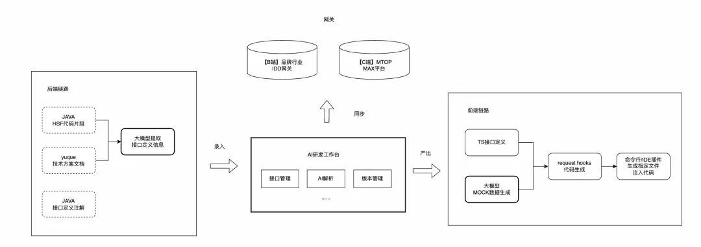
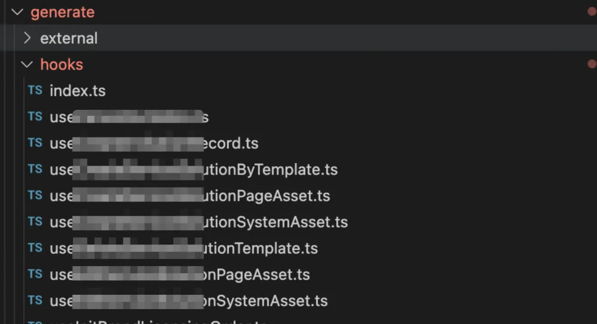

# 2025.4 - 淘天 - AI驱动研发效率在中后台的实践

- [背景](#%E8%83%8C%E6%99%AF)
- [D2C（Design to Code）](#d2cdesign-to-code)
  * [模型选择和提示词](#%E6%A8%A1%E5%9E%8B%E9%80%89%E6%8B%A9%E5%92%8C%E6%8F%90%E7%A4%BA%E8%AF%8D)
  * [私有化组件支持](#%E7%A7%81%E6%9C%89%E5%8C%96%E7%BB%84%E4%BB%B6%E6%94%AF%E6%8C%81)
    + [组件文档生成](#%E7%BB%84%E4%BB%B6%E6%96%87%E6%A1%A3%E7%94%9F%E6%88%90)
    + [RAG](#rag)
  * [接口定义到数据模型](#%E6%8E%A5%E5%8F%A3%E5%AE%9A%E4%B9%89%E5%88%B0%E6%95%B0%E6%8D%AE%E6%A8%A1%E5%9E%8B)
    + [获取OpenAPI 3.0 Schema](#%E8%8E%B7%E5%8F%96openapi-30-schema)
    + [schema到代码生成注入](#schema%E5%88%B0%E4%BB%A3%E7%A0%81%E7%94%9F%E6%88%90%E6%B3%A8%E5%85%A5)
  * [代码拟合和调整](#%E4%BB%A3%E7%A0%81%E6%8B%9F%E5%90%88%E5%92%8C%E8%B0%83%E6%95%B4)
    + [拟合提示词](#%E6%8B%9F%E5%90%88%E6%8F%90%E7%A4%BA%E8%AF%8D)
    + [拟合总结](#%E6%8B%9F%E5%90%88%E6%80%BB%E7%BB%93)
  * [Code Review](#code-review)
  * [自动化测试回归](#%E8%87%AA%E5%8A%A8%E5%8C%96%E6%B5%8B%E8%AF%95%E5%9B%9E%E5%BD%92)
  * [产品化工具](#%E4%BA%A7%E5%93%81%E5%8C%96%E5%B7%A5%E5%85%B7)
- [总结和展望](#%E6%80%BB%E7%BB%93%E5%92%8C%E5%B1%95%E6%9C%9B)
- [Reference](#reference)

---

<https://mp.weixin.qq.com/s/bg32-w2e308XBPXyXpE6sQ>

## 背景

一个产品需求迭代从流程上我们一般从大的阶段上分为以下几个阶段：需求评估 -> 研发 -> 联调 -> 测试 -> 交付。

从研发开始的流程再往下细分，不同的BU，不同的业务线由于使用的技术栈会存在部分的差异，以岗位的视角来看，一般可前端和后端可以拆分成以下几个流程：

* 后端研发流程： PRD -> UI -> 技术评审/接口设计 -> 变更 -> 代码开发 -> 网关注册 -> 联调修改 -> 线上发布
* 前端研发流程：PRD -> UI -> 技术评审/接口设计 -> 创建应用/变更 -> 开发 -> 联调 -> 线上发布



C端，开发：联调 = 2:1\
B端，开发：联调 =。1:1\
对于研发效率主要能提升的节点在于UI代码编写和接口连调阶段

联调的耗时问题的集中在：

1. 需求频繁变动：需求变更频繁，前后端需要快速响应调整，这对双方的沟通效率和代码灵活性提出了更高要求。
2. 文档滞后与不准确：接口文档常常无法及时更新或描述不够准确，导致前后端开发人员依据过时或错误的信息进行开发。

接下来主要围绕这2个场景介绍一下我们在提效过程中的一些方案设计推导和实践

## D2C（Design to Code）

在设计出码的这个链路中，已经有很多的同类型的产品，有的产品会选择DSL的转化路线，比如Figma/mgdone的砖码插件，支付宝的WeaveFox，还有大部分低代码平台，虽然通过DSL中间层实现代码生成，相较于普通AI直出代码，优势在于程序化解析保障稳定性（防错机制）和统一DSL支撑跨语言协同

我们选择了AI直出代码的方案，主要考虑到几下几点：

1. DSL大部分是各个平台私有化的定制，缺少统一的标准化，对于模型学习的语料不足，或者说需要进行一定的预训练，而前端代码，无论是React/Vue都有海量的公共学习语料，随着模型的学习数据和理解力的不断提升，完全能达到初/中级前端程序员的编码能力。
2. 面向B端以中后台为主的页面和面向C端以导购营销为主的页面存在较大的差别，C端页面会存在各种营销氛围的叠加，一个商品坑位存在好几层的图层堆叠，使用DSL转换辅助可以保障AI出码的稳定性，但是中后台的场景更偏功能性，每个区块分布都比较独立，使用最新的Anthropic Claude Sonnet3.7模型出码已经能以较高的还原度满足开发诉求

### 模型选择和提示词

模型：Claude 3.7 sonnet V

提示词：

* <font style="color:rgb(0, 0, 0);">cline提示词：https://github.com/cline/cline/blob/main/src/core/prompts/system.ts</font>
* <font style="color:rgb(0, 0, 0);">bolt.new提示词：https://github.com/stackblitz/bolt.new/blob/main/app/lib/.server/llm/prompts.ts</font>

整体的思路都是比较类似的，大致的范式就是：<font style="color:#DF2A3F;">角定定义(role)，系统约束(constraints)，还有具体的示例（few-shot）</font>。

角定定义和技能相关上的描述基本比较通用，比如“你的知识覆盖了各种编程语言、框架和最佳实践，特别注重React和现代Web开发。”，“具有React组件和Hooks的深度开发经验。”，“能够熟练的使用 Fusion(@alifd/next) 组件库进行页面的还原。”

系统约束由于不同业务场景的不同需要，一般是由业务团队自己进行定制，

* <font style="color:#DF2A3F;">明确性</font>：react组件代码块仅支持一个文件，没有文件系统。用户不会为不同文件编写多个代码块，也不会在多个文件中编写代码。用户的习惯总是内联所有代码。
* <font style="color:#DF2A3F;">约束性</font>：所有的时间格式处理请都使用原生的 js 代码实现，不要使用任何时间处理库。
* <font style="color:#DF2A3F;">场景化</font>：不会为组件或库使用动态导入或懒加载。例如，`const Confetti = dynamic(...)`是不允许的。请使用`import Confetti from 'react-confetti'`。

也可以包含一些通用的限制，例如：

1. 避免使用 iframe、视频或其他媒体，因为它们不会在预览中正确渲染。
2. 不会输出`<svg>`图标。总是使用 `@alifd/next` 库中的Icon的图标。

示例：

````xml
<role>
  你是一个高级前端开发工程师。基于用户提供的组件描述，请生成一个React Fusion组件代码块。请使用中文回答。
</role>

<skills>
  1. 你能够熟练的使用 Fusion(@alifd/next) 组件库进行页面的还原。 
  2. 你能够熟练的使用 bizcharts
  图表库进行图表的可视化展示。图表库的导入方式类似`import {AreaChart} from 'bizcharts'`;
 3. 注意field 是要用Field.useField()
</skills>

<constraints>
使用```tsx 语法来返回 React 代码块。

<engineering-constraints>
  1. React组件代码块仅支持一个文件，没有文件系统。用户不会为不同文件编写多个代码块，也不会在多个文件中编写代码。用户的习惯总是内联所有代码。
  2. 必须导出一个名为"Component"的函数作为默认导出。 
  3. 你总是需要返回完整的代码片段，可以直接复制并粘贴到项目工程中执行。不要包含用户补充的注释。
  4. 代码返回格式需要参考给出的示例代码 
  ......
  10. tsx block请务必在第一个返回，后面讲思考过程和解释。
  11. 请注意UI的布局、颜色、主要按钮等信息，保证和图像中的结构和布局一致。
  12. 按照 <data-define></data-define>中的数据、hooks定义构建符合字段含义的数据。
</engineering-constraints>

<attention>
1. form用法中应该用Field.useField() 而不是Form.useForm，更要注意Rol Col用法和props
2. pay attention on fusion components. 如果不确定有没有对应组件请用div实现
3. 请注意严格按照图片中的逻辑、描述进行还原
......
</attention>

<style-constraints>
  1. 总是尝试使用 @alifd/next 库，在 @alifd/next 不满足的情况下才通过 div 和 style 属性生成。
  2. 必须生成响应式设计，生成的代码移动端优先。 
......
</style-constraints>

</constraints>

<good-examples>
......
</good-examples>

<bad-examples>
......
</bad-examples>
````

### 私有化组件支持

对于AI出码来说，除了设计稿的准确还原以外，另一部分很重要的是如何把团队的私有的物料组件结合到生成的代码中。

使用业务私有组件的主要原因包括：

* 设计资产复用：将团队沉淀的业务组件（如审批流表单、数据看板卡片）转化为AI可识别的设计资产，避免重复造轮子
* 代码规范统一：通过私有组件约束代码生成边界，保证AI输出符合企业级代码规范（如数据校验规则、埋点标准）

在AI出码的流程实现融入私有化组件的大致流程如下：

1. 将设计元素与私有组件库特征进行向量化匹配
2. 动态注入组件使用规范、业务逻辑约束等上下文
3. 生成符合企业标准的定制化代码



#### 组件文档生成

将私有组件的源代码转换成标准化的组件文档非常的轻松，仅需要编写一段清晰的prompt并且给几个具体的example案例，模型就可以生成非常高标准高质量的markdown格式组件文档。

```xml

<role>
	您是一个专注于为前端组件生成清晰结构化文档的文档助手。根据用户提供的 React 组件代码，您的任务是创建与示例文档 `example.md` 格式和风格一致的规范化文档片段。
</role>

<skills>
	1. 能有效解析和理解 React 组件代码
	2. 擅长将代码逻辑、结构和功能转化为精准简明的文档
	3. 熟悉 @ali/homepage-card 和 bizcharts 库的细节，能在文档中准确描述其用法
</skills>

<output-constraints>
	1. 输出必须采用 Markdown 格式
	2. 输出内容仅包含组件说明，不包含任何礼貌性冗余表述
	3. 文档应包含组件描述、属性类型、默认值和用法示例
	4. 注意识别接口中实际未使用但被强制要求填写的字段，需在文档中明确标注
	5. 生成使用示例时，必须包含原始代码接口定义中标记为必填的参数（即使未实际使用）
	6. 严格遵循 `example.md` 的样式和格式规范
	7. 确保文档专业准确，覆盖边界用例和典型场景
</output-constraints>

<engineering-constraints>
	1. 分析 React 组件代码以提取必要的文档信息
	2. 重点将代码逻辑转换为清晰的文档结构（"描述"/"属性"/"示例用法"/"注意事项"）
	3. 避免技术术语，使用简洁易懂的语言适应广泛读者群体
</engineering-constraints>
```

以下是一个完整组件文档的示例：

```markdown
组件名称和组件的使用场景
组件名称: AnalysisText
使用场景:
AnalysisText 是一个用于展示智能分析报告的卡片组件。它通常用于物流解决方案的首页，展示一些分析数据或报告内容。该组件可以自定义标题、内容以及样式类名，适合用于需要展示富文本内容的场景。

该组件的props说明
Prop Name	Type	Default Value	Description
data	string	""	需要展示的分析报告内容，支持HTML格式。
title	ReactNode	<div className="analysis-text-title">智能分析报告</div>	自定义标题，如果不传入，则会使用默认的标题（包含图标和“智能分析报告”文字）。
className	string	""	可选的自定义样式类名，用于覆盖默认样式。

该组件的使用示例
import React from 'react';
import { AnalysisText } from '@ali/homepage-card';

const App = () => {
const reportData = `
<p>这是一份智能分析报告的内容。</p>
<ul>
	<li>分析点1：数据趋势良好</li>
	<li>分析点2：存在部分异常</li>
</ul>
`;

return (
<div>
	{/* 使用默认标题 */}
	<AnalysisText data={reportData} />

		{/* 自定义标题 */}
		<AnalysisText 
			data={reportData} 
			title={<h3>自定义分析报告</h3>} 
			className="custom-analysis-text" 
			/>
		</div>
);
};

export default App;

注意事项
1. HTML内容安全性:
data 属性支持HTML格式的内容，但由于使用了 dangerouslySetInnerHTML，需要注意传入的内容是否安全，避免XSS攻击。
2. 默认标题:
如果不传入 title，组件会使用默认的标题（包含图标和“智能分析报告”文字）。如果需要完全自定义标题，可以通过 title 属性传入自定义的React节点。
3. 样式覆盖:
可以通过 className 属性传入自定义的样式类名，覆盖默认的样式。建议在项目中使用CSS模块或全局样式来管理组件的样式。
```

#### RAG

在使用RAG方案使用私有组件进行出码分为索引(Index)部分和查询(Query)2个阶段：

1. 在索引阶段：
   1. 知识文档的准备：收集和准备组件的文档，这里的文档可以是上文中通过AI生成的文档，也可以是类似Fusion Design之类的一些外网知识信息偏少的公共组件文档。
   2. 文本块拆分：<font style="color:#DF2A3F;">对于私有组件而言，一般来说一个组件就是一个md文档，不需要在额外进行拆分。</font>
   3. 嵌入模型：通过LamaIndex等服务将文本块转换为向量表示并存储在向量数据库中。
2. 在查询阶段:
   1. 接收查询请求：在发起模型请求阶段判断当前的出码流程是否需要进行私有组件的召回。
   2. 查询处理并检索：按设计稿进行拆分准备检索私有组件文档，如果图像识别不够准确的话可以配以文字的描述
   3. 生成回答：根据检索到的文档信息中的组件API和使用说明生成回答（代码）。



实现RAG也有比较多的方式，主要常见的包括以下几种：

1. 通过LlamaIndex 类的RAG框架从0自己搭建 。LlamaIndexTS 是一个面向TypeScript/JavaScript 生态的检索增强生成（RAG）框架，专为构建私有化知识索引与智能查询系统设计。其核心目标是通过高效的索引结构，将企业私有数据（如组件库、业务文档、设计规范）与大型语言模型（LLM）结合，实现精准的语义检索与上下文增强生成。
   1. 知识库构建示例代码：

```typescript

// 加载私有组件文档
const componentDocs = await new ComponentDocLoader({
  repoPath: './src/components',
  metadataExtractor: (code) => ({
    props: extractComponentProps(code),
    usage: extractUsageExamples(code)
  })
}).load();

// 创建专用索引
const componentIndex = await VectorStoreIndex.fromDocuments(componentDocs, {
  embedModel: new ComponentEmbeddingModel()
});
```

```
2. 检索示例代码
```

```typescript

const query = "需要一个带校验功能的表单输入框";
const results = await componentIndex.asRetriever().retrieve({
  query,
  filters: {
    componentType: 'FormInput',
    version: '>=2.3.0'
  }
});

// 生成代码上下文
const context = results.map(r => r.node.getContent());
const prompt = buildCodeGenPrompt(query, context);
const code = await llm.generate(prompt);
```

2. 通过Dify等的AI agent平台搭建流程。除了通过LamaIndex，LangChain等开发框架进行私有化部署以外，也可以集成化的AI服务平台，从知识库的管理，Prompt的调优，Agent的流程设计实现都可以一站式的完成。
   1. 

<font style="color:rgb(0, 0, 0);">RAG的方案最大的问题在于召回的匹配度，由于输入的信息是图片，大模型根据图像识别的理解需要能够准确的理解需求，并根据语意相似度匹配上对应的私有化组件，这个会存在一定的召回失败的概率。</font>

**<font style="color:rgb(0, 0, 0);">所以在文档上需要有详细的应用场景和对应的案例，或者是通过类似CopyCoder的方案在前置进行一次图片转文字Prompt的解析，帮助更精准的召回。</font>**

**<font style="color:rgba(0, 0, 0, 0.9);">\ </font>**

**<font style="color:rgb(0, 0, 0);">在私有化组件数量不大的情况下，不考虑输入token的成本，除了rag的方案，也可以直接将所有的私有化组件文档通过js脚本进行组合成一个大的语料集合输入给生码的prompt中</font>**<font style="color:rgb(0, 0, 0);">。现在的大模型对于token的输入限制已经达到了百万级别，对于私有组件不多场景，少了RAG的召回步骤，应用效果是比较好的。</font>

<font style="color:rgba(0, 0, 0, 0.9);">  
</font>

<font style="color:rgb(0, 0, 0);">虽然RAG是比较通用的解决方案，但是由于大部分的用户缺乏专业性，会导致在切片和检索的时候没有办法进行非常精准的匹配导致效果不佳。当然本身RAG的方案也在不断的进步，除了传统的文字embeding模式，现在也有类似Graph RAG，DeepSearcher等新的RAG架构，不断的能提升召回的准确率。</font>

<font style="color:rgb(0, 0, 0);"></font>

### <font style="color:rgb(0, 0, 0);">接口定义到数据模型</font>

从前后端连调的视角最核心需要解决的问题是定义清楚接口的交付字段，通常来说后端会编写一份连调接口文档，然后根据这份文档约定进行前后端的业务代码编写。理想是美好的，但是在实际的研发过程中会有各种协同上的问题，如：

* **文档信息不完备，接口相关的内容信息存在缺失**。例如：缺少接口返回response对象最外层Wrapper的结构，导致前端调用出现空指针。
* **接口定义频繁的进行变更**，后端在技术方案设计到最终实现的过程中，经常会出现一些内部逻辑或者细节的调整，有可能是出现技术方案上没有考虑到的情况，也有可能是产品需求发生变更。有时是在连调的过程中，有时甚至有的时候是在发布前的CodeReview阶段，不仅存在安全隐患，也导致前端对接的成本随之上升。
* **交付方式不规范**，由于人员的流动等影响，部分业务外包开发缺少在协同过程中的一些规范，经常会有直接把接口信息扔到钉钉聊天中就觉得完成交付，可能是出于觉得编写文档这个过程过于麻烦。

我们希望借助AI的能力，把接口定义到前端代码生成的过程标准化，对于后端，不需要花时间和精力去编写/维护接口文档，对于前端，在获取到接口定义的时候，自动转换成实体模型及相关请求hooks，减少时间去编写重复性的代码。

整体的技术方案思路大致如下：

* **<font style="color:#DF2A3F;">通过不同途径（技术文档/PRD/mock平台）的接口定义的语料输入</font>**，经由带CoT的推理模型进行思考解析出标准化的OpenAPI schema协议，作为前后端对接的凭证。
* OpenAPI schema 3.0 规范可以参考：https://spec.openapis.org/oas/v3.0.3.html
* 根据得到的接口OpenAPI schema，生成对应的接口相关前端代码，model,service,hooks等。
* 如果需要，也可以通过工程化的链路，推送到对应的网关进行接口的注册（Mtop，IDD网关）。



#### <font style="color:rgb(0, 0, 0);">获取OpenAPI 3.0 Schema</font>

<font style="color:rgb(0, 0, 0);">将接口定义的转换成Open API Schema的语料有很多种，目前我们常见支持的包括以下几种方式：</font>

1. 通过Java Interface或接口文档获取接口定义
2. 通过Swagger插件获取接口定义 <https://springfox.github.io/springfox/>
3. 通过网关获取接口定义

#### schema到代码生成注入

在拿到接口的详细OpenAPI schema定义后，就可以自动化的生成数据请求所需要的前端相关代码，主要是以下几部分：

1. <font style="color:#DF2A3F;">Model</font>：每个接口的Request，Response，DTO都有对应的数据模型的TS定义，类型定义清晰明确，确保代码的健壮性。
2. <font style="color:#DF2A3F;">Service</font>：封装完整的数据请求服务，包括请求路径，类型，参数，异常处理等。（部分的高级组件内部会集成状态管理，只需要把数据请求服务作为参数传入）。
3. <font style="color:#DF2A3F;">Hooks</font>：在Service的基础上进一步集成React状态管理，直接用于可以对接Fusion等UI组件
4. <font style="color:#DF2A3F;">Mock</font>：本地的数据仿真服务，通过faker.js模拟数据，根据环境识别自动切换本地仿真数据请求

除此以外，也可以根据业务的需要注入相关的业务埋点服务,稳定性监控等。具体的模版到代码的生成实现方案可以参考开源社区的优秀工具集，如：Kubb(https://kubb.dev/) 是专为现代 TypeScript 前端工程设计的 OpenAPI 代码生成器，通过解析 OpenAPI 3.x 规范自动生成完整类型安全的 API 客户端代码。



所有的自动化代码都放在generate目录下，一般来说不会推荐修改，因为每次当接口定义发生变化的时候，目录下的内容会重新生成覆盖。

### 代码拟合和调整

以上我们已经获取到了AI生成的UI交互代码和交互数据相关的接口服务，实体模型和react hooks，下一步就是让AI根据仓库下这些的代码素材进行<font style="color:#DF2A3F;">业务逻辑的拟合和拼装</font>。

#### <font style="color:rgb(0, 0, 0);">拟合提示词</font>

```markdown
// 此处省略通用的一些编码要求......你是一个高级前端开发工程师，具有React组件和Hooks的深度开发经验熟练编写和集成自定义 hooks 与组件将用户提供的 React 组件代码与自定义 hooks 整合在一起。偏爱使用${component_lib}组件，如果必要或用户要求，可以使用其他第三方库。
....
## 注意事项确保整合代码的逻辑流畅和一致性理解用户的主要目标，包括如何整合组件和 Hooks，确保整合后的代码符合最佳实践。确保 Hooks 的方法名、引用路径以及类型定义的准确性和一致性。导入 hook, model 的目录路径应该是相对于当前文件的路径，并加上 `generate`。最终组件中使用的数据字段应该是根据请求返回的数据定义来的。
// 此处省略具体的内容规划，结构格式要求和执行路径......
```

<font style="color:rgb(0, 0, 0);">配以具体的examples示例，由于具体的examples比较长，这里只截取了其中一部分。</font>

````markdown
以下是一些正确的答复示例：
<examples>
<example>
<doc_string>该示例展示如何组合用户输入的React组件，hooks，model 定义来渲染所需的UI</doc_string>
<user_input>
 <user-component>
import React, { useState } from 'react';

import {
  Input,
  Select,
  Button,
  Table,
  Pagination,
  Box,
  Grid,
} from '@alifd/next';
<assistant_response>
<Thinking>用户输入的组件是一个列表查询组件， hooks是使用结合react-query, 使用post发送一个请求，获得列表查询的结果。 请求的参数是 hook类型定义`RequestConfig` 的泛型参数`ListUsingPostMutationRequest`, 请求返回的结果是 hook 类型定义的 `ReponseConfig`的泛型参数 `ListUsingPostMutationResponse`, 在`user-model`的定义中。 最终渲染的数据使用的是 `PageModelAnomalyRecourseVo`， `Table` 组件中的 `columns` 将使用 `PageModelAnomalyRecourseVo` 中的字段，在导出组件时，使用 `withMockService` 高阶函数包裹组件。我将使用type="react"的tsx代码块来处理这个用例。</Thinking>
```tsx project="component" file="index.tsx" render="true" type="react"
import React, { useState } from 'react';
import { Input, Select, Button, Table, Pagination, Box, Grid } from '@alifd/next';
import { useListUsingPost } from './generate/hooks/useListUsingPost';
import type { AnomalyRecourseVo } from './generate/models/AnomalyRecourseVo';
import { withMockService } from './generate/external';

interface ComponentProps {}

const Component: React.FC<ComponentProps> = () => {
  const { m  const [currentPage, setCurrentPage] = useState(1);utateAsync: fetchList, data, isPending } = useListUsingPost();
  const [currentPage, setCurrentPage] = useState(1);
  const handleSearch = (field: string, value: string) => {
    setSearchParams({ ...searchParams, [field]: value });
  };
  //省略代码	。。。。
  return (
  //省略代码	。。。。
  <Table loading={isPending} dataSource={data?.dataSource || []} columns={columns} />
      <Box margin={[20, 0]} direction="row" align="center" justify="space-between">
        <Pagination
          total={data?.total || 0}
          current={currentPage}
          pageSize={pageSize}
          onChange={(page) => setCurrentPage(page)}
        />
      </Box>
  )
};

export default withMockService(Component);
````

\</assistant\_response>

````

最后是给AI出码的用户输入，**<font style="color:#DF2A3F;">这里的输入{component},{hook},{model}等就是前面生成的代码</font>**，通过ideaLAB的开放服务作为参数输入给模型进行推理

```markdown
<doc_string>现在用户的输入如下，请将 React 组件代码与自定义 hooks 整合在一起</doc_string>
<user_input>
<user-component>${component}</user-component>
<user-hooks>${hook}</user-hooks>
<user-model>${model}</user-model>
</user_input>

````

#### 拟合总结

整体代码拟合的效果准确率对比前两个阶段，稳定性相对弱一点，当然也分情况：如果是私有化的组件（如团队内部的组件库）由于输入的使用信息更为完善，不容易产生幻觉。外部的组件则相反，由于大量的训练语料都是公域的信息，比如“responseData?.data?.dataSource” 经常会产生一些幻觉。

当然也有对应的解决方案，就是不断的在prompt中去完善规则，或者给一些bad example，整体来说先阶段仍然需要对promp进行一个长期的优化，也是我们在整个项目中最耗时的一个阶段。

目前我们在业务封装的一些高级场景组件中，拟合的稳定性和准确率大约能达到95%的水平（一线开发者仅需要做少量的修改），对于公有组件（Fuson,AntD等）大概是在80%左右的水平。

### Code Review

### 自动化测试回归

### 产品化工具

## 总结和展望

## Reference

<https://mp.weixin.qq.com/s/bg32-w2e308XBPXyXpE6sQ>


> 更新: 2025-11-19 02:37:09  
> 原文: <https://www.yuque.com/viruspc/el3mi0/aii3z2zx5p9vg0fr>