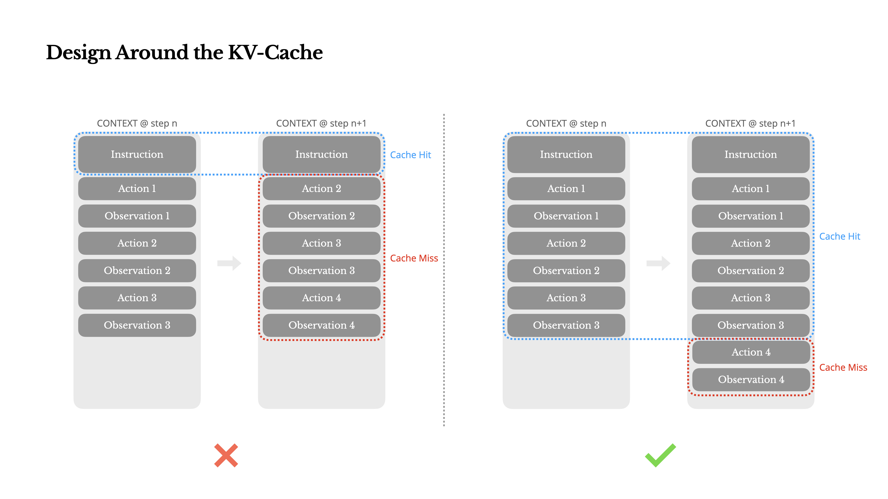
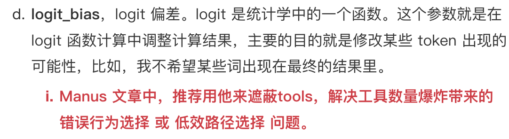
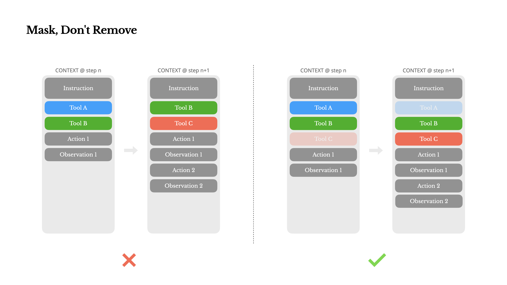
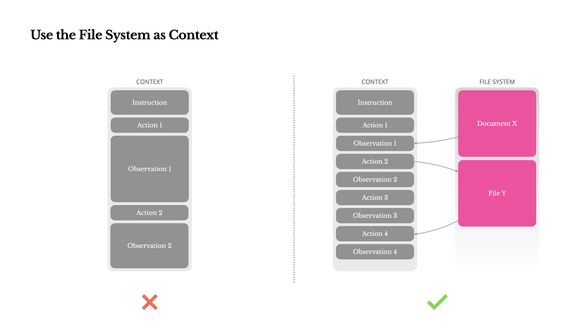
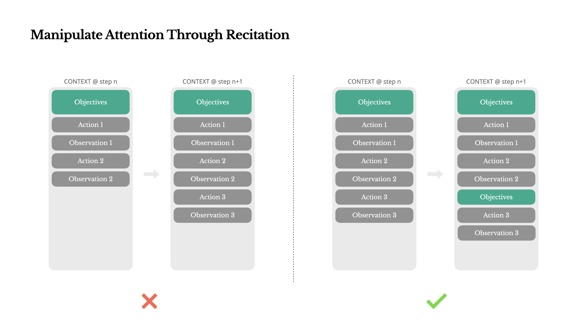
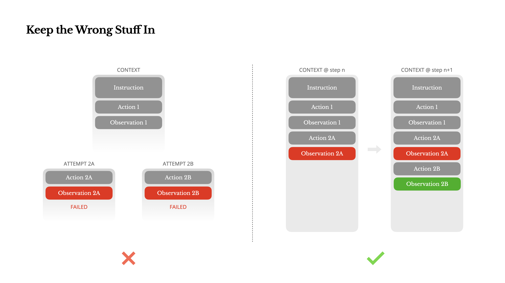
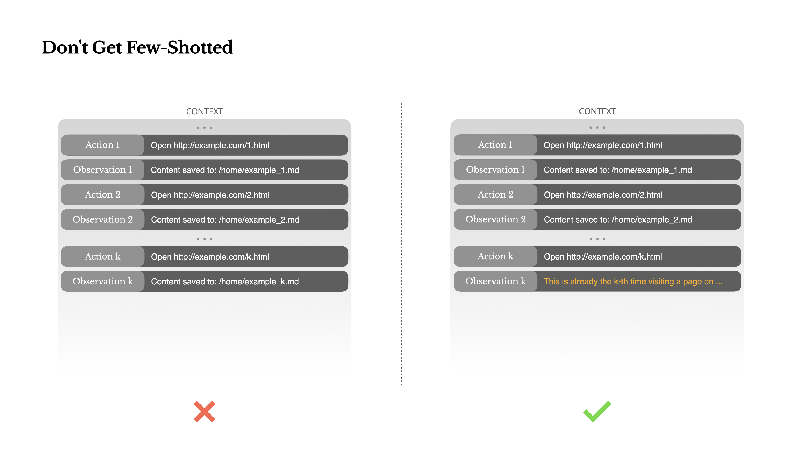

# 2025.7 - Manus - AI代理的上下文工程：构建Manus的经验教训

- [摘要](#%E6%91%98%E8%A6%81)
- [关键点](#%E5%85%B3%E9%94%AE%E7%82%B9)
- [内容](#%E5%86%85%E5%AE%B9)
  * [围绕 KV 缓存进行设计](#%E5%9B%B4%E7%BB%95-kv-%E7%BC%93%E5%AD%98%E8%BF%9B%E8%A1%8C%E8%AE%BE%E8%AE%A1)
  * [遮蔽，而非移除](#%E9%81%AE%E8%94%BD%E8%80%8C%E9%9D%9E%E7%A7%BB%E9%99%A4)
  * [使用文件系统作为上下文](#%E4%BD%BF%E7%94%A8%E6%96%87%E4%BB%B6%E7%B3%BB%E7%BB%9F%E4%BD%9C%E4%B8%BA%E4%B8%8A%E4%B8%8B%E6%96%87)
  * [通过复述操控注意力](#%E9%80%9A%E8%BF%87%E5%A4%8D%E8%BF%B0%E6%93%8D%E6%8E%A7%E6%B3%A8%E6%84%8F%E5%8A%9B)
  * [保留错误的内容](#%E4%BF%9D%E7%95%99%E9%94%99%E8%AF%AF%E7%9A%84%E5%86%85%E5%AE%B9)
  * [不要被少样本示例所困](#%E4%B8%8D%E8%A6%81%E8%A2%AB%E5%B0%91%E6%A0%B7%E6%9C%AC%E7%A4%BA%E4%BE%8B%E6%89%80%E5%9B%B0)
  * [结论](#%E7%BB%93%E8%AE%BA)

---

**Manus押注于上下文工程，而不是使用开源基础模型训练一个端到端的智能体模型**

### 摘要
开始使用AI代理的上下文工程：构建Manus的经验教训。文章分享了Manus团队在开发基于上下文学习的AI代理过程中积累的经验和原则，包括如何优化KV缓存、管理工具动态、使用文件系统作为上下文、操控注意力以及处理错误等关键实践。

### 关键点
+ **上下文学习**: Manus选择基于上下文学习构建智能体，以快速改进和保持与底层模型的正交性。  
+ **KV缓存**：KV缓存命中率对生产阶段AI代理至关重要，能显著降低延迟和成本。  提高KV缓存命中率的实践包括保持提示前缀稳定、上下文只追加、明确标记缓存断点等。  
+ **遮蔽，而非移除**：避免动态添加或移除工具，使用上下文感知状态机管理工具可用性。  通过响应预填充约束动作选择，使用一致前缀的动作名称简化工具组选择。  
+ **使用文件系统作为终极上下文**：使用文件系统作为上下文，解决上下文窗口限制问题，并支持模型按需写入和读取（可恢复）。  
+ **通过复述操控注意力**：通过复述目标操控注意力，避免长循环任务中目标不一致或偏离主题。  具体方法是创建todo.md文件，每次决策时将目标复述到上下文的末尾（近期注意力范围）。
+ **保留错误的内容**。保留错误尝试在上下文中，帮助模型更新内部信念并减少重复错误。  而不是试图重启并靠temperature参数的魔法重新生成结果。
+ 增加上下文多样性，避免少样本学习导致的模式化和脆弱性。  
+ 上下文工程是智能体系统的重要组成部分，塑造上下文决定智能体的行为方式。

### 内容
#### 围绕 KV 缓存进行设计
 KV-cache命中率 是生产阶段AI代理最重要的单一指标。它直接影响延迟和成本。

上下文爆炸问题：典型代理（REACT）的运作过程：用户输入=> 动作选择 => 环境执行 => 观察结果=>动作和结果附加到上下文中。随着每一步的推进，上下文不断增长，而输出——通常是结构化的函数调用——保持相对简短。这使得代理（agents）相比聊天机器人的预填充和解码比例高度倾斜。例如在Manus中，平均输入与输出的token比例约为100:1。

具有相同前缀的上下文可以利用KV缓存，这大大减少了首个token的生成时间(TTFT)和推理成本——无论你是使用自托管模型还是调用推理API。我们说的不是小幅度的节省：例如使用Claude Sonnet时，缓存的输入token成本为0.30美元/百万token，而未缓存的成本为3美元/百万token——相差10倍。

从上下文工程的角度，提高KV缓存命中率涉及几个关键实践：

1. 保持你的**提示前缀稳定**。 由于LLM的自回归特性，即使是单个标记的差异也会使该标记之后的缓存失效。一个常见的错误是在系统提示的开头包含时间戳——尤其是精确到秒的时间戳。虽然这让模型能告诉你当前时间，但也会降低你的缓存命中率。
2. 使你的**上下文只追加**。 避免修改之前的操作或观察。确保你的序列化是确定性的。许多编程语言和库在序列化JSON对象时不保证键顺序的稳定性，这可能会悄无声息地破坏缓存。
3. 在**需要时明确标记缓存断点**。 某些模型提供商或推理框架不支持自动增量前缀缓存，而是需要在上下文中手动插入缓存断点。在分配这些断点时，要考虑潜在的缓存过期问题，并至少确保断点包含系统提示的结尾。

此外，如果你正在使用像 vLLM 这样的框架自托管模型，请确保启用了前缀/提示缓存，并且你正在使用会话 ID 等技术在分布式工作节点之间一致地路由请求。

#### 遮蔽，而非移除
随着代理能力的增强，其行动空间自然变得更加复杂——简单来说，**工具数量**爆炸式增长，导致模型更可能选择错误的行动或采取低效的路径。

方式1，移除，不可行：设计一个动态行动空间——可能是使用类似于[RAG](https://en.wikipedia.org/wiki/Retrieval-augmented_generation)的方法按需加载工具

方式2，除非绝对必要，避免在迭代过程中动态添加或移除工具，可行。

1. 在大多数LLM中，工具定义在序列化后位于上下文的前部，通常在系统提示之前或之后。因此任何更改都会使后续所有动作和观察的**KV缓存失效**。
2. 当先前的动作和观察仍然引用当前上下文中**不再定义的工具**时，模型会感到困惑。如果没有约束解码，这通常会**导致模式违规或幻觉动作**。

为了解决这个问题并仍然改进动作选择，Manus使用上下文感知的状态机来管理工具可用性。它不是移除工具，而是在解码过程中**掩蔽token的logits**（概率分布），以基于当前上下文阻止（或强制）选择某些动作。

[https://www.yuque.com/pengcheng-fuigs/zpkvl7/fg3nv2l92fnm6atr](https://www.yuque.com/pengcheng-fuigs/zpkvl7/fg3nv2l92fnm6atr)

在实践中，大多数模型提供商和推理框架支持某种形式的响应预填充，这允许你**在不修改工具定义的情况下约束动作空间**。函数调用通常有三种模式（我们将使用 NousResearch 的 [Hermes 格式](https://github.com/NousResearch/Hermes-Function-Calling) 作为示例）：

+ **自动** – 模型可以选择调用或不调用函数。通过仅预填充回复前缀实现：<|im_start|>assistant
+ **必需** – 模型必须调用函数，但选择不受约束。通过预填充到工具调用令牌实现：<|im_start|>assistant<tool_call>
+ **指定** – 模型必须从特定子集中调用函数。通过预填充到函数名称的开头实现：<|im_start|>assistant<tool_call>{"name": "browser_

通过这种方式，我们通过直接掩码token的logits来约束动作选择。例如，当用户提供新输入时，Manus必须立即回复而不是执行动作。我们还有意设计了具有一致前缀的动作名称——例如，所有与浏览器相关的工具都以browser_开头，命令行工具以shell_开头。这使我们能够轻松确保代理在给定状态下只从特定工具组中进行选择**而无需使用有状态的logits处理器**。

这些设计有助于确保Manus代理循环保持稳定——即使在模型驱动的架构下。

#### 使用文件系统作为上下文
现代前沿LLM现在提供128K令牌或更多的上下文窗口。但在真实世界的代理场景中，这通常不够，有时甚至是一种负担。有三个常见的痛点：

1. **观察结果可能非常庞大**，尤其是当代理与网页或PDF等非结构化数据交互时。很容易超出上下文限制。
2. **模型性能往往会下降**，超过一定的上下文长度后，即使技术上支持该窗口大小。
3. **长输入成本高昂**，即使使用前缀缓存。你仍然需要为传输和预填充每个token付费。

为了解决这个问题，许多代理系统实现了**上下文截断**或**压缩**策略。但**过度激进的压缩不可避免地导致信息丢失。这个问题是根本性的**：代理本质上必须根据所有先前状态预测下一个动作——而你无法可靠地预测哪个观察结果可能在十步之后变得至关重要。从逻辑角度看，任何不可逆的压缩都带有风险。

这就是为什么我们在Manus中将**文件系统视为终极上下文**：大小不受限制，天然持久化，并且代理可以直接操作。模型学会按需写入和读取文件——不仅将文件系统用作存储，还用作结构化的外部记忆。

我们的压缩策略始终设计为**可恢复的**。例如，只要保留URL，网页内容就可以从上下文中移除；如果沙盒中仍然保留文档路径，则可以省略文档内容。这使得Manus能够**缩短上下文长度**，而不会永久丢失信息。

#### 通过复述操控注意力
Manus在处理复杂任务时，倾向于创建一个**todo.md**文件——并在任务进行过程中逐步更新它，勾选已完成的项目。这是一种**操控注意力**的刻意机制。

Manus中的一个典型任务平均需要大约**50次工具调用**。这是一个很长的循环——由于Manus依赖LLM进行决策，它很容易偏离主题或忘记早期目标，尤其是在长上下文或复杂任务中。

通过不断重写待办事项列表，Manus**将其目标复述到上下文的末尾**。这将全局计划推入模型的**近期注意力**范围内，避免了"**丢失在中间**"的问题，并减少了目标不一致。实际上，它使用自然语言来使自己的注意力偏向任务目标——而不需要特殊的架构变更。

#### 保留错误的内容
**代理会犯错。**这不是bug——这是现实。语言模型会产生幻觉，环境会返回错误，外部工具会出现异常行为，意外的边缘情况随时都会出现。在多步骤任务中，失败不是例外；它是循环的一部分。

然而，一个常见的冲动是隐藏这些错误：清理痕迹，重试操作，或重置模型的状态并将其留给神奇的"[温度](https://arxiv.org/abs/2405.00492)"。这感觉更安全，更受控制。但这是有代价的：**擦除失败会移除证据。没有证据，模型就无法适应**。

 根据我们的经验，改善代理行为最有效的方法之一出奇地简单：**将错误的尝试保留在上下文中**。当模型看到一个失败的行动——以及由此产生的观察结果或堆栈跟踪——它会隐式地更新其内部信念。这会改变其先验，降低重复相同错误的可能性。 事实上，我们认为**错误恢复**是真正代理行为的最明显指标之一。然而，在大多数学术工作和公共基准测试中，这一点仍然代表性不足，它们通常关注理想条件下的任务成功。

#### 不要被少样本示例所困
**少样本提示**是提高LLM输出的常用技术。但在代理系统中，它可能会以微妙的方式适得其反。 语言模型是优秀的模仿者；它们模仿上下文中的行为模式。如果你的上下文充满了类似的过去行动-观察对，模型将倾向于遵循该模式，即使这不再是最优的。

这在涉及重复决策或行动的任务中可能很危险。例如，当使用Manus帮助审查20份简历时，代理通常会陷入一种节奏——仅仅因为这是它在上下文中看到的，就重复类似的行动。这导致偏离、过度泛化，或有时产生幻觉。

解决方法是**增加多样性**。Manus在行动和观察中引入少量的结构化变化——不同的序列化模板、替代性措辞、顺序或格式上的微小**噪音**。这种受控的随机性有助于打破模式并调整模型的注意力。

 换句话说，**不要让自己陷入少样本学习的窠臼**。你的上下文越单一，你的智能体就变得越脆弱。

#### 结论
你如何塑造上下文最终决定了你的智能体的行为方式：它运行的速度、恢复的效果以及扩展的范围。

[https://manus.im/zh-cn/blog/Context-Engineering-for-AI-Agents-Lessons-from-Building-Manus](https://manus.im/zh-cn/blog/Context-Engineering-for-AI-Agents-Lessons-from-Building-Manus)

> 更新: 2025-08-04 02:35:39  
> 原文: <https://www.yuque.com/viruspc/el3mi0/xtloznporvgywe92>