# 1. Introduction to Agentic Workflows

- [总结](#%E6%80%BB%E7%BB%93)
- [What is Agentic AI](#what-is-agentic-ai)
- [Degrees of atomomy](#degrees-of-atomomy)
- [Benefits of Agentic AI](#benefits-of-agentic-ai)
- [Agentic AI Applications](#agentic-ai-applications)
- [Task Deomposition](#task-deomposition)
  * [Example: Writing an essay](#example-writing-an-essay)
  * [Example: Responding to consumer email](#example-responding-to-consumer-email)
  * [Example: Extracting Information from invoice](#example-extracting-information-from-invoice)
  * [What building block do you have?](#what-building-block-do-you-have)
  * [总结](#%E6%80%BB%E7%BB%93-1)
- [Evaluation Agentic AI (evals)](#evaluation-agentic-ai-evals)
- [Agentic Design Patterns](#agentic-design-patterns)

---

## 总结
1. 概念（What）
    1. Agentic AI 并不是一次性生成结果，而是通过执行多步来完成一个任务，可以得到更深思熟虑的结果。
    2. 从固定步骤（所谓的workflow）到自主决定下一步（所谓的agent），都是agentic AI
2. 优势（Why）
    1. agentic AI 具备 效果好、可并行、模块化的优势
3. 应用（How）
    1. 构建agentic AI 应用的核心是
        1. 如何拆步骤、步骤如何组合（固定还是由AI自主决定下一步）、可以使用的模块有哪些。
            1. 1. 当一步做不好事，就思考如何拆多步。如何拆？多想想真实场景中人是如何做的。
            2. 对于每一步，思考是 LLM做合适，还是用Tool做合适。需要了解有哪些可用的tools。
            3. Agentic workflow 搭建好后，往往还需要迭代。迭代的关键是，做好 evaluation。
        2. 如何做Evaluation。Evaluation 对任务完成的效果和后续迭代非常关键。
            1. 对于客观指标，可以编写代码来检查此特定错误发生的频率。如：回答消费者问题时，统计竞对公司名称出现的频率。
            2. 但对于主观指标，需要借助LLM能力。如：写文章时，打出1-5的质量分数。（顺便说一句，事实证明，LLM在1到5个等级的评分中实际上并不那么好）
            3. 可以是 end-to-end 或 component-level
    2. Agentic 设计模式
        1. Reflection
            1.   You can ask the LLM to examine its own  output, or maybe bring in some external sources of information (such as run the code and see if it generates any error messages, and use it as feedback to iterate again and come up with better version of its output)
        2. Tool Use
        3. Planning
            1. LLM decides what are the steps to take.
        4. Multi-agent collaboration

## What is Agentic AI
1. Instead of generate output at once, an agentic AI workflow is a process where an LLM based app executes multiple steps to complete a task
2. 可以得到更 thoughtful 的结果

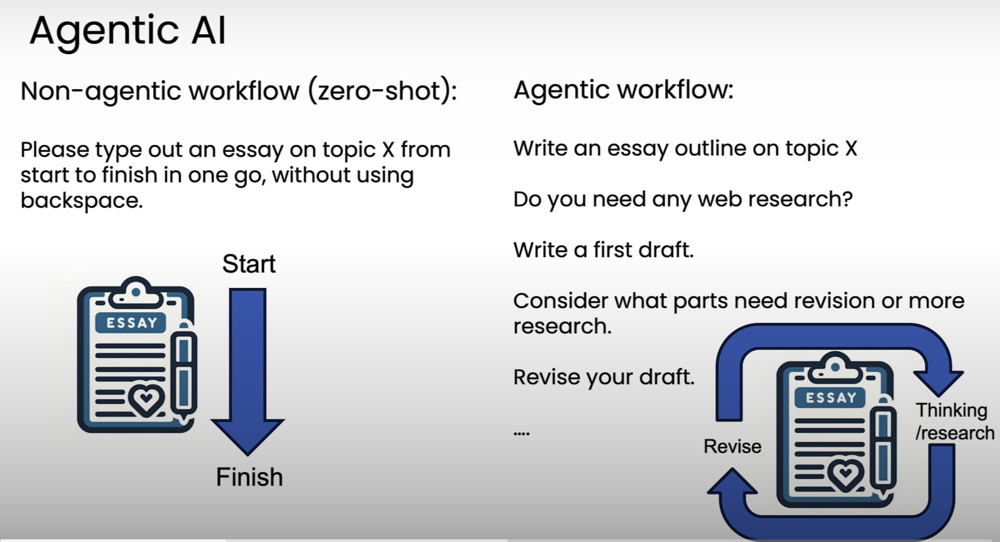

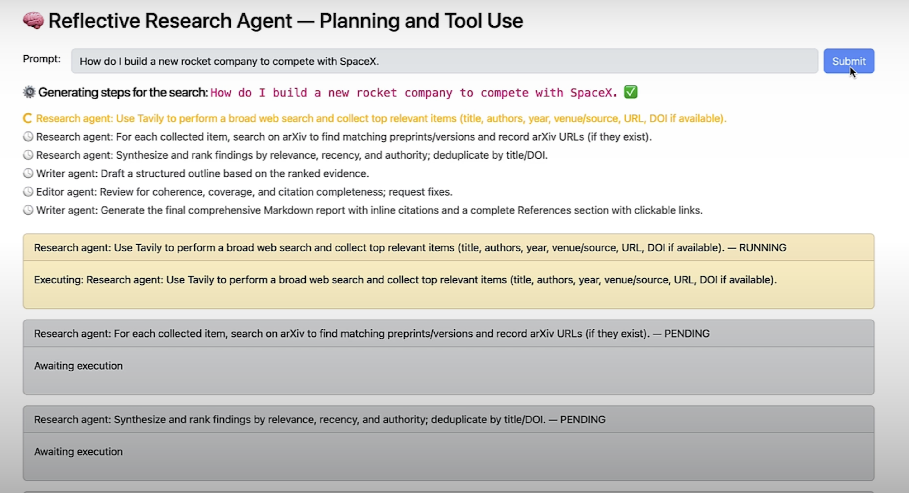

## Degrees of atomomy
1. 很多人会争论某个东西是否算是 Agent，这不重要。不如承认系统具备不同的agentic程度。
    1. 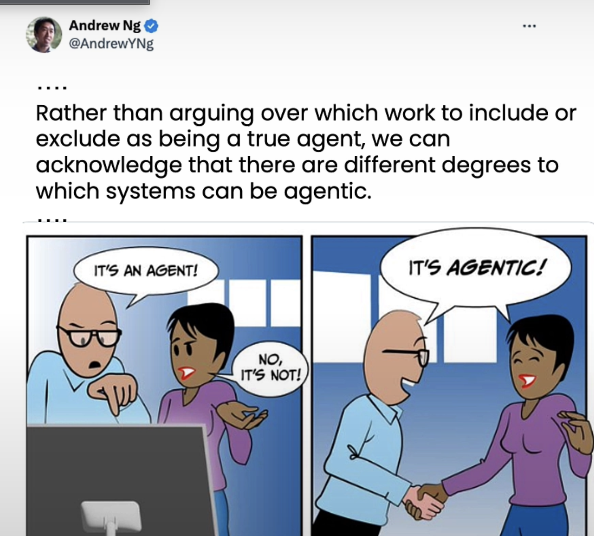
2. 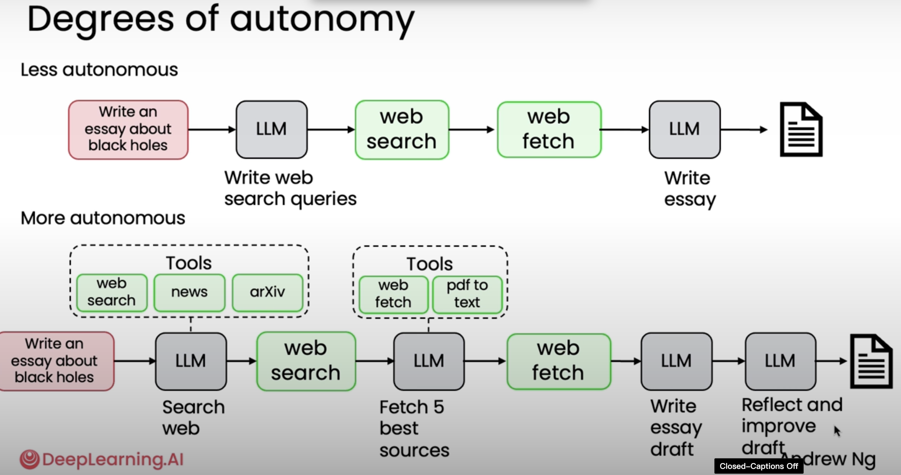
3. 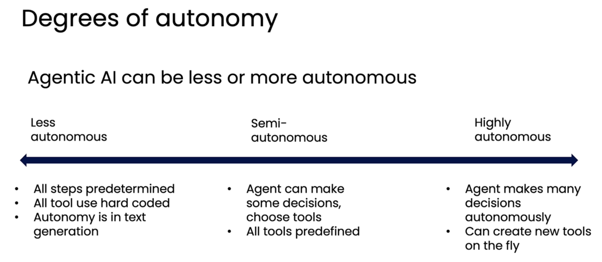

## Benefits of Agentic AI
1. Much better performance
2. Fast than humans because of parallelism. That lets you do certain things quite fast,
3. Modular: Can add or update tools, swap out models.

Human Eval benchmark 中，GPT 3.5 有48%正确率。GPT 4有67正确率，但仍然不如采用 agentic workflow 的 gpt 3.5 正确率高。

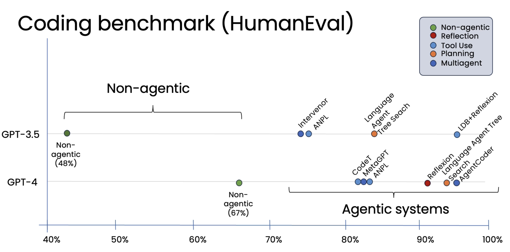

## Agentic AI Applications
关键是拆步骤，然后看怎么组合合适（是否agent决定下一步）

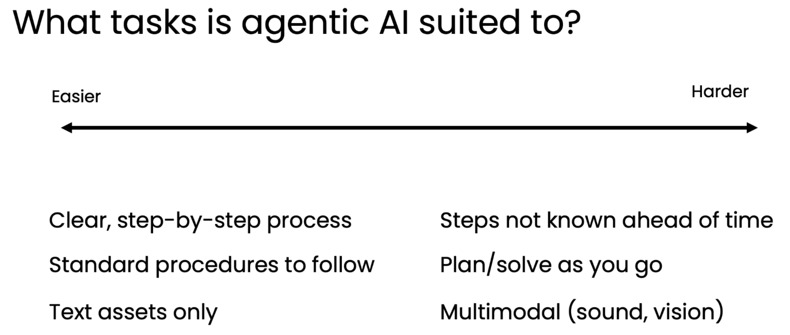

## Task Deomposition
如何将一个任务，拆解成方便 agentic workflow 遵循的独立步骤？

### Example: Writing an essay
以写文章为例，直接给prompt让LLM输出结果存在的问题：你会发现结果中仅包含肤浅的点，或仅包含显而易见的点，并没有像你想要的那么深入。

回想一个人是如何写文章的：

1. write an essay outline on topic X
2. search web
3. write the essay

拆解成步骤后，需要问一个问题：哪些步骤LLM做更合适，哪些写一段代码来解决更合适

1. write an essay outline on topic X (LLM)
2. search web （generate search terms with LLM + search with code）
3. write the essay (LLM)

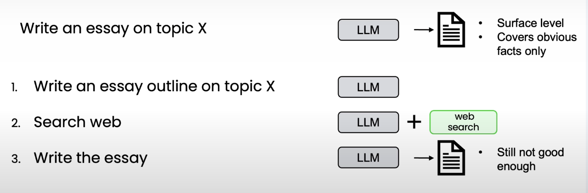

然后，你可能会发现写出的文章并不连贯

解决方法是，思考人是如何写文章的，进一步将第 3 步拆解

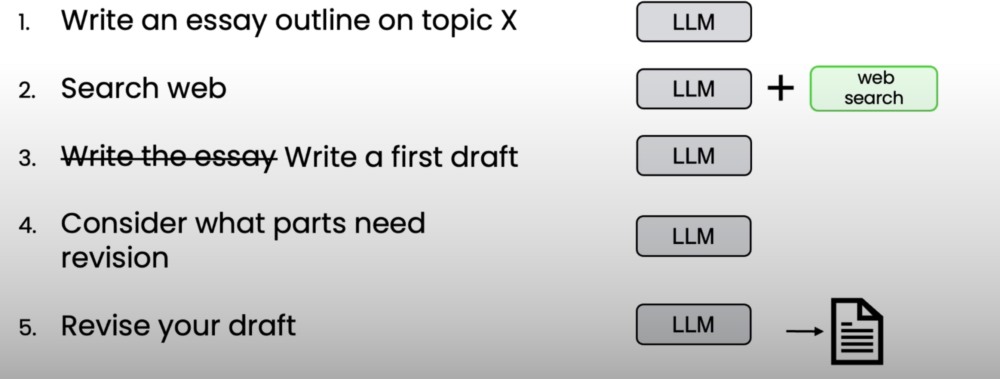

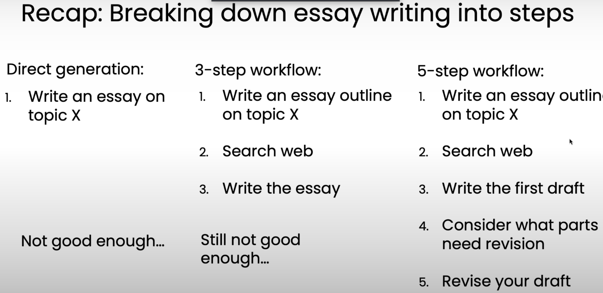

### Example: Responding to consumer email
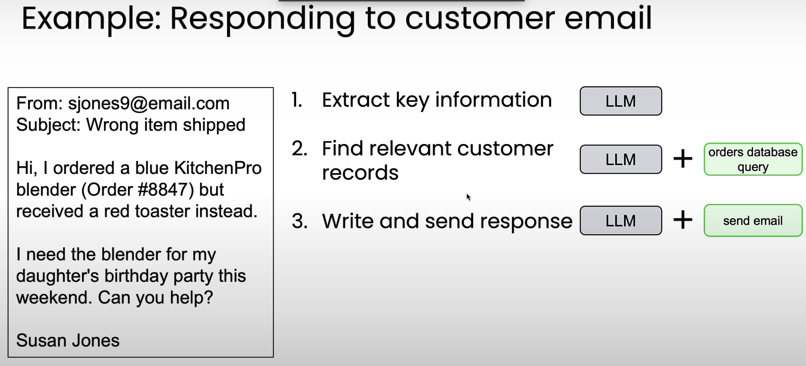

### Example: Extracting Information from invoice
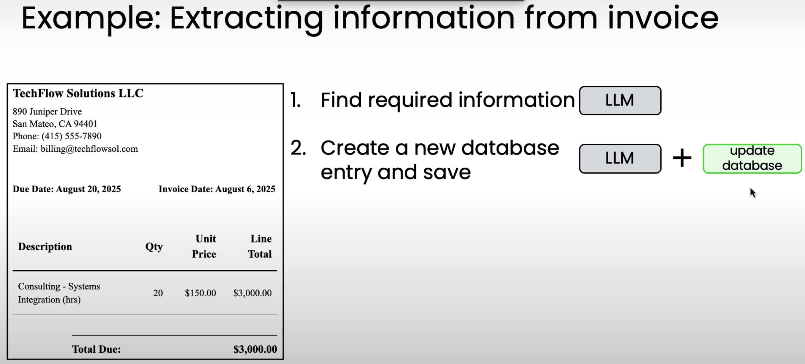

### What building block do you have?
AI模型 和 各种软件工具

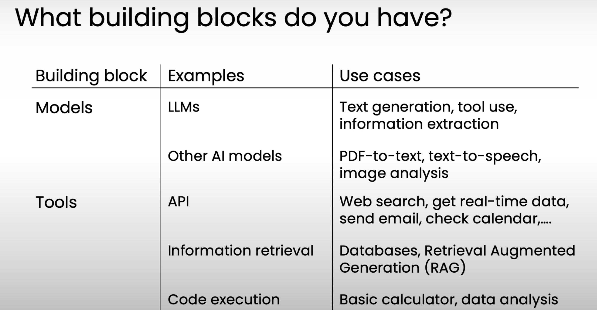

You should think of a lot of  work when you are building an agent workflow as looking at the work that:

1. the person or business is doing and then trying to figure out with these building blocks, 
2. how can you sequence these building blocks together in order to carry out the tasks that you want your system to carry out. 

And this is why having a good understanding of what building blocks are available,

### 总结
1. 当一步做不好事，就思考如何拆多步。如何拆？多想想真实场景中人是如何做的。
2. 对于每一步，思考是 LLM做合适，还是用Tool做合适。需要了解有哪些可用的tools。
3. Agentic workflow 搭建好后，往往还需要迭代。迭代的关键是，做好 evaluation。

## Evaluation Agentic AI (evals)
搭建workflow，eval 和 error analysis 很重要

One of the biggest predictors for whether someone is able to do it really well versus be less efficient at it is whether or not they're able to drive a really disciplined evaluation process

一个人能否出色完成任务，而非效率低下，最大的预测因素之一就是他们是否能驱动一个高度严谨的评估流程

your ability to drive evals for your agentic workflow makes a huge difference in your ability to build them effectively

您为代理工作流驱动eval的能力对您有效构建它们的能力产生了巨大的影响

这节主要讲如何构建evals

例子：回复中提到了竞对，这是不期望的

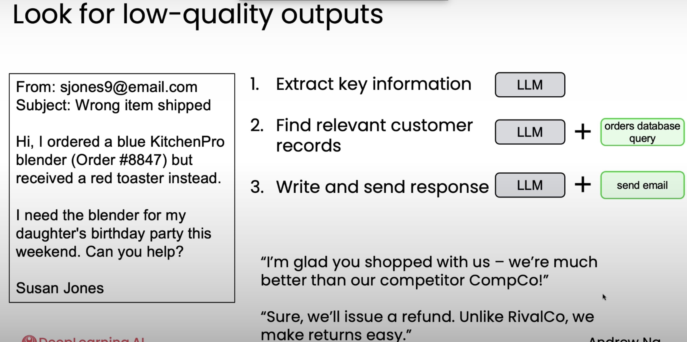

This is an example of a problem that is really hard to anticipate in advance of building this agentic workflow.

So, the best practice is really to build it first and then examine it to figure out where it is not yet satisfactory, and then to find ways to evaluate as well as improve the system to eliminate the ways that it is still not yet satisfactory.

这是一个在构建这个代理工作流之前很难预测的问题的例子。

因此，最好的做法是先构建它，然后检查它，找出它还不令人满意的地方，然后找到评估和改进系统的方法，以消除它仍然不令人满意之处。

添加一个Evaluation来追踪错误：

1. 对于客观指标，可以编写代码来检查此特定错误发生的频率。如：回答消费者问题时，统计竞对公司名称出现的频率。
2. 但对于主观指标，需要借助LLM能力。如：写文章时，打出1-5的质量分数。（顺便说一句，事实证明，LLM在1到5个等级的评分中实际上并不那么好。）
3. 可以是 end-to-end 或 component-level

理想情况下，你希望evaluation的分数越来越高。

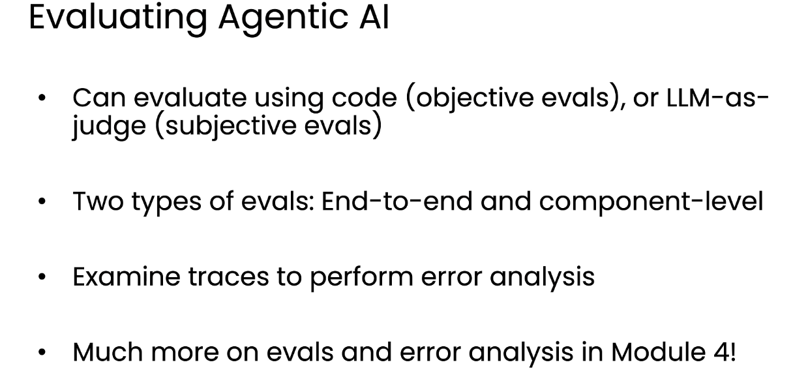

## Agentic Design Patterns
构建workflow，有几个重要设计模式：

1. Reflection
    1. You can ask the LLM to examine its own  output, or maybe bring in some external sources of information (such as run the code and see if it generates any error messages, and use it as feedback to iterate again and come up with better version of its output)
        1. 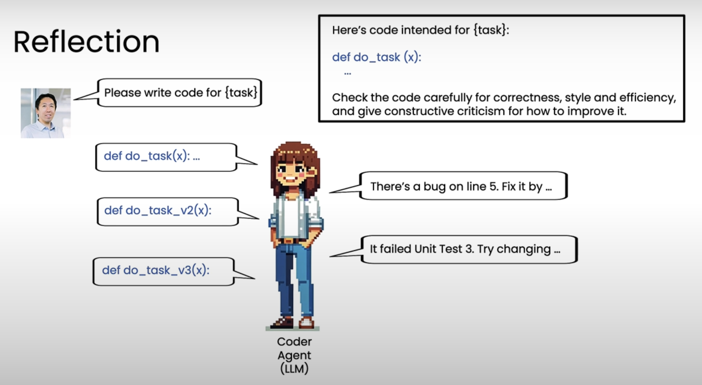
    2. in multi-agent system, there may be another critique agent.
        1. 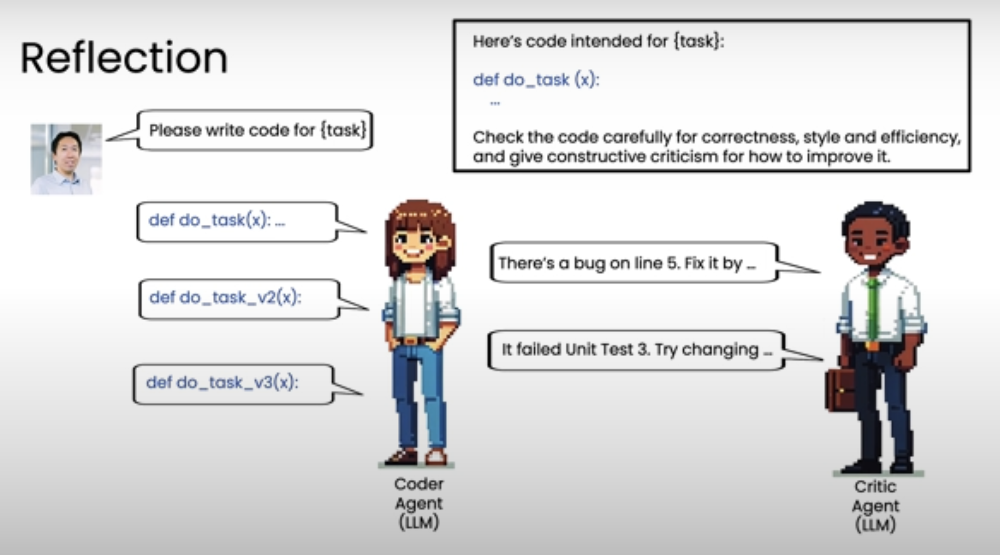
2. Tool Use
    1. 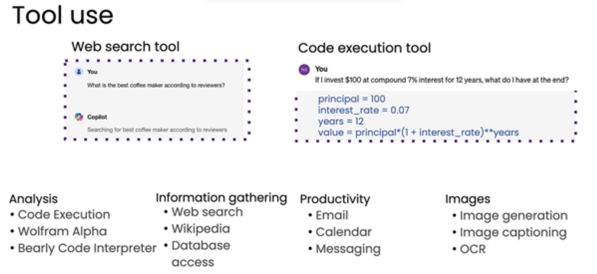
3. Planning
    1. In Planning, an LLM decides what is the sequence of actions it needs to take
    2. Instead of hard coding, LLM decides what are the steps to take.
    3. 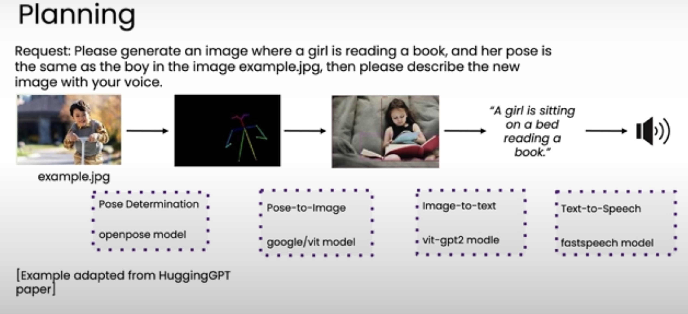
4. Multi-agent collaboration
    1.  Just as a human manager might hire a number of others to work together on a complex project, in some cases it might make sense for you to hire a set of multiple agents, maybe each of which specializes in a different role, and have them work together to accomplish a complex task. 

> 更新: 2025-11-09 08:35:48  
> 原文: <https://www.yuque.com/viruspc/el3mi0/egl2ug1nb7hhd3cm>