# 2. Reflection Design Pattern

- [总结](#%E6%80%BB%E7%BB%93)
- [Reflection to improve outputs of a task](#reflection-to-improve-outputs-of-a-task)
- [Why not just direct generation?](#why-not-just-direct-generation)
- [Chart generation workflow](#chart-generation-workflow)
- [Evaluation of Reflection](#evaluation-of-reflection)
  * [客观指标](#%E5%AE%A2%E8%A7%82%E6%8C%87%E6%A0%87)
  * [主观指标](#%E4%B8%BB%E8%A7%82%E6%8C%87%E6%A0%87)
- [Use External Feedback](#use-external-feedback)
- [Code Example: Improving SQL Generation with Reflection](#code-example-improving-sql-generation-with-reflection)

---

## 总结
1. What，什么是Reflection？
    1. 对回答做反思，生成更好的回答
2. WHy，为什么需要Reflection？
    1. 仅通过提示词工程，大模型能力提升有限
    2. 
3. How，如何使用Reflection？
    1. 什么时候用？提示词工程中期。
    2. 实现方式：通常，反思步骤直接硬编码实现
        1. 明确指定反思的具体行为
        2. 制定检查标准（对检查结果的衡量标准）
        3. 多从开源代码里找提示词
    3. 模型选择：通常，反思步骤采用不同的模型（不同模型适合不同的工作，比如zero shot prompting直接生成初版草稿，再用思考模型找bug）
    4. External Feedback：尽量在反思步骤获得更多响应结果之外的信息，将会使反思步骤变得更有力。例如，执行代码来看报错信息。
    5. Evaluation：Reflection 在不同应用场景影响不同，需要做evaluation来证明有效性。如果额外反思太长时间，但无法带来太多性能提升，可能就没有必要引入。
        1. 客观评估 
            1. 对代码生成任务做评估通常比较简单
            2. 构建评测集有利于prompt的迭代优化：构建数据集，构建一些prompt - ground truth 的数据对，然后在 no reflecton 和 with reflection 条件下进行测试，与ground truth相比较。正确率 = 回答对的问题 / 总问题 。
        2. 主观评估
            1. 使用LLM作为裁判
            2. 基于评分标准的评估（rubric-based grading）比较好
                1. 直接给出两个答案，让llm直接给结论，显然不会有太好的结果。而且LLM存在位置偏见，大多数LLM倾向于选第1个。
                2. 更好的方式是给一些实际的评价标准，让LLM判定满足了多少条件（如1～10），会得到更一致性的结果。


## Reflection to improve outputs of a task
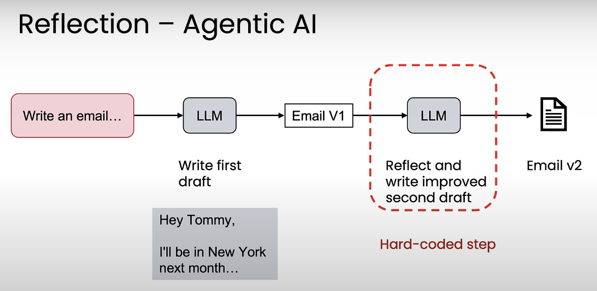

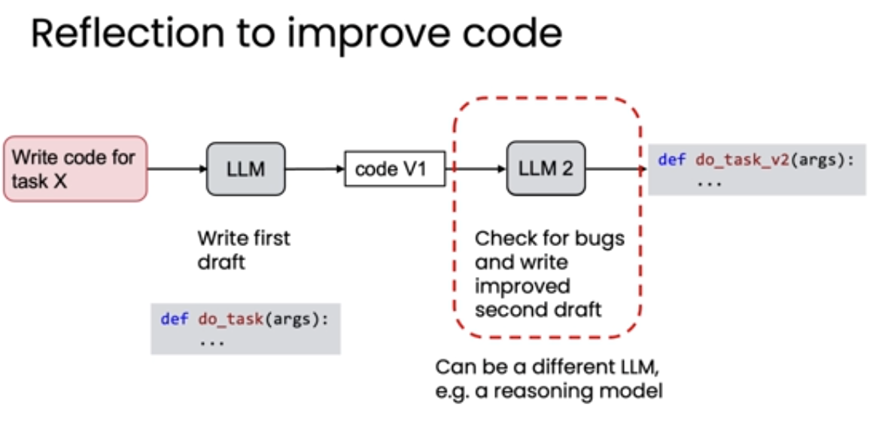

+ 对回答做反思，生成更好的回答。
+ 通常，反思步骤直接硬编码实现
+ 通常，反思步骤采用不同的模型（不同模型适合不同的工作，比如zero shot prompting直接生成初版草稿，再用思考模型找bug）

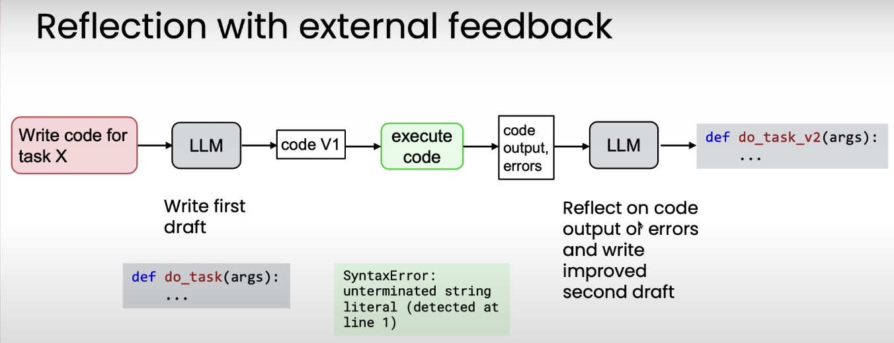

+ 尽量在反思步骤获得更多响应结果之外的信息，将会使反思步骤变得更有力。例如，执行代码来看报错信息。


## Why not just direct generation?
以 zero-shot prompting 为例

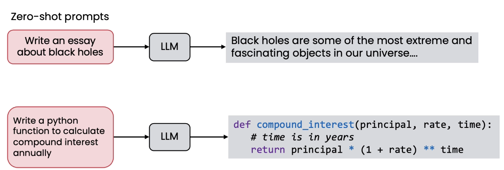


zero-shot VS on-shot Vs Few-shot:


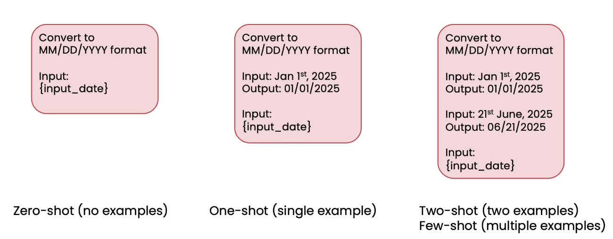

Reflection被证明在大部分任务里是稳定有效的（除了数学，看起来提升不大）

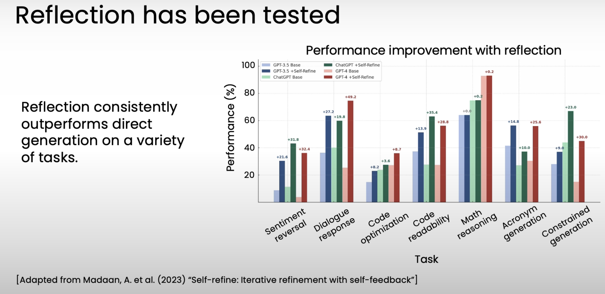


一些例子：

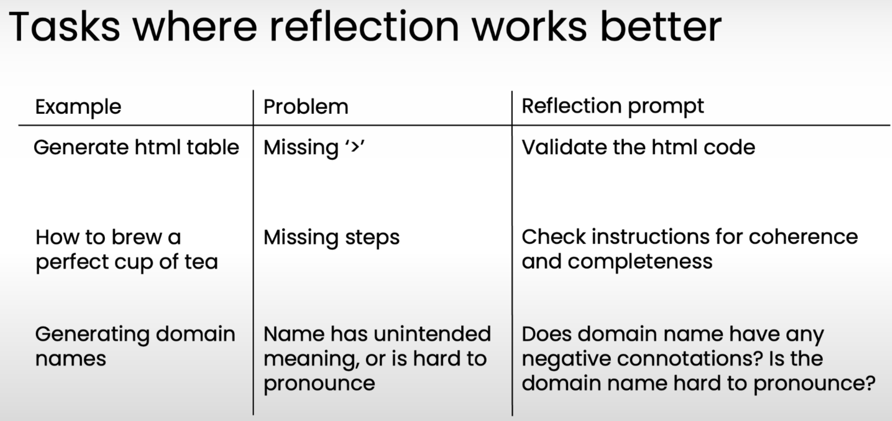


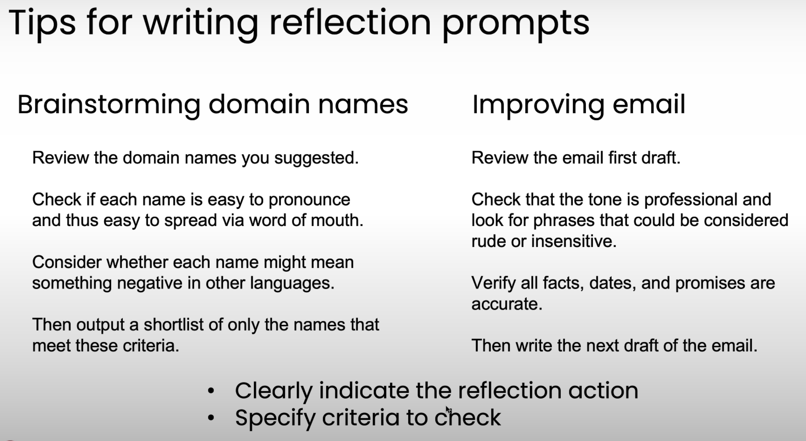


建议：

1. 明确指定反思的具体行为
2. 制定检查标准（对检查结果的衡量标准）
3. 多从开源代码里找提示词


## Chart generation workflow
流程示例：

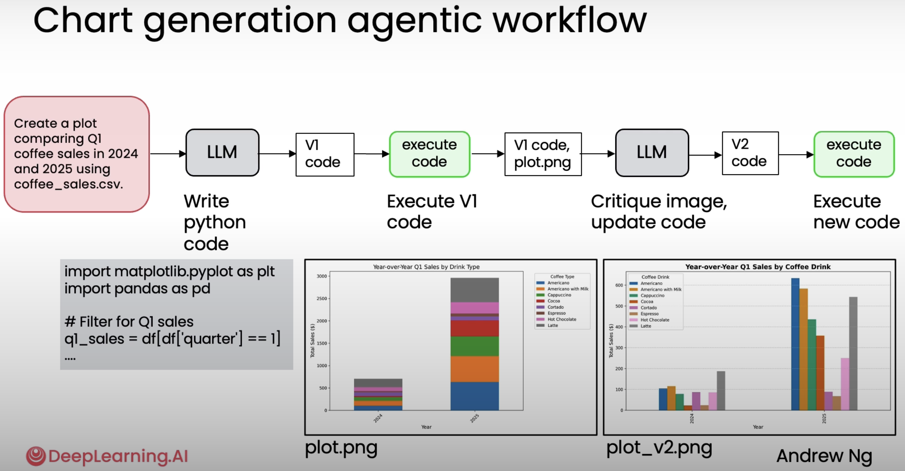


```python
def generate_chart_code(instruction: str, model: str, out_path_v1: str) -> str:
    """Generate Python code to make a plot with matplotlib using tag-based wrapping."""

    prompt = f"""
    You are a data visualization expert.

    Return your answer *strictly* in this format:

    <execute_python>
    # valid python code here
    </execute_python>

    Do not add explanations, only the tags and the code.

    The code should create a visualization from a DataFrame 'df' with these columns:
    - date (M/D/YY)
    - time (HH:MM)
    - cash_type (card or cash)
    - card (string)
    - price (number)
    - coffee_name (string)
    - quarter (1-4)
    - month (1-12)
    - year (YYYY)

    User instruction: {instruction}

    Requirements for the code:
    1. Assume the DataFrame is already loaded as 'df'.
    2. Use matplotlib for plotting.
    3. Add clear title, axis labels, and legend if needed.
    4. Save the figure as '{out_path_v1}' with dpi=300.
    5. Do not call plt.show().
    6. Close all plots with plt.close().
    7. Add all necessary import python statements

    Return ONLY the code wrapped in <execute_python> tags.
    """

    response = utils.get_response(model, prompt)
    return response
    
# Generate initial code
code_v1 = generate_chart_code(
    instruction="Create a plot comparing Q1 coffee sales in 2024 and 2025 using the data in coffee_sales.csv.", 
    model="gpt-4o-mini", 
    out_path_v1="chart_v1.png"
)
utils.print_html(code_v1, title="LLM output with first draft code")
```

```python
# Get the code within the <execute_python> tags
match = re.search(r"<execute_python>([\s\S]*?)</execute_python>", code_v1)
if match:
    initial_code = match.group(1).strip()
    utils.print_html(initial_code, title="Extracted Code to Execute")
    exec_globals = {"df": df}
    exec(initial_code, exec_globals)

# If code run successfully, the file chart_v1.png should have been generated
utils.print_html(
    content="chart_v1.png",
    title="Generated Chart (V1)",
    is_image=True
)
```

```python
def reflect_on_image_and_regenerate(
    chart_path: str,
    instruction: str,
    model_name: str,
    out_path_v2: str,
    code_v1: str,  
) -> tuple[str, str]:
    """
    Critique the chart IMAGE and the original code against the instruction, 
    then return refined matplotlib code.
    Returns (feedback, refined_code_with_tags).
    Supports OpenAI and Anthropic (Claude).
    """
    media_type, b64 = utils.encode_image_b64(chart_path)
    

    prompt = f"""
    You are a data visualization expert.
    Your task: critique the attached chart and the original code against the given instruction,
    then return improved matplotlib code.

    Original code (for context):
    {code_v1}

    OUTPUT FORMAT (STRICT!):
    1) First line: a valid JSON object with ONLY the "feedback" field.
    Example: {{"feedback": "The legend is unclear and the axis labels overlap."}}

    2) After a newline, output ONLY the refined Python code wrapped in:
    <execute_python>
    ...
    </execute_python>

    3) Import all necessary libraries in the code. Don't assume any imports from the original code.

    HARD CONSTRAINTS:
    - Do NOT include Markdown, backticks, or any extra prose outside the two parts above.
    - Use pandas/matplotlib only (no seaborn).
    - Assume df already exists; do not read from files.
    - Save to '{out_path_v2}' with dpi=300.
    - Always call plt.close() at the end (no plt.show()).
    - Include all necessary import statements.

    Schema (columns available in df):
    - date (M/D/YY)
    - time (HH:MM)
    - cash_type (card or cash)
    - card (string)
    - price (number)
    - coffee_name (string)
    - quarter (1-4)
    - month (1-12)
    - year (YYYY)

    Instruction:
    {instruction}
    """


    # In case the name is "Claude" or "Anthropic", use the safe helper
    lower = model_name.lower()
    if "claude" in lower or "anthropic" in lower:
        # ✅ Use the safe helper that joins all text blocks and adds a system prompt
        content = utils.image_anthropic_call(model_name, prompt, media_type, b64)
    else:
        content = utils.image_openai_call(model_name, prompt, media_type, b64)

    # --- Parse ONLY the first JSON line (feedback) ---
    lines = content.strip().splitlines()
    json_line = lines[0].strip() if lines else ""

    try:
        obj = json.loads(json_line)
    except Exception as e:
        # Fallback: try to capture the first {...} in all the content
        m_json = re.search(r"\{.*?\}", content, flags=re.DOTALL)
        if m_json:
            try:
                obj = json.loads(m_json.group(0))
            except Exception as e2:
                obj = {"feedback": f"Failed to parse JSON: {e2}", "refined_code": ""}
        else:
            obj = {"feedback": f"Failed to find JSON: {e}", "refined_code": ""}

    # --- Extract refined code from <execute_python>...</execute_python> ---
    m_code = re.search(r"<execute_python>([\s\S]*?)</execute_python>", content)
    refined_code_body = m_code.group(1).strip() if m_code else ""
    refined_code = utils.ensure_execute_python_tags(refined_code_body)

    feedback = str(obj.get("feedback", "")).strip()
    return feedback, refined_code

# Generate feedback alongside reflected code
feedback, code_v2 = reflect_on_image_and_regenerate(
    chart_path="chart_v1.png",            
    instruction="Create a plot comparing Q1 coffee sales in 2024 and 2025 using the data in coffee_sales.csv.", 
    model_name="o4-mini",
    out_path_v2="chart_v2.png",
    code_v1=code_v1,   # pass in the original code for context        
)

utils.print_html(feedback, title="Feedback on V1 Chart")
utils.print_html(code_v2, title="Regenerated Code Output (V2)")
```

```python
def run_workflow(
    dataset_path: str,
    user_instructions: str,
    generation_model: str,
    reflection_model: str,   
    image_basename: str = "chart",
):
    """
    End-to-end pipeline:
      1) load dataset
      2) generate V1 code
      3) execute V1 → produce chart_v1.png
      4) reflect on V1 (image + original code) → feedback + refined code
      5) execute V2 → produce chart_v2.png

    Returns a dict with all artifacts (codes, feedback, image paths).
    """
    # 0) Load dataset; utils handles parsing and feature derivations (e.g., year/quarter)
    df = utils.load_and_prepare_data(dataset_path)
    utils.print_html(df.sample(n=5), title="Random Sample of Dataset")

    # Paths to store charts
    out_v1 = f"{image_basename}_v1.png"
    out_v2 = f"{image_basename}_v2.png"

    # 1) Generate code (V1)
    utils.print_html("Step 1: Generating chart code (V1)… 📈")
    code_v1 = generate_chart_code(
        instruction=user_instructions,
        model=generation_model,
        out_path_v1=out_v1,
    )
    utils.print_html(code_v1, title="LLM output with first draft code (V1)")

    # 2) Execute V1 (hard-coded: extract <execute_python> block and run immediately)
    utils.print_html("Step 2: Executing chart code (V1)… 💻")
    match = re.search(r"<execute_python>([\s\S]*?)</execute_python>", code_v1)
    if match:
        initial_code = match.group(1).strip()
        exec_globals = {"df": df}
        exec(initial_code, exec_globals)
    utils.print_html(out_v1, is_image=True, title="Generated Chart (V1)")

    # 3) Reflect on V1 (image + original code) to get feedback and refined code (V2)
    utils.print_html("Step 3: Reflecting on V1 (image + code) and generating improvements… 🔁")
    feedback, code_v2 = reflect_on_image_and_regenerate(
        chart_path=out_v1,
        instruction=user_instructions,
        model_name=reflection_model,
        out_path_v2=out_v2,
        code_v1=code_v1,  # pass original code for context
    )
    utils.print_html(feedback, title="Reflection feedback on V1")
    utils.print_html(code_v2, title="LLM output with revised code (V2)")

    # 4) Execute V2 (hard-coded: extract <execute_python> block and run immediately)
    utils.print_html("Step 4: Executing refined chart code (V2)… 🖼️")
    match = re.search(r"<execute_python>([\s\S]*?)</execute_python>", code_v2)
    if match:
        reflected_code = match.group(1).strip()
        exec_globals = {"df": df}
        exec(reflected_code, exec_globals)
    utils.print_html(out_v2, is_image=True, title="Regenerated Chart (V2)")

    return {
        "code_v1": code_v1,
        "chart_v1": out_v1,
        "feedback": feedback,
        "code_v2": code_v2,
        "chart_v2": out_v2,
    }

```

模型选择：

同样，推荐使用思考模型来做反思。

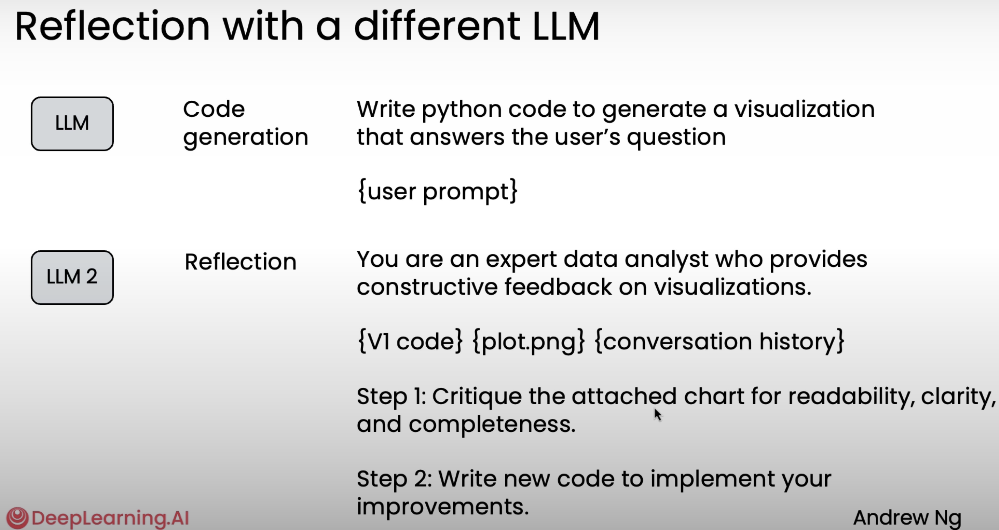

## Evaluation of Reflection
Reflection 在不同应用场景影响不同，需要做evaluation来证明有效性。如果额外反思太长时间，但无法带来太多性能提升，可能就没有必要引入。


### 客观指标
以写SQL为例。

构建数据集，构建一些prompt - ground truth 的数据对，然后在 no reflecton 和 with reflection 条件下进行测试，与ground truth相比较。

正确率 = 回答对的问题 / 总问题 

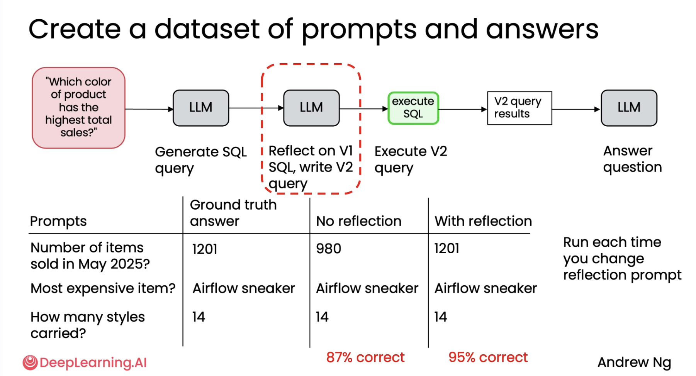

构建起评测系统，方便测试大量新的prompt。


### 主观指标
相对于上一节讲到的chart generation，chart绘制的好坏偏主观。如何做evaluation？用LLM做裁判。


直接用LLM来对比？在这个例子中，可以直接把两个图片给大模型做对比。存在的问题是：

1. 显然不会有太好的结果
2. LLM存在位置偏见，大多数LLM倾向于选第1个。

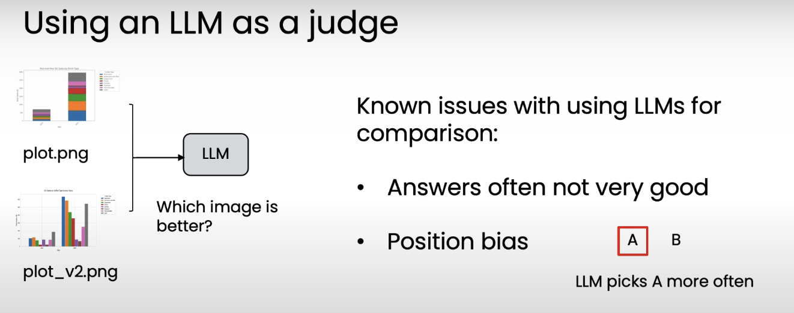


更好的方式是给一些实际的评价标准，让LLM判定满足了多少条件（如1～10），会得到更一致性的结果。

例如，你可能会提示一个大型语言模型（LLM），在给定一张图像的情况下，根据质量评估标准来评估附带的图像，而评估标准或评分标准可能包含明确的标准，比如情节是否有明确的标题，访问标签是否存在等。


同样地，最后可以在 no reflection 和 with reflection 两种模式下执行，来打分。


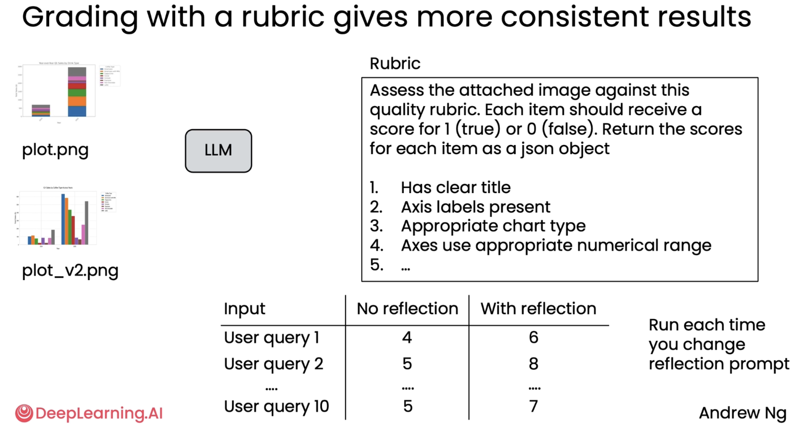


总结：

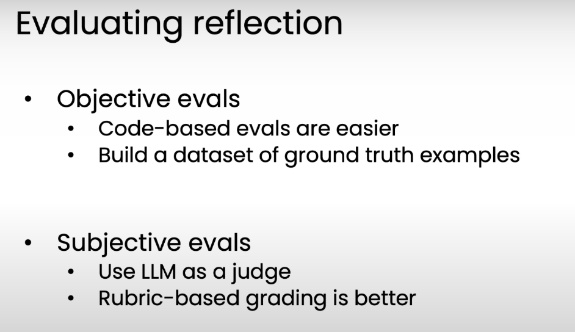


## Use External Feedback
如果能获得外部反馈，那么这种反馈下的反思会比仅以大型语言模型（LLM）作为唯一反馈来源的反思更为有力。


+ 随着时间推移（不断优化），zero-shot prompting 中 prompt engineering 的作用会变得越来越小。prompt engineering 只在早期做。
+ 此时，添加reflection能力，可以带来比较好的效果。当然，reflection也不要在太早期做，引入过多复杂度。
+ 如果能够给到 额外反馈，表现将会变得更好。


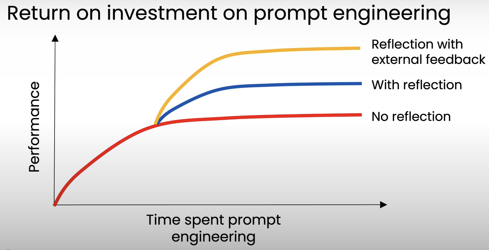

一些有助于获取 external feedback，有助于reflecton的tools：

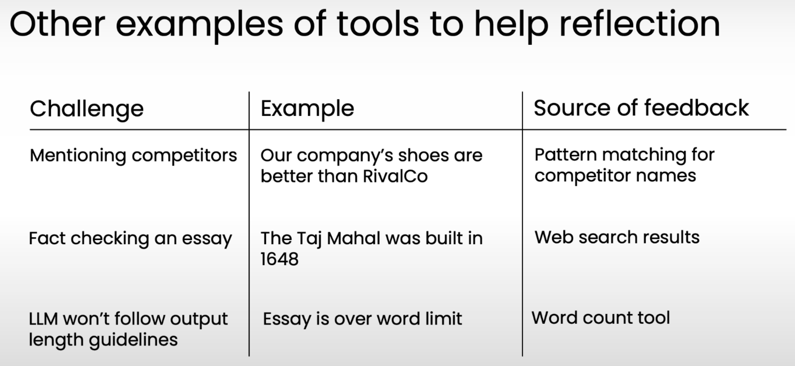

所以，你可以写一段代码来帮忙找到额外的“事实”，帮助LLM反思如何优化输出

## Code Example: Improving SQL Generation with Reflection
```python
def run_sql_workflow(
    db_path: str,
    question: str,
    model_generation: str = "openai:gpt-4.1",
    model_evaluation: str = "openai:gpt-4.1",
):
    """
    End-to-end workflow to generate, execute, evaluate, and refine SQL queries.

    Steps:
      1) Extract database schema
      2) Generate SQL (V1)
      3) Execute V1 → show output
      4) Reflect on V1 with execution feedback → propose refined SQL (V2)
      5) Execute V2 → show final answer
    """

    # 1) Schema
    schema = utils.get_schema(db_path)
    utils.print_html(
        schema,
        title="📘 Step 1 — Extract Database Schema"
    )

    # 2) Generate SQL (V1)
    sql_v1 = generate_sql(question, schema, model_generation)
    utils.print_html(
        sql_v1,
        title="🧠 Step 2 — Generate SQL (V1)"
    )

    # 3) Execute V1
    df_v1 = utils.execute_sql(sql_v1, db_path)
    utils.print_html(
        df_v1,
        title="🧪 Step 3 — Execute V1 (SQL Output)"
    )

    # 4) Reflect on V1 with execution feedback → refine to V2
    feedback, sql_v2 = refine_sql_external_feedback(
        question=question,
        sql_query=sql_v1,
        df_feedback=df_v1,          # external feedback: real output of V1
        schema=schema,
        model=model_evaluation,
    )
    utils.print_html(
        feedback,
        title="🧭 Step 4 — Reflect on V1 (Feedback)"
    )
    utils.print_html(
        sql_v2,
        title="🔁 Step 4 — Refined SQL (V2)"
    )

    # 5) Execute V2
    df_v2 = utils.execute_sql(sql_v2, db_path)
    utils.print_html(
        df_v2,
        title="✅ Step 5 — Execute V2 (Final Answer)"
    )

```

```python
def refine_sql_external_feedback(
    question: str,
    sql_query: str,
    df_feedback: pd.DataFrame,
    schema: str,
    model: str,
) -> tuple[str, str]:
    """
    Evaluate whether the SQL result answers the user's question and,
    if necessary, propose a refined version of the query.
    Returns (feedback, refined_sql).
    """
    prompt = f"""
    You are a SQL reviewer and refiner.

    User asked:
    {question}

    Original SQL:
    {sql_query}

    SQL Output:
    {df_feedback.to_markdown(index=False)}

    Table Schema:
    {schema}

    Step 1: Briefly evaluate if the SQL output answers the user's question.
    Step 2: If the SQL could be improved, provide a refined SQL query.
    If the original SQL is already correct, return it unchanged.

    Return a strict JSON object with two fields:
    - "feedback": brief evaluation and suggestions
    - "refined_sql": the final SQL to run
    """

    response = client.chat.completions.create(
        model=model,
        messages=[{"role": "user", "content": prompt}],
        temperature=1.0,
    )

    
    content = response.choices[0].message.content
    try:
        obj = json.loads(content)
        feedback = str(obj.get("feedback", "")).strip()
        refined_sql = str(obj.get("refined_sql", sql_query)).strip()
        if not refined_sql:
            refined_sql = sql_query
    except Exception:
        # Fallback if the model does not return valid JSON:
        # use the raw content as feedback and keep the original SQL
        feedback = content.strip()
        refined_sql = sql_query

    return feedback, refined_sql
```


> 更新: 2025-11-09 13:17:20  
> 原文: <https://www.yuque.com/viruspc/el3mi0/xipbzglftlrucnz9>