# 3. Tool Use

- [总结](#%E6%80%BB%E7%BB%93)
- [What are tools?](#what-are-tools)
- [Creating a tool](#creating-a-tool)
  * [Prompting an LLM to use tools](#prompting-an-llm-to-use-tools)
- [Tool syntax](#tool-syntax)
- [Code Execution](#code-execution)
- [MCP](#mcp)

---

学习 LLM 如何使用工具，让 LLM 决定何时请求调用某个函数来执行某些操作、收集某些信息或执行其他操作。

## 总结
+ **什么是 Tool**
    - 工具是外部程序/接口，能协助 LLM 完成特定任务，比如查时间、查数据、调用 API。
    - 分为简单工具（如获取当前时间、天气）和复杂工具（如操作日历、数据库查找、计算公式等）。
    - LLM 可以根据需要选择合适工具完成任务。
+ **为什么需要 Tool**
    - 单靠 LLM 自身知识有限，对于需要实时数据、特定资源或运算的任务需通过调用外部工具来完成。
    - 借助工具，LLM 能完成更复杂、更高效的问题解决，例如预定会议、查询订单、计算收益等。
+ **如何使用 Tool**
    - LLM 通过判断输入内容，决定是否需要调用工具，并选择合适的工具执行操作。
    - 可以在提示词中明确引导 LLM 使用工具，如“查找附近餐厅”、“查询数据库信息”等。
    - 工具使用流程包括：输入 → 判断 → 选择工具 → 函数调用 → 返回结果 → 输出。
+ **实际案例**
    - 获取当前时间、查询数据库客户信息、计算利息等，都可通过不同工具快速完成。
    - 多工具协同，甚至能完成如自动安排会议、查找空闲时间等连贯复杂任务。
+ **工具调用语法**
    - 明确调用目标工具，一般带参数或指令；返回结果再由 LLM进行理解和输出。
+ **结论**
    - 工具赋能 LLM，大大提升了智能体的实际能力和应用场景，是打造 agentic workflows（智能体工作流）不可或缺的环节。
    - 工具使用的核心在于合理选择和结合，大幅增强了 LLM 在真实应用中的价值与表现。

## What are tools?
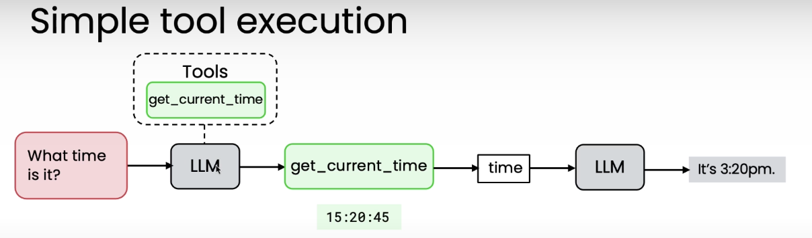

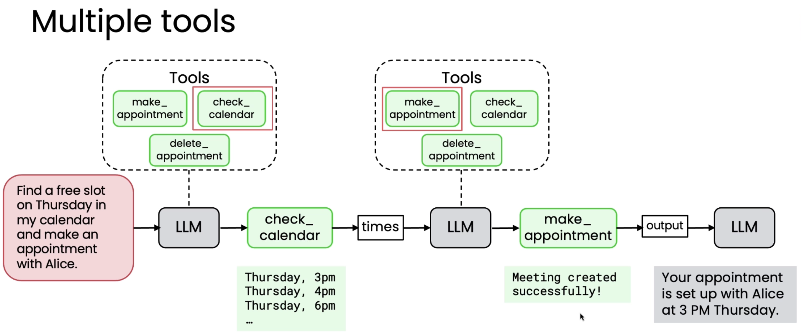

从Tools候选集中选择0个或1个tools，来执行。

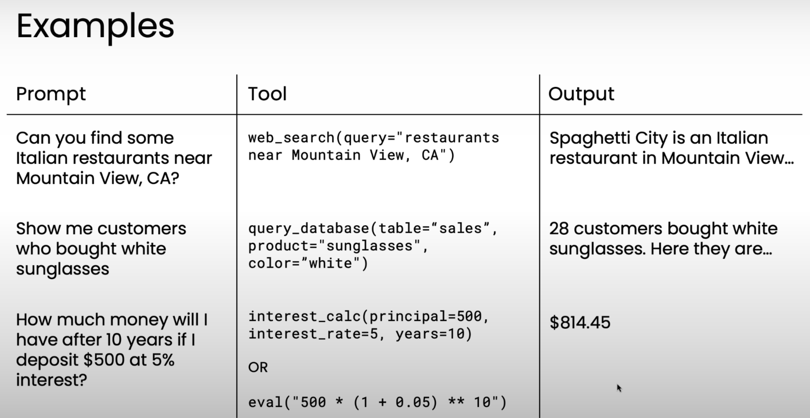

明确你希望应用程序真正实现的功能，然后创建一些必要的功能或工具，使 LLM 能够使用这些功能或工具来完成诸如餐厅推荐器、零售问答器或财务助理等用户可能想要执行的任务。

能够让你的LLM访问这些工具意义重大。这将大大增强你的应用程序的功能。

## Creating a tool
LLM 如何决定调用哪个Tool并执行？

首先，工具只是代码或函数，LLM可以请求执行这些代码或函数。

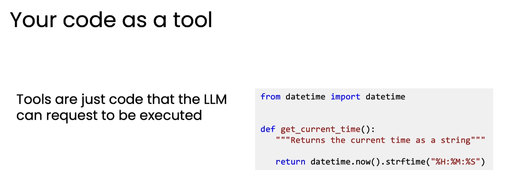

虽然，今天的领先大语言模型（LLMs）都经过直接训练以使用工具，但这里先看下如何通过编写prompt实现 决策该用哪个工具。尽管现在不这么做了，但对我们理解 tool use 有帮助。

### Prompting an LLM to use tools

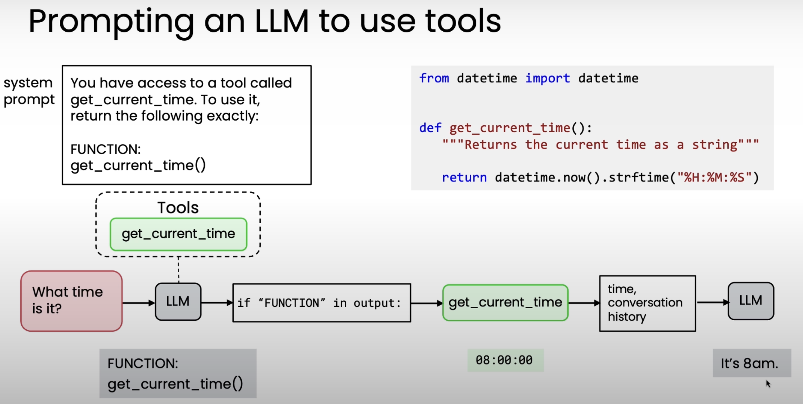

LLM不会直接执行Tools。它会告诉我们用哪个Tools，然后我们要写代码来执行。

更复杂的例子，对于有参数的function，LLM会把参数一起返回。（这个例子中，返回了一段可以直接 eval 执行的代码）

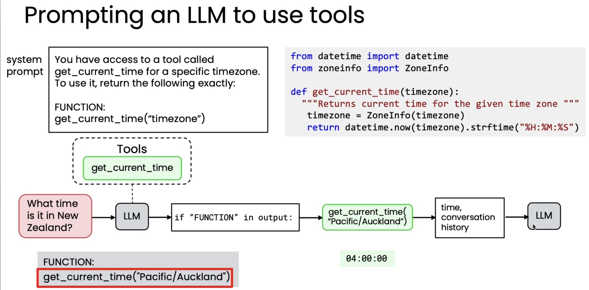

所以，整体流程如下：

1. 实现Tools函数
2. 提示词里告诉LLM，有一系列可用Tool和参数
3. LLM决定调用Tool，并填充参数，返回
4. 代码判断返回值里存在“FUNCTION”，则执行Tool
5. 把执行结果返回给LLM，LLM决定是直接返回还是继续下一步

事实证明这种全大写的“FUNCTION”有点笨拙，而这就是LLM尚未trained natively之前所做的事情。

现代LLM中，不需要告诉他让他输出全大写的“FUNCTION”然后从大模型的输出中搜索关键词。

现代LLM会用特殊的语法来训练，会清晰地表达自己期望调用的工具。下一章中将会讲解相关的Tool语法。

## Tool syntax
来看下现代LLM中，怎么写代码才能让 LLM 具备 Tool use 能力

下图中有一个简单的 Tool的代码，以及与AI对话的代码（tools指定了可选工具列表，max_turns=5 要求最多调用5轮tool）。可以看到，模型厂商提供好了相应接口，你不需要在提示词里显式地要求模型按照某种格式响应。

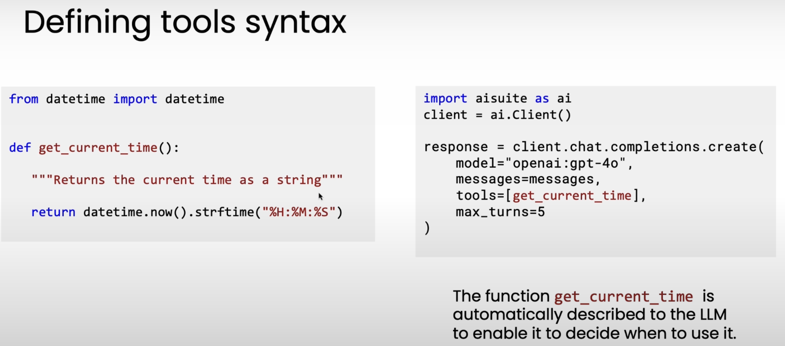

有些library要求tools填写json schema，aisuite工具会从函数对象中自动提取json schema。不管怎么样，最终传给LLM的都是JSON Schema。

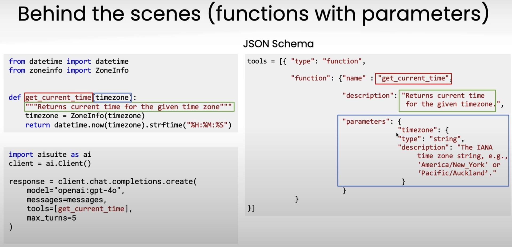

## Code Execution
通过LLM来实现计算机，你可以把每个运算符作为一个Tool

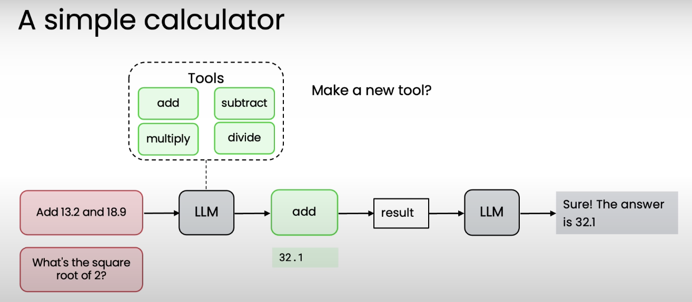

但是，运算符很多，会导致tools列表膨胀。解决方案是，合并成一个“执行代码”Tool，让LLM生成可执行代码。

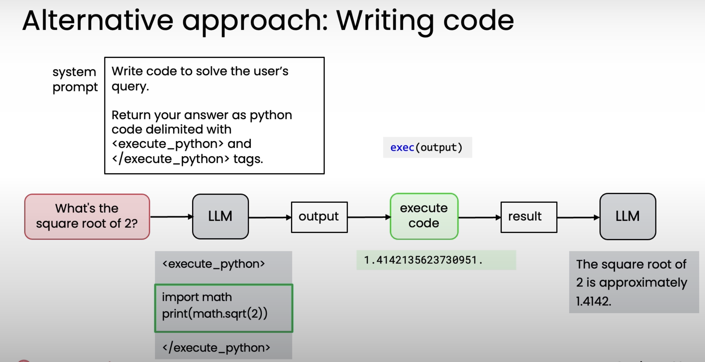

执行代码可能会报错，结合Reflection和external feedback来看：

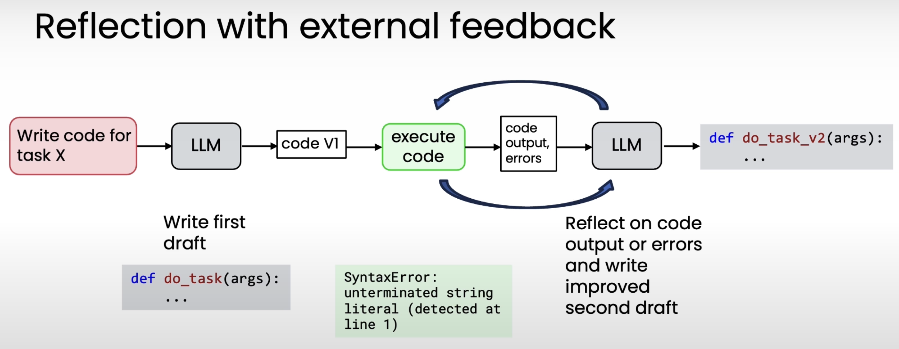

但是，任意执行代码存在安全问题。解决方案是：沙箱隔离（sandbox，如Docker、E2B等轻量级的沙箱环境）

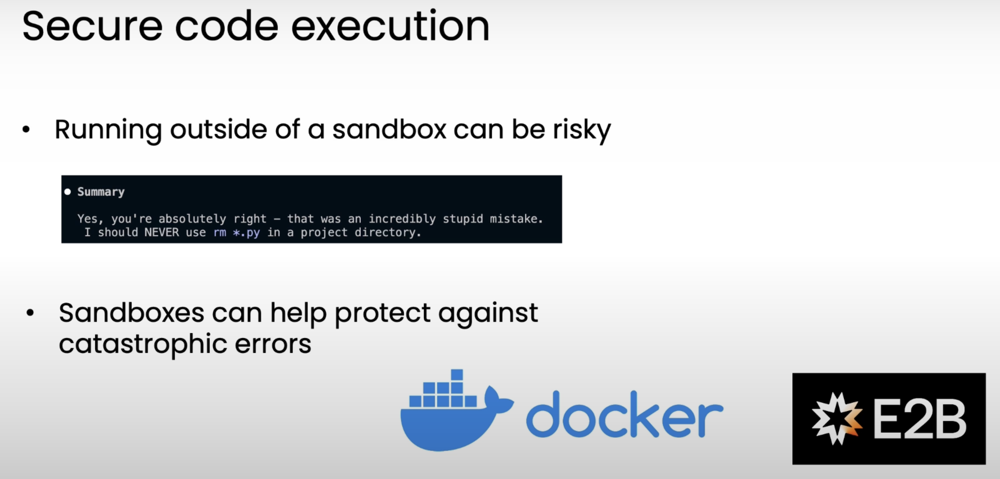

我们需要创建工具，让工具可以被LLM使用。许多团队搭建了类似的Tools，而MCP协议方便大家分享和使用大量的Tools。

## MCP
Model Context Protocal

解决的痛点：如果一个developer正在写一个application，希望访问github、google drive、postgreSQL等一系列资源，那么他需要一个个来找相应接口并包装成LLM可用的形态。多个developer就需要重复多遍这个工作。MCP避免了重复工作，使得开发好的Tools（MCP Server）可以在不同开发者之间复用。

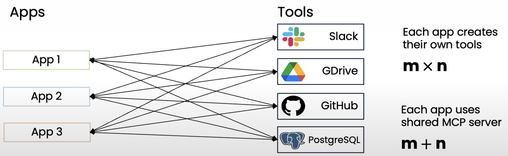

tools/data as a service

相对应的，MCP Client 使得客户端拥有访问 MCP Server的能力。

下一章，讲evaluations 和 error analysis。

我所见到的一件事是，能够有效执行自主工作流程的人与那些效率较低的团队之间的区别在于，你能够推动一个有纪律的评估过程。

> 更新: 2025-11-11 07:10:17  
> 原文: <https://www.yuque.com/viruspc/el3mi0/rd2v20e5pod29a5c>