# 4. Practical Tips for Building Agentic AI

- [总结](#%E6%80%BB%E7%BB%93)
- [Evaluations (evals，end-to-end)](#evaluations-evalsend-to-end)
- [Error analysis an prioritizing next steps (component-level)](#error-analysis-an-prioritizing-next-steps-component-level)
- [More error analysis examples](#more-error-analysis-examples)
- [Component-level evaluations](#component-level-evaluations)
- [How to address problems you identify](#how-to-address-problems-you-identify)
- [Latency, cost optimization](#latency-cost-optimization)
- [Development process summary](#development-process-summary)

---

## 总结
1. What
    1. 
2. Why
3. How

## Evaluations (evals，end-to-end)
When developing an agentic AI system, it's difficult to know in advance where it will work and where it won't work so well and thus where you should focus your effort.

 So very common advice is to try to build even a quick and dirty system to start, so you can then try it out and look at it to see where it may not yet be working as well as you wish, to then have much more focused efforts to develop it even further.

先构建一个最简单的应用和评测，再根据运行情况慢慢优化二者（优化提示词、补充数据集等）。

以 invoice processin system 为例，先通过10-20个invoice来构建数据集:

1. 人工打标，作为ground truth
2. LLM 执行任务，拿到待评测数据
3. 二者做比较

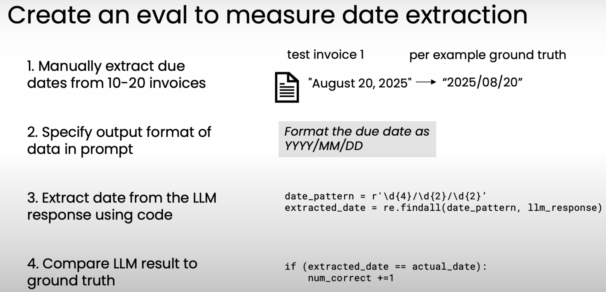

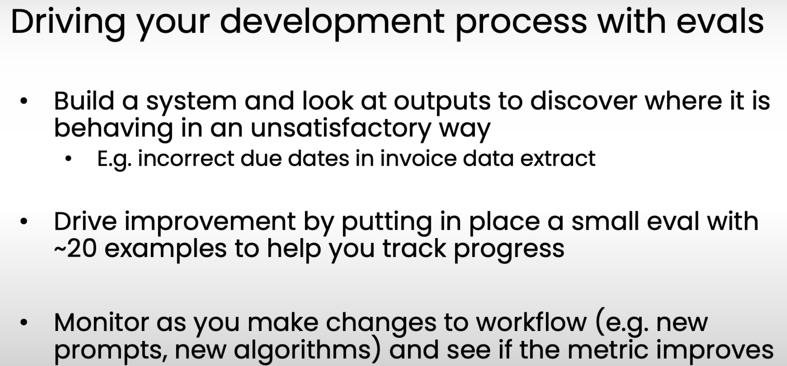

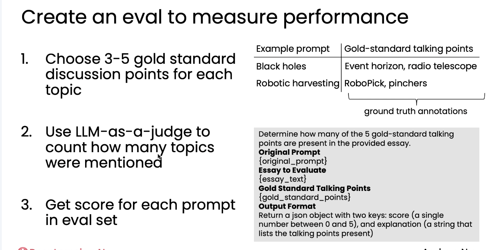

end-to-end evals 主要有以下2个维度

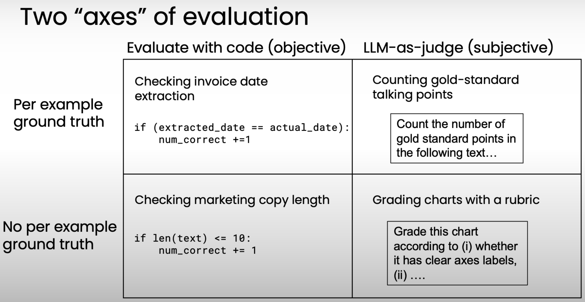

有/无逐样本真值：一些任务中，对单个样本没有确定的标准答案，或难以获得/定义。例子：开放式生成（如写作、对话）、主观评分任务、只有相对偏好反馈（A 比 B 好）但没有“绝对正确答案”的情况。

Tips for build end-to-end evals

1. Quick and dirty is ok to start
2. 随着迭代，你可以越来越相信evals。as you find places where your evals fail to capture human judgementas is to what system is better, use that as an opportunity to improve the metric 
3. look for places where p performance is worse than humans

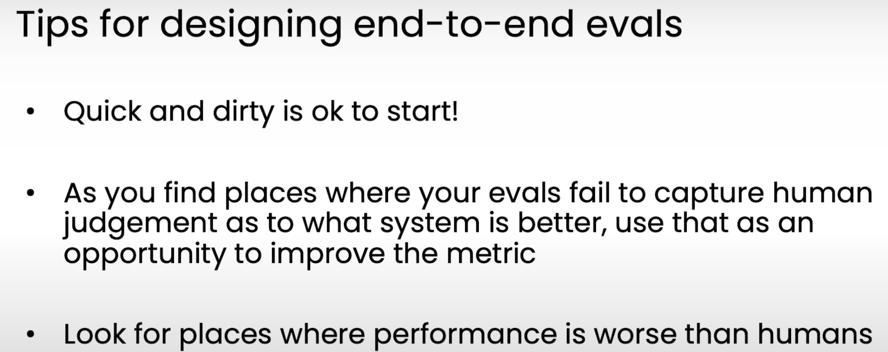

So I hope that after you've built that quick and dirty system, you think about when it would make sense to start putting in some evals to track the potentially problematic aspects of the system, and that that will then help you drive improvements in the system.

In addition to helping you drive improvements, it turns out that there's a method of evals that helps you hone in of your entire agentic system. 

**What are the components most worth focusing your attention on?**

## Error analysis an prioritizing next steps (component-level)
where do you focus your efforts to make it better?

agentic workflow中，一些component可能发挥更大的作用。挑选待优化地方的技巧，对提升系统表现至关重要。

衡量团队效率和优秀程度的最大指标之一是他们是否能够推动一个有纪律的错误分析流程，以明确努力的重点。one of the biggest predictors for how efficient and how good a team is, is whether or not they're able to drive a disciplined error analysis process to tell you where to focus your efforts.

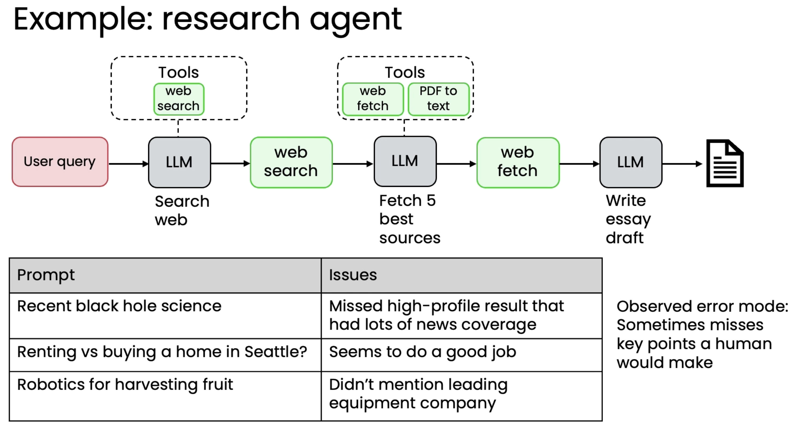

在research agent 示例中，我们在之前的视频中进行了 error analysis 错误分析。我们看到它经常缺失关键点，而人类专家在某些主题的写作中会包含这些关键点。

所以现在你发现了这个问题，有时缺少关键点，你怎么知道该从哪里着手呢？

agent workflow中有许多步骤，每一步都对错误有贡献：

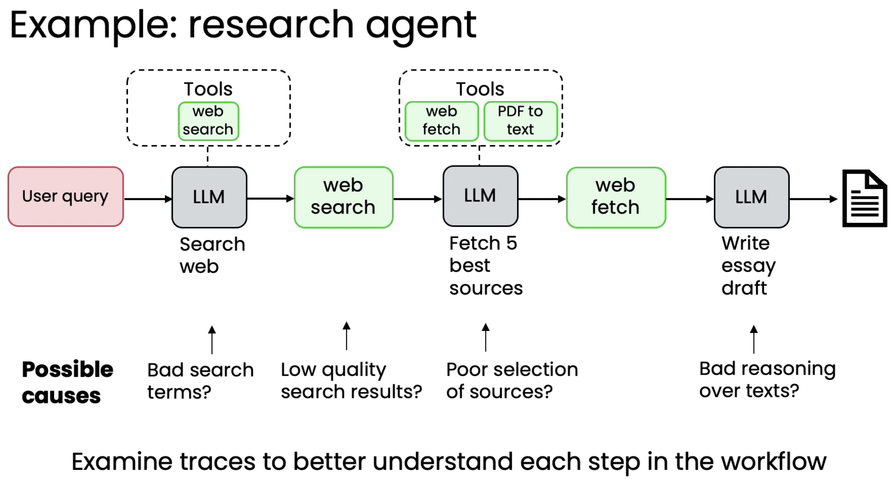

需要做的是，检查traces (the trace of a run of this agent，有时也叫span，意思是每个步骤之后的中间输出)，以便理解哪个组件的性能不达标（远不如人类专家所做到的，因为这指向可能存在安全改进的地方）

注意，需要expert 人工地来查看traces。（PS：引入额外的专家知识来验证每一步的结果很关键）

通过观察这些中间输出，您可以尝试了解每个步骤的输出质量，对可能存在问题的组件有一个非正式的了解

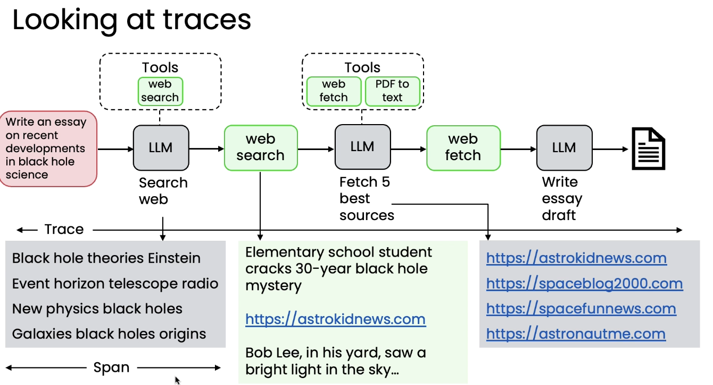

为了更高效地发现问题，关注 bad case 而不是 good case 的 trace。所以我们也称之为 error analysis。

为了使这一过程更加严格，而不是随意阅读和获得一种非正式的感觉，您实际上可以建立一个电子表格，以更明确地统计错误出现的位置（从哪一步或者哪几步开始产生比较严重的错误）。

进一步地，统计每个component出现问题的占比，就可以知道应该重点优化的对象。

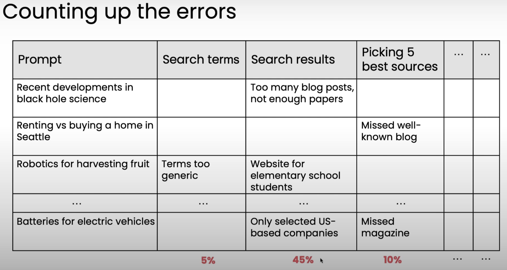

Tips:

1. develop a habit of looking at traces 养成观察trace的习惯
2. carry out error analysis to figure out outwhat component 进行error analysis以找出哪个组件出了问题
3. performed poorly,leading to a poor final output use error analysis output to decide where to focus efforts.  使用错误分析结果来决定努力的重点方向

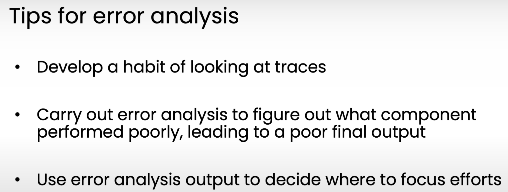

## More error analysis examples
从pdf的invoce提取信息，并存入数据库的例子：

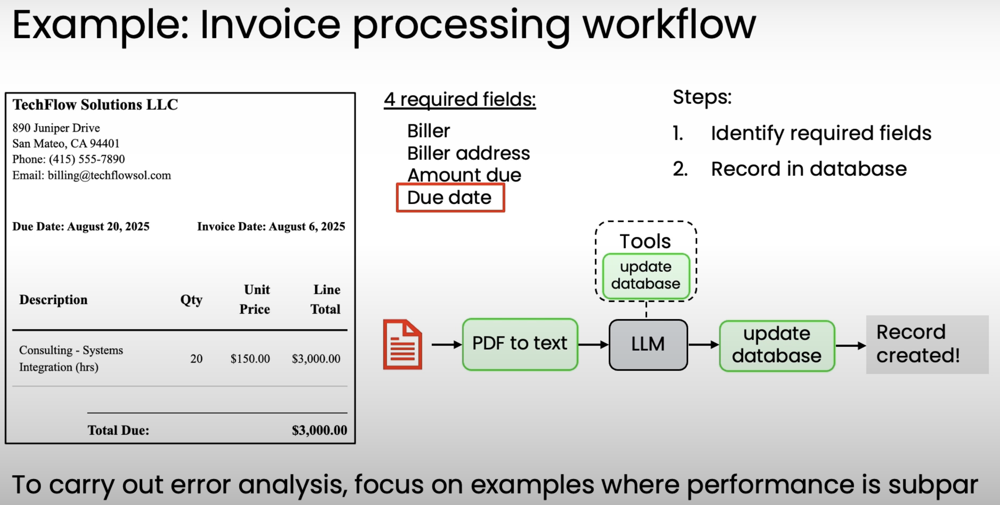

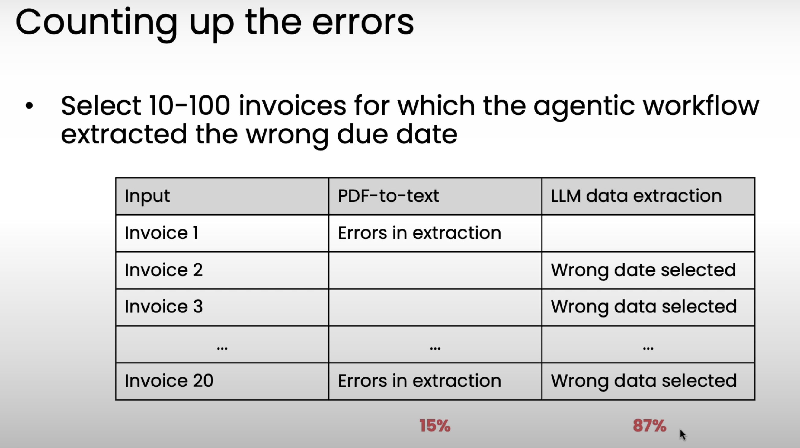

不做error analysis，有的团队可能就要花大量时间在优化 PDF-to-text上，而这个问题实际只占15%

回复客户邮件的例子：

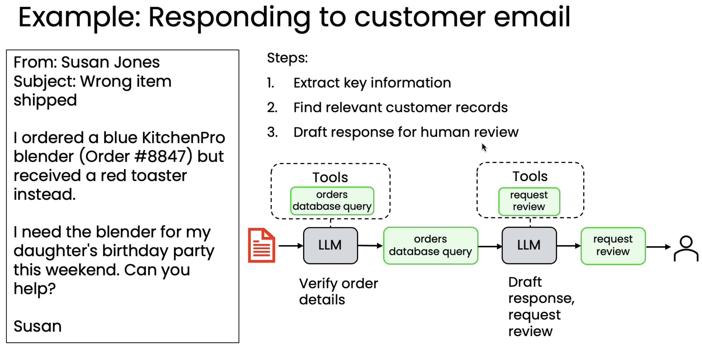

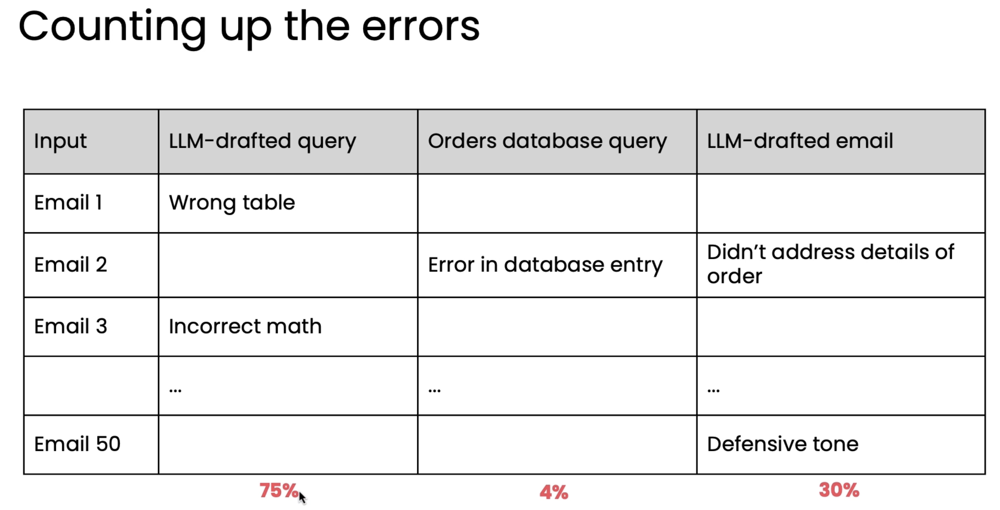

## Component-level evaluations
背景：

1. 评估代价低。End-to-end eval is expensive。每次修改一个组件，端到端地重新跑整个workflow来做eval是代价昂贵的。
2. 方便定位问题和评估贡献。其他组件引入的随机性会带来噪音，比较难看到单个组件的细微改进。

方法：

1. 不止使用end-to-end的eval，还要引入component level的eval，来衡量具体组件的表现。
    1. 创建数据集。create a list of gold standard web resources
    2. 写代码，做objective evaluation。write code that calculates how many results correspond to gold standard websitese.g.fl-score
    3. 边修改超参数边观察trace。track as you vary hyperparameters: e.g, search engine,number of results, dates
    4. 在component-level优化完后，最后还是要跑一遍end-to-end eval，来确保改进有效。

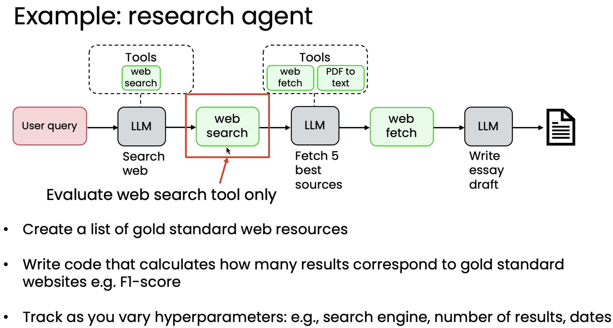

component-level eval的优势：

1. can provide clearer signal for specific errors
    1. avoid the noise in end-to-end system
2. more efficient for focused team
    1. work on sm i smaller,more targeted problems faster

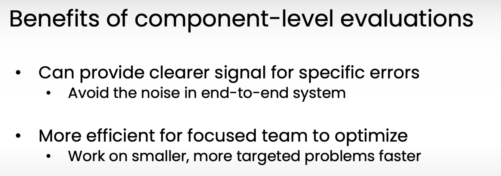

## How to address problems you identify
一个 agentic workflow 可能由多种类型的 component 组成，不同 component 解决问题的方式将会非常不同。这里分析一些常用解决方案。

对于非LLM组件，可以通过以下两种方式提升性能：

1. 调整超参数
2. 替换新组件

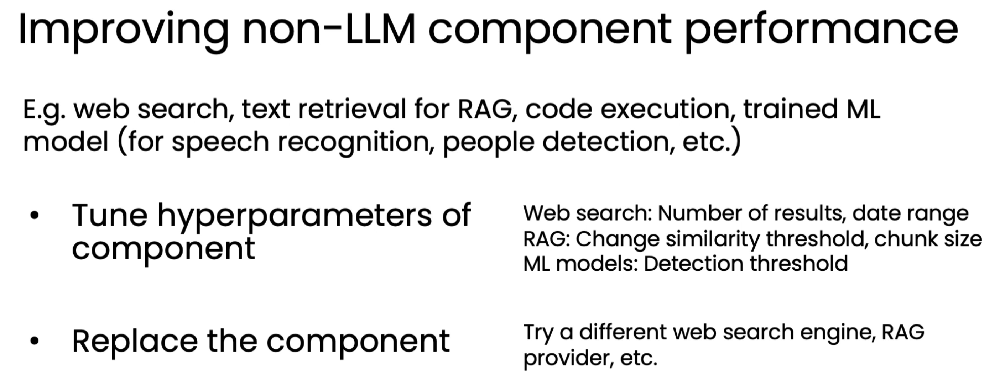

对于LLM组件，可以通过以下四种方式提升性能：

1. 优化提示词。(LLM组件的超参数)
2. 替换新模型。
    1. 多尝试不同模型
        1. 不同模型适合不同任务，培养出这种直觉将会很有帮助。
        2. 不同模型适合不同的提示词，多学习其他人是如何使用某个模型的。
    2. 在自己的agentic workflow使用不同模型
        1. 明白哪种模型最适合哪种任务
            1. 通过查看trace来获得一种非正式的感觉，通过查看组件级或端到端的评估，这些都可以帮助你评估不同模型在工作流程的不同部分的效果如何。
            2. 接着，不仅是性能，你可能打磨出有关速度和价格的trade-off的模型选择的直觉。
        2. 一些接口聚合的库，可以让你很方便地在不同模型间切换
3. 拆分多步（可以是子agent）
4. 微调模型（最后的选项，微调太复杂了）

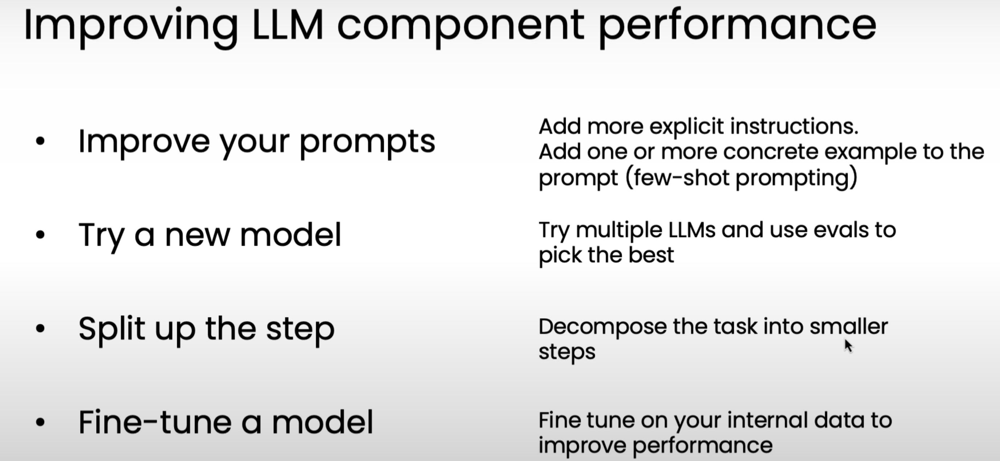

如何培养选择模型的直觉？

一个使用LLM遵循指令以移除或编辑个人身份信息（PII）或可识别信息的例子。任务是移除敏感信息，以方便信息传递给下游做数据分析。

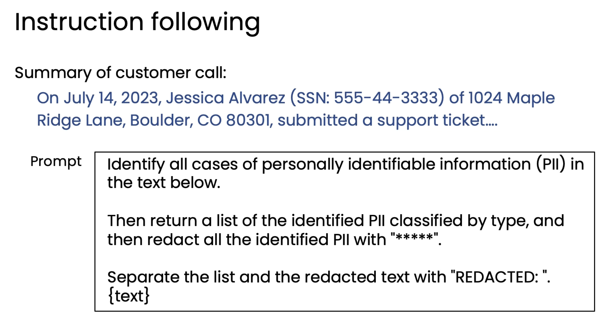

换一个更聪明的模型，效果会更好：

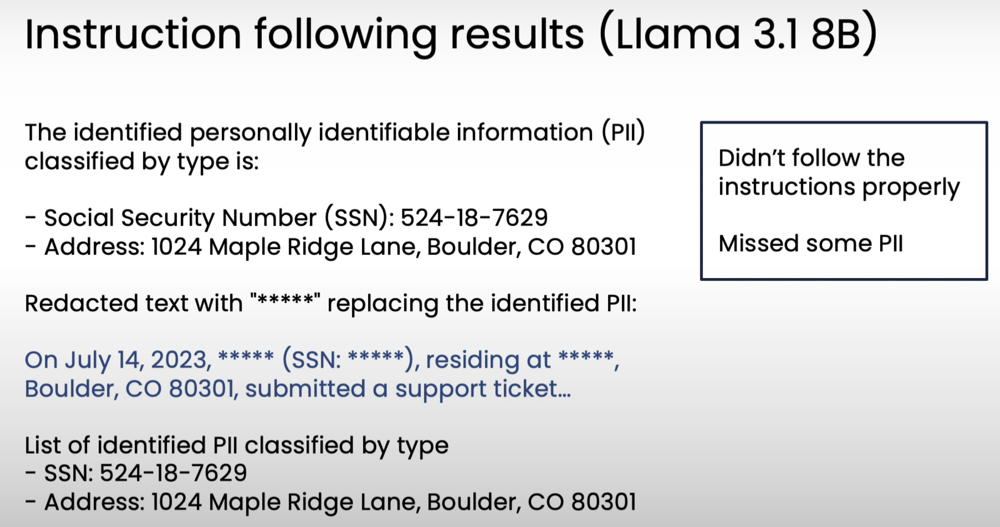

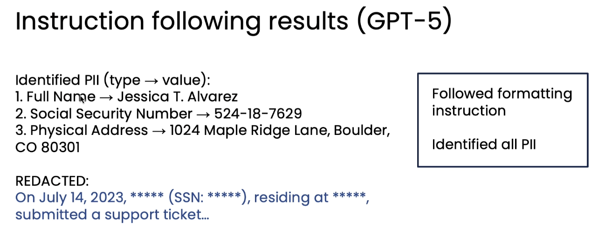

不同模型适合不同任务。有的适合coding，有的适合遵循指令。掌握这些直觉，将会让你事半功倍。

## Latency, cost optimization
实际生产中，除了Quality（准确率，回答质量）外，往往还关注Latency（速度）和Cost（资源、金钱消耗）

先优化Quality，再优化 Latency 和 Cost

如何优化Latency？

1. 首先，对工作流里的每一步进行基准测试或计时，定位到优化空间最大的组件
2. 然后，开始优化
    1. 尝试更小、更笨的模型。
    2. 换provider。不同 provider 可能采用不同的硬件加速方式

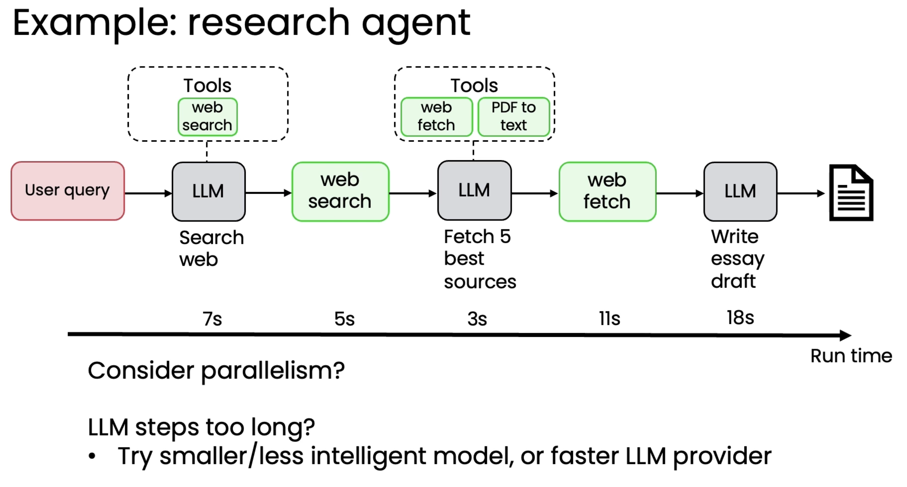

如何优化Cost？

1. 首先，统计工作流里的每一步的cost，定位到优化空间最大的组件
2. 然后，开始优化
    1. LLM steps (pay per token)
    2. Any API-calling tools (pay per API call)
    3. Compute steps (based on server capacity/cost)

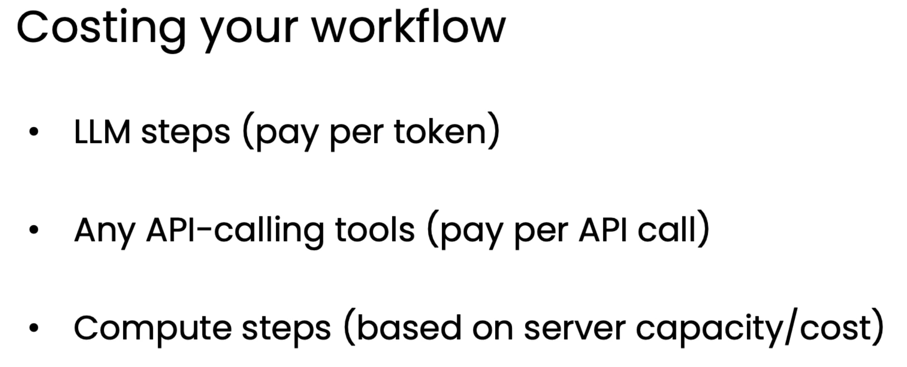

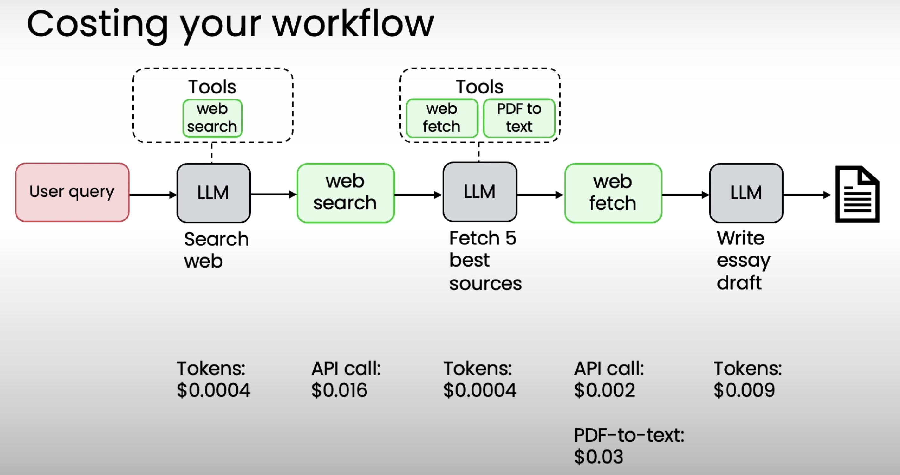

## Development process summary
evals 通常是定制化的，不同system需要不同的eval，很难直接用通用的评测方式。

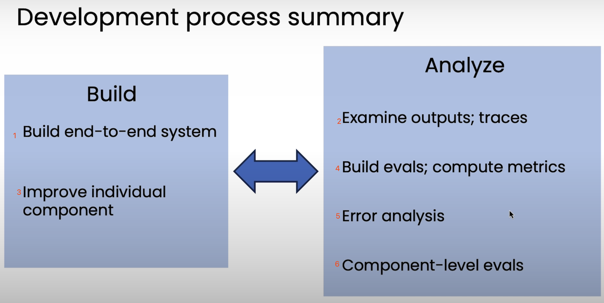

> 更新: 2025-11-11 07:07:24  
> 原文: <https://www.yuque.com/viruspc/el3mi0/gsv85ap5dbfgx364>