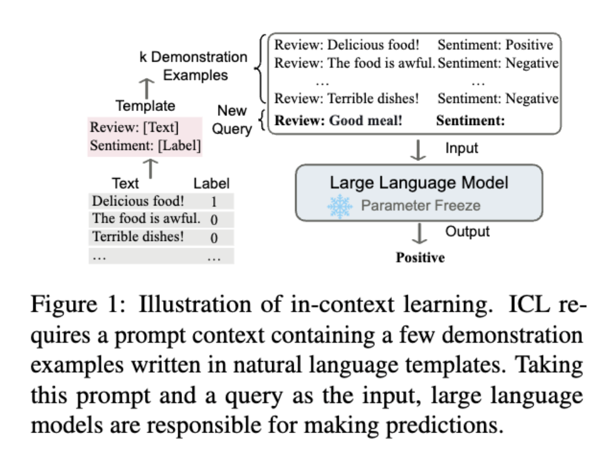
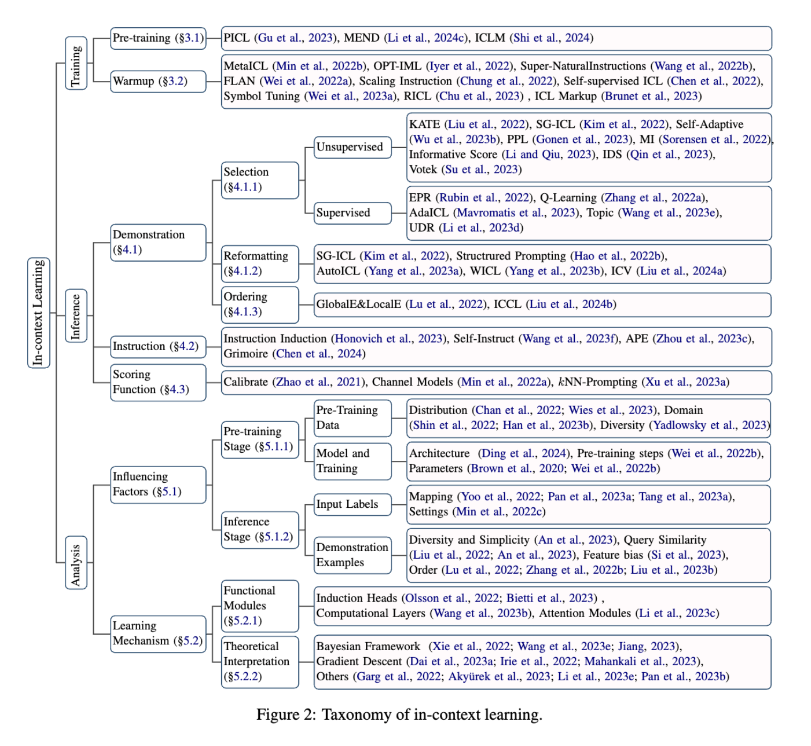

# 2022-A Survey on In-context Learning

- [**主题与核心思想**](#%E4%B8%BB%E9%A2%98%E4%B8%8E%E6%A0%B8%E5%BF%83%E6%80%9D%E6%83%B3)
- [**关键点与亮点**](#%E5%85%B3%E9%94%AE%E7%82%B9%E4%B8%8E%E4%BA%AE%E7%82%B9)
  * [**1. 上下文学习的定义与机制**](#1-%E4%B8%8A%E4%B8%8B%E6%96%87%E5%AD%A6%E4%B9%A0%E7%9A%84%E5%AE%9A%E4%B9%89%E4%B8%8E%E6%9C%BA%E5%88%B6)
  * [**2. 技术进展**](#2-%E6%8A%80%E6%9C%AF%E8%BF%9B%E5%B1%95)
  * [**3. 应用场景**](#3-%E5%BA%94%E7%94%A8%E5%9C%BA%E6%99%AF)
  * [**4. 挑战与未来方向**](#4-%E6%8C%91%E6%88%98%E4%B8%8E%E6%9C%AA%E6%9D%A5%E6%96%B9%E5%90%91)
- [**结构化总结**](#%E7%BB%93%E6%9E%84%E5%8C%96%E6%80%BB%E7%BB%93)
- [**结论**](#%E7%BB%93%E8%AE%BA)
- [In-Context Learning VS Prompt Learning VS Few-Shot Learning](#in-context-learning-vs-prompt-learning-vs-few-shot-learning)

---

#### **主题与核心思想**
该论文是一篇关于**上下文学习（In-Context Learning, ICL）**的综述，主要探讨了大语言模型（LLMs）在上下文学习中的能力、方法以及应用场景。其核心思想包括：

1. **定义与框架**：上下文学习是一种**无需模型参数更新**，仅通过**少量示例**在**上下文**中进行任务学习的范式。
2. **技术进展**：涵盖训练策略、提示设计和相关分析。
3. **应用场景**：从数据工程到知识更新，ICL在传统和新兴任务中均表现出潜力。
4. **挑战与未来方向**：包括效率、可扩展性、泛化能力以及长上下文处理能力。

---

#### **关键点与亮点**
##### **1. 上下文学习的定义与机制**
+ **定义**：上下文学习通过示例构建提示，并结合查询输入进行预测，无需模型参数更新。[4][5]
+ **工作机制**：通过概率评分函数选择最可能的答案，示例组织方式（如排序和选择）对性能有显著影响。[5][10]

##### **2. 技术进展**
+ **训练策略**：
    - **预训练**：通过重新组织语料或引入元蒸馏过程提升模型的上下文推理能力。[5][6]
    - **热身阶段**：在预训练和推断之间加入额外训练以适配ICL格式。[6]
+ **提示设计**：
    - 示例选择：基于最近邻、互信息或监督学习选择最优示例。[7][8]
    - 示例排序：使用熵或复杂度递增排序以优化性能。[10]
    - 示例重格式化：通过生成模型改进示例表征。[9][10]
+ **评分函数**：
    - 包括直接概率、困惑度（PPL）以及通道模型（Channel）。不同方法在效率、覆盖率和稳定性上有所差异。[11][42]

##### **3. 应用场景**
+ **传统任务**：ICL在SuperGLUE等传统基准任务上表现接近微调模型，但仍有改进空间。[41][42]
+ **新兴任务**：如BIG-Bench Hard评估复杂推理能力，MGSM测试多语言链式推理。[43]
+ **跨模态应用**：
    - **视觉任务**：如Painter和SegGPT模型扩展了图像分割和生成任务的ICL能力。[44][45]
    - **视觉-语言任务**：Flamingo等模型通过结合视觉编码器和语言模型实现跨模态推理。[45]
    - **语音任务**：VALLE-X扩展了ICL在多语言语音合成和翻译中的应用。[46]

##### **4. 挑战与未来方向**
+ **效率与可扩展性**：示例数量的增加导致计算成本上升，且长上下文处理能力不足。[16][17]
+ **泛化能力**：低资源语言和任务中的示例稀缺限制了ICL的泛化能力。[16]
+ **理论解释**：当前研究集中在梯度下降、贝叶斯推断等视角，但多局限于简单任务和小模型。[13][14][40]

---

#### **结构化总结**
1. **上下文学习的定义**：无需参数更新，通过示例和查询推断任务。
2. **技术进展**：
    - 训练阶段：预训练和热身提升模型的上下文推理能力。
    - 提示设计：示例选择、排序和重格式化优化性能。
    - 评分函数：直接概率、困惑度和通道模型各有优势。
3. **应用场景**：涵盖传统NLP任务、新兴复杂任务以及跨模态任务。
4. **挑战与未来方向**：效率、泛化能力和理论解释仍需进一步探索。

---

#### **结论**
该论文全面总结了上下文学习的最新进展及挑战，为研究者提供了清晰的研究路线图，并指出了未来可能的突破方向。[18][39][40][46]

#### In-Context Learning VS Prompt Learning VS Few-Shot Learning
 ICL differs from related concepts as follows: 

1. **Prompt Learning**: prompts can be discrete templates or soft parameters that encourage the model to predict the desired output. **ICL can be regarded as a subclass of prompt tuning where the demonstration examples are part of the prompt**. Liu et al. (2023c) made a thorough survey on prompt learning, but ICL was not included in their study. 
2. **Few-shot Learning**: few-shot learning is a general machine learning approach that involves adapting model parameters to perform a task with a limited number of supervised examples (Wang and Yao, 2019). In contrast, ICL does not require parameter updates and is directly performed on pretrained LLMs. 
    1. Few-shot learning可以通过多种方式实现，包括显式地微调模型参数（如基于梯度下降的训练）或者通过in-context learning直接从上下文中学习。
    2. **Few-shot learning 可以通过 In-context learning 实现**：在使用语言模型时，few-shot learning 通常通过 in-context learning 实现。也就是说，模型通过提供少量示例（few-shot）在输入上下文中学习任务规则
    3. **In-context learning 包括 few-shot learning，但不限于它**：In-context learning 可以是零样本学习（zero-shot learning），即模型在没有任何示例的情况下，仅通过任务描述完成任务。也可以是多样本学习（many-shot learning），即在上下文中提供大量示例来帮助模型学习任务规则。

[https://arxiv.org/abs/2301.00234](https://arxiv.org/abs/2301.00234)

> 更新: 2025-08-04 02:37:55  
> 原文: <https://www.yuque.com/viruspc/el3mi0/gcnideh8qk9g9t0g>