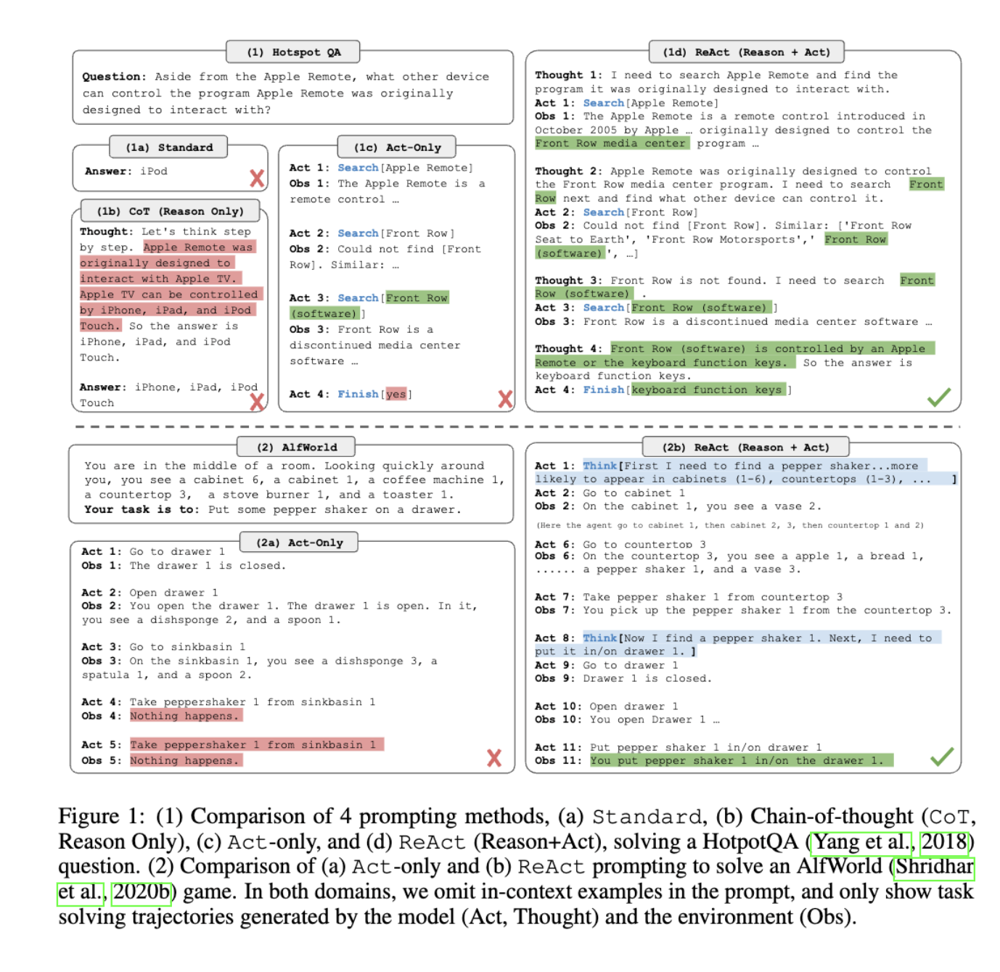

# 2023 - ICLR - REACT: SYNERGIZING REASONING AND ACTING IN
LANGUAGE MODELS

- [主题与核心思想](#%E4%B8%BB%E9%A2%98%E4%B8%8E%E6%A0%B8%E5%BF%83%E6%80%9D%E6%83%B3)
- [关键点与亮点](#%E5%85%B3%E9%94%AE%E7%82%B9%E4%B8%8E%E4%BA%AE%E7%82%B9)
- [逻辑与结构总结](#%E9%80%BB%E8%BE%91%E4%B8%8E%E7%BB%93%E6%9E%84%E6%80%BB%E7%BB%93)
- [总结](#%E6%80%BB%E7%BB%93)

---

实现ReAct智能体通常不需要重新训练模型，而是依赖**提示词工程（**[**Prompt Engineering**](https://zhida.zhihu.com/search?content_id=260377527\&content_type=Article\&match_order=1\&q=Prompt+Engineering\&zhida_source=entity)**）来引导现有的LLM按照ReAct格式工作。开发者需要精心设计提示，规定模型输出的格式包含“Think”、“Act”、“Observation”等部分。例如，可以在提示中说明:“请按照**<code>**思考:**</code>**、**<code>**行动:**</code>**、**<code>**观察:**</code>**的顺序交替推理和执行，直至完成任务".**

作者：嘛也不懂\
链接：https://zhuanlan.zhihu.com/p/1928501676257547283\
来源：知乎\
著作权归作者所有。商业转载请联系作者获得授权，非商业转载请注明出处。



#### 主题与核心思想

这篇论文介绍了一种名为“ReAct”的方法，用于在大型语言模型（LLMs）中结合推理（Reasoning）和行动（Acting）能力，以解决多样化的语言推理和决策任务。ReAct方法通过交替生成推理轨迹和任务相关的行动，使模型能够动态调整高层计划，同时与外部环境交互以获取额外信息。这种方法旨在提高模型的准确性、可解释性和可靠性，并在多个基准测试中表现出优越的性能。

***

#### 关键点与亮点

1. **ReAct方法的核心概念**
   * ReAct结合推理和行动，允许模型创建、维护和调整行动计划（推理支持行动），并通过与外部环境交互获取信息以改进推理（行动支持推理）。这种交替过程使模型能够在复杂任务中表现出更强的灵活性和适应性。\[1]\[4]\[6]
2. **实验与评估**
   * 在知识密集型任务（如HotpotQA和Fever）中，ReAct通过访问Wikipedia API实现了更准确的知识检索和推理，与仅依赖模型内部知识的基线方法相比表现更优。\[5]\[9]
   * 在交互式决策任务（如ALFWorld和WebShop）中，ReAct显著超越了模仿学习和强化学习方法，展示了推理在长期决策中的重要性。\[5]\[13]\[15]
3. **性能优势与人类对齐**
   * ReAct不仅提高了任务成功率，还增强了模型的可解释性和诊断性。通过推理轨迹，人类可以轻松检查模型决策的依据，并通过编辑推理轨迹实时纠正模型行为。\[7]\[28]
4. **与其他方法的比较**
   * 与Chain-of-Thought（CoT）相比，ReAct在处理知识密集型任务时更加事实驱动，减少了幻觉问题，但在推理灵活性上略有不足。\[11]\[16]
   * ReAct与CoT结合使用时表现最好，能够有效利用模型的内部知识和外部信息。\[11]\[12]
5. **局限性与未来方向**
   * ReAct在输入长度限制下难以处理复杂任务，需更多高质量人类注释数据进行微调。此外，结合多任务训练和强化学习可能进一步提升其潜力。\[19]

***

#### 逻辑与结构总结

* **引言**：讨论了人类智能中推理与行动的协同作用，并介绍了该方法的背景与目标。\[1]\[4]
* **方法**：详细阐述了ReAct的工作机制，包括推理与行动的交替过程及其在不同任务中的应用。\[6]\[7]
* **实验**：展示了ReAct在多种任务中的实验结果，并分析了其优势与局限性。\[9]\[11]\[15]
* **相关工作**：比较了ReAct与其他语言模型推理与决策方法的异同。\[17]\[18]
* **结论**：总结了ReAct的贡献，并提出了未来的研究方向。\[19]

***

#### 总结

ReAct通过结合推理与行动，显著提升了大型语言模型在知识密集型任务和交互式决策任务中的表现，同时增强了模型的可解释性和可靠性。该方法为解决复杂任务提供了新的思路，具有广泛的应用潜力。\[1]\[4]\[6]\[19]

```python
from langchain.agents import ReActAgent, Tool
from langchain.llms import OpenAI
def web_search(query: str) -> str:
# 调用搜索API
return f"Results about {query}"
tools = [
Tool(name="Search", func=web_search, description="Search the web")
]
agent = ReActAgent(llm=OpenAI(temperature=0), tools=tools)
task = "巴黎埃菲尔铁塔高度是多少米？"
for step in range(3): # 最大迭代步数
output = agent.generate_step(task)
if "Final Answer" in output:
print(output)
break
else:
# 执行Action并更新环境反馈
action_result = execute_action(output)
task = task + f"\nObservation: {action_result}"
```


> 更新: 2025-08-03 07:02:25  
> 原文: <https://www.yuque.com/viruspc/el3mi0/xdgyc2p51zfqtgoc>