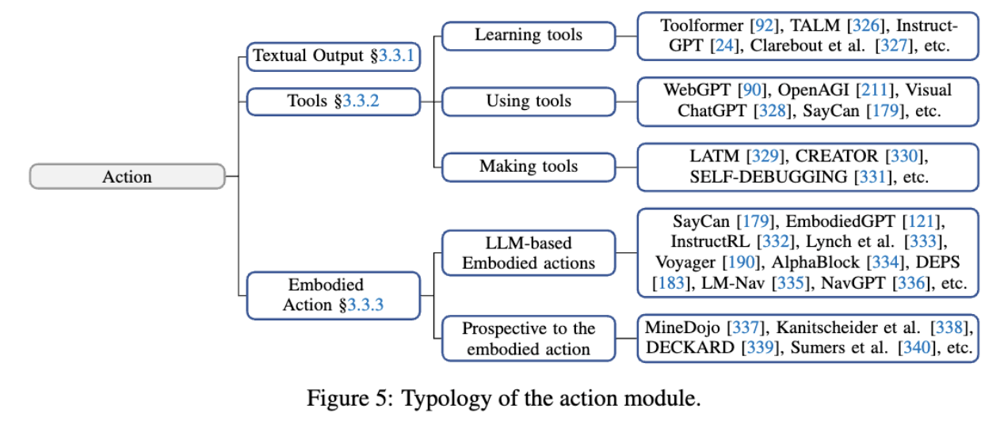

# Action

- [总结：3.3 行动（Action）](#%E6%80%BB%E7%BB%9333-%E8%A1%8C%E5%8A%A8action)
  * [内容框架](#%E5%86%85%E5%AE%B9%E6%A1%86%E6%9E%B6)
  * [存在问题](#%E5%AD%98%E5%9C%A8%E9%97%AE%E9%A2%98)
  * [解决方案](#%E8%A7%A3%E5%86%B3%E6%96%B9%E6%A1%88)
  * [总结](#%E6%80%BB%E7%BB%93)

---

### 总结：3.3 行动（Action）
#### 内容框架
行动模块是LLM智能体与外部环境交互的核心部分，负责接收“大脑”生成的行动序列并执行任务。行动能力主要包括以下三种类型：

1. **文本输出（Textual Output）**：
    - LLM智能体具备强大的语言生成能力，能够生成流畅、相关性强且可控的文本内容。
    - 文本输出是智能体的基础能力，广泛应用于任务指令执行、对话生成和信息传递。[132][213]
2. **工具使用（Tool Using）**：
    - **工具理解**：智能体通过零样本或少样本学习了解工具功能及调用方法。[92][326]
    - **工具使用**：智能体能够调用外部工具完成复杂任务，如搜索引擎、科学计算工具等。[94][90]
    - **工具创建**：智能体可生成适合自身需求的工具或整合现有工具以增强任务处理能力。[330][331]
    - 工具使用不仅提升智能体的任务解决能力，还能增强其鲁棒性和透明性。[94][354]
3. **具身行动（Embodied Action）**：
    - **导航**：智能体通过视觉、语言和环境反馈规划路径，在物理或虚拟环境中进行动态移动。[335][336]
    - **操控物体**：智能体能够完成复杂的物体操作任务，如抓取、移动或构造。[333][334]
    - **多模态结合**：将视觉、语言和行动整合，用于复杂环境中的任务执行。[120][328]
    - 具身行动结合环境反馈和规划能力，使智能体在动态环境中具备更强的适应性。[190][183]

---

#### 存在问题
1. **工具使用的局限性**：
    - 智能体对工具的理解可能不充分，尤其在面对复杂任务时，缺乏灵活性和泛化能力。[94][92]
    - 工具设计通常针对人类使用，智能体在调用工具时效率可能较低。[330]
2. **具身行动的挑战**：
    - 在物理环境中，智能体的行动需要高度精确，同时需适应环境的动态变化。
    - 数据不足和硬件支持有限，限制了具身行动的广泛应用。[190][358]
    - 高成本问题使得具身行动的开发和测试难以扩展到真实场景。[190]
3. **多模态行动整合的复杂性**：
    - 非文本输出的多模态行动（如图像生成、机器人操作）对智能体的整合能力提出更高要求。
    - 模态之间的协同和数据融合仍存在技术难点。[328][356]

---

#### 解决方案
1. **工具使用优化**：
    - **理解工具功能**：通过零样本或少样本学习工具使用方法，提升工具理解能力。[92][326]
    - **工具创建与整合**：智能体生成专门设计的工具以满足自身需求，并通过整合现有工具提升任务处理效率。[330][331]
    - **元学习**：通过学习工具使用的通用模式，实现工具使用的跨场景泛化。[94][327]
2. **具身行动增强**：
    - **数据扩展**：利用虚拟模拟环境（如Minecraft）生成具身行动所需的训练数据，降低开发成本。[190][337]
    - **反馈优化**：结合环境反馈动态调整行动计划，提高任务执行的精确性。[101][376]
    - **硬件支持**：设计适配智能体需求的硬件接口（如机器人手臂、传感器），提升物理环境中的行动能力。[120][258]
3. **多模态行动整合**：
    - **模型融合**：将视觉、语言和行动模型结合，支持复杂的多模态任务处理。[328][335]
    - **任务分解**：通过语言模型规划任务步骤，逐步执行多模态行动，确保任务完成的准确性。[258][183]

---

#### 总结
行动模块通过文本输出、工具使用和具身行动实现智能体与环境的交互。针对工具使用的局限性、具身行动的挑战以及多模态整合问题，优化工具学习与创建、扩展具身行动数据与硬件支持，以及融合多模态模型，是提升智能体行动能力的重要途径。这些技术的进步将进一步推动智能体在复杂任务中的应用和真实场景中的部署。

> 更新: 2025-08-03 02:23:54  
> 原文: <https://www.yuque.com/viruspc/el3mi0/ffcmhxcgfmv103ux>