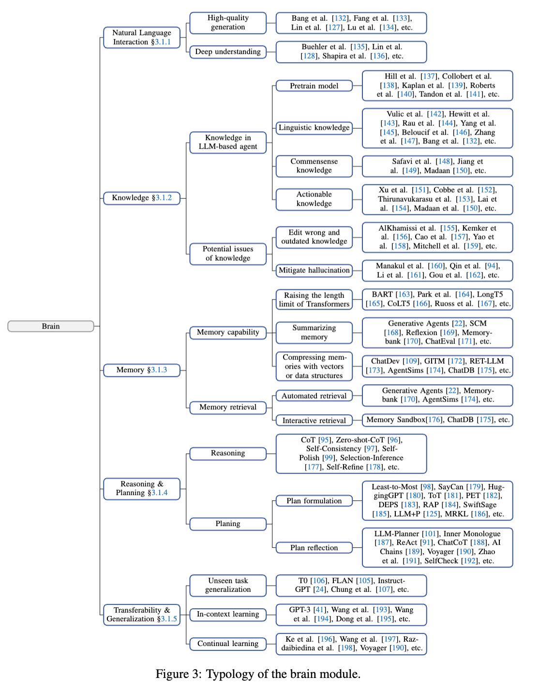

# Brain

- [Operating mechanism.](#operating-mechanism)
  * [构建智能体的难点与解决方案（Brain模块详细分析）](#%E6%9E%84%E5%BB%BA%E6%99%BA%E8%83%BD%E4%BD%93%E7%9A%84%E9%9A%BE%E7%82%B9%E4%B8%8E%E8%A7%A3%E5%86%B3%E6%96%B9%E6%A1%88brain%E6%A8%A1%E5%9D%97%E8%AF%A6%E7%BB%86%E5%88%86%E6%9E%90)
    + [1. **自然语言交互（Natural Language Interaction）**](#1-%E8%87%AA%E7%84%B6%E8%AF%AD%E8%A8%80%E4%BA%A4%E4%BA%92natural-language-interaction)
      - [难点：](#%E9%9A%BE%E7%82%B9)
      - [解决方案：](#%E8%A7%A3%E5%86%B3%E6%96%B9%E6%A1%88)
    + [2. **知识管理（Knowledge）**](#2-%E7%9F%A5%E8%AF%86%E7%AE%A1%E7%90%86knowledge)
      - [难点：](#%E9%9A%BE%E7%82%B9-1)
      - [解决方案：](#%E8%A7%A3%E5%86%B3%E6%96%B9%E6%A1%88-1)
    + [3. **记忆（Memory）**](#3-%E8%AE%B0%E5%BF%86memory)
      - [难点：](#%E9%9A%BE%E7%82%B9-2)
      - [解决方案：](#%E8%A7%A3%E5%86%B3%E6%96%B9%E6%A1%88-2)
    + [4. **推理与规划（Reasoning & Planning）**](#4-%E6%8E%A8%E7%90%86%E4%B8%8E%E8%A7%84%E5%88%92reasoning--planning)
      - [难点：](#%E9%9A%BE%E7%82%B9-3)
      - [解决方案：](#%E8%A7%A3%E5%86%B3%E6%96%B9%E6%A1%88-3)
    + [5. **任务泛化（Transferability & Generalization）**](#5-%E4%BB%BB%E5%8A%A1%E6%B3%9B%E5%8C%96transferability--generalization)
      - [难点：](#%E9%9A%BE%E7%82%B9-4)
      - [解决方案：](#%E8%A7%A3%E5%86%B3%E6%96%B9%E6%A1%88-4)
    + [总结](#%E6%80%BB%E7%BB%93)

---

## Operating mechanism. 

1. **natural language interaction**。To ensure effective communication, the ability to engage in natural language interaction (§3.1.1) is paramount. 
2. **knowledge & memory**。After receiving the information processed by the perception module, the brain module first turns to storage, retrieving in knowledge (§3.1.2) and recalling from memory (§3.1.3). 
3. **reasoning&planing**。These outcomes aid the agent in devising plans, reasoning, and making informed decisions (§3.1.4). 
4. **knowledge & memory2。**Additionally, the brain module may memorize the agent’s past observations, thoughts, and actions in the form of summaries, vectors, or other data structures. Meanwhile, it can also update the knowledge such as common sense and domain knowledge for future use. 
5. **Transferability & Generalization**。The LLM-based agent may also adapt to unfamiliar scenarios with its inherent generalization and transferability (§3.1.5). 

6. In the subsequent sections, we delve into a detailed exploration of these extraordinary facets of the brain module as depicted in Figure 3.

### 构建智能体的难点与解决方案（Brain模块详细分析）
Brain模块是智能体的核心部分，负责知识存储、记忆管理、推理规划以及任务泛化等关键功能。以下从 **自然语言交互**、**知识管理**、**记忆**、**推理与规划** 和 **任务泛化** 五个角度深入分析难点与解决方案。

---

#### 1. **自然语言交互（Natural Language Interaction）**
##### 难点：
+ **多轮对话的一致性**：
    - 智能体在长时间多轮对话中可能难以保持上下文一致性，容易出现语义混乱或内容重复。[147][132]
+ **隐含意义理解**：
    - 对用户模糊指令或隐含意图的理解能力不足，可能导致响应不准确或不符合用户需求。[128][135]
+ **语言生成质量**：
    - 尽管LLM具备强大的语言生成能力，但在复杂任务中仍可能出现内容不相关或不符合语境的情况。[133][214]

##### 解决方案：
+ **多轮对话优化**：
    - 通过记忆模块存储对话历史，结合上下文信息动态调整输出，提高对话连贯性。[170][176]
+ **隐含意义推断**：
    - 使用强化学习方法对用户反馈进行建模，通过奖励机制推断用户偏好和隐含意图。[128][218]
+ **语言生成控制**：
    - 设计可控提示（Controllable Prompts），实现语言风格、语气和内容的精确调整。[134][214]

---

#### 2. **知识管理（Knowledge）**
##### 难点：
+ **知识过时与错误**：
    - 模型中的知识可能随着时间推移变得过时或存在错误，重新训练成本高且可能引发灾难性遗忘。[155][156]
+ **幻觉问题**：
    - LLM可能生成与事实不符的内容（幻觉），特别是在需要高准确性的任务中影响可信度。[225]
+ **领域知识不足**：
    - 在专业领域（如医学、法律）中，智能体可能缺乏足够的知识深度，难以完成复杂任务。[153][354]

##### 解决方案：
+ **知识编辑技术**：
    - 通过定位和修改模型中的具体知识，避免重新训练的高成本，同时解决知识错误问题。[157][158]
+ **外部知识整合**：
    - 使用外部工具（如知识库、检索系统）补充和验证模型知识，减少幻觉问题。[161][162]
+ **领域知识微调**：
    - 结合领域数据进行任务微调，增强智能体在专业领域的知识深度。[354][153]

---

#### 3. **记忆（Memory）**
##### 难点：
+ **历史记录长度限制**：
    - Transformer架构对输入序列长度有限制，长时间交互可能导致历史记录被截断。[165][167]
+ **记忆提取效率低**：
    - 随着交互信息的积累，智能体难以快速提取相关记忆，导致上下文关联性下降。[170][174]
+ **冗余信息问题**：
    - 未经过优化的记忆可能包含大量冗余信息，影响存储效率和检索性能。[168][170]

##### 解决方案：
+ **扩展序列长度**：
    - 修改注意力机制以支持更长序列输入，或通过分段处理优化长序列的存储与处理。[165][167]
+ **记忆总结**：
    - 提取关键细节生成简洁的记忆摘要，减少冗余信息并提升检索效率。[168][170]
+ **记忆压缩与检索**：
    - 使用嵌入向量或结构化数据（如三元组）压缩记忆，并通过评分机制（如相关性、重要性）优先检索高价值记忆。[173][22]

---

#### 4. **推理与规划（Reasoning & Planning）**
##### 难点：
+ **推理能力不足**：
    - 智能体在复杂任务中的逻辑推理能力可能不足，尤其在多步骤任务中容易出错。[95][244]
+ **动态规划适应性差**：
    - 智能体在面对动态环境时，计划可能无法及时调整，导致任务失败或效率下降。[258][101]
+ **任务分解能力有限**：
    - 对复杂任务的分解方式可能不够灵活，难以适应多样化的任务需求。[98][257]

##### 解决方案：
+ **推理优化**：
    - 应用链式思维（CoT）和自一致性等方法，提升智能体的逻辑推理能力。[95][97]
+ **动态规划增强**：
    - 结合环境反馈动态调整计划，确保任务执行的灵活性和适应性。[101][376]
+ **分层规划**：
    - 通过层次化规划将复杂任务分解为子任务，逐步完成并优化任务执行效率。[182][258]

---

#### 5. **任务泛化（Transferability & Generalization）**
##### 难点：
+ **零样本任务适应性差**：
    - 智能体在未见任务中可能无法有效理解指令或完成任务，限制了其泛化能力。[24][106]
+ **灾难性遗忘**：
    - 在持续学习过程中，智能体可能遗忘之前学习的知识，影响任务执行的稳定性。[273]
+ **跨领域适应能力不足**：
    - 智能体在跨领域任务中可能无法有效迁移已有知识和技能，表现出适应性差。[190][264]

##### 解决方案：
+ **指令微调**：
    - 通过指令微调（如FLAN、T0），增强智能体对零样本任务的适应能力。[105][106]
+ **持续学习机制**：
    - 使用任务自适应参数架构和记忆稳定技术解决灾难性遗忘问题。[274][278]
+ **跨领域泛化优化**：
    - 通过多模态学习和自动课程设计（如Voyager）提升智能体在开放环境中的学习与适应能力。[190][264]

---

#### 总结
Brain模块的核心难点集中在自然语言交互、知识管理、记忆优化、推理与规划以及任务泛化五个方面。通过技术优化（如知识编辑、链式思维、持续学习）、模块整合（如记忆压缩与反馈机制）以及多领域适应性增强，智能体能够更好地处理复杂任务，提高任务执行效率和环境适应能力。

> 更新: 2025-08-03 02:44:11  
> 原文: <https://www.yuque.com/viruspc/el3mi0/bkybkq2hygbw85eq>