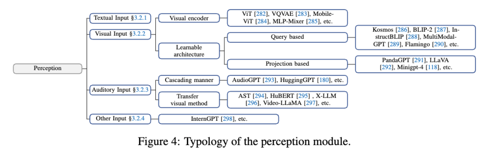

# Perception

- [总结：3.2 感知（Perception）](#%E6%80%BB%E7%BB%9332-%E6%84%9F%E7%9F%A5perception)
  * [定义与作用](#%E5%AE%9A%E4%B9%89%E4%B8%8E%E4%BD%9C%E7%94%A8)
  * [感知类型](#%E6%84%9F%E7%9F%A5%E7%B1%BB%E5%9E%8B)
  * [问题](#%E9%97%AE%E9%A2%98)
  * [解决方案](#%E8%A7%A3%E5%86%B3%E6%96%B9%E6%A1%88)
  * [总结](#%E6%80%BB%E7%BB%93)

---

### 总结：3.2 感知（Perception）
#### 定义与作用
感知模块是LLM智能体的“感官系统”，负责从外部环境接收信息并传递给“大脑”进行处理。通过扩展感知范围，智能体能够更全面地理解环境，从而在更广泛的任务中表现优异。

#### 感知类型
1. **文本输入（Textual Input）**：
    - 文本是智能体最基础的输入形式，包含数据、信息和知识。
    - 智能体可通过指令微调实现零样本任务理解，同时利用强化学习感知隐含意义。[128][105]
2. **视觉输入（Visual Input）**：
    - 视觉信息包含对象属性、空间关系和场景布局。
    - 方法包括图像描述生成（image captioning）、视觉编码器（如ViT）与LLM结合，以及视觉-语言对齐技术。[282][287]
    - 视频输入扩展了时间维度，需关注帧间关系。[290][297]
3. **听觉输入（Auditory Input）**：
    - 听觉信息增强了智能体对环境的感知能力。
    - 方法包括使用音频频谱图结合视觉方法进行编码，以及调用现有音频工具进行级联处理。[294][293]
4. **其他输入（Other Input）**：
    - 包括触觉、气味、光线、3D地图等复杂模态。
    - 通过集成硬件设备（如激光雷达、GPS）和特殊交互技术（如手势、脑机接口），扩展智能体的感知能力。[324][298]

#### 问题
1. **单一模态限制**：
    - 传统LLM的感知仅限于文本输入，难以处理多模态信息（如视觉、听觉等），导致对复杂环境理解不足。[29][33]
2. **视觉-语言对齐问题**：
    - 视觉编码器与LLM结合时，图像信息需转化为语言模型可理解的嵌入表示，可能出现信息丢失或对齐困难。[287][118]
3. **听觉信息整合挑战**：
    - 听觉信息编码复杂，需要与其他模态（如视觉）进行有效结合，避免数据冲突或信息丢失。[294][296]
4. **其他模态感知不足**：
    - 触觉、气味、光线等模态的感知能力较弱，智能体难以全面感知真实环境的细节。[324][298]

#### 解决方案
1. **扩展多模态感知**：
    - 引入视觉、听觉等模态，通过视觉编码器（如ViT）和音频频谱图等技术增强感知能力。[282][294]
    - 使用级联方法调用现有工具处理复杂模态信息。[293]
2. **视觉-语言对齐优化**：
    - 添加中间层（如Q-Former）提取语言相关的视觉信息，减少对齐问题。[287][118]
    - 使用简单投影层实现视觉嵌入与语言模型的维度适配。[118][296]
3. **多模态整合技术**：
    - 采用统一框架（如Video-LLaMA）处理视觉与听觉信息，确保多模态数据的有效结合。[297][314]
4. **硬件支持与环境感知**：
    - 集成激光雷达、GPS等硬件设备，捕捉环境的多样化信息。
    - 探索交互技术（如脑机接口）以扩展智能体的感知范围。[324][298]

#### 总结
通过文本、视觉、听觉及其他输入的多模态感知，LLM智能体能够更全面地获取环境信息，为复杂任务提供支持。这种感知扩展使智能体在动态环境中具备更强的适应性和任务执行能力。

通过扩展多模态感知、优化模态对齐技术以及集成硬件设备，LLM智能体能够有效解决感知局限，提升对复杂环境的理解和适应能力。

> 更新: 2025-08-03 02:19:09  
> 原文: <https://www.yuque.com/viruspc/el3mi0/pk7dybnyph00t96s>