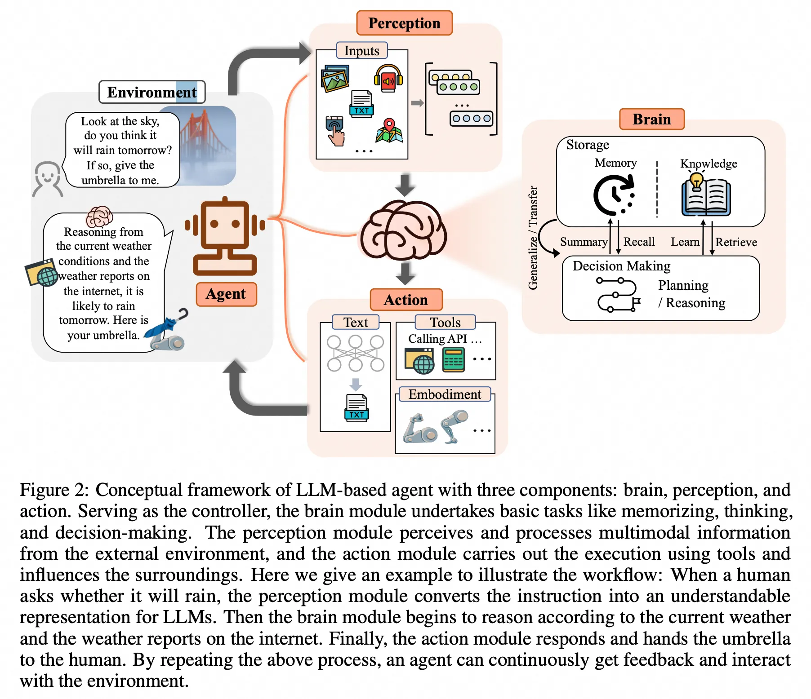

# Agent

- [构建智能体的难点与解决方案](#%E6%9E%84%E5%BB%BA%E6%99%BA%E8%83%BD%E4%BD%93%E7%9A%84%E9%9A%BE%E7%82%B9%E4%B8%8E%E8%A7%A3%E5%86%B3%E6%96%B9%E6%A1%88)
  * [难点分析](#%E9%9A%BE%E7%82%B9%E5%88%86%E6%9E%90)
    + [1. **大脑模块（Brain）**](#1-%E5%A4%A7%E8%84%91%E6%A8%A1%E5%9D%97brain)
    + [2. **感知模块（Perception）**](#2-%E6%84%9F%E7%9F%A5%E6%A8%A1%E5%9D%97perception)
    + [3. **行动模块（Action）**](#3-%E8%A1%8C%E5%8A%A8%E6%A8%A1%E5%9D%97action)
    + [4. **社会协作的复杂性**](#4-%E7%A4%BE%E4%BC%9A%E5%8D%8F%E4%BD%9C%E7%9A%84%E5%A4%8D%E6%9D%82%E6%80%A7)
    + [5. **伦理与安全问题**](#5-%E4%BC%A6%E7%90%86%E4%B8%8E%E5%AE%89%E5%85%A8%E9%97%AE%E9%A2%98)
  * [解决方案](#%E8%A7%A3%E5%86%B3%E6%96%B9%E6%A1%88)
    + [1. **优化大脑模块**](#1-%E4%BC%98%E5%8C%96%E5%A4%A7%E8%84%91%E6%A8%A1%E5%9D%97)
    + [2. **优化感知模块**](#2-%E4%BC%98%E5%8C%96%E6%84%9F%E7%9F%A5%E6%A8%A1%E5%9D%97)
    + [3. **提升行动模块**](#3-%E6%8F%90%E5%8D%87%E8%A1%8C%E5%8A%A8%E6%A8%A1%E5%9D%97)
    + [4. **优化社会协作**](#4-%E4%BC%98%E5%8C%96%E7%A4%BE%E4%BC%9A%E5%8D%8F%E4%BD%9C)
    + [5. **强化伦理与安全**](#5-%E5%BC%BA%E5%8C%96%E4%BC%A6%E7%90%86%E4%B8%8E%E5%AE%89%E5%85%A8)
  * [总结](#%E6%80%BB%E7%BB%93)

---

1. 大脑：负责知识存储、记忆、推理和规划。
2. 感知：扩展文本输入至多模态感知（视觉、听觉等）。
3. 行动：支持文本输出、工具使用和具身行动。

### 构建智能体的难点与解决方案
---

#### 难点分析
##### 1. **大脑模块（Brain）**
+ **知识管理的挑战**：
    - **知识过时与错误**：模型中的知识可能随着时间推移变得过时或存在错误，重新训练成本高且可能引发灾难性遗忘。[155][156]
    - **幻觉问题**：智能体可能生成与事实不符的内容，影响任务的可信度和可靠性。[225]
+ **推理与规划能力不足**：
    - **推理能力局限**：在复杂任务中，智能体的推理能力可能不足，尤其在动态环境中表现较弱。[95][244]
    - **规划适应性差**：智能体在任务规划中可能缺乏灵活性，尤其面对需要领域知识或动态调整的任务。[130][258]

##### 2. **感知模块（Perception）**
+ **单一模态限制**：
    - 传统LLM主要依赖文本输入，无法有效处理视觉、听觉等多模态信息，导致环境理解不足。[29][33]
+ **模态对齐问题**：
    - 视觉编码器与语言模型的结合可能导致信息丢失或对齐困难。[287][118]
+ **复杂模态处理不足**：
    - 触觉、气味、3D地图等模态的感知能力较弱，难以全面理解真实环境。[324][298]

##### 3. **行动模块（Action）**
+ **工具使用效率低**：
    - 智能体对工具的理解和使用能力有限，特别是在复杂任务中缺乏灵活性和泛化能力。[94][92]
+ **具身行动局限**：
    - 在物理环境中，智能体的行动需要高度精确，同时需适应环境的动态变化；数据和硬件支持不足增加了开发成本。[190][358]
+ **多模态行动整合困难**：
    - 非文本输出的多模态行动（如图像生成、机器人操作）对智能体的整合能力提出更高要求。[328][356]

##### 4. **社会协作的复杂性**
+ **协作效率低下**：
    - 多智能体系统中，智能体之间的通信与协作可能效率低，尤其在任务复杂或规模扩大的情况下。[405][109]
+ **角色分工与信息传播问题**：
    - 智能体在协作中可能出现角色混乱或信息失真，影响整体任务效果。[22][108]

##### 5. **伦理与安全问题**
+ **偏见与歧视**：
    - 智能体可能因训练数据中的偏见而生成不符合社会价值观的内容。[562][564]
+ **隐私泄露与恶意利用**：
    - 智能体在交互中可能导致用户隐私泄露或被恶意利用。[573][576]

---

#### 解决方案
##### 1. **优化大脑模块**
+ **知识管理**：
    - **知识编辑**：通过定位和修改模型中的具体知识，避免重新训练的高成本。[157][158]
    - **外部工具集成**：整合外部知识库和工具，减少幻觉问题，提高任务完成的可信度。[161][162]
+ **推理与规划优化**：
    - **推理技术**：采用链式思维（CoT）、自一致性等技术，提升智能体的推理能力。[95][97][178]
    - **动态规划**：结合层次化规划和环境反馈，支持动态任务调整。[182][258]
    - **领域集成**：通过集成领域规划器弥补专业知识不足，提高任务规划的适应性。[130][186]

##### 2. **优化感知模块**
+ **扩展多模态感知**：
    - 引入视觉、听觉等多模态感知技术（如视觉编码器、音频频谱图），优化模态对齐和数据融合。[282][294][287]
+ **硬件支持**：
    - 集成激光雷达、GPS等硬件设备，增强智能体对真实环境的感知能力。[324][298]
+ **复杂模态处理**：
    - 探索脑机接口、手势识别等技术，提升智能体对复杂模态的理解。[298]

##### 3. **提升行动模块**
+ **工具使用优化**：
    - **学习工具功能**：通过零样本或少样本学习工具使用方法，提升工具理解能力。[92][326]
    - **工具创建与整合**：智能体生成专用工具或整合现有工具以增强任务处理能力。[330][331]
+ **具身行动增强**：
    - 数据扩展：利用虚拟环境（如Minecraft）生成具身行动数据，降低开发成本。[190][337]
    - 硬件支持：设计适配智能体需求的硬件接口，提升物理环境中的行动能力。[120][258]
+ **多模态行动整合**：
    - 将视觉、语言和行动模型结合，支持复杂任务的执行。[328][335]

##### 4. **优化社会协作**
+ **标准化通信流程**：
    - 通过文档化输入输出（如MetaGPT），提升智能体之间的协作效率。[405][410]
+ **角色分工与交叉验证**：
    - 明确智能体角色，减少协作中的冲突，并通过交叉验证机制提升任务质量。[108][109]

##### 5. **强化伦理与安全**
+ **偏见检测与修正**：
    - 通过偏见检测和去偏技术，降低智能体输出中的偏见风险。[562][572]
+ **隐私保护机制**：
    - 采用差分隐私和数据加密技术，确保用户信息安全。[573][576]
+ **行为约束**：
    - 设计智能体的行为约束系统，确保其符合社会伦理和安全标准。[580][581]

---

#### 总结
构建智能体面临多模态感知、知识管理、推理规划、行动能力、社会协作以及伦理安全等多方面的挑战。通过优化大脑、感知和行动模块，结合标准化协作流程与伦理设计，智能体能够更好地适应复杂任务和动态环境，提升任务完成效率和社会接受度。

> 更新: 2025-08-03 02:40:50  
> 原文: <https://www.yuque.com/viruspc/el3mi0/upz2s4reeh6h9k99>