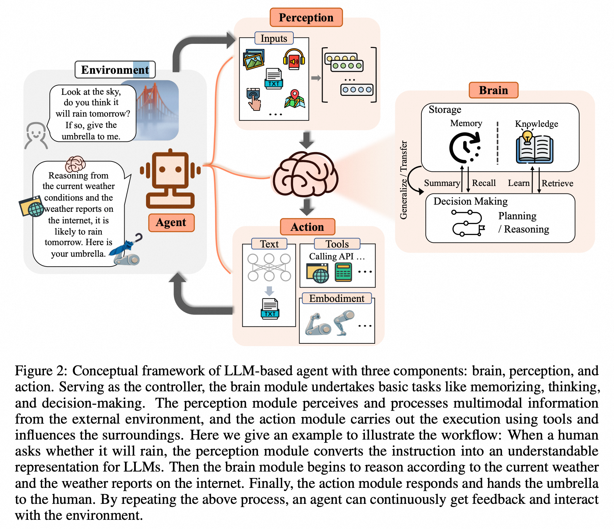
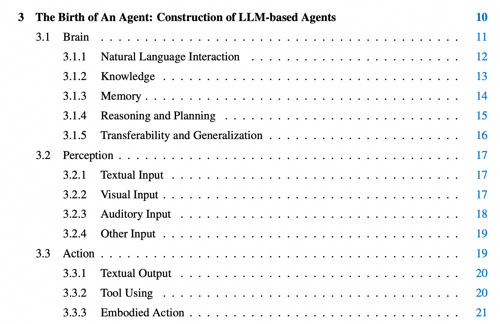
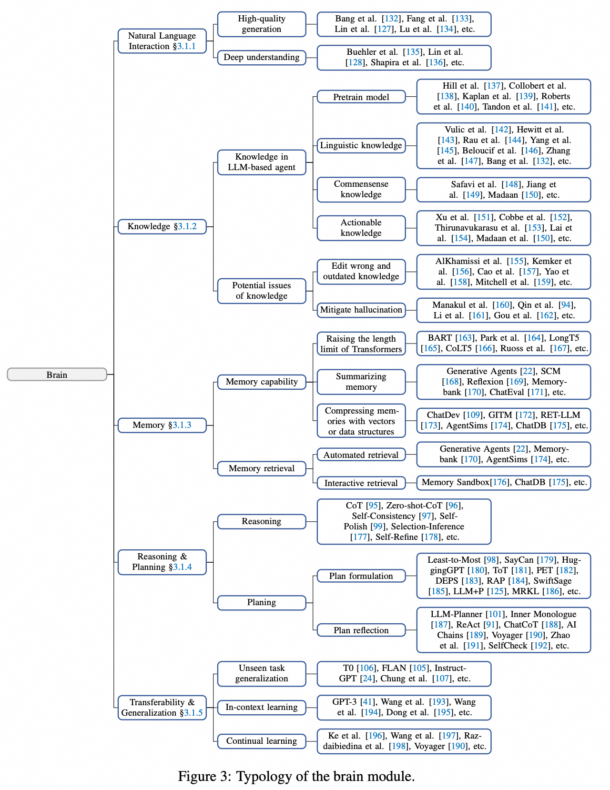
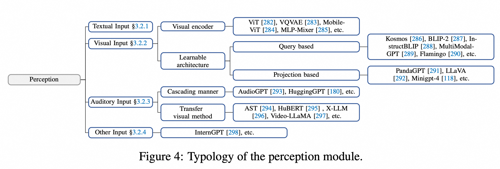
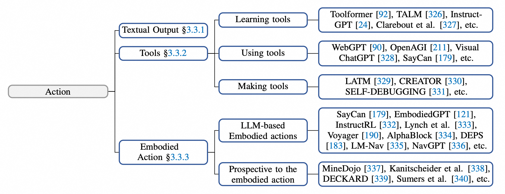

# 2024 - ICML - The Rise and Potential of Large Language Model Based Agents: A Survey

- [总结：基于大型语言模型（LLM）的智能体发展与潜力](#%E6%80%BB%E7%BB%93%E5%9F%BA%E4%BA%8E%E5%A4%A7%E5%9E%8B%E8%AF%AD%E8%A8%80%E6%A8%A1%E5%9E%8Bllm%E7%9A%84%E6%99%BA%E8%83%BD%E4%BD%93%E5%8F%91%E5%B1%95%E4%B8%8E%E6%BD%9C%E5%8A%9B)
  * [主要主题与核心思想](#%E4%B8%BB%E8%A6%81%E4%B8%BB%E9%A2%98%E4%B8%8E%E6%A0%B8%E5%BF%83%E6%80%9D%E6%83%B3)
  * [关键点与亮点](#%E5%85%B3%E9%94%AE%E7%82%B9%E4%B8%8E%E4%BA%AE%E7%82%B9)
  * [结构化总结](#%E7%BB%93%E6%9E%84%E5%8C%96%E6%80%BB%E7%BB%93)

---

### 总结：基于大型语言模型（LLM）的智能体发展与潜力
#### 主要主题与核心思想
1. **背景与起源**：
    - 智能体的概念起源于哲学，后发展到人工智能领域，成为具备感知、决策和行动能力的计算实体。[5][10]
    - 大型语言模型（LLM）因其强大的语言理解、推理和规划能力，被认为是构建通用人工智能（AGI）的潜在基础。[1][24][31]
2. **LLM智能体框架**：
    - 提出了一种通用框架，包括三个核心组件：
        * **大脑**：负责知识存储、记忆、推理和规划。[3][16]
        * **感知**：扩展文本输入至多模态感知（视觉、听觉等）。[29][33]
        * **行动**：支持文本输出、工具使用和具身行动。[34][38]
3. **应用场景**：
    - **单智能体**：任务导向部署（如网页导航、家庭任务）、创新导向（科学研究）和生命周期导向（长期生存能力）。[45][49]
    - **多智能体协作**：通过合作或对抗互动提高任务效率和响应质量。[50][52]
    - **人机互动**：分为指导-执行模式（人类提供指令，智能体执行）和平等合作模式（智能体与人类共同完成任务）。[54][57]
4. **智能体社会**：
    - 智能体在模拟社会中展现个体行为（如规划、推理）和群体行为（如合作、冲突）。[59][61]
    - 模拟社会提供了研究社会传播、伦理决策、政策制定等的机会，同时揭示潜在风险，如偏见和隐私问题。[68][70]

#### 关键点与亮点
1. **技术优势**：
    - LLM具备强大的语言理解、推理和规划能力，可支持复杂任务的分解和执行。[95][125]
    - 多模态感知和工具使用扩展了智能体的适用范围。[93][120]
2. **社会影响**：
    - 智能体社会可模拟真实社会现象，为社会科学研究提供新视角。[518][520]
    - 多智能体协作展现了集体智慧的潜力，有助于复杂任务的高效完成。[405][447]
3. **风险与挑战**：
    - **伦理与安全**：需要防范偏见、隐私泄露和恶意使用。[562][573]
    - **规模扩展**：增加智能体数量可能导致通信复杂性和协调困难。[82][109]
4. **开放问题**：
    - LLM智能体是否是实现AGI的路径仍存在争议。[84][660]
    - 从虚拟环境到物理环境的迁移面临技术和安全挑战。[85][666]
    - 集体智能和智能体服务化（AaaS）是未来研究的重要方向。[86][668]

#### 结构化总结
基于LLM的智能体在理论框架、应用场景和社会模拟方面展现了巨大的潜力，同时也面临伦理、安全和技术挑战。未来研究需关注智能体的规模扩展、跨环境适应能力，以及与人类社会的深度融合。[87]

[https://arxiv.org/pdf/2309.07864](https://arxiv.org/pdf/2309.07864)

[https://zhuanlan.zhihu.com/p/677788679?utm_psn=1889293795612414912](https://zhuanlan.zhihu.com/p/677788679?utm_psn=1889293795612414912)

> 更新: 2025-08-01 02:57:15  
> 原文: <https://www.yuque.com/viruspc/el3mi0/kx5qu6w62hg8p3q1>