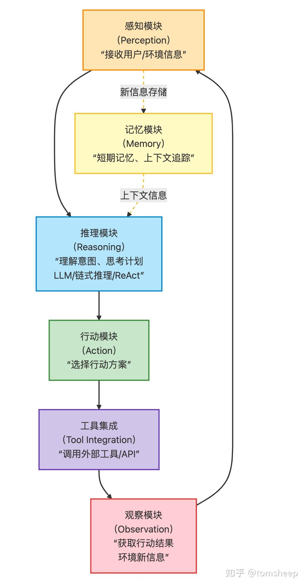
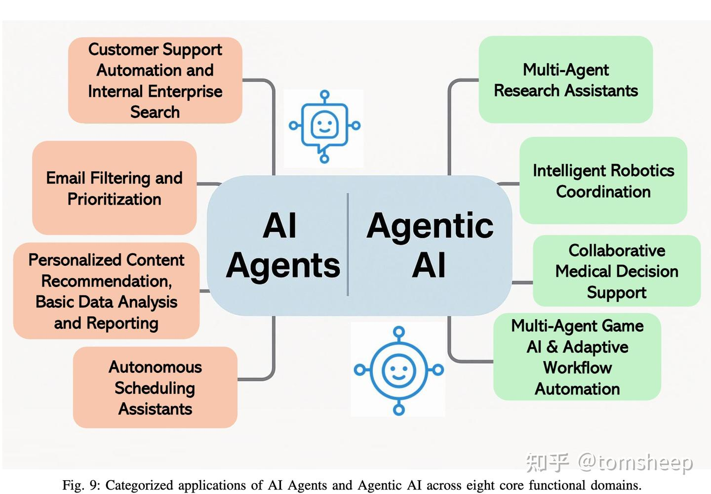
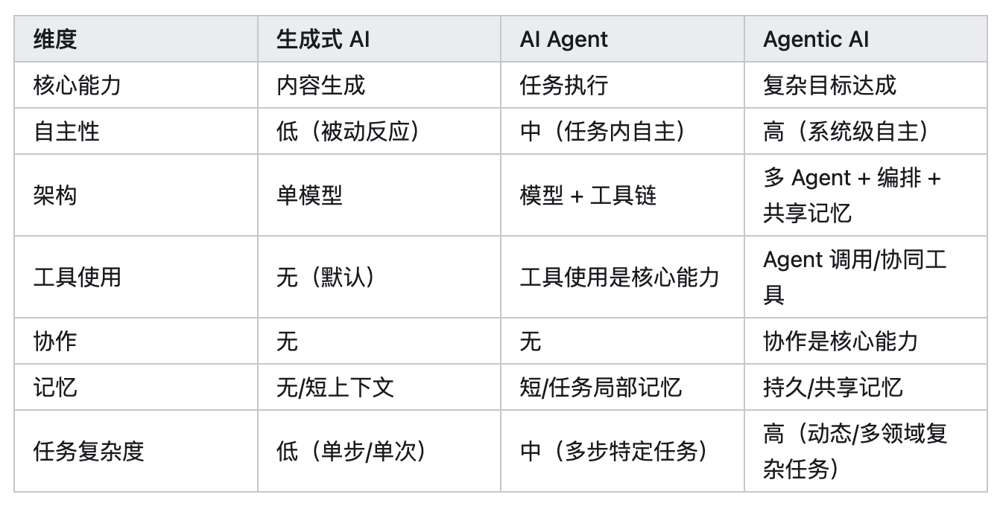

# 2025.5 - AI Agents vs. Agentic AI: A Conceptual Taxonomy, Applications and Challenges

+ [https://arxiv.org/abs/2505.10468](https://arxiv.org/abs/2505.10468)
+ 综述：AI Agent 与 Agentic AI 有什么区别？ - tomsheep的文章 - 知乎[https://zhuanlan.zhihu.com/p/1908131472205930839](https://zhuanlan.zhihu.com/p/1908131472205930839)

**核心：多Agent**

Agentic AI 代表了一种范式转变，它涉及多个 AI Agent 之间的协作、动态任务分解、拥有[持久记忆](https://zhida.zhihu.com/search?content_id=257959818&content_type=Article&match_order=1&q=%E6%8C%81%E4%B9%85%E8%AE%B0%E5%BF%86&zhida_source=entity)以及更高级的自主性。

Agent: 在今天的大多数语境下，你可以把 AI Agent「狭义地」理解为一个由强大的生成模型驱动，并配备了各种外部工具的单体智能体。它的出现，让 AI 从一个「内容生成器」变成了一个「任务执行者」。

Agentic AI: 这篇论文把 Agentic AI 理解为协同作战的智能体「团队」，更接近 Multi-Agent 的概念。代表了一种范式转变，指的是由多个 AI Agent 组成的，能够相互协作、动态协调、共同追求一个高层级复杂目标的系统。

核心特征：

+ **多 Agent 协同（Multi-Agent Collaboration）：** 系统由多个具备不同能力或角色的 Agent 组成。例如，在一个软件开发 Agentic AI 系统中，可能有一个 Agent 负责需求分析（Product Manager Agent），一个负责架构设计（Architect Agent），一个负责编写代码（Coder Agent），一个负责测试（Tester Agent），甚至还有一个负责协调整个流程（CEO Agent）。
+ **任务动态分解与分配（Dynamic Task Decomposition and Assignment）：** 当接收到一个复杂的高层目标时，Agentic AI 系统能够将其自动分解为多个更小的、可由不同 Agent 处理的子任务，并动态地分配给合适的 Agent。
+ **Agent 间通信与协调（Inter-Agent Communication and Coordination）：** Agent 团队成员之间需要能够有效地沟通、共享信息、同步状态、协商决策。这通常通过标准化的通信协议、消息队列或共享内存来实现。
+ [**编排层**](https://zhida.zhihu.com/search?content_id=257959818&content_type=Article&match_order=1&q=%E7%BC%96%E6%8E%92%E5%B1%82&zhida_source=entity)**/元 Agent（Orchestration Layer / Meta-Agent）：** 这是 Agentic AI 系统的「大脑」或「指挥中心」。它负责管理整个 Agent 团队，监控任务进度，解决 Agent 之间的冲突，确保所有 Agent 的努力都朝着最终的高层目标前进。它可以是一个独立的 Agent，也可以是系统的一个核心组件。
+ **持久记忆（Persistent Memory）：** Agentic AI 系统通常拥有比单 Agent 更强大的记忆能力，而且这种记忆是**共享的**。团队成员可以访问共同的知识库（语义记忆）、任务历史（情景记忆）或向量数据库（向量记忆），确保信息一致性和上下文连续性，支持长期、多阶段的任务。

> 更新: 2025-08-10 14:13:38  
> 原文: <https://www.yuque.com/viruspc/el3mi0/uelda5y5h1km78uu>