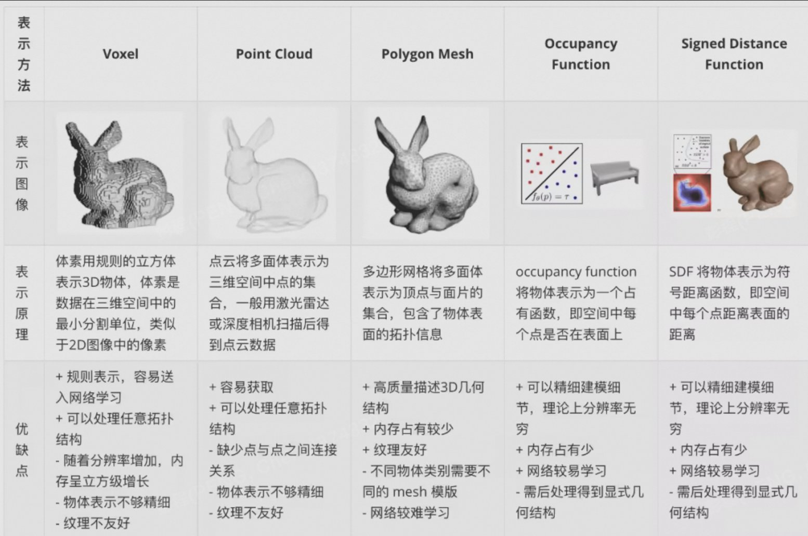
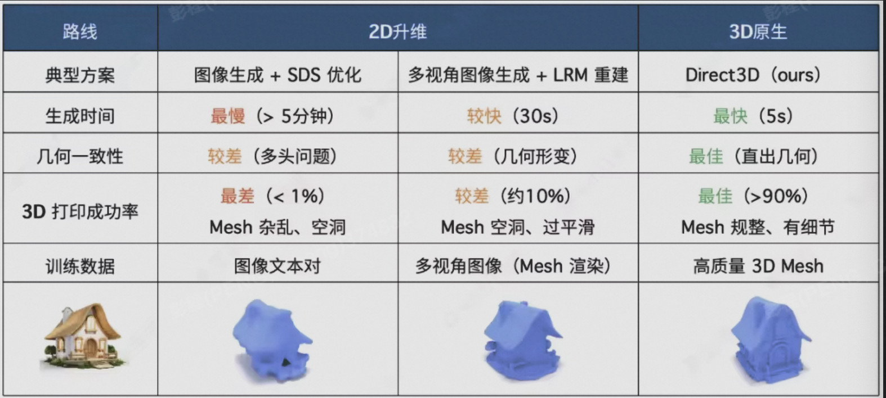
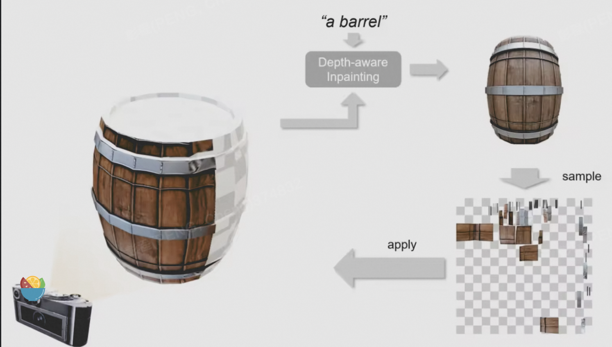
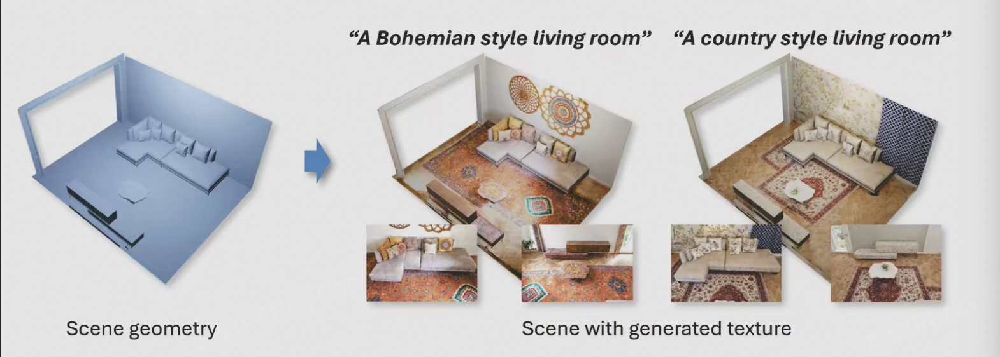
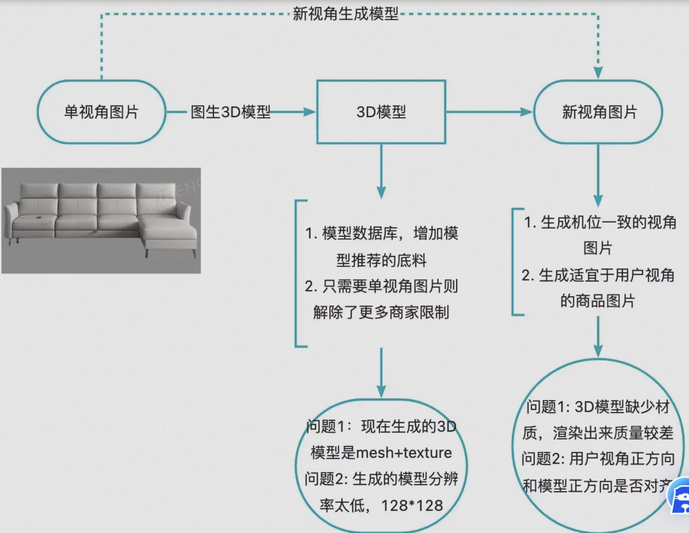

# AIGC 3D 综述

- [AIGC✖️3D生成前沿进展追踪](#aigc%E2%9C%96%EF%B8%8F3d%E7%94%9F%E6%88%90%E5%89%8D%E6%B2%BF%E8%BF%9B%E5%B1%95%E8%BF%BD%E8%B8%AA)
  * [三维模型表示](#%E4%B8%89%E7%BB%B4%E6%A8%A1%E5%9E%8B%E8%A1%A8%E7%A4%BA)
    + [显示表达](#%E6%98%BE%E7%A4%BA%E8%A1%A8%E8%BE%BE)
    + [隐式表达（Implicit representation）](#%E9%9A%90%E5%BC%8F%E8%A1%A8%E8%BE%BEimplicit-representation)
    + [神经辐射场](#%E7%A5%9E%E7%BB%8F%E8%BE%90%E5%B0%84%E5%9C%BA)
    + [高斯喷溅](#%E9%AB%98%E6%96%AF%E5%96%B7%E6%BA%85)
  * [3D 模型生成](#3d-%E6%A8%A1%E5%9E%8B%E7%94%9F%E6%88%90)
  * [3D AIGC](#3d-aigc)
    + [3D 模型生成](#3d-%E6%A8%A1%E5%9E%8B%E7%94%9F%E6%88%90-1)
    + [Mesh和纹理生成](#mesh%E5%92%8C%E7%BA%B9%E7%90%86%E7%94%9F%E6%88%90)
      - [单模型的纹理生成](#%E5%8D%95%E6%A8%A1%E5%9E%8B%E7%9A%84%E7%BA%B9%E7%90%86%E7%94%9F%E6%88%90)
      - [场景级的纹理生成](#%E5%9C%BA%E6%99%AF%E7%BA%A7%E7%9A%84%E7%BA%B9%E7%90%86%E7%94%9F%E6%88%90)
    + [文生3D](#%E6%96%87%E7%94%9F3d)
    + [图生3D](#%E5%9B%BE%E7%94%9F3d)
    + [视角图像生成](#%E8%A7%86%E8%A7%92%E5%9B%BE%E5%83%8F%E7%94%9F%E6%88%90)

---

# AIGC✖️3D生成前沿进展追踪
本文主要记录了一些3D生成相关的近期资讯，包括3D单模生成、3D场景生成、纹理生成、多视角图片生成、高斯喷溅动态视频生成等方向。

## 三维模型表示
抽象意义上的三维模型：形状和外观的组合，并且可以渲染成不同视角下真实感强烈的RGB图像。

2D AIGC 基本上只有一种选择：生成图片。但是 3D 资产比 2D 内容复杂，因为 3D 资产有很多种：模型、贴图、骨骼、（关键帧）动画等等。这里我们只考虑最主流的资产，也就是 3D 模型。而 3D 模型的表示又分为网格（Mesh）、体素（Voxel）、点云、SDF、NeRF 等等。一旦考虑到实际落地到渲染管线中，基本上只有一种主流表示可以选择：Mesh。

静态的3d内容生成，难点在于：传统3d内容用mesh表达。目前AIGC没有好办法生成高质量3d mesh。

### 显示表达
比如mesh，point cloud，voxel，volume等

+ 特点：对一个场景的描述是显式的，能够直接看到场景的3D表示，如mesh可以直接可视化出对应的场景
+ 缺点：这种离散表示因为不够精细化会造成重叠等伪影（比如基于mesh的方法，后期渲染过程对生成质量影响非常大），而且比较占内存。

### 隐式表达（Implicit representation）
+ 特点：通常用一个函数来描述场景几何。隐式表示使用一个MLP模拟该函数，输入3D空间坐标，输出对应的几何信息。
+ 特点：它一种连续的表示，能够适用于大分辨率场景，而且通常不需要3D信号进行监督
+ 缺点：在NeRF之前，无法生成照片级的虚拟视角。

### 神经辐射场
神经渲染蓬勃发展。把真实场景物体重建为虚拟物体。非常快速便捷。但神经渲染出来的是一团静态的半透明体素。无法用于mesh使用的大多数场合。静态的数据意味着，静态数据代表的3d景物很难做改动编辑。无论是线下编辑还是渲染中根据交互场景变化做出的改动。

目前神经渲染能够完成的交互较少。也不经济。大家都知道工业界大多只用3d mesh。nerf本身只是针对重建而不是cg渲染。

### 高斯喷溅
4D GS：实现实时动态场景渲染+高训练和存储效率 [https://guanjunwu.github.io/4dgs/](https://guanjunwu.github.io/4dgs/)

SAGA：交互式三维分割 [https://jumpat.github.io/SAGA/](https://jumpat.github.io/SAGA/)

## 3D 模型生成
从CG工作流程来看，文生3D分两步：AI建模（给定文字，生成白膜）和AI画贴图（给定文字和白膜，生成diffuse贴图或PBR贴图组合）。

工业界希望白膜和贴图分离，学术界往往不会分离。

学术界的流派：

1. 原生3D：直接生成3D数据，如3D-GAN，GET3D
2. 2D升维：经过2D diffusion生成2D数据，再从2D数据生成3D数据。是一个多视角图片进行3D重建的过程。如DreamFusion,Point-e,Magic3D
    1. 
3. 3D通用大模型
    1. 如：Tripo、Meshy、sudoAI、CSM、LumaAI。
    2. [https://zhuanlan.zhihu.com/p/673931753](https://zhuanlan.zhihu.com/p/673931753)
    3. [https://www.jiqizhixin.com/articles/2023-12-21-7](https://www.jiqizhixin.com/articles/2023-12-21-7)

3D 模型生成的瓶颈：

1. 缺乏数据集。当前最大的3D数据集有10M+。https://objaverse.allenai.org/
2. 3D计算量大
    1. 解决路径：原生3D派直接使用3D CNN，3D Diffusion计算力巨大。
    2. 2D升维派，使用2D diffusion引导3D模型的优化，这个优化过程通常速度慢、准确度难以控制。、
    3. 前馈3D重建模型，实现更高的计算效率，可控性更好。

## 3D AIGC
### 3D 模型生成
1. 3D-LLM: Injecting the 3D World into Large Language Models （UCLA, MIT-IBM Watson AI Lab） https://vis-www.cs.umass.edu/3dllm/
2. ProlificDreamer: High-Fidelity and Diverse Text-to-3D Generation with Variational Score Distillation
    1. （THU https://ml.cs.tsinghua.edu.cn/prolificdreamer/ Dreamfusion https://dreamfusion3d.github.io/
    2. 给定一个 2D 图片上预训练好的扩散模型（例如 stable-diffusion），Dreamfusion 提出可以在不借助任何 3D 数据的情况下实现开放域的文到 3D 内容（text-to-3D）生成。
    3. 文生 3D 任务的关键是设计一种优化算法，使得 3D 物体在各个视角下投影出来的 2D 图片与预训练的 2D 扩散模型匹配，并不断优化3D物体
    4. 实验中，所有基于 SDS/SJC 的方法目前都有一个严重的问题：生成的物体过于平滑、过饱和现象严重，并且多样性不高。例如，开源库 threestudio [4] 将目前主流的 text-to-3D 工作复现至与原论文可比水平，如下图所示：

### Mesh和纹理生成
MeshGPT

1. MeshGPT: Generating Triangle Meshes with Decoder-Only Transformers

#### 单模型的纹理生成
Text2Tex根据文本输入，对单个mesh添加纹理图案。

**通过在不同视角下，对mesh的贴图进行预测，然后将各个视角的贴图融合**到最终的uv map上来达到完全的3D模型纹理生成效果。

#### 场景级的纹理生成
SceneTex: High-Quality Texture Synthesis for Indoor Scenes via Diffusion Priors

https://daveredrum.github.io/SceneTex/

SceneTex根据给定的文本提示为3D室内场景生成高质量纹理。

场景的纹理生成其实和单模型的纹理生成大同小异，也是采集场景不同视角下的纹理图案作为文生图模型的数据，最终采用预训练的扩散模型从二维深度条件的扩散先验中动态提取逼真的场景外观。

### 文生3D
Sherpa3D：https://liuff19.github.io/Sherpa3D/

ProlificDreamer：https://ml.cs.tsinghua.edu.cn/prolificdreamer/

### 图生3D
    5. tripo 在效果上断层领先（SOTA开源模型， 截止24年4月） [https://github.com/VAST-AI-Research/TripoSR?tab=readme-ov-file](https://github.com/VAST-AI-Research/TripoSR?tab=readme-ov-file)
    6. TripoAI>> CSM/Sudo/Meshy  

|    Repaint123 (2023) | one-2-3-45++（2023） | TripoSR（2024） | LRM (2023) | CRM (2024) | Magic123 (2024) | DreamGaussian（2023） | DreamCraft3D |  |
| :--- | --- | --- | :--- | :--- | :--- | --- | --- | --- |
| 状态 | 未开源 [https://pku-yuangroup.github.io/repaint123/](https://pku-yuangroup.github.io/repaint123/) | 未开源 [https://sudo-ai-3d.github.io/One2345plus_page/](https://sudo-ai-3d.github.io/One2345plus_page/) 12345系列的最新力作 | 开源 [https://github.com/VAST-AI-Research/TripoSR?tab=readme-ov-file](https://github.com/VAST-AI-Research/TripoSR?tab=readme-ov-file) 当前最流行的图生3D模型 | 开源 [https://yiconghong.me/LRM/](https://yiconghong.me/LRM/) 新派RM的baseline | 开源 [https://ml.cs.tsinghua.edu.cn/~zhengyi/CRM/](https://ml.cs.tsinghua.edu.cn/~zhengyi/CRM/) 使用卷积的重建模型 | 开源 [https://guochengqian.github.io/project/magic123/](https://guochengqian.github.io/project/magic123/) | 开源[https://dreamgaussian.github.io/](https://dreamgaussian.github.io/) 使用了3D Gaussian Splatting model 理论上高斯喷溅比NeRF更快 | 开源 [https://mrtornado24.github.io/DreamCraft3D/](https://mrtornado24.github.io/DreamCraft3D/) 纹理细节更好 人体三维重建 |
| 生成速度 | 2 min | 1 min | 0.5 s | 5s | 10s | 1 h | 2 min |  |
| 训练资源 |  | 8卡A100 10天 | 5 days on 22 GPU  8 A100 40GB GPUs | 500M参数 128 A100 3天 batch size 1024 | 300M参数 8 A800(80GB) GPU 6天 batch size 32 |  | 1块 V00，显存占用少于8 GB 显存占用少 |  |
| 推理资源 |  |  | 1 张A 100 | 1张A 100 | 1张A 800 |  |  | 1张 A100 |

最新的单图生成3D模型技术的优点

1. 这一代的3D生成时间缩短到1min内的原因
    1. 之前的文生3D工作，使用SDS，2D扩散模型引导3D模型的优化，2D扩散过程生成新视角图片，速度极慢。
    2. 现在流行的工作使用feed-forward 3D reconstruction models，前馈3D重建模型，去掉了2D扩散环节，这类模型既能加速，又能提高生成质量
2. 这一代的3D生成模型精度提升的来源
    1. 数据上的提升，objaverse-XL(2023年，10M+ 3D模型)，渲染技巧得到单图
    2. 计算资源的平衡，模型设计中几个地方的分辨率问题，3平面nerf表征的优化，平面channel的数量。视角图片的分辨率（512 or 128）。

进展总结

1. 单图生成3D模型速度增快，可达10s内生成
2. 有10M+的数据集出现
3. 开源模型增多，流行方案多使用前馈重建模型，去掉了2D diffusion过程。

存在的问题

1. 计算资源消耗依旧很大
2. 生成的模型分辨率低，属于粗模
3. 生成家具模型存在一些问题，模型残缺、线条不流畅、形状凹陷
4. 生成的模型只有颜色贴图，缺失材质等其他渲染需要的贴图

### 视角图像生成
1. ViewDiff: 3D-Consistent Image Generation with Text-to-Image Models

https://lukashoel.github.io/ViewDiff/

### 

+ AIGC✖️3D生成前沿进展追踪
+ [AIGC产业研究报告2023——三维生成篇](https://zhuanlan.zhihu.com/p/630382972)
+ [3D生成的进展：综述](https://zhuanlan.zhihu.com/p/693876081)

> 更新: 2024-11-03 10:55:07  
> 原文: <https://www.yuque.com/viruspc/el3mi0/mk22ux0759ouokks>